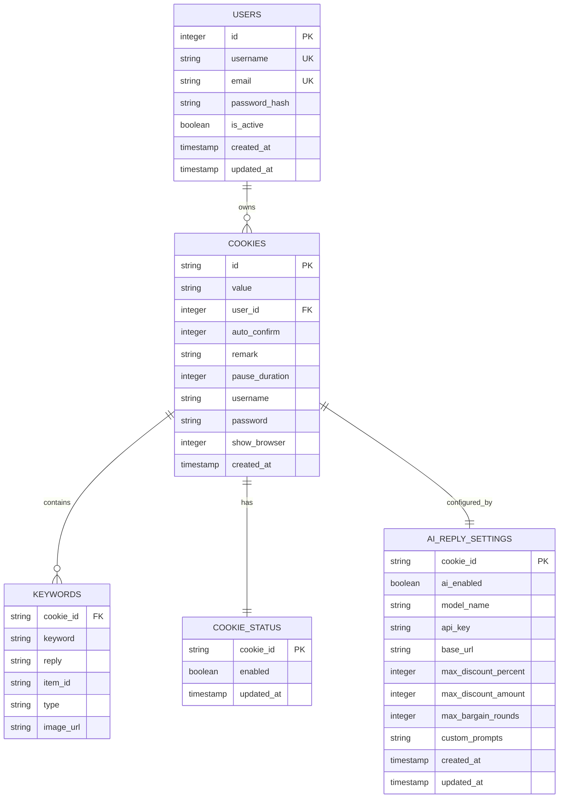
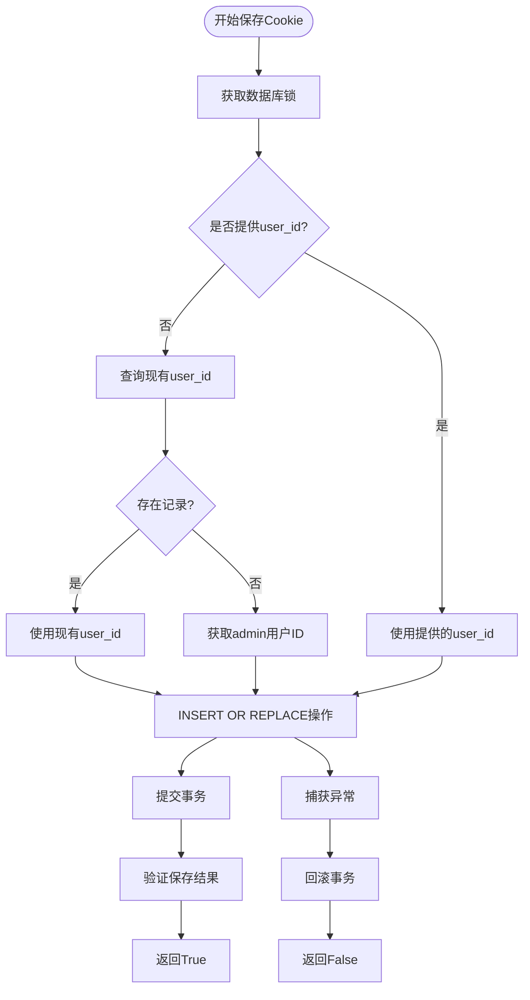
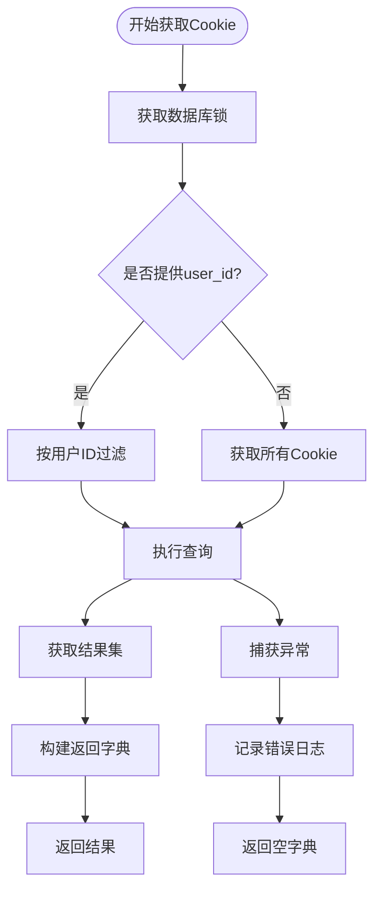
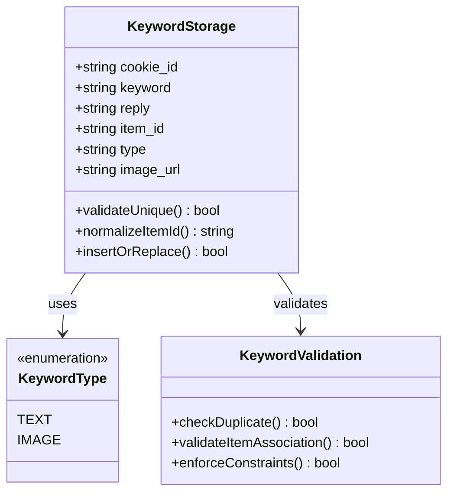
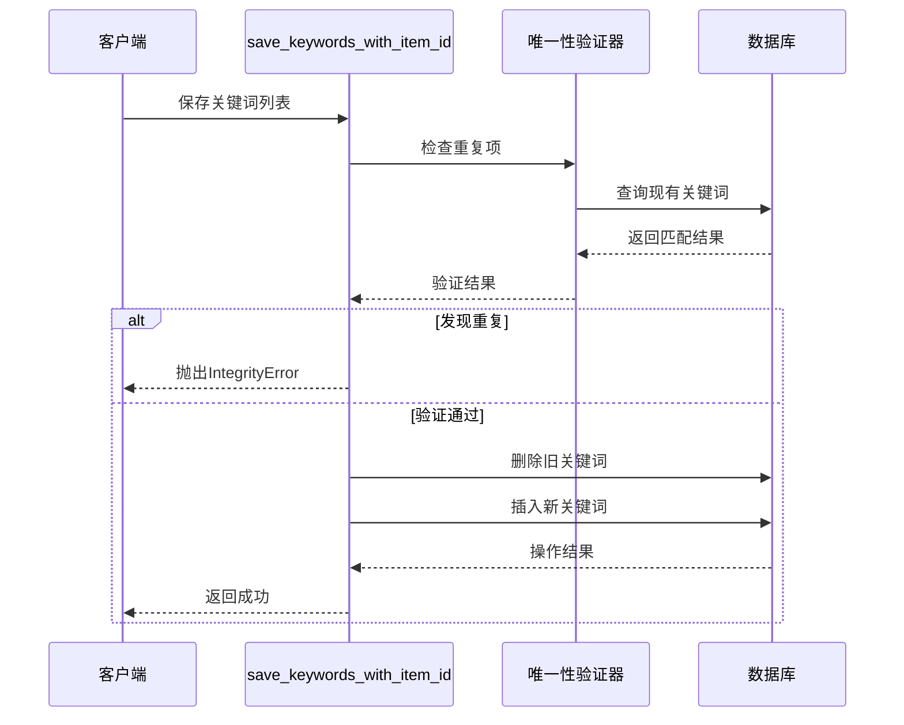
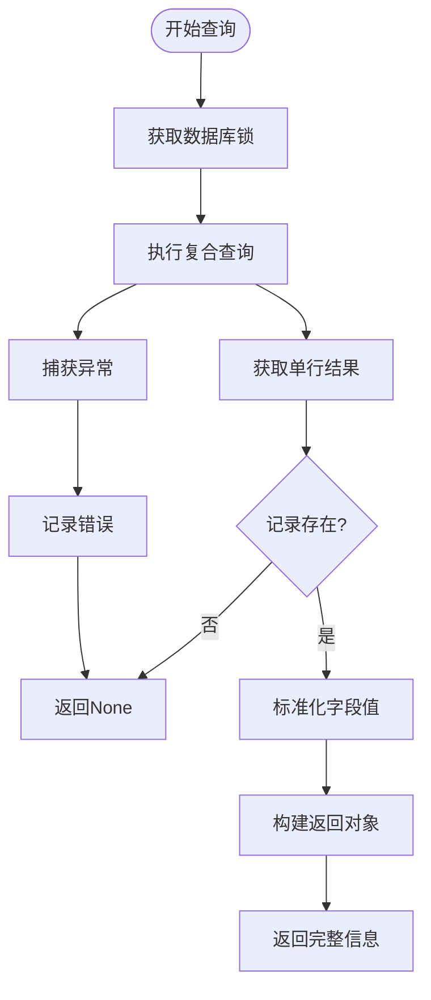
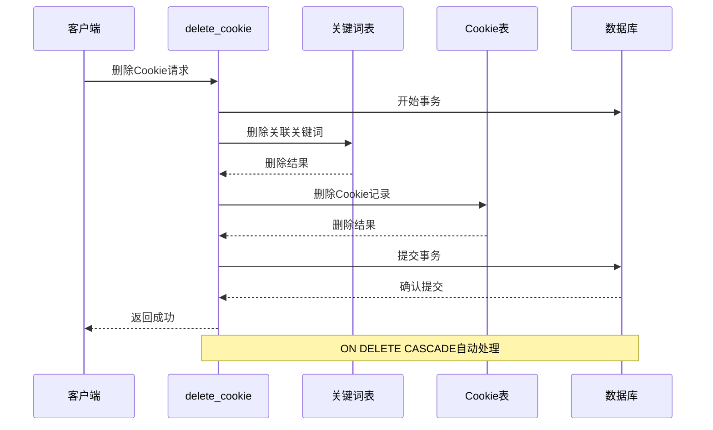
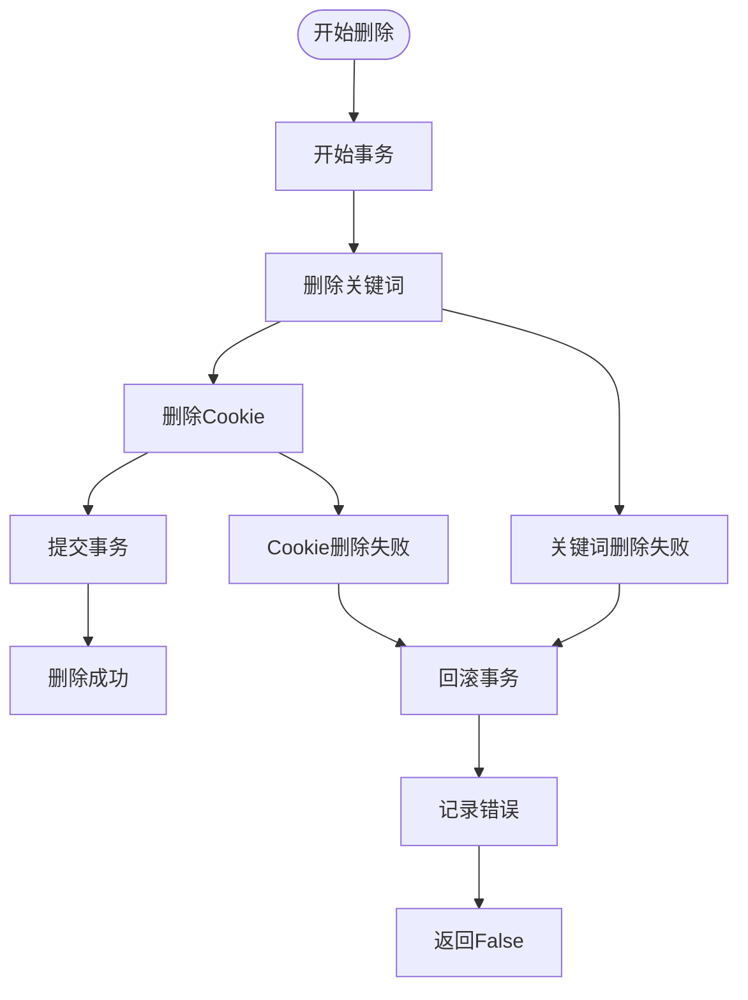
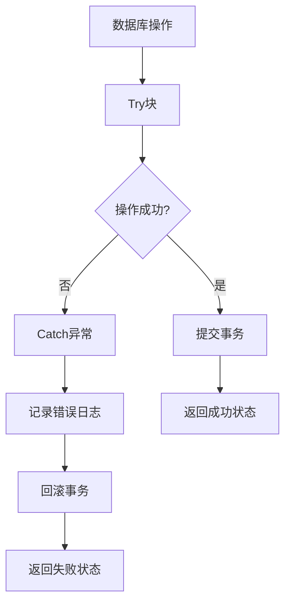

# 核心CRUD方法详解

<cite>
**本文档引用的文件**
- [db_manager.py](file://db_manager.py)
- [cookie_manager.py](file://cookie_manager.py)
- [config.py](file://config.py)
- [reply_server.py](file://reply_server.py)
</cite>

## 目录
1. [简介](#简介)
2. [数据库架构概览](#数据库架构概览)
3. [save_cookie() 方法详解](#save_cookie-方法详解)
4. [get_all_cookies() 方法详解](#get_all_cookies-方法详解)
5. [save_keywords() 方法详解](#save_keywords-方法详解)
6. [get_cookie_details() 方法详解](#get_cookie_details-方法详解)
7. [delete_cookie() 方法详解](#delete_cookie-方法详解)
8. [异常处理与性能优化](#异常处理与性能优化)
9. [调用示例与最佳实践](#调用示例与最佳实践)
10. [总结](#总结)

## 简介

本文档深入分析了 `db_manager.py` 文件中的核心CRUD（创建、读取、更新、删除）方法实现细节。这些方法构成了整个系统的数据持久化基础，负责管理Cookie数据、关键词匹配规则、用户设置等关键业务数据。

系统采用SQLite数据库作为数据存储引擎，通过线程安全的锁机制保证并发访问的安全性，并提供了完善的异常处理和性能优化策略。

## 数据库架构概览

系统的核心数据模型围绕以下几个主要实体构建：



**图表来源**
- [db_manager.py](file://db_manager.py#L73-L166)

## save_cookie() 方法详解

### 方法签名与功能

`save_cookie()` 方法是系统中最重要的数据写入方法之一，负责保存或更新Cookie数据，同时维护复杂的用户关联逻辑。

### 核心实现流程



**图表来源**
- [db_manager.py](file://db_manager.py#L1156-L1194)

### 序列化与反序列化机制

方法实现了智能的Cookie数据序列化逻辑：

1. **用户ID关联策略**：
   - 优先使用显式提供的 `user_id` 参数
   - 如果未提供，尝试从现有记录恢复
   - 最终回退到admin用户ID作为默认值

2. **数据完整性保证**：
   - 使用 `INSERT OR REPLACE` 确保数据一致性
   - 提供验证步骤确认保存结果
   - 记录详细的日志信息便于调试

### 用户关联逻辑

系统通过以下层次确保数据隔离：

1. **第一层：用户可见性** - 通过 `user_id` 字段实现基本的数据隔离
2. **第二层：权限控制** - API层面验证用户对Cookie的访问权限
3. **第三层：事务一致性** - 数据库层面保证操作的原子性

**章节来源**
- [db_manager.py](file://db_manager.py#L1156-L1194)

## get_all_cookies() 方法详解

### 分页查询实现

虽然当前实现不直接支持传统意义上的分页参数，但提供了灵活的过滤机制：



**图表来源**
- [db_manager.py](file://db_manager.py#L1225-L1237)

### 性能优化策略

1. **索引利用**：
   - `cookies` 表的 `id` 字段建立了主键索引
   - `user_id` 字段支持快速用户过滤

2. **内存优化**：
   - 使用生成器模式减少内存占用
   - 及时释放数据库连接资源

3. **并发控制**：
   - 通过 `threading.RLock()` 确保线程安全
   - 避免长时间持有锁影响性能

### 查询优化技巧

| 优化技术 | 实现方式 | 性能收益 |
|---------|---------|---------|
| 索引查询 | 主键和外键索引 | O(log n) 查询复杂度 |
| 连接优化 | INNER JOIN 替代子查询 | 减少嵌套查询开销 |
| 结果缓存 | 内存字典缓存 | 避免重复数据库访问 |
| 锁粒度控制 | 细粒度锁机制 | 提高并发性能 |

**章节来源**
- [db_manager.py](file://db_manager.py#L1225-L1237)

## save_keywords() 方法详解

### 存储结构设计

关键词匹配规则采用了多层次的存储结构，支持通用关键词和商品特定关键词的混合管理：



**图表来源**
- [db_manager.py](file://db_manager.py#L1458-L1494)

### 关键词匹配规则

1. **通用关键词**：
   - `item_id` 为 NULL 或空字符串
   - 匹配所有商品的通用回复

2. **商品特定关键词**：
   - `item_id` 指定具体商品ID
   - 提供更精确的回复内容

3. **图片关键词**：
   - `type` 字段为 'image'
   - 支持图片形式的关键词匹配

### 数据完整性保证

方法实现了严格的唯一约束检查：



**图表来源**
- [db_manager.py](file://db_manager.py#L1464-L1494)

**章节来源**
- [db_manager.py](file://db_manager.py#L1458-L1494)

## get_cookie_details() 方法详解

### 复合查询逻辑

该方法实现了复杂的多字段查询，返回Cookie的完整配置信息：



**图表来源**
- [db_manager.py](file://db_manager.py#L1267-L1288)

### 字段标准化处理

方法对查询结果进行了智能的字段标准化：

| 字段名 | 默认值 | 标准化逻辑 |
|-------|-------|-----------|
| `auto_confirm` | True | 转换为布尔值 |
| `remark` | '' | 空值转为空字符串 |
| `pause_duration` | 10 | NULL值转为默认值 |
| `username` | '' | 空值转为空字符串 |
| `password` | '' | 空值转为空字符串 |
| `show_browser` | False | 转换为布尔值 |

### 查询性能优化

1. **字段选择优化**：只查询必需的字段，减少网络传输
2. **索引利用**：`id` 字段的主键索引支持快速查找
3. **连接池管理**：复用数据库连接减少开销

**章节来源**
- [db_manager.py](file://db_manager.py#L1267-L1288)

## delete_cookie() 方法详解

### 级联删除行为

`delete_cookie()` 方法展现了系统级联删除的设计理念：



**图表来源**
- [db_manager.py](file://db_manager.py#L1196-L1211)

### 级联删除策略

1. **关键词删除**：
   - 自动删除所有与该Cookie关联的关键词
   - 保证数据的一致性和完整性

2. **状态记录删除**：
   - 删除对应的启用状态记录
   - 避免孤立的状态数据

3. **AI设置清理**：
   - 删除相关的AI回复配置
   - 清理自动回复相关的设置

### 异常处理机制

方法实现了完善的事务回滚机制：



**图表来源**
- [db_manager.py](file://db_manager.py#L1196-L1211)

**章节来源**
- [db_manager.py](file://db_manager.py#L1196-L1211)

## 异常处理与性能优化

### 异常处理策略

系统采用了多层次的异常处理机制：



### 性能监控指标

| 监控维度 | 实现方式 | 优化目标 |
|---------|---------|---------|
| SQL执行时间 | 日志记录 | 减少查询延迟 |
| 锁竞争频率 | 锁统计 | 提高并发性能 |
| 内存使用量 | 资源监控 | 避免内存泄漏 |
| 数据库连接数 | 连接池监控 | 优化连接管理 |

### 缓存策略

系统实现了多级缓存机制：

1. **内存缓存**：热点数据在内存中缓存
2. **连接缓存**：数据库连接池复用
3. **查询缓存**：结果集缓存减少重复查询

**章节来源**
- [db_manager.py](file://db_manager.py#L1150-L1154)

## 调用示例与最佳实践

### save_cookie() 调用示例

```python
# 基本用法
result = db_manager.save_cookie("cookie_001", "cookie_value_here")

# 指定用户ID
result = db_manager.save_cookie("cookie_001", "cookie_value_here", user_id=1)

# 异常处理
try:
    result = db_manager.save_cookie("cookie_001", "cookie_value_here")
    if result:
        logger.info("Cookie保存成功")
    else:
        logger.error("Cookie保存失败")
except Exception as e:
    logger.error(f"保存Cookie时发生异常: {e}")
```

### get_all_cookies() 调用示例

```python
# 获取所有Cookie
all_cookies = db_manager.get_all_cookies()

# 获取指定用户的Cookie
user_cookies = db_manager.get_all_cookies(user_id=1)

# 错误处理
try:
    cookies = db_manager.get_all_cookies()
    if not cookies:
        logger.warning("未找到任何Cookie记录")
except Exception as e:
    logger.error(f"获取Cookie列表失败: {e}")
```

### save_keywords() 调用示例

```python
# 文本关键词
keywords = [
    ("hello", "Hello! How can I help you?"),
    ("price", "Please provide the item ID for pricing.")
]
result = db_manager.save_keywords("cookie_001", keywords)

# 商品特定关键词
keywords_with_item = [
    ("discount", "Special discount available!", "item_123"),
    ("shipping", "Free shipping on this item!", "item_456")
]
result = db_manager.save_keywords_with_item_id("cookie_001", keywords_with_item)

# 图片关键词
result = db_manager.save_image_keyword("cookie_001", "logo", "https://example.com/logo.png")
```

### get_cookie_details() 调用示例

```python
# 获取Cookie详细信息
details = db_manager.get_cookie_details("cookie_001")
if details:
    logger.info(f"Cookie ID: {details['id']}")
    logger.info(f"用户ID: {details['user_id']}")
    logger.info(f"自动确认: {details['auto_confirm']}")
    logger.info(f"备注: {details['remark']}")
    logger.info(f"暂停时长: {details['pause_duration']}分钟")
else:
    logger.warning("未找到Cookie详细信息")
```

### delete_cookie() 调用示例

```python
# 删除Cookie及其关联数据
result = db_manager.delete_cookie("cookie_001")
if result:
    logger.info("Cookie删除成功，所有关联数据已清理")
else:
    logger.error("Cookie删除失败")

# 批量删除
cookies_to_delete = ["cookie_001", "cookie_002", "cookie_003"]
for cookie_id in cookies_to_delete:
    db_manager.delete_cookie(cookie_id)
    logger.info(f"已删除: {cookie_id}")
```

### 最佳实践建议

1. **事务管理**：
   - 所有写操作都应在事务中执行
   - 确保操作的原子性和一致性

2. **错误处理**：
   - 始终检查方法返回值
   - 实现适当的重试机制

3. **性能考虑**：
   - 批量操作优于单条操作
   - 合理使用索引提高查询性能

4. **安全性**：
   - 验证用户权限后再执行操作
   - 敏感数据加密存储

**章节来源**
- [db_manager.py](file://db_manager.py#L1156-L1211)
- [cookie_manager.py](file://cookie_manager.py#L184-L200)

## 总结

本文档详细分析了 `db_manager.py` 中核心CRUD方法的实现细节，涵盖了：

1. **数据持久化机制**：通过SQLite数据库提供可靠的数据存储
2. **用户隔离策略**：基于 `user_id` 字段实现多租户数据隔离
3. **事务一致性**：确保数据操作的原子性和完整性
4. **性能优化**：通过索引、缓存和连接池提升系统性能
5. **异常处理**：完善的错误处理和恢复机制

这些方法构成了系统数据层的基础，为上层业务逻辑提供了稳定可靠的数据服务。开发者在使用这些方法时，应当遵循最佳实践，注意异常处理和性能优化，确保系统的稳定性和可维护性。