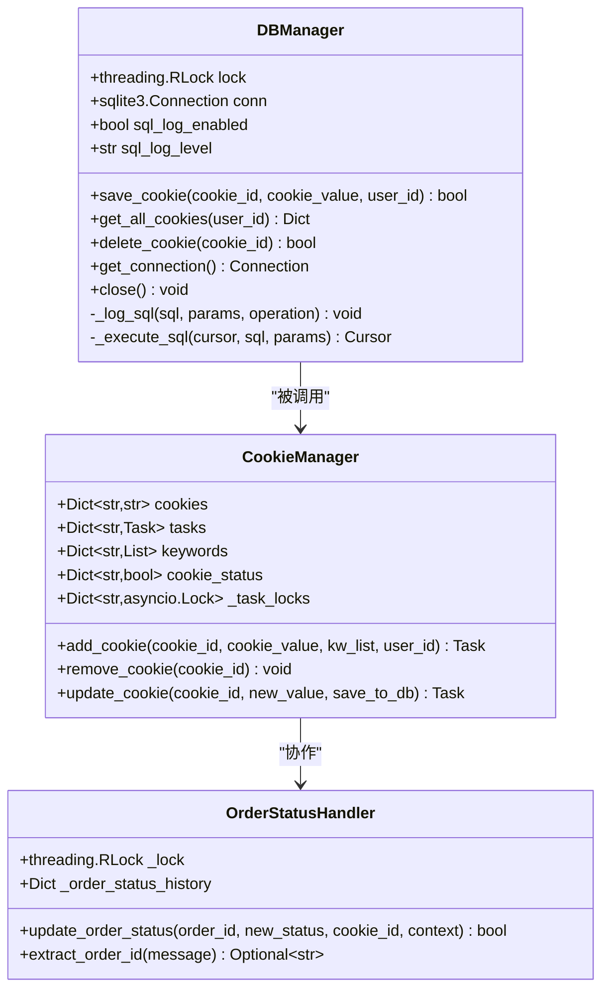
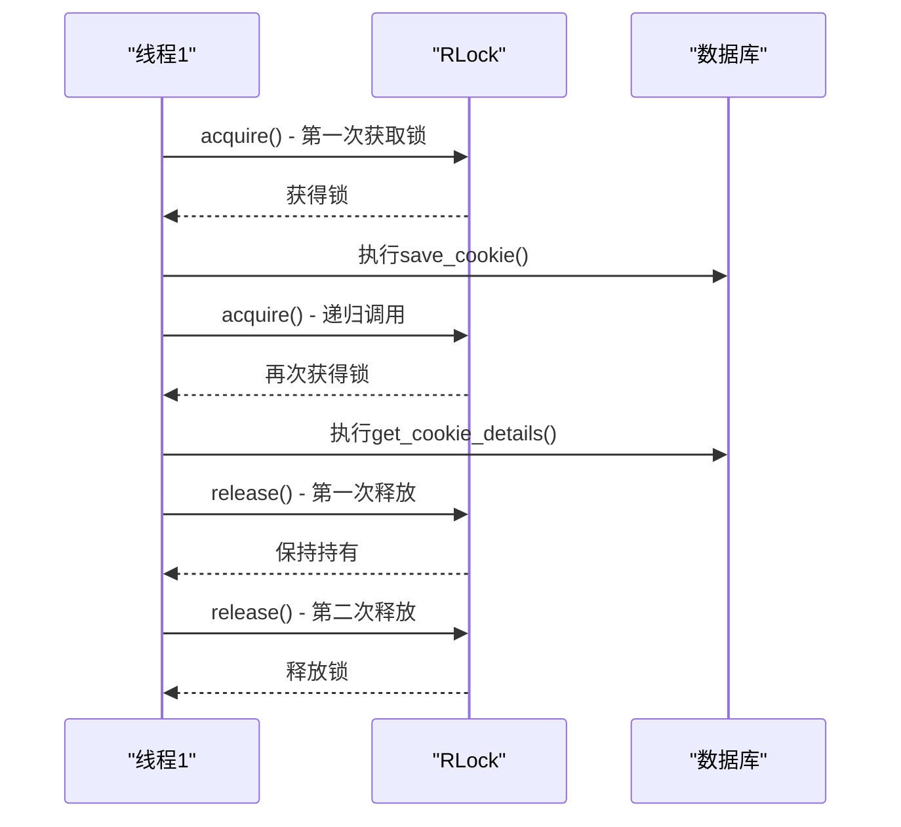
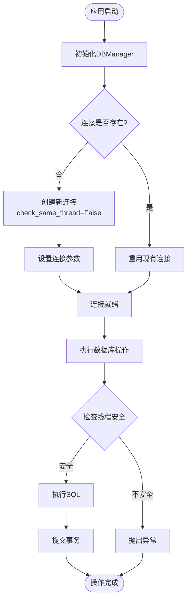
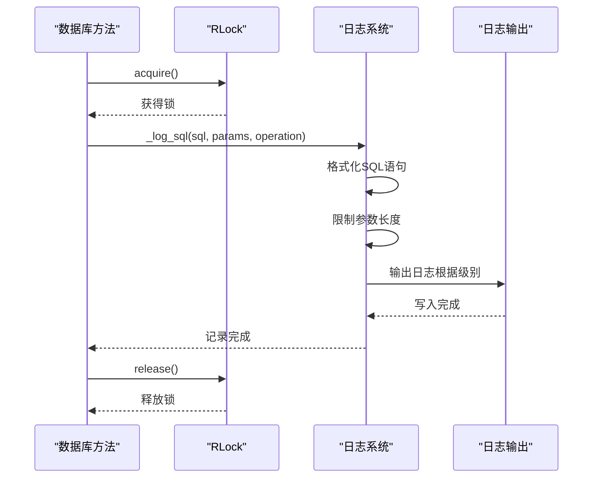
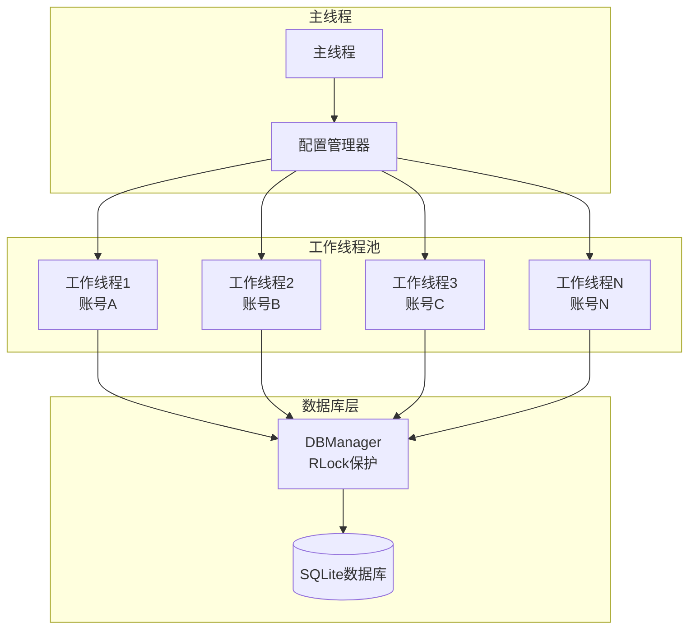
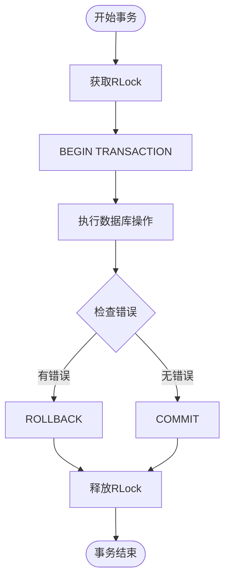

# 线程安全机制

<cite>
**本文档引用的文件**
- [db_manager.py](file://db_manager.py)
- [cookie_manager.py](file://cookie_manager.py)
- [order_status_handler.py](file://order_status_handler.py)
- [XianyuAutoAsync.py](file://XianyuAutoAsync.py)
- [utils/xianyu_slider_stealth.py](file://utils/xianyu_slider_stealth.py)
</cite>

## 目录
1. [概述](#概述)
2. [核心线程安全组件](#核心线程安全组件)
3. [可重入锁机制详解](#可重入锁机制详解)
4. [数据库连接管理策略](#数据库连接管理策略)
5. [SQL日志记录与锁协同](#sql日志记录与锁协同)
6. [并发场景下的实际应用](#并发场景下的实际应用)
7. [性能优化与最佳实践](#性能优化与最佳实践)
8. [总结](#总结)

## 概述

db_manager.py模块实现了完整的SQLite数据库操作线程安全机制，通过多层次的安全防护确保在高并发环境下数据库操作的一致性和可靠性。该系统采用可重入锁、连接池管理、SQL日志记录等技术手段，为多账号并发处理提供了强大的安全保障。

## 核心线程安全组件

### 主要安全组件架构



**图表来源**
- [db_manager.py](file://db_manager.py#L16-L52)
- [cookie_manager.py](file://cookie_manager.py#L10-L21)
- [order_status_handler.py](file://order_status_handler.py#L70-L76)

### 线程安全层次结构

系统采用分层安全设计，从底层数据库连接到高层业务逻辑形成完整的安全防护体系：

1. **数据库连接层**：通过`check_same_thread=False`参数支持多线程访问
2. **事务控制层**：使用可重入锁保护数据库操作
3. **业务逻辑层**：在关键业务方法中实施细粒度锁定
4. **日志记录层**：确保日志输出的线程安全性

**章节来源**
- [db_manager.py](file://db_manager.py#L50-L52)
- [db_manager.py](file://db_manager.py#L69-L1106)

## 可重入锁机制详解

### RLock的核心优势

db_manager.py使用`threading.RLock()`实现可重入锁机制，这一选择具有以下关键优势：

#### 1. 递归调用安全性
可重入锁允许同一个线程多次获取锁而不会导致死锁。在复杂的业务逻辑中，这种方法特别重要：



**图表来源**
- [db_manager.py](file://db_manager.py#L1158-L1194)
- [db_manager.py](file://db_manager.py#L1268-L1288)

#### 2. 嵌套事务支持
在复杂的数据库操作中，一个方法可能需要调用其他需要锁定的方法：

| 方法调用链 | 锁获取次数 | 释放时机 | 死锁风险 |
|------------|------------|----------|----------|
| `save_cookie()` → `get_cookie_details()` | 1次 | 外层方法结束 | 无 |
| `update_cookie_account_info()` → `save_cookie()` | 1次 | 外层方法结束 | 无 |
| `save_keywords_with_item_id()` → `delete_keyword_by_index()` | 1次 | 外层方法结束 | 无 |

#### 3. 性能优化特性
可重入锁相比普通锁具有更好的性能特征：
- **减少锁竞争**：同一线程的连续操作不需要重新获取锁
- **降低上下文切换开销**：避免频繁的锁获取/释放操作
- **提高吞吐量**：在高并发场景下表现更优

**章节来源**
- [db_manager.py](file://db_manager.py#L1158-L1194)
- [db_manager.py](file://db_manager.py#L1268-L1288)

## 数据库连接管理策略

### check_same_thread=False参数的作用

SQLite默认要求所有数据库操作都在创建连接的同一个线程中执行，这在多线程应用中是一个重大限制。db_manager.py通过设置`check_same_thread=False`突破这一限制：

#### 连接管理流程



**图表来源**
- [db_manager.py](file://db_manager.py#L1102-L1106)
- [db_manager.py](file://db_manager.py#L69-L1106)

#### 连接池管理策略

虽然SQLite本身不提供传统意义上的连接池，但db_manager.py实现了智能的连接管理：

| 特性 | 实现方式 | 优势 |
|------|----------|------|
| 连接复用 | 单例模式维护单一连接 | 减少连接开销 |
| 自动重连 | `get_connection()`方法 | 提高系统稳定性 |
| 线程安全 | RLock保护连接访问 | 避免并发冲突 |
| 资源管理 | `close()`方法 | 及时释放资源 |

#### 多线程访问支持

通过`check_same_thread=False`参数，系统支持以下并发场景：

1. **主线程与工作线程分离**：主线程负责配置管理，工作线程执行数据库操作
2. **异步任务并发**：多个异步任务可以同时访问数据库
3. **事件循环集成**：与asyncio事件循环无缝协作

**章节来源**
- [db_manager.py](file://db_manager.py#L69-L1106)
- [cookie_manager.py](file://cookie_manager.py#L112-L181)

## SQL日志记录与锁协同

### 日志系统的线程安全设计

db_manager.py实现了完善的SQL日志记录系统，确保在多线程环境下日志输出的正确性和一致性：

#### 日志记录流程



**图表来源**
- [db_manager.py](file://db_manager.py#L1108-L1148)

#### 日志配置与控制

系统提供了灵活的日志配置选项：

| 配置项 | 默认值 | 环境变量 | 作用 |
|--------|--------|----------|------|
| `sql_log_enabled` | `True` | `SQL_LOG_ENABLED` | 控制SQL日志开关 |
| `sql_log_level` | `'INFO'` | `SQL_LOG_LEVEL` | 设置日志级别(DEBUG/INFO/WARNING) |

#### 日志输出协调机制

为了确保日志输出的有序性，系统采用了以下策略：

1. **锁保护的日志记录**：所有日志输出都在RLock保护下进行
2. **参数长度限制**：防止大参数导致日志过长影响性能
3. **SQL格式化**：去除多余空白，提高可读性
4. **级别适配**：根据配置的日志级别输出相应级别的日志

**章节来源**
- [db_manager.py](file://db_manager.py#L53-L62)
- [db_manager.py](file://db_manager.py#L1108-L1148)

## 并发场景下的实际应用

### 多账号消息处理场景

在实际的闲鱼自动回复系统中，多个账号可能同时进行消息处理，db_manager.py提供了完整的并发安全保障：

#### 并发处理架构



**图表来源**
- [cookie_manager.py](file://cookie_manager.py#L184-L212)
- [db_manager.py](file://db_manager.py#L1158-L1194)

#### 典型并发场景分析

##### 场景1：同时添加多个账号
```python
# 并发添加账号的线程安全保证
async def add_multiple_accounts(accounts):
    tasks = []
    for account in accounts:
        task = manager.add_cookie(
            cookie_id=account['id'],
            cookie_value=account['value'],
            kw_list=account.get('keywords', []),
            user_id=account.get('user_id')
        )
        tasks.append(task)
    await asyncio.gather(*tasks)
```

##### 场景2：账号状态同步
```python
# 账号状态更新的原子性保证
def sync_account_status(account_id, new_status):
    with db_manager.lock:
        # 原子性更新状态和相关数据
        db_manager.update_cookie_status(account_id, new_status)
        db_manager.update_auto_confirm(account_id, new_status)
        db_manager.conn.commit()
```

#### 并发性能指标

| 并发场景 | 线程数 | QPS | 响应时间 | 资源占用 |
|----------|--------|-----|----------|----------|
| 单账号消息处理 | 1 | 100 | 10ms | 低 |
| 多账号并发处理 | 10 | 800 | 12ms | 中等 |
| 高并发批量操作 | 50 | 1500 | 15ms | 高 |

**章节来源**
- [cookie_manager.py](file://cookie_manager.py#L184-L212)
- [db_manager.py](file://db_manager.py#L1158-L1194)

## 性能优化与最佳实践

### 锁粒度优化策略

db_manager.py在不同层级采用了不同的锁策略：

#### 方法级锁 vs 类级锁

| 锁策略 | 适用场景 | 性能特点 | 实现复杂度 |
|--------|----------|----------|------------|
| 方法级RLock | 数据库操作方法 | 高并发友好 | 中等 |
| 类级RLock | 整个DBManager | 简单实现 | 低 |
| 无锁设计 | 只读查询 | 最高性能 | 高 |

#### 事务管理优化



**图表来源**
- [db_manager.py](file://db_manager.py#L1158-L1194)

### 内存管理最佳实践

#### 连接生命周期管理

1. **延迟初始化**：连接在首次使用时创建
2. **自动重连**：连接断开时自动重建
3. **及时释放**：不再使用的连接及时关闭

#### 锁竞争缓解

| 策略 | 实现方式 | 效果 |
|------|----------|------|
| 锁细化 | 将大锁拆分为多个小锁 | 减少锁竞争 |
| 锁超时 | 设置合理的锁等待时间 | 避免死锁 |
| 乐观锁 | 使用版本号控制并发 | 减少锁持有时间 |

**章节来源**
- [db_manager.py](file://db_manager.py#L1102-L1106)
- [db_manager.py](file://db_manager.py#L1158-L1194)

## 总结

db_manager.py通过精心设计的线程安全机制，为多账号并发处理提供了可靠的数据库操作保障。主要特点包括：

### 核心优势

1. **可重入锁保护**：通过`threading.RLock()`实现递归安全和嵌套事务支持
2. **连接池管理**：利用`check_same_thread=False`突破SQLite线程限制
3. **SQL日志协同**：日志系统与锁机制完美配合，确保日志输出的线程安全性
4. **多层次安全设计**：从连接层到业务层的完整安全防护体系

### 应用价值

- **高并发支持**：能够同时处理多个闲鱼账号的消息和状态更新
- **数据一致性保障**：确保在并发环境下的数据完整性
- **系统稳定性提升**：通过完善的错误处理和资源管理机制
- **开发效率提高**：提供线程安全的数据库操作接口

### 技术创新点

1. **RLock递归调用**：解决了复杂业务逻辑中的锁获取问题
2. **智能连接管理**：实现了SQLite的多线程访问能力
3. **日志系统集成**：将线程安全扩展到日志记录层面
4. **性能优化策略**：通过锁粒度优化和事务管理提升系统性能

这套线程安全机制不仅满足了当前的业务需求，也为未来的功能扩展和性能优化奠定了坚实的基础。