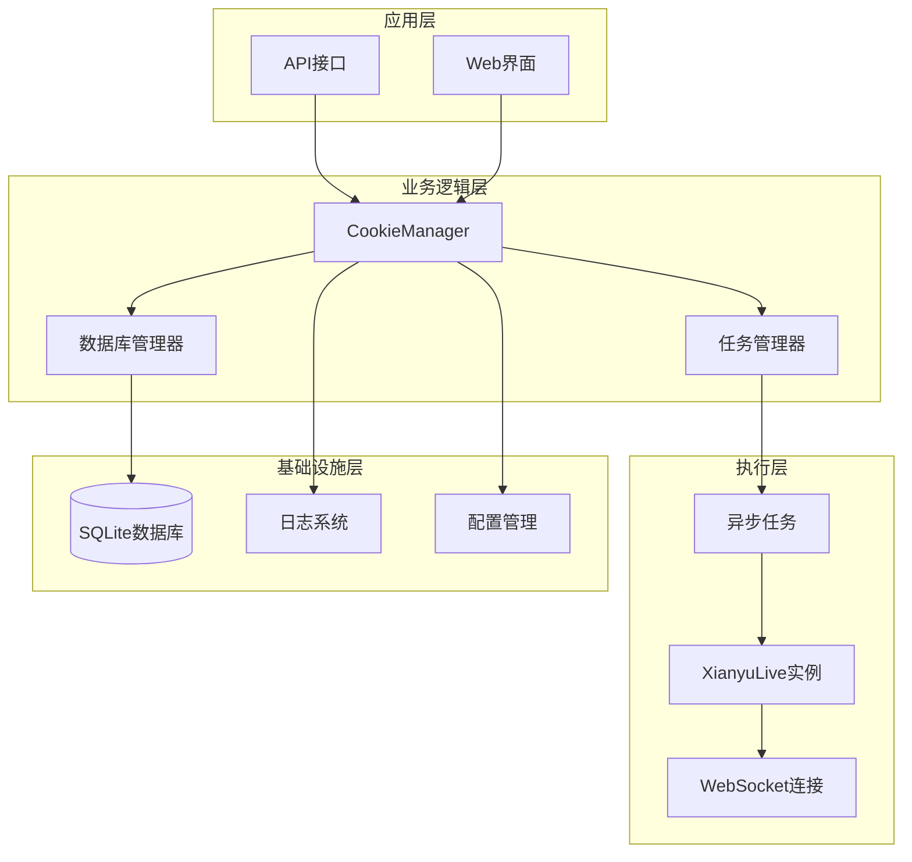
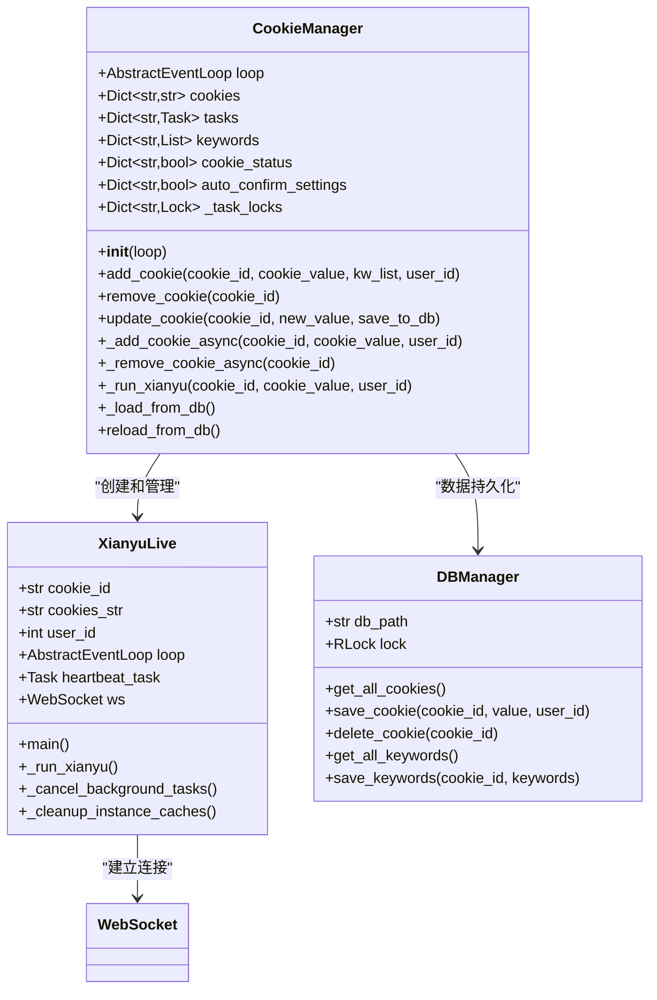
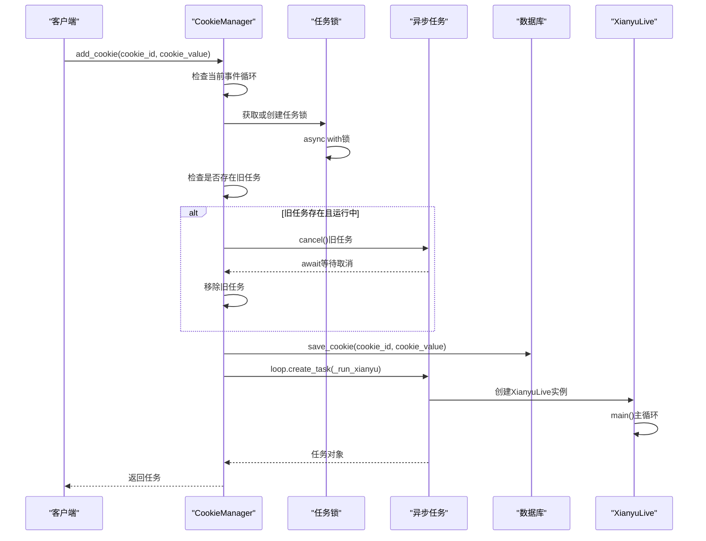
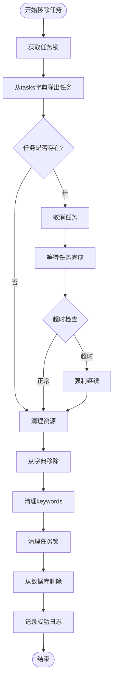
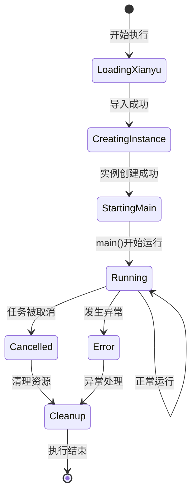
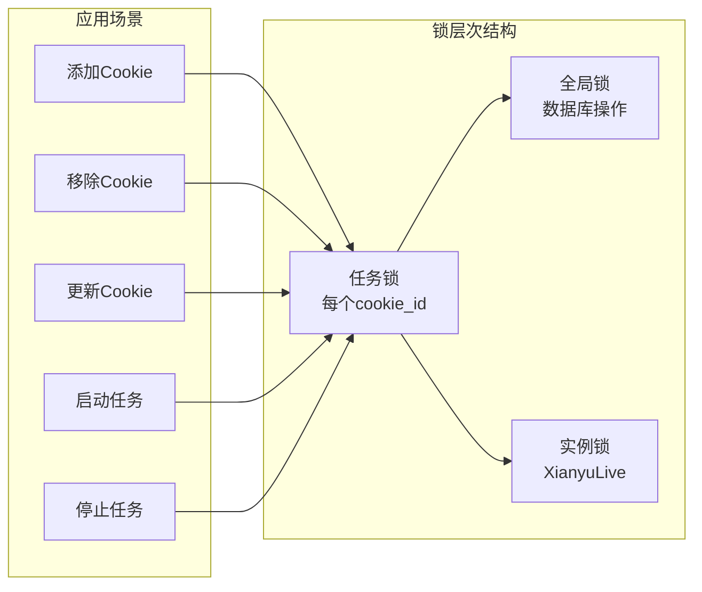
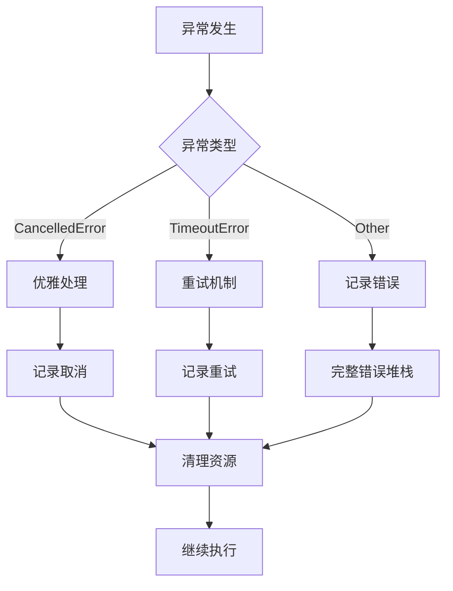

# 任务生命周期管理

<cite>
**本文档中引用的文件**
- [cookie_manager.py](file://cookie_manager.py)
- [XianyuAutoAsync.py](file://XianyuAutoAsync.py)
- [db_manager.py](file://db_manager.py)
</cite>

## 目录
1. [简介](#简介)
2. [系统架构概览](#系统架构概览)
3. [核心组件分析](#核心组件分析)
4. [任务生命周期详解](#任务生命周期详解)
5. [线程安全机制](#线程安全机制)
6. [异常处理与日志记录](#异常处理与日志记录)
7. [性能优化策略](#性能优化策略)
8. [故障排除指南](#故障排除指南)
9. [总结](#总结)

## 简介

CookieManager是闲鱼自动回复系统的核心组件，负责管理多个闲鱼账号的Cookie及其对应的任务生命周期。该系统采用异步编程模型，通过精心设计的线程安全机制和任务管理策略，确保多个账号任务能够稳定、高效地并发运行。

本文档深入解析CookieManager中闲鱼账号任务的全生命周期管理机制，重点关注`_add_cookie_async`和`_remove_cookie_async`两个核心异步方法的实现原理，以及它们如何通过`asyncio.Lock`确保线程安全，优雅地管理任务的创建、运行和销毁过程。

## 系统架构概览

CookieManager采用分层架构设计，主要包含以下几个层次：

**图表来源**
- [cookie_manager.py](file://cookie_manager.py#L9-L428)
- [XianyuAutoAsync.py](file://XianyuAutoAsync.py#L158-L8372)

**章节来源**
- [cookie_manager.py](file://cookie_manager.py#L9-L428)

## 核心组件分析

### CookieManager类结构

CookieManager类是整个系统的核心控制器，负责协调各个组件的工作：

**图表来源**
- [cookie_manager.py](file://cookie_manager.py#L9-L428)
- [XianyuAutoAsync.py](file://XianyuAutoAsync.py#L158-L8372)
- [db_manager.py](file://db_manager.py#L16-L200)

### 数据结构设计

CookieManager维护了多个关键的数据结构来管理任务状态：

| 数据结构 | 类型 | 用途 | 生命周期 |
|---------|------|------|----------|
| `cookies` | `Dict[str, str]` | 存储账号Cookie值 | 应用运行期间 |
| `tasks` | `Dict[str, asyncio.Task]` | 存储活跃任务对象 | 任务运行期间 |
| `keywords` | `Dict[str, List[Tuple[str, str]]]` | 存储回复关键字 | 应用运行期间 |
| `cookie_status` | `Dict[str, bool]` | 存储账号启用状态 | 应用运行期间 |
| `auto_confirm_settings` | `Dict[str, bool]` | 存储自动确认设置 | 应用运行期间 |
| `_task_locks` | `Dict[str, asyncio.Lock]` | 任务级互斥锁 | 应用运行期间 |

**章节来源**
- [cookie_manager.py](file://cookie_manager.py#L12-L20)

## 任务生命周期详解

### _add_cookie_async方法深度解析

`_add_cookie_async`是任务创建的核心方法，实现了完整的任务生命周期管理：

**图表来源**
- [cookie_manager.py](file://cookie_manager.py#L111-L152)

#### 核心实现要点

1. **任务锁机制**：使用`asyncio.Lock`确保同一账号的任务不会重复创建
2. **旧任务清理**：智能检测并清理已存在的任务，避免资源泄漏
3. **数据库同步**：确保Cookie值及时持久化到数据库
4. **任务创建**：通过`loop.create_task()`创建新的异步任务

**章节来源**
- [cookie_manager.py](file://cookie_manager.py#L111-L152)

### _remove_cookie_async方法深度解析

`_remove_cookie_async`负责优雅地终止和清理任务：

**图表来源**
- [cookie_manager.py](file://cookie_manager.py#L154-L180)

#### 关键特性

1. **优雅取消**：使用`await asyncio.wait_for()`设置超时，避免无限等待
2. **资源清理**：确保所有相关资源都被正确释放
3. **异常处理**：妥善处理各种异常情况，包括超时和取消
4. **原子性操作**：确保清理过程的完整性

**章节来源**
- [cookie_manager.py](file://cookie_manager.py#L154-L180)

### _run_xianyu协程实现

`_run_xianyu`是任务的实际执行体，负责启动和监控XianyuLive实例：

**图表来源**
- [cookie_manager.py](file://cookie_manager.py#L59-L109)

**章节来源**
- [cookie_manager.py](file://cookie_manager.py#L59-L109)

## 线程安全机制

### asyncio.Lock的应用

CookieManager使用细粒度的锁机制确保线程安全：

**图表来源**
- [cookie_manager.py](file://cookie_manager.py#L112-L118)
- [cookie_manager.py](file://cookie_manager.py#L156-L162)

### 线程安全接口设计

CookieManager提供了两套线程安全接口：

#### add_cookie方法
- **同线程场景**：直接使用`loop.create_task()`
- **跨线程场景**：使用`asyncio.run_coroutine_threadsafe()`

#### remove_cookie方法
- **同线程场景**：直接调度异步方法
- **跨线程场景**：通过`run_coroutine_threadsafe`在目标线程中执行

**章节来源**
- [cookie_manager.py](file://cookie_manager.py#L183-L211)

## 异常处理与日志记录

### 异常处理策略

系统采用多层次的异常处理机制：

**图表来源**
- [cookie_manager.py](file://cookie_manager.py#L85-L96)
- [cookie_manager.py](file://cookie_manager.py#L127-L130)

### 日志记录最佳实践

1. **分级日志**：使用不同的日志级别记录不同类型的信息
2. **上下文信息**：在日志中包含cookie_id等关键上下文
3. **异常堆栈**：重要异常包含完整的堆栈信息
4. **资源清理**：确保异常情况下也能正确清理资源

**章节来源**
- [cookie_manager.py](file://cookie_manager.py#L61-L109)

## 性能优化策略

### 任务池化

系统通过以下策略优化性能：

1. **延迟导入**：`XianyuLive`采用延迟导入，减少启动时间
2. **任务复用**：合理管理任务生命周期，避免频繁创建销毁
3. **资源预分配**：提前分配必要的资源，减少运行时开销
4. **异步I/O**：充分利用异步特性，提高并发性能

### 内存管理

1. **弱引用**：对大型对象使用弱引用避免内存泄漏
2. **定期清理**：实现定期清理机制，释放不再使用的资源
3. **缓存策略**：合理使用缓存，平衡内存使用和性能

## 故障排除指南

### 常见问题及解决方案

| 问题类型 | 症状 | 可能原因 | 解决方案 |
|---------|------|----------|----------|
| 任务创建失败 | 任务未启动 | Cookie无效 | 检查Cookie有效性 |
| 任务频繁重启 | 任务不稳定 | 网络问题 | 检查网络连接 |
| 内存泄漏 | 内存持续增长 | 资源未释放 | 检查清理逻辑 |
| 线程死锁 | 程序无响应 | 锁顺序错误 | 重构锁获取顺序 |

### 调试技巧

1. **启用详细日志**：设置日志级别为DEBUG获取详细信息
2. **监控任务状态**：定期检查tasks字典的状态
3. **资源使用监控**：监控内存和CPU使用情况
4. **异常捕获**：全面捕获和记录异常信息

**章节来源**
- [cookie_manager.py](file://cookie_manager.py#L43-L56)

## 总结

CookieManager通过精心设计的架构和完善的机制，实现了闲鱼账号任务的全生命周期管理。其核心特点包括：

1. **线程安全**：通过`asyncio.Lock`和细粒度锁机制确保多线程环境下的安全性
2. **优雅管理**：提供完整的任务生命周期管理，包括创建、运行、暂停和清理
3. **异常处理**：完善的异常处理和恢复机制，提高系统稳定性
4. **性能优化**：采用异步编程和资源池化技术，最大化系统性能
5. **可观测性**：丰富的日志记录和监控能力，便于问题诊断和性能优化

这种设计模式不仅适用于闲鱼自动回复系统，也为类似的多任务管理系统提供了优秀的参考实现。