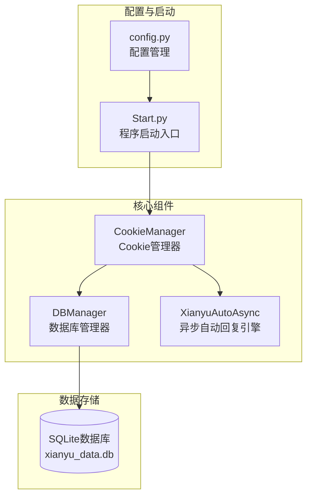
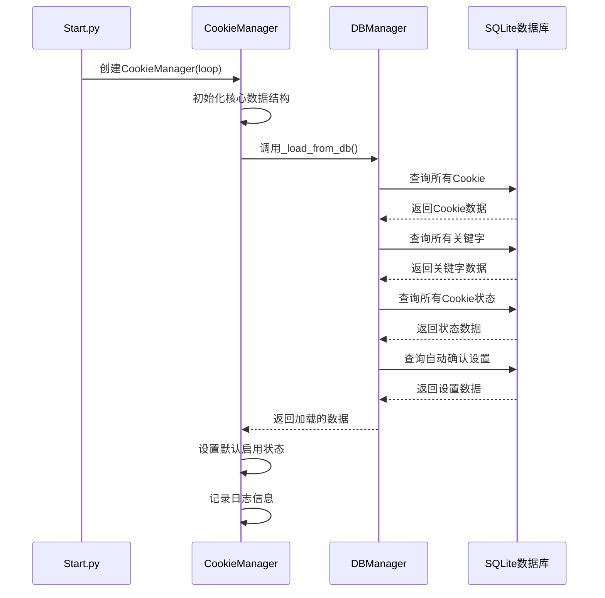
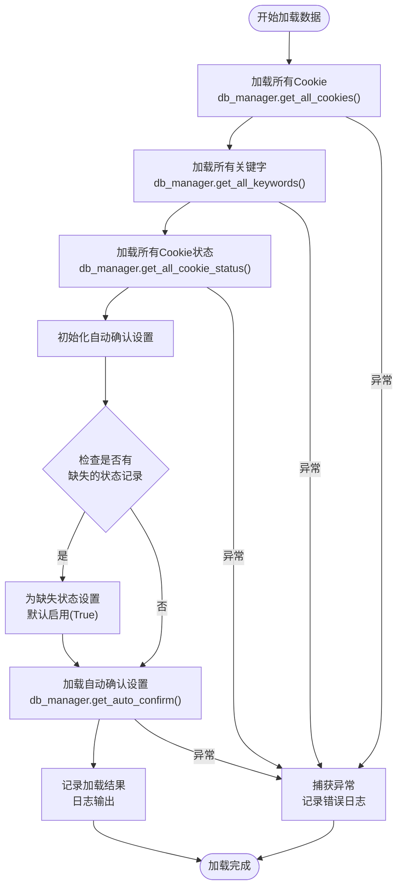
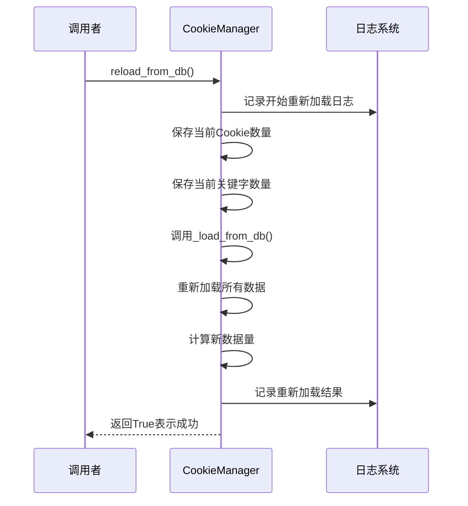
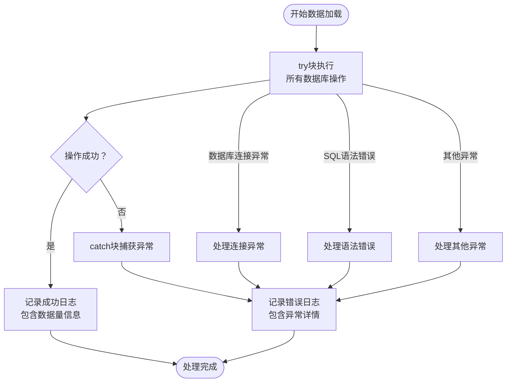

# 初始化与数据加载

<cite>
**本文档引用的文件**
- [cookie_manager.py](file://cookie_manager.py)
- [db_manager.py](file://db_manager.py)
- [Start.py](file://Start.py)
- [config.py](file://config.py)
</cite>

## 目录
1. [简介](#简介)
2. [项目结构概览](#项目结构概览)
3. [CookieManager类初始化](#cookiemanager类初始化)
4. [核心数据结构详解](#核心数据结构详解)
5. [数据加载机制](#数据加载机制)
6. [reload_from_db方法](#reload_from_db方法)
7. [异常处理机制](#异常处理机制)
8. [实际应用示例](#实际应用示例)
9. [总结](#总结)

## 简介

CookieManager类是整个系统的核心组件之一，负责管理多个账号的Cookie及其相关的任务、关键字、状态等数据。本文档将深入解析CookieManager类的初始化过程及其数据加载机制，帮助开发者理解系统的启动流程和数据管理策略。

## 项目结构概览

系统采用模块化设计，主要包含以下关键组件：



**图表来源**
- [Start.py](file://Start.py#L524-L526)
- [cookie_manager.py](file://cookie_manager.py#L12-L20)
- [db_manager.py](file://db_manager.py#L16-L51)

## CookieManager类初始化

### 初始化流程概述

CookieManager的初始化是一个精心设计的过程，确保系统能够正确加载所有必要的数据并建立稳定的工作状态。



**图表来源**
- [Start.py](file://Start.py#L524-L526)
- [cookie_manager.py](file://cookie_manager.py#L12-L20)
- [cookie_manager.py](file://cookie_manager.py#L23-L42)

### __init__方法实现

CookieManager的构造函数接收事件循环对象并初始化所有核心数据结构：

**节来源**
- [cookie_manager.py](file://cookie_manager.py#L12-L20)

#### 核心数据结构初始化

1. **事件循环管理**：接收传入的asyncio.AbstractEventLoop对象
2. **Cookie存储**：`Dict[str, str]`类型，存储Cookie ID到Cookie值的映射
3. **任务管理**：`Dict[str, asyncio.Task]`类型，管理各个Cookie对应的任务
4. **关键字管理**：`Dict[str, List[Tuple[str, str]]]`类型，存储每个Cookie的关键字列表
5. **状态管理**：`Dict[str, bool]`类型，跟踪每个Cookie的启用状态
6. **自动确认设置**：`Dict[str, bool]`类型，管理自动确认发货功能
7. **任务锁管理**：`Dict[str, asyncio.Lock]`类型，防止重复创建任务

#### 数据加载触发

初始化过程中，`__init__`方法会立即调用`_load_from_db()`方法，这是系统启动时最重要的数据加载步骤。

**节来源**
- [cookie_manager.py](file://cookie_manager.py#L19-L20)

## 核心数据结构详解

### cookies字典

cookies字典是系统的核心数据结构，存储所有已知Cookie的基本信息：

| 属性 | 类型 | 描述 |
|------|------|------|
| 键 | str | Cookie ID，唯一标识符 |
| 值 | str | 实际的Cookie字符串值 |

### tasks字典

tasks字典管理所有正在运行的异步任务：

| 属性 | 类型 | 描述 |
|------|------|------|
| 键 | str | Cookie ID |
| 值 | asyncio.Task | 对应的异步任务对象 |

### keywords字典

keywords字典存储每个Cookie的回复关键字配置：

| 属性 | 类型 | 描述 |
|------|------|------|
| 键 | str | Cookie ID |
| 值 | List[Tuple[str, str]] | 关键字-回复内容对列表 |

### cookie_status字典

cookie_status字典跟踪每个Cookie的启用状态：

| 属性 | 类型 | 描述 |
|------|------|------|
| 键 | str | Cookie ID |
| 值 | bool | 启用状态（True表示启用） |

### auto_confirm_settings字典

auto_confirm_settings字典管理自动确认发货功能：

| 属性 | 类型 | 描述 |
|------|------|------|
| 键 | str | Cookie ID |
| 值 | bool | 自动确认状态（True表示启用） |

### _task_locks字典

_task_locks字典提供线程安全的任务管理：

| 属性 | 类型 | 描述 |
|------|------|------|
| 键 | str | Cookie ID |
| 值 | asyncio.Lock | 任务锁对象 |

## 数据加载机制

### _load_from_db方法详解

`_load_from_db`方法是CookieManager的核心数据加载逻辑，它从数据库中获取所有必要的配置信息。



**图表来源**
- [cookie_manager.py](file://cookie_manager.py#L23-L42)

### 数据加载步骤详解

#### 1. Cookie数据加载

通过`db_manager.get_all_cookies()`方法从cookies表中获取所有Cookie信息。该方法支持用户隔离，可以根据user_id参数过滤特定用户的数据。

**节来源**
- [cookie_manager.py](file://cookie_manager.py#L26-L27)
- [db_manager.py](file://db_manager.py#L1224-L1236)

#### 2. 关键字数据加载

通过`db_manager.get_all_keywords()`方法从keywords表中获取所有关键字配置。系统会自动将相同Cookie ID的关键字组合成列表。

**节来源**
- [cookie_manager.py](file://cookie_manager.py#L28-L29)
- [db_manager.py](file://db_manager.py#L1694-L1719)

#### 3. Cookie状态加载

通过`db_manager.get_all_cookie_status()`方法从cookie_status表中获取所有Cookie的启用状态。对于数据库中不存在的状态记录，系统会自动设置默认启用状态。

**节来源**
- [cookie_manager.py](file://cookie_manager.py#L30-L31)
- [db_manager.py](file://db_manager.py#L1748-L1763)

#### 4. 自动确认设置加载

系统会为每个Cookie加载自动确认发货设置，并将其存储在auto_confirm_settings字典中。

**节来源**
- [cookie_manager.py](file://cookie_manager.py#L38-L39)
- [db_manager.py](file://db_manager.py#L1442-L1454)

### 默认状态处理机制

系统实现了智能的默认状态处理机制：

1. **状态缺失处理**：对于数据库中没有状态记录的Cookie，自动设置为启用状态
2. **一致性保证**：确保所有Cookie都有明确的状态定义
3. **向后兼容**：新添加的功能不会影响已有数据的完整性

**节来源**
- [cookie_manager.py](file://cookie_manager.py#L35-L37)

## reload_from_db方法

### 功能概述

`reload_from_db`方法提供了在运行时重新加载数据库数据的能力，主要用于备份恢复、配置更新等场景。



**图表来源**
- [cookie_manager.py](file://cookie_manager.py#L44-L56)

### 数据量监控

reload_from_db方法实现了精确的数据量监控：

1. **加载前统计**：记录重新加载前的Cookie数量和关键字组数
2. **加载后统计**：记录重新加载后的数据量
3. **差异对比**：计算并记录数据量的变化情况

**节来源**
- [cookie_manager.py](file://cookie_manager.py#L47-L54)

### 应用场景

reload_from_db方法适用于以下场景：

1. **备份恢复**：从备份文件恢复数据后刷新本地缓存
2. **配置更新**：数据库配置发生变化时同步更新
3. **故障恢复**：系统异常后重新同步数据状态

**节来源**
- [cookie_manager.py](file://cookie_manager.py#L45-L46)

## 异常处理机制

### 加载过程中的异常处理

CookieManager在数据加载过程中实现了完善的异常处理机制：



**图表来源**
- [cookie_manager.py](file://cookie_manager.py#L41-L42)

### 异常处理策略

1. **日志记录**：详细的错误信息记录，便于问题诊断
2. **优雅降级**：即使部分数据加载失败，系统仍能继续运行
3. **状态保持**：异常情况下保持原有数据不变

**节来源**
- [cookie_manager.py](file://cookie_manager.py#L41-L42)

## 实际应用示例

### 启动时的初始化流程

以下是系统启动时CookieManager初始化的实际执行流程：

1. **事件循环准备**：Start.py获取当前运行的事件循环
2. **CookieManager创建**：传入事件循环对象创建管理器实例
3. **数据加载触发**：自动调用_load_from_db()方法
4. **任务启动**：遍历加载的Cookie并启动相应的异步任务

**节来源**
- [Start.py](file://Start.py#L524-L526)
- [Start.py](file://Start.py#L531-L548)

### 数据加载结果示例

假设数据库中有以下数据：

| 数据类型 | 数量 | 示例描述 |
|----------|------|----------|
| Cookie数量 | 3 | ['account1', 'account2', 'account3'] |
| 关键字组数 | 5 | 每个账号平均1.67组关键字 |
| 启用状态数 | 3 | 所有账号都已启用 |
| 自动确认设置 | 3 | 所有账号都启用了自动确认 |

系统会输出类似以下的日志：
```
从数据库加载了 3 个Cookie、5 组关键字、3 个状态记录和 3 个自动确认设置
```

### 异常场景处理

当数据库连接失败时，系统会输出：
```
从数据库加载数据失败: [具体的异常信息]
```

此时，CookieManager会保持空的数据结构，等待后续的手动干预或数据恢复。

## 总结

CookieManager类的初始化和数据加载机制体现了系统设计的精妙之处：

1. **模块化设计**：清晰分离了数据加载、业务逻辑和异常处理
2. **数据一致性**：通过默认状态处理确保系统始终处于一致状态
3. **容错能力**：完善的异常处理机制保证系统稳定性
4. **性能优化**：批量数据加载减少数据库访问次数
5. **可维护性**：清晰的代码结构便于后续扩展和维护

这种设计模式不仅保证了系统的可靠性和稳定性，也为后续的功能扩展奠定了坚实的基础。通过理解这些机制，开发者可以更好地维护和扩展系统功能。