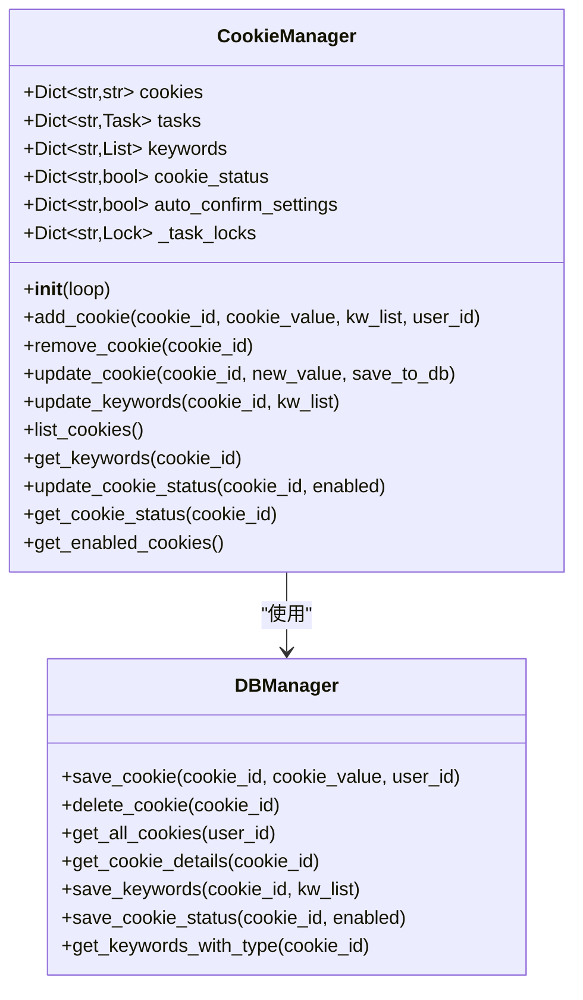
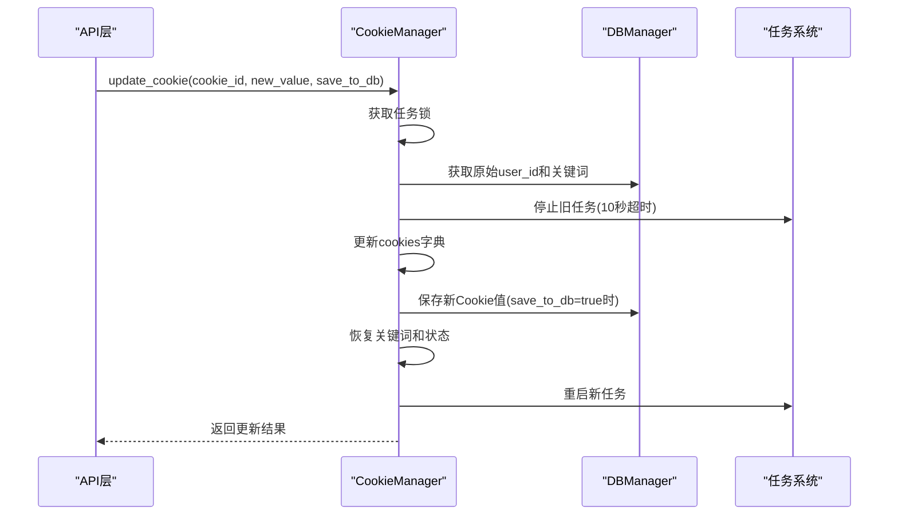
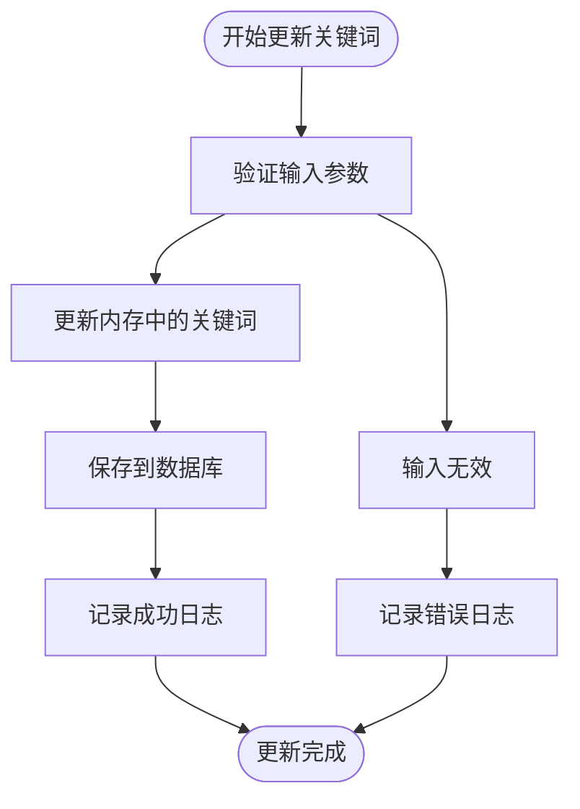
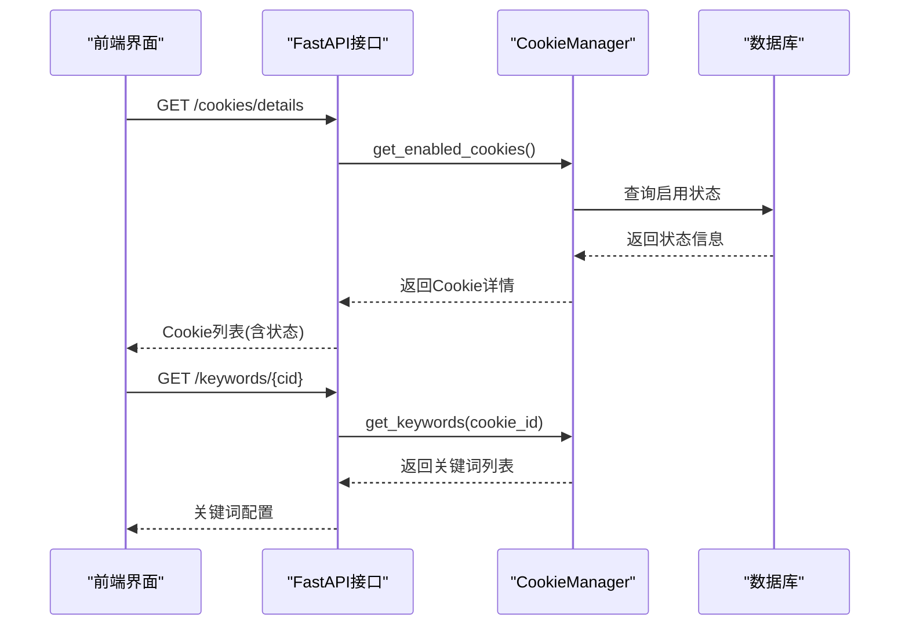
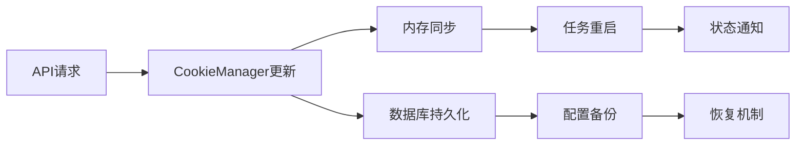

# 数据操作与查询

<cite>
**本文档引用的文件**
- [cookie_manager.py](file://cookie_manager.py)
- [db_manager.py](file://db_manager.py)
- [reply_server.py](file://reply_server.py)
- [XianyuAutoAsync.py](file://XianyuAutoAsync.py)
- [static/js/app.js](file://static/js/app.js)
</cite>

## 目录
1. [简介](#简介)
2. [核心数据结构](#核心数据结构)
3. [Cookie值热更新机制](#cookie值热更新机制)
4. [关键词同步更新](#关键词同步更新)
5. [查询接口详解](#查询接口详解)
6. [上层API集成](#上层api集成)
7. [实际应用场景](#实际应用场景)
8. [性能优化考虑](#性能优化考虑)
9. [故障排除指南](#故障排除指南)

## 简介

CookieManager是闲鱼自动回复系统的核心组件，负责管理多个账号的Cookie信息、关键字配置以及相关的任务生命周期。它提供了完整的数据操作与查询接口，支持Cookie值的热更新、关键词的实时同步以及各种查询需求，为上层API提供了稳定可靠的数据支撑。

## 核心数据结构

CookieManager维护以下核心数据结构：



**图表来源**
- [cookie_manager.py](file://cookie_manager.py#L10-L428)
- [db_manager.py](file://db_manager.py#L16-L800)

**章节来源**
- [cookie_manager.py](file://cookie_manager.py#L10-L428)

## Cookie值热更新机制

### update_cookie方法实现原理

`update_cookie`方法实现了Cookie值的安全热更新，确保在保持原有配置的前提下完成更新操作：



**图表来源**
- [cookie_manager.py](file://cookie_manager.py#L214-L288)

### 热更新流程详解

1. **任务安全停止**：通过10秒超时机制确保旧任务能够优雅关闭
2. **状态保持**：完整保留原有的关键词列表、启用状态等配置
3. **数据库保护**：通过`save_to_db`参数避免意外覆盖其他字段
4. **原子性操作**：整个更新过程在一个事务中完成

### save_to_db参数的作用

`save_to_db`参数是热更新机制的关键设计：

- **默认值True**：适用于API层直接更新Cookie值的场景
- **参数为False**：适用于XianyuLive实例内部更新的场景，避免覆盖账号密码等敏感信息

**章节来源**
- [cookie_manager.py](file://cookie_manager.py#L214-L288)
- [XianyuAutoAsync.py](file://XianyuAutoAsync.py#L2414)

## 关键词同步更新

### update_keywords方法实现

`update_keywords`方法提供线程安全的关键字更新功能：



**图表来源**
- [cookie_manager.py](file://cookie_manager.py#L290-L295)

### 内存与数据库同步机制

关键词更新采用双层同步策略：

1. **内存同步**：立即更新`self.keywords`字典
2. **数据库持久化**：通过`db_manager.save_keywords()`持久化到SQLite

这种设计确保了：
- 实时响应：前端界面可以立即看到更新效果
- 数据持久性：重启后配置仍然可用
- 一致性保证：内存和数据库始终保持同步

**章节来源**
- [cookie_manager.py](file://cookie_manager.py#L290-L295)

## 查询接口详解

### list_cookies方法

提供简单高效的Cookie ID列表查询：

```python
def list_cookies(self):
    return list(self.cookies.keys())
```

**特点**：
- O(1)复杂度的查询操作
- 支持用户隔离（通过数据库过滤）
- 适用于前端下拉列表渲染

### get_keywords方法

获取指定Cookie的关键词列表：

```python
def get_keywords(self, cookie_id: str) -> List[Tuple[str, str]]:
    return self.keywords.get(cookie_id, [])
```

**特点**：
- 返回格式：`(关键词, 回复内容)`元组列表
- 支持类型信息：区分普通关键词和商品关键词
- 缓存友好：直接从内存字典获取

### 状态查询接口

| 方法 | 功能 | 返回类型 | 用途 |
|------|------|----------|------|
| `get_cookie_status()` | 获取启用状态 | `bool` | 控制任务启动/停止 |
| `get_enabled_cookies()` | 获取所有启用的Cookie | `Dict[str, str]` | 批量操作筛选 |
| `get_auto_confirm_setting()` | 获取自动确认设置 | `bool` | 发货自动化 |

**章节来源**
- [cookie_manager.py](file://cookie_manager.py#L298-L331)

## 上层API集成

### reply_server中的应用

CookieManager的查询接口为reply_server提供了完整的数据支持：



**图表来源**
- [reply_server.py](file://reply_server.py#L1153-L1179)
- [reply_server.py](file://reply_server.py#L3046-L3074)

### 前端交互支持

CookieManager的查询接口为前端提供了丰富的数据支持：

- **实时状态显示**：启用/禁用状态的动态切换
- **关键词管理**：支持增删改查操作
- **配置同步**：确保前后端配置的一致性

**章节来源**
- [reply_server.py](file://reply_server.py#L1153-L1179)
- [reply_server.py](file://reply_server.py#L3046-L3074)
- [static/js/app.js](file://static/js/app.js#L334-L560)

## 实际应用场景

### 账号信息维护场景

在日常运营中，CookieManager的接口主要应用于以下场景：

1. **Cookie轮换**：定期更换失效的Cookie值
2. **配置调整**：根据业务需求调整关键词列表
3. **状态管理**：启用/禁用特定账号
4. **监控告警**：实时监控账号状态变化

### 配置同步场景

系统通过以下机制确保配置的一致性：



**图表来源**
- [cookie_manager.py](file://cookie_manager.py#L214-L288)

**章节来源**
- [reply_server.py](file://reply_server.py#L1217-L1242)
- [reply_server.py](file://reply_server.py#L1290-L1310)

## 性能优化考虑

### 锁机制设计

CookieManager采用细粒度锁机制：

- **任务锁**：每个Cookie独立的任务锁，避免全局阻塞
- **数据库锁**：全局数据库锁，确保数据一致性
- **读写分离**：查询操作不加锁，写操作使用锁保护

### 缓存策略

- **内存缓存**：所有配置信息存储在内存中，提供毫秒级响应
- **懒加载**：按需从数据库加载数据
- **批量操作**：支持批量更新减少数据库交互

### 内存管理

- **弱引用**：避免循环引用导致的内存泄漏
- **及时清理**：任务结束后及时清理相关资源
- **容量控制**：限制同时运行的账号数量

## 故障排除指南

### 常见问题及解决方案

| 问题类型 | 症状 | 可能原因 | 解决方案 |
|----------|------|----------|----------|
| 任务启动失败 | Cookie任务无法启动 | 数据库连接异常 | 检查数据库状态，重启服务 |
| 关键词丢失 | 关键词列表为空 | 数据库损坏 | 从备份恢复或重新配置 |
| 状态不同步 | 前端状态与实际不符 | 缓存未刷新 | 调用reload_from_db()刷新 |
| 更新失败 | Cookie更新不生效 | save_to_db参数错误 | 设置正确的save_to_db值 |

### 监控指标

建议监控以下关键指标：

- **任务运行状态**：各Cookie任务的健康状况
- **数据库连接**：连接池使用情况和响应时间
- **内存使用**：CookieManager的内存占用
- **锁竞争**：任务锁的等待时间和频率

### 日志分析

CookieManager提供了详细的日志记录：

- **INFO级别**：正常操作的确认信息
- **WARNING级别**：潜在问题的警告信息  
- **ERROR级别**：操作失败的错误信息
- **DEBUG级别**：详细的调试信息

**章节来源**
- [cookie_manager.py](file://cookie_manager.py#L24-L42)
- [db_manager.py](file://db_manager.py#L1108-L1141)

## 结论

CookieManager通过精心设计的数据操作与查询接口，为闲鱼自动回复系统提供了稳定可靠的数据支撑。其热更新机制确保了系统的高可用性，而完善的查询接口则为上层API提供了丰富的数据访问能力。通过合理的架构设计和性能优化，该组件能够满足大规模部署的需求，为用户提供流畅的使用体验。