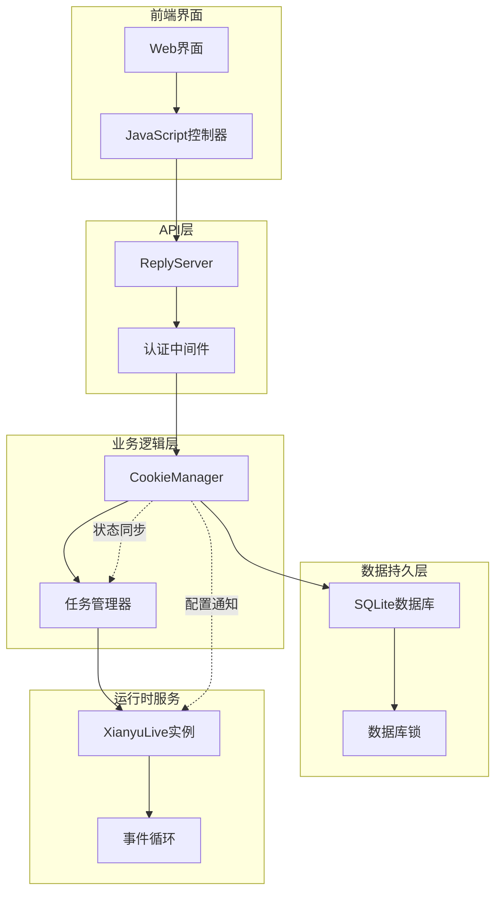
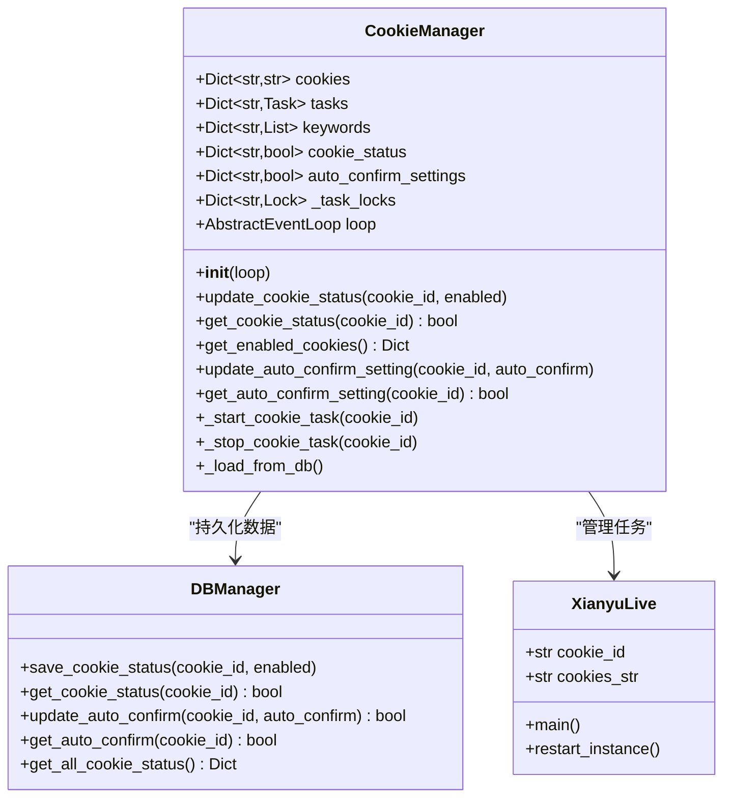
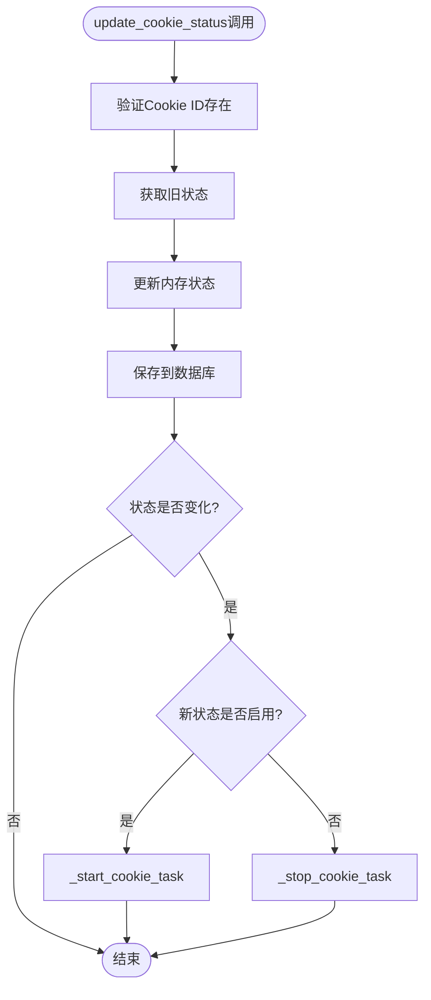
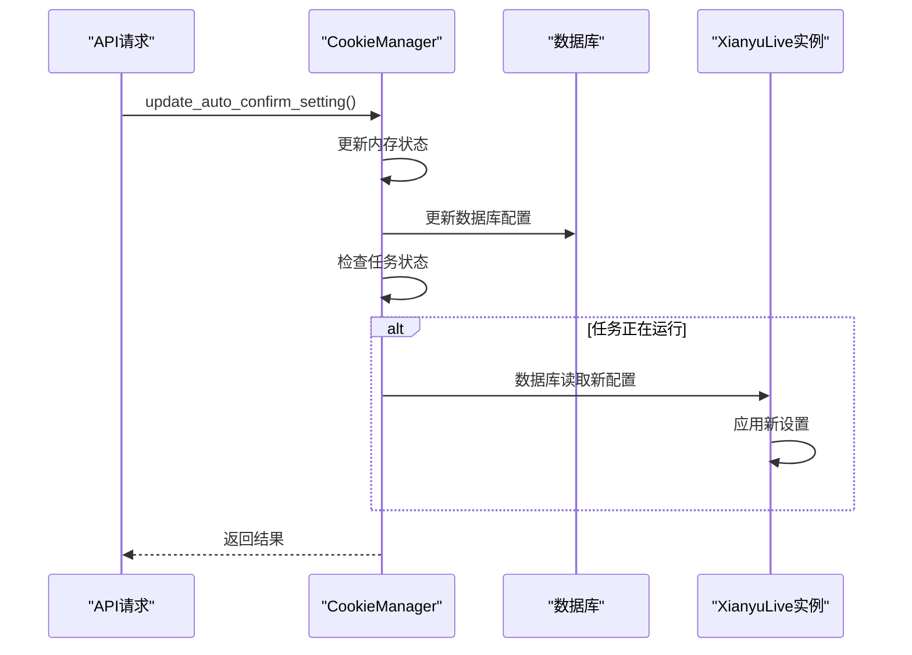
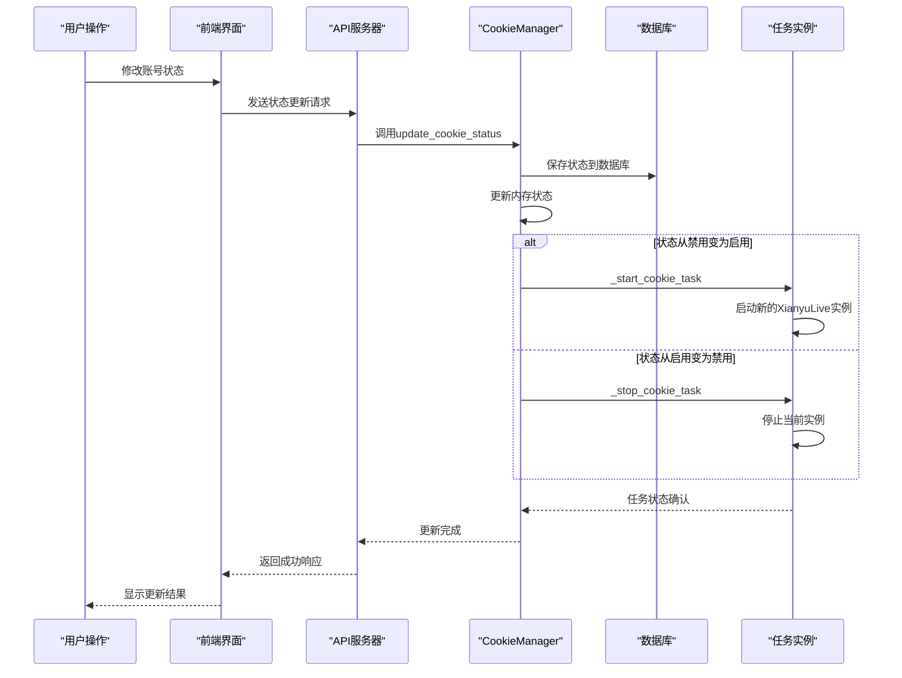
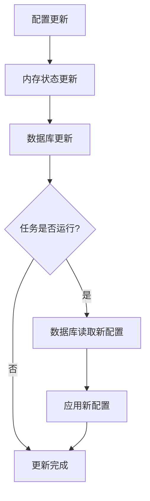
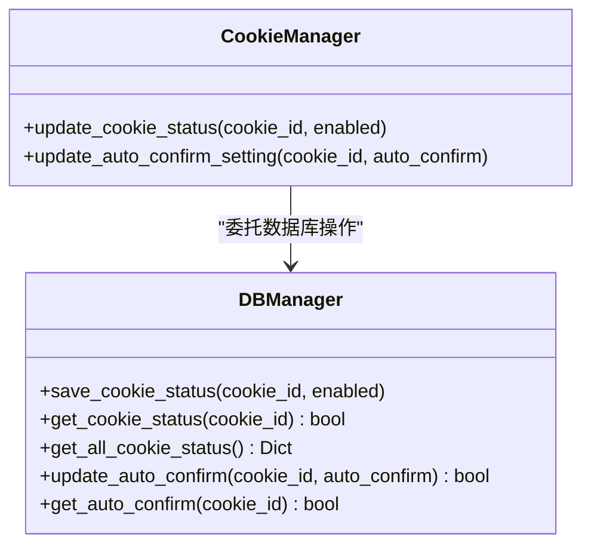

# 账号状态与配置控制

<cite>
**本文档引用的文件**
- [cookie_manager.py](file://cookie_manager.py)
- [db_manager.py](file://db_manager.py)
- [reply_server.py](file://reply_server.py)
- [Start.py](file://Start.py)
- [XianyuAutoAsync.py](file://XianyuAutoAsync.py)
- [static/js/app.js](file://static/js/app.js)
</cite>

## 目录
1. [简介](#简介)
2. [系统架构概览](#系统架构概览)
3. [CookieManager核心组件](#cookiemanager核心组件)
4. [账号状态管理](#账号状态管理)
5. [自动确认发货配置](#自动确认发货配置)
6. [状态变更流程](#状态变更流程)
7. [线程安全机制](#线程安全机制)
8. [数据库持久化](#数据库持久化)
9. [API接口设计](#api接口设计)
10. [故障排除指南](#故障排除指南)

## 简介

CookieManager是闲鱼自动回复系统的核心组件，负责管理多个账号的Cookie状态、功能配置以及运行时任务控制。该系统提供了完整的账号生命周期管理能力，包括动态启用/禁用、自动确认发货开关控制等功能，确保系统的稳定性和可维护性。

## 系统架构概览

**图表来源**
- [cookie_manager.py](file://cookie_manager.py#L10-L428)
- [reply_server.py](file://reply_server.py#L1-L50)

## CookieManager核心组件

### 核心数据结构

CookieManager类维护以下关键数据结构：

**图表来源**
- [cookie_manager.py](file://cookie_manager.py#L10-L428)
- [db_manager.py](file://db_manager.py#L16-L100)

### 初始化与数据加载

CookieManager在初始化时会从数据库加载所有必要的配置数据：

**章节来源**
- [cookie_manager.py](file://cookie_manager.py#L13-L42)
- [Start.py](file://Start.py#L529-L543)

## 账号状态管理

### update_cookie_status方法详解

`update_cookie_status`方法是账号状态管理的核心入口，负责更新Cookie的启用/禁用状态并智能控制对应任务的启动或停止。

#### 方法实现流程

**图表来源**
- [cookie_manager.py](file://cookie_manager.py#L304-L323)

#### 状态变更处理机制

当账号状态发生变化时，系统会自动调用相应的任务管理方法：

1. **启用状态**：调用`_start_cookie_task`启动对应的任务
2. **禁用状态**：调用`_stop_cookie_task`停止对应的任务

**章节来源**
- [cookie_manager.py](file://cookie_manager.py#L316-L323)

### get_cookie_status查询接口

`get_cookie_status`方法提供简单的状态查询功能：

**章节来源**
- [cookie_manager.py](file://cookie_manager.py#L324-L326)

### get_enabled_cookies查询接口

`get_enabled_cookies`方法返回所有启用状态的账号信息：

**章节来源**
- [cookie_manager.py](file://cookie_manager.py#L328-L332)

## 自动确认发货配置

### update_auto_confirm_setting方法

`update_auto_confirm_setting`方法管理每个账号的自动确认发货开关，支持内存状态更新和运行中任务的实时通知。

#### 实现特点

1. **内存状态更新**：立即更新`auto_confirm_settings`字典
2. **数据库持久化**：通过数据库操作确保配置持久化
3. **实时通知机制**：对于正在运行的任务，通过数据库读取机制实现实时生效

#### 方法流程图

**图表来源**
- [cookie_manager.py](file://cookie_manager.py#L407-L420)
- [reply_server.py](file://reply_server.py#L2829-L2850)

**章节来源**
- [cookie_manager.py](file://cookie_manager.py#L407-L420)

### get_auto_confirm_setting查询接口

`get_auto_confirm_setting`方法提供自动确认发货设置的查询功能：

**章节来源**
- [cookie_manager.py](file://cookie_manager.py#L422-L424)

## 状态变更流程

### 完整的状态变更生命周期

**图表来源**
- [reply_server.py](file://reply_server.py#L1146-L1274)
- [cookie_manager.py](file://cookie_manager.py#L304-L323)

### 自动确认发货的实时生效机制

**图表来源**
- [cookie_manager.py](file://cookie_manager.py#L414-L418)

**章节来源**
- [cookie_manager.py](file://cookie_manager.py#L407-L420)

## 线程安全机制

### 任务锁机制

CookieManager使用专门的任务锁来确保同一账号的任务不会重复创建：

**章节来源**
- [cookie_manager.py](file://cookie_manager.py#L113-L118)
- [cookie_manager.py](file://cookie_manager.py#L156-L159)

### 数据库锁保护

所有数据库操作都通过可重入锁保护：

**章节来源**
- [db_manager.py](file://db_manager.py#L51-L52)

### 事件循环安全

系统通过多种方式确保在不同事件循环环境下的安全性：

**章节来源**
- [cookie_manager.py](file://cookie_manager.py#L350-L360)
- [cookie_manager.py](file://cookie_manager.py#L394-L396)

## 数据库持久化

### 状态数据表结构

系统使用专门的`cookie_status`表来持久化账号状态：

| 字段名 | 类型 | 描述 |
|--------|------|------|
| cookie_id | TEXT | 账号标识符，主键 |
| enabled | BOOLEAN | 启用状态，默认TRUE |
| updated_at | TIMESTAMP | 更新时间戳 |

**章节来源**
- [db_manager.py](file://db_manager.py#L140-L148)

### 自动确认发货配置持久化

自动确认发货设置存储在`cookies`表的`auto_confirm`字段中：

| 字段名 | 类型 | 默认值 | 描述 |
|--------|------|--------|------|
| auto_confirm | INTEGER | 1 | 自动确认发货开关（0/1） |

**章节来源**
- [db_manager.py](file://db_manager.py#L110-L121)

### 数据库操作方法

**图表来源**
- [db_manager.py](file://db_manager.py#L1721-L1734)
- [db_manager.py](file://db_manager.py#L1291-L1302)

**章节来源**
- [db_manager.py](file://db_manager.py#L1721-L1734)
- [db_manager.py](file://db_manager.py#L1291-L1302)

## API接口设计

### 状态管理API

系统提供了完整的RESTful API来管理账号状态：

| 接口路径 | 方法 | 功能描述 |
|----------|------|----------|
| `/cookies/{cid}/status` | PUT | 更新账号状态 |
| `/cookies/status` | GET | 获取所有账号状态 |
| `/cookies/{cid}/auto-confirm` | PUT | 更新自动确认发货设置 |
| `/cookies/{cid}/auto-confirm` | GET | 获取自动确认发货设置 |

**章节来源**
- [reply_server.py](file://reply_server.py#L2829-L2885)

### 前端交互接口

前端通过JavaScript实现了完整的用户交互功能：

**章节来源**
- [static/js/app.js](file://static/js/app.js#L1690-L1834)

## 故障排除指南

### 常见问题及解决方案

#### 1. 状态更新不生效

**问题现象**：修改账号状态后，任务没有按预期启动或停止

**排查步骤**：
1. 检查数据库中`cookie_status`表的更新情况
2. 验证CookieManager内存状态是否同步
3. 确认事件循环是否正常运行

**解决方案**：
- 重启系统确保状态同步
- 检查数据库连接状态
- 验证任务锁机制是否正常工作

#### 2. 自动确认发货设置延迟生效

**问题现象**：修改自动确认发货设置后，需要重启任务才能生效

**原因分析**：
- XianyuLive实例会在下次轮询时读取数据库配置
- 实时通知机制依赖于数据库读取而非直接通信

**解决方案**：
- 等待下一次配置读取周期
- 或者重启对应的任务实例

#### 3. 线程安全问题

**问题现象**：多线程环境下出现任务重复创建或丢失

**排查重点**：
- 检查任务锁机制是否正确使用
- 验证数据库锁是否正常工作
- 确认事件循环的安全性

**章节来源**
- [cookie_manager.py](file://cookie_manager.py#L113-L118)
- [cookie_manager.py](file://cookie_manager.py#L156-L159)

### 性能优化建议

1. **批量操作**：对于大量账号的状态更新，考虑使用批量API
2. **缓存策略**：合理利用内存缓存减少数据库访问频率
3. **监控告警**：建立完善的监控体系及时发现状态异常

## 结论

CookieManager通过精心设计的状态管理系统，实现了对多账号的精细化控制。其核心特性包括：

- **实时状态同步**：内存状态与数据库状态的双向同步
- **智能任务控制**：根据状态变化自动启动或停止对应任务
- **线程安全保障**：多重锁机制确保并发环境下的数据一致性
- **持久化存储**：完整的配置持久化机制保证系统重启后状态不丢失

这套设计不仅满足了系统的功能性需求，还为未来的扩展奠定了坚实的基础。