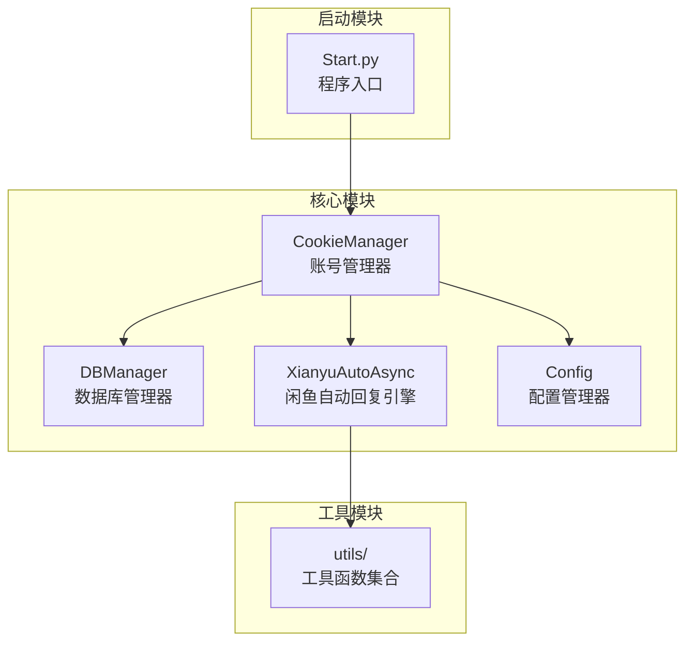
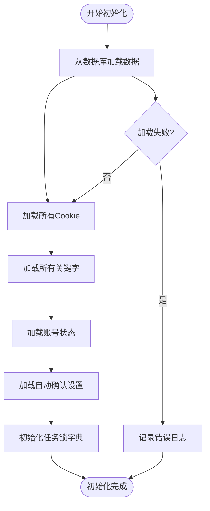
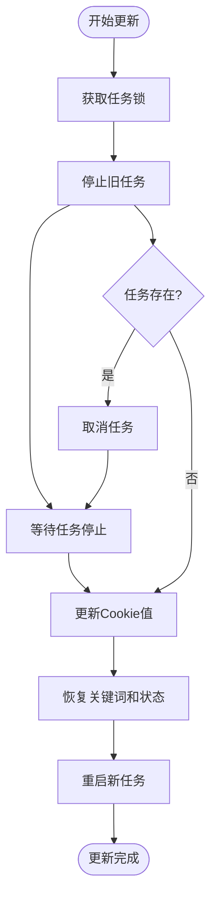
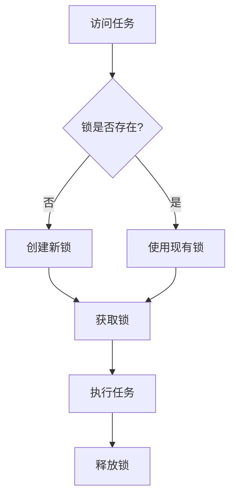
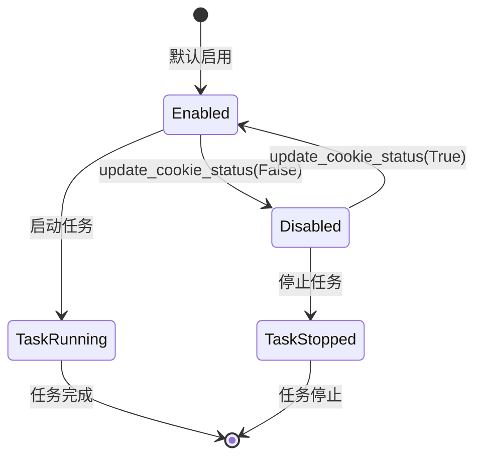
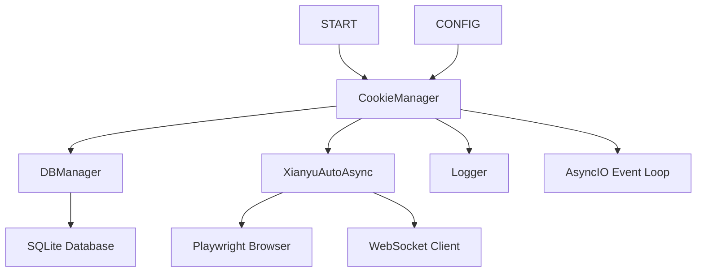

# 账号管理模块

<cite>
**本文档中引用的文件**
- [cookie_manager.py](file://cookie_manager.py)
- [db_manager.py](file://db_manager.py)
- [XianyuAutoAsync.py](file://XianyuAutoAsync.py)
- [config.py](file://config.py)
- [Start.py](file://Start.py)
</cite>

## 目录
1. [简介](#简介)
2. [项目结构](#项目结构)
3. [核心组件](#核心组件)
4. [架构概览](#架构概览)
5. [详细组件分析](#详细组件分析)
6. [依赖关系分析](#依赖关系分析)
7. [性能考虑](#性能考虑)
8. [故障排除指南](#故障排除指南)
9. [结论](#结论)

## 简介

CookieManager类是闲鱼自动回复系统的核心管理器，负责管理多个账号的Cookie、关键字、状态和自动发货设置。该类采用异步编程模式，通过线程安全的接口设计，实现了在不同线程中安全地调度异步任务，确保系统的稳定性和可靠性。

## 项目结构

该项目采用模块化设计，主要包含以下核心模块：



**图表来源**
- [cookie_manager.py](file://cookie_manager.py#L1-L428)
- [db_manager.py](file://db_manager.py#L1-L800)
- [XianyuAutoAsync.py](file://XianyuAutoAsync.py#L1-L800)
- [Start.py](file://Start.py#L1-L200)

**章节来源**
- [cookie_manager.py](file://cookie_manager.py#L1-L428)
- [db_manager.py](file://db_manager.py#L1-L800)

## 核心组件

### CookieManager类设计

CookieManager类作为系统的核心管理器，具有以下关键特性：

1. **多账号管理能力**：支持同时管理多个闲鱼账号的Cookie和相关配置
2. **线程安全接口**：提供安全的异步任务调度机制
3. **状态管理**：跟踪账号的启用/禁用状态和自动发货设置
4. **数据库集成**：与SQLite数据库紧密集成，实现数据持久化

### 主要数据结构

| 数据结构 | 类型 | 描述 |
|---------|------|------|
| cookies | Dict[str, str] | 存储所有账号的Cookie值 |
| tasks | Dict[str, asyncio.Task] | 存储正在运行的异步任务 |
| keywords | Dict[str, List[Tuple[str, str]]] | 存储每个账号的关键字列表 |
| cookie_status | Dict[str, bool] | 跟踪账号的启用状态 |
| auto_confirm_settings | Dict[str, bool] | 自动确认发货设置 |
| _task_locks | Dict[str, asyncio.Lock] | 为每个账号提供异步锁 |

**章节来源**
- [cookie_manager.py](file://cookie_manager.py#L12-L20)

## 架构概览

CookieManager的整体架构采用事件驱动和异步编程模式：

```mermaid
sequenceDiagram
participant App as 应用程序
participant CM as CookieManager
participant DB as 数据库
participant XA as XianyuLive
participant Loop as 事件循环
App->>CM : 初始化CookieManager(loop)
CM->>DB : 加载所有Cookie和配置
DB-->>CM : 返回数据
CM->>CM : 初始化内部状态
App->>CM : add_cookie(cookie_id, cookie_value)
CM->>CM : 检查现有任务
CM->>Loop : 创建异步任务
Loop->>XA : 启动XianyuLive实例
XA-->>Loop : 返回任务对象
Loop-->>CM : 任务已创建
CM-->>App : 操作完成
Note over App,XA : 异步任务持续运行，处理闲鱼消息
```

**图表来源**
- [cookie_manager.py](file://cookie_manager.py#L13-L21)
- [cookie_manager.py](file://cookie_manager.py#L183-L200)
- [XianyuAutoAsync.py](file://XianyuAutoAsync.py#L628-L700)

## 详细组件分析

### 初始化过程

CookieManager在__init__方法中执行以下关键步骤：



**图表来源**
- [cookie_manager.py](file://cookie_manager.py#L23-L42)

#### 数据库加载机制

系统通过`_load_from_db`方法从SQLite数据库加载所有必要数据：

- **Cookie数据**：从cookies表加载所有账号的Cookie值
- **关键字数据**：从keywords表加载每个账号的关键字配置
- **状态数据**：从cookie_status表加载账号的启用状态
- **自动确认设置**：从cookies表加载auto_confirm字段

**章节来源**
- [cookie_manager.py](file://cookie_manager.py#L23-L42)

### 线程安全接口设计

CookieManager提供了三个核心的线程安全接口，通过`asyncio.run_coroutine_threadsafe`实现跨线程的安全任务调度：

#### add_cookie方法

该方法负责新增账号并启动相应的异步任务：

```mermaid
sequenceDiagram
participant Client as 客户端线程
participant CM as CookieManager
participant Loop as 事件循环线程
participant Task as 异步任务
Client->>CM : add_cookie(cookie_id, cookie_value)
CM->>CM : 检查当前事件循环
alt 在同一事件循环中
CM->>Task : 直接创建任务
else 在不同事件循环中
CM->>Loop : run_coroutine_threadsafe
Loop->>Task : 创建异步任务
Task-->>Loop : 返回结果
Loop-->>CM : 返回Future
end
CM-->>Client : 返回任务结果
```

**图表来源**
- [cookie_manager.py](file://cookie_manager.py#L183-L200)

#### remove_cookie方法

该方法安全地移除账号并清理相关资源：

- **任务取消**：首先取消正在运行的任务
- **资源清理**：等待任务完全清理，确保资源释放
- **数据库同步**：从数据库中删除对应的账号记录
- **锁清理**：移除相关的异步锁

#### update_cookie方法

这是最复杂的接口，负责更新Cookie值并重启任务：



**图表来源**
- [cookie_manager.py](file://cookie_manager.py#L222-L278)

**章节来源**
- [cookie_manager.py](file://cookie_manager.py#L183-L200)
- [cookie_manager.py](file://cookie_manager.py#L201-L212)
- [cookie_manager.py](file://cookie_manager.py#L214-L288)

### 内部协程_run_xianyu

`_run_xianyu`协程是系统的核心执行单元，负责启动和管理XianyuLive实例：

#### 延迟导入机制

为了避免循环依赖，系统采用延迟导入策略：

```python
# 延迟导入，避免循环依赖
from XianyuAutoAsync import XianyuLive
```

#### 异步任务生命周期管理

该协程实现了完整的任务生命周期管理：

1. **实例创建**：根据提供的Cookie值创建XianyuLive实例
2. **主循环执行**：调用XianyuLive的main()方法
3. **异常处理**：捕获并记录各种异常情况
4. **资源清理**：确保日志刷新和资源释放

**章节来源**
- [cookie_manager.py](file://cookie_manager.py#L59-L111)

### 任务锁机制

CookieManager使用`_task_locks`字典为每个cookie_id提供异步锁，防止重复创建任务：

#### 锁的获取和使用



**图表来源**
- [cookie_manager.py](file://cookie_manager.py#L112-L153)

#### 防止重复任务创建

通过异步锁机制，确保同一账号不会同时存在多个运行中的任务：

- **任务检查**：在创建新任务前检查是否存在现有任务
- **任务取消**：如果发现现有任务，先取消再创建新任务
- **资源清理**：确保旧任务完全清理后再创建新任务

**章节来源**
- [cookie_manager.py](file://cookie_manager.py#L112-L153)

### 状态管理机制

CookieManager实现了完整的账号状态管理：

#### 启用/禁用状态控制



**图表来源**
- [cookie_manager.py](file://cookie_manager.py#L303-L322)

#### 动态任务管理

状态变化时，系统会自动启动或停止相应任务：

- **启用账号**：调用`_start_cookie_task`启动新任务
- **禁用账号**：调用`_stop_cookie_task`停止现有任务
- **状态同步**：确保数据库和内存状态的一致性

**章节来源**
- [cookie_manager.py](file://cookie_manager.py#L303-L322)
- [cookie_manager.py](file://cookie_manager.py#L332-L363)
- [cookie_manager.py](file://cookie_manager.py#L366-L405)

## 依赖关系分析

### 模块间依赖关系



**图表来源**
- [cookie_manager.py](file://cookie_manager.py#L1-L10)
- [db_manager.py](file://db_manager.py#L1-L50)
- [XianyuAutoAsync.py](file://XianyuAutoAsync.py#L1-L50)

### 数据库交互

CookieManager与数据库的交互遵循以下模式：

1. **数据加载**：启动时从数据库加载所有配置数据
2. **状态同步**：每次状态变更时同步到数据库
3. **事务管理**：确保数据一致性和完整性

**章节来源**
- [cookie_manager.py](file://cookie_manager.py#L23-L42)
- [db_manager.py](file://db_manager.py#L1-L800)

## 性能考虑

### 异步任务管理

系统采用多种策略优化性能：

1. **延迟导入**：避免不必要的模块加载
2. **任务池管理**：合理控制并发任务数量
3. **资源清理**：及时释放不再使用的资源
4. **异常处理**：确保异常不会影响整体稳定性

### 内存管理

- **缓存策略**：对频繁访问的数据实施缓存
- **垃圾回收**：定期清理无用的对象引用
- **资源监控**：监控内存使用情况

### 网络优化

- **连接池**：复用HTTP连接减少开销
- **超时控制**：设置合理的网络超时时间
- **重试机制**：在网络不稳定时自动重试

## 故障排除指南

### 常见问题及解决方案

#### 任务启动失败

**症状**：账号无法正常启动
**原因**：Cookie无效或网络连接问题
**解决**：检查Cookie有效性，验证网络连接

#### 任务频繁重启

**症状**：账号任务不断重启
**原因**：异常处理不当或资源竞争
**解决**：检查异常日志，优化资源管理

#### 数据库连接问题

**症状**：配置无法保存或加载
**原因**：数据库文件损坏或权限问题
**解决**：检查数据库文件完整性，修复权限

**章节来源**
- [cookie_manager.py](file://cookie_manager.py#L82-L111)
- [cookie_manager.py](file://cookie_manager.py#L246-L260)

## 结论

CookieManager类作为闲鱼自动回复系统的核心组件，展现了优秀的软件设计原则：

1. **模块化设计**：清晰的职责分离和接口定义
2. **异步编程**：充分利用Python的异步特性提高性能
3. **线程安全**：通过锁机制确保多线程环境下的数据一致性
4. **错误处理**：完善的异常处理和恢复机制
5. **扩展性**：良好的架构设计支持功能扩展

该设计不仅满足了当前的功能需求，还为未来的功能扩展和性能优化奠定了坚实的基础。通过合理的抽象和封装，系统实现了高内聚、低耦合的架构目标，为构建稳定可靠的自动化系统提供了有力保障。