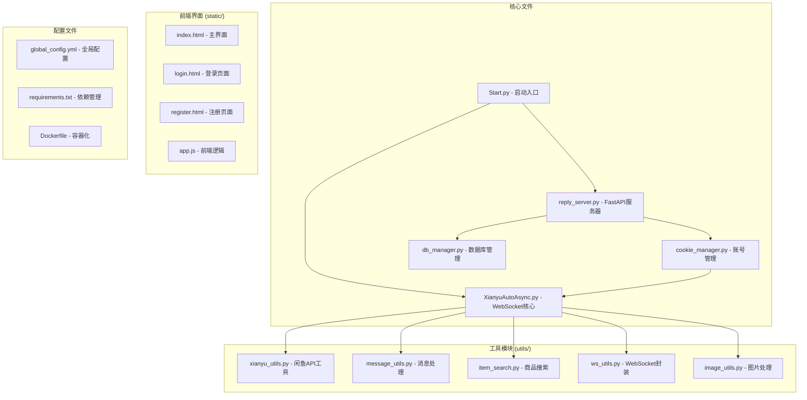
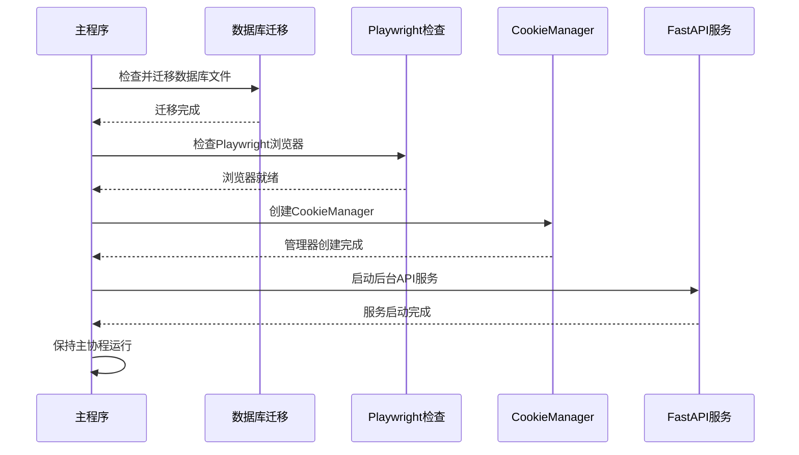
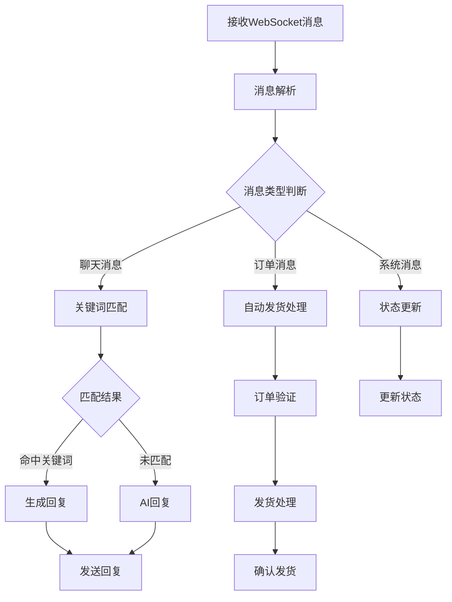
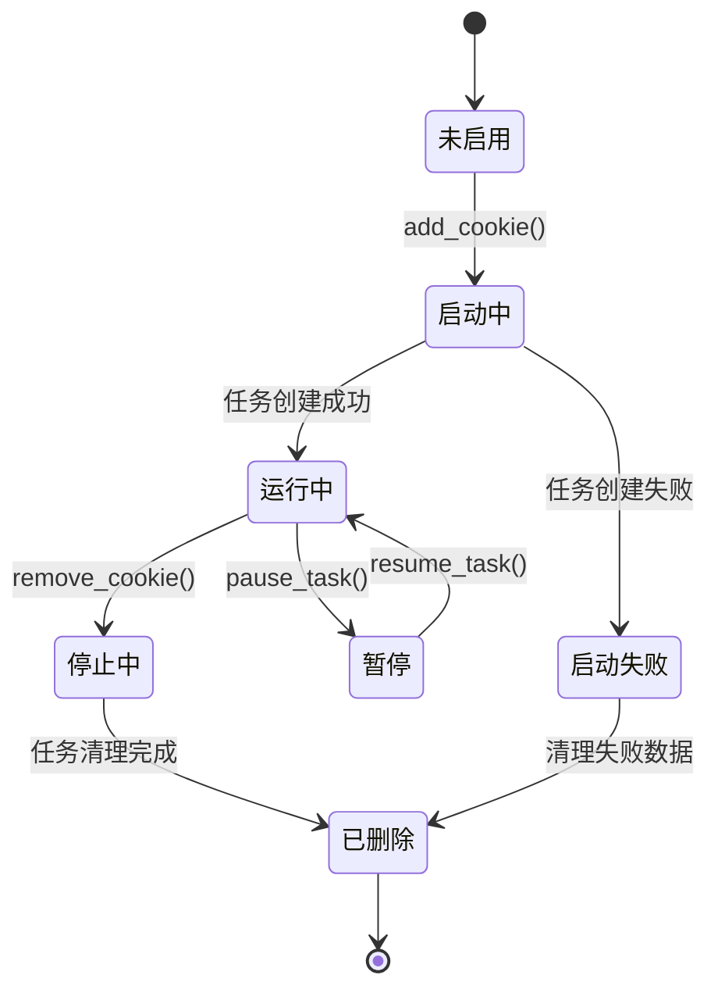
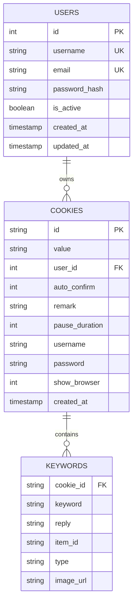
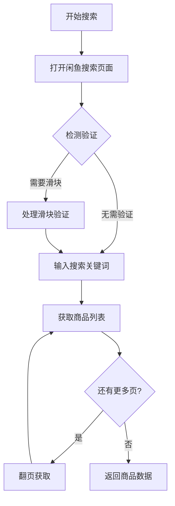

# 开发者指南

<cite>
**本文档引用的文件**
- [README.md](file://README.md)
- [Start.py](file://Start.py)
- [requirements.txt](file://requirements.txt)
- [config.py](file://config.py)
- [global_config.yml](file://global_config.yml)
- [utils/xianyu_utils.py](file://utils/xianyu_utils.py)
- [utils/message_utils.py](file://utils/message_utils.py)
- [utils/item_search.py](file://utils/item_search.py)
- [cookie_manager.py](file://cookie_manager.py)
- [db_manager.py](file://db_manager.py)
- [Dockerfile](file://Dockerfile)
- [docker-deploy.sh](file://docker-deploy.sh)
- [entrypoint.sh](file://entrypoint.sh)
- [file_log_collector.py](file://file_log_collector.py)
</cite>

## 目录
1. [项目简介](#项目简介)
2. [项目结构](#项目结构)
3. [开发环境搭建](#开发环境搭建)
4. [核心模块详解](#核心模块详解)
5. [工具函数库](#工具函数库)
6. [调试与测试](#调试与测试)
7. [代码贡献流程](#代码贡献流程)
8. [部署与运维](#部署与运维)
9. [故障排除](#故障排除)

## 项目简介

闲鱼自动回复系统是一个功能完整的闲鱼自动回复和管理系统，采用现代化的技术架构，支持多用户、多账号管理，具备智能回复、自动发货、自动确认发货、商品管理等企业级功能。系统基于Python异步编程，使用FastAPI提供RESTful API，SQLite数据库存储，支持Docker一键部署。

### 核心特性
- **多用户系统**：支持用户注册登录，数据完全隔离
- **多账号管理**：支持同时管理多个闲鱼账号
- **智能回复系统**：支持关键词匹配、AI智能回复
- **自动发货功能**：支持多种发货方式和防重复机制
- **实时监控**：WebSocket实时通信和状态监控
- **容器化部署**：Docker容器化，支持一键部署

## 项目结构



**图表来源**
- [Start.py](file://Start.py#L1-L50)
- [XianyuAutoAsync.py](file://XianyuAutoAsync.py)
- [reply_server.py](file://reply_server.py)
- [db_manager.py](file://db_manager.py#L1-L100)

### 目录结构说明

| 目录/文件 | 职责描述 |
|-----------|----------|
| `Start.py` | 项目启动入口，初始化所有服务 |
| `XianyuAutoAsync.py` | 闲鱼WebSocket连接和消息处理核心 |
| `reply_server.py` | FastAPI Web服务器和完整API接口 |
| `db_manager.py` | SQLite数据库管理，支持多用户数据隔离 |
| `cookie_manager.py` | 多账号Cookie管理和任务调度 |
| `utils/` | 工具函数库，包含各种辅助功能 |
| `static/` | 前端静态资源文件 |
| `Dockerfile` | Docker镜像构建配置 |
| `requirements.txt` | Python依赖包列表 |

**章节来源**
- [README.md](file://README.md#L106-L195)
- [Start.py](file://Start.py#L1-L50)

## 开发环境搭建

### 环境要求

| 组件 | 版本要求 | 说明 |
|------|----------|------|
| Python | 3.11+ | 主要编程语言 |
| Node.js | 16+ | JavaScript运行时 |
| Docker | 20.10+ | 容器化部署（可选） |
| Docker Compose | 2.0+ | 容器编排（可选） |

### 本地开发环境配置

#### 1. 克隆项目
```bash
git clone https://github.com/zhinianboke/xianyu-auto-reply.git
cd xianyu-auto-reply
```

#### 2. 创建虚拟环境
```bash
# 创建虚拟环境
python -m venv venv

# 激活虚拟环境
# Linux/macOS
source venv/bin/activate
# Windows
venv\Scripts\activate
```

#### 3. 安装依赖
```bash
# 升级pip
pip install --upgrade pip

# 安装Python依赖
pip install -r requirements.txt

# 安装Playwright浏览器
playwright install chromium
playwright install-deps chromium  # Linux需要
```

#### 4. 环境变量配置

系统支持通过环境变量进行配置，主要配置项包括：

| 环境变量 | 默认值 | 说明 |
|----------|--------|------|
| `WEB_PORT` | 8080 | Web服务端口 |
| `API_HOST` | 0.0.0.0 | API服务主机 |
| `TZ` | Asia/Shanghai | 时区设置 |
| `DB_PATH` | data/xianyu_data.db | 数据库文件路径 |
| `ADMIN_USERNAME` | admin | 管理员用户名 |
| `ADMIN_PASSWORD` | admin123 | 管理员密码 |
| `JWT_SECRET_KEY` | your-secret-key | JWT密钥 |

#### 5. 启动系统
```bash
# 启动系统
python Start.py

# 访问系统
# http://localhost:8080
```

### Docker开发环境

#### 1. 构建镜像
```bash
# 国际版
docker-compose up -d --build

# 中国版（推荐国内用户）
docker-compose -f docker-compose-cn.yml up -d --build
```

#### 2. 管理命令
```bash
# 查看日志
docker logs -f xianyu-auto-reply

# 停止服务
docker-compose down

# 重启服务
docker-compose restart
```

**章节来源**
- [README.md](file://README.md#L335-L427)
- [requirements.txt](file://requirements.txt#L1-L93)
- [Dockerfile](file://Dockerfile#L1-L138)

## 核心模块详解

### Start.py - 启动入口

Start.py是整个系统的启动入口，负责初始化所有服务并启动后台API服务。



**图表来源**
- [Start.py](file://Start.py#L513-L602)

#### 主要功能
1. **数据库迁移**：自动检查并迁移旧数据库文件到data目录
2. **Playwright检查**：自动安装和配置Playwright浏览器
3. **CookieManager初始化**：创建多账号管理器
4. **FastAPI服务启动**：在后台线程启动Web服务
5. **任务管理**：从数据库加载账号任务并启动

**章节来源**
- [Start.py](file://Start.py#L1-L602)

### XianyuAutoAsync.py - WebSocket核心

XianyuAutoAsync.py是系统的核心模块，负责与闲鱼WebSocket建立连接并处理消息。

#### 核心功能
- **WebSocket连接管理**：维持与闲鱼服务器的长连接
- **消息处理**：解析和处理来自闲鱼的消息
- **自动回复**：根据关键词和AI规则自动回复消息
- **商品信息收集**：自动收集商品信息并存储到数据库
- **自动发货**：检测到付款消息后自动确认发货

#### 消息处理流程


**图表来源**
- [XianyuAutoAsync.py](file://XianyuAutoAsync.py)

**章节来源**
- [XianyuAutoAsync.py](file://XianyuAutoAsync.py)

### CookieManager - 多账号管理

CookieManager负责管理多个闲鱼账号的Cookie和对应的任务。

#### 主要功能
- **账号管理**：添加、删除、启用/禁用账号
- **任务调度**：管理账号任务的启动和停止
- **状态监控**：监控账号连接状态
- **线程安全**：支持多线程安全操作

#### 任务生命周期


**图表来源**
- [cookie_manager.py](file://cookie_manager.py#L1-L200)

**章节来源**
- [cookie_manager.py](file://cookie_manager.py#L1-L428)

### DBManager - 数据库管理

DBManager提供SQLite数据库的完整管理功能，支持多用户数据隔离。

#### 核心功能
- **多用户隔离**：每个用户的数据库操作相互独立
- **自动迁移**：支持数据库结构自动升级
- **事务管理**：提供完整的事务支持
- **性能优化**：支持索引和查询优化

#### 数据库表结构


**图表来源**
- [db_manager.py](file://db_manager.py#L67-L200)

**章节来源**
- [db_manager.py](file://db_manager.py#L1-L5103)

## 工具函数库

utils/目录包含了系统所需的各种工具函数，每个模块都有明确的职责分工。

### xianyu_utils.py - 闲鱼API工具

提供闲鱼相关的加密、签名、数据解析等核心功能。

#### 主要功能
- **Cookie处理**：Cookie字符串与字典之间的转换
- **签名生成**：生成闲鱼API请求所需的签名
- **设备ID生成**：生成唯一的设备标识
- **JavaScript执行**：调用闲鱼的JavaScript加密函数

#### 核心函数
| 函数名 | 功能描述 |
|--------|----------|
| `trans_cookies()` | Cookie字符串转换 |
| `generate_sign()` | 签名生成 |
| `generate_device_id()` | 设备ID生成 |
| `generate_mid()` | 消息ID生成 |

**章节来源**
- [utils/xianyu_utils.py](file://utils/xianyu_utils.py#L1-L379)

### message_utils.py - 消息处理工具

负责消息的格式化、解析和处理。

#### 主要功能
- **消息格式化**：将消息数据格式化为可读的字符串
- **系统消息处理**：处理系统级别的消息
- **时间戳处理**：处理消息的时间戳

#### 核心函数
| 函数名 | 功能描述 |
|--------|----------|
| `format_message()` | 格式化用户消息 |
| `format_system_message()` | 格式化系统消息 |

**章节来源**
- [utils/message_utils.py](file://utils/message_utils.py#L1-L29)

### item_search.py - 商品搜索功能

基于Playwright实现真实的闲鱼商品搜索功能。

#### 核心功能
- **无头浏览器操作**：使用Playwright模拟真实浏览器
- **滑块验证处理**：自动处理滑块验证
- **商品数据获取**：获取真实的商品信息
- **分页处理**：支持多页商品数据获取

#### 搜索流程


**图表来源**
- [utils/item_search.py](file://utils/item_search.py#L1-L200)

**章节来源**
- [utils/item_search.py](file://utils/item_search.py#L1-L1636)

### 其他工具模块

| 模块名 | 功能描述 |
|--------|----------|
| `ws_utils.py` | WebSocket客户端封装 |
| `image_utils.py` | 图片处理和管理 |
| `image_uploader.py` | 图片上传到CDN |
| `order_detail_fetcher.py` | 订单详情获取工具 |
| `qr_login.py` | 二维码登录功能 |
| `refresh_util.py` | Cookie刷新工具 |
| `xianyu_slider_stealth.py` | 滑块验证模块 |

**章节来源**
- [utils/](file://utils/)

## 调试与测试

### 日志系统

系统使用Loguru作为日志框架，提供强大的日志功能。

#### 日志配置
```yaml
LOG_CONFIG:
  level: INFO
  rotation: 1 day
  retention: 7 days
  compression: zip
  format: '<green>{time:YYYY-MM-DD HH:mm:ss.SSS}</green> | <level>{level: <8}</level> | <cyan>{name}</cyan>:<cyan>{function}</cyan>:<cyan>{line}</cyan> - <level>{message}</level>'
```

#### 日志级别
- **DEBUG**：详细调试信息
- **INFO**：一般信息记录
- **WARNING**：警告信息
- **ERROR**：错误信息

### 启用详细日志

#### 方法1：修改配置文件
编辑`global_config.yml`中的`LOG_CONFIG`部分：

```yaml
LOG_CONFIG:
  level: DEBUG  # 启用DEBUG级别日志
```

#### 方法2：环境变量
```bash
export LOG_LEVEL=DEBUG
```

#### 方法3：代码中设置
```python
from loguru import logger
logger.level("DEBUG")
```

### Playwright调试

#### 启用浏览器可视化
在`global_config.yml`中设置：

```yaml
ITEM_DETAIL:
  auto_fetch:
    enabled: true
    show_browser: true  # 显示浏览器界面
```

#### 截图调试
```python
# 在代码中添加截图
await page.screenshot(path=f"screenshot_{time.time()}.png")
```

### 单元测试

#### 测试框架
系统使用pytest作为测试框架，虽然主项目中没有显式的测试文件，但可以按照以下结构添加测试：

```python
# tests/test_xianyu_utils.py
import pytest
from utils.xianyu_utils import *

def test_cookie_transformation():
    cookies_str = "sid=abc; unck=def"
    cookies_dict = trans_cookies(cookies_str)
    assert cookies_dict["sid"] == "abc"
    assert cookies_dict["unck"] == "def"
```

#### 运行测试
```bash
# 安装pytest
pip install pytest

# 运行测试
pytest tests/
```

### 调试技巧

#### 1. 启用详细日志
```python
# 在代码中添加详细日志
logger.debug("调试信息: {}", some_variable)
```

#### 2. 使用断点调试
```python
import pdb; pdb.set_trace()  # 设置断点
```

#### 3. 网络抓包
使用浏览器开发者工具或Wireshark抓取WebSocket通信数据。

#### 4. 数据库调试
```python
# 启用SQL日志
os.environ['SQL_LOG_ENABLED'] = 'true'
```

**章节来源**
- [file_log_collector.py](file://file_log_collector.py#L1-L240)
- [global_config.yml](file://global_config.yml#L49-L56)

## 代码贡献流程

### 分支管理策略

#### Git Flow工作流
- **main分支**：生产环境分支，保持稳定
- **develop分支**：开发分支，集成新功能
- **feature分支**：功能开发分支
- **hotfix分支**：紧急修复分支

#### 分支命名规范
- 功能分支：`feature/功能名称`
- 修复分支：`fix/问题描述`
- 热修复分支：`hotfix/紧急修复`

### 提交规范

#### Commit消息格式
```
<type>(<scope>): <subject>

<body>

<footer>
```

#### Type类型
- `feat`: 新功能
- `fix`: 错误修复
- `docs`: 文档更新
- `style`: 代码格式调整
- `refactor`: 代码重构
- `test`: 测试相关
- `chore`: 构建过程或辅助工具的变动

#### 示例
```
feat(utils): 添加新的图片处理工具

- 新增图片压缩功能
- 支持多种格式转换
- 添加质量优化选项

Fixes #123
```

### Pull Request审查标准

#### 代码质量要求
1. **代码风格**：遵循PEP 8规范
2. **注释完整**：关键函数和复杂逻辑必须有注释
3. **错误处理**：完善的异常处理机制
4. **性能考虑**：避免性能瓶颈

#### 审查清单
- [ ] 代码符合项目风格指南
- [ ] 功能测试通过
- [ ] 单元测试覆盖率达标
- [ ] 文档更新完整
- [ ] 向后兼容性检查

### 添加新功能

#### 1. 功能设计
```python
# 新功能设计文档
"""
功能名称：自动评价系统
功能描述：根据订单状态自动生成评价内容
主要功能：
- 评价模板管理
- 自动评价触发
- 评价内容生成
"""
```

#### 2. 实现步骤
```python
# 2.1 创建新模块
# utils/auto_review.py

# 2.2 实现核心功能
class AutoReviewEngine:
    def __init__(self):
        self.templates = {}
    
    def generate_review(self, order_data):
        # 评价内容生成逻辑
        pass

# 2.3 添加配置支持
# config.py
AUTO_REVIEW = {
    'enabled': False,
    'templates': {}
}

# 2.4 添加API接口
# reply_server.py
@app.post("/api/auto-review/generate")
async def generate_review(order_id: str):
    engine = AutoReviewEngine()
    review_content = engine.generate_review(order_data)
    return {"review": review_content}
```

#### 3. 测试新功能
```python
# tests/test_auto_review.py
import pytest
from utils.auto_review import AutoReviewEngine

def test_review_generation():
    engine = AutoReviewEngine()
    order_data = {"status": "completed"}
    review = engine.generate_review(order_data)
    assert review is not None
    assert len(review) > 0
```

### 编写单元测试

#### 测试文件结构
```
tests/
├── test_utils/
│   ├── test_xianyu_utils.py
│   ├── test_message_utils.py
│   └── test_item_search.py
├── test_core/
│   ├── test_cookie_manager.py
│   ├── test_db_manager.py
│   └── test_reply_server.py
└── conftest.py
```

#### 测试示例
```python
# tests/test_utils/test_xianyu_utils.py
import pytest
from utils.xianyu_utils import trans_cookies

class TestCookieUtils:
    def test_cookie_transformation(self):
        """测试Cookie字符串转换"""
        cookies_str = "sid=abc; unck=def; _tb_token_=ghi"
        expected = {
            "sid": "abc",
            "unck": "def", 
            "_tb_token_": "ghi"
        }
        result = trans_cookies(cookies_str)
        assert result == expected
    
    def test_empty_cookies(self):
        """测试空Cookie处理"""
        with pytest.raises(ValueError):
            trans_cookies("")
```

**章节来源**
- [README.md](file://README.md#L1-L100)

## 部署与运维

### Docker部署

#### 1. 生产环境部署

##### 国际版部署
```bash
# 克隆项目
git clone https://github.com/zhinianboke/xianyu-auto-reply.git
cd xianyu-auto-reply

# 启动服务
docker-compose up -d
```

##### 中国版部署（推荐国内用户）
```bash
# 使用中国镜像源
docker-compose -f docker-compose-cn.yml up -d
```

#### 2. 部署脚本

系统提供了完整的部署脚本`docker-deploy.sh`，支持以下功能：

```bash
# 查看帮助
./docker-deploy.sh help

# 启动服务
./docker-deploy.sh start

# 停止服务
./docker-deploy.sh stop

# 重启服务
./docker-deploy.sh restart

# 查看日志
./docker-deploy.sh logs

# 查看状态
./docker-deploy.sh status
```

#### 3. 环境变量配置

```bash
# 基础配置
export WEB_PORT=8080
export API_HOST=0.0.0.0
export TZ=Asia/Shanghai

# 数据库配置
export DB_PATH=data/xianyu_data.db

# 管理员配置
export ADMIN_USERNAME=admin
export ADMIN_PASSWORD=admin123
export JWT_SECRET_KEY=your-secret-key

# 功能开关
export AUTO_REPLY_ENABLED=true
export AUTO_DELIVERY_ENABLED=true
export AI_REPLY_ENABLED=false

# 日志配置
export LOG_LEVEL=INFO
export SQL_LOG_ENABLED=true
```

### Nginx反向代理

#### 配置示例
```nginx
server {
    listen 80;
    server_name your-domain.com;
    
    location / {
        proxy_pass http://localhost:8080;
        proxy_set_header Host $host;
        proxy_set_header X-Real-IP $remote_addr;
        proxy_set_header X-Forwarded-For $proxy_add_x_forwarded_for;
        proxy_set_header X-Forwarded-Proto $scheme;
    }
    
    # WebSocket支持
    location /ws {
        proxy_pass http://localhost:8080;
        proxy_http_version 1.1;
        proxy_set_header Upgrade $http_upgrade;
        proxy_set_header Connection "upgrade";
    }
}
```

### 监控与维护

#### 1. 健康检查
```bash
# 检查服务状态
curl http://localhost:8080/health

# 检查数据库连接
curl http://localhost:8080/api/db/check
```

#### 2. 日志管理
```bash
# 查看实时日志
docker logs -f xianyu-auto-reply

# 查看最近100行日志
docker logs --tail 100 xianyu-auto-reply

# 查看错误日志
docker logs xianyu-auto-reply 2>&1 | grep ERROR
```

#### 3. 数据备份
```bash
# 备份数据库
docker exec xianyu-auto-reply cp /app/data/xianyu_data.db /app/backups/

# 压缩备份文件
docker exec xianyu-auto-reply tar -czf /app/backups/backup_$(date +%Y%m%d_%H%M%S).tar.gz /app/data/
```

#### 4. 性能监控
```bash
# 查看资源使用情况
docker stats xianyu-auto-reply

# 查看容器日志大小
docker exec xianyu-auto-reply du -sh /app/logs/
```

### 故障恢复

#### 1. 服务重启
```bash
# 重启服务
docker-compose restart

# 重建容器
docker-compose up -d --force-recreate
```

#### 2. 数据恢复
```bash
# 停止服务
docker-compose down

# 恢复数据库
cp backups/backup_*.db data/xianyu_data.db

# 重启服务
docker-compose up -d
```

#### 3. 配置重置
```bash
# 重置配置
docker exec xianyu-auto-reply rm -f /app/global_config.yml

# 重启服务以使用默认配置
docker-compose restart
```

**章节来源**
- [Dockerfile](file://Dockerfile#L1-L138)
- [docker-deploy.sh](file://docker-deploy.sh#L1-L361)
- [entrypoint.sh](file://entrypoint.sh#L1-L94)

## 故障排除

### 常见问题及解决方案

#### 1. Playwright浏览器问题

**问题**：Playwright浏览器未找到或安装失败
```bash
# 解决方案
playwright install chromium
playwright install-deps chromium  # Linux系统
```

**问题**：浏览器版本不兼容
```bash
# 检查浏览器版本
playwright --version

# 更新到最新版本
pip install --upgrade playwright
playwright install
```

#### 2. 数据库连接问题

**问题**：数据库文件权限不足
```bash
# 修改权限
chmod 777 data/
chmod 777 data/xianyu_data.db
```

**问题**：数据库文件损坏
```bash
# 备份当前数据库
cp data/xianyu_data.db data/xianyu_data.db.bak

# 删除损坏的数据库
rm data/xianyu_data.db

# 重启服务，系统会自动创建新数据库
docker-compose restart
```

#### 3. WebSocket连接问题

**问题**：连接频繁断开
```bash
# 检查网络连接
curl -I https://wss-goofish.dingtalk.com/

# 检查防火墙设置
iptables -L | grep 8080
```

**问题**：消息接收延迟
```bash
# 检查系统资源
docker stats xianyu-auto-reply

# 增加系统资源限制
docker-compose up -d --scale worker=2
```

#### 4. 性能问题

**问题**：系统响应缓慢
```bash
# 检查日志
docker logs xianyu-auto-reply | grep WARNING

# 优化配置
export MEMORY_LIMIT=4096
export CPU_LIMIT=4.0
```

**问题**：内存占用过高
```bash
# 清理临时文件
docker exec xianyu-auto-reply rm -rf /tmp/*

# 重启服务
docker-compose restart
```

### 调试工具

#### 1. 日志分析
```bash
# 实时查看日志
docker logs -f xianyu-auto-reply

# 查找错误信息
docker logs xianyu-auto-reply 2>&1 | grep -i error

# 统计日志频率
docker logs xianyu-auto-reply | grep -i warning | sort | uniq -c
```

#### 2. 网络诊断
```bash
# 检查端口占用
netstat -tulpn | grep 8080

# 测试网络连通性
curl -I http://localhost:8080/health

# 检查DNS解析
nslookup wss-goofish.dingtalk.com
```

#### 3. 系统资源监控
```bash
# 查看系统资源使用
docker stats --no-stream xianyu-auto-reply

# 检查磁盘空间
df -h | grep data

# 检查内存使用
free -h
```

### 性能优化建议

#### 1. 系统配置优化
```bash
# 增加文件描述符限制
ulimit -n 65536

# 优化TCP参数
sysctl -w net.core.somaxconn=1024
sysctl -w net.ipv4.tcp_max_syn_backlog=2048
```

#### 2. 应用层面优化
```python
# 启用异步处理
import asyncio
asyncio.set_event_loop_policy(asyncio.DefaultEventLoopPolicy())

# 优化数据库连接池
# 在db_manager.py中调整连接池大小
```

#### 3. 硬件配置建议
- **CPU**：至少2核心，推荐4核心以上
- **内存**：至少2GB，推荐4GB以上
- **存储**：SSD硬盘，至少10GB可用空间
- **网络**：稳定的网络连接，建议带宽10Mbps以上

### 安全注意事项

#### 1. 密码安全
```bash
# 修改默认管理员密码
export ADMIN_PASSWORD=new_secure_password

# 生成强密码
openssl rand -base64 32
```

#### 2. 网络安全
```bash
# 限制访问IP
iptables -A INPUT -s YOUR_IP -p tcp --dport 8080 -j ACCEPT
iptables -A INPUT -p tcp --dport 8080 -j DROP

# 使用HTTPS
# 配置SSL证书
```

#### 3. 数据安全
```bash
# 定期备份
docker exec xianyu-auto-reply tar -czf /app/backups/backup_$(date +%Y%m%d_%H%M%S).tar.gz /app/data/

# 设置备份权限
chmod 600 backups/*
```

**章节来源**
- [Start.py](file://Start.py#L146-L421)
- [entrypoint.sh](file://entrypoint.sh#L1-L94)

## 结语

本开发者指南涵盖了闲鱼自动回复系统的各个方面，从项目结构到部署运维，从调试技巧到故障排除。希望这份指南能够帮助开发者更好地理解和使用这个系统。

### 下一步建议

1. **深入学习**：阅读核心模块的源代码，理解系统的工作原理
2. **实践练习**：尝试添加新功能或修复bug，积累实践经验
3. **社区参与**：参与项目讨论，贡献代码和文档
4. **持续改进**：关注项目更新，学习新的技术和最佳实践

### 联系方式

如有任何问题或建议，欢迎通过以下方式联系：
- GitHub Issues：报告Bug或提出功能请求
- 项目Wiki：查看详细的技术文档
- 社区讨论：参与项目讨论和交流

祝您开发愉快！