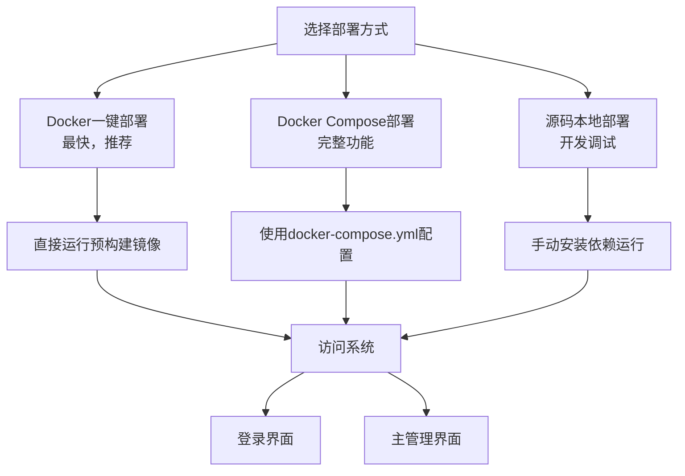
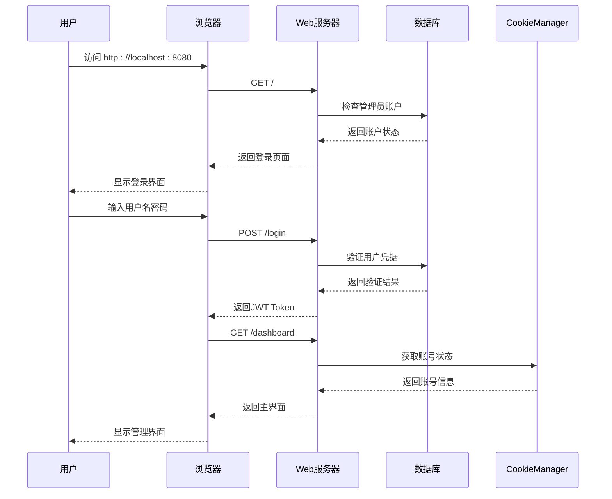
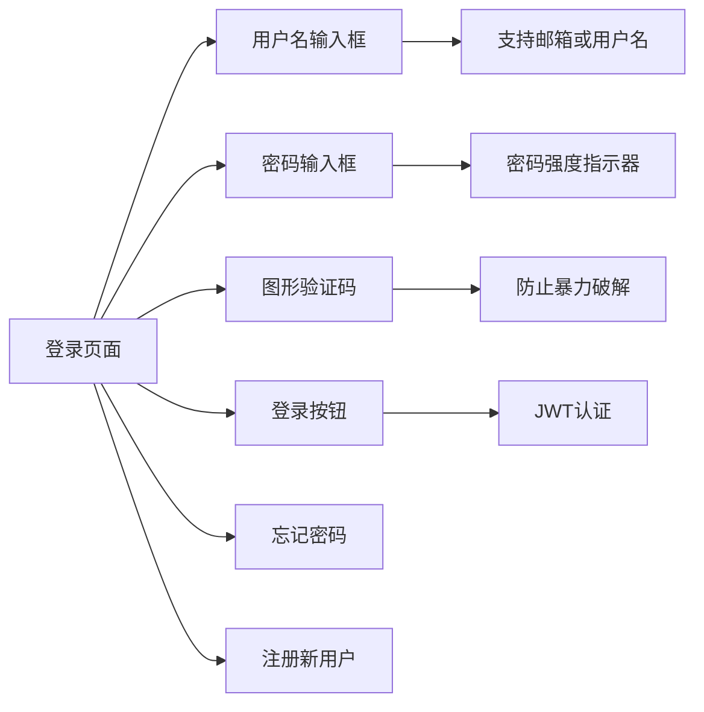

# 快速开始

<cite>
**本文档引用的文件**
- [README.md](file://README.md)
- [docker-deploy.sh](file://docker-deploy.sh)
- [docker-deploy.bat](file://docker-deploy.bat)
- [docker-compose.yml](file://docker-compose.yml)
- [docker-compose-cn.yml](file://docker-compose-cn.yml)
- [Dockerfile](file://Dockerfile)
- [Start.py](file://Start.py)
- [requirements.txt](file://requirements.txt)
- [entrypoint.sh](file://entrypoint.sh)
- [static/index.html](file://static/index.html)
</cite>

## 目录
1. [简介](#简介)
2. [系统要求](#系统要求)
3. [部署方式概览](#部署方式概览)
4. [方式一：Docker一键部署（推荐）](#方式一docker一键部署推荐)
5. [方式二：Docker Compose部署](#方式二docker-compose部署)
6. [方式三：源码本地部署](#方式三源码本地部署)
7. [访问系统](#访问系统)
8. [常见问题排查](#常见问题排查)
9. [系统界面介绍](#系统界面介绍)
10. [后续操作指南](#后续操作指南)

## 简介

闲鱼自动回复系统是一个功能完整的闲鱼自动回复和管理系统，采用现代化的技术架构，支持多用户、多账号管理，具备智能回复、自动发货、自动确认发货、商品管理等企业级功能。系统基于Python异步编程，使用FastAPI提供RESTful API，SQLite数据库存储，支持Docker一键部署。

### 核心特性
- **多用户系统**：支持用户注册登录，数据完全隔离
- **多账号管理**：支持同时管理多个闲鱼账号
- **智能回复**：基于关键词匹配和AI的智能回复系统
- **自动发货**：支持多种发货方式和自动确认发货
- **商品搜索**：基于Playwright的真实商品数据获取
- **实时监控**：WebSocket实时通信和状态监控

## 系统要求

### 环境要求
- **Python**: 3.11+
- **Node.js**: 16+ (用于JavaScript执行)
- **系统**: Windows/Linux/macOS
- **架构**: x86_64 (amd64) / ARM64 (aarch64)
- **内存**: 建议2GB+
- **存储**: 建议10GB+

### Docker环境要求
- **Docker**: 20.10+
- **Docker Compose**: 2.0+

## 部署方式概览

系统提供三种部署方式，满足不同用户的需求：



**图表来源**
- [README.md](file://README.md#L241-L360)
- [docker-deploy.sh](file://docker-deploy.sh#L1-L50)
- [Start.py](file://Start.py#L1-L50)

## 方式一：Docker一键部署（推荐）

### 国内用户（阿里云镜像，推荐）

#### Linux/macOS系统
```bash
# 1. 创建数据目录
mkdir -p xianyu-auto-reply

# 2. 一键启动容器（支持AMD64/ARM64，自动选择架构）
docker run -d \
  -p 8080:8080 \
  --restart always \
  -v $PWD/xianyu-auto-reply/:/app/data/ \
  --name xianyu-auto-reply \
  registry.cn-shanghai.aliyuncs.com/zhinian-software/xianyu-auto-reply:latest
```

#### Windows系统
```powershell
# 1. 创建数据目录
mkdir xianyu-auto-reply

# 2. 一键启动容器（支持AMD64/ARM64，自动选择架构）
docker run -d -p 8080:8080 --restart always -v %cd%/xianyu-auto-reply/:/app/data/ --name xianyu-auto-reply registry.cn-shanghai.aliyuncs.com/zhinian-software/xianyu-auto-reply:latest
```

### 国际用户（Docker Hub镜像）

#### Linux/macOS系统
```bash
# 使用Docker Hub国际镜像
docker run -d \
  -p 8080:8080 \
  --restart always \
  -v $PWD/xianyu-auto-reply/:/app/data/ \
  --name xianyu-auto-reply \
  zhinianblog/xianyu-auto-reply:latest
```

#### Windows系统
```powershell
# 使用Docker Hub国际镜像
docker run -d -p 8080:8080 --restart always -v %cd%/xianyu-auto-reply/:/app/data/ --name xianyu-auto-reply zhinianblog/xianyu-auto-reply:latest
```

### 部署验证

部署完成后，系统会自动启动并监听8080端口。您可以使用以下命令验证部署状态：

```bash
# 查看容器状态
docker ps | grep xianyu-auto-reply

# 查看容器日志
docker logs xianyu-auto-reply
```

**章节来源**
- [README.md](file://README.md#L241-L300)

## 方式二：Docker Compose部署

### 国际版（推荐海外用户）

#### 1. 克隆项目
```bash
git clone https://github.com/zhinianboke/xianyu-auto-reply.git
cd xianyu-auto-reply
```

#### 2. 启动服务
```bash
# 使用完整版配置（包含Redis缓存等增强功能）
docker-compose up -d --build
```

### 中国版（推荐国内用户）

#### 1. 克隆项目
```bash
git clone https://github.com/zhinianboke/xianyu-auto-reply.git
cd xianyu-auto-reply
```

#### 2. 启动服务
```bash
# 使用中国镜像源配置（下载速度更快）
docker-compose -f docker-compose-cn.yml up -d --build
```

### Windows用户

#### 国际版
```cmd
docker-compose up -d --build
```

#### 中国版（推荐）
```cmd
docker-compose -f docker-compose-cn.yml up -d --build
```

### Docker Compose脚本管理

系统提供了便捷的部署管理脚本：

#### Linux/macOS系统
```bash
# 快速部署
./docker-deploy.sh

# 启动服务
./docker-deploy.sh start

# 查看状态
./docker-deploy.sh status

# 查看日志
./docker-deploy.sh logs

# 停止服务
./docker-deploy.sh stop

# 重启服务
./docker-deploy.sh restart
```

#### Windows系统
```cmd
# 快速部署
docker-deploy.bat

# 启动服务
docker-deploy.bat start

# 查看状态
docker-deploy.bat status

# 查看日志
docker-deploy.bat logs

# 停止服务
docker-deploy.bat stop

# 重启服务
docker-deploy.bat restart
```

**章节来源**
- [docker-deploy.sh](file://docker-deploy.sh#L298-L361)
- [docker-deploy.bat](file://docker-deploy.bat#L70-L229)

## 方式三：源码本地部署

### 1. 克隆项目
```bash
git clone https://github.com/zhinianboke/xianyu-auto-reply.git
cd xianyu-auto-reply
```

### 2. 创建虚拟环境（推荐）
```bash
# 创建虚拟环境
python -m venv venv

# 激活虚拟环境
source venv/bin/activate  # Linux/macOS
# 或 venv\Scripts\activate  # Windows
```

### 3. 安装Python依赖
```bash
# 升级pip
pip install --upgrade pip

# 安装依赖
pip install -r requirements.txt
```

### 4. 安装Playwright浏览器
```bash
# 安装Chromium浏览器
playwright install chromium

# Linux系统需要安装系统依赖
playwright install-deps chromium
```

### 5. 启动系统
```bash
# 启动主程序
python Start.py
```

### 6. 访问系统
```bash
# 默认访问地址
http://localhost:8080
```

### 源码部署注意事项

#### 环境变量配置
系统支持通过环境变量进行配置，主要配置项包括：

```bash
# 基础配置
WEB_PORT=8080                          # Web服务端口
API_HOST=0.0.0.0                       # API服务主机
TZ=Asia/Shanghai                       # 时区设置

# 数据库配置
DB_PATH=data/xianyu_data.db            # 数据库文件路径

# 管理员配置
ADMIN_USERNAME=admin                   # 管理员用户名
ADMIN_PASSWORD=admin123                # 管理员密码（请修改）
JWT_SECRET_KEY=your-secret-key         # JWT密钥（请修改）

# 功能开关
AUTO_REPLY_ENABLED=true                # 启用自动回复
AUTO_DELIVERY_ENABLED=true             # 启用自动发货
AI_REPLY_ENABLED=false                 # 启用AI回复

# 日志配置
LOG_LEVEL=INFO                         # 日志级别
SQL_LOG_ENABLED=true                   # SQL日志
```

**章节来源**
- [Start.py](file://Start.py#L1-L100)
- [requirements.txt](file://requirements.txt#L1-L93)

## 访问系统

### 默认访问地址
- **Web管理界面**: http://localhost:8080
- **API文档**: http://localhost:8080/docs
- **健康检查**: http://localhost:8080/health

### 默认登录信息
- **用户名**: `admin`
- **密码**: `admin123`
- **安全提示**: 首次登录后请立即修改默认密码！

### 系统启动流程



**图表来源**
- [static/index.html](file://static/index.html#L1-L200)
- [Start.py](file://Start.py#L446-L486)

## 常见问题排查

### 1. 端口冲突问题

**问题描述**: 端口8080已被占用

**解决方案**:
```bash
# 查看端口占用情况
netstat -anp | grep 8080  # Linux/macOS
netstat -ano | findstr 8080  # Windows

# 修改端口配置
export WEB_PORT=8081
docker run -d -p 8081:8080 ...
```

### 2. Docker权限问题

**问题描述**: Docker容器启动失败，权限不足

**解决方案**:
```bash
# Linux系统添加用户到docker组
sudo usermod -aG docker $USER
# 重新登录生效

# 或使用sudo运行
sudo docker run -d -p 8080:8080 ...
```

### 3. 网络连接问题

**问题描述**: 无法访问系统或API调用失败

**解决方案**:
```bash
# 检查防火墙设置
sudo ufw status  # Linux
# 开放8080端口
sudo ufw allow 8080

# 检查容器网络
docker network ls
docker network inspect bridge
```

### 4. 数据持久化问题

**问题描述**: 容器重启后数据丢失

**解决方案**:
```bash
# 检查数据卷挂载
docker volume ls
docker inspect xianyu-auto-reply | grep Mounts

# 重新挂载数据目录
docker run -d -p 8080:8080 -v $(pwd)/data:/app/data ...
```

### 5. 性能优化建议

**内存使用优化**:
```yaml
# docker-compose.yml 中的资源限制配置
deploy:
  resources:
    limits:
      memory: 2048M
      cpus: '2.0'
    reservations:
      memory: 512M
      cpus: '0.5'
```

**章节来源**
- [docker-compose.yml](file://docker-compose.yml#L69-L78)
- [README.md](file://README.md#L362-L426)

## 系统界面介绍

### 登录页面

系统登录页面提供直观的用户认证界面：



**图表来源**
- [static/index.html](file://static/index.html#L1-L200)

### 主管理界面布局

系统主界面采用现代化的仪表板设计：

#### 侧边栏导航
- **仪表盘**: 系统概览和统计信息
- **账号管理**: 添加和管理闲鱼账号
- **商品管理**: 商品信息和状态监控
- **自动回复**: 关键词和AI回复配置
- **自动发货**: 发货规则和卡券管理
- **系统设置**: 全局配置和用户管理

#### 仪表盘统计
- **总账号数**: 当前系统中添加的闲鱼账号数量
- **总关键词数**: 配置的自动回复关键词总数
- **启用账号数**: 正在运行的活跃账号数量
- **系统版本**: 当前系统版本信息

### 截图建议位置说明

#### 登录页面
- **位置**: 用户首次访问系统时显示
- **截图内容**: 包含用户名、密码、验证码输入框和登录按钮
- **重点**: 展示系统的安全认证机制

#### 主界面仪表盘
- **位置**: 用户登录后默认显示
- **截图内容**: 侧边栏导航、统计卡片、系统状态
- **重点**: 展示系统的整体架构和功能模块

#### 账号管理页面
- **位置**: 点击侧边栏"账号管理"时显示
- **截图内容**: 账号列表、添加账号表单、状态监控
- **重点**: 展示多账号管理功能

**章节来源**
- [static/index.html](file://static/index.html#L1-L200)

## 后续操作指南

### 1. 用户注册和登录

#### 注册新用户
1. 访问 `http://localhost:8080/register.html`
2. 填写用户信息，完成邮箱验证
3. 输入图形验证码完成注册

#### 登录系统
1. 访问 `http://localhost:8080`
2. 输入用户名和密码
3. 首次登录后修改默认密码

### 2. 添加闲鱼账号

#### 获取Cookie
1. 在浏览器中登录闲鱼APP
2. 打开开发者工具（F12）
3. 找到Cookie中的 `cookie2` 字段
4. 复制完整的Cookie值

#### 添加账号
1. 登录系统后进入主界面
2. 点击"添加新账号"
3. 输入账号ID和完整的Cookie值
4. 系统自动启动账号监控任务

### 3. 配置自动回复

#### 关键词回复设置
1. 进入"自动回复"页面
2. 设置关键词和对应的回复内容
3. 支持精确匹配和模糊匹配
4. 可设置默认回复

#### AI智能回复配置
1. 配置OpenAI API密钥
2. 选择AI模型（支持GPT-3.5、GPT-4、通义千问等）
3. 设置回复策略和提示词
4. 启用AI回复功能

### 4. 设置自动发货

#### 发货规则配置
1. 进入"自动发货"页面
2. 添加发货规则，设置商品关键词
3. 上传卡密文件或输入发货内容
4. 系统自动匹配商品并发货

#### 发货方式选择
- **文本内容**: 直接输入发货内容
- **卡密文件**: 上传包含卡密的文本文件
- **API调用**: 通过API接口获取发货内容
- **图片发货**: 上传图片并自动发送给买家

### 5. 使用商品搜索功能

#### 搜索操作
1. 访问商品搜索页面（需要登录）
2. 输入搜索关键词和查询页数
3. 系统自动获取真实闲鱼商品数据
4. 商品按"人想要"数量自动排序

#### 功能特性
- **真实数据**: 基于Playwright技术获取真实数据
- **智能排序**: 按"人想要"数量排序
- **多页搜索**: 支持分页搜索和批量获取
- **数据可视化**: 美观的商品展示界面

**章节来源**
- [README.md](file://README.md#L444-L526)

## 结语

本快速入门指南涵盖了闲鱼自动回复系统的主要部署方式和基本操作。通过三种不同的部署方式，您可以根据自己的需求和技术水平选择最适合的方式。

**重要提醒**：
- 本项目仅供学习研究使用，严禁商业用途
- 首次登录后请立即修改默认密码
- 定期备份重要数据
- 关注系统更新和安全公告

如果您在部署过程中遇到任何问题，欢迎参考项目的官方文档或寻求社区支持。祝您使用愉快！