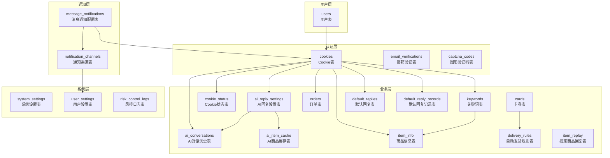
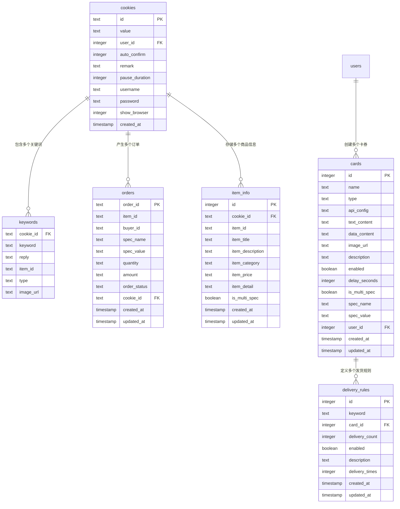
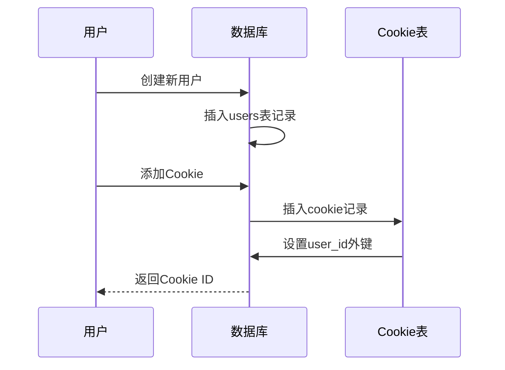
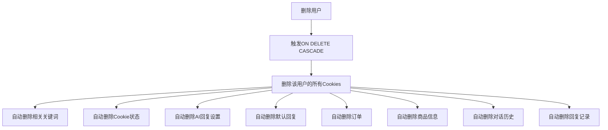
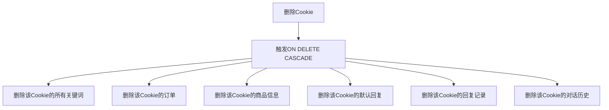
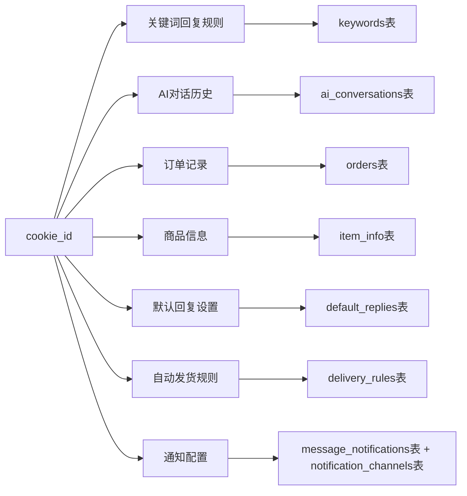
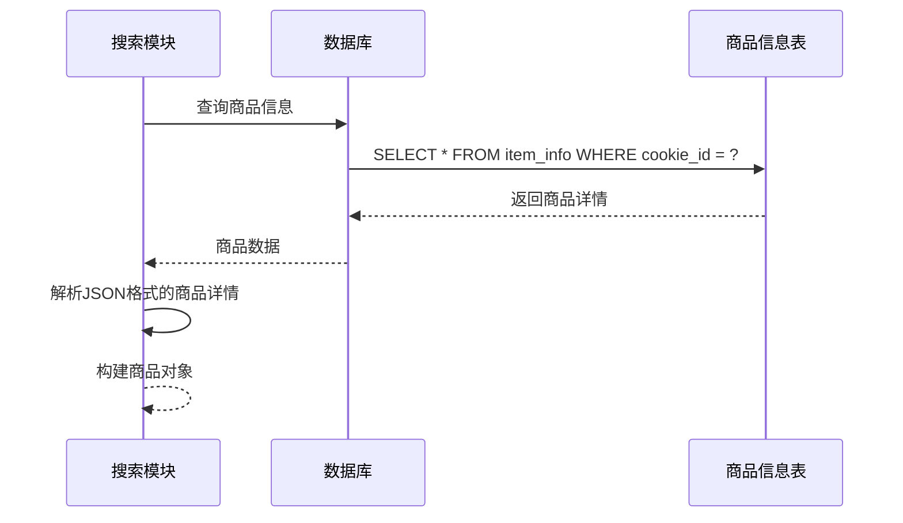
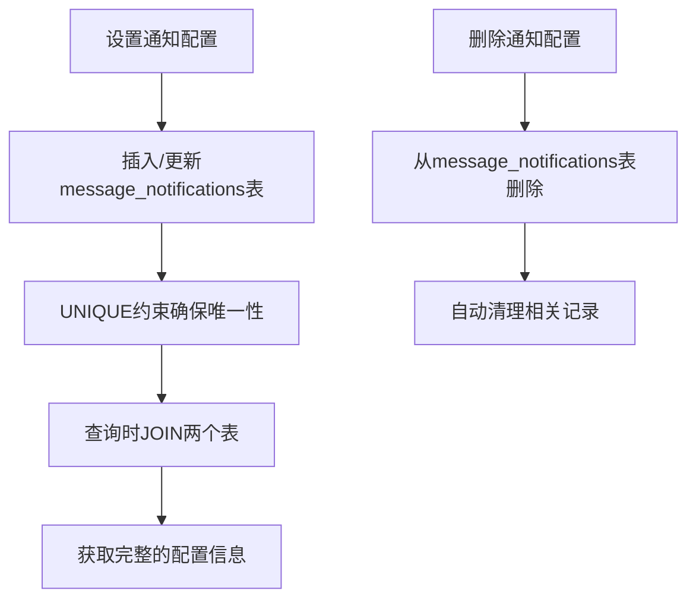

# 数据库关系映射文档

<cite>
**本文档中引用的文件**
- [db_manager.py](file://db_manager.py)
- [utils/item_search.py](file://utils/item_search.py)
- [reply_server.py](file://reply_server.py)
- [XianyuAutoAsync.py](file://XianyuAutoAsync.py)
- [static/js/app.js](file://static/js/app.js)
</cite>

## 目录
1. [概述](#概述)
2. [数据库架构概览](#数据库架构概览)
3. [核心实体关系图](#核心实体关系图)
4. [详细关系分析](#详细关系分析)
5. [级联删除机制](#级联删除机制)
6. [数据访问路径](#数据访问路径)
7. [多对多关系实现](#多对多关系实现)
8. [数据一致性保障](#数据一致性保障)
9. [实际查询示例](#实际查询示例)
10. [性能考虑](#性能考虑)
11. [总结](#总结)

## 概述

本文档详细描述了闲鱼自动回复系统的数据库关系映射，基于db_manager.py中的数据库设计和外键约束。系统采用SQLite数据库，通过精心设计的实体关系实现了复杂的功能需求，包括用户管理、Cookie管理、关键词回复、通知系统、AI对话等功能。

## 数据库架构概览

系统数据库包含以下主要表结构：



**图表来源**
- [db_manager.py](file://db_manager.py#L74-L439)

## 核心实体关系图

### 一对一关系

```mermaid
erDiagram
users {
integer id PK
text username UK
text email UK
text password_hash
boolean is_active
timestamp created_at
timestamp updated_at
}
cookies {
text id PK
text value
integer user_id FK
integer auto_confirm
text remark
integer pause_duration
text username
text password
integer show_browser
timestamp created_at
}
ai_reply_settings {
text cookie_id PK FK
boolean ai_enabled
text model_name
text api_key
text base_url
integer max_discount_percent
integer max_discount_amount
integer max_bargain_rounds
text custom_prompts
timestamp created_at
timestamp updated_at
}
cookie_status {
text cookie_id PK FK
boolean enabled
timestamp updated_at
}
default_replies {
text cookie_id PK FK
boolean enabled
text reply_content
boolean reply_once
timestamp created_at
timestamp updated_at
}
users ||--o{ cookies : "拥有多个"
cookies ||--|| ai_reply_settings : "一对一对应"
cookies ||--|| cookie_status : "一对一对应"
cookies ||--|| default_replies : "一对一对应"
```

**图表来源**
- [db_manager.py](file://db_manager.py#L74-L318)

### 一对多关系



**图表来源**
- [db_manager.py](file://db_manager.py#L110-L305)

## 详细关系分析

### 用户与Cookie关系

每个用户可以拥有多个Cookie，这是通过`user_id`字段建立的一对多关系：



**图表来源**
- [db_manager.py](file://db_manager.py#L110-L122)

### Cookie与关键词关系

Cookie与关键词之间是一对多关系，支持按商品ID区分通用关键词和特定商品关键词：

```mermaid
flowchart TD
A[Cookie] --> B{关键词类型}
B --> |通用关键词| C[keyword + reply]
B --> |商品关键词| D[item_id + keyword + reply]
C --> E[keywords表记录]
D --> F[keywords表记录]
E --> G[UNIQUE约束: (cookie_id, keyword)]
F --> H[UNIQUE约束: (cookie_id, keyword, item_id)]
```

**图表来源**
- [db_manager.py](file://db_manager.py#L128-L137)

### AI回复系统关系

AI回复系统通过多个表协同工作：

```mermaid
erDiagram
ai_reply_settings {
text cookie_id PK FK
boolean ai_enabled
text model_name
text api_key
text base_url
integer max_discount_percent
integer max_discount_amount
integer max_bargain_rounds
text custom_prompts
}
ai_conversations {
integer id PK
text cookie_id FK
text chat_id
text user_id
text item_id
text role
text content
text intent
integer bargain_count
timestamp created_at
}
ai_item_cache {
text item_id PK
text data
real price
text description
timestamp last_updated
}
ai_reply_settings ||--o{ ai_conversations : "产生对话历史"
ai_conversations ||--|| ai_item_cache : "查询商品信息"
```

**图表来源**
- [db_manager.py](file://db_manager.py#L151-L193)

## 级联删除机制

系统广泛使用ON DELETE CASCADE外键约束，确保数据完整性：

### 用户删除时的级联操作



**图表来源**
- [db_manager.py](file://db_manager.py#L121-L122)

### Cookie删除时的级联操作



**图表来源**
- [db_manager.py](file://db_manager.py#L121-L122)
- [db_manager.py](file://db_manager.py#L231-L233)

## 数据访问路径

### 通过Cookie_ID追溯完整数据链

系统提供了完整的数据追溯能力，通过cookie_id可以访问以下所有相关信息：



**图表来源**
- [db_manager.py](file://db_manager.py#L1695-L1718)
- [db_manager.py](file://db_manager.py#L2119-L2146)

### 商品搜索与数据关联

商品搜索功能通过item_search.py模块实现，与item_info表紧密关联：



**图表来源**
- [utils/item_search.py](file://utils/item_search.py#L780-L800)
- [db_manager.py](file://db_manager.py#L3885-L3923)

## 多对多关系实现

### Message_Notifications与Notification_Channels的多对多关系

系统通过中间表message_notifications实现Cookie与通知渠道的多对多关系：

```mermaid
erDiagram
cookies {
text id PK
text value
integer user_id FK
}
notification_channels {
integer id PK
text name
text type
text config
boolean enabled
}
message_notifications {
integer id PK
text cookie_id FK
integer channel_id FK
boolean enabled
timestamp created_at
timestamp updated_at
UNIQUE(cookie_id, channel_id)
}
cookies ||--o{ message_notifications : "配置多个通知"
notification_channels ||--o{ message_notifications : "接收来自多个Cookie的通知"
```

**图表来源**
- [db_manager.py](file://db_manager.py#L380-L390)

### 多对多关系的操作



**图表来源**
- [db_manager.py](file://db_manager.py#L2102-L2117)
- [db_manager.py](file://db_manager.py#L2119-L2146)

## 数据一致性保障

### UNIQUE约束的应用

系统在多个地方使用UNIQUE约束确保数据一致性：

#### 商品信息唯一性约束

```mermaid
erDiagram
item_info {
integer id PK
text cookie_id FK
text item_id
text item_title
text item_description
text item_category
text item_price
text item_detail
boolean is_multi_spec
timestamp created_at
timestamp updated_at
UNIQUE(cookie_id, item_id)
}
```

**图表来源**
- [db_manager.py](file://db_manager.py#L266-L281)

#### 关键词唯一性约束

系统通过复合唯一索引实现智能的关键词唯一性控制：

```mermaid
flowchart TD
A[关键词插入] --> B{检查item_id}
B --> |为空| C[检查: (cookie_id, keyword)]
B --> |不为空| D[检查: (cookie_id, keyword, item_id)]
C --> E[UNIQUE索引: idx_keywords_unique_no_item]
D --> F[UNIQUE索引: idx_keywords_unique_with_item]
E --> G[允许重复的通用关键词]
F --> H[允许重复的通用关键词]
F --> I[禁止重复的商品关键词]
```

**图表来源**
- [db_manager.py](file://db_manager.py#L1036-L1085)

### 外键约束的完整性

所有外键约束都设置了ON DELETE CASCADE，确保数据完整性：

| 表名 | 外键字段 | 关联表 | ON DELETE行为 |
|------|----------|--------|---------------|
| cookies | user_id | users | CASCADE |
| keywords | cookie_id | cookies | CASCADE |
| orders | cookie_id | cookies | CASCADE |
| ai_reply_settings | cookie_id | cookies | CASCADE |
| cookie_status | cookie_id | cookies | CASCADE |
| default_replies | cookie_id | cookies | CASCADE |
| item_info | cookie_id | cookies | CASCADE |
| message_notifications | cookie_id | cookies | CASCADE |
| message_notifications | channel_id | notification_channels | CASCADE |
| delivery_rules | card_id | cards | CASCADE |

**节来源**
- [db_manager.py](file://db_manager.py#L121-L122)
- [db_manager.py](file://db_manager.py#L135-L137)
- [db_manager.py](file://db_manager.py#L232-L233)
- [db_manager.py](file://db_manager.py#L386-L387)

## 实际查询示例

### 获取某个用户的全部通知配置

以下是获取特定用户所有通知配置的SQL查询：

```sql
SELECT 
    mn.cookie_id,
    mn.id AS notification_id,
    mn.channel_id,
    mn.enabled,
    nc.name AS channel_name,
    nc.type AS channel_type,
    nc.config AS channel_config
FROM 
    message_notifications mn
JOIN 
    notification_channels nc ON mn.channel_id = nc.id
WHERE 
    nc.enabled = 1
ORDER BY 
    mn.cookie_id, mn.id
```

**节来源**
- [db_manager.py](file://db_manager.py#L2153-L2159)

### 获取Cookie的所有关联数据

```sql
SELECT 
    k.keyword,
    k.reply,
    k.item_id,
    o.order_id,
    o.amount,
    ii.item_title,
    ii.item_price,
    ar.ai_enabled,
    ar.model_name
FROM 
    cookies c
LEFT JOIN 
    keywords k ON c.id = k.cookie_id
LEFT JOIN 
    orders o ON c.id = o.cookie_id
LEFT JOIN 
    item_info ii ON c.id = ii.cookie_id
LEFT JOIN 
    ai_reply_settings ar ON c.id = ar.cookie_id
WHERE 
    c.id = ?
```

**节来源**
- [db_manager.py](file://db_manager.py#L1695-L1718)

### 获取用户的所有Cookie及其关键词

```sql
SELECT 
    c.id AS cookie_id,
    c.value AS cookie_value,
    k.keyword,
    k.reply,
    k.item_id
FROM 
    cookies c
LEFT JOIN 
    keywords k ON c.id = k.cookie_id
WHERE 
    c.user_id = ?
ORDER BY 
    c.id, k.keyword
```

**节来源**
- [db_manager.py](file://db_manager.py#L1700-L1708)

## 性能考虑

### 索引策略

系统在关键字段上建立了适当的索引：

| 表名 | 索引字段 | 类型 | 用途 |
|------|----------|------|------|
| cookies | user_id | 普通索引 | 用户隔离查询 |
| keywords | cookie_id | 普通索引 | 快速查找关键词 |
| keywords | cookie_id, keyword | 复合唯一索引 | 关键词去重 |
| keywords | cookie_id, keyword, item_id | 复合唯一索引 | 商品关键词去重 |
| item_info | cookie_id, item_id | 复合唯一索引 | 商品信息去重 |
| message_notifications | cookie_id, channel_id | 复合唯一索引 | 通知配置去重 |

### 查询优化建议

1. **使用JOIN查询时注意性能**：避免笛卡尔积
2. **合理使用索引**：在WHERE子句中使用的字段应建立索引
3. **批量操作**：对于大量数据操作，使用批量插入/更新
4. **连接池管理**：合理配置数据库连接池大小

## 总结

闲鱼自动回复系统的数据库设计体现了良好的软件工程实践：

1. **清晰的关系模型**：通过外键约束建立了明确的一对一、一对多和多对多关系
2. **数据完整性保障**：广泛使用UNIQUE约束和ON DELETE CASCADE确保数据一致性
3. **灵活的查询支持**：通过JOIN操作提供了强大的数据检索能力
4. **用户隔离机制**：通过user_id字段实现了多租户架构
5. **扩展性设计**：预留了足够的扩展点，支持功能的持续演进

这种设计不仅满足了当前的功能需求，也为未来的功能扩展奠定了坚实的基础。通过合理的数据库设计，系统能够高效地处理复杂的业务逻辑，同时保证数据的完整性和一致性。