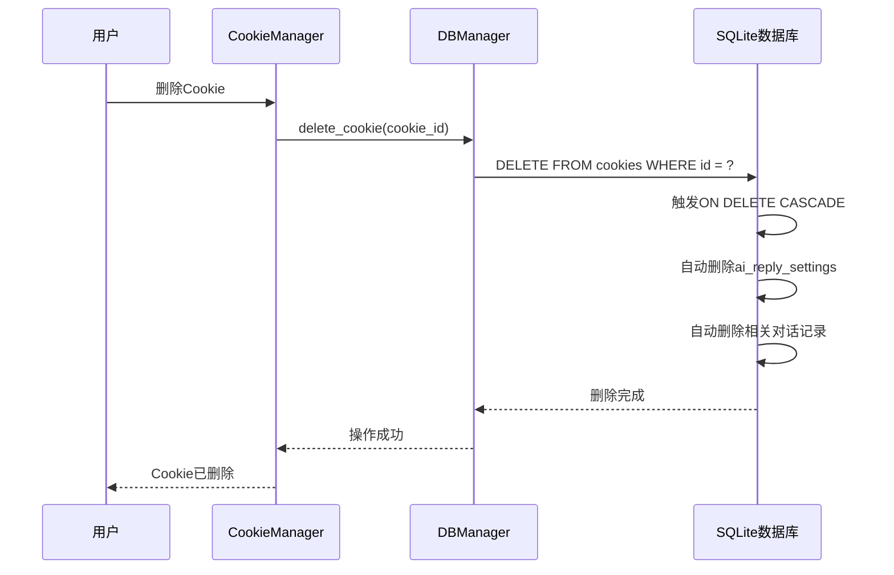
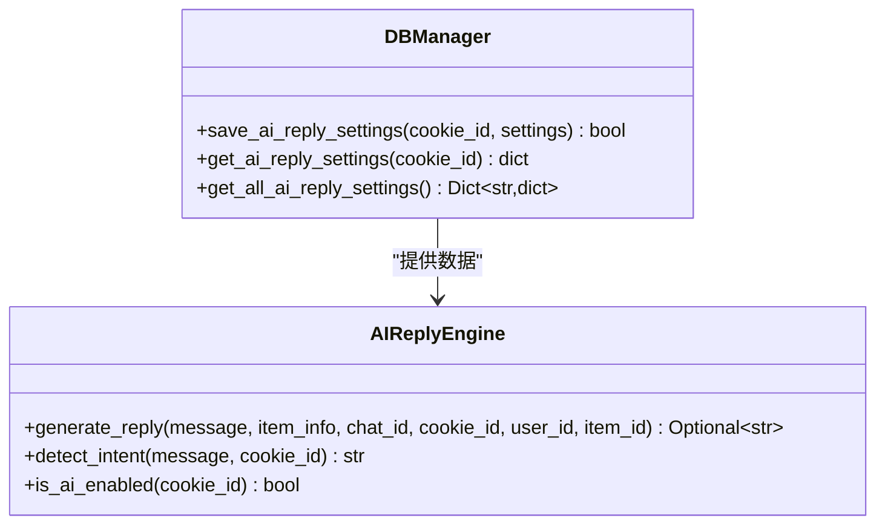
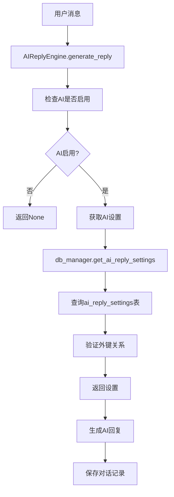
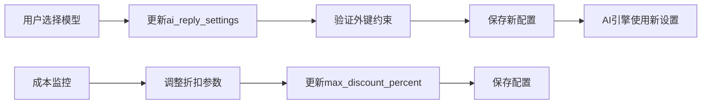
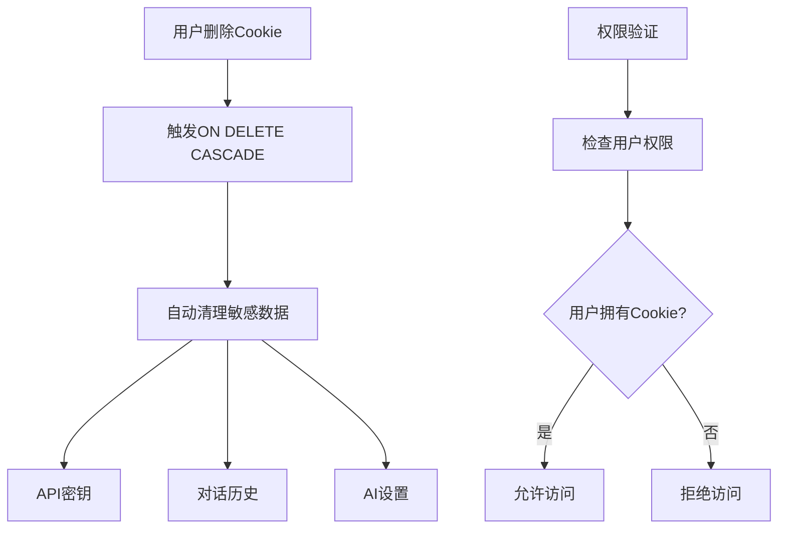

# Cookie与AI回复设置外键关系深度分析

<cite>
**本文档引用的文件**
- [db_manager.py](file://db_manager.py)
- [ai_reply_engine.py](file://ai_reply_engine.py)
- [cookie_manager.py](file://cookie_manager.py)
- [reply_server.py](file://reply_server.py)
</cite>

## 目录
1. [引言](#引言)
2. [外键约束设计](#外键约束设计)
3. [级联删除机制](#级联删除机制)
4. [AI回复设置表结构](#ai回复设置表结构)
5. [外键关系的实际应用](#外键关系的实际应用)
6. [SQL查询示例](#sql查询示例)
7. [多模型切换与成本控制](#多模型切换与成本控制)
8. [对话上下文管理](#对话上下文管理)
9. [安全性与隐私保护](#安全性与隐私保护)
10. [总结](#总结)

## 引言

在闲鱼自动回复系统中，Cookie与AI回复设置之间的外键约束是一个关键的设计决策，它确保了每个闲鱼账号能够独立配置AI智能回复模型、API密钥和自定义提示词，同时实现了数据的一致性和完整性保护。这种设计不仅支持个性化的AI回复策略，还提供了强大的数据清理和隐私保护机制。

## 外键约束设计

### 数据库表结构分析

系统中的核心表结构体现了精心设计的外键关系：

```mermaid
erDiagram
COOKIES {
string id PK
string value
integer user_id FK
integer auto_confirm
string remark
integer pause_duration
string username
string password
integer show_browser
timestamp created_at
}
AI_REPLY_SETTINGS {
string cookie_id PK FK
boolean ai_enabled
string model_name
string api_key
string base_url
integer max_discount_percent
integer max_discount_amount
integer max_bargain_rounds
text custom_prompts
timestamp created_at
timestamp updated_at
}
COOKIES ||--|| AI_REPLY_SETTINGS : "一对一关系"
```

**图表来源**
- [db_manager.py](file://db_manager.py#L110-L165)

### 外键定义详解

在数据库初始化过程中，系统创建了以下外键约束：

```sql
CREATE TABLE IF NOT EXISTS ai_reply_settings (
    cookie_id TEXT PRIMARY KEY,
    ai_enabled BOOLEAN DEFAULT FALSE,
    model_name TEXT DEFAULT 'qwen-plus',
    api_key TEXT,
    base_url TEXT DEFAULT 'https://dashscope.aliyuncs.com/compatible-mode/v1',
    max_discount_percent INTEGER DEFAULT 10,
    max_discount_amount INTEGER DEFAULT 100,
    max_bargain_rounds INTEGER DEFAULT 3,
    custom_prompts TEXT,
    created_at TIMESTAMP DEFAULT CURRENT_TIMESTAMP,
    updated_at TIMESTAMP DEFAULT CURRENT_TIMESTAMP,
    FOREIGN KEY (cookie_id) REFERENCES cookies(id) ON DELETE CASCADE
)
```

**节来源**
- [db_manager.py](file://db_manager.py#L151-L165)

这个外键约束具有以下特点：

1. **一对一关系**：每个Cookie只能对应一个AI回复设置
2. **级联删除**：当Cookie被删除时，其对应的AI设置也会自动删除
3. **数据完整性**：确保只有存在的Cookie才能拥有AI设置

## 级联删除机制

### ON DELETE CASCADE的作用

ON DELETE CASCADE机制在Cookie删除时提供了自动清理功能：



**图表来源**
- [cookie_manager.py](file://cookie_manager.py#L155-L181)
- [db_manager.py](file://db_manager.py#L1196-L1208)

### 自动清理流程

当用户删除Cookie时，系统会执行以下清理步骤：

1. **任务终止**：停止与该Cookie相关的所有后台任务
2. **数据库删除**：从cookies表中删除记录
3. **级联清理**：自动删除所有依赖该Cookie的记录
   - ai_reply_settings
   - ai_conversations
   - keywords
   - cookie_status
   - default_replies
   - message_notifications

**节来源**
- [db_manager.py](file://db_manager.py#L2304-L2316)

## AI回复设置表结构

### 字段详解

AI回复设置表包含了完整的AI回复配置信息：

| 字段名 | 类型 | 默认值 | 说明 |
|--------|------|--------|------|
| cookie_id | TEXT | - | 外键，关联到cookies表的主键 |
| ai_enabled | BOOLEAN | FALSE | 是否启用AI回复功能 |
| model_name | TEXT | 'qwen-plus' | AI模型名称 |
| api_key | TEXT | - | API密钥 |
| base_url | TEXT | 'https://dashscope.aliyuncs.com/compatible-mode/v1' | API基础URL |
| max_discount_percent | INTEGER | 10 | 最大折扣百分比 |
| max_discount_amount | INTEGER | 100 | 最大折扣金额 |
| max_bargain_rounds | INTEGER | 3 | 最大议价轮数 |
| custom_prompts | TEXT | - | 自定义提示词JSON |

**节来源**
- [db_manager.py](file://db_manager.py#L151-L165)

### 数据访问方法

系统提供了专门的数据访问方法来管理AI回复设置：



**图表来源**
- [db_manager.py](file://db_manager.py#L1766-L1844)
- [ai_reply_engine.py](file://ai_reply_engine.py#L232-L236)

**节来源**
- [db_manager.py](file://db_manager.py#L1766-L1844)

## 外键关系的实际应用

### AI回复引擎中的应用

在AI回复引擎中，外键关系确保了正确的数据访问：



**图表来源**
- [ai_reply_engine.py](file://ai_reply_engine.py#L283-L413)

### 加载指定账号的AI设置

系统通过外键关系确保只能访问属于当前用户的AI设置：

```python
# 在AI回复生成过程中加载设置
settings = db_manager.get_ai_reply_settings(cookie_id)
if not settings['ai_enabled'] or not settings['api_key']:
    return None
```

**节来源**
- [ai_reply_engine.py](file://ai_reply_engine.py#L66-L81)

## SQL查询示例

### 获取某个Cookie的AI回复配置

以下是获取特定Cookie的AI回复配置的SQL查询：

```sql
-- 获取单个Cookie的AI设置
SELECT 
    cookie_id,
    ai_enabled,
    model_name,
    api_key,
    base_url,
    max_discount_percent,
    max_discount_amount,
    max_bargain_rounds,
    custom_prompts
FROM ai_reply_settings 
WHERE cookie_id = 'your_cookie_id';

-- 获取所有启用AI的Cookie设置
SELECT c.id, c.value, a.*
FROM cookies c
JOIN ai_reply_settings a ON c.id = a.cookie_id
WHERE a.ai_enabled = TRUE;

-- 获取用户的所有AI设置
SELECT a.*
FROM ai_reply_settings a
JOIN cookies c ON a.cookie_id = c.id
WHERE c.user_id = ?;
```

### 查询统计信息

```sql
-- 统计各模型的使用情况
SELECT model_name, COUNT(*) as count
FROM ai_reply_settings 
GROUP BY model_name;

-- 获取高成本使用情况
SELECT cookie_id, max_discount_percent, max_discount_amount
FROM ai_reply_settings 
WHERE max_discount_percent > 20 OR max_discount_amount > 200;
```

## 多模型切换与成本控制

### 模型切换支持

外键关系支持灵活的模型切换：



### 成本控制机制

通过外键关系，系统可以精确控制成本：

1. **折扣限制**：通过max_discount_percent和max_discount_amount字段
2. **议价轮数限制**：通过max_bargain_rounds字段
3. **模型选择**：通过model_name字段支持不同成本的模型

**节来源**
- [ai_reply_engine.py](file://ai_reply_engine.py#L337-L343)

## 对话上下文管理

### 上下文存储机制

外键关系确保了对话上下文的完整性和隔离性：

```mermaid
erDiagram
AI_CONVERSATIONS {
integer id PK
string cookie_id FK
string chat_id
string user_id
string item_id
string role
text content
string intent
integer bargain_count
timestamp created_at
}
AI_REPLY_SETTINGS {
string cookie_id PK FK
boolean ai_enabled
string model_name
integer max_discount_percent
integer max_bargain_rounds
}
COOKIES {
string id PK
string value
integer user_id FK
}
AI_CONVERSATIONS ||--|| COOKIES : "通过cookie_id关联"
AI_REPLY_SETTINGS ||--|| COOKIES : "通过cookie_id关联"
```

**图表来源**
- [db_manager.py](file://db_manager.py#L168-L182)

### 上下文管理特性

1. **自动清理**：Cookie删除时自动清理对话记录
2. **用户隔离**：不同用户的对话记录相互独立
3. **历史追踪**：完整的对话历史可用于分析和优化

**节来源**
- [ai_reply_engine.py](file://ai_reply_engine.py#L436-L452)

## 安全性与隐私保护

### 敏感信息保护

外键关系提供了多层安全保护：



### 数据清理保证

1. **自动清理**：确保删除Cookie时所有相关数据都被清除
2. **权限隔离**：防止跨用户的数据泄露
3. **审计跟踪**：记录所有删除操作

**节来源**
- [db_manager.py](file://db_manager.py#L4319-L4369)

## 总结

Cookie与AI回复设置之间的外键约束设计体现了系统架构的精妙之处：

1. **数据一致性**：确保只有有效的Cookie才能拥有AI设置
2. **自动化管理**：ON DELETE CASCADE自动清理相关数据
3. **用户隔离**：保护用户隐私和数据安全
4. **灵活性**：支持多模型切换和成本控制
5. **可维护性**：简化了数据管理和清理流程

这种设计不仅满足了业务需求，还为系统的可扩展性和可维护性奠定了坚实的基础。通过外键约束，系统能够在保证数据完整性的同时，提供灵活的AI回复配置能力，真正实现了个性化与安全性的平衡。