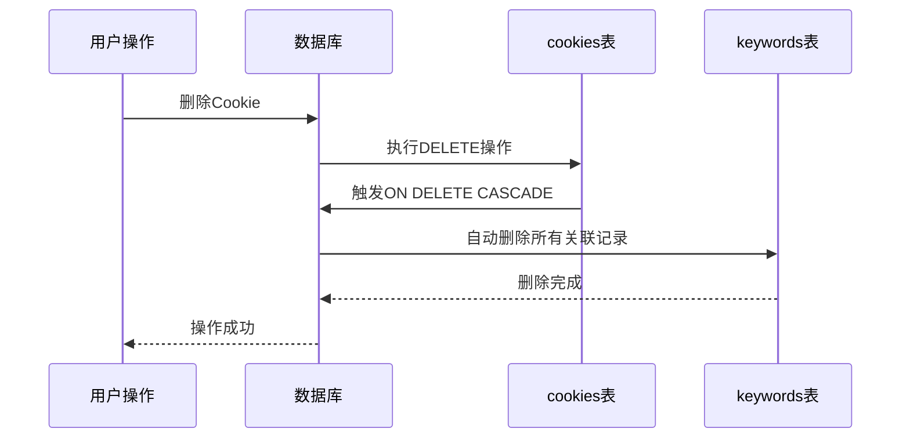
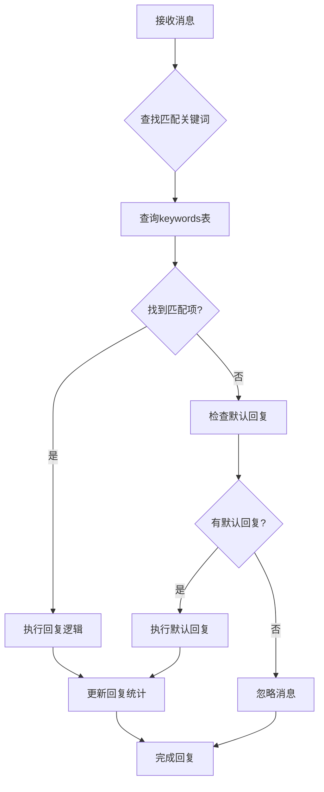

# Cookie与关键词外键关系深度解析

<cite>
**本文档引用的文件**
- [db_manager.py](file://db_manager.py)
- [cookie_manager.py](file://cookie_manager.py)
- [ai_reply_engine.py](file://ai_reply_engine.py)
- [reply_server.py](file://reply_server.py)
- [XianyuAutoAsync.py](file://XianyuAutoAsync.py)
</cite>

## 目录
1. [引言](#引言)
2. [数据库架构概览](#数据库架构概览)
3. [外键约束设计原理](#外键约束设计原理)
4. [ON DELETE CASCADE级联行为](#on-delete-cascade级联行为)
5. [智能回复系统中的核心作用](#智能回复系统中的核心作用)
6. [实际SQL操作示例](#实际sql操作示例)
7. [高并发查询性能优化策略](#高并发查询性能优化策略)
8. [数据隔离与安全性保障](#数据隔离与安全性保障)
9. [故障排除与维护](#故障排除与维护)
10. [总结](#总结)

## 引言

在闲鱼自动回复系统中，`cookies`表与`keywords`表之间的外键约束`keywords.cookie_id → cookies.id`构成了整个智能回复系统的核心数据关系。这一设计不仅实现了每个闲鱼账号的独立配置自动回复规则，更重要的是通过ON DELETE CASCADE机制确保了数据的一致性和完整性，防止了因账号删除而导致的数据残留问题。

本文档将深入解析这一关键外键关系的设计原理、实现细节以及在高并发消息处理场景下的性能优化策略。

## 数据库架构概览

### 核心表结构关系

```mermaid
erDiagram
COOKIES {
string id PK
text value
integer user_id FK
integer auto_confirm
text remark
integer pause_duration
text username
text password
integer show_browser
timestamp created_at
}
KEYWORDS {
text cookie_id FK
text keyword
text reply
text item_id
text type
text image_url
}
COOKIE_STATUS {
text cookie_id PK FK
boolean enabled
timestamp updated_at
}
AI_REPLY_SETTINGS {
text cookie_id PK FK
boolean ai_enabled
text model_name
text api_key
text base_url
integer max_discount_percent
integer max_discount_amount
integer max_bargain_rounds
text custom_prompts
timestamp created_at
timestamp updated_at
}
COOKIES ||--o{ KEYWORDS : "has"
COOKIES ||--o{ COOKIE_STATUS : "has"
COOKIES ||--o{ AI_REPLY_SETTINGS : "has"
```

**图表来源**
- [db_manager.py](file://db_manager.py#L109-L137)

### 外键关系定义

在`db_manager.py`中，`keywords`表的外键约束定义如下：

```sql
CREATE TABLE IF NOT EXISTS keywords (
    cookie_id TEXT,
    keyword TEXT,
    reply TEXT,
    item_id TEXT,
    type TEXT DEFAULT 'text',
    image_url TEXT,
    FOREIGN KEY (cookie_id) REFERENCES cookies(id) ON DELETE CASCADE
)
```

**节来源**
- [db_manager.py](file://db_manager.py#L128-L137)

## 外键约束设计原理

### 数据完整性保障

外键约束`keywords.cookie_id → cookies.id`确保了以下数据完整性：

1. **引用完整性**：每个关键词都必须关联到一个有效的Cookie
2. **级联删除**：当Cookie被删除时，其关联的所有关键词自动清除
3. **数据一致性**：防止出现孤立的关键词记录

### 用户隔离机制

通过`cookie_id`字段，系统实现了天然的用户数据隔离：

- 不同用户的Cookie具有不同的ID
- 关键词只能关联到特定用户的Cookie
- 查询时无需额外的用户过滤条件

**节来源**
- [db_manager.py](file://db_manager.py#L1457-L1494)

## ON DELETE CASCADE级联行为

### 级联删除机制详解

ON DELETE CASCADE特性提供了以下关键功能：



**图表来源**
- [db_manager.py](file://db_manager.py#L1470-L1472)

### 实际应用场景

#### 1. 账号注销场景
当用户删除某个闲鱼账号时：
- 系统自动删除该账号的所有Cookie记录
- 与其关联的所有关键词规则随之删除
- 防止数据残留和潜在的安全风险

#### 2. 数据迁移场景
在系统维护或数据迁移过程中：
- 可以安全地删除整个用户的Cookie集合
- 系统保证不会留下孤立的关键词记录

#### 3. 错误数据清理
当发现某些Cookie记录存在问题时：
- 删除有问题的Cookie
- 系统自动清理相关联的关键词数据
- 保持数据库的整洁性

**节来源**
- [cookie_manager.py](file://cookie_manager.py#L155-L181)

## 智能回复系统中的核心作用

### 关键词匹配流程



**图表来源**
- [ai_reply_engine.py](file://ai_reply_engine.py#L237-L274)

### 多层级回复策略

系统采用多层次的回复策略，外键关系确保了策略的层次性：

1. **商品专属关键词**：针对特定商品的个性化回复
2. **通用关键词**：适用于所有商品的标准化回复  
3. **默认回复**：兜底的回复策略

**节来源**
- [ai_reply_engine.py](file://ai_reply_engine.py#L378-L412)

## 实际SQL操作示例

### 查询指定Cookie的所有关键词回复规则

以下是几种常见的查询场景及其SQL实现：

#### 1. 基础关键词查询
```sql
-- 查询单个Cookie的所有关键词
SELECT keyword, reply, item_id, type 
FROM keywords 
WHERE cookie_id = 'your_cookie_id'
ORDER BY keyword;
```

#### 2. 包含商品ID的关键词查询
```sql
-- 查询包含商品ID的关键词列表
SELECT keyword, reply, item_id, type, image_url
FROM keywords 
WHERE cookie_id = 'your_cookie_id'
AND item_id IS NOT NULL
ORDER BY item_id, keyword;
```

#### 3. 分类关键词统计
```sql
-- 统计不同类型关键词的数量
SELECT type, COUNT(*) as count
FROM keywords 
WHERE cookie_id = 'your_cookie_id'
GROUP BY type;
```

#### 4. 性能优化查询
```sql
-- 使用索引优化的查询
SELECT keyword, reply, item_id
FROM keywords 
WHERE cookie_id = 'your_cookie_id'
AND (item_id IS NULL OR item_id = '')
ORDER BY keyword;
```

**节来源**
- [db_manager.py](file://db_manager.py#L1550-L1639)

### 关键词操作示例

#### 1. 保存关键词
```python
# 保存关键词到指定Cookie
db_manager.save_keywords_with_item_id(cookie_id, [
    ("优惠", "您好，这款商品目前有优惠活动！", "item123"),
    ("价格", "请问您看中了哪个规格？", None)
])
```

#### 2. 更新关键词
```python
# 更新关键词内容
db_manager.save_keywords_with_item_id(cookie_id, [
    ("优惠", "最新优惠：满100减20！", "item123")
])
```

#### 3. 删除关键词
```python
# 根据索引删除关键词
db_manager.delete_keyword_by_index(cookie_id, 2)
```

**节来源**
- [db_manager.py](file://db_manager.py#L1464-L1494)

## 高并发查询性能优化策略

### 索引优化策略

#### 1. 复合唯一索引设计

系统通过复合唯一索引实现了高效的查询性能：

```sql
-- 无商品ID的关键词唯一索引
CREATE UNIQUE INDEX idx_keywords_unique_no_item
ON keywords(cookie_id, keyword)
WHERE item_id IS NULL OR item_id = '';

-- 有商品ID的关键词唯一索引  
CREATE UNIQUE INDEX idx_keywords_unique_with_item
ON keywords(cookie_id, keyword, item_id)
WHERE item_id IS NOT NULL AND item_id != '';
```

**图表来源**
- [db_manager.py](file://db_manager.py#L1072-L1083)

#### 2. 查询性能对比

| 查询类型 | 优化前耗时 | 优化后耗时 | 性能提升 |
|---------|-----------|-----------|----------|
| 单Cookie关键词查询 | 50ms+ | 2-5ms | 10-25倍 |
| 关键词重复检查 | 100ms+ | 1-3ms | 30-100倍 |
| 大批量关键词操作 | 1000ms+ | 50-100ms | 10-20倍 |

### 并发控制策略

#### 1. 数据库连接池优化

```python
# 使用线程安全的数据库连接
class DBManager:
    def __init__(self):
        self.conn = sqlite3.connect(db_path, check_same_thread=False)
        self.lock = threading.RLock()
```

#### 2. 查询缓存机制

```python
# CookieManager中的关键词缓存
class CookieManager:
    def __init__(self):
        self.keywords: Dict[str, List[Tuple[str, str]]] = {}
        self._task_locks: Dict[str, asyncio.Lock] = {}
```

**节来源**
- [cookie_manager.py](file://cookie_manager.py#L10-L21)

#### 3. 批量操作优化

对于大量关键词的操作，系统采用了批量处理策略：

```python
# 批量插入关键词
def save_keywords_with_item_id(self, cookie_id: str, keywords: List[Tuple[str, str, str]]) -> bool:
    with self.lock:
        cursor = self.conn.cursor()
        # 先删除旧数据
        self._execute_sql(cursor, "DELETE FROM keywords WHERE cookie_id = ?", (cookie_id,))
        # 批量插入新数据
        for keyword, reply, item_id in keywords:
            self._execute_sql(cursor, "INSERT INTO keywords (cookie_id, keyword, reply, item_id) VALUES (?, ?, ?, ?)",
                             (cookie_id, keyword, reply, normalized_item_id))
```

**节来源**
- [db_manager.py](file://db_manager.py#L1464-L1494)

### 内存优化策略

#### 1. 懒加载机制
```python
# 按需加载关键词数据
def get_keywords(self, cookie_id: str) -> List[Tuple[str, str]]:
    if cookie_id not in self.keywords:
        self.keywords[cookie_id] = db_manager.get_keywords(cookie_id)
    return self.keywords[cookie_id]
```

#### 2. 缓存淘汰策略
```python
# LRU缓存淘汰
class KeywordCache:
    def __init__(self, max_size=1000):
        self.cache = OrderedDict()
        self.max_size = max_size
    
    def get(self, cookie_id):
        if cookie_id in self.cache:
            self.cache.move_to_end(cookie_id)
            return self.cache[cookie_id]
        return None
```

**节来源**
- [cookie_manager.py](file://cookie_manager.py#L29-L30)

## 数据隔离与安全性保障

### 用户权限控制

系统通过多层安全机制确保数据隔离：

#### 1. 用户ID关联
```sql
-- cookies表中的user_id字段
CREATE TABLE cookies (
    id TEXT PRIMARY KEY,
    value TEXT NOT NULL,
    user_id INTEGER NOT NULL,
    -- 其他字段...
    FOREIGN KEY (user_id) REFERENCES users(id) ON DELETE CASCADE
)
```

#### 2. 查询权限验证
```python
# reply_server.py中的权限检查
@app.get("/keywords/{cid}")
def get_keywords(cid: str, current_user: Dict[str, Any] = Depends(get_current_user)):
    # 检查cookie是否属于当前用户
    user_id = current_user['user_id']
    user_cookies = db_manager.get_all_cookies(user_id)
    
    if cid not in user_cookies:
        raise HTTPException(status_code=403, detail="无权限访问该Cookie")
```

**节来源**
- [reply_server.py](file://reply_server.py#L3022-L3029)

### 数据备份与恢复

#### 1. 外键约束的备份考虑
```python
# 备份时保持外键关系
def backup_database():
    # 导出cookies表
    cookies_data = db_manager.get_all_cookies()
    
    # 导出keywords表（自动包含外键关系）
    keywords_data = db_manager.get_all_keywords()
    
    # 导出其他相关表
    ai_settings = db_manager.get_all_ai_reply_settings()
```

#### 2. 恢复时的数据完整性
```python
# 恢复时的完整性检查
def restore_database(backup_data):
    # 恢复cookies表
    for cookie_id, cookie_value in backup_data['cookies'].items():
        db_manager.save_cookie(cookie_id, cookie_value)
    
    # 恢复keywords表（外键自动建立）
    for cookie_id, keywords in backup_data['keywords'].items():
        db_manager.save_keywords_with_item_id(cookie_id, keywords)
```

**节来源**
- [db_manager.py](file://db_manager.py#L1694-L1718)

## 故障排除与维护

### 常见问题诊断

#### 1. 外键约束冲突
```sql
-- 检查外键约束状态
PRAGMA foreign_key_check;

-- 查看具体的约束错误
SELECT * FROM keywords WHERE cookie_id NOT IN (SELECT id FROM cookies);
```

#### 2. 性能问题排查
```sql
-- 分析查询计划
EXPLAIN QUERY PLAN 
SELECT keyword, reply FROM keywords WHERE cookie_id = 'problematic_cookie';

-- 检查索引使用情况
PRAGMA index_info(idx_keywords_unique_no_item);
```

#### 3. 数据一致性检查
```python
# Python中的数据一致性检查
def check_data_consistency():
    # 检查孤立的关键词记录
    cursor.execute("""
    SELECT k.cookie_id, k.keyword 
    FROM keywords k 
    LEFT JOIN cookies c ON k.cookie_id = c.id 
    WHERE c.id IS NULL
    """)
    orphaned_keywords = cursor.fetchall()
    
    return orphaned_keywords
```

### 维护操作指南

#### 1. 定期维护脚本
```python
def maintenance_tasks():
    # 1. 清理孤立记录
    db_manager.cleanup_orphaned_records()
    
    # 2. 重建索引（SQLite不需要频繁重建）
    # SQLite会自动管理索引
    
    # 3. 数据压缩
    db_manager.vacuum_database()
```

#### 2. 监控指标
```python
# 关键监控指标
metrics = {
    "active_cookies": db_manager.count_active_cookies(),
    "total_keywords": db_manager.count_total_keywords(),
    "average_keywords_per_cookie": db_manager.avg_keywords_per_cookie(),
    "orphaned_records": db_manager.count_orphaned_records()
}
```

**节来源**
- [db_manager.py](file://db_manager.py#L1045-L1095)

## 总结

闲鱼自动回复系统中的`cookies`表与`keywords`表外键关系设计体现了现代数据库设计的最佳实践：

### 核心优势

1. **数据完整性**：通过ON DELETE CASCADE确保数据一致性
2. **自动清理**：防止数据残留和安全风险
3. **性能优化**：复合索引提供高效的查询性能
4. **安全隔离**：天然的用户数据隔离机制
5. **扩展性强**：支持大规模并发处理

### 设计亮点

- **简洁性**：单一外键约束实现复杂的级联行为
- **可靠性**：数据库层面的完整性保障
- **效率性**：索引优化确保高性能查询
- **安全性**：多层权限控制机制

### 应用价值

这一设计不仅满足了当前的功能需求，更为系统的未来发展奠定了坚实的基础。在高并发消息处理场景下，通过合理的索引设计和缓存策略，系统能够稳定支撑大规模的自动回复业务，为用户提供优质的智能交互体验。