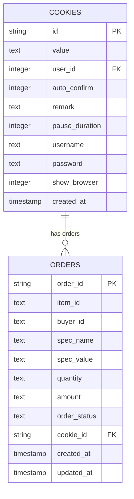
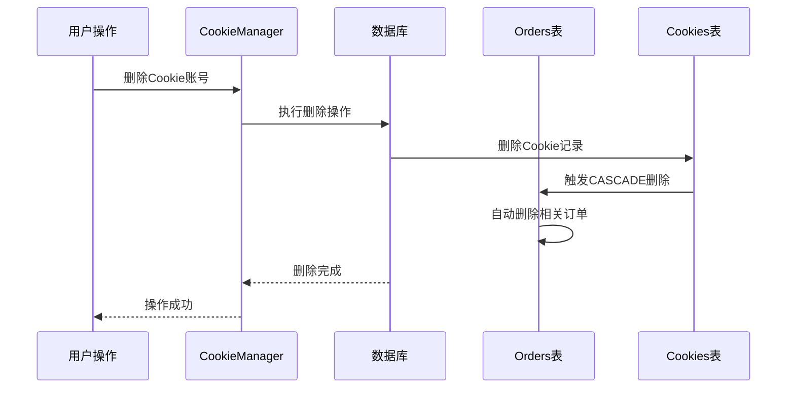
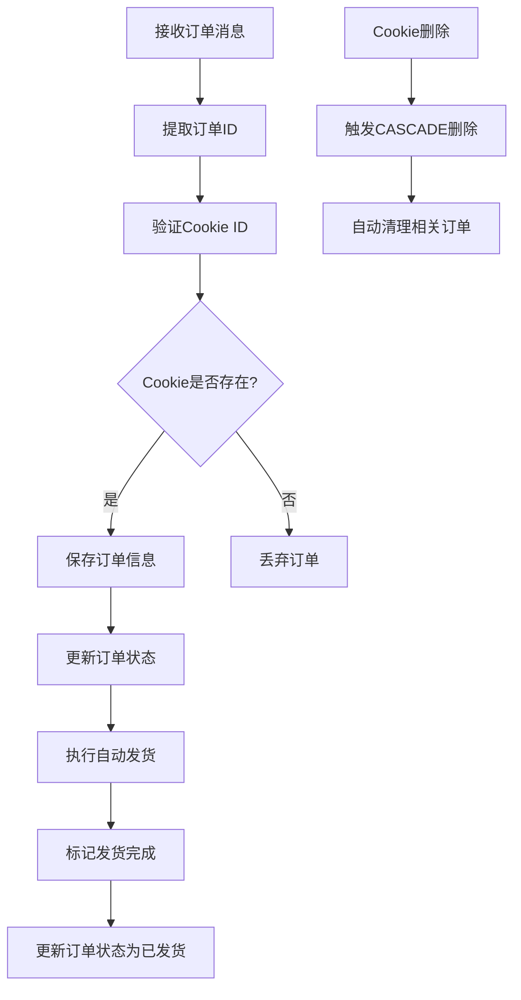
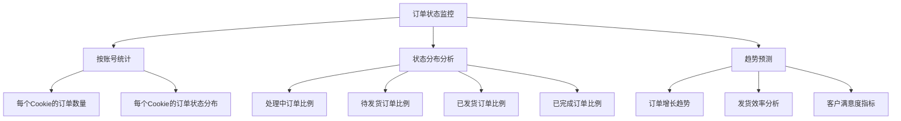

# Cookie与订单外键关系

<cite>
**本文档引用的文件**
- [db_manager.py](file://db_manager.py)
- [cookie_manager.py](file://cookie_manager.py)
- [order_status_handler.py](file://order_status_handler.py)
- [XianyuAutoAsync.py](file://XianyuAutoAsync.py)
- [reply_server.py](file://reply_server.py)
</cite>

## 目录
1. [概述](#概述)
2. [数据库表结构分析](#数据库表结构分析)
3. [外键关系设计](#外键关系设计)
4. [ON DELETE CASCADE机制](#on-delete-cascade机制)
5. [自动发货流程中的应用](#自动发货流程中的应用)
6. [SQL查询示例](#sql查询示例)
7. [订单状态监控与统计](#订单状态监控与统计)
8. [性能优化考虑](#性能优化考虑)
9. [故障排除指南](#故障排除指南)
10. [总结](#总结)

## 概述

在闲鱼自动回复系统中，`cookies`表与`orders`表之间的外键关联是核心的数据完整性保障机制。这种关系不仅实现了订单数据与具体闲鱼账号的绑定，还支持多账号订单的独立跟踪与管理，同时通过ON DELETE CASCADE机制维护数据库的整洁性。

## 数据库表结构分析

### Cookies表结构



**图表来源**
- [db_manager.py](file://db_manager.py#L110-L123)

### Orders表结构

Orders表通过`cookie_id`字段与Cookies表建立外键关系，这一设计确保了每个订单都明确归属于特定的闲鱼账号。

**节来源**
- [db_manager.py](file://db_manager.py#L220-L235)

## 外键关系设计

### 外键约束定义

在数据库初始化过程中，Orders表的外键约束被这样定义：

```sql
FOREIGN KEY (cookie_id) REFERENCES cookies(id) ON DELETE CASCADE
```

这个约束具有以下特性：

1. **引用完整性**：确保Orders表中的每个`cookie_id`必须存在于Cookies表中
2. **级联删除**：当Cookies表中的记录被删除时，相关的Orders记录也会自动删除
3. **数据一致性**：防止出现孤立的订单记录

### 外键关系的作用

#### 1. 账号绑定机制

外键关系实现了订单与闲鱼账号的精确绑定：

- 每个订单都明确知道属于哪个Cookie账号
- 支持多账号系统的独立管理
- 确保数据查询的准确性

#### 2. 多账号订单管理

系统支持多个闲鱼账号同时运行，每个账号的订单独立管理：

- 不同账号的订单不会相互干扰
- 可以为每个账号设置独立的配置
- 支持账号级别的权限控制

#### 3. 数据隔离

外键关系提供了良好的数据隔离：

- 每个账号的订单数据独立存储
- 查询时可以按账号过滤
- 避免跨账号的数据泄露

**节来源**
- [db_manager.py](file://db_manager.py#L232-L234)

## ON DELETE CASCADE机制

### 机制原理

ON DELETE CASCADE机制在Cookie账号删除时自动清理相关订单记录，这是数据库层面的自动维护机制。



**图表来源**
- [cookie_manager.py](file://cookie_manager.py#L175-L181)
- [db_manager.py](file://db_manager.py#L175-L181)

### 必要性分析

#### 1. 数据库整洁性维护

- **防止数据冗余**：删除账号时自动清理相关数据
- **减少存储空间**：避免产生孤立的订单记录
- **简化维护工作**：无需手动清理相关数据

#### 2. 数据一致性保障

- **引用完整性**：确保数据库中不会出现无效的外键引用
- **查询准确性**：避免查询到不存在账号的订单
- **业务逻辑正确性**：保证业务数据的一致性

#### 3. 性能优化

- **索引维护**：减少无效索引的维护开销
- **查询优化**：避免查询无效数据的性能损失
- **备份效率**：减少备份过程中的无效数据

### 实现细节

在CookieManager中，删除Cookie的操作如下：

```python
# 删除Cookie时触发CASCADE删除
db_manager.delete_cookie(cookie_id)
```

**节来源**
- [cookie_manager.py](file://cookie_manager.py#L175-L181)

## 自动发货流程中的应用

### 外键在自动发货中的作用

在外键关系的支持下，自动发货流程能够准确识别和处理属于特定账号的订单。



**图表来源**
- [XianyuAutoAsync.py](file://XianyuAutoAsync.py#L824-L848)
- [order_status_handler.py](file://order_status_handler.py#L836-L852)

### 关键应用场景

#### 1. 订单状态更新

自动发货系统通过Cookie ID快速定位和更新订单状态：

```python
# 自动发货时的状态更新
success = self.order_status_handler.handle_auto_delivery_order_status(
    order_id=order_id,
    cookie_id=self.cookie_id,
    context="自动发货完成"
)
```

#### 2. 订单信息保存

在保存订单信息时，系统会验证Cookie的存在性：

```python
# 检查Cookie是否存在
cookie_info = db_manager.get_cookie_by_id(self.cookie_id)
if not cookie_info:
    logger.warning(f"Cookie ID {self.cookie_id} 不存在，丢弃订单 {order_id}")
else:
    # 保存订单信息
    success = db_manager.insert_or_update_order(...)
```

#### 3. 订单查询优化

系统可以根据Cookie ID快速查询特定账号的所有订单：

```python
# 获取特定Cookie的所有订单
orders = db_manager.get_orders_by_cookie(cookie_id, limit=100)
```

**节来源**
- [XianyuAutoAsync.py](file://XianyuAutoAsync.py#L824-L848)
- [XianyuAutoAsync.py](file://XianyuAutoAsync.py#L4428-L4443)
- [db_manager.py](file://db_manager.py#L4507-L4538)

## SQL查询示例

### 基础查询

#### 获取特定Cookie的所有订单

```sql
SELECT order_id, item_id, buyer_id, spec_name, spec_value, 
       quantity, amount, order_status, created_at, updated_at
FROM orders 
WHERE cookie_id = ?
ORDER BY created_at DESC 
LIMIT 100
```

#### 统计各账号的订单数量

```sql
SELECT c.id AS cookie_id, c.username, COUNT(o.order_id) AS order_count
FROM cookies c
LEFT JOIN orders o ON c.id = o.cookie_id
GROUP BY c.id, c.username
ORDER BY order_count DESC
```

### 高级查询

#### 获取特定时间段内的订单

```sql
SELECT o.*, c.username
FROM orders o
JOIN cookies c ON o.cookie_id = c.id
WHERE o.created_at BETWEEN ? AND ?
AND o.cookie_id = ?
ORDER BY o.created_at DESC
```

#### 订单状态分布统计

```sql
SELECT 
    o.order_status,
    COUNT(*) AS count,
    SUM(CASE WHEN o.order_status = 'shipped' THEN 1 ELSE 0 END) AS shipped_count,
    SUM(CASE WHEN o.order_status = 'completed' THEN 1 ELSE 0 END) AS completed_count
FROM orders o
WHERE o.cookie_id = ?
GROUP BY o.order_status
```

### 性能优化查询

#### 索引优化查询

```sql
-- 获取最近的订单
SELECT * FROM orders 
WHERE cookie_id = ?
ORDER BY created_at DESC 
LIMIT 50

-- 按状态查询订单
SELECT * FROM orders 
WHERE cookie_id = ? 
AND order_status = ?
ORDER BY created_at DESC
```

**节来源**
- [db_manager.py](file://db_manager.py#L4507-L4538)

## 订单状态监控与统计

### 状态监控机制

外键关系为订单状态监控提供了可靠的数据基础：



### 统计分析应用

#### 1. 账号绩效分析

```sql
-- 分析各账号的订单处理效率
SELECT 
    c.id AS cookie_id,
    c.username,
    COUNT(CASE WHEN o.order_status = 'shipped' THEN 1 END) AS shipped_orders,
    COUNT(CASE WHEN o.order_status = 'completed' THEN 1 END) AS completed_orders,
    AVG(JULIANDAY(o.updated_at) - JULIANDAY(o.created_at)) AS avg_processing_days
FROM cookies c
LEFT JOIN orders o ON c.id = o.cookie_id
GROUP BY c.id, c.username
ORDER BY avg_processing_days ASC
```

#### 2. 订单生命周期分析

```sql
-- 分析订单从创建到完成的时间分布
SELECT 
    CASE 
        WHEN days <= 1 THEN '1天内'
        WHEN days <= 3 THEN '1-3天'
        WHEN days <= 7 THEN '3-7天'
        WHEN days <= 14 THEN '7-14天'
        ELSE '14天以上'
    END AS processing_time_range,
    COUNT(*) AS order_count,
    AVG(days) AS avg_days
FROM (
    SELECT 
        o.order_id,
        JULIANDAY(o.updated_at) - JULIANDAY(o.created_at) AS days
    FROM orders o
    WHERE o.order_status = 'completed'
) t
GROUP BY processing_time_range
ORDER BY MIN(days)
```

#### 3. 异常订单检测

```sql
-- 检测长时间未处理的订单
SELECT 
    o.order_id,
    o.item_id,
    o.buyer_id,
    o.order_status,
    o.created_at,
    o.updated_at,
    JULIANDAY('now') - JULIANDAY(o.created_at) AS days_since_creation
FROM orders o
JOIN cookies c ON o.cookie_id = c.id
WHERE o.order_status IN ('processing', 'pending_ship')
AND JULIANDAY('now') - JULIANDAY(o.created_at) > 3
ORDER BY days_since_creation DESC
```

**节来源**
- [order_status_handler.py](file://order_status_handler.py#L836-L852)

## 性能优化考虑

### 查询性能优化

#### 1. 索引策略

为了提高查询性能，建议在以下字段上创建索引：

```sql
-- 在cookie_id上创建索引
CREATE INDEX idx_orders_cookie_id ON orders(cookie_id);

-- 在order_status上创建索引
CREATE INDEX idx_orders_status ON orders(order_status);

-- 在created_at上创建索引
CREATE INDEX idx_orders_created_at ON orders(created_at);
```

#### 2. 查询优化技巧

```sql
-- 使用EXISTS替代IN子查询
SELECT * FROM orders o
WHERE EXISTS (
    SELECT 1 FROM cookies c 
    WHERE c.id = o.cookie_id 
    AND c.id = ?
)

-- 使用JOIN替代子查询
SELECT o.*, c.username 
FROM orders o
JOIN cookies c ON o.cookie_id = c.id
WHERE c.id = ?
ORDER BY o.created_at DESC
LIMIT 100
```

### 存储优化

#### 1. 数据分区

对于大量订单数据，可以考虑按时间进行分区：

```sql
-- 按月份分区
CREATE TABLE orders_partitioned (
    -- 表结构相同
) PARTITION BY RANGE(created_at) (
    PARTITION p202401 VALUES LESS THAN ('2024-02-01'),
    PARTITION p202402 VALUES LESS THAN ('2024-03-01'),
    -- 更多分区...
);
```

#### 2. 数据归档

定期将历史数据归档到冷存储：

```sql
-- 归档一年前的订单
INSERT INTO orders_archive
SELECT * FROM orders 
WHERE created_at < DATE('now', '-1 year');

-- 删除归档的数据
DELETE FROM orders 
WHERE created_at < DATE('now', '-1 year');
```

## 故障排除指南

### 常见问题及解决方案

#### 1. 外键约束错误

**问题**：尝试插入不存在的cookie_id到orders表

**解决方案**：
```sql
-- 检查Cookie是否存在
SELECT * FROM cookies WHERE id = ?;

-- 如果不存在，先创建Cookie
INSERT INTO cookies (id, value, user_id) VALUES (?, ?, ?);
```

#### 2. 级联删除问题

**问题**：意外删除了过多的订单数据

**解决方案**：
```sql
-- 检查即将删除的订单数量
SELECT COUNT(*) FROM orders WHERE cookie_id = ?;

-- 如果数量异常，可以恢复数据
BEGIN TRANSACTION;
DELETE FROM cookies WHERE id = ?;
ROLLBACK;
```

#### 3. 查询性能问题

**问题**：查询特定Cookie的订单很慢

**解决方案**：
```sql
-- 检查查询计划
EXPLAIN QUERY PLAN 
SELECT * FROM orders WHERE cookie_id = ? ORDER BY created_at DESC LIMIT 100;

-- 添加适当的索引
CREATE INDEX idx_orders_cookie_status ON orders(cookie_id, order_status, created_at);
```

### 监控和维护

#### 1. 定期检查

```sql
-- 检查外键约束状态
PRAGMA foreign_key_check;

-- 检查孤立的订单记录
SELECT * FROM orders o
WHERE NOT EXISTS (
    SELECT 1 FROM cookies c WHERE c.id = o.cookie_id
);
```

#### 2. 数据完整性验证

```sql
-- 验证订单数量与Cookie数量的关系
SELECT c.id, c.username, 
       (SELECT COUNT(*) FROM orders o WHERE o.cookie_id = c.id) AS order_count
FROM cookies c
ORDER BY order_count DESC;
```

**节来源**
- [db_manager.py](file://db_manager.py#L4400-L4538)

## 总结

Cookie与订单外键关系的设计体现了现代数据库设计的最佳实践。通过精心设计的外键约束和ON DELETE CASCADE机制，系统实现了：

1. **数据完整性保障**：确保订单与账号的正确绑定
2. **自动化维护**：通过级联删除自动清理相关数据
3. **查询性能优化**：支持高效的账号级数据查询
4. **业务逻辑清晰**：为自动发货等业务功能提供可靠的数据基础

这种设计不仅满足了当前的功能需求，也为未来的扩展提供了良好的架构基础。通过合理的索引策略和查询优化，系统能够在大规模数据环境下保持良好的性能表现。