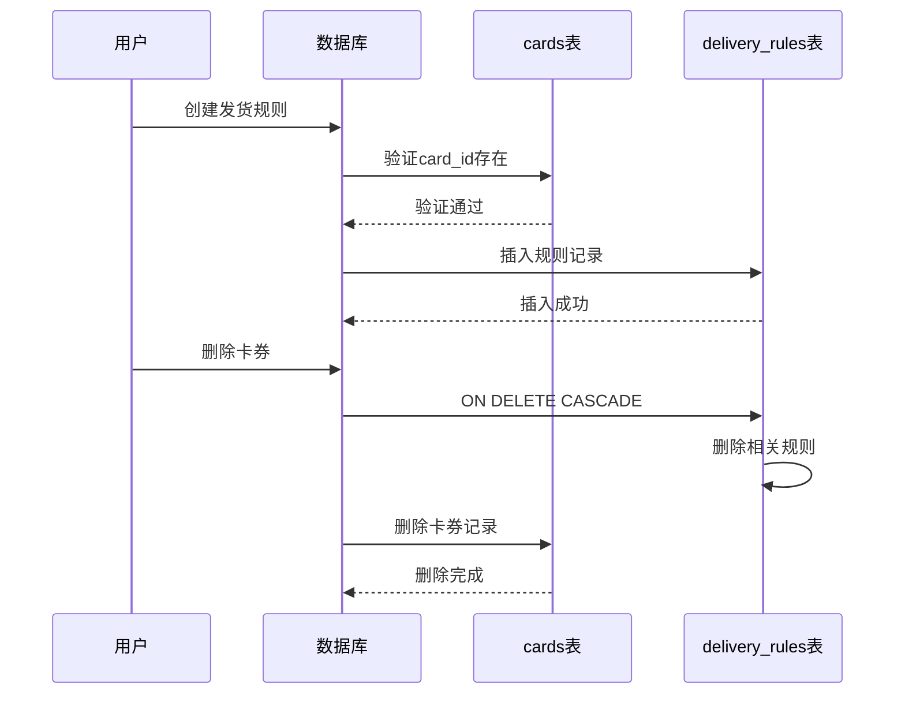
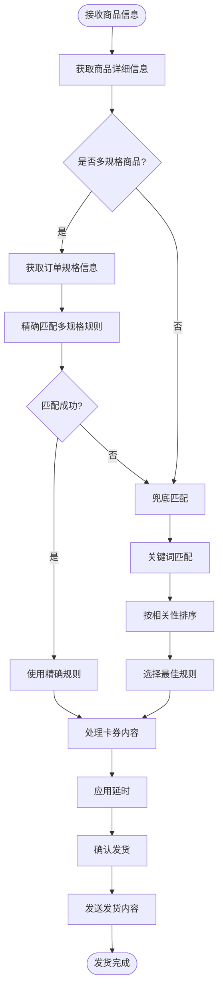
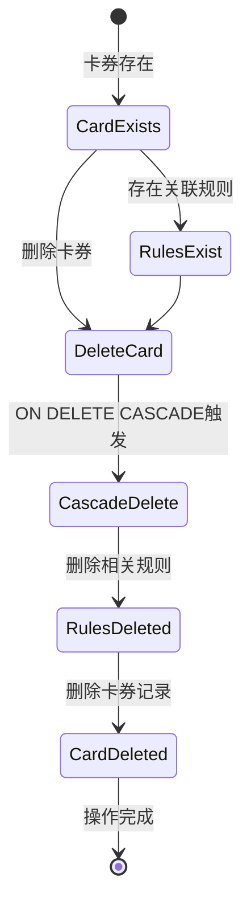
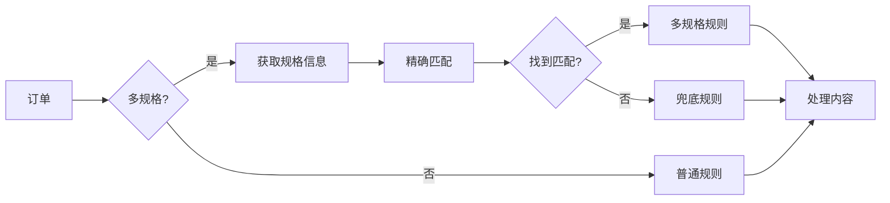
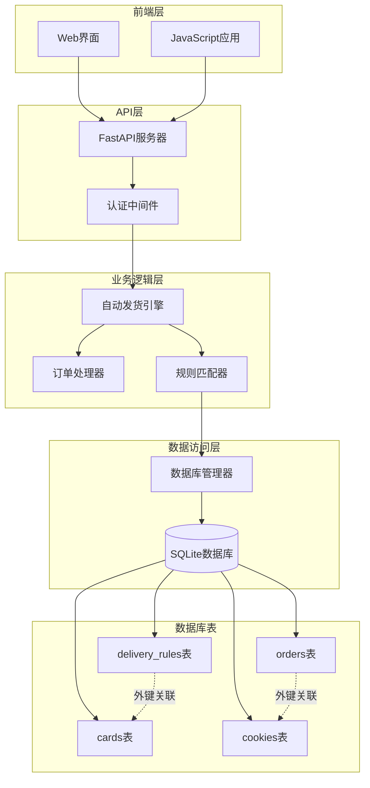

# 卡券与发货规则外键关系

<cite>
**本文档引用的文件**
- [db_manager.py](file://db_manager.py)
- [XianyuAutoAsync.py](file://XianyuAutoAsync.py)
- [order_status_handler.py](file://order_status_handler.py)
- [reply_server.py](file://reply_server.py)
- [static/js/app.js](file://static/js/app.js)
</cite>

## 目录
1. [简介](#简介)
2. [数据库架构分析](#数据库架构分析)
3. [外键关系详解](#外键关系详解)
4. [自动发货系统核心流程](#自动发货系统核心流程)
5. [ON DELETE CASCADE级联行为](#on-delete-cascade级联行为)
6. [SQL查询示例](#sql查询示例)
7. [营销策略配置支持](#营销策略配置支持)
8. [系统架构图](#系统架构图)
9. [总结](#总结)

## 简介

在闲鱼自动回复系统中，`cards`表与`delivery_rules`表之间的外键关系是自动发货系统的核心基础。这种关系实现了卡券内容与发货规则的紧密绑定，支持基于关键词触发特定卡券的自动化交付，同时通过ON DELETE CASCADE机制确保数据一致性。

## 数据库架构分析

### 表结构概览

```mermaid
erDiagram
CARDS {
integer id PK
string name
string type CHECK(type IN ('api', 'text', 'data', 'image'))
string api_config
string text_content
string data_content
string image_url
string description
boolean enabled
integer delay_seconds
boolean is_multi_spec
string spec_name
string spec_value
integer user_id FK
timestamp created_at
timestamp updated_at
}
DELIVERY_RULES {
integer id PK
string keyword
integer card_id FK
integer delivery_count
boolean enabled
string description
integer delivery_times
timestamp created_at
timestamp updated_at
}
CARDS ||--o{ DELIVERY_RULES : "has rules"
```

**图表来源**
- [db_manager.py](file://db_manager.py#L197-L216)
- [db_manager.py](file://db_manager.py#L294-L306)

### 关键字段说明

| 字段名 | 类型 | 说明 |
|--------|------|------|
| `cards.id` | INTEGER | 卡券主键，自增 |
| `cards.type` | TEXT | 卡券类型：api/text/data/image |
| `cards.delay_seconds` | INTEGER | 发货延时（秒） |
| `delivery_rules.card_id` | INTEGER | 外键，指向cards.id |
| `delivery_rules.keyword` | TEXT | 触发关键词 |
| `delivery_rules.enabled` | BOOLEAN | 规则是否启用 |

**章节来源**
- [db_manager.py](file://db_manager.py#L197-L216)
- [db_manager.py](file://db_manager.py#L294-L306)

## 外键关系详解

### 外键定义

在数据库初始化过程中，`delivery_rules`表定义了对`cards`表的外键约束：

```sql
FOREIGN KEY (card_id) REFERENCES cards(id) ON DELETE CASCADE
```

这个外键关系具有以下特征：

1. **引用完整性**：确保`delivery_rules.card_id`必须存在于`cards`表中
2. **级联删除**：当删除`cards`表中的记录时，相关联的`delivery_rules`记录也会自动删除
3. **数据一致性**：防止出现孤立的发货规则

### 外键关系的作用机制



**图表来源**
- [db_manager.py](file://db_manager.py#L294-L306)
- [db_manager.py](file://db_manager.py#L3491-L3508)

**章节来源**
- [db_manager.py](file://db_manager.py#L294-L306)

## 自动发货系统核心流程

### 关键词匹配算法

系统通过智能匹配算法查找最合适的发货规则：



**图表来源**
- [XianyuAutoAsync.py](file://XianyuAutoAsync.py#L4578-L4603)
- [db_manager.py](file://db_manager.py#L3367-L3445)

### 卡券类型处理

系统支持四种卡券类型，每种类型有不同的处理方式：

| 卡券类型 | 处理方式 | 示例场景 |
|----------|----------|----------|
| `api` | 调用外部API获取内容 | 动态生成的优惠码 |
| `text` | 直接发送固定文字 | 预设的回复内容 |
| `data` | 消费批量数据 | 库存有限的优惠券 |
| `image` | 发送图片消息 | 商品图片或二维码 |

**章节来源**
- [XianyuAutoAsync.py](file://XianyuAutoAsync.py#L4716-L4738)

## ON DELETE CASCADE级联行为

### 级联删除机制

当删除`cards`表中的记录时，系统会自动删除所有相关的`delivery_rules`记录：



**图表来源**
- [db_manager.py](file://db_manager.py#L3491-L3508)

### 防止无效规则的机制

这种级联删除机制确保了系统的数据完整性：

1. **自动清理**：删除卡券时自动移除无效规则
2. **防止孤立数据**：避免出现指向不存在卡券的规则
3. **简化管理**：减少手动维护的工作量

**章节来源**
- [db_manager.py](file://db_manager.py#L3491-L3508)

## SQL查询示例

### 查询某张卡券关联的所有发货规则

```sql
SELECT 
    dr.id AS rule_id,
    dr.keyword,
    dr.delivery_count,
    dr.enabled,
    dr.created_at,
    dr.updated_at
FROM 
    delivery_rules dr
WHERE 
    dr.card_id = ?  -- 卡券ID
ORDER BY 
    dr.created_at DESC
```

### 查询所有可用的发货规则

```sql
SELECT 
    dr.id,
    dr.keyword,
    dr.card_id,
    c.name AS card_name,
    c.type AS card_type,
    dr.enabled,
    dr.delivery_times
FROM 
    delivery_rules dr
JOIN 
    cards c ON dr.card_id = c.id
WHERE 
    dr.enabled = 1 
    AND c.enabled = 1
ORDER BY 
    dr.delivery_times ASC
```

### 查询特定关键词的匹配规则

```sql
SELECT 
    dr.id,
    dr.keyword,
    dr.card_id,
    c.name AS card_name,
    c.type AS card_type,
    dr.delivery_count
FROM 
    delivery_rules dr
JOIN 
    cards c ON dr.card_id = c.id
WHERE 
    dr.enabled = 1 
    AND c.enabled = 1
    AND (? LIKE '%' || dr.keyword || '%' OR dr.keyword LIKE '%' || ? || '%')
ORDER BY 
    CASE 
        WHEN ? LIKE '%' || dr.keyword || '%' THEN LENGTH(dr.keyword)
        ELSE LENGTH(dr.keyword) / 2
    END DESC,
    dr.delivery_times ASC
```

**章节来源**
- [db_manager.py](file://db_manager.py#L3188-L3246)
- [db_manager.py](file://db_manager.py#L3367-L3445)

## 营销策略配置支持

### 限时优惠配置

通过`delay_seconds`字段支持限时优惠策略：

```sql
-- 设置30秒后发货的限时优惠
UPDATE cards 
SET delay_seconds = 30 
WHERE id = ?;
```

### 阶梯式发货

支持不同数量的发货策略：

```sql
-- 设置每次发货2张的阶梯策略
INSERT INTO delivery_rules (keyword, card_id, delivery_count, enabled)
VALUES (?, ?, 2, 1);
```

### 多规格商品支持

系统支持复杂的多规格发货策略：



**图表来源**
- [db_manager.py](file://db_manager.py#L3367-L3445)

### 用户隔离机制

系统支持多用户环境下的规则隔离：

```sql
-- 每个用户的规则都有独立的user_id
SELECT * 
FROM delivery_rules 
WHERE user_id = ? 
  AND enabled = 1
ORDER BY created_at DESC;
```

**章节来源**
- [db_manager.py](file://db_manager.py#L3119-L3128)
- [db_manager.py](file://db_manager.py#L3137-L3186)

## 系统架构图



**图表来源**
- [db_manager.py](file://db_manager.py#L16-L51)
- [reply_server.py](file://reply_server.py#L1-L200)
- [XianyuAutoAsync.py](file://XianyuAutoAsync.py#L1-L200)

## 总结

`cards`表与`delivery_rules`表之间的外键关系是闲鱼自动回复系统的核心基础设施。这种设计实现了：

1. **数据完整性**：通过外键约束确保规则与卡券的一致性
2. **自动化程度高**：支持基于关键词的智能匹配和自动发货
3. **灵活性强**：支持多种卡券类型和复杂的营销策略
4. **维护简单**：ON DELETE CASCADE自动清理无效规则
5. **扩展性好**：易于添加新的卡券类型和发货策略

这种设计使得系统能够高效地处理大量的自动发货请求，同时保证数据的准确性和系统的稳定性。通过合理的数据库设计和业务逻辑实现，系统能够支持复杂的电商营销场景，为用户提供优质的自动回复体验。