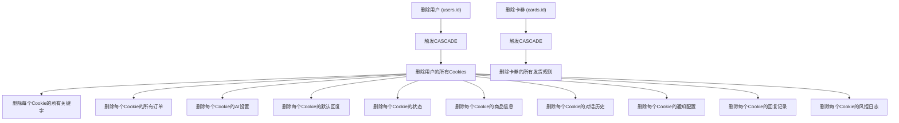
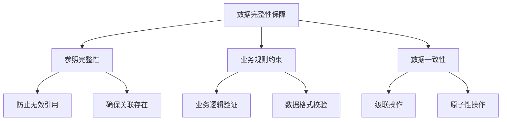
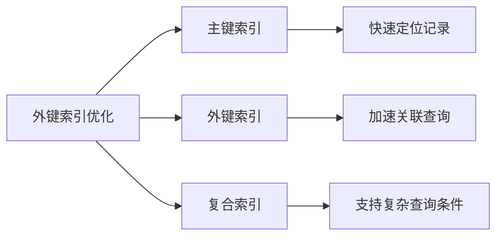

# 外键关系

<cite>
**本文档引用的文件**
- [db_manager.py](file://db_manager.py)
- [reply_server.py](file://reply_server.py)
</cite>

## 目录
1. [简介](#简介)
2. [数据库架构概览](#数据库架构概览)
3. [核心外键关系](#核心外键关系)
4. [ON DELETE CASCADE行为详解](#on-delete-cascade行为详解)
5. [数据完整性保障机制](#数据完整性保障机制)
6. [查询性能优化](#查询性能优化)
7. [实际应用示例](#实际应用示例)
8. [最佳实践建议](#最佳实践建议)
9. [总结](#总结)

## 简介

本文档详细描述了Xianyu Auto Reply系统中数据库表之间的外键关系及其作用。该系统采用SQLite数据库，通过精心设计的外键约束确保数据的一致性和完整性，同时支持复杂的级联操作。

## 数据库架构概览

系统数据库包含多个相互关联的表，形成了一个完整的关系型数据模型。主要表包括用户管理、Cookie管理、关键字配置、AI回复设置、卡券管理、订单处理等功能模块。

```mermaid
erDiagram
USERS {
integer id PK
string username UK
string email UK
string password_hash
boolean is_active
timestamp created_at
timestamp updated_at
}
COOKIES {
string id PK
string value
integer user_id FK
integer auto_confirm
string remark
integer pause_duration
string username
string password
integer show_browser
timestamp created_at
}
KEYWORDS {
string cookie_id FK
string keyword
string reply
string item_id
string type
string image_url
}
ORDERS {
string order_id PK
string item_id
string buyer_id
string spec_name
string spec_value
string quantity
string amount
string order_status
string cookie_id FK
timestamp created_at
timestamp updated_at
}
CARDS {
integer id PK
string name
string type
string api_config
string text_content
string data_content
string image_url
string description
boolean enabled
integer delay_seconds
boolean is_multi_spec
string spec_name
string spec_value
integer user_id FK
timestamp created_at
timestamp updated_at
}
DELIVERY_RULES {
integer id PK
string keyword
integer card_id FK
integer delivery_count
boolean enabled
string description
integer delivery_times
timestamp created_at
timestamp updated_at
}
AI_REPLY_SETTINGS {
string cookie_id PK FK
boolean ai_enabled
string model_name
string api_key
string base_url
integer max_discount_percent
integer max_discount_amount
integer max_bargain_rounds
string custom_prompts
timestamp created_at
timestamp updated_at
}
USERS ||--o{ COOKIES : "拥有"
COOKIES ||--o{ KEYWORDS : "包含"
COOKIES ||--o{ ORDERS : "处理"
COOKIES ||--o{ AI_REPLY_SETTINGS : "配置"
COOKIES ||--o{ DEFAULT_REPLIES : "设置"
COOKIES ||--o{ COOKIE_STATUS : "状态"
COOKIES ||--o{ ITEM_INFO : "管理"
COOKIES ||--o{ AI_CONVERSATIONS : "对话"
COOKIES ||--o{ MESSAGE_NOTIFICATIONS : "通知"
COOKIES ||--o{ DEFAULT_REPLY_RECORDS : "记录"
COOKIES ||--o{ RISK_CONTROL_LOGS : "风控"
CARDS ||--o{ DELIVERY_RULES : "应用"
```

**图表来源**
- [db_manager.py](file://db_manager.py#L74-L421)

**章节来源**
- [db_manager.py](file://db_manager.py#L74-L421)

## 核心外键关系

### 1. 用户与Cookie关系 (users ↔ cookies)

这是系统中最基础的外键关系，建立了用户与其Cookie之间的关联。

```sql
-- Cookies表定义
CREATE TABLE IF NOT EXISTS cookies (
    id TEXT PRIMARY KEY,
    value TEXT NOT NULL,
    user_id INTEGER NOT NULL,
    auto_confirm INTEGER DEFAULT 1,
    remark TEXT DEFAULT '',
    pause_duration INTEGER DEFAULT 10,
    username TEXT DEFAULT '',
    password TEXT DEFAULT '',
    show_browser INTEGER DEFAULT 0,
    created_at TIMESTAMP DEFAULT CURRENT_TIMESTAMP,
    FOREIGN KEY (user_id) REFERENCES users(id) ON DELETE CASCADE
)
```

**关系特点：**
- **一对多关系**：一个用户可以拥有多个Cookie
- **级联删除**：删除用户时自动删除其所有Cookie
- **数据隔离**：不同用户的Cookie完全隔离

### 2. Cookie与关键字关系 (cookies ↔ keywords)

建立了Cookie与其关键字配置之间的关联。

```sql
-- Keywords表定义
CREATE TABLE IF NOT EXISTS keywords (
    cookie_id TEXT,
    keyword TEXT,
    reply TEXT,
    item_id TEXT,
    type TEXT DEFAULT 'text',
    image_url TEXT,
    FOREIGN KEY (cookie_id) REFERENCES cookies(id) ON DELETE CASCADE
)
```

**关系特点：**
- **多对多关系**：一个Cookie可以有多个关键字，一个关键字属于一个Cookie
- **级联删除**：删除Cookie时自动删除其所有关键字
- **复合唯一约束**：支持基于商品ID的唯一性校验

### 3. Cookie与订单关系 (cookies ↔ orders)

建立了Cookie与其处理的订单之间的关联。

```sql
-- Orders表定义
CREATE TABLE IF NOT EXISTS orders (
    order_id TEXT PRIMARY KEY,
    item_id TEXT,
    buyer_id TEXT,
    spec_name TEXT,
    spec_value TEXT,
    quantity TEXT,
    amount TEXT,
    order_status TEXT DEFAULT 'unknown',
    cookie_id TEXT,
    created_at TIMESTAMP DEFAULT CURRENT_TIMESTAMP,
    updated_at TIMESTAMP DEFAULT CURRENT_TIMESTAMP,
    FOREIGN KEY (cookie_id) REFERENCES cookies(id) ON DELETE CASCADE
)
```

**关系特点：**
- **一对一关系**：每个订单对应一个处理的Cookie
- **级联删除**：删除Cookie时自动删除其相关订单
- **数据追踪**：完整记录订单处理轨迹

### 4. 卡券与发货规则关系 (cards ↔ delivery_rules)

建立了卡券与其应用的发货规则之间的关联。

```sql
-- Delivery_rules表定义
CREATE TABLE IF NOT EXISTS delivery_rules (
    id INTEGER PRIMARY KEY AUTOINCREMENT,
    keyword TEXT NOT NULL,
    card_id INTEGER NOT NULL,
    delivery_count INTEGER DEFAULT 1,
    enabled BOOLEAN DEFAULT TRUE,
    description TEXT,
    delivery_times INTEGER DEFAULT 0,
    created_at TIMESTAMP DEFAULT CURRENT_TIMESTAMP,
    updated_at TIMESTAMP DEFAULT CURRENT_TIMESTAMP,
    FOREIGN KEY (card_id) REFERENCES cards(id) ON DELETE CASCADE
)
```

**关系特点：**
- **一对多关系**：一个卡券可以应用于多个发货规则
- **级联删除**：删除卡券时自动删除其所有相关规则
- **业务逻辑支持**：支持复杂的发货策略配置

### 5. Cookie与AI回复设置关系 (cookies ↔ ai_reply_settings)

建立了Cookie与其AI回复配置之间的关联。

```sql
-- AI_reply_settings表定义
CREATE TABLE IF NOT EXISTS ai_reply_settings (
    cookie_id TEXT PRIMARY KEY,
    ai_enabled BOOLEAN DEFAULT FALSE,
    model_name TEXT DEFAULT 'qwen-plus',
    api_key TEXT,
    base_url TEXT DEFAULT 'https://dashscope.aliyuncs.com/compatible-mode/v1',
    max_discount_percent INTEGER DEFAULT 10,
    max_discount_amount INTEGER DEFAULT 100,
    max_bargain_rounds INTEGER DEFAULT 3,
    custom_prompts TEXT,
    created_at TIMESTAMP DEFAULT CURRENT_TIMESTAMP,
    updated_at TIMESTAMP DEFAULT CURRENT_TIMESTAMP,
    FOREIGN KEY (cookie_id) REFERENCES cookies(id) ON DELETE CASCADE
)
```

**关系特点：**
- **一对一关系**：每个Cookie只能有一个AI回复设置
- **级联删除**：删除Cookie时自动删除其AI设置
- **配置隔离**：不同Cookie的AI配置完全独立

**章节来源**
- [db_manager.py](file://db_manager.py#L121-L165)
- [db_manager.py](file://db_manager.py#L232-L234)
- [db_manager.py](file://db_manager.py#L298-L306)
- [db_manager.py](file://db_manager.py#L153-L165)

## ON DELETE CASCADE行为详解

### 级联删除机制

ON DELETE CASCADE是SQLite中外键约束的重要特性，它确保当父表记录被删除时，所有相关的子表记录也会自动被删除。



**图表来源**
- [db_manager.py](file://db_manager.py#L4319-L4348)

### 实际删除流程示例

以删除用户为例，系统会按照以下顺序执行删除操作：

1. **删除用户设置** (`user_settings`)
2. **删除用户卡券** (`cards`)  
3. **删除用户发货规则** (`delivery_rules`)
4. **删除用户通知渠道** (`notification_channels`)
5. **删除用户Cookie** (`cookies`)
6. **删除Cookie关键字** (`keywords`)
7. **删除Cookie默认回复** (`default_replies`)
8. **删除Cookie状态** (`cookie_status`)
9. **删除Cookie订单** (`orders`)
10. **删除Cookie商品信息** (`item_info`)
11. **删除Cookie对话历史** (`ai_conversations`)
12. **删除Cookie通知配置** (`message_notifications`)
13. **删除Cookie回复记录** (`default_reply_records`)
14. **删除Cookie风控日志** (`risk_control_logs`)

### 级联删除的优势

1. **数据一致性**：确保不会留下孤立的子记录
2. **简化操作**：一次删除操作即可清理所有相关数据
3. **业务完整性**：维护业务逻辑的完整性
4. **自动化管理**：减少手动维护的工作量

**章节来源**
- [db_manager.py](file://db_manager.py#L4319-L4348)

## 数据完整性保障机制

### 外键约束的作用

外键约束在数据库层面提供了强大的数据完整性保障：



### 具体保障措施

1. **防止孤立记录**
   - 无法插入不存在的用户ID
   - 无法引用不存在的Cookie
   - 无法创建无效的关联关系

2. **级联操作保障**
   - 删除父记录时自动清理子记录
   - 更新引用字段时保持一致性
   - 防止部分更新导致的数据不一致

3. **数据类型验证**
   - 确保引用字段的数据类型正确
   - 防止类型不匹配导致的错误
   - 维护数据的语义完整性

### 错误处理机制

系统在遇到违反外键约束的情况时会：

1. **抛出异常**：阻止非法操作
2. **回滚事务**：保持数据一致性
3. **记录错误**：便于问题诊断
4. **提供反馈**：向用户说明原因

**章节来源**
- [db_manager.py](file://db_manager.py#L121-L165)
- [db_manager.py](file://db_manager.py#L232-L234)
- [db_manager.py](file://db_manager.py#L298-L306)

## 查询性能优化

### 外键索引的作用

虽然SQLite的外键约束本身不需要额外的索引，但合理的索引设计可以显著提升查询性能：



### 性能优化策略

1. **主键优化**
   - 使用自增INTEGER作为主键
   - 避免使用TEXT类型的主键
   - 主键设计考虑查询模式

2. **外键索引**
   - SQLite自动为外键字段创建索引
   - 利用这些索引加速JOIN操作
   - 避免不必要的索引冗余

3. **查询优化**
   - 使用EXPLAIN QUERY PLAN分析查询计划
   - 优化JOIN顺序和条件
   - 合理使用LIMIT和OFFSET

### 查询示例分析

#### 获取用户的所有自动回复规则

```sql
-- 查询用户的所有Cookie及其AI回复设置
SELECT 
    c.id AS cookie_id,
    c.value AS cookie_value,
    ars.ai_enabled,
    ars.model_name,
    ars.max_discount_percent,
    ars.max_discount_amount
FROM 
    cookies c
LEFT JOIN 
    ai_reply_settings ars ON c.id = ars.cookie_id
WHERE 
    c.user_id = ?
ORDER BY 
    c.created_at DESC
```

**查询优势：**
- 利用外键索引快速定位用户Cookie
- LEFT JOIN确保即使没有设置也能返回Cookie
- 排序保证结果的可预测性

#### 获取Cookie的所有关键字配置

```sql
-- 查询Cookie的所有关键字配置
SELECT 
    k.keyword,
    k.reply,
    k.item_id,
    k.type,
    k.image_url
FROM 
    keywords k
WHERE 
    k.cookie_id = ?
ORDER BY 
    k.keyword ASC
```

**查询优势：**
- 直接利用外键索引定位关键字
- 支持按关键字排序
- 包含所有关键字类型的信息

**章节来源**
- [db_manager.py](file://db_manager.py#L3148-L3445)

## 实际应用示例

### 用户管理场景

#### 场景1：用户注销处理

当用户请求注销账户时，系统会自动执行级联删除：

```python
# 删除用户及其所有相关数据
db_manager.delete_user_and_data(user_id)
```

**处理流程：**
1. 开始事务确保原子性
2. 依次删除用户的各种配置
3. 最后删除用户Cookie
4. 提交事务或回滚

#### 场景2：Cookie管理

```python
# 获取用户的所有Cookie
cookies = db_manager.get_all_cookies(user_id)

# 获取特定Cookie的详细信息
cookie_details = db_manager.get_cookie_details(cookie_id)

# 更新Cookie设置
db_manager.update_cookie_remark(cookie_id, "备用账号")
```

### 关键字管理场景

#### 场景1：批量关键字导入

```python
# 导入关键字前检查重复
for keyword, reply, item_id in keywords:
    if not db_manager.check_keyword_duplicate(cookie_id, keyword, item_id):
        # 保存关键字
        db_manager.save_keywords_with_item_id(cookie_id, [(keyword, reply, item_id)])
```

#### 场景2：关键字查询

```python
# 获取Cookie的所有关键字
keywords = db_manager.get_keywords_with_item_id(cookie_id)

# 按商品ID过滤关键字
filtered_keywords = [k for k in keywords if k[2] == target_item_id]
```

### AI回复配置场景

#### 场景1：启用AI回复

```python
# 为Cookie启用AI回复
db_manager.save_ai_reply_settings(
    cookie_id,
    ai_enabled=True,
    model_name="qwen-plus",
    max_discount_percent=15,
    max_discount_amount=200
)
```

#### 场景2：AI对话管理

```python
# 获取Cookie的AI对话历史
conversations = db_manager.get_ai_conversations(cookie_id)

# 获取特定聊天的对话记录
chat_history = db_manager.get_ai_conversation_history(chat_id)
```

### 卡券与发货场景

#### 场景1：创建发货规则

```python
# 创建发货规则
rule_id = db_manager.create_delivery_rule(
    keyword="包邮",
    card_id=card_id,
    delivery_count=1,
    enabled=True
)
```

#### 场景2：批量发货处理

```python
# 获取匹配的发货规则
rules = db_manager.get_delivery_rules_by_keyword(keyword)

# 处理发货
for rule in rules:
    db_manager.consume_batch_data(rule.card_id)
```

**章节来源**
- [db_manager.py](file://db_manager.py#L4319-L4348)
- [db_manager.py](file://db_manager.py#L1156-L1441)
- [db_manager.py](file://db_manager.py#L1458-L1594)

## 最佳实践建议

### 设计原则

1. **遵循ACID原则**
   - 原子性：级联操作必须全部成功或全部失败
   - 一致性：保持数据的业务规则不变
   - 隔离性：不同操作之间互不干扰
   - 持久性：操作结果永久保存

2. **合理使用级联删除**
   - 在业务逻辑允许的情况下使用CASCADE
   - 对于重要数据考虑软删除而非物理删除
   - 建立适当的审计机制

3. **索引优化**
   - 为频繁查询的外键字段建立索引
   - 避免过度索引导致写入性能下降
   - 定期分析查询计划优化索引

### 开发建议

1. **事务管理**
   ```python
   # 使用上下文管理器确保事务正确处理
   with db_manager.lock:
       try:
           # 执行多个相关操作
           db_manager.delete_user_and_data(user_id)
           # 其他操作...
           db_manager.conn.commit()
       except Exception as e:
           db_manager.conn.rollback()
           raise
   ```

2. **错误处理**
   ```python
   # 优雅的错误处理
   try:
       db_manager.save_keywords_with_item_id(cookie_id, keywords)
   except sqlite3.IntegrityError as e:
       if "UNIQUE constraint failed" in str(e):
           logger.warning(f"关键字重复: {cookie_id}")
       else:
           logger.error(f"保存关键字失败: {e}")
   ```

3. **性能监控**
   ```python
   # 监控外键操作的性能
   start_time = time.time()
   result = db_manager.get_user_cookies(user_id)
   execution_time = time.time() - start_time
   logger.info(f"获取用户Cookie耗时: {execution_time:.3f}s")
   ```

### 维护建议

1. **定期备份**
   - 定期备份数据库以防意外删除
   - 备份包含完整的外键关系信息

2. **数据验证**
   - 定期检查外键约束的有效性
   - 验证级联操作的正确性

3. **性能调优**
   - 分析慢查询并优化
   - 调整索引策略
   - 监控数据库大小增长

## 总结

Xianyu Auto Reply系统的外键关系设计体现了现代关系型数据库的最佳实践。通过精心设计的外键约束，系统实现了：

1. **数据完整性保障**：通过外键约束防止孤立记录和无效引用
2. **级联操作支持**：ON DELETE CASCADE确保数据的一致性
3. **查询性能优化**：合理的索引设计提升查询效率
4. **业务逻辑支持**：完整的外键关系支持复杂的业务场景

这种设计不仅保证了数据的准确性和一致性，还为系统的扩展和维护提供了坚实的基础。开发者在使用这些功能时，应该充分理解外键的作用机制，遵循最佳实践，确保系统的稳定运行。

通过本文档的详细说明，开发者可以更好地理解和利用系统中的外键关系，编写出更加健壮和高效的代码。