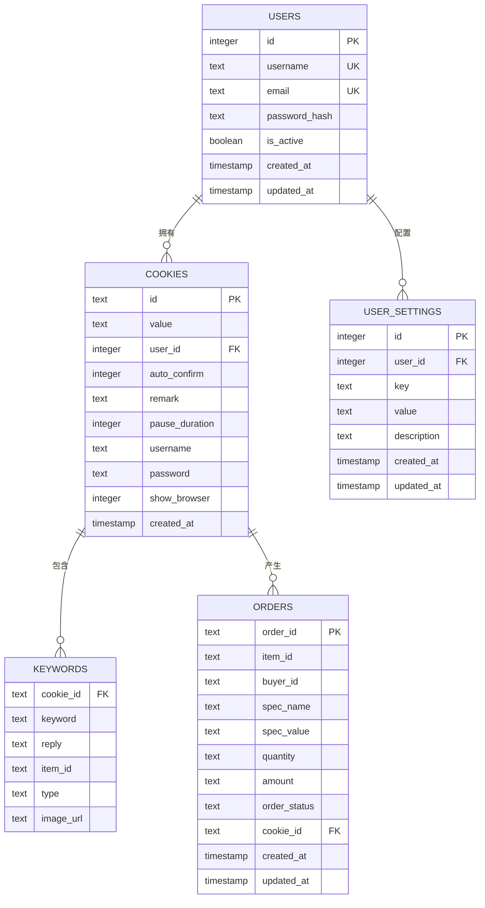
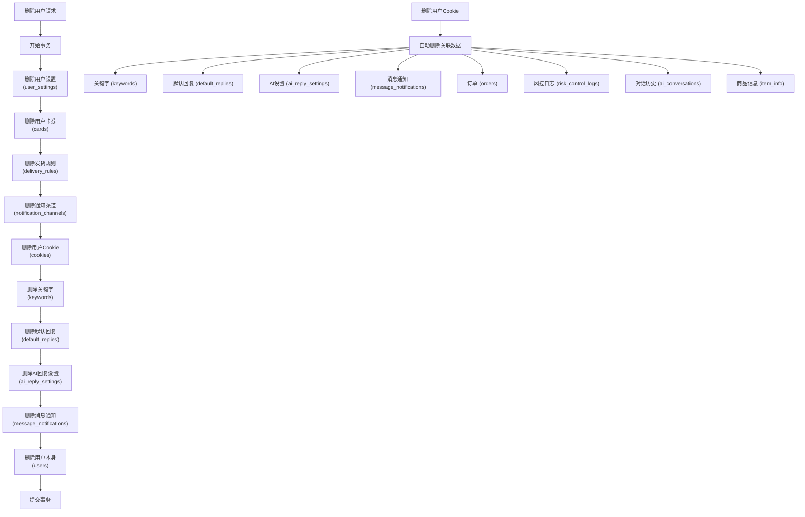
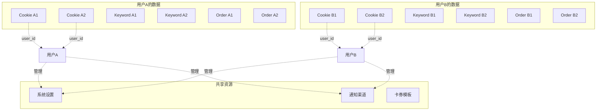
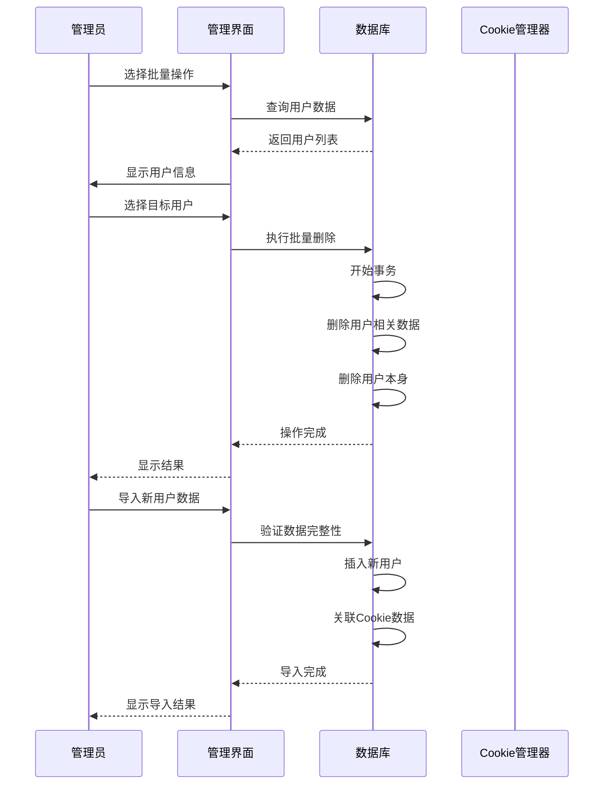

# 用户与Cookie外键关系

<cite>
**本文档引用的文件**
- [db_manager.py](file://db_manager.py)
- [cookie_manager.py](file://cookie_manager.py)
- [app.js](file://static/js/app.js)
</cite>

## 目录
1. [简介](#简介)
2. [数据库架构概览](#数据库架构概览)
3. [外键关系设计](#外键关系设计)
4. [ON DELETE CASCADE行为详解](#on-delete-cascade行为详解)
5. [数据隔离机制](#数据隔离机制)
6. [系统安全性保障](#系统安全性保障)
7. [批量账号管理](#批量账号管理)
8. [实际应用场景](#实际应用场景)
9. [性能考虑](#性能考虑)
10. [故障排除指南](#故障排除指南)

## 简介

在本系统中，用户与Cookie之间的外键关系是核心的数据完整性保障机制。通过`users.id`与`cookies.user_id`的关联，系统实现了严格的多用户数据隔离，确保每个Cookie只能归属于特定用户，同时通过ON DELETE CASCADE行为自动维护数据一致性。

这种设计不仅保证了系统的安全性，还为批量账号管理提供了强大的基础设施支持。

## 数据库架构概览

系统采用SQLite数据库，主要包含以下关键表：



**图表来源**
- [db_manager.py](file://db_manager.py#L74-L123)
- [db_manager.py](file://db_manager.py#L128-L137)
- [db_manager.py](file://db_manager.py#L220-L234)
- [db_manager.py](file://db_manager.py#L394-L405)

**章节来源**
- [db_manager.py](file://db_manager.py#L67-L447)

## 外键关系设计

### 核心外键定义

系统的核心外键关系建立在`cookies.user_id`字段上，该字段引用`users.id`：

```sql
CREATE TABLE IF NOT EXISTS cookies (
    id TEXT PRIMARY KEY,
    value TEXT NOT NULL,
    user_id INTEGER NOT NULL,
    auto_confirm INTEGER DEFAULT 1,
    remark TEXT DEFAULT '',
    pause_duration INTEGER DEFAULT 10,
    username TEXT DEFAULT '',
    password TEXT DEFAULT '',
    show_browser INTEGER DEFAULT 0,
    created_at TIMESTAMP DEFAULT CURRENT_TIMESTAMP,
    FOREIGN KEY (user_id) REFERENCES users(id) ON DELETE CASCADE
)
```

### 外键约束特点

1. **严格引用完整性**：确保每个Cookie都必须关联到有效的用户
2. **级联删除支持**：当用户被删除时，自动清理所有相关数据
3. **数据一致性保障**：防止孤立的Cookie记录存在

**章节来源**
- [db_manager.py](file://db_manager.py#L110-L123)

## ON DELETE CASCADE行为详解

### 级联删除机制

ON DELETE CASCADE行为在删除用户时触发以下级联操作：



**图表来源**
- [db_manager.py](file://db_manager.py#L4319-L4369)

### 自动清理流程

系统通过以下步骤确保数据完整性：

1. **事务管理**：使用BEGIN TRANSACTION确保原子性
2. **依赖关系排序**：按外键依赖关系逆序删除
3. **级联影响**：Cookie删除时自动清理所有关联表
4. **错误处理**：任何步骤失败时回滚整个事务

**章节来源**
- [db_manager.py](file://db_manager.py#L4319-L4369)

## 数据隔离机制

### 用户数据独立性

外键关系确保了严格的用户数据隔离：



**图表来源**
- [db_manager.py](file://db_manager.py#L1225-L1234)
- [cookie_manager.py](file://cookie_manager.py#L26-L30)

### 查询隔离实现

系统通过user_id参数实现数据查询隔离：

```python
# 获取特定用户的所有Cookie
def get_all_cookies(self, user_id: int = None):
    """获取所有Cookie（支持用户隔离）"""
    with self.lock:
        try:
            cursor = self.conn.cursor()
            if user_id is not None:
                self._execute_sql(cursor, "SELECT id, value FROM cookies WHERE user_id = ?", (user_id,))
            else:
                self._execute_sql(cursor, "SELECT id, value FROM cookies")
            return {row[0]: row[1] for row in cursor.fetchall()}
        except Exception as e:
            logger.error(f"获取所有Cookie失败: {e}")
            return {}
```

**章节来源**
- [db_manager.py](file://db_manager.py#L1225-L1234)

## 系统安全性保障

### 多层次安全防护

1. **数据访问控制**
   - 每个用户只能访问自己的Cookie数据
   - 管理员可以跨用户访问（仅限管理功能）

2. **数据完整性保护**
   - 外键约束防止数据孤立
   - 级联删除确保数据一致性
   - 事务管理保证操作原子性

3. **审计追踪**
   - 所有删除操作都有日志记录
   - 用户操作可追溯

**章节来源**
- [db_manager.py](file://db_manager.py#L4319-L4369)

## 批量账号管理

### 批量操作支持

系统提供了完整的批量账号管理功能：



**图表来源**
- [app.js](file://static/js/app.js#L9442-L9630)
- [db_manager.py](file://db_manager.py#L4319-L4369)

### 批量导入导出

系统支持完整的用户数据备份恢复：

1. **数据备份**：导出指定用户的所有相关数据
2. **数据恢复**：导入用户数据并自动建立外键关联
3. **数据验证**：导入前验证数据完整性

**章节来源**
- [db_manager.py](file://db_manager.py#L2248-L2326)

## 实际应用场景

### 场景一：用户注销处理

当用户主动注销账户时：
1. 系统自动检测用户关联的所有Cookie
2. 触发ON DELETE CASCADE级联删除
3. 清理所有用户相关数据
4. 记录操作日志

### 场景二：批量用户迁移

在系统维护期间：
1. 管理员可以选择批量删除用户
2. 系统自动清理所有关联数据
3. 确保数据一致性
4. 提供操作确认机制

### 场景三：数据审计

在进行数据审计时：
1. 可以查询特定用户的所有活动
2. 查看用户创建的所有Cookie
3. 分析用户的订单历史
4. 检查关键字配置情况

**章节来源**
- [db_manager.py](file://db_manager.py#L4319-L4369)

## 性能考虑

### 索引优化

为了提高查询性能，系统在相关字段上建立了索引：

```sql
-- cookies表的user_id索引（隐式创建）
CREATE INDEX IF NOT EXISTS idx_cookies_user_id ON cookies(user_id);

-- keywords表的cookie_id索引（隐式创建）
CREATE INDEX IF NOT EXISTS idx_keywords_cookie_id ON keywords(cookie_id);

-- orders表的cookie_id索引（隐式创建）
CREATE INDEX IF NOT EXISTS idx_orders_cookie_id ON orders(cookie_id);
```

### 查询优化策略

1. **延迟加载**：只在需要时加载用户数据
2. **批量操作**：减少数据库往返次数
3. **事务批处理**：合并多个操作在一个事务中

**章节来源**
- [db_manager.py](file://db_manager.py#L453-L486)

## 故障排除指南

### 常见问题及解决方案

#### 问题1：外键约束违反
**症状**：尝试插入无效的user_id时失败
**原因**：提供的user_id不存在于users表中
**解决**：确保user_id对应的有效用户记录

#### 问题2：级联删除不生效
**症状**：删除用户后某些关联数据仍然存在
**原因**：可能存在循环依赖或手动修改了外键约束
**解决**：检查数据库完整性，必要时重建外键约束

#### 问题3：性能问题
**症状**：大量数据删除时响应缓慢
**原因**：缺乏适当的索引或事务过大
**解决**：添加相关索引，拆分大事务

### 调试工具

系统提供了多种调试和监控工具：

1. **SQL日志**：启用SQL执行日志记录
2. **事务监控**：跟踪事务执行状态
3. **性能分析**：监控查询执行时间

**章节来源**
- [db_manager.py](file://db_manager.py#L48-L62)

## 结论

用户与Cookie的外键关系设计是本系统数据架构的核心组件，它不仅确保了数据的安全性和完整性，还为复杂的批量管理功能提供了坚实的基础。通过ON DELETE CASCADE行为，系统实现了自动化的数据清理，大大简化了维护工作。这种设计模式值得在类似的多租户系统中借鉴和应用。