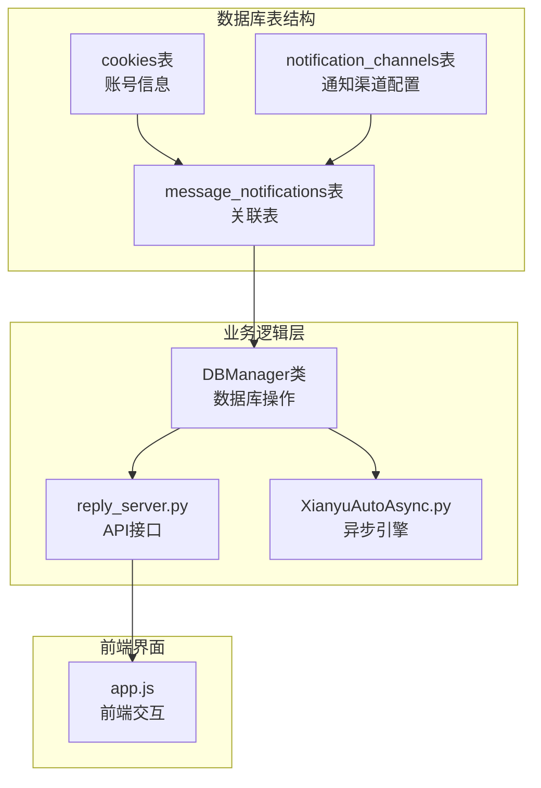
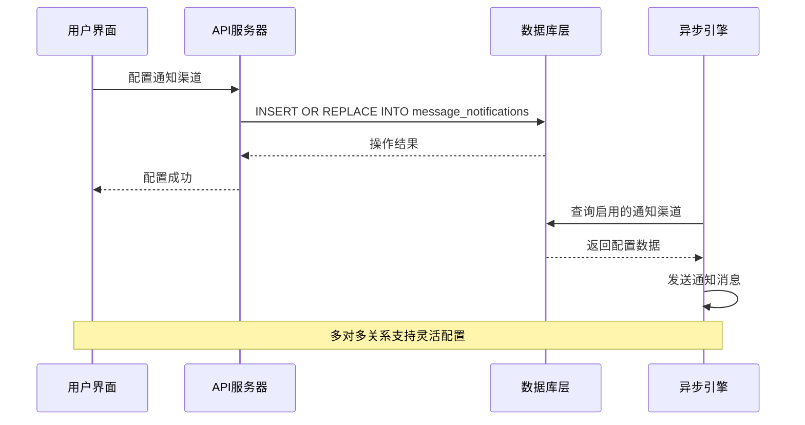
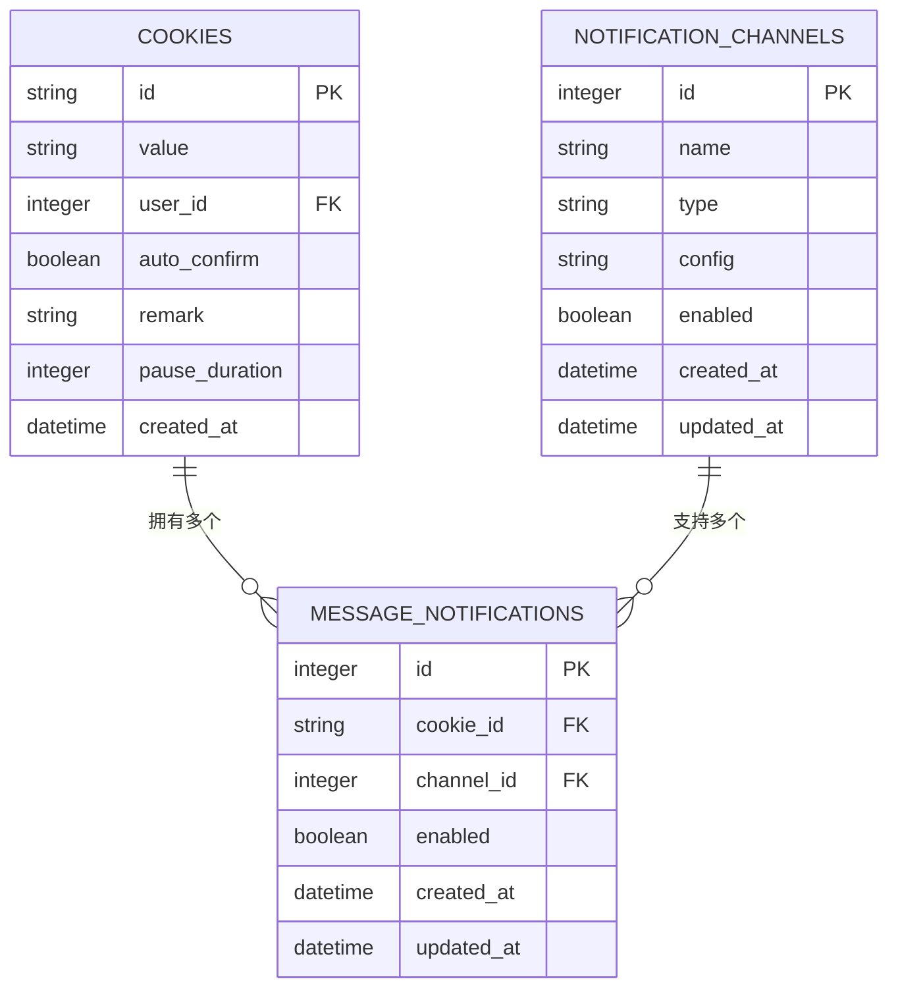
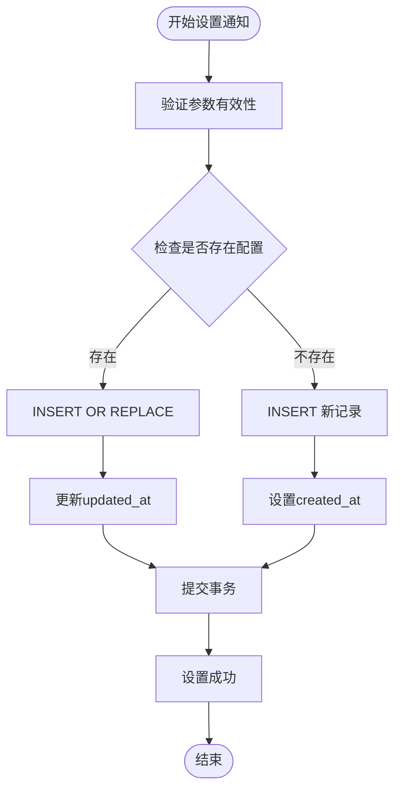
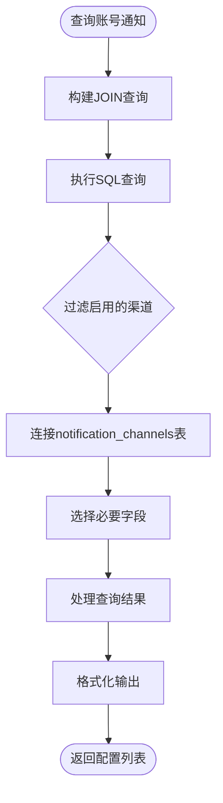
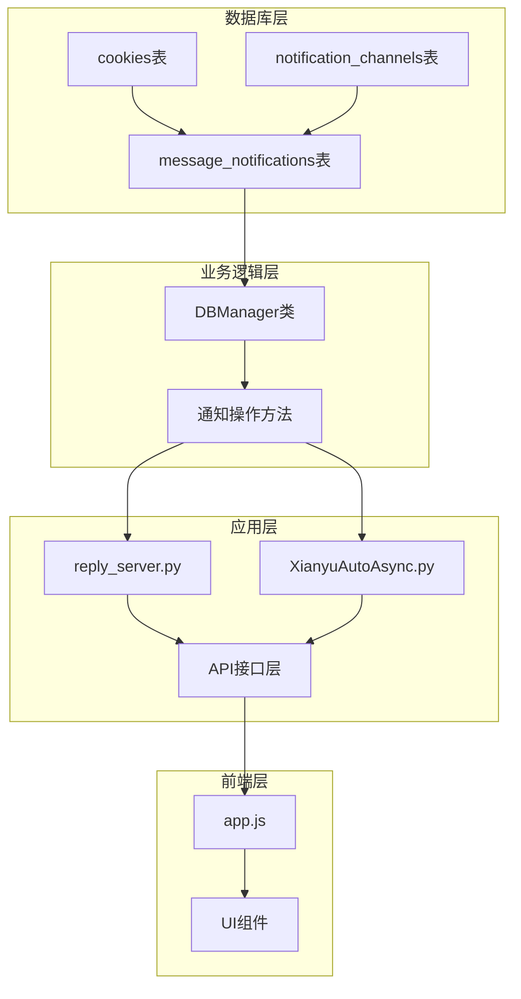
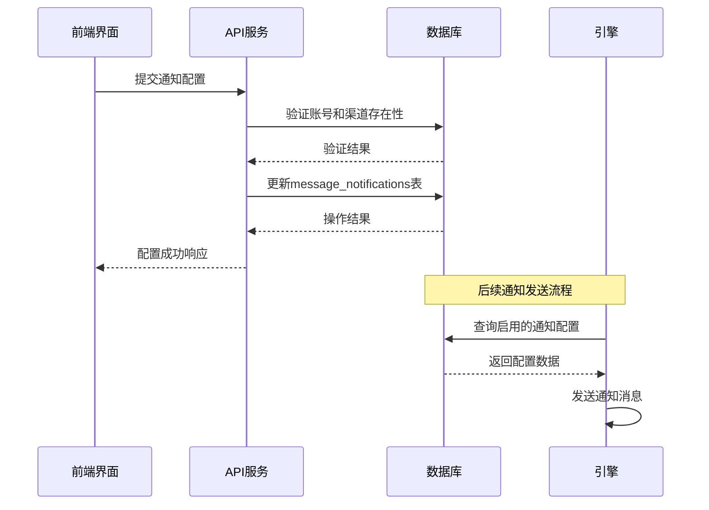
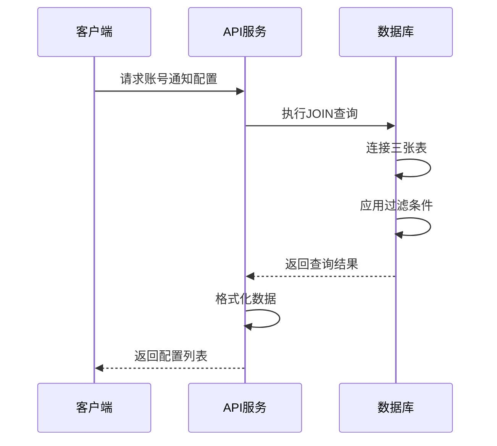

# 多对多关联

<cite>
**本文档引用的文件**
- [db_manager.py](file://db_manager.py)
- [config.py](file://config.py)
- [XianyuAutoAsync.py](file://XianyuAutoAsync.py)
- [reply_server.py](file://reply_server.py)
- [static/js/app.js](file://static/js/app.js)
</cite>

## 目录
1. [简介](#简介)
2. [项目结构概述](#项目结构概述)
3. [核心组件分析](#核心组件分析)
4. [架构概览](#架构概览)
5. [详细组件分析](#详细组件分析)
6. [依赖关系分析](#依赖关系分析)
7. [性能考虑](#性能考虑)
8. [故障排除指南](#故障排除指南)
9. [结论](#结论)

## 简介

本文档详细描述了闲鱼自动回复系统中通过关联表实现的多对多关系设计。该系统采用message_notifications表作为cookies与notification_channels之间的关联表，实现了灵活的通知配置机制。这种设计允许一个闲鱼账号绑定多个通知渠道，同时一个通知渠道也可被多个账号使用，为用户提供了高度灵活的通知配置能力。

## 项目结构概述

该项目采用模块化的数据库管理系统，主要包含以下核心表结构：



**图表来源**
- [db_manager.py](file://db_manager.py#L378-L391)
- [db_manager.py](file://db_manager.py#L355-L366)

**章节来源**
- [db_manager.py](file://db_manager.py#L1-L100)

## 核心组件分析

### message_notifications 关联表

message_notifications表是整个多对多关系的核心，它通过外键约束建立了cookies表和notification_channels表之间的关联关系。

#### 表结构特征

| 字段名 | 数据类型 | 约束 | 说明 |
|--------|----------|------|------|
| id | INTEGER | PRIMARY KEY AUTOINCREMENT | 主键标识符 |
| cookie_id | TEXT | NOT NULL, FOREIGN KEY | 关联的账号ID |
| channel_id | INTEGER | NOT NULL, FOREIGN KEY | 关联的通知渠道ID |
| enabled | BOOLEAN | DEFAULT TRUE | 开关控制字段 |
| created_at | TIMESTAMP | DEFAULT CURRENT_TIMESTAMP | 记录创建时间 |
| updated_at | TIMESTAMP | DEFAULT CURRENT_TIMESTAMP | 记录更新时间 |

#### 关键设计特性

1. **UNIQUE约束**：`(cookie_id, channel_id)`组合上的唯一约束确保每个账号与渠道的组合只能存在一次
2. **级联删除**：外键约束设置了ON DELETE CASCADE，当关联的账号或渠道被删除时，相关记录也会自动清理
3. **开关控制**：enabled字段提供灵活的开关控制机制

### notification_channels 通知渠道表

该表存储各种类型的通知渠道配置信息。

#### 支持的通知渠道类型

| 渠道类型 | 说明 | 配置要求 |
|----------|------|----------|
| qq | QQ通知 | 无特殊要求 |
| dingtalk | 钉钉通知 | Webhook URL |
| feishu/lark | 飞书通知 | Webhook URL |
| bark | Bark通知 | 推送密钥 |
| email | 邮件通知 | SMTP配置 |
| webhook | Webhook通知 | 自定义URL |
| wechat | 微信通知 | 企业微信机器人 |
| telegram | Telegram通知 | Bot Token + Chat ID |

**章节来源**
- [db_manager.py](file://db_manager.py#L355-L391)
- [db_manager.py](file://db_manager.py#L840-L913)

## 架构概览

系统采用三层架构设计，通过关联表实现业务逻辑的解耦：



**图表来源**
- [reply_server.py](file://reply_server.py#L2601-L2610)
- [db_manager.py](file://db_manager.py#L2101-L2118)

## 详细组件分析

### 多对多关系实现原理

#### 数据模型设计



**图表来源**
- [db_manager.py](file://db_manager.py#L378-L391)
- [db_manager.py](file://db_manager.py#L355-L366)

#### 核心业务流程

##### 1. 设置通知配置

系统通过`set_message_notification`方法实现通知配置的设置：



**图表来源**
- [db_manager.py](file://db_manager.py#L2101-L2118)

##### 2. 查询账号通知配置

`get_account_notifications`方法展示了如何通过JOIN查询获取账号的所有启用通知渠道：



**图表来源**
- [db_manager.py](file://db_manager.py#L2119-L2146)

### 实际查询示例

#### 获取某个账号的所有启用通知渠道

以下是关键的SQL查询语句：

```sql
SELECT mn.id, mn.channel_id, mn.enabled, 
       nc.name, nc.type, nc.config
FROM message_notifications mn
JOIN notification_channels nc ON mn.channel_id = nc.id
WHERE mn.cookie_id = ? AND nc.enabled = 1
ORDER BY mn.id
```

#### 获取所有账号的通知配置

```sql
SELECT mn.cookie_id, mn.id, mn.channel_id, mn.enabled, 
       nc.name, nc.type, nc.config
FROM message_notifications mn
JOIN notification_channels nc ON mn.channel_id = nc.id
WHERE nc.enabled = 1
ORDER BY mn.cookie_id, mn.id
```

### 功能特性分析

#### 1. 灵活的开关控制

enabled字段的设计提供了两级控制机制：
- **全局开关**：notification_channels表中的enabled字段控制渠道是否可用
- **账号开关**：message_notifications表中的enabled字段控制特定账号是否启用该渠道

#### 2. 时间戳管理

created_at和updated_at字段提供了完整的审计跟踪：
- **created_at**：记录配置创建的时间
- **updated_at**：记录配置最后修改的时间

#### 3. 级联操作支持

外键约束确保了数据的一致性：
- 当账号被删除时，所有相关的通知配置自动清理
- 当通知渠道被删除时，所有使用该渠道的配置自动清理

**章节来源**
- [db_manager.py](file://db_manager.py#L2101-L2165)

## 依赖关系分析

### 组件间依赖关系



**图表来源**
- [db_manager.py](file://db_manager.py#L378-L391)
- [reply_server.py](file://reply_server.py#L2601-L2625)

### 数据流分析

#### 1. 配置流程



**图表来源**
- [reply_server.py](file://reply_server.py#L2601-L2610)
- [db_manager.py](file://db_manager.py#L2101-L2118)

#### 2. 查询流程



**图表来源**
- [db_manager.py](file://db_manager.py#L2119-L2146)

**章节来源**
- [db_manager.py](file://db_manager.py#L1-L500)
- [reply_server.py](file://reply_server.py#L2494-L2625)

## 性能考虑

### 查询优化策略

1. **索引设计**：
   - 在message_notifications表上建立复合索引`(cookie_id, channel_id)`
   - 在notification_channels表上建立索引`(id, enabled)`
   - 在cookies表上建立索引`(id)`

2. **查询优化**：
   - 使用JOIN查询减少数据库访问次数
   - 通过WHERE子句提前过滤数据
   - 使用LIMIT限制返回结果数量

3. **缓存策略**：
   - 缓存常用的配置数据
   - 实现配置变更的实时通知机制

### 扩展性设计

1. **水平扩展**：
   - 支持多租户架构
   - 可以为不同用户组配置独立的通知渠道

2. **垂直扩展**：
   - 支持新增通知渠道类型
   - 可扩展配置字段以支持更复杂的通知需求

## 故障排除指南

### 常见问题及解决方案

#### 1. 配置冲突问题

**问题描述**：尝试设置重复的通知配置

**解决方案**：
- 系统自动使用INSERT OR REPLACE处理重复键
- 通过UNIQUE约束确保数据一致性

#### 2. 外键约束错误

**问题描述**：尝试关联不存在的账号或渠道

**解决方案**：
- 在设置前验证账号和渠道的存在性
- 使用级联删除避免孤立记录

#### 3. 查询性能问题

**问题描述**：大量数据下的查询缓慢

**解决方案**：
- 添加适当的索引
- 优化查询条件
- 实现分页查询

**章节来源**
- [db_manager.py](file://db_manager.py#L2101-L2165)

## 结论

闲鱼自动回复系统中的多对多关联设计展现了数据库设计的最佳实践。通过message_notifications关联表，系统成功实现了以下目标：

1. **灵活性**：一个账号可以绑定多个通知渠道，满足用户的多样化需求
2. **复用性**：一个通知渠道可以被多个账号使用，提高资源利用率
3. **可控性**：通过两级开关控制，提供精确的配置管理
4. **可扩展性**：支持新增通知渠道类型，适应业务发展需求

这种设计不仅满足了当前的功能需求，还为未来的功能扩展奠定了坚实的基础。通过合理的数据库设计和完善的业务逻辑，系统能够稳定高效地运行，为用户提供可靠的通知服务。