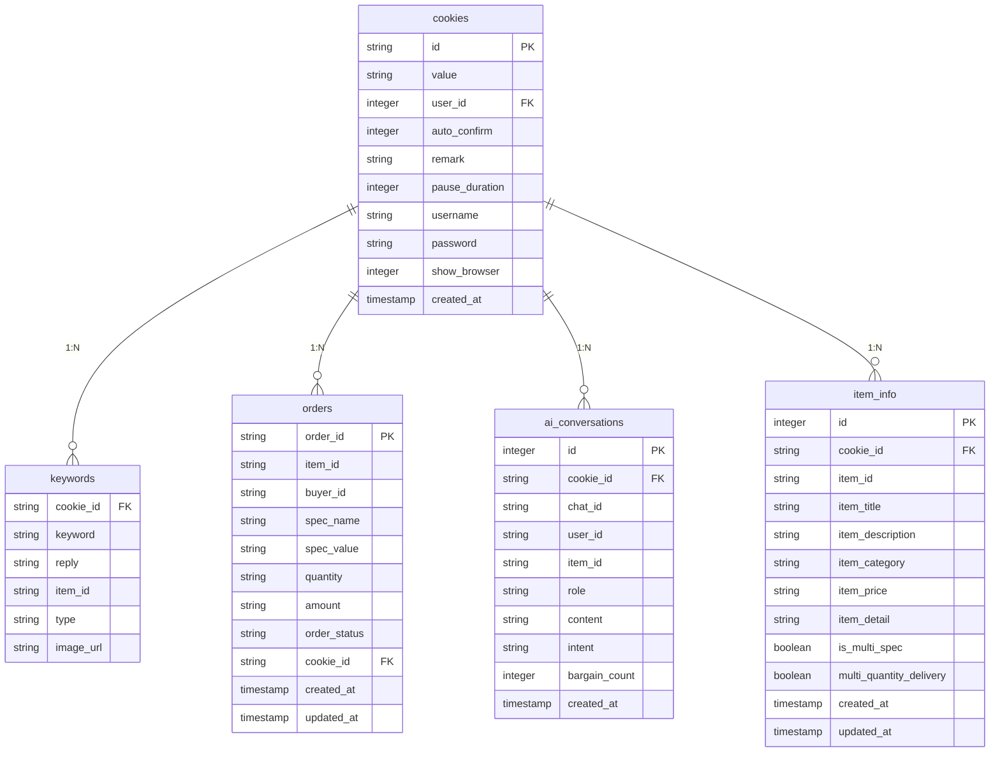
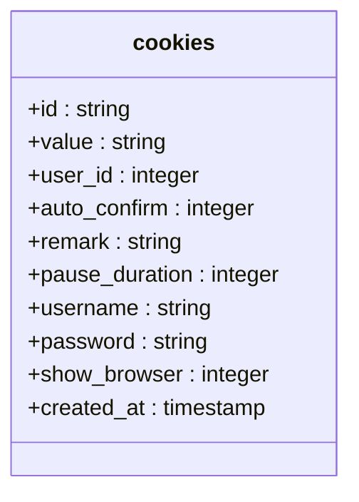
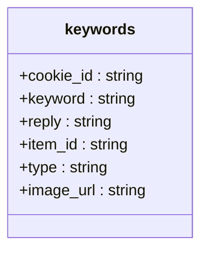
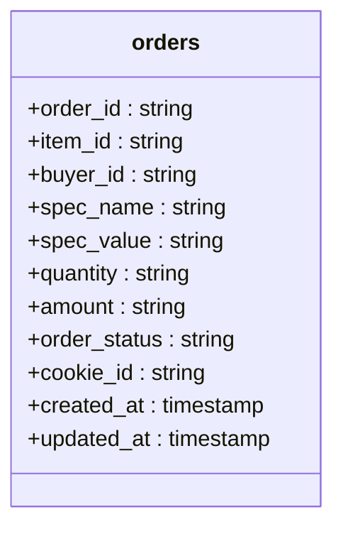
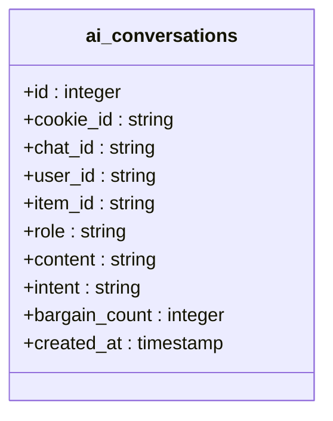
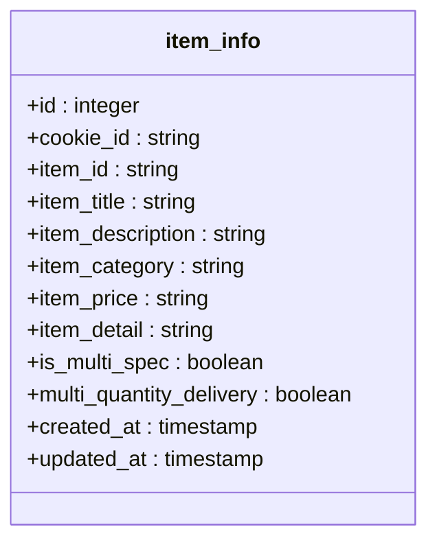
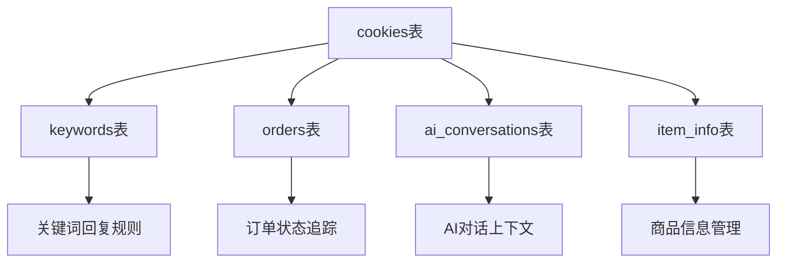
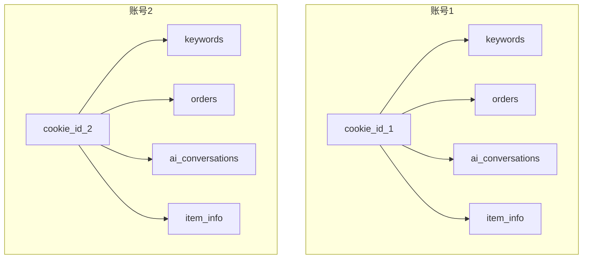
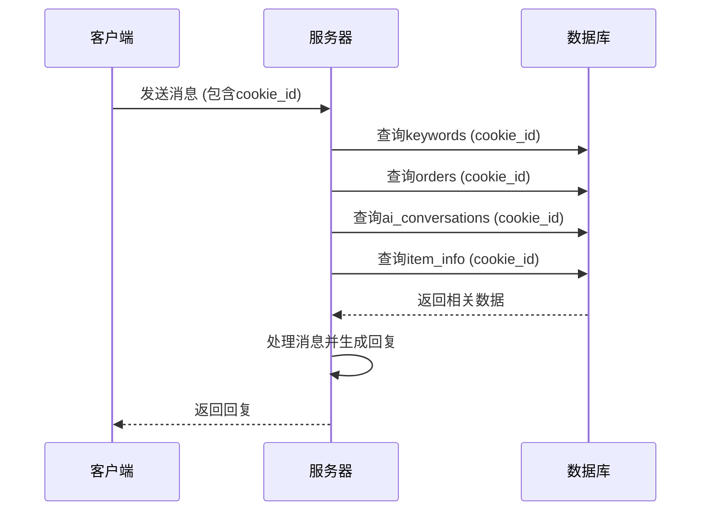

# Cookie数据继承关系

<cite>
**本文档引用文件**   
- [db_manager.py](file://db_manager.py)
- [cookie_manager.py](file://cookie_manager.py)
- [reply_server.py](file://reply_server.py)
- [XianyuAutoAsync.py](file://XianyuAutoAsync.py)
- [ai_reply_engine.py](file://ai_reply_engine.py)
</cite>

## 目录
1. [引言](#引言)
2. [数据库表结构与继承关系](#数据库表结构与继承关系)
3. [Cookie核心表结构](#cookie核心表结构)
4. [子表与Cookie的继承关系](#子表与cookie的继承关系)
5. [数据聚合与账号中心化](#数据聚合与账号中心化)
6. [多账号独立运行与数据隔离](#多账号独立运行与数据隔离)
7. [消息处理流程中的上下文关联](#消息处理流程中的上下文关联)
8. [DBManager查询方法实现](#dbmanager查询方法实现)
9. [系统扩展性与维护性影响](#系统扩展性与维护性影响)
10. [总结](#总结)

## 引言
本文档详细描述了闲鱼自动回复系统中以`cookie_id`为核心标识符的数据继承体系。通过分析`db_manager.py`中的表结构，阐述了`keywords`、`orders`、`ai_conversations`、`item_info`等表如何通过外键关联`cookies`表，实现以闲鱼账号为中心的数据聚合。文档解释了`cookie_id`在各子表中的作用，包括关键词回复规则绑定、订单状态追踪、AI对话上下文维护和商品信息管理。同时，阐述了这种继承关系如何支持多账号独立运行和数据隔离，以及在消息处理流程中如何通过`cookie_id`关联上下文。结合代码示例说明了`DBManager`中相关查询方法的实现，如`get_keywords_by_cookie`、`get_orders_by_cookie`等，并描述了这种设计对系统扩展性和维护性的影响。

## 数据库表结构与继承关系
系统采用SQLite数据库，通过`cookie_id`作为核心标识符，构建了以`cookies`表为中心的数据继承体系。`cookies`表存储了闲鱼账号的核心信息，其他所有与账号相关的数据表都通过外键`cookie_id`与`cookies`表建立关联，形成了一对多的继承关系。这种设计实现了以闲鱼账号为中心的数据聚合，确保了数据的完整性和一致性。



**图示来源**
- [db_manager.py](file://db_manager.py#L111-L137)
- [db_manager.py](file://db_manager.py#L221-L234)
- [db_manager.py](file://db_manager.py#L170-L182)
- [db_manager.py](file://db_manager.py#L267-L281)

## Cookie核心表结构
`cookies`表是整个数据继承体系的核心，存储了每个闲鱼账号的基本信息。该表的`id`字段作为主键，被其他所有子表作为外键引用，是数据聚合的中心。



**图示来源**
- [db_manager.py](file://db_manager.py#L111-L123)

## 子表与Cookie的继承关系
### 关键词表（keywords）
`keywords`表通过`cookie_id`外键与`cookies`表关联，实现了关键词回复规则与特定账号的绑定。每个`cookie_id`可以关联多条关键词规则，支持为不同商品设置不同的回复内容。



**图示来源**
- [db_manager.py](file://db_manager.py#L129-L137)

### 订单表（orders）
`orders`表通过`cookie_id`外键与`cookies`表关联，实现了订单状态的追踪。系统可以为每个账号独立追踪其所有订单的状态，包括待付款、待发货、已发货等。



**图示来源**
- [db_manager.py](file://db_manager.py#L221-L234)

### AI对话历史表（ai_conversations）
`ai_conversations`表通过`cookie_id`外键与`cookies`表关联，实现了AI对话上下文的维护。系统可以为每个账号独立维护与不同买家的对话历史，确保AI回复的连贯性和个性化。



**图示来源**
- [db_manager.py](file://db_manager.py#L170-L182)

### 商品信息表（item_info）
`item_info`表通过`cookie_id`外键与`cookies`表关联，实现了商品信息的管理。系统可以为每个账号独立管理其发布的商品信息，包括标题、描述、价格等。



**图示来源**
- [db_manager.py](file://db_manager.py#L267-L281)

## 数据聚合与账号中心化
通过`cookie_id`的继承关系，系统实现了以闲鱼账号为中心的数据聚合。所有与账号相关的数据，包括关键词规则、订单状态、AI对话历史和商品信息，都通过`cookie_id`关联到同一个账号，形成了完整的数据视图。



**图示来源**
- [db_manager.py](file://db_manager.py#L111-L137)
- [db_manager.py](file://db_manager.py#L221-L234)
- [db_manager.py](file://db_manager.py#L170-L182)
- [db_manager.py](file://db_manager.py#L267-L281)

## 多账号独立运行与数据隔离
系统的数据继承设计支持多账号独立运行和数据隔离。每个`cookie_id`代表一个独立的闲鱼账号，其所有相关数据都通过`cookie_id`进行隔离，确保了不同账号之间的数据不会相互干扰。



**图示来源**
- [db_manager.py](file://db_manager.py#L111-L137)
- [db_manager.py](file://db_manager.py#L221-L234)
- [db_manager.py](file://db_manager.py#L170-L182)
- [db_manager.py](file://db_manager.py#L267-L281)

## 消息处理流程中的上下文关联
在消息处理流程中，系统通过`cookie_id`关联上下文，确保了消息处理的准确性和一致性。当收到新消息时，系统首先通过`cookie_id`获取相关的关键词规则、订单状态、AI对话历史和商品信息，然后根据这些上下文信息进行相应的处理。



**图示来源**
- [XianyuAutoAsync.py](file://XianyuAutoAsync.py#L3174)
- [XianyuAutoAsync.py](file://XianyuAutoAsync.py#L3367)
- [XianyuAutoAsync.py](file://XianyuAutoAsync.py#L4500)
- [XianyuAutoAsync.py](file://XianyuAutoAsync.py#L4612)

## DBManager查询方法实现
`DBManager`类提供了多个查询方法，用于获取与特定`cookie_id`相关的数据。这些方法通过SQL查询实现了数据的聚合和检索。

### 获取关键词
```python
def get_keywords(self, cookie_id: str) -> List[Tuple[str, str]]:
    """获取指定Cookie的关键字列表（向后兼容方法）"""
    with self.lock:
        try:
            cursor = self.conn.cursor()
            self._execute_sql(cursor, "SELECT keyword, reply FROM keywords WHERE cookie_id = ?", (cookie_id,))
            return [(row[0], row[1]) for row in cursor.fetchall()]
        except Exception as e:
            logger.error(f"获取关键字失败: {e}")
            return []
```

### 获取订单
```python
def get_orders_by_cookie(self, cookie_id: str, limit: int = 100):
    """根据Cookie ID获取订单列表"""
    with self.lock:
        try:
            cursor = self.conn.cursor()
            cursor.execute('''
            SELECT order_id, item_id, buyer_id, spec_name, spec_value,
                   quantity, amount, order_status, created_at, updated_at
            FROM orders WHERE cookie_id = ?
            ORDER BY created_at DESC LIMIT ?
            ''', (cookie_id, limit))

            orders = []
            for row in cursor.fetchall():
                orders.append({
                    'order_id': row[0],
                    'item_id': row[1],
                    'buyer_id': row[2],
                    'spec_name': row[3],
                    'spec_value': row[4],
                    'quantity': row[5],
                    'amount': row[6],
                    'order_status': row[7],
                    'created_at': row[8],
                    'updated_at': row[9]
                })

            return orders

        except Exception as e:
            logger.error(f"获取Cookie订单列表失败: {cookie_id} - {e}")
            return []
```

### 获取AI对话历史
```python
def get_ai_conversations(self, cookie_id: str, chat_id: str = None, limit: int = 50) -> List[Dict]:
    """获取指定账号的AI对话历史"""
    with self.lock:
        try:
            cursor = self.conn.cursor()
            if chat_id:
                cursor.execute('''
                SELECT role, content, intent, created_at
                FROM ai_conversations
                WHERE cookie_id = ? AND chat_id = ?
                ORDER BY created_at ASC
                ''', (cookie_id, chat_id))
            else:
                cursor.execute('''
                SELECT chat_id, role, content, intent, created_at
                FROM ai_conversations
                WHERE cookie_id = ?
                ORDER BY created_at DESC
                LIMIT ?
                ''', (cookie_id, limit))

            conversations = []
            for row in cursor.fetchall():
                if chat_id:
                    conversations.append({
                        'role': row[0],
                        'content': row[1],
                        'intent': row[2],
                        'created_at': row[3]
                    })
                else:
                    conversations.append({
                        'chat_id': row[0],
                        'role': row[1],
                        'content': row[2],
                        'intent': row[3],
                        'created_at': row[4]
                    })

            return conversations

        except Exception as e:
            logger.error(f"获取AI对话历史失败: {e}")
            return []
```

### 获取商品信息
```python
def get_item_info(self, cookie_id: str, item_id: str) -> Optional[Dict]:
    """获取指定商品的信息"""
    with self.lock:
        try:
            cursor = self.conn.cursor()
            cursor.execute('''
            SELECT item_title, item_description, item_category, item_price, item_detail,
                   is_multi_spec, multi_quantity_delivery, created_at, updated_at
            FROM item_info
            WHERE cookie_id = ? AND item_id = ?
            ''', (cookie_id, item_id))

            row = cursor.fetchone()
            if row:
                item_info = {
                    'item_id': item_id,
                    'item_title': row[0],
                    'item_description': row[1],
                    'item_category': row[2],
                    'item_price': row[3],
                    'item_detail': json.loads(row[4]) if row[4] else {},
                    'is_multi_spec': bool(row[5]),
                    'multi_quantity_delivery': bool(row[6]),
                    'created_at': row[7],
                    'updated_at': row[8]
                }
                return item_info
            return None

        except Exception as e:
            logger.error(f"获取商品信息失败: {e}")
            return None
```

**代码来源**
- [db_manager.py](file://db_manager.py#L1550-L1559)
- [db_manager.py](file://db_manager.py#L4507-L4538)
- [db_manager.py](file://db_manager.py#L3761-L3794)

## 系统扩展性与维护性影响
以`cookie_id`为核心的数据继承设计对系统的扩展性和维护性产生了积极影响。首先，这种设计使得系统可以轻松支持多账号独立运行，只需为每个账号分配唯一的`cookie_id`即可。其次，数据的隔离性提高了系统的稳定性和安全性，一个账号的数据问题不会影响到其他账号。最后，通过`DBManager`提供的统一查询接口，系统的维护和扩展变得更加简单，新增功能只需在现有框架下进行开发即可。

## 总结
本文档详细描述了闲鱼自动回复系统中以`cookie_id`为核心标识符的数据继承体系。通过分析`db_manager.py`中的表结构，阐述了`keywords`、`orders`、`ai_conversations`、`item_info`等表如何通过外键关联`cookies`表，实现以闲鱼账号为中心的数据聚合。文档解释了`cookie_id`在各子表中的作用，包括关键词回复规则绑定、订单状态追踪、AI对话上下文维护和商品信息管理。同时，阐述了这种继承关系如何支持多账号独立运行和数据隔离，以及在消息处理流程中如何通过`cookie_id`关联上下文。结合代码示例说明了`DBManager`中相关查询方法的实现，并描述了这种设计对系统扩展性和维护性的影响。