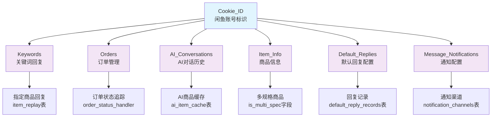
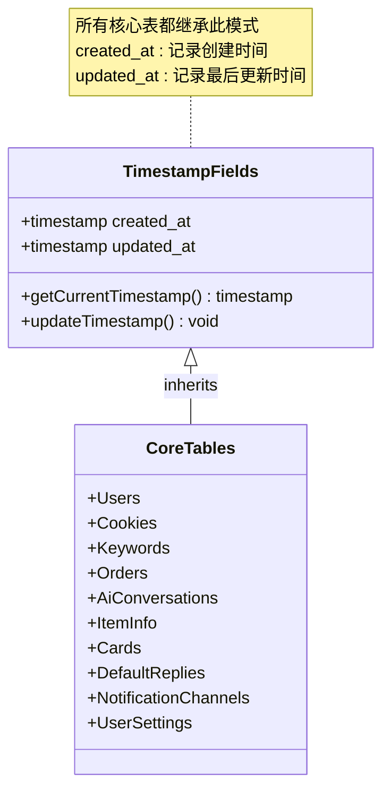
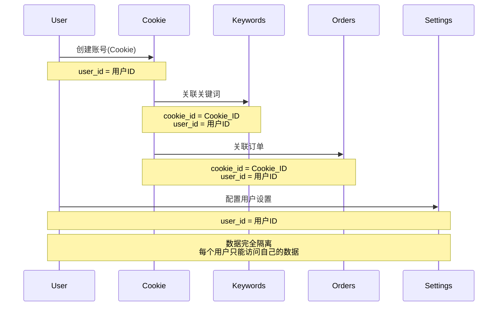
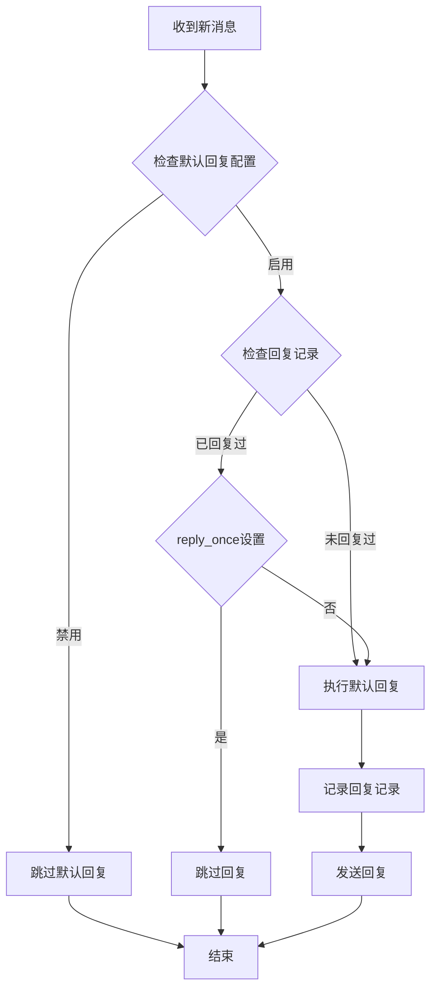
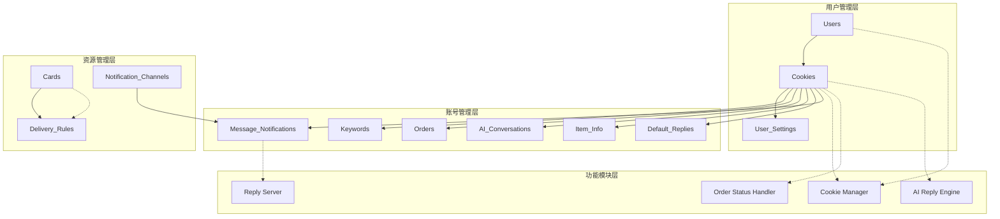
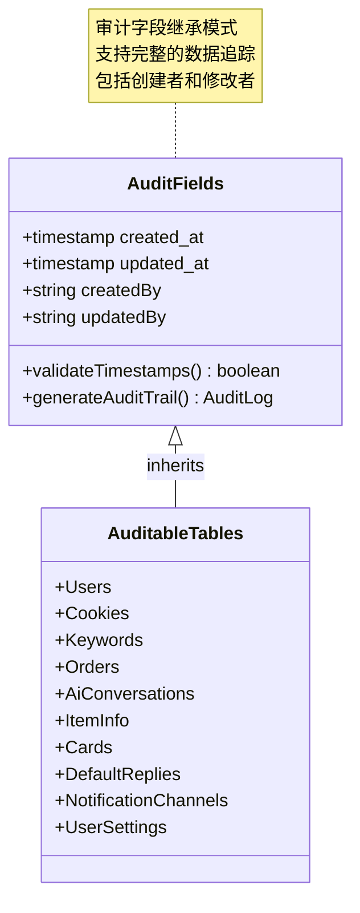

# 数据继承关系

<cite>
**本文档引用的文件**
- [db_manager.py](file://db_manager.py)
- [cookie_manager.py](file://cookie_manager.py)
- [config.py](file://config.py)
- [README.md](file://README.md)
- [ai_reply_engine.py](file://ai_reply_engine.py)
- [reply_server.py](file://reply_server.py)
- [simple_stats_server.py](file://simple_stats_server.py)
</cite>

## 目录
1. [简介](#简介)
2. [核心数据结构概览](#核心数据结构概览)
3. [Cookie_ID作为核心标识符的继承机制](#cookie_id作为核心标识符的继承机制)
4. [时间戳字段的继承模式](#时间戳字段的继承模式)
5. [User_ID字段的所有权管理](#user_id字段的所有权管理)
6. [默认回复功能的配置与执行分离](#默认回复功能的配置与执行分离)
7. [业务流程中的模块化设计](#业务流程中的模块化设计)
8. [数据审计与状态追踪](#数据审计与状态追踪)
9. [总结](#总结)

## 简介

闲鱼自动回复系统采用了基于字段继承的数据架构设计，通过核心标识符的多层关联实现了数据的有机聚合。本文档详细分析了系统中数据继承关系的设计理念、实现机制以及在业务流程中的重要作用。

## 核心数据结构概览

系统采用SQLite数据库作为数据存储核心，通过精心设计的表结构实现了多维度的数据继承关系。核心表结构如下：

```mermaid
erDiagram
USERS {
integer id PK
string username UK
string email UK
string password_hash
boolean is_active
timestamp created_at
timestamp updated_at
}
COOKIES {
string id PK
string value
integer user_id FK
integer auto_confirm
string remark
integer pause_duration
string username
string password
integer show_browser
timestamp created_at
timestamp updated_at
FOREIGN KEY (user_id) REFERENCES users(id)
}
KEYWORDS {
string cookie_id FK
string keyword
string reply
string item_id
string type
string image_url
FOREIGN KEY (cookie_id) REFERENCES cookies(id)
}
ORDERS {
string order_id PK
string item_id
string buyer_id
string spec_name
string spec_value
string quantity
string amount
string order_status
string cookie_id FK
timestamp created_at
timestamp updated_at
FOREIGN KEY (cookie_id) REFERENCES cookies(id)
}
AI_CONVERSATIONS {
integer id PK
string cookie_id FK
string chat_id
string user_id
string item_id
string role
string content
string intent
integer bargain_count
timestamp created_at
FOREIGN KEY (cookie_id) REFERENCES cookies(id)
}
ITEM_INFO {
integer id PK
string cookie_id FK
string item_id
string item_title
string item_description
string item_category
string item_price
string item_detail
boolean is_multi_spec
timestamp created_at
timestamp updated_at
FOREIGN KEY (cookie_id) REFERENCES cookies(id)
}
CARDS {
integer id PK
string name
string type
string api_config
string text_content
string data_content
string image_url
string description
boolean enabled
integer delay_seconds
boolean is_multi_spec
string spec_name
string spec_value
integer user_id FK
timestamp created_at
timestamp updated_at
FOREIGN KEY (user_id) REFERENCES users(id)
}
DEFAULT_REPLIES {
string cookie_id PK FK
boolean enabled
string reply_content
boolean reply_once
timestamp created_at
timestamp updated_at
FOREIGN KEY (cookie_id) REFERENCES cookies(id)
}
DEFAULT_REPLY_RECORDS {
integer id PK
string cookie_id FK
string chat_id
timestamp replied_at
FOREIGN KEY (cookie_id) REFERENCES cookies(id)
}
MESSAGE_NOTIFICATIONS {
integer id PK
string cookie_id FK
integer channel_id FK
boolean enabled
timestamp created_at
timestamp updated_at
FOREIGN KEY (cookie_id) REFERENCES cookies(id)
FOREIGN KEY (channel_id) REFERENCES notification_channels(id)
}
NOTIFICATION_CHANNELS {
integer id PK
string name
string type
string config
boolean enabled
timestamp created_at
timestamp updated_at
}
USER_SETTINGS {
integer id PK
integer user_id FK
string key
string value
string description
timestamp created_at
timestamp updated_at
FOREIGN KEY (user_id) REFERENCES users(id)
}
USERS ||--o{ COOKIES : owns
COOKIES ||--o{ KEYWORDS : contains
COOKIES ||--o{ ORDERS : generates
COOKIES ||--o{ AI_CONVERSATIONS : participates_in
COOKIES ||--o{ ITEM_INFO : manages
COOKIES ||--o{ DEFAULT_REPLIES : configures
COOKIES ||--o{ DEFAULT_REPLY_RECORDS : tracks
COOKIES ||--o{ MESSAGE_NOTIFICATIONS : enables
USERS ||--o{ CARDS : creates
USERS ||--o{ USER_SETTINGS : configures
NOTIFICATION_CHANNELS ||--o{ MESSAGE_NOTIFICATIONS : provides
```

**图表来源**
- [db_manager.py](file://db_manager.py#L74-L438)

## Cookie_ID作为核心标识符的继承机制

### 核心标识符的作用

Cookie_ID作为系统的核心标识符，在整个数据继承体系中发挥着承上启下的关键作用。它不仅标识了具体的闲鱼账号，还串联起了该账号相关的所有业务数据。

### 继承关系层次



**图表来源**
- [db_manager.py](file://db_manager.py#L129-L182)
- [cookie_manager.py](file://cookie_manager.py#L10-L428)

### 数据聚合机制

Cookie_ID的继承机制实现了以闲鱼账号为中心的数据聚合：

1. **账号基础信息**：通过COOKIES表存储账号的基本属性和配置
2. **业务数据关联**：所有与该账号相关的业务数据都通过cookie_id字段建立关联
3. **数据完整性保证**：通过外键约束确保数据的一致性和完整性
4. **级联操作支持**：删除账号时自动清理相关业务数据

**章节来源**
- [db_manager.py](file://db_manager.py#L110-L123)
- [cookie_manager.py](file://cookie_manager.py#L112-L153)

## 时间戳字段的继承模式

### 时间戳字段的设计原则

系统中所有核心表都遵循统一的时间戳字段设计模式，实现了标准化的数据审计和状态追踪功能。

### 继承模式详解



**图表来源**
- [db_manager.py](file://db_manager.py#L75-L438)

### 时间戳字段的作用

1. **数据审计**：记录数据的创建和修改时间，支持审计追踪
2. **状态监控**：通过updated_at字段监控数据的活跃程度
3. **数据排序**：支持按时间顺序查询和排序
4. **性能优化**：用于缓存失效和增量数据同步

### 自动时间戳机制

系统通过SQLite的CURRENT_TIMESTAMP默认值实现了自动时间戳管理：

- **创建时间**：记录数据创建时的系统时间
- **更新时间**：每次数据更新时自动更新为当前时间
- **一致性保证**：确保时间戳的准确性和一致性

**章节来源**
- [db_manager.py](file://db_manager.py#L75-L438)

## User_ID字段的所有权管理

### 多用户环境下的数据隔离

User_ID字段在系统中承担着重要的所有权管理职责，实现了多用户环境下的数据完全隔离。

### 所有权继承关系



**图表来源**
- [db_manager.py](file://db_manager.py#L198-L216)
- [db_manager.py](file://db_manager.py#L395-L405)

### 数据所有权机制

1. **用户隔离**：每个用户的数据独立存储，互不干扰
2. **权限控制**：通过user_id字段实现细粒度的权限控制
3. **数据备份**：支持按用户进行数据备份和恢复
4. **删除保护**：删除用户时自动清理该用户的所有数据

### 迁移和兼容性

系统在数据库迁移过程中自动为历史数据添加user_id字段，确保向后兼容：

- **Admin用户绑定**：历史数据默认绑定到admin用户
- **字段添加**：自动添加user_id列并设置默认值
- **数据完整性**：确保所有相关表都包含user_id字段

**章节来源**
- [db_manager.py](file://db_manager.py#L636-L699)
- [db_manager.py](file://db_manager.py#L198-L216)

## 默认回复功能的配置与执行分离

### 功能架构设计

默认回复功能采用了配置与执行分离的设计模式，通过两个核心表实现了灵活的回复管理机制。

### 表结构设计

```mermaid
erDiagram
DEFAULT_REPLIES {
string cookie_id PK
boolean enabled
string reply_content
boolean reply_once
timestamp created_at
timestamp updated_at
FOREIGN KEY (cookie_id) REFERENCES cookies(id)
}
DEFAULT_REPLY_RECORDS {
integer id PK
string cookie_id FK
string chat_id
timestamp replied_at
FOREIGN KEY (cookie_id) REFERENCES cookies(id)
}
DEFAULT_REPLIES ||--o{ DEFAULT_REPLY_RECORDS : tracks
```

**图表来源**
- [db_manager.py](file://db_manager.py#L311-L353)

### 配置与执行分离机制

1. **配置表（default_replies）**
   - 存储默认回复的启用状态和内容
   - 支持回复频率控制（reply_once字段）
   - 记录配置的创建和更新时间

2. **执行记录表（default_reply_records）**
   - 记录已回复的chat_id集合
   - 防止重复回复同一对话
   - 支持清空记录功能

### 工作流程



**图表来源**
- [db_manager.py](file://db_manager.py#L1893-L1972)

### 功能特性

1. **灵活配置**：支持启用/禁用和内容自定义
2. **频率控制**：通过reply_once字段控制回复频率
3. **记录追踪**：自动记录回复历史，防止重复
4. **数据清理**：支持清空回复记录，重新启用

**章节来源**
- [db_manager.py](file://db_manager.py#L311-L353)
- [db_manager.py](file://db_manager.py#L1893-L1972)

## 业务流程中的模块化设计

### 模块化架构概述

系统采用模块化设计，通过数据继承关系实现了功能的有机整合和模块间的松耦合。

### 核心模块关系



**图表来源**
- [cookie_manager.py](file://cookie_manager.py#L10-L428)
- [ai_reply_engine.py](file://ai_reply_engine.py#L24-L52)
- [README.md](file://README.md#L475-L675)

### 模块间数据继承

1. **用户模块**：通过user_id字段建立用户与所有资源的关联
2. **账号模块**：通过cookie_id字段建立账号与业务数据的关联
3. **功能模块**：通过继承关系实现跨模块的数据共享

### 模块化优势

1. **功能独立**：各模块功能相对独立，便于维护和扩展
2. **数据共享**：通过继承关系实现必要的数据共享
3. **权限控制**：支持细粒度的权限控制和数据隔离
4. **性能优化**：模块化设计支持并行处理和性能优化

**章节来源**
- [README.md](file://README.md#L475-L675)
- [cookie_manager.py](file://cookie_manager.py#L10-L428)

## 数据审计与状态追踪

### 审计机制设计

系统通过统一的时间戳字段和外键约束实现了全面的数据审计功能。

### 审计字段继承



**图表来源**
- [db_manager.py](file://db_manager.py#L75-L438)

### 状态追踪机制

1. **创建追踪**：记录数据的创建时间和创建者
2. **变更追踪**：记录每次数据变更的时间和内容
3. **删除追踪**：支持软删除和硬删除的审计
4. **关联追踪**：追踪数据间的关联关系变化

### 审计应用场景

1. **合规要求**：满足数据审计的合规要求
2. **故障排查**：快速定位问题和数据变更历史
3. **性能分析**：分析数据使用模式和活跃度
4. **安全监控**：监控异常的数据访问和变更

**章节来源**
- [db_manager.py](file://db_manager.py#L75-L438)

## 总结

闲鱼自动回复系统的数据继承关系设计体现了现代软件架构的最佳实践：

### 设计亮点

1. **核心标识符驱动**：以cookie_id为核心，实现了数据的有机聚合
2. **统一时间戳模式**：标准化的时间戳字段支持完整的审计功能
3. **多层所有权管理**：通过user_id字段实现多用户环境下的数据隔离
4. **配置执行分离**：默认回复功能的模块化设计提高了系统的灵活性
5. **模块化架构**：支持功能的独立开发和维护

### 架构优势

1. **数据一致性**：通过外键约束确保数据的完整性和一致性
2. **性能优化**：合理的索引设计和查询优化提升了系统性能
3. **可扩展性**：模块化设计支持功能的平滑扩展
4. **可维护性**：清晰的继承关系降低了系统的维护成本

这种基于字段继承的数据架构为系统提供了强大的数据管理能力和良好的扩展性，是现代Web应用数据设计的优秀范例。