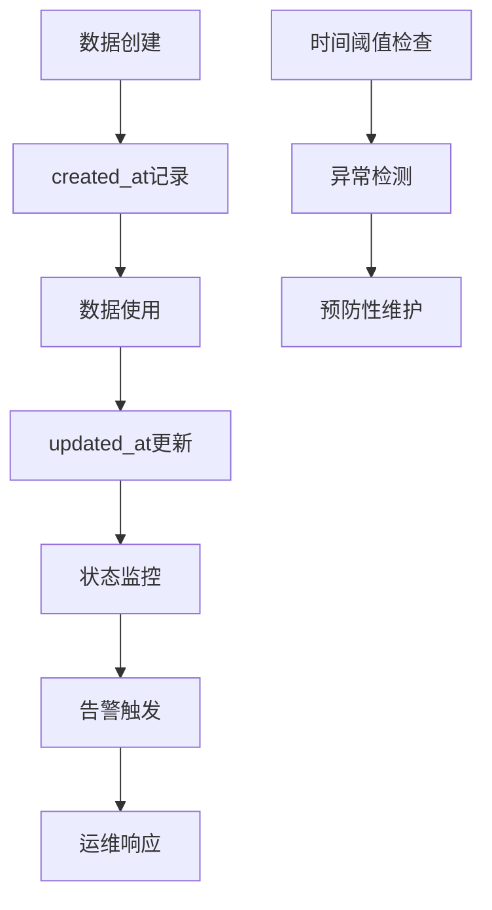
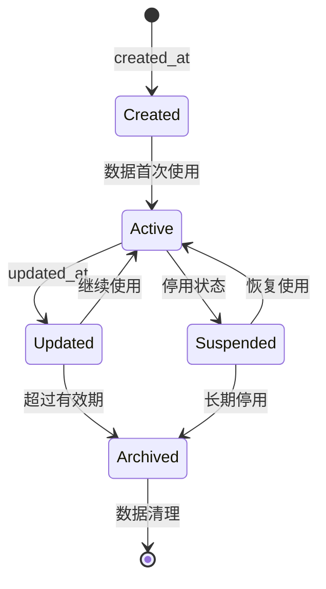
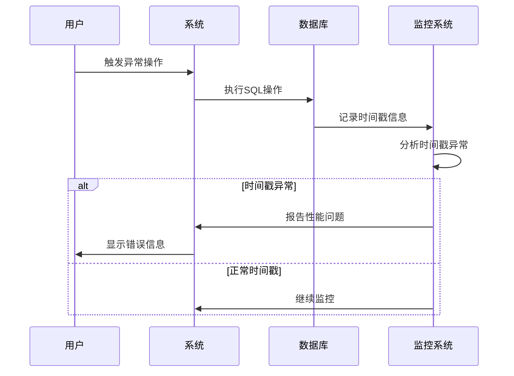

# 时间戳继承模式

<cite>
**本文档引用的文件**
- [db_manager.py](file://db_manager.py)
- [config.py](file://config.py)
</cite>

## 目录
1. [概述](#概述)
2. [时间戳字段定义](#时间戳字段定义)
3. [核心表的时间戳继承模式](#核心表的时间戳继承模式)
4. [DBManager中的时间戳管理](#dbmanager中的时间戳管理)
5. [业务意义与应用场景](#业务意义与应用场景)
6. [系统可观测性支持](#系统可观测性支持)
7. [最佳实践与注意事项](#最佳实践与注意事项)
8. [总结](#总结)

## 概述

时间戳继承模式是本系统中一种重要的数据管理策略，通过在所有核心表中统一引入`created_at`和`updated_at`两个时间戳字段，实现了数据生命周期的完整跟踪和管理。这种模式不仅提供了基础的数据审计功能，还为系统的可观测性、故障排查和数据分析奠定了坚实的基础。

## 时间戳字段定义

### 字段规范

所有核心表都遵循统一的时间戳字段规范：

| 字段名称 | 数据类型 | 默认值 | 业务含义 |
|---------|---------|--------|----------|
| `created_at` | TIMESTAMP | CURRENT_TIMESTAMP | 记录创建时间，自动设置为当前时间戳 |
| `updated_at` | TIMESTAMP | CURRENT_TIMESTAMP | 记录最后修改时间，自动更新 |

### 字段位置

时间戳字段通常位于表结构的末尾，作为最后两个字段出现，便于查询和维护：

```sql
-- 示例：标准表结构的时间戳字段位置
CREATE TABLE example_table (
    -- 其他业务字段...
    created_at TIMESTAMP DEFAULT CURRENT_TIMESTAMP,
    updated_at TIMESTAMP DEFAULT CURRENT_TIMESTAMP
);
```

## 核心表的时间戳继承模式

### 用户表 (users)

```sql
CREATE TABLE IF NOT EXISTS users (
    id INTEGER PRIMARY KEY AUTOINCREMENT,
    username TEXT UNIQUE NOT NULL,
    email TEXT UNIQUE NOT NULL,
    password_hash TEXT NOT NULL,
    is_active BOOLEAN DEFAULT TRUE,
    created_at TIMESTAMP DEFAULT CURRENT_TIMESTAMP,
    updated_at TIMESTAMP DEFAULT CURRENT_TIMESTAMP
);
```

**业务特点：**
- 记录用户账户的创建时间和最后活动时间
- 支持用户状态变更的审计追踪
- 便于统计用户增长趋势和活跃度分析

### Cookie表 (cookies)

```sql
CREATE TABLE IF NOT EXISTS cookies (
    id TEXT PRIMARY KEY,
    value TEXT NOT NULL,
    user_id INTEGER NOT NULL,
    auto_confirm INTEGER DEFAULT 1,
    remark TEXT DEFAULT '',
    pause_duration INTEGER DEFAULT 10,
    username TEXT DEFAULT '',
    password TEXT DEFAULT '',
    show_browser INTEGER DEFAULT 0,
    created_at TIMESTAMP DEFAULT CURRENT_TIMESTAMP,
    FOREIGN KEY (user_id) REFERENCES users(id) ON DELETE CASCADE
);
```

**业务特点：**
- 追踪每个Cookie的添加时间和修改时间
- 支持多账号管理和自动确认设置的变更记录
- 便于监控Cookie的有效性和使用情况

### 关键字表 (keywords)

```sql
CREATE TABLE IF NOT EXISTS keywords (
    cookie_id TEXT,
    keyword TEXT,
    reply TEXT,
    item_id TEXT,
    type TEXT DEFAULT 'text',
    image_url TEXT,
    FOREIGN KEY (cookie_id) REFERENCES cookies(id) ON DELETE CASCADE
);
```

**业务特点：**
- 记录关键字的添加时间和修改时间
- 支持文本和图片关键词的时间追踪
- 便于分析关键词的使用频率和效果

### 订单表 (orders)

```sql
CREATE TABLE IF NOT EXISTS orders (
    order_id TEXT PRIMARY KEY,
    item_id TEXT,
    buyer_id TEXT,
    spec_name TEXT,
    spec_value TEXT,
    quantity TEXT,
    amount TEXT,
    order_status TEXT DEFAULT 'unknown',
    cookie_id TEXT,
    created_at TIMESTAMP DEFAULT CURRENT_TIMESTAMP,
    updated_at TIMESTAMP DEFAULT CURRENT_TIMESTAMP,
    FOREIGN KEY (cookie_id) REFERENCES cookies(id) ON DELETE CASCADE
);
```

**业务特点：**
- 记录订单的创建时间和状态变更时间
- 支持订单流程的完整时间线追踪
- 便于订单分析和客户行为研究

### 卡券表 (cards)

```sql
CREATE TABLE IF NOT EXISTS cards (
    id INTEGER PRIMARY KEY AUTOINCREMENT,
    name TEXT NOT NULL,
    type TEXT NOT NULL CHECK (type IN ('api', 'text', 'data', 'image')),
    api_config TEXT,
    text_content TEXT,
    data_content TEXT,
    image_url TEXT,
    description TEXT,
    enabled BOOLEAN DEFAULT TRUE,
    delay_seconds INTEGER DEFAULT 0,
    is_multi_spec BOOLEAN DEFAULT FALSE,
    spec_name TEXT,
    spec_value TEXT,
    user_id INTEGER NOT NULL DEFAULT 1,
    created_at TIMESTAMP DEFAULT CURRENT_TIMESTAMP,
    updated_at TIMESTAMP DEFAULT CURRENT_TIMESTAMP,
    FOREIGN KEY (user_id) REFERENCES users (id)
);
```

**业务特点：**
- 记录卡券的创建时间和配置修改时间
- 支持多规格卡券的时间追踪
- 便于卡券使用效果的统计分析

### 通知渠道表 (notification_channels)

```sql
CREATE TABLE IF NOT EXISTS notification_channels (
    id INTEGER PRIMARY KEY AUTOINCREMENT,
    name TEXT NOT NULL,
    type TEXT NOT NULL CHECK (type IN ('qq','ding_talk','dingtalk','feishu','lark','bark','email','webhook','wechat','telegram')),
    config TEXT NOT NULL,
    enabled BOOLEAN DEFAULT TRUE,
    created_at TIMESTAMP DEFAULT CURRENT_TIMESTAMP,
    updated_at TIMESTAMP DEFAULT CURRENT_TIMESTAMP
);
```

**业务特点：**
- 记录通知渠道的添加时间和配置变更时间
- 支持多种通知方式的时间追踪
- 便于通知系统的监控和优化

## DBManager中的时间戳管理

### INSERT操作的时间戳处理

DBManager类在执行INSERT操作时，充分利用了SQLite的`CURRENT_TIMESTAMP`默认值特性：

```python
# 示例：保存Cookie的操作
def save_cookie(self, cookie_id: str, cookie_value: str, user_id: int = None) -> bool:
    with self.lock:
        try:
            cursor = self.conn.cursor()
            # 使用SQLite的CURRENT_TIMESTAMP自动设置created_at和updated_at
            self._execute_sql(cursor,
                "INSERT OR REPLACE INTO cookies (id, value, user_id) VALUES (?, ?, ?)",
                (cookie_id, cookie_value, user_id)
            )
            self.conn.commit()
            return True
        except Exception as e:
            self.conn.rollback()
            return False
```

### UPDATE操作的时间戳处理

对于需要手动更新`updated_at`字段的场景，DBManager提供了专门的处理机制：

```python
# 示例：更新通知渠道的操作
def update_notification_channel(self, channel_id: int, name: str, config: str, enabled: bool = True) -> bool:
    with self.lock:
        try:
            cursor = self.conn.cursor()
            # 显式设置updated_at为CURRENT_TIMESTAMP
            cursor.execute('''
            UPDATE notification_channels
            SET name = ?, config = ?, enabled = ?, updated_at = CURRENT_TIMESTAMP
            WHERE id = ?
            ''', (name, config, enabled, channel_id))
            self.conn.commit()
            return cursor.rowcount > 0
        except Exception as e:
            self.conn.rollback()
            return False
```

### 动态SQL构建中的时间戳处理

DBManager在构建动态SQL时，能够智能地处理时间戳字段：

```python
# 示例：动态更新语句构建
def update_cookie_account_info(self, cookie_id: str, cookie_value: str = None, username: str = None, 
                             password: str = None, show_browser: bool = None, user_id: int = None) -> bool:
    # 构建动态SQL更新语句
    update_fields = []
    params = []
    
    if cookie_value is not None:
        update_fields.append("value = ?")
        params.append(cookie_value)
    
    # ... 其他字段处理 ...
    
    if not update_fields:
        return False
    
    params.append(cookie_id)
    sql = f"UPDATE cookies SET {', '.join(update_fields)} WHERE id = ?"
    
    # 执行更新，updated_at会自动更新
    self._execute_sql(cursor, sql, tuple(params))
```

## 业务意义与应用场景

### 数据审计与合规性

时间戳字段为系统提供了完整的数据审计能力：

- **合规要求**：满足金融、电商等行业对数据变更的审计要求
- **责任追溯**：明确数据变更的责任人和时间点
- **变更历史**：完整记录数据的演进过程

### 状态追踪与监控

时间戳字段支持多种业务监控场景：



**图表来源**
- [db_manager.py](file://db_manager.py#L1155-L1200)

### 统计分析与决策支持

时间戳数据为业务分析提供了丰富的维度：

| 分析维度 | 时间戳字段 | 应用场景 |
|---------|-----------|----------|
| 用户活跃度 | created_at, updated_at | 计算用户留存率、活跃周期 |
| 内容时效性 | created_at, updated_at | 分析内容更新频率、时效性指标 |
| 系统性能 | created_at, updated_at | 监控数据处理延迟、响应时间 |
| 业务趋势 | created_at, updated_at | 分析业务增长曲线、季节性变化 |

### 数据生命周期管理

时间戳字段支持精细化的数据生命周期管理：



## 系统可观测性支持

### 日志记录与监控

DBManager内置了详细的SQL日志记录功能，时间戳字段在其中发挥了重要作用：

```python
def _log_sql(self, sql: str, params: tuple = None, operation: str = "EXECUTE"):
    """记录SQL执行日志"""
    if not self.sql_log_enabled:
        return
    
    # 格式化SQL和参数
    formatted_sql = ' '.join(sql.split())
    
    # 根据配置的日志级别输出
    log_message = f"🗄️ SQL {operation}: {formatted_sql}{params_str}"
    
    if self.sql_log_level == 'DEBUG':
        logger.debug(log_message)
    elif self.sql_log_level == 'INFO':
        logger.info(log_message)
    # ... 其他日志级别处理
```

### 故障排查与诊断

时间戳字段为系统故障排查提供了重要线索：



**图表来源**
- [db_manager.py](file://db_manager.py#L1108-L1141)

### 性能优化与容量规划

时间戳数据支持系统性能优化和容量规划：

- **访问模式分析**：通过created_at分析数据的创建模式
- **热点识别**：通过updated_at识别频繁变更的数据
- **容量预测**：基于时间戳数据预测存储需求增长
- **性能调优**：识别长时间运行的查询和慢操作

## 最佳实践与注意事项

### 数据库设计原则

1. **统一性原则**
   - 所有核心表都包含created_at和updated_at字段
   - 使用相同的命名约定和数据类型
   - 保持一致的默认值设置

2. **性能考虑**
   - 在时间戳字段上建立适当的索引
   - 避免在时间戳字段上进行复杂的计算
   - 合理使用时间戳进行数据分区

3. **数据完整性**
   - 确保updated_at字段在每次更新时自动更新
   - 避免手动设置时间戳值
   - 建立时间戳字段的约束检查

### 编程实践建议

1. **SQL编写规范**
   ```python
   # 推荐：使用SQLite的CURRENT_TIMESTAMP
   cursor.execute('''
   INSERT INTO table_name (field1, field2, created_at, updated_at)
   VALUES (?, ?, CURRENT_TIMESTAMP, CURRENT_TIMESTAMP)
   ''')
   
   # 推荐：显式更新updated_at
   cursor.execute('''
   UPDATE table_name
   SET field1 = ?, updated_at = CURRENT_TIMESTAMP
   WHERE id = ?
   ''')
   ```

2. **Python代码实践**
   - 利用DBManager的内置方法处理时间戳
   - 在批量操作中保持时间戳的一致性
   - 在异常处理中确保事务的完整性

3. **监控和告警**
   - 设置时间戳异常的监控告警
   - 定期检查时间戳数据的准确性
   - 建立时间戳相关的KPI指标

### 常见问题与解决方案

| 问题类型 | 症状 | 解决方案 |
|---------|------|----------|
| 时间戳不准确 | 数据时间与实际不符 | 检查数据库服务器时间同步 |
| 性能问题 | 查询时间戳字段较慢 | 在时间戳字段上添加索引 |
| 数据冗余 | 多个时间戳字段重复 | 评估是否需要额外的时间戳字段 |
| 异步更新 | updated_at未及时更新 | 检查应用程序的更新逻辑 |

## 总结

时间戳继承模式作为本系统的核心设计模式之一，为数据管理提供了全面而有效的解决方案。通过在所有核心表中统一引入`created_at`和`updated_at`字段，系统实现了：

1. **完整的数据审计能力**：支持合规性要求和责任追溯
2. **强大的监控和分析基础**：为业务决策提供数据支撑
3. **高效的故障排查机制**：快速定位和解决系统问题
4. **灵活的数据生命周期管理**：支持精细化的运营策略

这种模式的成功实施证明了在数据库设计中采用统一的时间戳策略的价值，为系统的长期稳定运行和业务发展提供了坚实的技术保障。随着系统的发展和业务需求的变化，时间戳继承模式将继续发挥其重要作用，为系统的可观测性和可维护性提供持续的支持。