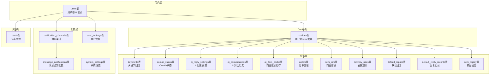
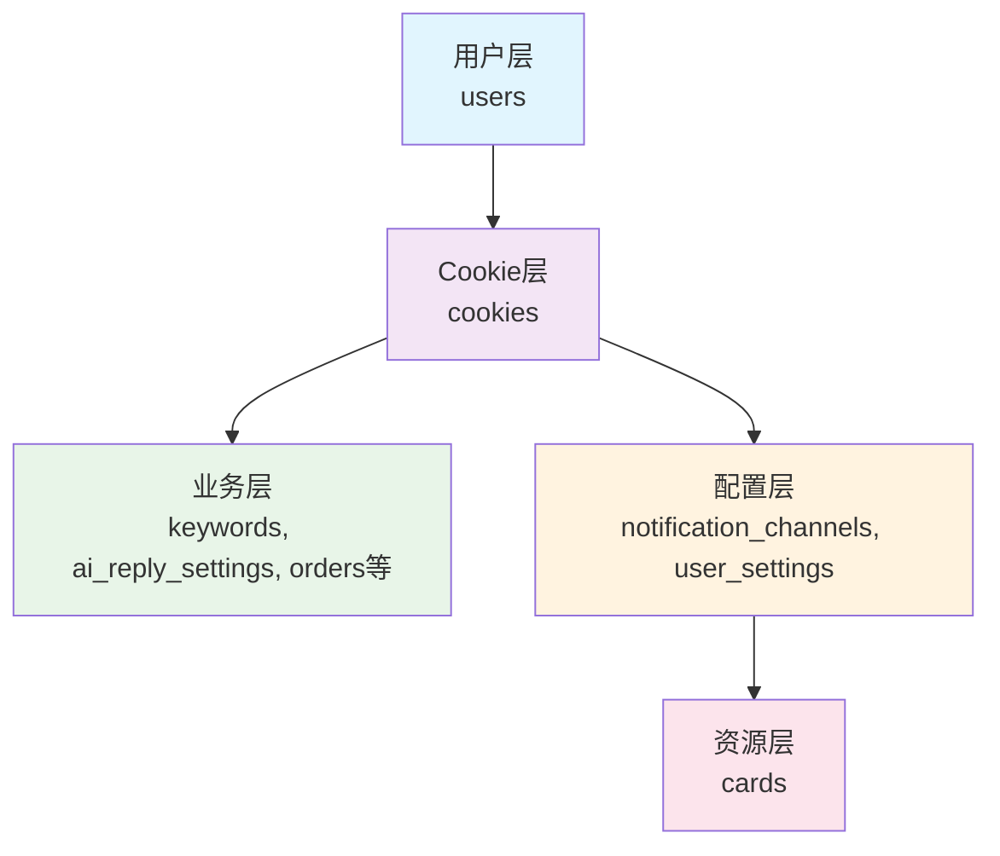
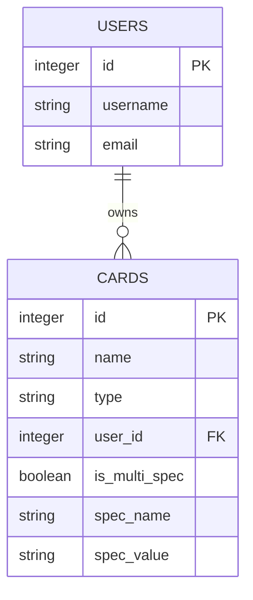
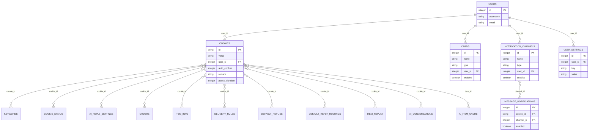
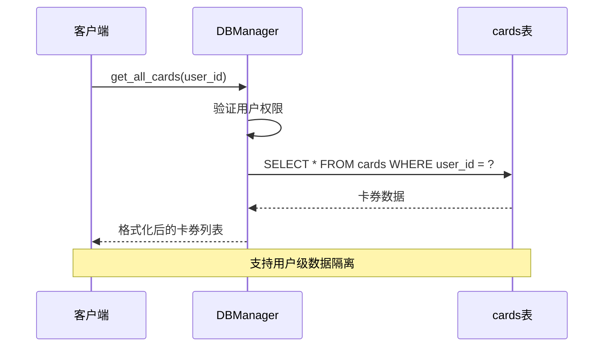
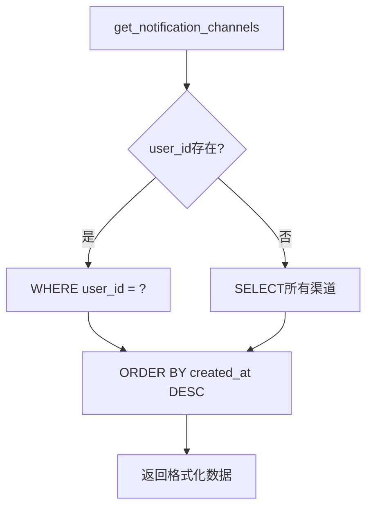
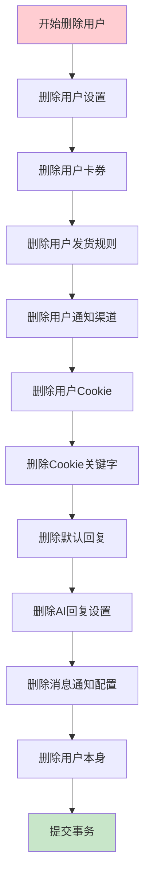
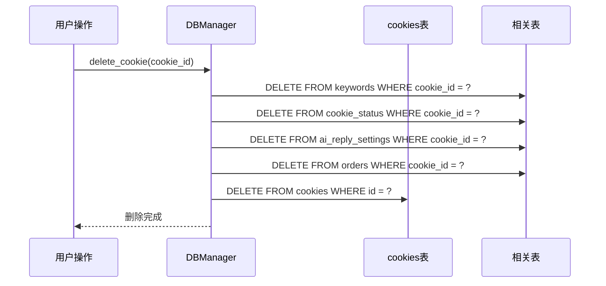
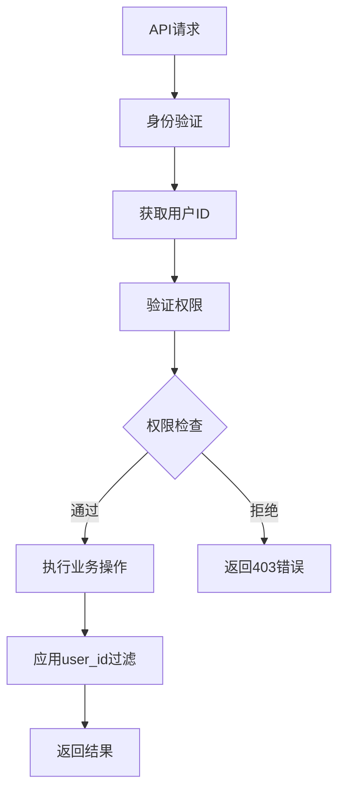
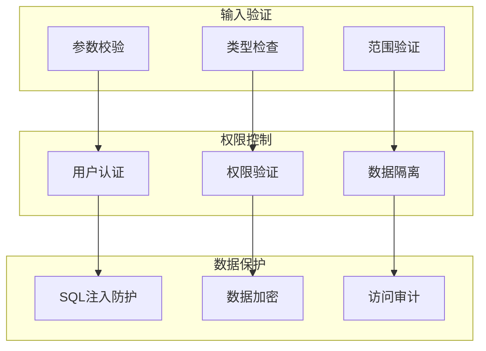

# 用户数据继承关系

<cite>
**本文档引用的文件**
- [db_manager.py](file://db_manager.py)
- [config.py](file://config.py)
- [reply_server.py](file://reply_server.py)
- [XianyuAutoAsync.py](file://XianyuAutoAsync.py)
</cite>

## 目录
1. [简介](#简介)
2. [系统架构概览](#系统架构概览)
3. [核心表结构分析](#核心表结构分析)
4. [用户数据继承体系](#用户数据继承体系)
5. [外键关联机制](#外键关联机制)
6. [查询方法实现](#查询方法实现)
7. [级联删除机制](#级联删除机制)
8. [权限控制与数据隔离](#权限控制与数据隔离)
9. [安全性保障](#安全性保障)
10. [最佳实践建议](#最佳实践建议)

## 简介

本文档详细描述了基于db_manager.py中表结构设计的用户数据继承关系体系。该系统采用以user_id为核心标识符的设计模式，通过外键关联实现了多用户环境下的数据所有权管理和权限控制。这种设计不仅保证了数据的安全性和完整性，还提供了灵活的扩展能力。

## 系统架构概览

系统采用SQLite数据库作为数据存储层，通过DBManager类统一管理数据库操作。整个数据继承体系围绕用户表(users)展开，其他业务表通过user_id字段建立层次化的关联关系。

**图表来源**
- [db_manager.py](file://db_manager.py#L74-L439)

## 核心表结构分析

### 用户表(users)

用户表是整个数据继承体系的核心，定义了系统的基本用户信息结构：

| 字段名 | 类型 | 约束 | 描述 |
|--------|------|------|------|
| id | INTEGER | PRIMARY KEY AUTOINCREMENT | 用户唯一标识符 |
| username | TEXT | UNIQUE NOT NULL | 用户名 |
| email | TEXT | UNIQUE NOT NULL | 邮箱地址 |
| password_hash | TEXT | NOT NULL | 密码哈希值 |
| is_active | BOOLEAN | DEFAULT TRUE | 用户状态 |
| created_at | TIMESTAMP | DEFAULT CURRENT_TIMESTAMP | 创建时间 |
| updated_at | TIMESTAMP | DEFAULT CURRENT_TIMESTAMP | 更新时间 |

### 卡券表(cards)

卡券表通过user_id字段实现用户级别的资源归属：

| 字段名 | 类型 | 约束 | 描述 |
|--------|------|------|------|
| id | INTEGER | PRIMARY KEY AUTOINCREMENT | 卡券唯一标识符 |
| name | TEXT | NOT NULL | 卡券名称 |
| type | TEXT | NOT NULL CHECK | 卡券类型(api/text/data/image) |
| user_id | INTEGER | NOT NULL DEFAULT 1 | 所属用户ID |
| enabled | BOOLEAN | DEFAULT TRUE | 启用状态 |
| created_at | TIMESTAMP | DEFAULT CURRENT_TIMESTAMP | 创建时间 |
| updated_at | TIMESTAMP | DEFAULT CURRENT_TIMESTAMP | 更新时间 |

### 通知渠道表(notification_channels)

通知渠道表同样采用user_id进行用户隔离：

| 字段名 | 类型 | 约束 | 描述 |
|--------|------|------|------|
| id | INTEGER | PRIMARY KEY AUTOINCREMENT | 渠道唯一标识符 |
| name | TEXT | NOT NULL | 渠道名称 |
| type | TEXT | NOT NULL CHECK | 渠道类型(qq/dingtalk/feishu等) |
| user_id | INTEGER | NOT NULL | 所属用户ID |
| enabled | BOOLEAN | DEFAULT TRUE | 启用状态 |
| created_at | TIMESTAMP | DEFAULT CURRENT_TIMESTAMP | 创建时间 |

### 用户设置表(user_settings)

用户设置表实现了细粒度的配置管理：

| 字段名 | 类型 | 约束 | 描述 |
|--------|------|------|------|
| id | INTEGER | PRIMARY KEY AUTOINCREMENT | 设置唯一标识符 |
| user_id | INTEGER | NOT NULL | 所属用户ID |
| key | TEXT | NOT NULL | 设置键名 |
| value | TEXT | NOT NULL | 设置值 |
| created_at | TIMESTAMP | DEFAULT CURRENT_TIMESTAMP | 创建时间 |

**章节来源**
- [db_manager.py](file://db_manager.py#L74-L439)

## 用户数据继承体系

### 层次化数据结构

系统采用层次化的数据继承结构，从用户层向下延伸到各个业务层面：

### 数据所有权模型

每个业务表都通过user_id字段明确标识数据的所有权归属：

1. **用户级资源**: cards表中的卡券资源归属于特定用户
2. **Cookie级资源**: keywords表中的关键字回复绑定到具体Cookie
3. **配置级资源**: notification_channels表中的通知渠道配置属于用户
4. **设置级资源**: user_settings表中的个性化设置针对用户

### 多规格支持

系统支持多规格卡券，通过复合唯一约束确保数据完整性：

**图表来源**
- [db_manager.py](file://db_manager.py#L197-L216)

**章节来源**
- [db_manager.py](file://db_manager.py#L2836-L2896)

## 外键关联机制

### 引用完整性约束

系统通过外键约束确保数据引用的完整性：

**图表来源**
- [db_manager.py](file://db_manager.py#L110-L405)

### ON DELETE CASCADE约束

系统广泛使用ON DELETE CASCADE约束实现级联删除：

1. **用户删除时的级联操作**:
   - 删除用户相关的所有Cookie
   - 删除Cookie关联的所有业务数据
   - 清理通知渠道配置
   - 删除用户设置

2. **Cookie删除时的影响**:
   - 自动清理关键字回复
   - 删除AI回复设置
   - 清理订单记录
   - 删除商品信息

**章节来源**
- [db_manager.py](file://db_manager.py#L122-L123)
- [db_manager.py](file://db_manager.py#L136-L137)
- [db_manager.py](file://db_manager.py#L146-L147)
- [db_manager.py](file://db_manager.py#L164-L165)
- [db_manager.py](file://db_manager.py#L181-L182)

## 查询方法实现

### 卡券查询方法

系统提供了多种卡券查询方法，支持用户级别的数据隔离：

**图表来源**
- [db_manager.py](file://db_manager.py#L2898-L2954)

### 通知渠道查询

通知渠道查询方法展示了用户权限控制的实现：

**图表来源**
- [db_manager.py](file://db_manager.py#L2007-L2038)

### 用户设置查询

用户设置查询方法体现了细粒度的权限控制：

| 方法名 | 功能 | 权限控制 |
|--------|------|----------|
| get_user_settings | 获取用户所有设置 | 基于user_id过滤 |
| get_user_setting | 获取特定设置项 | 基于user_id和key过滤 |
| set_user_setting | 设置用户配置 | 基于user_id验证 |

**章节来源**
- [db_manager.py](file://db_manager.py#L4198-L4264)

## 级联删除机制

### 用户删除流程

当用户被删除时，系统按照严格的顺序执行级联删除：

**图表来源**
- [db_manager.py](file://db_manager.py#L4319-L4368)

### Cookie级联删除

Cookie删除时的级联操作确保数据一致性：

**图表来源**
- [db_manager.py](file://db_manager.py#L1200-L1207)

**章节来源**
- [db_manager.py](file://db_manager.py#L2304-L2326)
- [db_manager.py](file://db_manager.py#L4319-L4368)

## 权限控制与数据隔离

### 用户级数据隔离

系统通过user_id字段实现严格的用户级数据隔离：

1. **查询隔离**: 所有查询方法都支持user_id参数
2. **写入隔离**: 写入操作自动绑定到当前用户
3. **删除隔离**: 删除操作仅影响当前用户的数据

### 权限验证流程

### 数据访问控制

| 控制级别 | 实现方式 | 应用场景 |
|----------|----------|----------|
| 表级隔离 | user_id字段 | 所有业务表 |
| 查询过滤 | WHERE子句 | 所有查询方法 |
| 写入绑定 | 自动赋值 | 创建操作 |
| 删除限制 | 用户权限 | 删除操作 |

**章节来源**
- [reply_server.py](file://reply_server.py#L221-L226)

## 安全性保障

### 数据完整性保护

系统通过多种机制确保数据完整性：

1. **外键约束**: 确保引用完整性
2. **唯一约束**: 防止数据重复
3. **级联删除**: 维护数据一致性
4. **事务控制**: 保证操作原子性

### 安全防护措施

### 敏感数据处理

系统对敏感数据采取特殊保护措施：

1. **密码存储**: 使用SHA256哈希算法
2. **Cookie保护**: 敏感信息加密存储
3. **API密钥**: 分离存储和传输
4. **审计日志**: 记录所有敏感操作

**章节来源**
- [db_manager.py](file://db_manager.py#L4319-L4368)

## 最佳实践建议

### 开发建议

1. **始终传递user_id参数**: 在所有涉及用户数据的操作中明确指定用户ID
2. **使用事务**: 对于涉及多个表的操作，使用事务确保一致性
3. **及时清理**: 定期清理无效的临时数据和过期记录
4. **监控性能**: 关注user_id索引的使用情况和查询性能

### 部署建议

1. **备份策略**: 建立定期备份机制，特别是用户数据
2. **监控告警**: 监控数据库连接和查询性能
3. **容量规划**: 根据用户增长预估存储需求
4. **安全加固**: 实施数据库访问控制和网络隔离

### 维护建议

1. **定期优化**: 执行数据库维护任务，如VACUUM和ANALYZE
2. **版本升级**: 及时更新数据库schema和依赖库
3. **性能调优**: 根据实际使用情况调整索引和查询
4. **安全审计**: 定期审查权限设置和访问日志

### 扩展建议

1. **水平扩展**: 考虑分库分表策略应对大规模用户
2. **缓存优化**: 实施适当的缓存策略提升性能
3. **异步处理**: 对于耗时操作考虑异步处理
4. **监控完善**: 建立全面的监控和告警体系

通过这种精心设计的用户数据继承关系，系统实现了高效、安全、可扩展的多用户数据管理方案，为业务发展提供了坚实的基础支撑。