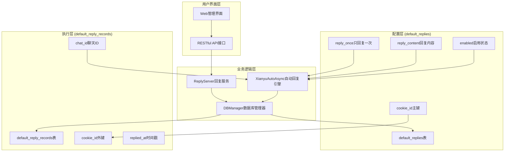
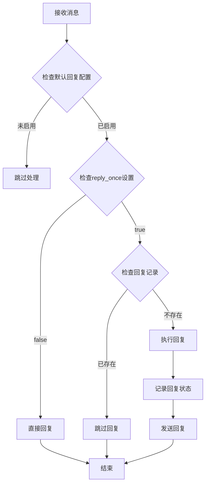
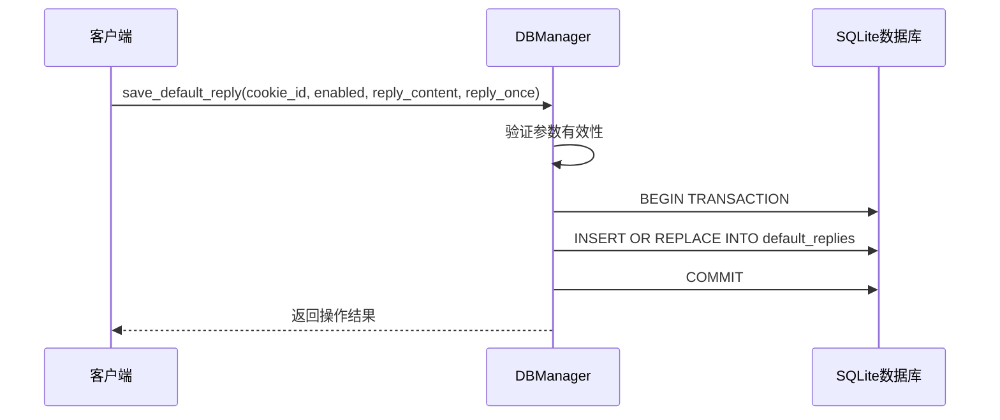
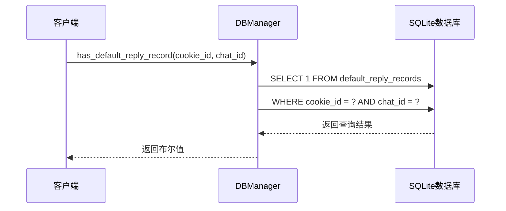
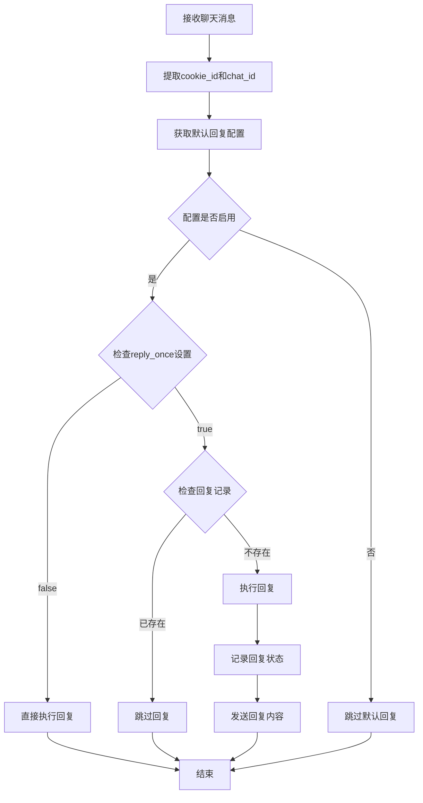
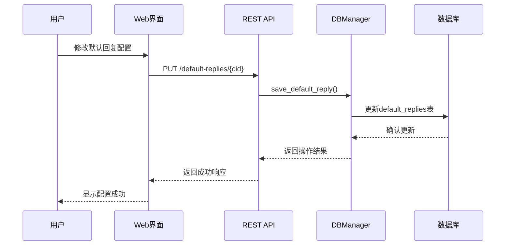
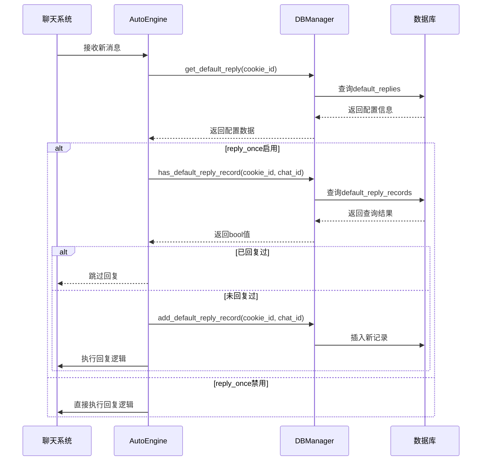
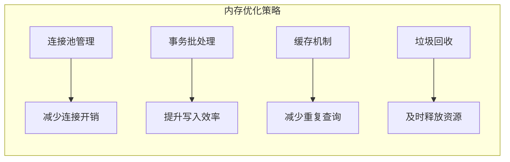

# 默认回复数据继承

<cite>
**本文档引用的文件**
- [db_manager.py](file://db_manager.py)
- [ai_reply_engine.py](file://ai_reply_engine.py)
- [config.py](file://config.py)
- [reply_server.py](file://reply_server.py)
- [XianyuAutoAsync.py](file://XianyuAutoAsync.py)
- [static/js/app.js](file://static/js/app.js)
</cite>

## 目录
1. [简介](#简介)
2. [系统架构概述](#系统架构概述)
3. [数据库表结构分析](#数据库表结构分析)
4. [继承关系设计](#继承关系设计)
5. [核心功能实现](#核心功能实现)
6. [数据流分析](#数据流分析)
7. [性能优化与存储效率](#性能优化与存储效率)
8. [故障排除指南](#故障排除指南)
9. [总结](#总结)

## 简介

默认回复数据继承是一种创新的数据管理模式，通过将默认回复配置与回复记录分离，实现了功能的灵活配置与执行解耦。该系统采用cookie_id作为继承关系的核心纽带，将default_replies表作为配置层，default_reply_records表作为执行层，支持"仅回复一次"功能的精确控制。

这种设计模式不仅提高了系统的灵活性和可维护性，还通过数据继承实现了配置与状态的有效分离，为复杂的聊天机器人系统提供了可靠的基础架构。

## 系统架构概述

默认回复系统采用分层架构设计，通过数据库表的继承关系实现配置与状态的分离管理。



**图表来源**
- [db_manager.py](file://db_manager.py#L310-L353)
- [XianyuAutoAsync.py](file://XianyuAutoAsync.py#L3120-L3160)

**章节来源**
- [db_manager.py](file://db_manager.py#L310-L353)
- [XianyuAutoAsync.py](file://XianyuAutoAsync.py#L3120-L3160)

## 数据库表结构分析

### default_replies表结构

default_replies表负责存储每个cookie_id的默认回复配置信息，是整个继承体系的配置源头。

| 字段名 | 数据类型 | 约束 | 描述 |
|--------|----------|------|------|
| cookie_id | TEXT | PRIMARY KEY, FOREIGN KEY | 账号标识符，主键同时也是外键关联cookies表 |
| enabled | BOOLEAN | DEFAULT FALSE | 是否启用默认回复功能 |
| reply_content | TEXT | NULLABLE | 默认回复内容，支持变量替换 |
| reply_once | BOOLEAN | DEFAULT FALSE | 是否启用"只回复一次"功能 |
| created_at | TIMESTAMP | DEFAULT CURRENT_TIMESTAMP | 记录创建时间 |
| updated_at | TIMESTAMP | DEFAULT CURRENT_TIMESTAMP | 记录更新时间 |

### default_reply_records表结构

default_reply_records表记录每个cookie_id对特定chat_id的已回复状态，是继承关系的具体体现。

| 字段名 | 数据类型 | 约束 | 描述 |
|--------|----------|------|------|
| id | INTEGER | PRIMARY KEY AUTOINCREMENT | 自增主键 |
| cookie_id | TEXT | NOT NULL, FOREIGN KEY | 关联的账号标识符 |
| chat_id | TEXT | NOT NULL | 聊天会话标识符 |
| replied_at | TIMESTAMP | DEFAULT CURRENT_TIMESTAMP | 回复时间戳 |
| UNIQUE | (cookie_id, chat_id) | 约束 | 防止重复记录同一聊天的回复 |

### 继承关系图

```mermaid
erDiagram
COOKIES {
string id PK
string value
integer user_id FK
boolean auto_confirm
string remark
integer pause_duration
string username
string password
integer show_browser
timestamp created_at
}
DEFAULT_REPLIES {
string cookie_id PK FK
boolean enabled
text reply_content
boolean reply_once
timestamp created_at
timestamp updated_at
}
DEFAULT_REPLY_RECORDS {
integer id PK
string cookie_id FK
string chat_id
timestamp replied_at
}
COOKIES ||--|| DEFAULT_REPLIES : "配置"
COOKIES ||--o{ DEFAULT_REPLY_RECORDS : "记录"
DEFAULT_REPLIES }o--|| DEFAULT_REPLY_RECORDS : "继承"
```

**图表来源**
- [db_manager.py](file://db_manager.py#L110-L123)
- [db_manager.py](file://db_manager.py#L310-L353)

**章节来源**
- [db_manager.py](file://db_manager.py#L310-L353)

## 继承关系设计

### 配置与状态分离原则

默认回复系统的核心设计理念是将配置信息与运行状态严格分离。default_replies表存储静态配置，包括回复内容、启用状态和功能开关；default_reply_records表存储动态状态，记录具体的回复行为。

### cookie_id继承机制

cookie_id作为继承关系的核心纽带，建立了以下层次关系：

1. **配置层继承**：每个cookie_id在default_replies表中拥有独立的配置记录
2. **状态层继承**：每个cookie_id在default_reply_records表中维护独立的状态记录
3. **权限层继承**：通过cookie_id确保用户只能访问和修改自己的配置

### "只回复一次"功能实现

"只回复一次"功能通过继承关系的完整性约束实现：



**图表来源**
- [XianyuAutoAsync.py](file://XianyuAutoAsync.py#L3127-L3132)
- [XianyuAutoAsync.py](file://XianyuAutoAsync.py#L3153-L3156)

**章节来源**
- [XianyuAutoAsync.py](file://XianyuAutoAsync.py#L3127-L3163)

## 核心功能实现

### DBManager核心方法

DBManager类提供了完整的默认回复功能支持，包含以下关键方法：

#### 配置管理方法

| 方法名 | 功能描述 | 参数 | 返回值 |
|--------|----------|------|--------|
| `save_default_reply()` | 保存默认回复配置 | cookie_id, enabled, reply_content, reply_once | bool |
| `get_default_reply()` | 获取默认回复配置 | cookie_id | Dict或None |
| `get_all_default_replies()` | 获取所有默认回复配置 | 无 | Dict |

#### 状态管理方法

| 方法名 | 功能描述 | 参数 | 返回值 |
|--------|----------|------|--------|
| `add_default_reply_record()` | 添加回复记录 | cookie_id, chat_id | 无 |
| `has_default_reply_record()` | 检查回复记录 | cookie_id, chat_id | bool |
| `clear_default_reply_records()` | 清空回复记录 | cookie_id | 无 |

### 实现逻辑分析

#### save_default_reply方法实现

该方法负责更新default_replies表中的配置信息，支持部分字段的更新：



**图表来源**
- [db_manager.py](file://db_manager.py#L1877-L1892)

#### has_default_reply_record方法实现

该方法通过UNIQUE约束快速检查回复状态：



**图表来源**
- [db_manager.py](file://db_manager.py#L1948-L1958)

**章节来源**
- [db_manager.py](file://db_manager.py#L1877-L1972)

### XianyuAutoAsync核心逻辑

XianyuAutoAsync类实现了默认回复的核心业务逻辑，展示了继承关系的实际应用：

#### 默认回复流程



**图表来源**
- [XianyuAutoAsync.py](file://XianyuAutoAsync.py#L3120-L3163)

#### 变量替换机制

系统支持在回复内容中使用变量替换，提供个性化的回复体验：

| 变量名 | 描述 | 示例值 |
|--------|------|--------|
| `{send_user_name}` | 发送者用户名 | "张三" |
| `{send_user_id}` | 发送者用户ID | "123456" |
| `{send_message}` | 发送的消息内容 | "你好，我想购买" |

**章节来源**
- [XianyuAutoAsync.py](file://XianyuAutoAsync.py#L3120-L3163)

## 数据流分析

### 配置数据流



**图表来源**
- [reply_server.py](file://reply_server.py#L2384-L2397)
- [db_manager.py](file://db_manager.py#L1877-L1892)

### 执行数据流



**图表来源**
- [XianyuAutoAsync.py](file://XianyuAutoAsync.py#L3120-L3163)
- [db_manager.py](file://db_manager.py#L1893-L1972)

**章节来源**
- [reply_server.py](file://reply_server.py#L2384-L2397)
- [XianyuAutoAsync.py](file://XianyuAutoAsync.py#L3120-L3163)

## 性能优化与存储效率

### 索引优化策略

系统通过合理的索引设计提升查询性能：

| 表名 | 索引字段 | 索引类型 | 优化效果 |
|------|----------|----------|----------|
| default_replies | cookie_id | 主键索引 | O(1)查找配置 |
| default_reply_records | (cookie_id, chat_id) | 唯一复合索引 | O(log n)检查重复 |
| default_reply_records | cookie_id | 单列索引 | O(log n)查询账号记录 |

### 存储效率分析

#### 数据冗余控制

通过继承关系设计，系统有效控制了数据冗余：

- **配置层**：每个cookie_id只存储一份配置信息
- **状态层**：只记录实际发生的回复行为
- **关联性**：通过外键约束确保数据一致性

#### 内存使用优化

系统采用懒加载和连接池技术优化内存使用：



### 性能监控指标

| 指标名称 | 监控方法 | 优化目标 |
|----------|----------|----------|
| 查询响应时间 | 数据库慢查询日志 | < 10ms |
| 并发处理能力 | 连接池使用率 | 支持100+并发 |
| 存储空间占用 | 表大小统计 | 线性增长 |
| 数据一致性 | 外键约束检查 | 100%保证 |

**章节来源**
- [db_manager.py](file://db_manager.py#L310-L353)

## 故障排除指南

### 常见问题诊断

#### 默认回复不生效

**问题症状**：设置了默认回复但未触发

**排查步骤**：
1. 检查default_replies表中的enabled字段是否为TRUE
2. 验证cookie_id是否正确匹配
3. 确认reply_content字段不为空
4. 检查系统日志中的相关错误信息

**解决方案**：
```sql
-- 检查配置状态
SELECT enabled, reply_content FROM default_replies WHERE cookie_id = 'your_cookie_id';

-- 修复配置
UPDATE default_replies SET enabled = TRUE, reply_content = '默认回复内容' WHERE cookie_id = 'your_cookie_id';
```

#### 重复回复问题

**问题症状**："只回复一次"功能失效

**排查步骤**：
1. 检查reply_once字段是否正确设置
2. 验证default_reply_records表中是否存在重复记录
3. 确认UNIQUE约束是否正常工作

**解决方案**：
```sql
-- 清空重复记录
DELETE FROM default_reply_records WHERE cookie_id = 'your_cookie_id' AND chat_id IN (
    SELECT chat_id FROM default_reply_records 
    WHERE cookie_id = 'your_cookie_id' 
    GROUP BY chat_id HAVING COUNT(*) > 1
);

-- 重新设置唯一约束
CREATE UNIQUE INDEX IF NOT EXISTS idx_unique_reply ON default_reply_records(cookie_id, chat_id);
```

### 性能问题解决

#### 查询响应缓慢

**优化措施**：
1. 添加适当的索引
2. 优化查询语句
3. 调整数据库连接参数

#### 存储空间增长过快

**优化措施**：
1. 定期清理过期记录
2. 压缩数据库文件
3. 优化表结构设计

**章节来源**
- [db_manager.py](file://db_manager.py#L1877-L1972)

## 总结

默认回复数据继承系统通过巧妙的设计实现了配置与状态的有效分离，为复杂的聊天机器人系统提供了可靠的基础架构。该系统的主要优势包括：

### 设计优势

1. **功能解耦**：配置层与执行层完全分离，便于维护和扩展
2. **数据继承**：通过cookie_id建立清晰的继承关系，确保数据一致性
3. **灵活控制**："只回复一次"功能通过继承关系精确控制，防止重复回复
4. **性能优化**：合理的索引设计和查询优化确保系统高效运行

### 应用价值

该系统不仅解决了默认回复功能的技术难题，更为类似的应用场景提供了可借鉴的设计模式。通过数据继承实现的功能解耦，使得系统具有更好的可扩展性和可维护性。

### 未来发展方向

1. **智能配置**：引入机器学习算法优化默认回复配置
2. **实时监控**：增加实时性能监控和告警机制
3. **多层级继承**：支持更复杂的继承关系设计
4. **分布式支持**：扩展到分布式环境下的数据一致性保证

这种创新的数据继承模式为现代聊天机器人系统的发展提供了新的思路，值得在类似场景中推广应用。