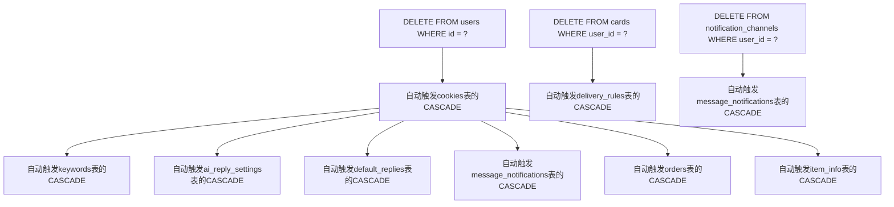
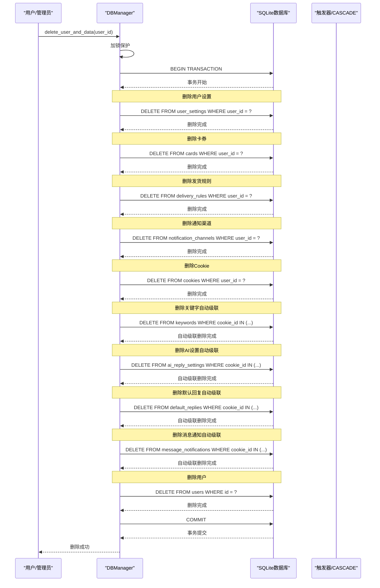
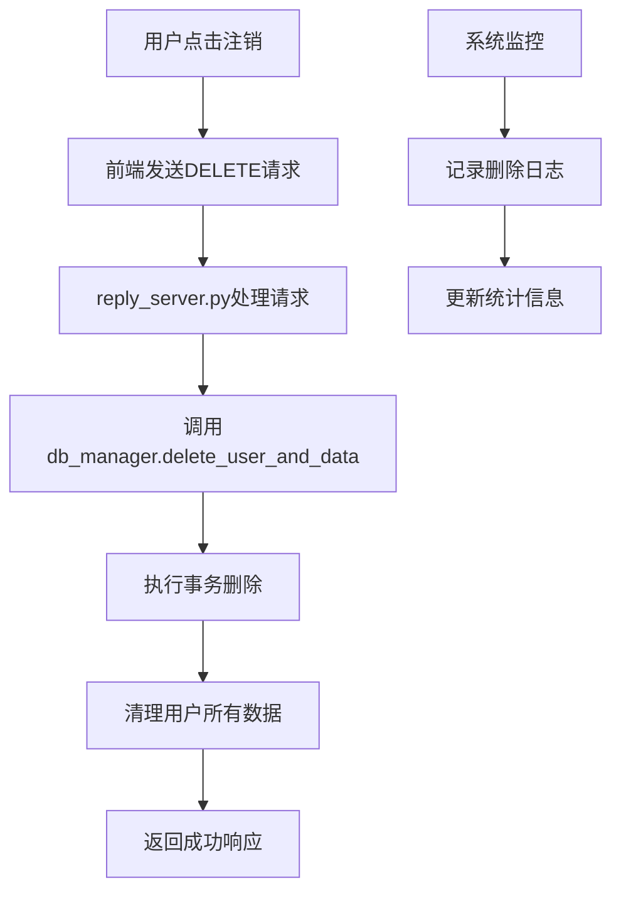
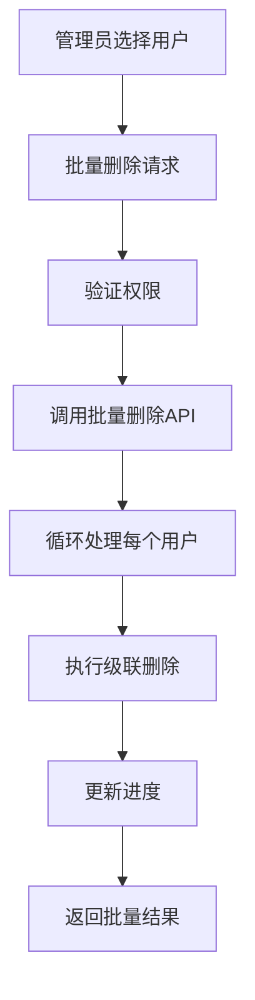

# 用户级联操作

<cite>
**本文档中引用的文件**
- [db_manager.py](file://db_manager.py)
- [config.py](file://config.py)
- [reply_server.py](file://reply_server.py)
- [static/js/app.js](file://static/js/app.js)
</cite>

## 目录
1. [简介](#简介)
2. [数据库架构概览](#数据库架构概览)
3. [外键约束与级联删除机制](#外键约束与级联删除机制)
4. [用户注销流程](#用户注销流程)
5. [事务处理与原子性保证](#事务处理与原子性保证)
6. [性能优化策略](#性能优化策略)
7. [实际应用场景](#实际应用场景)
8. [故障排除指南](#故障排除指南)
9. [总结](#总结)

## 简介

本文档详细描述了Xianyu Auto Reply系统中用户级联操作的实现机制。当删除users表中的用户记录时，系统通过ON DELETE CASCADE外键约束自动删除其在cookies、cards、notification_channels、user_settings等表中的所有关联数据，确保数据完整性并避免产生孤儿记录。

该系统采用多层次的级联删除策略，结合事务处理机制，为用户提供安全可靠的账号删除服务。无论是通过管理员界面还是自动化脚本触发的删除操作，都能保证数据的一致性和完整性。

## 数据库架构概览

系统采用SQLite数据库，设计了清晰的表结构和外键关系，确保数据间的引用完整性。

```mermaid
erDiagram
USERS {
integer id PK
text username UK
text email UK
text password_hash
boolean is_active
timestamp created_at
timestamp updated_at
}
COOKIES {
text id PK
text value
integer user_id FK
integer auto_confirm
text remark
integer pause_duration
text username
text password
integer show_browser
timestamp created_at
}
CARDS {
integer id PK
text name
text type
text api_config
text text_content
text data_content
text image_url
text description
boolean enabled
integer delay_seconds
boolean is_multi_spec
text spec_name
text spec_value
integer user_id FK
timestamp created_at
timestamp updated_at
}
NOTIFICATION_CHANNELS {
integer id PK
text name
text type
text config
boolean enabled
timestamp created_at
timestamp updated_at
}
USER_SETTINGS {
integer id PK
integer user_id FK
text key
text value
text description
timestamp created_at
timestamp updated_at
}
KEYWORDS {
text cookie_id FK
text keyword
text reply
text item_id
timestamp created_at
}
DELIVERY_RULES {
integer id PK
text keyword
integer card_id FK
integer delivery_count
boolean enabled
text description
integer delivery_times
timestamp created_at
timestamp updated_at
}
MESSAGE_NOTIFICATIONS {
integer id PK
text cookie_id FK
integer channel_id FK
boolean enabled
timestamp created_at
timestamp updated_at
}
ORDERS {
text order_id PK
text item_id
text buyer_id
text spec_name
text spec_value
text quantity
text amount
text order_status
text cookie_id FK
timestamp created_at
timestamp updated_at
}
AI_REPLY_SETTINGS {
text cookie_id PK FK
boolean ai_enabled
text model_name
text api_key
text base_url
integer max_discount_percent
integer max_discount_amount
integer max_bargain_rounds
text custom_prompts
timestamp created_at
timestamp updated_at
}
DEFAULT_REPLIES {
text cookie_id PK FK
boolean enabled
text reply_content
boolean reply_once
timestamp created_at
timestamp updated_at
}
ITEM_INFO {
integer id PK
text cookie_id FK
text item_id
text item_title
text item_description
text item_category
text item_price
text item_detail
boolean is_multi_spec
timestamp created_at
timestamp updated_at
}
USERS ||--o{ COOKIES : "user_id"
USERS ||--o{ CARDS : "user_id"
USERS ||--o{ NOTIFICATION_CHANNELS : "user_id"
USERS ||--o{ USER_SETTINGS : "user_id"
COOKIES ||--o{ KEYWORDS : "cookie_id"
COOKIES ||--o{ DELIVERY_RULES : "cookie_id"
COOKIES ||--o{ MESSAGE_NOTIFICATIONS : "cookie_id"
COOKIES ||--o{ ORDERS : "cookie_id"
COOKIES ||--o{ AI_REPLY_SETTINGS : "cookie_id"
COOKIES ||--o{ DEFAULT_REPLIES : "cookie_id"
COOKIES ||--o{ ITEM_INFO : "cookie_id"
NOTIFICATION_CHANNELS ||--o{ MESSAGE_NOTIFICATIONS : "channel_id"
```

**图表来源**
- [db_manager.py](file://db_manager.py#L74-L405)

**章节来源**
- [db_manager.py](file://db_manager.py#L74-L405)

## 外键约束与级联删除机制

### 核心级联删除表

系统中有多个表通过user_id字段引用users表，这些表都设置了ON DELETE CASCADE约束：

| 表名 | 外键字段 | 级联行为 | 说明 |
|------|----------|----------|------|
| cookies | user_id | CASCADE | 用户的Cookie凭证 |
| cards | user_id | CASCADE | 用户的回复卡券 |
| delivery_rules | user_id | CASCADE | 用户的发货规则 |
| notification_channels | user_id | CASCADE | 用户的通知渠道 |
| user_settings | user_id | CASCADE | 用户的个人设置 |

### 自动级联删除表

除了user_id外键，还有多个表通过cookie_id字段建立了自动级联删除关系：

| 表名 | 外键字段 | 级联行为 | 说明 |
|------|----------|----------|------|
| keywords | cookie_id | CASCADE | 关键词回复规则 |
| cookie_status | cookie_id | CASCADE | Cookie状态信息 |
| ai_reply_settings | cookie_id | CASCADE | AI回复配置 |
| ai_conversations | cookie_id | CASCADE | AI对话历史 |
| item_info | cookie_id | CASCADE | 商品信息缓存 |
| default_replies | cookie_id | CASCADE | 默认回复设置 |
| message_notifications | cookie_id | CASCADE | 消息通知配置 |
| orders | cookie_id | CASCADE | 订单信息 |
| risk_control_logs | cookie_id | CASCADE | 风控日志记录 |

### 复合级联删除关系

某些表之间存在复杂的级联删除关系：



**图表来源**
- [db_manager.py](file://db_manager.py#L121-L402)

**章节来源**
- [db_manager.py](file://db_manager.py#L121-L402)

## 用户注销流程

### 系统级用户删除

系统提供了两种主要的用户删除方式：

#### 1. 自动级联删除（推荐）

当删除users表中的用户记录时，系统会自动触发所有相关表的级联删除：

```sql
-- 系统自动执行的级联删除序列
DELETE FROM users WHERE id = ?;
-- 自动触发：
-- DELETE FROM cookies WHERE user_id = ?;
-- DELETE FROM user_settings WHERE user_id = ?;
-- DELETE FROM cards WHERE user_id = ?;
-- DELETE FROM delivery_rules WHERE user_id = ?;
-- DELETE FROM notification_channels WHERE user_id = ?;
```

#### 2. 手动批量删除（管理员专用）

管理员可以通过专门的方法删除用户及其所有数据：

```python
# db_manager.py 中的 delete_user_and_data 方法
def delete_user_and_data(self, user_id: int):
    """删除用户及其所有相关数据"""
    with self.lock:
        try:
            cursor = self.conn.cursor()
            
            # 开始事务
            cursor.execute('BEGIN TRANSACTION')
            
            # 删除用户相关的所有数据
            cursor.execute('DELETE FROM user_settings WHERE user_id = ?', (user_id,))
            cursor.execute('DELETE FROM cards WHERE user_id = ?', (user_id,))
            cursor.execute('DELETE FROM delivery_rules WHERE user_id = ?', (user_id,))
            cursor.execute('DELETE FROM notification_channels WHERE user_id = ?', (user_id,))
            cursor.execute('DELETE FROM cookies WHERE user_id = ?', (user_id,))
            
            # 复杂的子查询删除
            cursor.execute('DELETE FROM keywords WHERE cookie_id IN (SELECT id FROM cookies WHERE user_id = ?)', (user_id,))
            cursor.execute('DELETE FROM default_replies WHERE cookie_id IN (SELECT id FROM cookies WHERE user_id = ?)', (user_id,))
            cursor.execute('DELETE FROM ai_reply_settings WHERE cookie_id IN (SELECT id FROM cookies WHERE user_id = ?)', (user_id,))
            cursor.execute('DELETE FROM message_notifications WHERE cookie_id IN (SELECT id FROM cookies WHERE user_id = ?)', (user_id,))
            
            # 最后删除用户本身
            cursor.execute('DELETE FROM users WHERE id = ?', (user_id,))
            
            # 提交事务
            cursor.execute('COMMIT')
            
            return True
        except Exception as e:
            # 回滚事务
            cursor.execute('ROLLBACK')
            return False
```

### 删除流程图



**图表来源**
- [db_manager.py](file://db_manager.py#L4319-L4369)

**章节来源**
- [db_manager.py](file://db_manager.py#L4319-L4369)

## 事务处理与原子性保证

### 事务级别保护

系统在删除用户数据时采用了严格的事务控制，确保操作的原子性：

#### 1. 事务开始

```python
# 开始事务
cursor.execute('BEGIN TRANSACTION')
```

#### 2. 原子性操作序列

删除过程中的每个步骤都是原子性的：

- 用户设置删除
- 卡券删除  
- 发货规则删除
- 通知渠道删除
- Cookie删除
- 关键字删除（自动级联）
- AI设置删除（自动级联）
- 默认回复删除（自动级联）
- 消息通知删除（自动级联）
- 用户删除

#### 3. 错误处理与回滚

```python
try:
    # 执行删除操作
    cursor.execute('DELETE FROM user_settings WHERE user_id = ?', (user_id,))
    # ... 更多删除操作
    
    # 提交事务
    cursor.execute('COMMIT')
except Exception as e:
    # 发生错误时自动回滚
    cursor.execute('ROLLBACK')
    return False
```

### 并发控制

系统使用可重入锁（threading.RLock）来保护数据库操作：

```python
class DBManager:
    def __init__(self):
        self.lock = threading.RLock()  # 可重入锁
    
    def delete_user_and_data(self, user_id: int):
        with self.lock:  # 线程安全保护
            # 执行删除操作
            pass
```

### 事务特性

- **原子性（Atomicity）**：要么全部成功，要么全部失败
- **一致性（Consistency）**：保持数据库约束和完整性
- **隔离性（Isolation）**：并发操作不会相互干扰
- **持久性（Durability）**：一旦提交，数据永久保存

**章节来源**
- [db_manager.py](file://db_manager.py#L4321-L4369)

## 性能优化策略

### 批量删除优化

对于大量数据的删除操作，系统提供了批量处理机制：

#### 1. 批量商品信息删除

```python
def batch_delete_item_info(self, items_to_delete: list) -> int:
    """批量删除商品信息"""
    if not items_to_delete:
        return 0
        
    success_count = 0
    try:
        with self.lock:
            cursor = self.conn.cursor()
            cursor.execute('BEGIN TRANSACTION')
            
            for item_data in items_to_delete:
                try:
                    cookie_id = item_data.get('cookie_id')
                    item_id = item_data.get('item_id')
                    
                    if not cookie_id or not item_id:
                        continue
                        
                    cursor.execute('DELETE FROM item_info WHERE cookie_id = ? AND item_id = ?',
                                 (cookie_id, item_id))
                    
                    if cursor.rowcount > 0:
                        success_count += 1
                        
                except Exception as item_e:
                    continue
            
            cursor.execute('COMMIT')
            return success_count
    except Exception as e:
        cursor.execute('ROLLBACK')
        return success_count
```

#### 2. VACUUM优化

系统会在大量数据清理后自动执行VACUUM操作：

```python
# 在 db_manager.py 中的清理方法
if total_cleaned > 100:
    logger.info(f"共清理了 {total_cleaned} 条记录，执行VACUUM以释放磁盘空间...")
    cursor.execute("VACUUM")
    logger.info("VACUUM执行完成")
```

### 索引优化

系统在关键字段上建立了适当的索引：

- `cookies(user_id)` - 快速查找用户的所有Cookie
- `cards(user_id)` - 快速查找用户的卡券
- `user_settings(user_id)` - 快速查找用户设置
- `notification_channels(user_id)` - 快速查找通知渠道

### 查询优化

复杂删除操作使用子查询优化：

```sql
-- 使用子查询减少中间表
DELETE FROM keywords 
WHERE cookie_id IN (SELECT id FROM cookies WHERE user_id = ?)
```

**章节来源**
- [db_manager.py](file://db_manager.py#L4148-L4196)
- [db_manager.py](file://db_manager.py#L5076-L5087)

## 实际应用场景

### 场景1：用户主动注销

用户通过前端界面发起注销请求：



### 场景2：管理员批量删除

管理员通过管理界面删除多个用户：



### 场景3：数据清理任务

定期清理无效或过期的用户数据：

```python
# 示例：清理超过30天未活动的用户
def cleanup_inactive_users(days_threshold: int = 30):
    cursor.execute('''
    DELETE FROM users 
    WHERE updated_at < datetime('now', ? || ' days')
    ''', (-days_threshold,))
```

### 场景4：系统维护

系统维护期间的用户数据清理：

```python
# 系统维护时的安全删除
def maintenance_cleanup(user_id: int):
    # 验证用户存在
    cursor.execute('SELECT id FROM users WHERE id = ?', (user_id,))
    if not cursor.fetchone():
        return False
        
    # 执行安全删除
    return db_manager.delete_user_and_data(user_id)
```

**章节来源**
- [reply_server.py](file://reply_server.py#L5412-L5435)
- [static/js/app.js](file://static/js/app.js#L6087-L6128)

## 故障排除指南

### 常见问题及解决方案

#### 1. 删除失败：外键约束错误

**问题症状**：
```
sqlite3.IntegrityError: FOREIGN KEY constraint failed
```

**原因分析**：
- 存在外键约束违反
- 数据库处于锁定状态
- 事务未正确提交

**解决方案**：
```python
# 检查数据库状态
def debug_foreign_keys(user_id: int):
    cursor.execute('PRAGMA foreign_key_check')
    violations = cursor.fetchall()
    print(f"外键约束违规: {violations}")
    
    # 检查用户是否存在
    cursor.execute('SELECT id FROM users WHERE id = ?', (user_id,))
    user_exists = cursor.fetchone()
    print(f"用户存在: {user_exists is not None}")
```

#### 2. 性能问题：删除大量数据缓慢

**问题症状**：
- 删除操作耗时过长
- 数据库文件增长过快

**解决方案**：
```python
# 分批删除大量数据
def batch_delete_large_dataset(user_id: int, batch_size: int = 100):
    while True:
        # 删除一批数据
        cursor.execute('''
        DELETE FROM keywords 
        WHERE cookie_id IN (
            SELECT id FROM cookies WHERE user_id = ? LIMIT ?
        )''', (user_id, batch_size))
        
        deleted_count = cursor.rowcount
        if deleted_count == 0:
            break
            
        conn.commit()
        time.sleep(0.1)  # 避免CPU占用过高
```

#### 3. 事务死锁

**问题症状**：
- 操作长时间无响应
- 数据库锁定超时

**解决方案**：
```python
# 设置事务超时
conn.execute('PRAGMA busy_timeout = 30000')  # 30秒超时

# 使用乐观锁策略
def safe_delete_with_retry(user_id: int, max_retries: int = 3):
    for attempt in range(max_retries):
        try:
            return db_manager.delete_user_and_data(user_id)
        except sqlite3.OperationalError as e:
            if "database is locked" in str(e) and attempt < max_retries - 1:
                time.sleep(1 << attempt)  # 指数退避
                continue
            raise
```

#### 4. 日志记录问题

**问题症状**：
- 删除操作无日志记录
- 错误信息不明确

**解决方案**：
```python
# 增强日志记录
def enhanced_delete_logging(user_id: int):
    logger.info(f"开始删除用户 {user_id} 及其相关数据")
    
    # 记录删除前的状态
    cursor.execute('SELECT COUNT(*) FROM cookies WHERE user_id = ?', (user_id,))
    cookie_count = cursor.fetchone()[0]
    logger.info(f"用户 {user_id} 有 {cookie_count} 个Cookie")
    
    # 执行删除
    success = db_manager.delete_user_and_data(user_id)
    
    # 记录删除后的状态
    if success:
        logger.info(f"用户 {user_id} 删除成功")
    else:
        logger.error(f"用户 {user_id} 删除失败")
    
    return success
```

### 监控和告警

建议实施以下监控措施：

1. **删除操作监控**：记录每次删除操作的时间和影响范围
2. **性能监控**：监控删除操作的执行时间
3. **错误监控**：跟踪删除失败的原因和频率
4. **数据完整性监控**：定期检查外键约束的完整性

**章节来源**
- [db_manager.py](file://db_manager.py#L4366-L4369)

## 总结

Xianyu Auto Reply系统的用户级联操作设计体现了现代数据库应用的最佳实践：

### 核心优势

1. **数据完整性**：通过ON DELETE CASCADE确保删除操作不会留下孤儿记录
2. **自动化程度高**：系统自动处理复杂的级联删除关系
3. **事务安全性**：严格的事物控制保证操作的原子性
4. **性能优化**：批量处理和索引优化提升删除效率
5. **并发安全**：可重入锁保护防止并发冲突

### 设计亮点

- **模块化删除**：支持按需删除不同类型的用户数据
- **灵活的事务控制**：既支持自动级联也支持手动批量删除
- **完善的错误处理**：回滚机制确保数据一致性
- **性能考虑**：VACUUM操作优化存储空间

### 应用价值

该级联删除机制为系统提供了：
- **用户体验**：简化用户注销流程
- **数据管理**：自动清理用户相关数据
- **系统维护**：便于管理员进行数据清理
- **合规性**：支持GDPR等数据保护要求

通过这种设计，系统能够在保证数据完整性的同时，为用户提供便捷、可靠的服务体验。