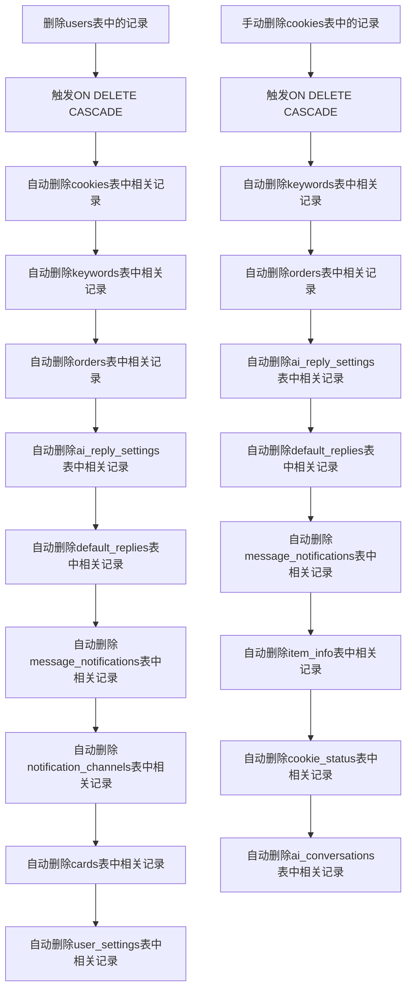
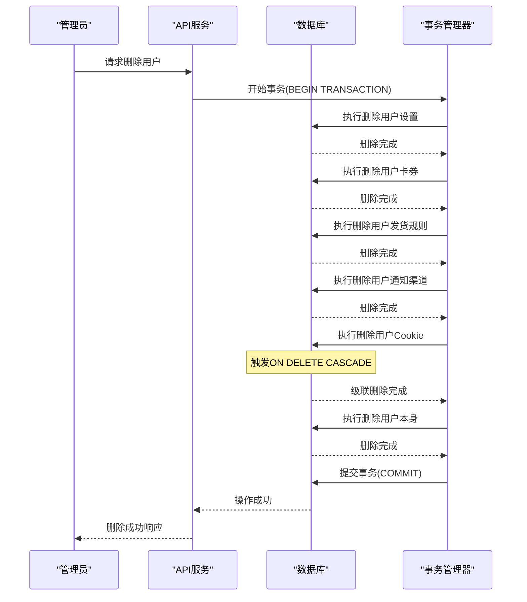
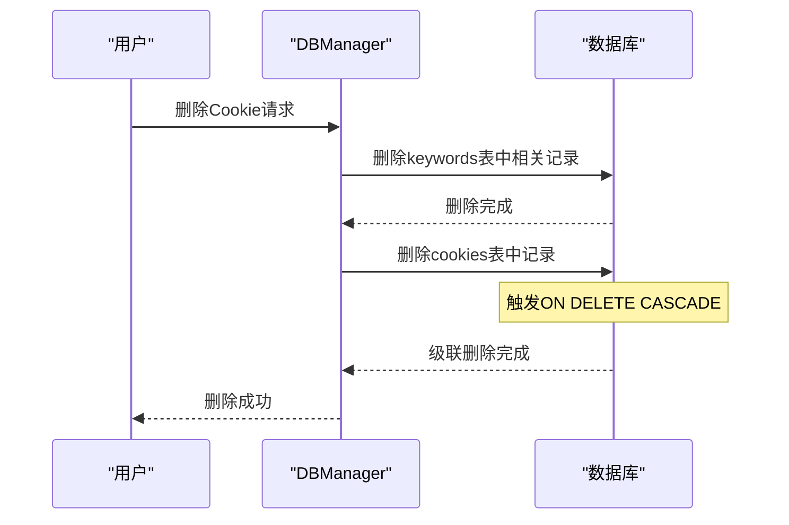
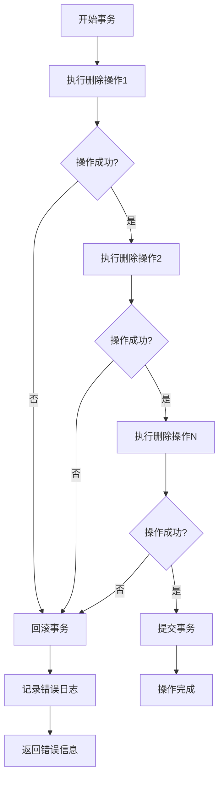

# 级联操作

<cite>
**本文档引用的文件**
- [db_manager.py](file://db_manager.py)
- [reply_server.py](file://reply_server.py)
</cite>

## 目录
1. [概述](#概述)
2. [数据库架构与外键关系](#数据库架构与外键关系)
3. [ON DELETE CASCADE约束机制](#on-delete-cascade约束机制)
4. [级联删除操作详解](#级联删除操作详解)
5. [数据一致性保障](#数据一致性保障)
6. [业务应用场景](#业务应用场景)
7. [事务原子性保证](#事务原子性保证)
8. [实际操作示例](#实际操作示例)
9. [最佳实践与注意事项](#最佳实践与注意事项)

## 概述

级联操作是数据库中一种重要的数据维护机制，通过ON DELETE CASCADE外键约束，当删除父表中的记录时，数据库会自动删除子表中所有相关的依赖记录。在本项目中，级联操作被广泛应用于用户注销、账号移除等业务场景，确保数据的一致性和完整性。

## 数据库架构与外键关系

### 核心表结构关系图

```mermaid
erDiagram
USERS {
integer id PK
string username UK
string email UK
string password_hash
boolean is_active
timestamp created_at
timestamp updated_at
}
COOKIES {
string id PK
text value
integer user_id FK
integer auto_confirm
text remark
integer pause_duration
text username
text password
integer show_browser
timestamp created_at
}
KEYWORDS {
string cookie_id FK
text keyword
text reply
text item_id
text type
text image_url
}
CARDS {
integer id PK
string name
string type
text api_config
text text_content
text data_content
text image_url
text description
boolean enabled
integer delay_seconds
boolean is_multi_spec
text spec_name
text spec_value
integer user_id FK
timestamp created_at
timestamp updated_at
}
ORDERS {
string order_id PK
string item_id
string buyer_id
text spec_name
text spec_value
text quantity
text amount
string order_status
string cookie_id FK
timestamp created_at
timestamp updated_at
}
MESSAGE_NOTIFICATIONS {
integer id PK
string cookie_id FK
integer channel_id FK
boolean enabled
timestamp created_at
timestamp updated_at
}
NOTIFICATION_CHANNELS {
integer id PK
string name
string type
text config
boolean enabled
timestamp created_at
timestamp updated_at
}
AI_REPLY_SETTINGS {
string cookie_id PK FK
boolean ai_enabled
string model_name
text api_key
text base_url
integer max_discount_percent
integer max_discount_amount
integer max_bargain_rounds
text custom_prompts
timestamp created_at
timestamp updated_at
}
DEFAULT_REPLIES {
string cookie_id PK FK
boolean enabled
text reply_content
boolean reply_once
timestamp created_at
timestamp updated_at
}
USERS ||--o{ COOKIES : "拥有"
COOKIES ||--o{ KEYWORDS : "包含"
COOKIES ||--o{ ORDERS : "产生"
COOKIES ||--o{ AI_REPLY_SETTINGS : "配置"
COOKIES ||--o{ DEFAULT_REPLIES : "设置"
COOKIES ||--o{ MESSAGE_NOTIFICATIONS : "关联"
MESSAGE_NOTIFICATIONS }o--|| NOTIFICATION_CHANNELS : "使用"
CARDS ||--o{ DELIVERY_RULES : "应用"
```

**图表来源**
- [db_manager.py](file://db_manager.py#L74-L439)

### 外键约束定义

系统中关键的外键约束包括：

1. **cookies表**：`user_id`字段引用users表的id字段，设置了ON DELETE CASCADE
2. **keywords表**：`cookie_id`字段引用cookies表的id字段，设置了ON DELETE CASCADE
3. **orders表**：`cookie_id`字段引用cookies表的id字段，设置了ON DELETE CASCADE
4. **ai_reply_settings表**：`cookie_id`字段引用cookies表的id字段，设置了ON DELETE CASCADE
5. **default_replies表**：`cookie_id`字段引用cookies表的id字段，设置了ON DELETE CASCADE
6. **message_notifications表**：`cookie_id`字段引用cookies表的id字段，设置了ON DELETE CASCADE
7. **message_notifications表**：`channel_id`字段引用notification_channels表的id字段，设置了ON DELETE CASCADE
8. **cards表**：`user_id`字段引用users表的id字段，设置了ON DELETE CASCADE
9. **user_settings表**：`user_id`字段引用users表的id字段，设置了ON DELETE CASCADE

**章节来源**
- [db_manager.py](file://db_manager.py#L114-L439)

## ON DELETE CASCADE约束机制

### 级联删除的工作原理

当在父表中删除一条记录时，数据库会自动检查所有引用该记录的子表，并删除这些子表中对应的记录。这种机制确保了数据的参照完整性。



**图表来源**
- [db_manager.py](file://db_manager.py#L2308-L2315)
- [db_manager.py](file://db_manager.py#L4341-L4357)

### 级联删除的触发条件

级联删除会在以下情况下自动触发：

1. **直接删除父表记录**：删除users表中的某个用户记录
2. **间接级联删除**：删除cookies表中的某个Cookie记录
3. **批量删除操作**：删除多个相关记录时的级联效应

**章节来源**
- [db_manager.py](file://db_manager.py#L2308-L2315)
- [db_manager.py](file://db_manager.py#L4341-L4357)

## 级联删除操作详解

### 用户注销场景

当管理员删除用户时，系统会执行完整的级联删除操作：



**图表来源**
- [db_manager.py](file://db_manager.py#L4319-L4368)
- [reply_server.py](file://reply_server.py#L4701-L4726)

### Cookie删除场景

当删除单个Cookie时，系统会自动清理所有相关的配置和数据：



**图表来源**
- [db_manager.py](file://db_manager.py#L1196-L1211)

**章节来源**
- [db_manager.py](file://db_manager.py#L4319-L4368)
- [db_manager.py](file://db_manager.py#L1196-L1211)

## 数据一致性保障

### 原子性保证

系统通过事务机制确保级联删除操作的原子性：

1. **事务开始**：使用`BEGIN TRANSACTION`标记事务起点
2. **操作执行**：依次执行各个删除操作
3. **成功提交**：使用`COMMIT`确认所有操作
4. **失败回滚**：使用`ROLLBACK`撤销所有操作

### 错误处理机制

系统实现了完善的错误处理机制：

- **异常捕获**：捕获所有数据库操作异常
- **自动回滚**：发生错误时自动回滚事务
- **日志记录**：记录详细的错误信息
- **状态反馈**：向调用方返回明确的操作结果

**章节来源**
- [db_manager.py](file://db_manager.py#L4325-L4368)

## 业务应用场景

### 用户注销流程

用户注销是最典型的级联操作应用场景：

1. **管理员权限验证**：确保只有管理员可以执行删除操作
2. **数据完整性检查**：验证用户是否存在且不是管理员
3. **级联删除执行**：自动清理用户的所有相关数据
4. **操作日志记录**：记录删除操作的详细信息

### 账号移除场景

当需要移除特定账号时，系统会：

1. **识别相关数据**：查找所有与该账号相关的记录
2. **执行级联删除**：自动删除所有依赖记录
3. **验证删除结果**：确认所有相关数据已被清理
4. **更新系统状态**：更新相关系统的状态信息

### 系统维护场景

在系统维护过程中，可能需要：

1. **批量数据清理**：清理过期或无效的数据
2. **数据迁移**：在不同系统间迁移数据
3. **数据恢复**：从备份中恢复数据
4. **数据统计**：生成各种统计数据

**章节来源**
- [reply_server.py](file://reply_server.py#L4701-L4726)
- [db_manager.py](file://db_manager.py#L4319-L4368)

## 事务原子性保证

### 事务控制流程



**图表来源**
- [db_manager.py](file://db_manager.py#L4325-L4368)

### 事务隔离级别

系统采用适当的事务隔离级别来确保数据一致性：

- **隔离性**：防止并发操作导致的数据不一致
- **持久性**：确保已提交的事务不会丢失
- **一致性**：维护数据库的完整性和约束
- **原子性**：确保事务的全部操作要么全部成功，要么全部失败

**章节来源**
- [db_manager.py](file://db_manager.py#L4325-L4368)

## 实际操作示例

### 删除用户的完整SQL流程

以下是删除用户的完整SQL操作序列：

```sql
-- 开始事务
BEGIN TRANSACTION;

-- 删除用户设置
DELETE FROM user_settings WHERE user_id = ?;

-- 删除用户的卡券
DELETE FROM cards WHERE user_id = ?;

-- 删除用户的发货规则
DELETE FROM delivery_rules WHERE user_id = ?;

-- 删除用户的通知渠道
DELETE FROM notification_channels WHERE user_id = ?;

-- 删除用户的Cookie（触发ON DELETE CASCADE）
DELETE FROM cookies WHERE user_id = ?;

-- 删除用户本身
DELETE FROM users WHERE id = ?;

-- 提交事务
COMMIT;
```

### 删除Cookie的SQL流程

```sql
-- 删除keywords表中相关记录（触发ON DELETE CASCADE）
DELETE FROM keywords WHERE cookie_id = ?;

-- 删除cookies表中记录（触发ON DELETE CASCADE）
DELETE FROM cookies WHERE id = ?;
```

### 级联删除的实际效果

当执行以下删除操作时：

```python
# 删除用户ID为123的用户
db_manager.delete_user_and_data(123)
```

系统会自动执行以下操作：

1. 删除`user_settings`表中`user_id = 123`的所有记录
2. 删除`cards`表中`user_id = 123`的所有记录
3. 删除`delivery_rules`表中`user_id = 123`的所有记录
4. 删除`notification_channels`表中`user_id = 123`的所有记录
5. 删除`cookies`表中`user_id = 123`的所有记录
6. 由于`cookies`表设置了ON DELETE CASCADE，自动删除：
   - `keywords`表中`cookie_id`对应的记录
   - `orders`表中`cookie_id`对应的记录
   - `ai_reply_settings`表中`cookie_id`对应的记录
   - `default_replies`表中`cookie_id`对应的记录
   - `message_notifications`表中`cookie_id`对应的记录
7. 最后删除`users`表中`id = 123`的记录

**章节来源**
- [db_manager.py](file://db_manager.py#L4319-L4368)

## 最佳实践与注意事项

### 性能优化建议

1. **索引优化**：确保外键字段上有适当的索引
2. **批量操作**：对于大量数据的删除，考虑使用批量操作
3. **分批处理**：对于特别大的数据集，实施分批删除策略
4. **监控性能**：监控级联删除操作的性能影响

### 数据安全考虑

1. **权限控制**：严格控制删除操作的权限
2. **审计日志**：记录所有的删除操作
3. **备份策略**：定期备份重要数据
4. **恢复机制**：建立快速的数据恢复机制

### 错误处理策略

1. **异常捕获**：全面捕获可能的异常情况
2. **回滚机制**：确保操作失败时能够正确回滚
3. **状态检查**：在删除前检查相关数据的状态
4. **用户提示**：向用户清晰地展示操作结果

### 维护和监控

1. **定期检查**：定期检查外键约束的有效性
2. **性能监控**：监控级联删除操作的性能
3. **数据验证**：验证删除操作后的数据完整性
4. **容量规划**：根据删除操作的频率规划存储容量

通过合理设计和实施级联操作，系统能够在保证数据一致性的同时，简化业务逻辑，提高系统的可维护性和可靠性。这种机制特别适用于需要频繁进行数据清理和用户管理的业务场景。