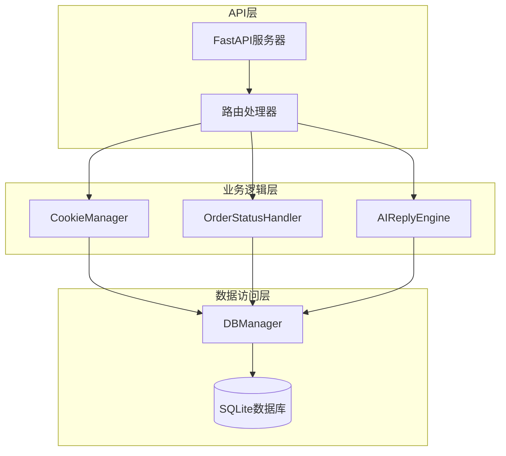
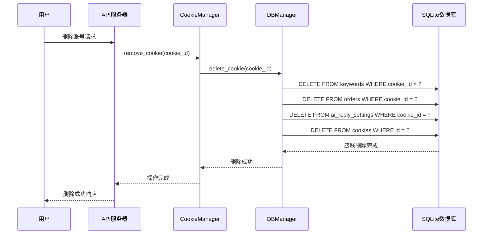
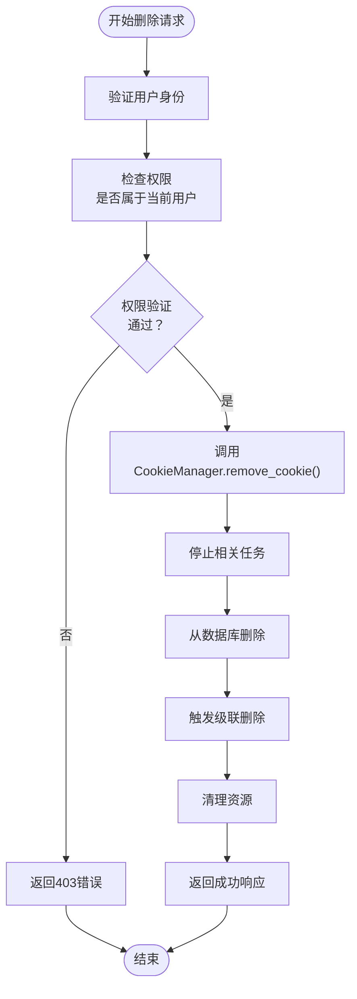
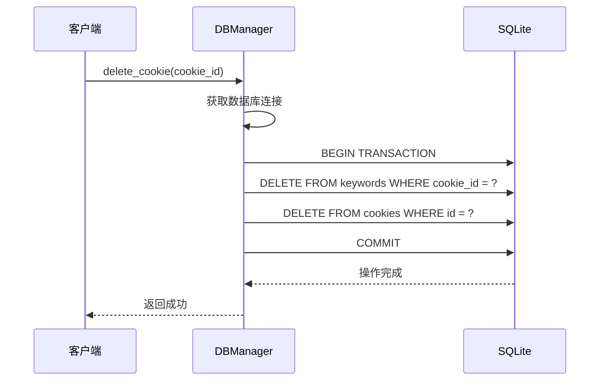
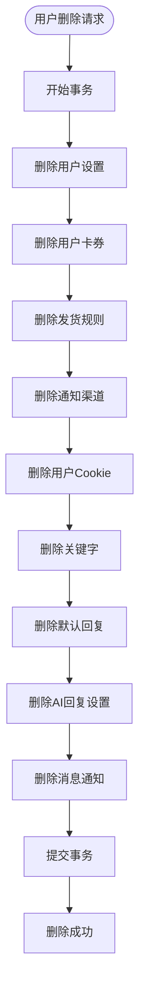
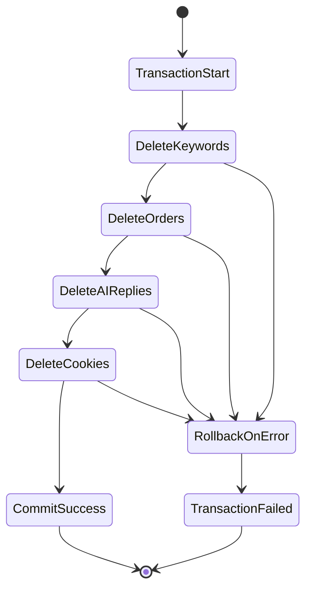
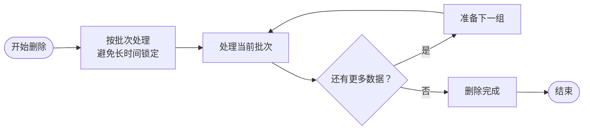

# 账号级联操作

<cite>
**本文档中引用的文件**
- [db_manager.py](file://db_manager.py)
- [cookie_manager.py](file://cookie_manager.py)
- [ai_reply_engine.py](file://ai_reply_engine.py)
- [order_status_handler.py](file://order_status_handler.py)
- [reply_server.py](file://reply_server.py)
</cite>

## 目录
1. [简介](#简介)
2. [系统架构概览](#系统架构概览)
3. [核心外键约束设计](#核心外键约束设计)
4. [级联删除机制详解](#级联删除机制详解)
5. [数据表结构分析](#数据表结构分析)
6. [删除操作流程](#删除操作流程)
7. [实际应用示例](#实际应用示例)
8. [数据一致性保障](#数据一致性保障)
9. [性能优化考虑](#性能优化考虑)
10. [故障排除指南](#故障排除指南)
11. [总结](#总结)

## 简介

闲鱼自动回复系统采用了一套完善的账号级联操作机制，通过SQLite数据库的外键约束和ON DELETE CASCADE特性，确保在删除闲鱼账号时能够自动清理所有相关的依赖数据。这种设计不仅维护了数据的一致性，还简化了系统的维护工作。

本文档详细阐述了系统中cookie_id作为核心外键在各个表中的广泛引用，以及级联删除如何保证系统稳定性和数据清洁性的关键作用。

## 系统架构概览

系统采用分层架构设计，主要包含以下组件：



**图表来源**
- [reply_server.py](file://reply_server.py#L1-L50)
- [cookie_manager.py](file://cookie_manager.py#L10-L30)
- [db_manager.py](file://db_manager.py#L16-L50)

## 核心外键约束设计

系统中cookie_id作为核心外键，在多个表中建立了级联引用关系：

```mermaid
erDiagram
COOKIES {
string id PK
text value
integer user_id FK
integer auto_confirm
text remark
integer pause_duration
text username
text password
integer show_browser
timestamp created_at
}
KEYWORDS {
text cookie_id FK
text keyword
text reply
text item_id
text type
text image_url
}
COOKIE_STATUS {
text cookie_id PK FK
boolean enabled
timestamp updated_at
}
AI_REPLY_SETTINGS {
text cookie_id PK FK
boolean ai_enabled
text model_name
text api_key
text base_url
integer max_discount_percent
integer max_discount_amount
integer max_bargain_rounds
text custom_prompts
timestamp created_at
timestamp updated_at
}
ORDERS {
text order_id PK
text item_id
text buyer_id
text spec_name
text spec_value
text quantity
text amount
text order_status
text cookie_id FK
timestamp created_at
timestamp updated_at
}
ITEM_INFO {
integer id PK
text cookie_id FK
text item_id
text item_title
text item_description
text item_category
text item_price
text item_detail
boolean is_multi_spec
timestamp created_at
timestamp updated_at
}
DEFAULT_REPLIES {
text cookie_id PK FK
boolean enabled
text reply_content
boolean reply_once
timestamp created_at
timestamp updated_at
}
MESSAGE_NOTIFICATIONS {
integer id PK
text cookie_id FK
integer channel_id FK
boolean enabled
timestamp created_at
timestamp updated_at
}
AI_CONVERSATIONS {
integer id PK
text cookie_id FK
text chat_id
text user_id
text item_id
text role
text content
text intent
integer bargain_count
timestamp created_at
}
COOKIES ||--o{ KEYWORDS : "references"
COOKIES ||--o{ COOKIE_STATUS : "references"
COOKIES ||--o{ AI_REPLY_SETTINGS : "references"
COOKIES ||--o{ ORDERS : "references"
COOKIES ||--o{ ITEM_INFO : "references"
COOKIES ||--o{ DEFAULT_REPLIES : "references"
COOKIES ||--o{ MESSAGE_NOTIFICATIONS : "references"
COOKIES ||--o{ AI_CONVERSATIONS : "references"
```

**图表来源**
- [db_manager.py](file://db_manager.py#L110-L320)

**章节来源**
- [db_manager.py](file://db_manager.py#L110-L320)

## 级联删除机制详解

### 外键约束配置

系统在多个表中设置了ON DELETE CASCADE约束，确保当删除cookies表中的记录时，所有相关的子表记录也会自动删除：

| 表名 | 外键字段 | 级联操作 |
|------|----------|----------|
| keywords | cookie_id | ON DELETE CASCADE |
| cookie_status | cookie_id | ON DELETE CASCADE |
| ai_reply_settings | cookie_id | ON DELETE CASCADE |
| orders | cookie_id | ON DELETE CASCADE |
| item_info | cookie_id | ON DELETE CASCADE |
| default_replies | cookie_id | ON DELETE CASCADE |
| message_notifications | cookie_id | ON DELETE CASCADE |
| ai_conversations | cookie_id | ON DELETE CASCADE |

### 级联删除触发时机

级联删除可以在两种情况下触发：

1. **直接删除操作**：通过API接口删除特定的cookie记录
2. **用户级联删除**：删除整个用户账户时，系统会自动删除该用户的所有cookie及相关数据



**图表来源**
- [cookie_manager.py](file://cookie_manager.py#L154-L181)
- [db_manager.py](file://db_manager.py#L1195-L1208)

**章节来源**
- [cookie_manager.py](file://cookie_manager.py#L154-L181)
- [db_manager.py](file://db_manager.py#L1195-L1208)

## 数据表结构分析

### cookies表结构

cookies表是整个系统的核心表，包含了闲鱼账号的基本信息：

```mermaid
classDiagram
class Cookies {
+string id
+text value
+integer user_id
+integer auto_confirm
+text remark
+integer pause_duration
+text username
+text password
+integer show_browser
+timestamp created_at
+validateUser() bool
+updateSettings() bool
+deleteCascade() void
}
class Users {
+integer id
+text username
+text email
+text password_hash
+boolean is_active
+timestamp created_at
+deleteCascade() void
}
Users ||--o{ Cookies : "owns"
```

**图表来源**
- [db_manager.py](file://db_manager.py#L110-L122)

### 关键依赖表分析

#### keywords表
- **用途**：存储每个账号的关键字回复规则
- **级联关系**：当删除cookie时，自动删除所有相关的关键字记录
- **影响范围**：自动回复功能的配置数据

#### orders表  
- **用途**：存储订单信息和状态
- **级联关系**：删除cookie时，自动删除该账号的所有订单记录
- **影响范围**：订单管理和状态跟踪

#### ai_reply_settings表
- **用途**：存储AI回复的配置信息
- **级联关系**：删除cookie时，自动删除AI配置
- **影响范围**：智能回复功能

#### item_info表
- **用途**：存储商品信息缓存
- **级联关系**：删除cookie时，自动删除商品信息
- **影响范围**：商品管理功能

**章节来源**
- [db_manager.py](file://db_manager.py#L128-L320)

## 删除操作流程

### API删除流程

系统提供了RESTful API接口来删除账号：



**图表来源**
- [reply_server.py](file://reply_server.py#L2796-L2810)

### 数据库删除实现

DBManager中的delete_cookie方法实现了具体的删除逻辑：



**图表来源**
- [db_manager.py](file://db_manager.py#L1195-L1208)

**章节来源**
- [reply_server.py](file://reply_server.py#L2796-L2810)
- [db_manager.py](file://db_manager.py#L1195-L1208)

## 实际应用示例

### 删除单个账号

通过API删除特定的闲鱼账号：

```bash
DELETE /cookies/{cookie_id}
Authorization: Bearer {token}
```

系统会执行以下操作：
1. 验证用户身份和权限
2. 停止该账号相关的所有任务
3. 从数据库中删除cookie记录
4. 触发级联删除，清理所有相关数据

### 用户级联删除

删除整个用户账户时，系统会自动清理该用户的所有数据：



**图表来源**
- [db_manager.py](file://db_manager.py#L4319-L4369)

**章节来源**
- [reply_server.py](file://reply_server.py#L2796-L2810)
- [db_manager.py](file://db_manager.py#L4319-L4369)

## 数据一致性保障

### 事务管理

系统使用数据库事务来确保删除操作的数据一致性：



**图表来源**
- [db_manager.py](file://db_manager.py#L1195-L1208)

### 锁机制

为了避免并发删除导致的数据不一致，系统使用了多种锁机制：

1. **数据库锁**：通过SQLite的内置锁机制
2. **线程锁**：在CookieManager中使用RLock保护并发访问
3. **任务锁**：为每个cookie_id创建独立的任务锁

### 数据完整性检查

系统在删除前会进行多项检查：

- 验证用户权限
- 检查cookie是否存在
- 确认没有正在进行的操作
- 验证级联删除的完整性

**章节来源**
- [db_manager.py](file://db_manager.py#L1195-L1208)
- [cookie_manager.py](file://cookie_manager.py#L154-L181)

## 性能优化考虑

### 索引优化

为了提高删除操作的性能，系统在相关字段上建立了适当的索引：

- `cookies(id)`：主键索引
- `keywords(cookie_id)`：外键索引
- `orders(cookie_id)`：外键索引
- `ai_reply_settings(cookie_id)`：外键索引

### 批量操作

对于大量数据的删除，系统采用了批量处理策略：



### 内存管理

系统在删除过程中会及时释放内存资源：

- 及时清理CookieManager中的缓存
- 关闭不再需要的数据库连接
- 释放任务相关的资源

## 故障排除指南

### 常见问题及解决方案

#### 1. 删除操作失败

**症状**：删除账号时返回错误

**可能原因**：
- 数据库连接问题
- 权限不足
- 并发操作冲突

**解决方案**：
- 检查数据库连接状态
- 验证用户权限
- 重试操作

#### 2. 级联删除不完整

**症状**：部分相关数据未被删除

**可能原因**：
- 外键约束配置错误
- 事务未正确提交
- 数据库版本问题

**解决方案**：
- 检查外键约束配置
- 确认事务提交
- 更新数据库结构

#### 3. 性能问题

**症状**：删除大量数据时响应缓慢

**可能原因**：
- 缺少适当的索引
- 批处理大小不当
- 系统资源不足

**解决方案**：
- 添加必要的索引
- 调整批处理大小
- 优化系统资源配置

### 调试工具

系统提供了多种调试工具来帮助诊断问题：

- **日志记录**：详细的删除操作日志
- **状态检查**：检查各表的关联状态
- **性能监控**：监控删除操作的性能指标

**章节来源**
- [db_manager.py](file://db_manager.py#L1195-L1208)
- [cookie_manager.py](file://cookie_manager.py#L154-L181)

## 总结

闲鱼自动回复系统的账号级联操作机制通过精心设计的外键约束和级联删除策略，实现了高效、可靠的数据清理功能。这一机制具有以下特点：

### 主要优势

1. **数据一致性**：通过级联删除确保相关数据的完整性
2. **自动化程度高**：减少人工干预，降低出错概率
3. **性能优化**：采用事务和索引优化提升删除效率
4. **安全性**：多重权限验证和资源清理机制

### 设计亮点

- **核心外键设计**：cookie_id作为核心外键贯穿整个系统
- **灵活的级联策略**：支持单个账号删除和用户级联删除
- **完善的错误处理**：提供详细的错误信息和恢复机制
- **性能优化**：通过索引和批处理提升操作效率

### 应用价值

这套级联操作机制不仅保证了系统的稳定性和数据清洁性，还为开发者提供了清晰的扩展基础。当需要添加新的功能模块时，只需在相应的表中添加外键约束，系统就会自动继承级联删除的能力。

通过这种设计，系统能够在保持高性能的同时，确保数据的一致性和完整性，为用户提供可靠的闲鱼自动回复服务。