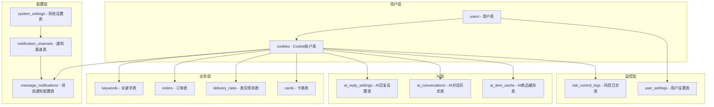
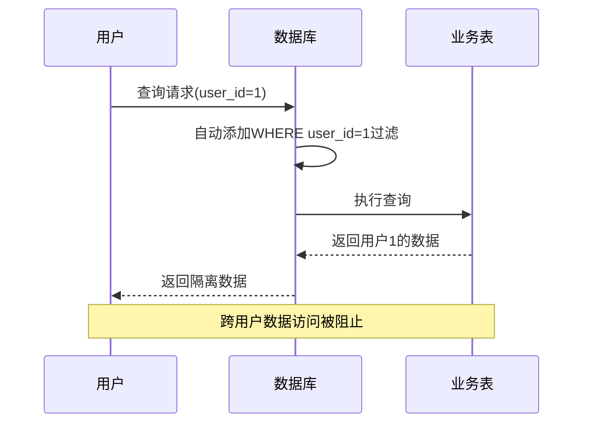
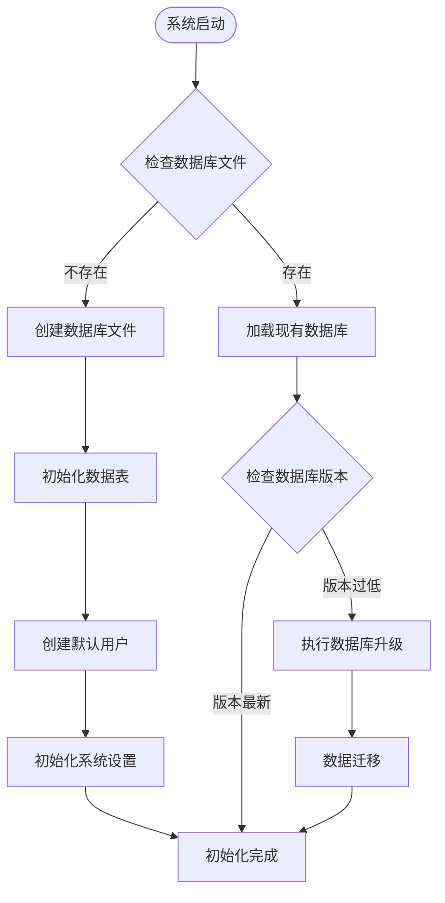
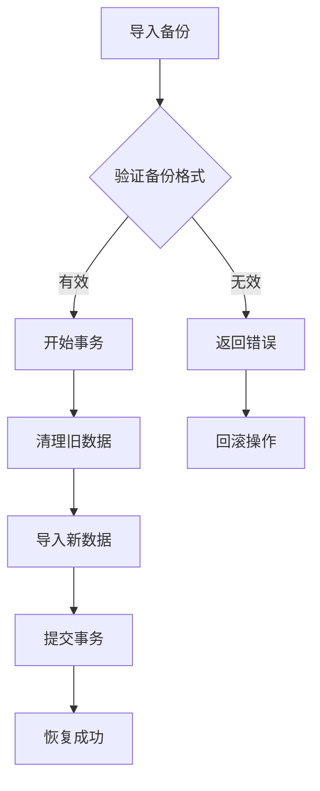

# 数据库设计

<cite>
**本文档引用的文件**
- [db_manager.py](file://db_manager.py)
- [config.py](file://config.py)
- [global_config.yml](file://global_config.yml)
- [Start.py](file://Start.py)
- [reply_server.py](file://reply_server.py)
</cite>

## 目录
1. [简介](#简介)
2. [数据库架构概览](#数据库架构概览)
3. [核心数据表结构](#核心数据表结构)
4. [多用户数据隔离机制](#多用户数据隔离机制)
5. [配置管理](#配置管理)
6. [数据库初始化与迁移](#数据库初始化与迁移)
7. [备份与恢复策略](#备份与恢复策略)
8. [性能优化措施](#性能优化措施)
9. [查询示例与最佳实践](#查询示例与最佳实践)
10. [总结](#总结)

## 简介

本系统采用SQLite作为主要数据库引擎，设计了一个完整的多用户电商平台自动回复系统。数据库设计遵循关系型数据库范式，实现了严格的用户数据隔离，支持复杂的业务逻辑和高效的查询性能。

## 数据库架构概览

系统数据库采用层次化设计，主要包含以下几个层次：



**图表来源**
- [db_manager.py](file://db_manager.py#L67-L447)

## 核心数据表结构

### 用户表 (users)

用户认证和权限管理的核心表，支持多用户系统的基础架构。

| 字段名 | 数据类型 | 约束 | 描述 |
|--------|----------|------|------|
| id | INTEGER | PRIMARY KEY AUTOINCREMENT | 用户唯一标识符 |
| username | TEXT | UNIQUE NOT NULL | 用户名，唯一约束 |
| email | TEXT | UNIQUE NOT NULL | 邮箱地址，唯一约束 |
| password_hash | TEXT | NOT NULL | 密码哈希值 |
| is_active | BOOLEAN | DEFAULT TRUE | 用户是否激活 |
| created_at | TIMESTAMP | DEFAULT CURRENT_TIMESTAMP | 创建时间 |
| updated_at | TIMESTAMP | DEFAULT CURRENT_TIMESTAMP | 更新时间 |

### Cookie账户表 (cookies)

存储用户登录凭证和账户配置信息，是系统的核心数据表之一。

| 字段名 | 数据类型 | 约束 | 描述 |
|--------|----------|------|------|
| id | TEXT | PRIMARY KEY | Cookie唯一标识符 |
| value | TEXT | NOT NULL | Cookie值 |
| user_id | INTEGER | NOT NULL | 关联用户ID，外键约束 |
| auto_confirm | INTEGER | DEFAULT 1 | 自动确认发货设置 |
| remark | TEXT | DEFAULT '' | 备注信息 |
| pause_duration | INTEGER | DEFAULT 10 | 自动回复暂停时间（分钟） |
| username | TEXT | DEFAULT '' | 密码登录用户名 |
| password | TEXT | DEFAULT '' | 密码登录密码 |
| show_browser | INTEGER | DEFAULT 0 | 是否显示浏览器 |
| created_at | TIMESTAMP | DEFAULT CURRENT_TIMESTAMP | 创建时间 |

### 关键字表 (keywords)

实现智能回复的核心表，支持基于商品ID的精确匹配。

| 字段名 | 数据类型 | 约束 | 描述 |
|--------|----------|------|------|
| cookie_id | TEXT | NOT NULL | 关联Cookie ID |
| keyword | TEXT | NOT NULL | 关键词内容 |
| reply | TEXT | NOT NULL | 回复内容 |
| item_id | TEXT | | 商品ID（可选） |
| type | TEXT | DEFAULT 'text' | 关键词类型（text/image） |
| image_url | TEXT | | 图片URL（仅图片关键词） |
| FOREIGN KEY | | | (cookie_id) REFERENCES cookies(id) ON DELETE CASCADE |

### 订单表 (orders)

跟踪交易过程，支持订单状态管理和自动发货。

| 字段名 | 数据类型 | 约束 | 描述 |
|--------|----------|------|------|
| order_id | TEXT | PRIMARY KEY | 订单唯一标识符 |
| item_id | TEXT | | 商品ID |
| buyer_id | TEXT | | 买家ID |
| spec_name | TEXT | | 规格名称 |
| spec_value | TEXT | | 规格值 |
| quantity | TEXT | | 数量 |
| amount | TEXT | | 金额 |
| order_status | TEXT | DEFAULT 'unknown' | 订单状态 |
| cookie_id | TEXT | NOT NULL | 关联Cookie ID |
| created_at | TIMESTAMP | DEFAULT CURRENT_TIMESTAMP | 创建时间 |
| updated_at | TIMESTAMP | DEFAULT CURRENT_TIMESTAMP | 更新时间 |

### 卡券表 (cards)

支持多种类型的自动回复内容，包括文本、API、数据和图片卡券。

| 字段名 | 数据类型 | 约束 | 描述 |
|--------|----------|------|------|
| id | INTEGER | PRIMARY KEY AUTOINCREMENT | 卡券唯一标识符 |
| name | TEXT | NOT NULL | 卡券名称 |
| type | TEXT | NOT NULL CHECK (type IN ('api', 'text', 'data', 'image')) | 卡券类型 |
| api_config | TEXT | | API配置信息 |
| text_content | TEXT | | 文本内容 |
| data_content | TEXT | | 数据内容 |
| image_url | TEXT | | 图片URL |
| description | TEXT | | 卡券描述 |
| enabled | BOOLEAN | DEFAULT TRUE | 是否启用 |
| delay_seconds | INTEGER | DEFAULT 0 | 延时发送秒数 |
| is_multi_spec | BOOLEAN | DEFAULT FALSE | 是否多规格 |
| spec_name | TEXT | | 规格名称 |
| spec_value | TEXT | | 规格值 |
| user_id | INTEGER | NOT NULL DEFAULT 1 | 关联用户ID |
| created_at | TIMESTAMP | DEFAULT CURRENT_TIMESTAMP | 创建时间 |
| updated_at | TIMESTAMP | DEFAULT CURRENT_TIMESTAMP | 更新时间 |

### AI回复配置表 (ai_reply_settings)

管理AI回复功能的各种参数和设置。

| 字段名 | 数据类型 | 约束 | 描述 |
|--------|----------|------|------|
| cookie_id | TEXT | PRIMARY KEY | 关联Cookie ID |
| ai_enabled | BOOLEAN | DEFAULT FALSE | 是否启用AI回复 |
| model_name | TEXT | DEFAULT 'qwen-plus' | AI模型名称 |
| api_key | TEXT | | API密钥 |
| base_url | TEXT | DEFAULT 'https://dashscope.aliyuncs.com/compatible-mode/v1' | API基础URL |
| max_discount_percent | INTEGER | DEFAULT 10 | 最大折扣百分比 |
| max_discount_amount | INTEGER | DEFAULT 100 | 最大折扣金额 |
| max_bargain_rounds | INTEGER | DEFAULT 3 | 最大议价轮次 |
| custom_prompts | TEXT | | 自定义提示词 |
| created_at | TIMESTAMP | DEFAULT CURRENT_TIMESTAMP | 创建时间 |
| updated_at | TIMESTAMP | DEFAULT CURRENT_TIMESTAMP | 更新时间 |

### 通知渠道表 (notification_channels)

支持多种通知渠道的配置管理。

| 字段名 | 数据类型 | 约束 | 描述 |
|--------|----------|------|------|
| id | INTEGER | PRIMARY KEY AUTOINCREMENT | 通知渠道ID |
| name | TEXT | NOT NULL | 渠道名称 |
| user_id | INTEGER | NOT NULL | 关联用户ID |
| type | TEXT | NOT NULL CHECK (type IN ('qq','ding_talk','dingtalk','feishu','lark','bark','email','webhook','wechat','telegram')) | 渠道类型 |
| config | TEXT | NOT NULL | 配置信息（JSON格式） |
| enabled | BOOLEAN | DEFAULT TRUE | 是否启用 |
| created_at | TIMESTAMP | DEFAULT CURRENT_TIMESTAMP | 创建时间 |
| updated_at | TIMESTAMP | DEFAULT CURRENT_TIMESTAMP | 更新时间 |

**章节来源**
- [db_manager.py](file://db_manager.py#L67-L447)

## 多用户数据隔离机制

系统通过user_id字段实现严格的多用户数据隔离，确保不同用户的数据完全独立。

### 隔离原则

1. **强制用户关联**：所有业务表都包含user_id字段
2. **级联删除**：用户删除时自动清理其所有相关数据
3. **查询过滤**：所有查询都自动包含user_id过滤条件
4. **权限边界**：跨用户数据访问被严格禁止

### 隔离实现



**图表来源**
- [db_manager.py](file://db_manager.py#L1225-L1237)
- [db_manager.py](file://db_manager.py#L2210-L2279)

### 数据清理机制

系统提供了完整的用户数据清理功能：

```python
# 删除用户及其所有相关数据
cursor.execute('DELETE FROM user_settings WHERE user_id = ?', (user_id,))
cursor.execute('DELETE FROM cards WHERE user_id = ?', (user_id,))
cursor.execute('DELETE FROM delivery_rules WHERE user_id = ?', (user_id,))
cursor.execute('DELETE FROM notification_channels WHERE user_id = ?', (user_id,))
cursor.execute('DELETE FROM cookies WHERE user_id = ?', (user_id,))
```

**章节来源**
- [db_manager.py](file://db_manager.py#L4319-L4348)

## 配置管理

系统采用双重配置管理模式，平衡了灵活性和安全性。

### 文件配置 (global_config.yml)

存储系统级配置，适合部署时固定不变的设置：

| 配置类别 | 主要配置项 | 描述 |
|----------|------------|------|
| API端点 | API_ENDPOINTS.login_check | 登录检查API地址 |
| 应用配置 | APP_CONFIG.app_key | 应用密钥 |
| 自动回复 | AUTO_REPLY.enabled | 是否启用自动回复 |
| WebSocket | WEBSOCKET_URL | WebSocket连接地址 |
| 日志配置 | LOG_CONFIG.level | 日志级别 |
| 滑块验证 | SLIDER_VERIFICATION.max_concurrent | 最大并发数 |

### 数据库配置 (system_settings)

存储运行时可变的系统设置：

| 键名 | 默认值 | 描述 |
|------|--------|------|
| theme_color | blue | 主题颜色 |
| registration_enabled | true | 是否开启用户注册 |
| smtp_server | 空 | SMTP服务器地址 |
| smtp_port | 587 | SMTP端口 |
| qq_reply_secret_key | xianyu_qq_reply_2024 | QQ回复API密钥 |

### 配置同步机制

系统在启动时会自动同步配置：
- 优先使用数据库配置
- 数据库配置缺失时使用文件配置
- 管理员可通过Web界面修改数据库配置

**章节来源**
- [global_config.yml](file://global_config.yml#L1-L77)
- [config.py](file://config.py#L1-L126)
- [db_manager.py](file://db_manager.py#L425-L438)

## 数据库初始化与迁移

### 初始化流程



**图表来源**
- [db_manager.py](file://db_manager.py#L67-L447)
- [db_manager.py](file://db_manager.py#L441-L447)

### 版本升级机制

系统支持数据库版本自动升级：

| 版本 | 升级内容 |
|------|----------|
| 1.0 | 基础表结构创建 |
| 1.1 | 通知渠道表升级 |
| 1.2 | 支持更多通知渠道类型 |
| 1.3 | 关键词表支持图片类型 |
| 1.4 | 通知渠道类型扩展 |
| 1.5 | Cookie表支持账号登录 |

### 数据迁移策略

1. **向后兼容**：新版本可以读取旧版本数据
2. **渐进式升级**：每次升级只处理特定变更
3. **数据备份**：升级前自动备份重要数据
4. **回滚机制**：升级失败时自动回滚

**章节来源**
- [db_manager.py](file://db_manager.py#L558-L608)
- [db_manager.py](file://db_manager.py#L441-L447)

## 备份与恢复策略

### 备份类型

系统提供两种备份模式：

#### 用户级备份
```python
# 只备份指定用户的数据
backup_data = {
    'version': '1.0',
    'timestamp': time.time(),
    'user_id': user_id,
    'data': {
        'cookies': {...},
        'keywords': {...},
        'orders': {...}
    }
}
```

#### 系统级备份
```python
# 备份所有用户的数据
tables = ['cookies', 'keywords', 'orders', 'cards', 
          'delivery_rules', 'notification_channels']
```

### 恢复机制



**图表来源**
- [db_manager.py](file://db_manager.py#L2210-L2374)

### 备份特性

1. **增量备份**：支持只备份变化的数据
2. **压缩存储**：备份文件自动压缩
3. **完整性检查**：导入前验证数据完整性
4. **用户隔离**：支持选择性恢复特定用户数据

**章节来源**
- [db_manager.py](file://db_manager.py#L2210-L2374)
- [reply_server.py](file://reply_server.py#L5223-L5251)

## 性能优化措施

### 索引设计

系统建立了完善的索引体系：

| 索引名称 | 目标表 | 索引字段 | 用途 |
|----------|--------|----------|------|
| idx_cards_user_id | cards | user_id | 用户数据查询 |
| idx_keywords_unique_no_item | keywords | (cookie_id, keyword) | 通用关键词去重 |
| idx_keywords_unique_with_item | keywords | (cookie_id, keyword, item_id) | 商品关键词去重 |
| idx_anonymous_id | user_stats | anonymous_id | 用户统计查询 |
| idx_last_seen | user_stats | last_seen | 活跃用户筛选 |

### 查询优化策略

1. **连接池管理**：使用线程锁保护数据库连接
2. **批量操作**：支持批量插入和更新
3. **延迟加载**：按需加载非关键数据
4. **缓存机制**：对频繁查询的数据建立内存缓存

### 性能监控

```python
# SQL日志记录
def _log_sql(self, sql: str, params: tuple = None, operation: str = "EXECUTE"):
    """记录SQL执行日志"""
    if not self.sql_log_enabled:
        return
    
    # 格式化参数和SQL
    formatted_sql = ' '.join(sql.split())
    log_message = f"🗄️ SQL {operation}: {formatted_sql}{params_str}"
    
    # 根据配置的日志级别输出
    if self.sql_log_level == 'DEBUG':
        logger.debug(log_message)
    elif self.sql_log_level == 'INFO':
        logger.info(log_message)
```

**章节来源**
- [db_manager.py](file://db_manager.py#L1072-L1084)
- [db_manager.py](file://db_manager.py#L1108-L1141)

## 查询示例与最佳实践

### 常用查询模式

#### 获取用户所有Cookie
```sql
SELECT id, value, created_at 
FROM cookies 
WHERE user_id = ?
```

#### 查询关键词匹配
```sql
SELECT keyword, reply, item_id 
FROM keywords 
WHERE cookie_id = ? 
AND (item_id IS NULL OR item_id = '')
ORDER BY keyword
```

#### 统计用户活动
```sql
SELECT COUNT(*) as order_count, SUM(amount) as total_amount
FROM orders 
WHERE cookie_id IN (SELECT id FROM cookies WHERE user_id = ?)
```

### 最佳实践

1. **始终使用参数化查询**：防止SQL注入攻击
2. **合理使用索引**：避免全表扫描
3. **控制事务范围**：减少锁竞争
4. **定期清理过期数据**：保持数据库性能
5. **监控查询性能**：及时发现性能瓶颈

### 错误处理

```python
try:
    cursor.execute(sql, params)
    result = cursor.fetchall()
    return result
except sqlite3.Error as e:
    logger.error(f"数据库查询失败: {e}")
    return []
```

**章节来源**
- [db_manager.py](file://db_manager.py#L1225-L1237)
- [db_manager.py](file://db_manager.py#L1561-L1570)

## 总结

本数据库设计方案体现了现代Web应用的最佳实践：

### 设计优势

1. **严格的用户隔离**：通过user_id字段实现完全的数据隔离
2. **灵活的配置管理**：文件配置与数据库配置相结合
3. **完善的迁移机制**：支持平滑的版本升级
4. **强大的备份恢复**：提供多种备份策略
5. **优秀的性能表现**：通过索引和缓存优化查询性能

### 技术特色

- **关系型数据库设计**：保证数据一致性和完整性
- **多用户架构**：支持企业级应用需求
- **模块化设计**：便于维护和扩展
- **安全考虑**：内置防护机制和审计功能

### 扩展性

系统设计具有良好的扩展性，可以轻松添加新的业务表和功能模块，同时保持现有功能的稳定性。