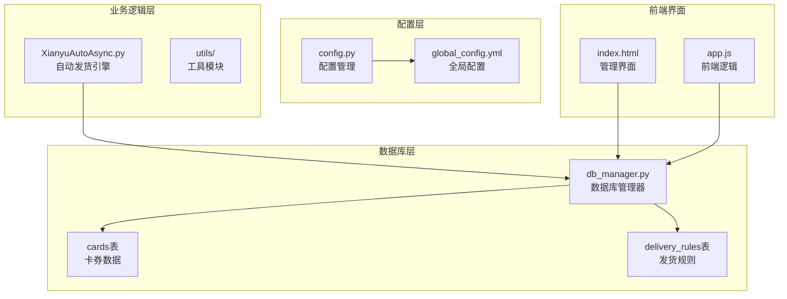
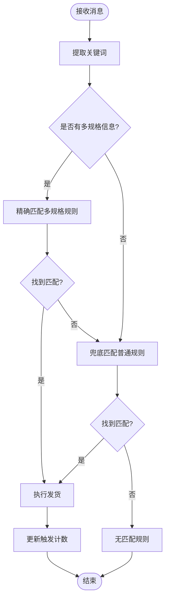
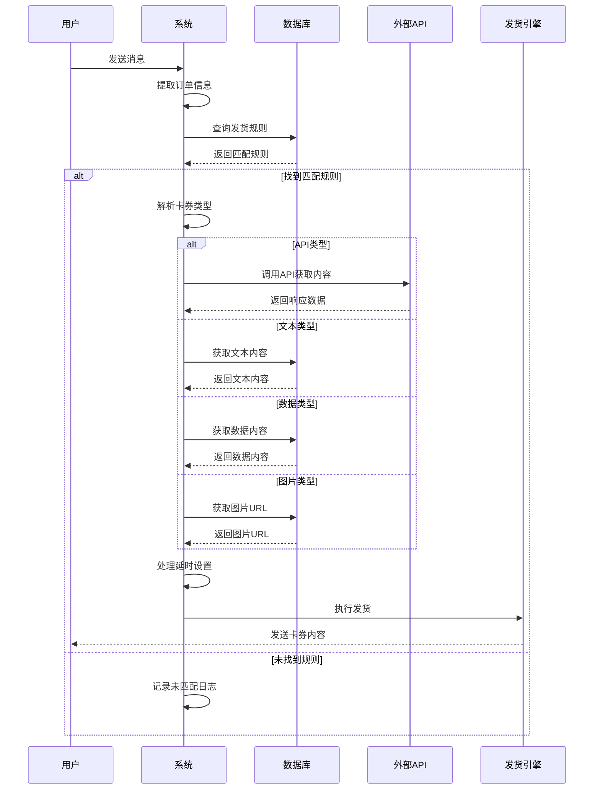
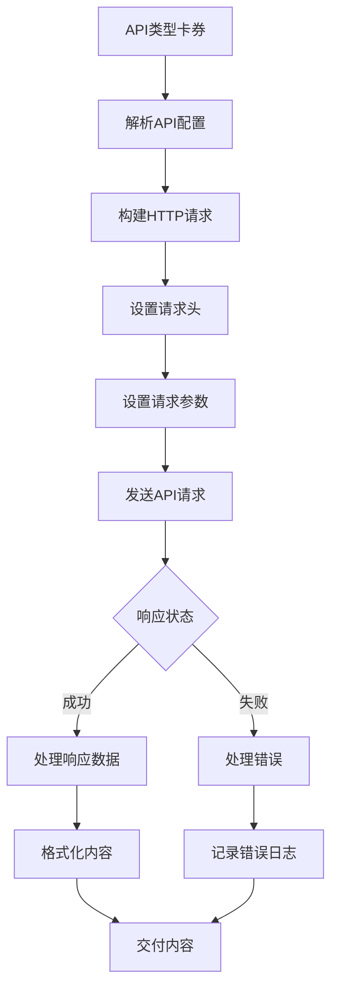
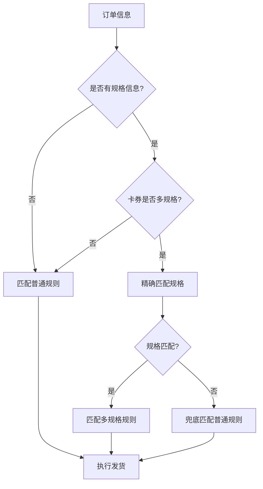
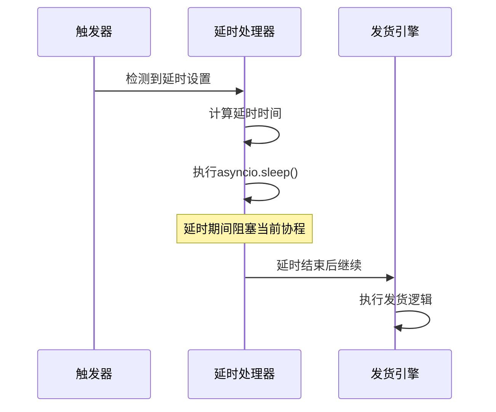
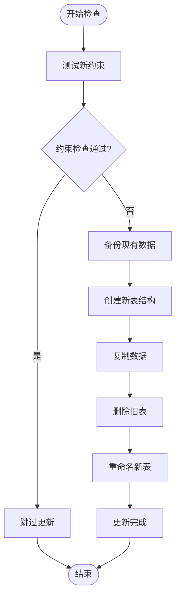

# 发货模型

<cite>
**本文档引用的文件**
- [db_manager.py](file://db_manager.py)
- [config.py](file://config.py)
- [global_config.yml](file://global_config.yml)
- [XianyuAutoAsync.py](file://XianyuAutoAsync.py)
- [static/index.html](file://static/index.html)
- [static/js/app.js](file://static/js/app.js)
</cite>

## 目录
1. [简介](#简介)
2. [项目结构概述](#项目结构概述)
3. [核心数据库表设计](#核心数据库表设计)
4. [cards表详细分析](#cards表详细分析)
5. [delivery_rules表详细分析](#delivery_rules表详细分析)
6. [发货流程架构](#发货流程架构)
7. [API配置与请求处理](#api配置与请求处理)
8. [多规格商品支持](#多规格商品支持)
9. [延时发货机制](#延时发货机制)
10. [数据库迁移与约束更新](#数据库迁移与约束更新)
11. [配置管理](#配置管理)
12. [总结](#总结)

## 简介

本文档详细描述了基于SQLite数据库的发货模型设计与实现。该系统通过两个核心表（cards和delivery_rules）实现了智能的自动发货功能，支持多种类型的卡券内容（API、文本、数据、图片），并具备完善的多规格商品支持和延时发货机制。

## 项目结构概述

发货模型的核心组件分布在以下关键文件中：



**图表来源**
- [db_manager.py](file://db_manager.py#L16-L50)
- [config.py](file://config.py#L1-L50)
- [XianyuAutoAsync.py](file://XianyuAutoAsync.py#L1-L100)

## 核心数据库表设计

系统采用两张核心表来支撑完整的发货功能：

```mermaid
erDiagram
CARDS {
integer id PK
string name
string type CHECK(type IN ('api', 'text', 'data', 'image'))
string api_config
string text_content
string data_content
string image_url
string description
boolean enabled DEFAULT TRUE
integer delay_seconds DEFAULT 0
boolean is_multi_spec DEFAULT FALSE
string spec_name
string spec_value
integer user_id FK
timestamp created_at
timestamp updated_at
}
DELIVERY_RULES {
integer id PK
string keyword
integer card_id FK
integer delivery_count DEFAULT 1
boolean enabled DEFAULT TRUE
string description
integer delivery_times DEFAULT 0
integer user_id FK
timestamp created_at
timestamp updated_at
}
ORDERS {
string order_id PK
string item_id
string buyer_id
string spec_name
string spec_value
string quantity
string amount
string order_status
string cookie_id FK
timestamp created_at
timestamp updated_at
}
CARDS ||--o{ DELIVERY_RULES : "references"
DELIVERY_RULES ||--o{ ORDERS : "triggers"
```

**图表来源**
- [db_manager.py](file://db_manager.py#L197-L306)

**章节来源**
- [db_manager.py](file://db_manager.py#L197-L306)

## cards表详细分析

### 字段结构与用途

cards表是发货系统的核心数据容器，包含以下关键字段：

| 字段名 | 数据类型 | 约束 | 默认值 | 用途说明 |
|--------|----------|------|--------|----------|
| id | INTEGER | PRIMARY KEY AUTOINCREMENT | - | 自增主键，唯一标识每张卡券 |
| name | TEXT | NOT NULL | - | 卡券名称，用于识别和分类 |
| type | TEXT | NOT NULL CHECK | - | 卡券类型，支持四种类型之一 |
| api_config | TEXT | - | - | API类型卡券的配置信息（JSON格式） |
| text_content | TEXT | - | - | 文本类型卡券的内容 |
| data_content | TEXT | - | - | 数据类型卡券的内容 |
| image_url | TEXT | - | - | 图片类型卡券的URL地址 |
| description | TEXT | - | - | 卡券描述信息 |
| enabled | BOOLEAN | DEFAULT TRUE | TRUE | 卡券是否启用 |
| delay_seconds | INTEGER | DEFAULT 0 | 0 | 延时发货秒数 |
| is_multi_spec | BOOLEAN | DEFAULT FALSE | FALSE | 是否支持多规格 |
| spec_name | TEXT | - | - | 规格名称（如套餐类型、颜色） |
| spec_value | TEXT | - | - | 规格值（如30天、红色） |
| user_id | INTEGER | NOT NULL DEFAULT 1 | 1 | 用户ID，支持多用户隔离 |
| created_at | TIMESTAMP | DEFAULT CURRENT_TIMESTAMP | - | 创建时间戳 |
| updated_at | TIMESTAMP | DEFAULT CURRENT_TIMESTAMP | - | 更新时间戳 |

### type字段的四种类型支持

type字段定义了卡券的四种基本类型，每种类型对应不同的内容承载方式：

#### 1. 'api'类型 - 动态API调用
- **用途**: 通过HTTP API动态获取发货内容
- **配置字段**: api_config包含URL、方法、超时、请求头和参数
- **应用场景**: 实时数据获取、第三方服务集成
- **特点**: 支持复杂的请求配置，可处理各种API响应格式

#### 2. 'text'类型 - 静态文本内容
- **用途**: 存储固定的文本消息内容
- **配置字段**: text_content直接存储文本内容
- **应用场景**: 简单的文字回复、固定模板消息
- **特点**: 性能最优，适合高频使用场景

#### 3. 'data'类型 - 结构化数据内容
- **用途**: 存储结构化的数据内容
- **配置字段**: data_content存储序列化的数据
- **应用场景**: 商品信息、优惠券数据、JSON格式内容
- **特点**: 支持复杂的数据结构，便于程序解析

#### 4. 'image'类型 - 图片内容
- **用途**: 存储图片URL或图片相关内容
- **配置字段**: image_url存储图片资源地址
- **应用场景**: 商品图片、二维码、促销海报
- **特点**: 支持外部图片资源，提升用户体验

**章节来源**
- [db_manager.py](file://db_manager.py#L197-L216)
- [db_manager.py](file://db_manager.py#L488-L562)

## delivery_rules表详细分析

### 关键字段与关联关系

delivery_rules表通过keyword与cards表建立关联，实现智能的关键词触发发货机制：

| 字段名 | 数据类型 | 约束 | 默认值 | 用途说明 |
|--------|----------|------|--------|----------|
| id | INTEGER | PRIMARY KEY AUTOINCREMENT | - | 自增主键 |
| keyword | TEXT | NOT NULL | - | 触发关键词，支持模糊匹配 |
| card_id | INTEGER | NOT NULL | - | 关联的卡券ID |
| delivery_count | INTEGER | DEFAULT 1 | 1 | 发货数量 |
| enabled | BOOLEAN | DEFAULT TRUE | TRUE | 规则是否启用 |
| description | TEXT | - | - | 规则描述信息 |
| delivery_times | INTEGER | DEFAULT 0 | 0 | 已触发次数统计 |
| user_id | INTEGER | - | - | 用户ID，支持多用户隔离 |
| created_at | TIMESTAMP | DEFAULT CURRENT_TIMESTAMP | - | 创建时间 |
| updated_at | TIMESTAMP | DEFAULT CURRENT_TIMESTAMP | - | 更新时间 |

### 关键词匹配算法

系统采用智能的关键词匹配算法，支持多层次的匹配策略：



**图表来源**
- [db_manager.py](file://db_manager.py#L3367-L3445)
- [XianyuAutoAsync.py](file://XianyuAutoAsync.py#L4578-L4603)

### delivery_count字段的作用

delivery_count字段控制每次触发规则时的发货数量：

- **单数量模式**: delivery_count=1，每次触发发送一张卡券
- **多数量模式**: delivery_count>1，每次触发发送多张卡券
- **动态计算**: 可根据订单数量或其他业务逻辑动态调整

**章节来源**
- [db_manager.py](file://db_manager.py#L294-L306)
- [db_manager.py](file://db_manager.py#L3137-L3445)

## 发货流程架构

### 整体发货流程



**图表来源**
- [XianyuAutoAsync.py](file://XianyuAutoAsync.py#L1100-L1271)
- [db_manager.py](file://db_manager.py#L3188-L3445)

### 多规格匹配优先级

系统按照以下优先级顺序进行规则匹配：

1. **精确匹配**: 卡券名称 + 规格名称 + 规格值
2. **名称匹配**: 仅卡券名称匹配
3. **兜底匹配**: 通用规则匹配

**章节来源**
- [XianyuAutoAsync.py](file://XianyuAutoAsync.py#L4578-L4603)
- [db_manager.py](file://db_manager.py#L3367-L3445)

## API配置与请求处理

### API配置结构

API类型卡券的api_config字段采用JSON格式存储完整的API配置：

```json
{
  "url": "https://api.example.com/delivery",
  "method": "POST",
  "timeout": 10,
  "headers": {
    "Authorization": "Bearer token",
    "Content-Type": "application/json"
  },
  "params": {
    "order_id": "{{order_id}}",
    "buyer_id": "{{buyer_id}}"
  }
}
```

### 请求处理流程



**图表来源**
- [static/js/app.js](file://static/js/app.js#L4081-L4122)
- [XianyuAutoAsync.py](file://XianyuAutoAsync.py#L4639-L4662)

### 配置验证机制

系统提供了完整的配置验证机制：

- **JSON格式验证**: 确保api_config字段的JSON格式正确
- **必需字段检查**: 验证URL、方法等必需配置项
- **请求头格式验证**: 确保请求头格式符合JSON规范
- **参数格式验证**: 验证请求参数的JSON格式

**章节来源**
- [static/js/app.js](file://static/js/app.js#L4081-L4122)
- [global_config.yml](file://global_config.yml#L1-L77)

## 多规格商品支持

### is_multi_spec字段机制

is_multi_spec字段控制卡券是否支持多规格：

- **FALSE**: 单规格卡券，适用于普通商品
- **TRUE**: 多规格卡券，适用于有多种规格的商品

### 规格匹配逻辑



**图表来源**
- [db_manager.py](file://db_manager.py#L3367-L3445)
- [XianyuAutoAsync.py](file://XianyuAutoAsync.py#L4578-L4603)

### 多规格字段组合

多规格卡券需要同时满足以下条件才能被匹配：

- 卡券的is_multi_spec=true
- 规格名称和规格值都存在
- 规格名称和规格值完全匹配

**章节来源**
- [db_manager.py](file://db_manager.py#L3367-L3445)
- [static/index.html](file://static/index.html#L2698-L2720)

## 延时发货机制

### delay_seconds字段应用

delay_seconds字段控制发货的延时时间，单位为秒：

- **0秒**: 立即发货（默认）
- **正整数**: 延时指定秒数后发货
- **负数**: 不允许（会被强制设为0）

### 延时执行流程



**图表来源**
- [XianyuAutoAsync.py](file://XianyuAutoAsync.py#L4639-L4647)

### 延时发货的应用场景

- **批量处理**: 避免短时间内大量发货导致系统压力
- **质量控制**: 给予人工审核的时间窗口
- **库存同步**: 确保库存数据是最新的
- **用户体验**: 提供更好的响应时间

**章节来源**
- [XianyuAutoAsync.py](file://XianyuAutoAsync.py#L4639-L4647)
- [db_manager.py](file://db_manager.py#L3367-L3445)

## 数据库迁移与约束更新

### _update_cards_table_constraints()方法

系统提供了完整的数据库约束更新机制，确保向后兼容性：



**图表来源**
- [db_manager.py](file://db_manager.py#L488-L562)

### 约束更新策略

1. **测试阶段**: 先尝试插入测试记录验证约束
2. **重建策略**: 如果约束不兼容，则重建整个表结构
3. **数据迁移**: 完整复制现有数据到新表
4. **原子操作**: 确保更新过程的原子性

**章节来源**
- [db_manager.py](file://db_manager.py#L488-L562)

## 配置管理

### API端点配置

系统通过global_config.yml管理API端点配置：

| 配置项 | 类型 | 默认值 | 说明 |
|--------|------|--------|------|
| API_ENDPOINTS.login_check | URL | - | 登录状态检查API |
| API_ENDPOINTS.message_headinfo | URL | - | 消息头部信息API |
| API_ENDPOINTS.token | URL | - | 令牌获取API |
| DEFAULT_HEADERS | Object | - | 默认请求头配置 |
| WEBSOCKET_HEADERS | Object | - | WebSocket请求头配置 |

### 请求头管理

系统维护了多套请求头配置：

- **DEFAULT_HEADERS**: 通用HTTP请求头
- **WEBSOCKET_HEADERS**: WebSocket连接专用头
- **自定义配置**: 支持用户自定义的特殊需求

**章节来源**
- [config.py](file://config.py#L1-L126)
- [global_config.yml](file://global_config.yml#L1-L77)

## 总结

该发货模型通过精心设计的数据库结构和智能的匹配算法，实现了高效、灵活的自动发货功能。主要特点包括：

1. **多样化的内容支持**: 支持API、文本、数据、图片四种类型的卡券内容
2. **智能的规则匹配**: 基于关键词的多层次匹配算法
3. **完善的多规格支持**: 支持商品规格的精细化管理
4. **灵活的延时机制**: 支持自定义的发货延时设置
5. **强大的扩展能力**: 通过配置系统支持各种外部API集成
6. **可靠的数据库管理**: 完善的约束管理和数据迁移机制

该系统为电商平台提供了完整的自动发货解决方案，能够有效提升运营效率和服务质量。