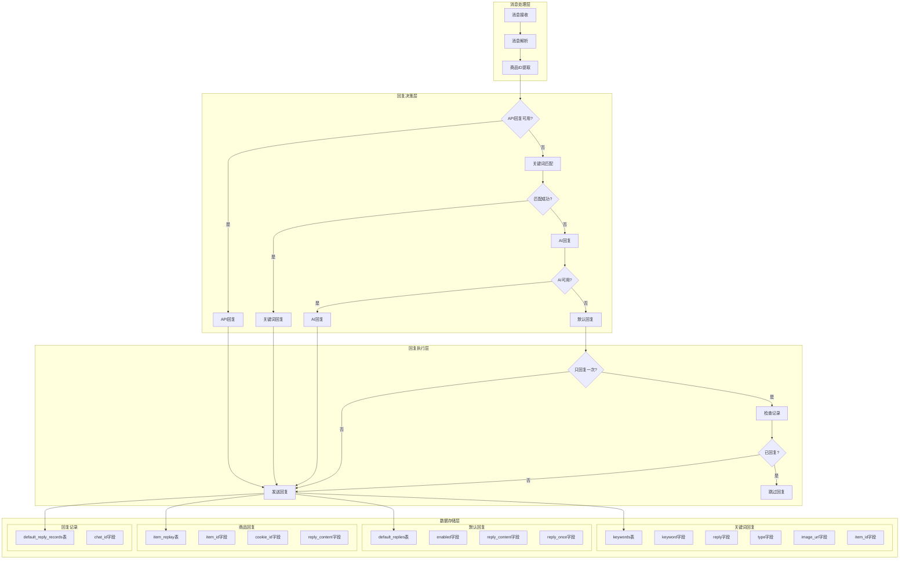
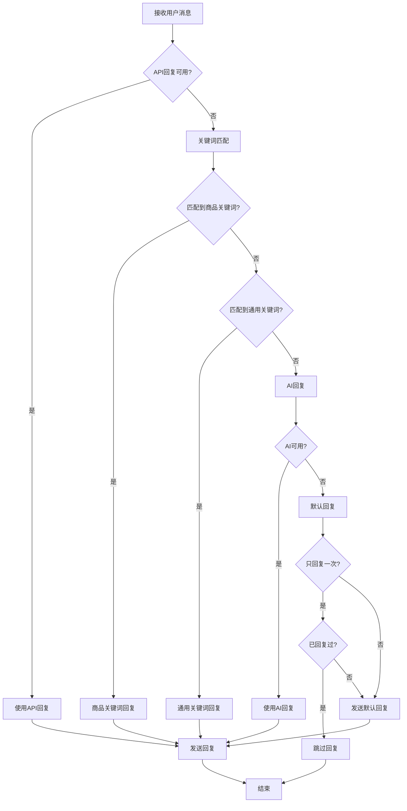
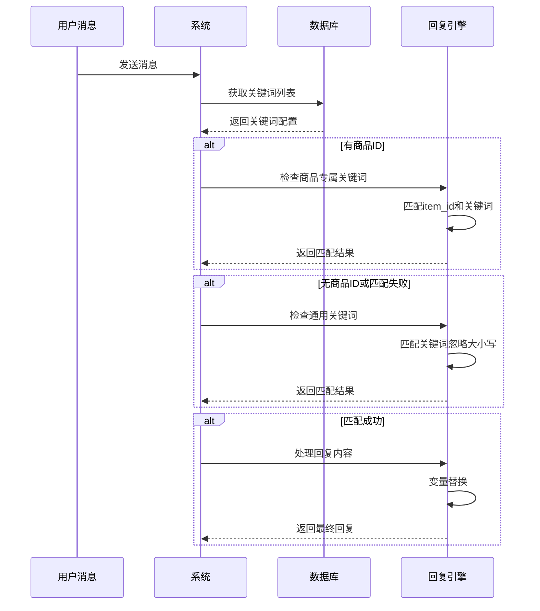
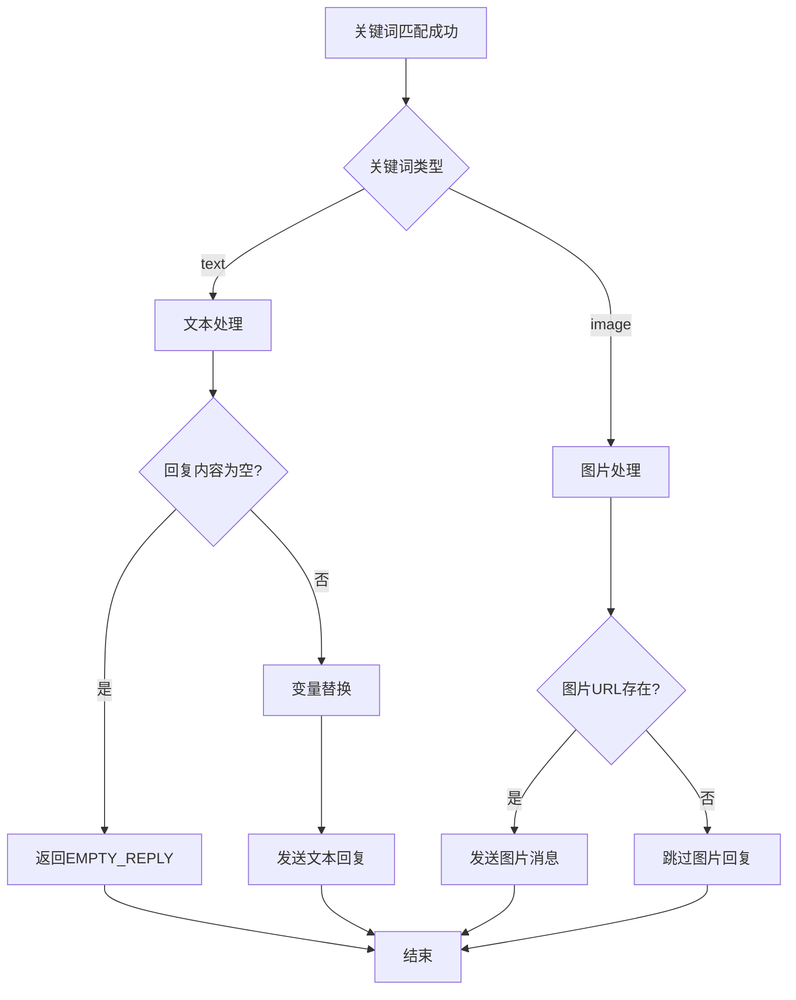
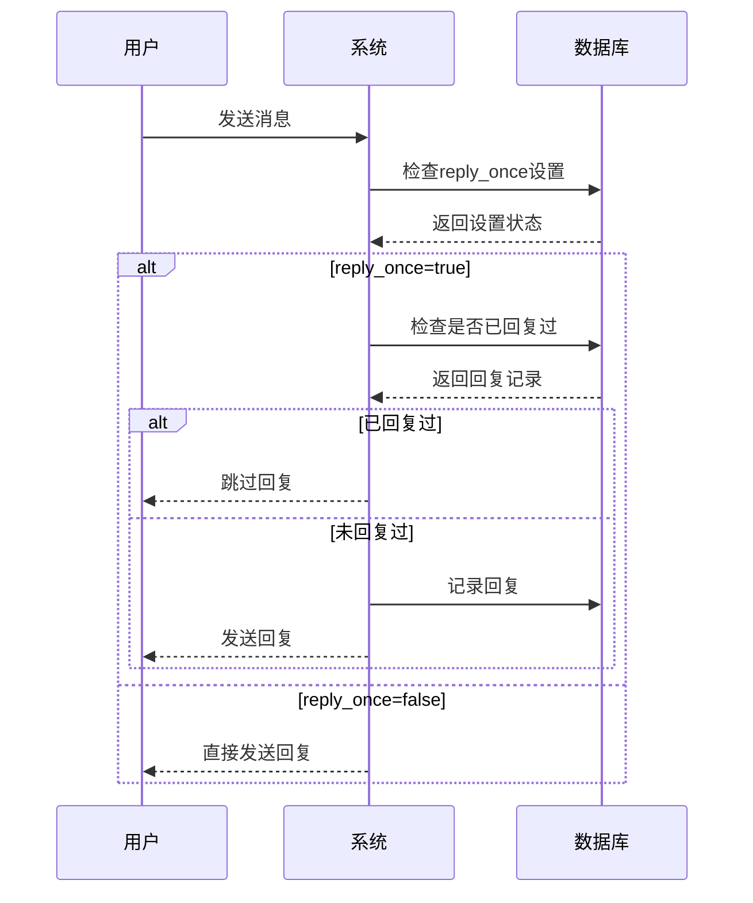
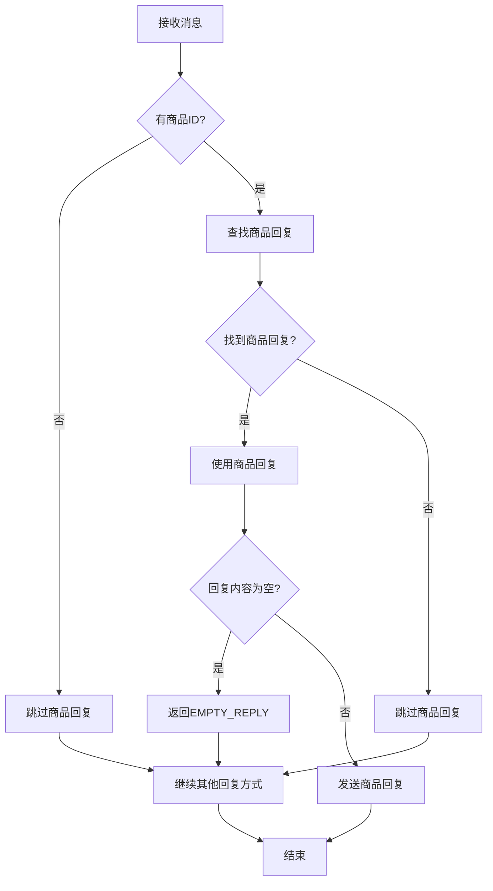
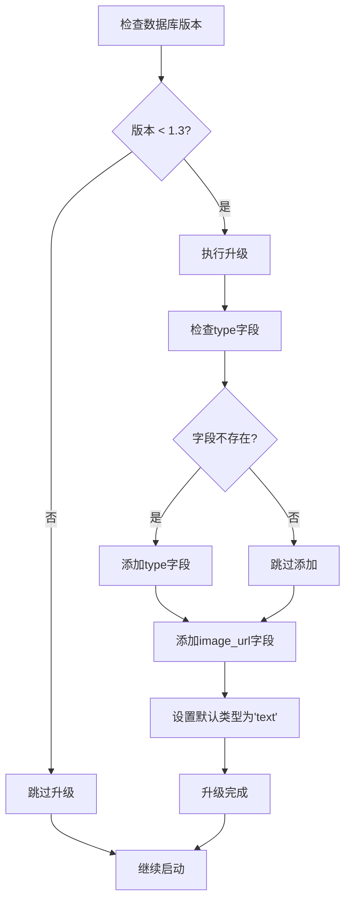

# 回复模型

<cite>
**本文档引用的文件**
- [db_manager.py](file://db_manager.py)
- [config.py](file://config.py)
- [ai_reply_engine.py](file://ai_reply_engine.py)
- [XianyuAutoAsync.py](file://XianyuAutoAsync.py)
- [reply_server.py](file://reply_server.py)
- [global_config.yml](file://global_config.yml)
</cite>

## 目录
1. [简介](#简介)
2. [系统架构概览](#系统架构概览)
3. [核心数据表设计](#核心数据表设计)
4. [回复优先级机制](#回复优先级机制)
5. [关键词回复系统](#关键词回复系统)
6. [默认回复系统](#默认回复系统)
7. [商品定制回复系统](#商品定制回复系统)
8. [配置管理](#配置管理)
9. [数据库迁移机制](#数据库迁移机制)
10. [实际应用场景](#实际应用场景)

## 简介

闲鱼自动回复系统采用三层回复机制，通过keywords、default_replies和item_replay三个核心数据表实现灵活的自动回复功能。系统支持文本和图片两种回复类型，具备全局默认回复、商品专属回复和关键词匹配回复等多种回复策略，能够满足不同场景下的自动化沟通需求。

## 系统架构概览



**图表来源**
- [XianyuAutoAsync.py](file://XianyuAutoAsync.py#L7080-L7180)
- [db_manager.py](file://db_manager.py#L128-L341)

## 核心数据表设计

### keywords表设计

keywords表是系统的核心回复配置表，支持多种回复类型和商品级别的回复控制。

| 字段名 | 数据类型 | 约束 | 默认值 | 说明 |
|--------|----------|------|--------|------|
| cookie_id | TEXT | 外键 | - | 关联的账号ID，用于区分不同账号的回复配置 |
| keyword | TEXT | - | - | 关键词内容，用于匹配用户消息 |
| reply | TEXT | - | - | 关键词匹配成功后的回复内容 |
| item_id | TEXT | - | NULL | 商品ID，NULL表示通用关键词，非NULL表示商品专属关键词 |
| type | TEXT | - | 'text' | 回复类型，支持'text'（文本）和'image'（图片） |
| image_url | TEXT | - | NULL | 图片URL，仅当type为'image'时有效 |

**节来源**
- [db_manager.py](file://db_manager.py#L128-L137)

#### type字段详解

- **'text'类型**：支持标准文本回复，可以包含变量替换（如`{send_user_name}`）
- **'image'类型**：支持图片回复，需要配合image_url字段使用

#### image_url字段支持

系统通过image_url字段支持图片回复功能，当关键词类型为'image'时，系统会发送对应的图片消息。

### default_replies表设计

default_replies表实现全局默认回复功能，支持账号级别的回复配置。

| 字段名 | 数据类型 | 约束 | 默认值 | 说明 |
|--------|----------|------|--------|------|
| cookie_id | TEXT | 主键，外键 | - | 关联的账号ID |
| enabled | BOOLEAN | - | FALSE | 是否启用默认回复 |
| reply_content | TEXT | - | - | 默认回复内容，支持变量替换 |
| reply_once | BOOLEAN | - | FALSE | 是否只回复一次（避免重复回复同一对话） |
| created_at | TIMESTAMP | - | CURRENT_TIMESTAMP | 记录创建时间 |
| updated_at | TIMESTAMP | - | CURRENT_TIMESTAMP | 记录更新时间 |

**节来源**
- [db_manager.py](file://db_manager.py#L310-L319)

#### reply_once字段应用

- **一次性回复场景**：当设置为TRUE时，系统会记录已回复的chat_id，避免对同一对话重复回复
- **记录管理**：通过default_reply_records表维护回复记录

### item_replay表设计

item_replay表实现针对特定商品的定制化回复功能。

| 字段名 | 数据类型 | 约束 | 默认值 | 说明 |
|--------|----------|------|--------|------|
| id | INTEGER | 主键，自增 | - | 记录唯一标识 |
| item_id | TEXT | - | NOT NULL | 商品ID，建立商品与回复的关联 |
| cookie_id | TEXT | - | NOT NULL | 关联的账号ID |
| reply_content | TEXT | - | NOT NULL | 商品专属回复内容 |
| created_at | TIMESTAMP | - | CURRENT_TIMESTAMP | 记录创建时间 |
| updated_at | TIMESTAMP | - | CURRENT_TIMESTAMP | 记录更新时间 |

**节来源**
- [db_manager.py](file://db_manager.py#L332-L340)

## 回复优先级机制

系统采用三层回复优先级机制，按照以下顺序进行回复匹配：



**图表来源**
- [XianyuAutoAsync.py](file://XianyuAutoAsync.py#L7115-L7137)

### 优先级说明

1. **API回复**：最高优先级，适用于外部API集成场景
2. **关键词回复**：支持商品级别和通用级别的关键词匹配
3. **AI回复**：基于商品信息和对话历史的智能回复
4. **默认回复**：兜底回复，当其他方式都不可用时使用

**节来源**
- [XianyuAutoAsync.py](file://XianyuAutoAsync.py#L7115-L7137)

## 关键词回复系统

### 关键词匹配逻辑

系统通过精确匹配算法实现关键词回复功能：



**图表来源**
- [XianyuAutoAsync.py](file://XianyuAutoAsync.py#L3169-L3250)

### 图片关键词支持

系统支持图片关键词回复，通过type字段区分回复类型：

- **文本关键词**：type='text'，发送普通文本回复
- **图片关键词**：type='image'，发送图片消息，需要image_url字段

**节来源**
- [XianyuAutoAsync.py](file://XianyuAutoAsync.py#L3194-L3200)

### 关键词类型处理



**图表来源**
- [XianyuAutoAsync.py](file://XianyuAutoAsync.py#L3194-L3250)

## 默认回复系统

### 默认回复配置

默认回复系统提供全局性的回复策略，当没有匹配到其他回复方式时使用。

#### 配置选项

- **enabled**：控制默认回复是否启用
- **reply_content**：默认回复内容，支持变量替换
- **reply_once**：控制是否只回复一次

#### 变量替换支持

默认回复内容支持以下变量：

| 变量名 | 说明 | 示例值 |
|--------|------|--------|
| {send_user_name} | 用户昵称 | "张三" |
| {send_user_id} | 用户ID | "123456" |
| {send_message} | 用户消息 | "你好，我想问..." |

**节来源**
- [XianyuAutoAsync.py](file://XianyuAutoAsync.py#L3144-L3163)

### 只回复一次机制

系统提供"只回复一次"功能，防止对同一对话重复回复：



**图表来源**
- [XianyuAutoAsync.py](file://XianyuAutoAsync.py#L3127-L3136)

**节来源**
- [db_manager.py](file://db_manager.py#L1935-L1972)

## 商品定制回复系统

### 商品回复优先级

商品定制回复具有最高优先级，当用户购买特定商品时，系统会优先使用该商品的专属回复。

#### 商品回复流程



**图表来源**
- [XianyuAutoAsync.py](file://XianyuAutoAsync.py#L3141-L3152)

### 商品回复管理

系统提供完整的商品回复管理功能：

- **创建商品回复**：为特定商品设置专属回复内容
- **更新商品回复**：修改现有商品的回复内容
- **删除商品回复**：移除不需要的商品回复配置
- **批量管理**：支持批量操作多个商品的回复

**节来源**
- [db_manager.py](file://db_manager.py#L4635-L4787)

## 配置管理

### AUTO_REPLY配置

系统通过config.py中的AUTO_REPLY配置控制自动回复的整体行为：

```python
AUTO_REPLY = {
    'enabled': True,                    # 全局自动回复开关
    'default_message': '...',           # 默认消息模板
    'api': {
        'enabled': False,               # API回复开关
        'url': 'http://localhost:8080/xianyu/reply',
        'timeout': 10                   # API超时时间
    }
}
```

**节来源**
- [config.py](file://config.py#L108-L116)

### 配置生效机制

系统在消息处理过程中检查AUTO_REPLY配置：

- **enabled=False**：完全禁用自动回复功能
- **API配置**：当API可用时优先使用API回复
- **默认消息**：作为最后的兜底回复内容

**节来源**
- [XianyuAutoAsync.py](file://XianyuAutoAsync.py#L7086-L7111)

## 数据库迁移机制

### keywords表升级

系统通过upgrade_keywords_table_for_image_support方法实现关键词表的图片支持升级：



**图表来源**
- [db_manager.py](file://db_manager.py#L4608-L4635)

### 迁移过程详解

1. **字段添加**：为keywords表添加type和image_url字段
2. **数据迁移**：为现有记录设置默认的'text'类型
3. **约束更新**：更新表结构以支持新的功能特性

**节来源**
- [db_manager.py](file://db_manager.py#L4608-L4635)

## 实际应用场景

### 场景一：商品专属回复

商家可以为不同商品设置专属回复，提升用户体验：

- **手机商品**：回复"这款手机很受欢迎，支持7天无理由退换哦！"
- **服装商品**：回复"这件衣服质量很好，支持免费修改尺寸"

### 场景二：关键词触发回复

通过关键词设置自动化回复：

- **关键词**："价格"，**回复**："这款商品目前有优惠活动，具体价格请咨询哦！"
- **关键词**："发货"，**回复**："我们支持当日发货，一般1-3天到达"

### 场景三：只回复一次设置

防止机器人对同一用户重复发送相同消息：

- **启用场景**：首次咨询回复后，不再重复发送欢迎消息
- **效果**：提升用户体验，避免信息轰炸

### 场景四：图片回复

利用图片提高沟通效率：

- **商品展示**：发送商品高清图片
- **使用说明**：发送使用步骤图解
- **促销信息**：发送优惠券或促销海报

**节来源**
- [XianyuAutoAsync.py](file://XianyuAutoAsync.py#L3194-L3250)

## 总结

闲鱼自动回复系统通过keywords、default_replies和item_replay三个核心表，构建了灵活而强大的回复机制。系统支持多种回复类型，具备完善的优先级控制和配置管理功能，能够满足不同场景下的自动化沟通需求。通过合理的数据库设计和清晰的业务逻辑，系统实现了高效、稳定的自动回复功能。