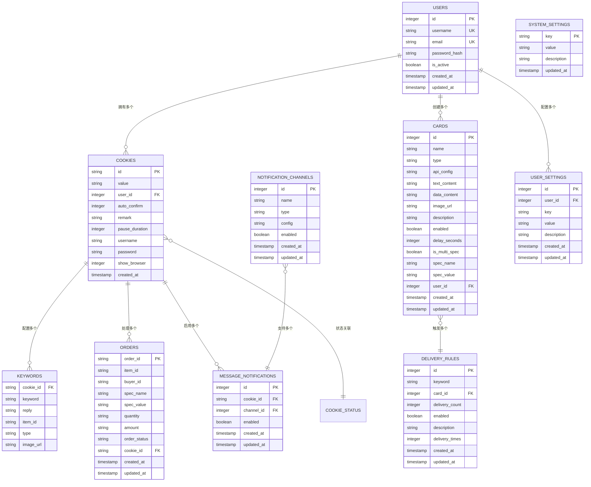
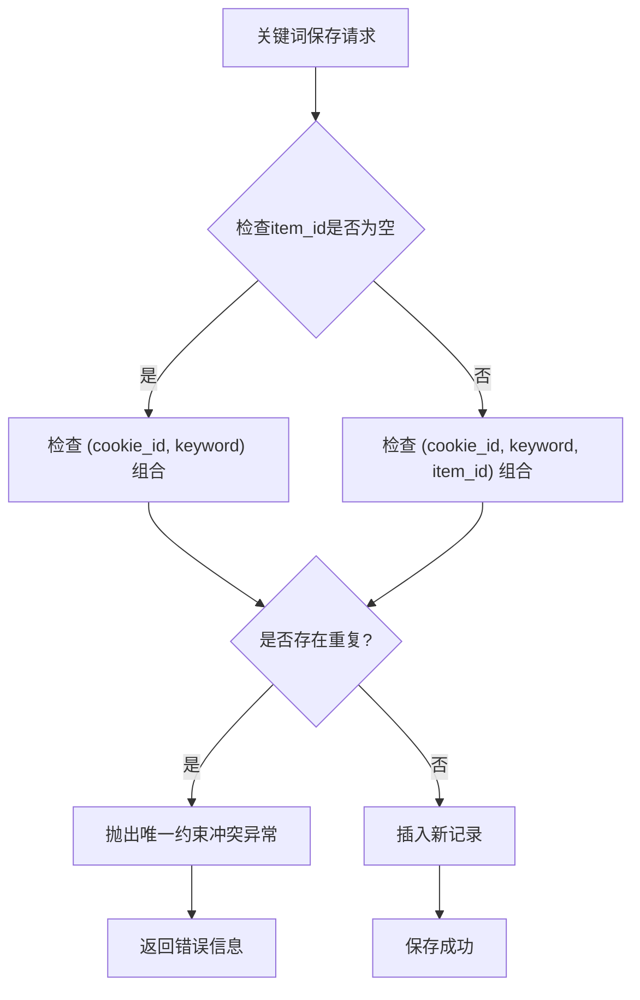
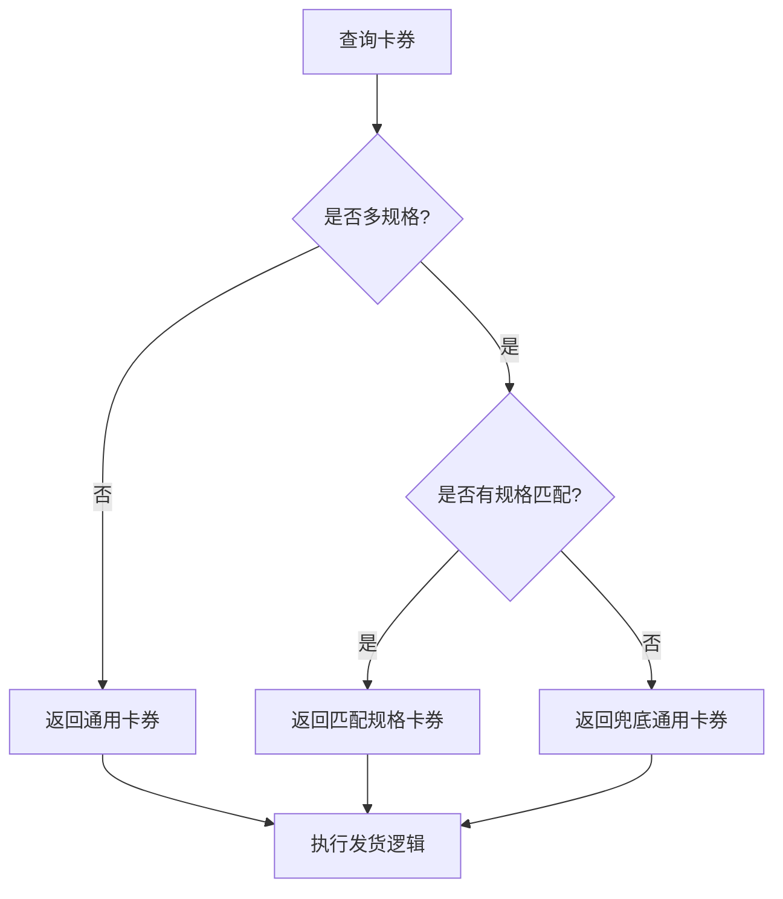
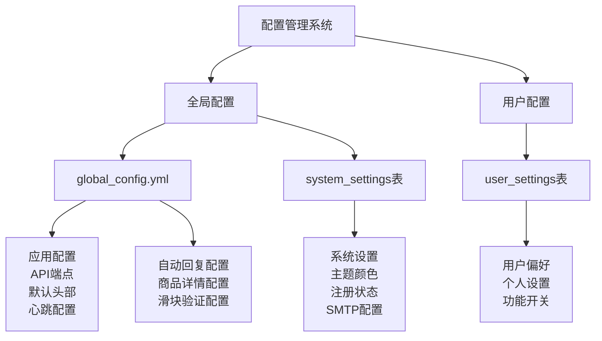
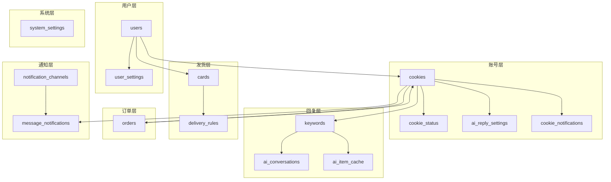
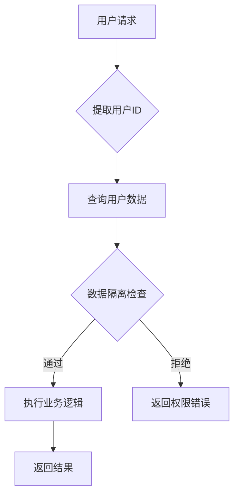
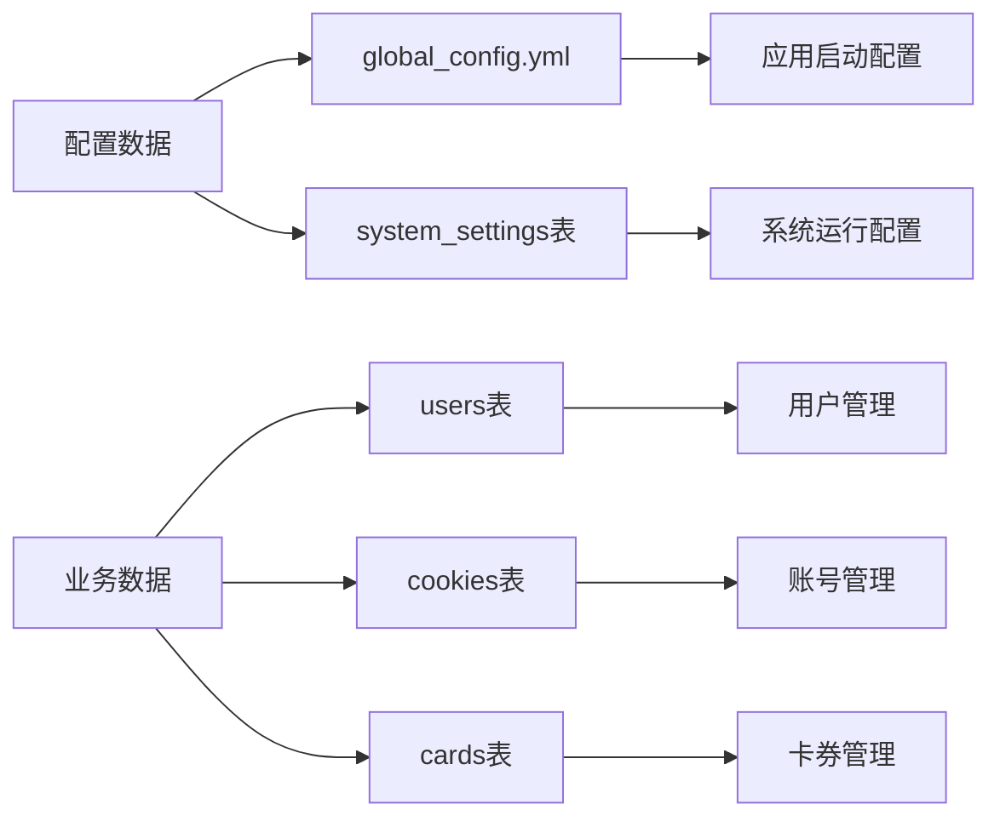
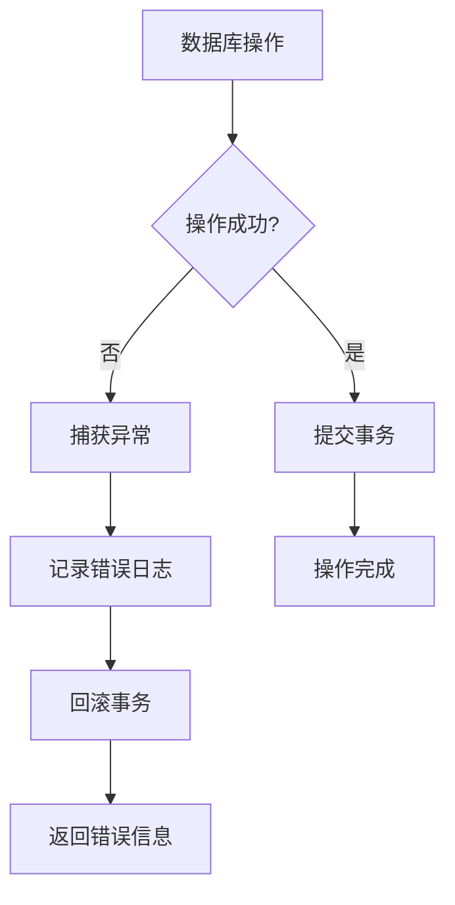

# 数据模型定义

<cite>
**本文档引用的文件**
- [db_manager.py](file://db_manager.py)
- [config.py](file://config.py)
- [global_config.yml](file://global_config.yml)
- [XianyuAutoAsync.py](file://XianyuAutoAsync.py)
- [reply_server.py](file://reply_server.py)
</cite>

## 目录
1. [概述](#概述)
2. [核心实体架构](#核心实体架构)
3. [用户管理实体](#用户管理实体)
4. [闲鱼账号管理实体](#闲鱼账号管理实体)
5. [关键词回复规则实体](#关键词回复规则实体)
6. [自动发货卡券实体](#自动发货卡券实体)
7. [订单管理实体](#订单管理实体)
8. [通知渠道实体](#通知渠道实体)
9. [配置管理系统](#配置管理系统)
10. [数据模型关系图](#数据模型关系图)
11. [设计模式与最佳实践](#设计模式与最佳实践)
12. [总结](#总结)

## 概述

本系统采用SQLite数据库作为持久化存储方案，设计了一套完整的数据模型来支持闲鱼自动回复系统的各项功能。数据模型围绕用户、闲鱼账号、关键词回复、自动发货等核心业务场景构建，实现了多用户隔离、灵活的配置管理以及强大的扩展能力。

系统数据模型具有以下特点：
- **模块化设计**：每个核心功能对应独立的实体表
- **用户隔离**：通过user_id字段实现多租户架构
- **灵活配置**：支持全局配置和用户特定配置
- **强一致性**：利用SQLite的事务机制保证数据完整性
- **可扩展性**：预留扩展字段和软删除机制

## 核心实体架构

系统的核心实体遵循领域驱动设计原则，每个实体都有明确的业务职责和边界：



**图表来源**
- [db_manager.py](file://db_manager.py#L74-L439)

## 用户管理实体

### users表设计

users表是系统的核心实体之一，负责管理平台用户的基本信息和认证数据。

| 字段名 | 类型 | 约束 | 说明 |
|--------|------|------|------|
| id | INTEGER | PRIMARY KEY AUTOINCREMENT | 用户唯一标识符 |
| username | TEXT | UNIQUE NOT NULL | 用户名，唯一约束 |
| email | TEXT | UNIQUE NOT NULL | 邮箱地址，唯一约束 |
| password_hash | TEXT | NOT NULL | 密码哈希值 |
| is_active | BOOLEAN | DEFAULT TRUE | 用户账户状态 |
| created_at | TIMESTAMP | DEFAULT CURRENT_TIMESTAMP | 创建时间 |
| updated_at | TIMESTAMP | DEFAULT CURRENT_TIMESTAMP | 更新时间 |

**业务用途**：
- 支持多用户隔离，每个用户可以管理自己的闲鱼账号
- 提供基础的身份认证和授权机制
- 支持用户状态管理（激活/禁用）

**节来源**
- [db_manager.py](file://db_manager.py#L74-L83)

### user_settings表设计

user_settings表提供了灵活的用户配置管理机制。

| 字段名 | 类型 | 约束 | 说明 |
|--------|------|------|------|
| id | INTEGER | PRIMARY KEY AUTOINCREMENT | 设置记录唯一标识 |
| user_id | INTEGER | NOT NULL, FK | 关联的用户ID |
| key | TEXT | NOT NULL | 设置键名 |
| value | TEXT | NOT NULL | 设置值 |
| description | TEXT | NULLABLE | 设置描述 |
| created_at | TIMESTAMP | DEFAULT CURRENT_TIMESTAMP | 创建时间 |
| updated_at | TIMESTAMP | DEFAULT CURRENT_TIMESTAMP | 更新时间 |

**业务用途**：
- 存储用户特定的个性化配置
- 支持动态配置管理，无需修改代码
- 提供配置的版本控制和审计功能

**节来源**
- [db_manager.py](file://db_manager.py#L394-L406)

## 闲鱼账号管理实体

### cookies表设计

cookies表是系统的核心实体，用于存储和管理闲鱼账号的相关信息。

| 字段名 | 类型 | 约束 | 说明 |
|--------|------|------|------|
| id | TEXT | PRIMARY KEY | Cookie唯一标识符 |
| value | TEXT | NOT NULL | Cookie值 |
| user_id | INTEGER | NOT NULL, FK | 关联的用户ID |
| auto_confirm | INTEGER | DEFAULT 1 | 自动确认发货设置 |
| remark | TEXT | DEFAULT '' | 账号备注信息 |
| pause_duration | INTEGER | DEFAULT 10 | 自动回复暂停时间（分钟） |
| username | TEXT | DEFAULT '' | 登录用户名 |
| password | TEXT | DEFAULT '' | 登录密码 |
| show_browser | INTEGER | DEFAULT 0 | 是否显示浏览器 |
| created_at | TIMESTAMP | DEFAULT CURRENT_TIMESTAMP | 创建时间 |

**业务用途**：
- 存储闲鱼账号的登录凭证
- 支持多账号管理，实现多用户隔离
- 提供账号状态管理和配置选项
- 支持密码登录和Cookie登录两种方式

**节来源**
- [db_manager.py](file://db_manager.py#L110-L123)

### cookie_status表设计

cookie_status表专门用于管理闲鱼账号的状态信息。

| 字段名 | 类型 | 约束 | 说明 |
|--------|------|------|------|
| cookie_id | TEXT | PRIMARY KEY, FK | 关联的Cookie ID |
| enabled | BOOLEAN | DEFAULT TRUE | 账号启用状态 |
| updated_at | TIMESTAMP | DEFAULT CURRENT_TIMESTAMP | 更新时间 |

**业务用途**：
- 控制账号的启用/禁用状态
- 支持账号的动态状态管理
- 提供状态变更的审计功能

**节来源**
- [db_manager.py](file://db_manager.py#L140-L148)

### ai_reply_settings表设计

ai_reply_settings表管理AI回复相关的配置信息。

| 字段名 | 类型 | 约束 | 说明 |
|--------|------|------|------|
| cookie_id | TEXT | PRIMARY KEY, FK | 关联的Cookie ID |
| ai_enabled | BOOLEAN | DEFAULT FALSE | AI回复启用状态 |
| model_name | TEXT | DEFAULT 'qwen-plus' | AI模型名称 |
| api_key | TEXT | NULLABLE | API密钥 |
| base_url | TEXT | DEFAULT 'https://dashscope.aliyuncs.com/compatible-mode/v1' | API基础URL |
| max_discount_percent | INTEGER | DEFAULT 10 | 最大折扣百分比 |
| max_discount_amount | INTEGER | DEFAULT 100 | 最大折扣金额 |
| max_bargain_rounds | INTEGER | DEFAULT 3 | 最大议价轮次 |
| custom_prompts | TEXT | NULLABLE | 自定义提示词 |
| created_at | TIMESTAMP | DEFAULT CURRENT_TIMESTAMP | 创建时间 |
| updated_at | TIMESTAMP | DEFAULT CURRENT_TIMESTAMP | 更新时间 |

**业务用途**：
- 配置AI回复功能的各项参数
- 支持多种AI模型的集成
- 提供灵活的回复策略定制

**节来源**
- [db_manager.py](file://db_manager.py#L150-L165)

## 关键词回复规则实体

### keywords表设计

keywords表是系统的核心功能实体，用于定义关键词回复规则。

| 字段名 | 类型 | 约束 | 说明 |
|--------|------|------|------|
| cookie_id | TEXT | NULLABLE, FK | 关联的Cookie ID |
| keyword | TEXT | NOT NULL | 关键词内容 |
| reply | TEXT | NOT NULL | 回复内容 |
| item_id | TEXT | NULLABLE | 商品ID |
| type | TEXT | DEFAULT 'text' | 关键词类型 |
| image_url | TEXT | NULLABLE | 图片URL |

**业务用途**：
- 实现智能关键词匹配和自动回复
- 支持文本、图片等多种回复类型
- 提供商品级别的精准回复
- 支持通用关键词和商品专属关键词

**节来源**
- [db_manager.py](file://db_manager.py#L127-L138)

### 关键词唯一性约束

系统通过复合唯一索引实现关键词的唯一性控制：



**图表来源**
- [db_manager.py](file://db_manager.py#L1037-L1086)

## 自动发货卡券实体

### cards表设计

cards表是系统的核心实体之一，用于管理自动发货的各种卡券类型。

| 字段名 | 类型 | 约束 | 说明 |
|--------|------|------|------|
| id | INTEGER | PRIMARY KEY AUTOINCREMENT | 卡券唯一标识符 |
| name | TEXT | NOT NULL | 卡券名称 |
| type | TEXT | NOT NULL CHECK | 卡券类型(api/text/data/image) |
| api_config | TEXT | NULLABLE | API配置信息(JSON) |
| text_content | TEXT | NULLABLE | 文本内容 |
| data_content | TEXT | NULLABLE | 批量数据内容 |
| image_url | TEXT | NULLABLE | 图片URL |
| description | TEXT | NULLABLE | 卡券描述 |
| enabled | BOOLEAN | DEFAULT TRUE | 启用状态 |
| delay_seconds | INTEGER | DEFAULT 0 | 发货延迟时间 |
| is_multi_spec | BOOLEAN | DEFAULT FALSE | 是否多规格 |
| spec_name | TEXT | NULLABLE | 规格名称 |
| spec_value | TEXT | NULLABLE | 规格值 |
| user_id | INTEGER | NOT NULL DEFAULT 1 | 关联用户ID |
| created_at | TIMESTAMP | DEFAULT CURRENT_TIMESTAMP | 创建时间 |
| updated_at | TIMESTAMP | DEFAULT CURRENT_TIMESTAMP | 更新时间 |

**卡券类型说明**：

| 类型 | 用途 | 互斥字段 |
|------|------|----------|
| api | API接口调用 | text_content, data_content, image_url |
| text | 固定文本回复 | api_config, data_content, image_url |
| data | 批量数据回复 | api_config, text_content, image_url |
| image | 图片回复 | api_config, text_content, data_content |

**业务用途**：
- 支持多种自动发货方式
- 实现灵活的商品规格管理
- 提供批量数据处理能力
- 支持API接口集成

**节来源**
- [db_manager.py](file://db_manager.py#L196-L217)

### 多规格商品支持

系统通过is_multi_spec、spec_name和spec_value字段支持多规格商品管理：



**图表来源**
- [db_manager.py](file://db_manager.py#L3367-L3445)

## 订单管理实体

### orders表设计

orders表用于跟踪和管理订单状态。

| 字段名 | 类型 | 约束 | 说明 |
|--------|------|------|------|
| order_id | TEXT | PRIMARY KEY | 订单唯一标识符 |
| item_id | TEXT | NULLABLE | 商品ID |
| buyer_id | TEXT | NULLABLE | 买家ID |
| spec_name | TEXT | NULLABLE | 规格名称 |
| spec_value | TEXT | NULLABLE | 规格值 |
| quantity | TEXT | NULLABLE | 数量 |
| amount | TEXT | NULLABLE | 金额 |
| order_status | TEXT | DEFAULT 'unknown' | 订单状态 |
| cookie_id | TEXT | NULLABLE, FK | 关联的Cookie ID |
| created_at | TIMESTAMP | DEFAULT CURRENT_TIMESTAMP | 创建时间 |
| updated_at | TIMESTAMP | DEFAULT CURRENT_TIMESTAMP | 更新时间 |

**业务用途**：
- 跟踪订单的完整生命周期
- 支持订单状态的实时监控
- 提供订单数据的统计分析
- 实现订单与闲鱼账号的关联

**节来源**
- [db_manager.py](file://db_manager.py#L219-L235)

## 通知渠道实体

### notification_channels表设计

notification_channels表管理各种通知渠道的配置。

| 字段名 | 类型 | 约束 | 说明 |
|--------|------|------|------|
| id | INTEGER | PRIMARY KEY AUTOINCREMENT | 渠道唯一标识符 |
| name | TEXT | NOT NULL | 渠道名称 |
| type | TEXT | NOT NULL CHECK | 渠道类型 |
| config | TEXT | NOT NULL | 配置信息(JSON) |
| enabled | BOOLEAN | DEFAULT TRUE | 启用状态 |
| created_at | TIMESTAMP | DEFAULT CURRENT_TIMESTAMP | 创建时间 |
| updated_at | TIMESTAMP | DEFAULT CURRENT_TIMESTAMP | 更新时间 |

**支持的通知渠道类型**：

| 类型 | 说明 | 配置要求 |
|------|------|----------|
| qq | QQ通知 | 机器人配置 |
| dingtalk | 钉钉通知 | Webhook URL |
| feishu | 飞书通知 | Webhook URL |
| bark | Bark通知 | 推送Key |
| email | 邮件通知 | SMTP配置 |
| webhook | Webhook通知 | HTTP URL |
| wechat | 微信通知 | 企业微信机器人 |
| telegram | Telegram通知 | Bot Token + Chat ID |

**业务用途**：
- 支持多种通知渠道的统一管理
- 提供灵活的通知配置机制
- 实现通知的多渠道分发
- 支持通知状态的动态控制

**节来源**
- [db_manager.py](file://db_manager.py#L355-L366)

### message_notifications表设计

message_notifications表建立了闲鱼账号与通知渠道之间的关联关系。

| 字段名 | 类型 | 约束 | 说明 |
|--------|------|------|------|
| id | INTEGER | PRIMARY KEY AUTOINCREMENT | 关联记录唯一标识 |
| cookie_id | TEXT | NOT NULL, FK | 关联的Cookie ID |
| channel_id | INTEGER | NOT NULL, FK | 关联的通知渠道ID |
| enabled | BOOLEAN | DEFAULT TRUE | 启用状态 |
| created_at | TIMESTAMP | DEFAULT CURRENT_TIMESTAMP | 创建时间 |
| updated_at | TIMESTAMP | DEFAULT CURRENT_TIMESTAMP | 更新时间 |

**业务用途**：
- 实现账号与通知渠道的灵活绑定
- 支持按账号配置不同的通知策略
- 提供通知开关的细粒度控制
- 支持通知渠道的动态启用/禁用

**节来源**
- [db_manager.py](file://db_manager.py#L378-L391)

## 配置管理系统

### 配置分类体系

系统采用两级配置管理体系：



**图表来源**
- [config.py](file://config.py#L1-L126)
- [global_config.yml](file://global_config.yml#L1-L77)

### 配置存储策略

| 配置类型 | 存储位置 | 更新频率 | 示例 |
|----------|----------|----------|------|
| 应用级配置 | global_config.yml | 部署时 | API端点、默认头部 |
| 系统级配置 | system_settings表 | 动态 | 主题颜色、注册状态 |
| 用户级配置 | user_settings表 | 动态 | 个人偏好设置 |
| 账号级配置 | cookies表 | 动态 | 自动确认、暂停时间 |

**节来源**
- [config.py](file://config.py#L1-L126)

### 配置管理最佳实践

1. **分离关注点**：全局配置存储在文件中，用户配置存储在数据库中
2. **类型安全**：通过枚举和CHECK约束确保配置值的有效性
3. **版本控制**：系统设置支持版本追踪和回滚
4. **热更新**：部分配置支持运行时更新，无需重启服务

**节来源**
- [db_manager.py](file://db_manager.py#L378-L4246)

## 数据模型关系图

### 实体间关系图



**图表来源**
- [db_manager.py](file://db_manager.py#L74-L439)

### 外键约束关系

系统通过外键约束确保数据的一致性和完整性：

```mermaid
erDiagram
users {
id PK
}
cookies {
id PK
user_id FK
}
cards {
id PK
user_id FK
}
delivery_rules {
id PK
card_id FK
}
keywords {
cookie_id FK
}
orders {
cookie_id FK
}
user_settings {
user_id FK
}
cookie_status {
cookie_id FK
}
ai_reply_settings {
cookie_id FK
}
message_notifications {
cookie_id FK
channel_id FK
}
notification_channels {
id PK
}
users ||--o{ cookies : "user_id"
users ||--o{ cards : "user_id"
users ||--o{ user_settings : "user_id"
cookies ||--o{ keywords : "cookie_id"
cookies ||--o{ orders : "cookie_id"
cookies ||--o{ cookie_status : "cookie_id"
cookies ||--o{ ai_reply_settings : "cookie_id"
cookies ||--o{ message_notifications : "cookie_id"
cards ||--o{ delivery_rules : "card_id"
notification_channels ||--o{ message_notifications : "channel_id"
```

**图表来源**
- [db_manager.py](file://db_manager.py#L74-L439)

## 设计模式与最佳实践

### 多租户架构模式

系统采用基于user_id的多租户设计：



**优势**：
- 数据物理隔离，安全性高
- 查询性能优异，无额外开销
- 管理简单，维护成本低

### 软删除与版本控制

系统通过时间戳字段实现数据的版本控制：

| 字段名 | 用途 | 版本控制 |
|--------|------|----------|
| created_at | 创建时间 | 记录创建时刻 |
| updated_at | 更新时间 | 记录最后修改时刻 |
| deleted_at | 删除时间 | 标记逻辑删除 |

### 配置与数据分离

系统严格区分配置数据和业务数据：



**节来源**
- [config.py](file://config.py#L1-L126)
- [db_manager.py](file://db_manager.py#L378-L4246)

### 错误处理与恢复机制

系统实现了完善的错误处理和数据恢复机制：



**节来源**
- [db_manager.py](file://db_manager.py#L440-L447)

## 总结

本系统的数据模型设计体现了以下核心设计理念：

### 架构优势

1. **模块化设计**：每个核心功能都有独立的实体表，便于维护和扩展
2. **多租户支持**：通过user_id字段实现真正的多用户隔离
3. **灵活配置**：两级配置管理体系，兼顾灵活性和稳定性
4. **强一致性**：利用SQLite的事务机制保证数据完整性
5. **高性能**：合理的索引设计和查询优化

### 业务价值

1. **自动化程度高**：支持关键词回复、自动发货、智能通知等功能
2. **用户体验好**：提供丰富的配置选项和灵活的定制能力
3. **可扩展性强**：预留了充足的扩展空间和接口
4. **运维友好**：完善的日志记录和错误处理机制

### 技术特色

1. **互斥字段设计**：cards表的api_config、text_content、data_content、image_url字段采用互斥设计，确保数据的正确性
2. **复合唯一约束**：keywords表通过复合唯一索引实现灵活的关键词唯一性控制
3. **动态迁移**：系统支持数据库结构的动态升级和迁移
4. **类型安全**：通过CHECK约束和枚举类型确保数据的有效性

这套数据模型为闲鱼自动回复系统提供了坚实的数据基础，支撑了系统的各项核心功能，同时具备良好的扩展性和维护性，能够适应业务的持续发展需求。