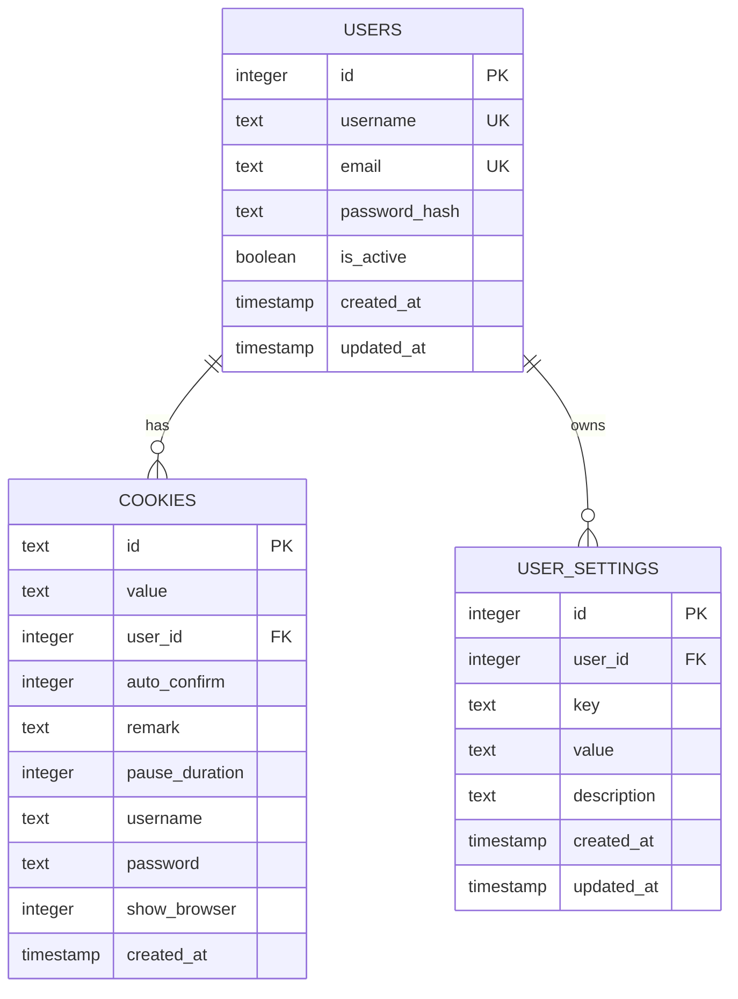
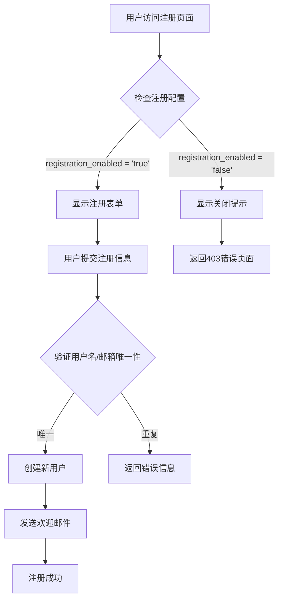
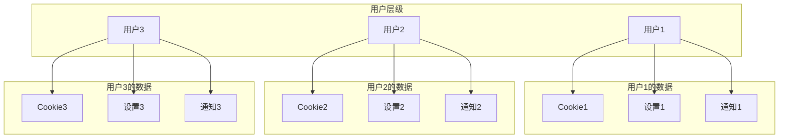
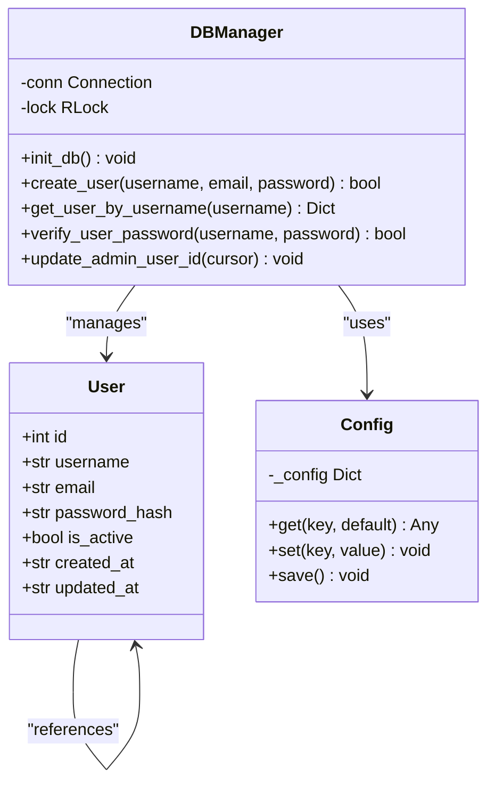
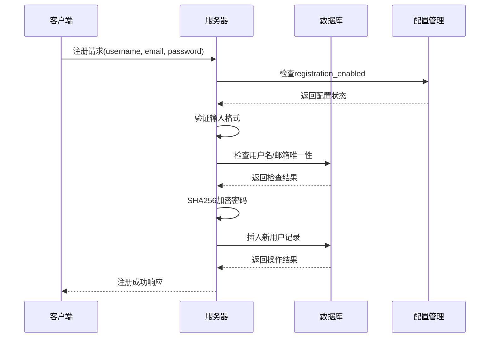

# 用户模型

<cite>
**本文档引用的文件**
- [db_manager.py](file://db_manager.py)
- [config.py](file://config.py)
- [global_config.yml](file://global_config.yml)
- [reply_server.py](file://reply_server.py)
- [static/index.html](file://static/index.html)
- [static/js/app.js](file://static/js/app.js)
</cite>

## 目录
1. [简介](#简介)
2. [用户表设计](#用户表设计)
3. [核心字段详解](#核心字段详解)
4. [用户注册系统](#用户注册系统)
5. [用户数据隔离机制](#用户数据隔离机制)
6. [时间戳自动填充](#时间戳自动填充)
7. [用户状态管理](#用户状态管理)
8. [用户模型架构](#用户模型架构)
9. [实际代码示例](#实际代码示例)
10. [总结](#总结)

## 简介

用户模型是闲鱼自动回复系统的核心组件，负责管理系统的用户身份认证、权限控制和个性化配置。该模型采用SQLite数据库存储，通过精心设计的表结构实现了用户数据的有效组织和多层级的数据隔离。

## 用户表设计

### 表结构概览

用户表（users）是整个用户模型的基础，包含以下核心字段：



**图表来源**
- [db_manager.py](file://db_manager.py#L74-L83)

### 数据类型和约束

| 字段名 | 数据类型 | 约束条件 | 说明 |
|--------|----------|----------|------|
| id | INTEGER | PRIMARY KEY AUTOINCREMENT | 用户唯一标识符，自增主键 |
| username | TEXT | UNIQUE NOT NULL | 用户名，必须唯一且不能为空 |
| email | TEXT | UNIQUE NOT NULL | 邮箱地址，必须唯一且不能为空 |
| password_hash | TEXT | NOT NULL | SHA256加密的密码哈希值 |
| is_active | BOOLEAN | DEFAULT TRUE | 用户账户激活状态，默认启用 |
| created_at | TIMESTAMP | DEFAULT CURRENT_TIMESTAMP | 账户创建时间戳 |
| updated_at | TIMESTAMP | DEFAULT CURRENT_TIMESTAMP | 最后更新时间戳 |

**节来源**
- [db_manager.py](file://db_manager.py#L74-L83)

## 核心字段详解

### username字段的唯一性约束

username字段设置了UNIQUE约束，确保每个用户名在系统中具有唯一性：

```sql
username TEXT UNIQUE NOT NULL
```

这种设计的优势：
- **防止重复注册**：确保同一用户名只能注册一次
- **简化用户查找**：通过用户名可以快速定位用户
- **提高安全性**：避免用户名冲突导致的安全隐患

### email字段的唯一性约束

email字段同样设置了UNIQUE约束，提供邮箱作为用户标识的备用方案：

```sql
email TEXT UNIQUE NOT NULL
```

邮箱验证流程：
1. 用户注册时输入邮箱地址
2. 系统验证邮箱格式有效性
3. 检查邮箱是否已被其他用户占用
4. 发送验证邮件确认所有权

### password_hash字段的安全存储

密码采用SHA256算法进行哈希处理，确保即使数据库泄露也无法直接获取明文密码：

```python
password_hash = hashlib.sha256(password.encode()).hexdigest()
```

安全特性：
- **单向加密**：无法从哈希值还原原始密码
- **固定长度**：无论原始密码多长，哈希值始终为64字符
- **抗彩虹表攻击**：结合盐值（虽然当前实现未显式添加）

**节来源**
- [db_manager.py](file://db_manager.py#L2431-L2432)

## 用户注册系统

### 注册功能控制机制

系统通过配置项`registration_enabled`严格控制用户注册功能的开启与关闭：



**图表来源**
- [reply_server.py](file://reply_server.py#L447-L448)
- [reply_server.py](file://reply_server.py#L447-L448)

### 注册配置项详解

系统设置表中包含以下关键配置项：

| 配置项 | 默认值 | 说明 |
|--------|--------|------|
| registration_enabled | 'true' | 控制是否允许新用户注册 |
| show_default_login_info | 'true' | 是否显示默认登录信息 |
| smtp_server | '' | SMTP服务器地址 |
| smtp_port | '587' | SMTP端口号 |
| smtp_user | '' | SMTP登录用户名 |
| smtp_password | '' | SMTP登录密码/授权码 |

### 注册流程实现

注册功能的完整实现包含以下步骤：

1. **配置检查**：在渲染注册页面前检查`registration_enabled`设置
2. **表单验证**：验证用户名、邮箱和密码格式
3. **唯一性检查**：确保用户名和邮箱未被占用
4. **密码加密**：使用SHA256算法加密密码
5. **数据库插入**：将用户信息存储到users表
6. **欢迎通知**：发送欢迎邮件（如果配置了SMTP）

**节来源**
- [reply_server.py](file://reply_server.py#L447-L448)
- [db_manager.py](file://db_manager.py#L2426-L2448)

## 用户数据隔离机制

### 多层级数据隔离

用户模型通过外键关联实现了严格的多层级数据隔离：



**图表来源**
- [db_manager.py](file://db_manager.py#L112-L123)
- [db_manager.py](file://db_manager.py#L394-L405)

### 外键约束设计

每个用户相关的表都通过`user_id`字段建立外键关系：

- **cookies表**：`user_id INTEGER NOT NULL`
- **cards表**：`user_id INTEGER NOT NULL DEFAULT 1`
- **user_settings表**：`user_id INTEGER NOT NULL`
- **notification_channels表**：`user_id INTEGER NOT NULL`

这种设计确保：
- **数据完整性**：删除用户时自动清理相关数据
- **访问控制**：用户只能访问自己的数据
- **性能优化**：通过索引加速查询

**节来源**
- [db_manager.py](file://db_manager.py#L112-L123)
- [db_manager.py](file://db_manager.py#L394-L405)

## 时间戳自动填充

### 自动时间戳机制

系统通过SQLite的DEFAULT CURRENT_TIMESTAMP特性实现时间戳的自动填充：

```sql
created_at TIMESTAMP DEFAULT CURRENT_TIMESTAMP,
updated_at TIMESTAMP DEFAULT CURRENT_TIMESTAMP
```

### 更新策略

每次记录更新时，`updated_at`字段会自动更新为当前时间：

```sql
updated_at TIMESTAMP DEFAULT CURRENT_TIMESTAMP
```

这种设计的好处：
- **自动化**：无需手动设置时间戳
- **一致性**：确保时间戳的准确性
- **审计追踪**：记录数据变更的时间点

### 时间戳应用场景

| 场景 | created_at用途 | updated_at用途 |
|------|----------------|----------------|
| 用户注册 | 记录注册时间 | 记录最后登录时间 |
| Cookie添加 | 记录添加时间 | 记录最后使用时间 |
| 设置修改 | 记录创建时间 | 记录最后修改时间 |
| 商品信息 | 记录缓存时间 | 记录最后更新时间 |

**节来源**
- [db_manager.py](file://db_manager.py#L79-L82)
- [db_manager.py](file://db_manager.py#L385-L386)

## 用户状态管理

### is_active字段的作用

`is_active`布尔字段控制用户账户的激活状态：

```sql
is_active BOOLEAN DEFAULT TRUE
```

### 禁用场景的应用

系统在以下场景中使用用户禁用功能：

1. **账户封禁**：管理员手动禁用违规账户
2. **安全考虑**：检测到可疑活动时临时禁用
3. **维护期间**：系统维护时限制非管理员访问
4. **用户主动停用**：用户请求暂停账户使用

### 禁用效果

当用户账户被禁用时：
- **登录限制**：无法通过用户名/密码登录
- **功能受限**：无法访问受保护的API端点
- **数据隔离**：不影响其他用户的正常使用
- **审计追踪**：记录禁用操作和原因

**节来源**
- [db_manager.py](file://db_manager.py#L80)
- [reply_server.py](file://reply_server.py#L552-L553)

## 用户模型架构

### 整体架构设计



**图表来源**
- [db_manager.py](file://db_manager.py#L16-L52)
- [config.py](file://config.py#L5-L89)

### 数据流图



**图表来源**
- [reply_server.py](file://reply_server.py#L447-L448)
- [db_manager.py](file://db_manager.py#L2426-L2448)

**节来源**
- [db_manager.py](file://db_manager.py#L16-L52)
- [config.py](file://config.py#L5-L89)

## 实际代码示例

### 创建用户表的SQL语句

在`DBManager.init_db()`方法中，用户表的创建语句如下：

```sql
CREATE TABLE IF NOT EXISTS users (
    id INTEGER PRIMARY KEY AUTOINCREMENT,
    username TEXT UNIQUE NOT NULL,
    email TEXT UNIQUE NOT NULL,
    password_hash TEXT NOT NULL,
    is_active BOOLEAN DEFAULT TRUE,
    created_at TIMESTAMP DEFAULT CURRENT_TIMESTAMP,
    updated_at TIMESTAMP DEFAULT CURRENT_TIMESTAMP
)
```

这个语句定义了完整的用户表结构，包含了所有必要的字段和约束。

### 初始化admin用户的代码

`update_admin_user_id()`方法负责创建默认的管理员账户：

```python
# 首次创建admin用户，设置默认密码
default_password_hash = hashlib.sha256("admin123".encode()).hexdigest()
cursor.execute('''
INSERT INTO users (username, email, password_hash) VALUES
('admin', 'admin@localhost', ?)
''', (default_password_hash,))
```

这段代码展示了如何安全地创建管理员账户，使用SHA256算法加密默认密码。

### 用户注册的完整流程

用户注册功能的实现涉及多个组件的协作：

1. **前端检查**：通过`/registration-status`接口检查注册是否开启
2. **后端验证**：在`/register`路由中验证用户输入
3. **数据库操作**：调用`create_user()`方法创建新用户
4. **配置更新**：通过系统设置API更新注册状态

**节来源**
- [db_manager.py](file://db_manager.py#L74-L83)
- [db_manager.py](file://db_manager.py#L618-L628)
- [reply_server.py](file://reply_server.py#L447-L448)

## 总结

闲鱼自动回复系统的用户模型设计体现了现代Web应用的最佳实践：

### 设计亮点

1. **安全性**：采用SHA256哈希算法保护用户密码
2. **数据完整性**：通过UNIQUE约束确保用户名和邮箱的唯一性
3. **灵活控制**：通过配置项实现注册功能的动态开关
4. **多层级隔离**：通过外键关系实现严格的数据隔离
5. **自动化管理**：时间戳自动填充减少手动维护工作

### 技术优势

- **高性能**：合理使用索引和约束提升查询效率
- **可扩展性**：模块化设计便于功能扩展
- **可维护性**：清晰的代码结构和完善的注释
- **可靠性**：完善的错误处理和事务管理

### 应用价值

该用户模型不仅满足了系统的基本需求，还为未来的功能扩展奠定了坚实的基础。通过合理的架构设计和安全措施，确保了系统的稳定运行和用户数据的安全。