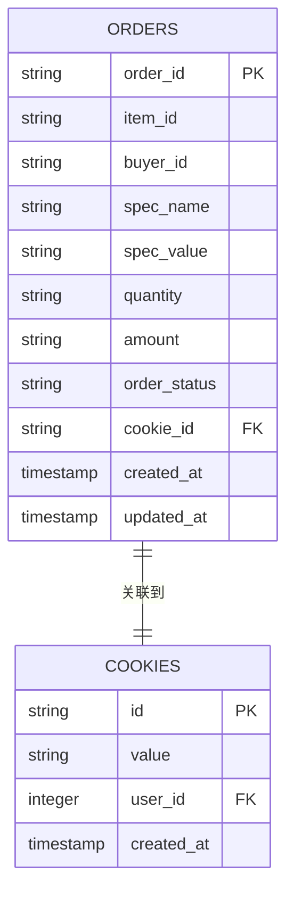
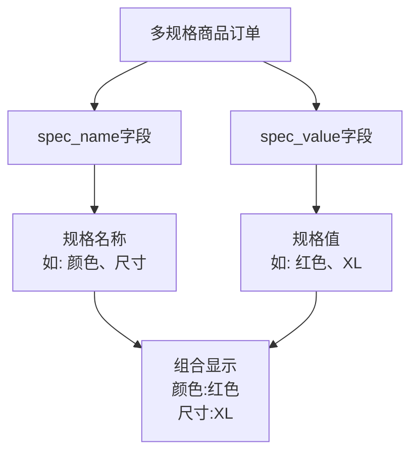
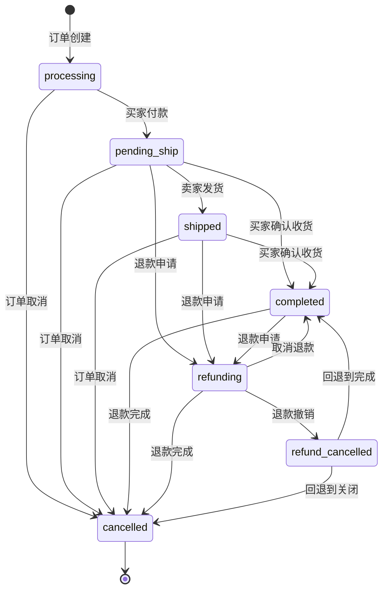
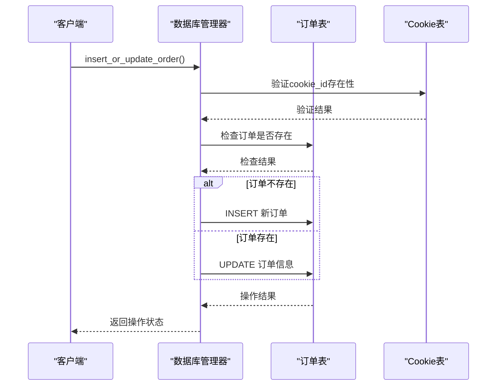
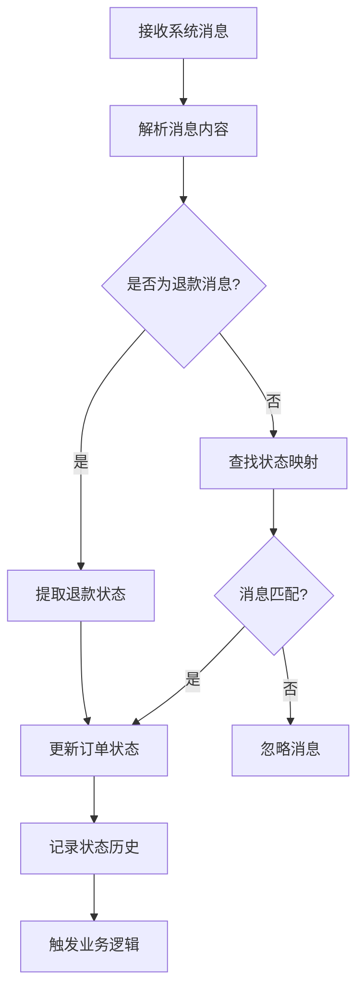
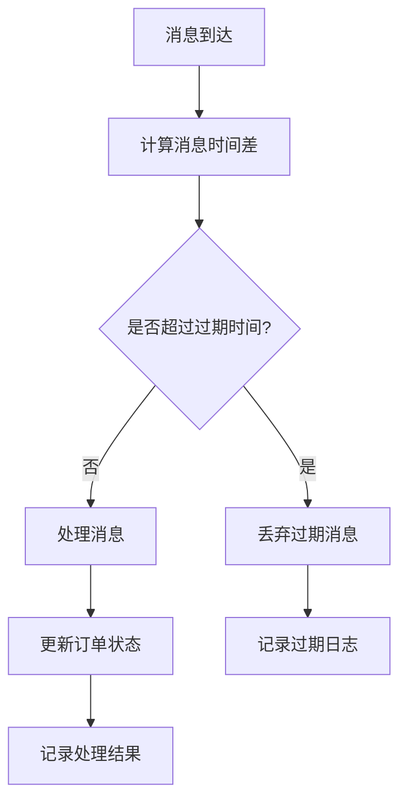
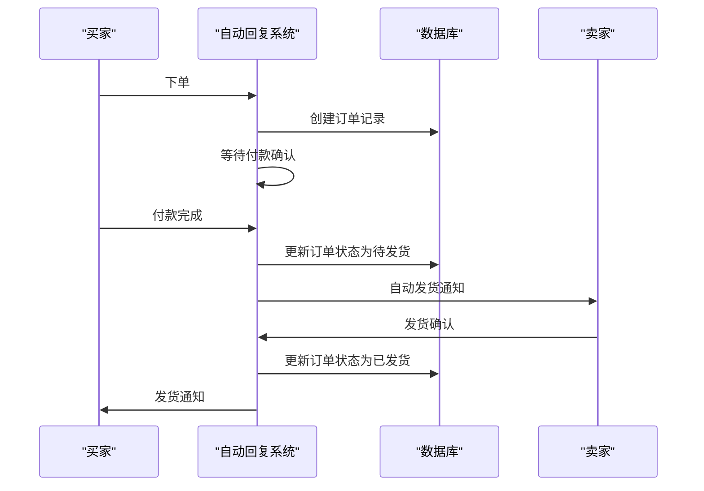

# 订单模型

<cite>
**本文档中引用的文件**
- [config.py](file://config.py)
- [db_manager.py](file://db_manager.py)
- [order_status_handler.py](file://order_status_handler.py)
- [XianyuAutoAsync.py](file://XianyuAutoAsync.py)
- [global_config.yml](file://global_config.yml)
- [utils/order_detail_fetcher.py](file://utils/order_detail_fetcher.py)
</cite>

## 目录
1. [简介](#简介)
2. [订单表结构设计](#订单表结构设计)
3. [核心字段详解](#核心字段详解)
4. [订单状态机设计](#订单状态机设计)
5. [数据库操作实现](#数据库操作实现)
6. [消息处理与状态更新](#消息处理与状态更新)
7. [过期订单处理机制](#过期订单处理机制)
8. [实际应用场景](#实际应用场景)
9. [总结](#总结)

## 简介

闲鱼自动回复系统中的订单模型是一个核心的数据结构，用于跟踪和管理闲鱼平台上的交易订单。该模型通过orders表实现了完整的订单生命周期管理，包括订单创建、状态跟踪、多规格商品支持以及自动化的状态更新机制。

订单模型的设计充分考虑了闲鱼平台的业务特点，支持复杂的交易场景，如多规格商品、退款处理、自动发货等功能。系统通过消息驱动的方式实时更新订单状态，确保订单信息的准确性和时效性。

## 订单表结构设计

### 数据库表定义

订单表采用SQLite数据库存储，其结构设计如下：

**图表来源**
- [db_manager.py](file://db_manager.py#L219-L234)

### 表结构特点

1. **主键设计**: `order_id`作为主键，确保每个订单的唯一性
2. **外键关联**: `cookie_id`外键关联到cookies表，建立订单与闲鱼账号的对应关系
3. **时间戳字段**: `created_at`和`updated_at`自动记录订单的创建和更新时间
4. **索引优化**: 通过外键约束和索引提升查询性能

**章节来源**
- [db_manager.py](file://db_manager.py#L219-L234)

## 核心字段详解

### order_id - 订单唯一标识符

`order_id`是订单表的主键，具有以下特性：

- **唯一性**: 每个订单都有唯一的订单ID，确保订单的独立性
- **数据类型**: 文本类型，支持长字符串格式
- **业务意义**: 直接来源于闲鱼平台的订单编号，便于与平台数据对应

### item_id - 商品标识符

`item_id`记录订单对应的商品ID：

- **多规格支持**: 通过与其他字段配合，支持单商品多规格的订单
- **关联性**: 与商品详情表建立关联，提供完整的商品信息
- **灵活性**: 支持不同规格商品的统一管理

### buyer_id - 买家标识符

`buyer_id`记录购买者的唯一标识：

- **用户追踪**: 便于追踪买家行为和建立用户画像
- **客服支持**: 为客服系统提供买家信息基础
- **数据分析**: 支持销售数据分析和统计

### spec_name 和 spec_value - 多规格商品支持

这两个字段协同工作，实现多规格商品订单的支持：

**图表来源**
- [order_status_handler.py](file://order_status_handler.py#L8956-L8988)

### quantity 和 amount - 交易金额记录

这两个字段精确记录交易细节：

- **quantity**: 记录购买数量，支持多数量订单
- **amount**: 记录交易金额，以字符串形式存储，支持精确金额
- **精度控制**: 通过字符串存储避免浮点数精度问题

### cookie_id - 闲鱼账号关联

`cookie_id`字段建立了订单与闲鱼账号的关联：

- **账号隔离**: 确保不同账号的订单数据相互独立
- **权限控制**: 基于cookie_id实现账号级别的权限管理
- **数据安全**: 保障订单数据的安全性和隐私性

### created_at 和 updated_at - 时间戳管理

这两个时间戳字段提供完整的订单生命周期跟踪：

- **自动更新**: `created_at`在订单创建时自动设置，`updated_at`在每次更新时自动更新
- **审计功能**: 支持订单操作的审计和追溯
- **性能优化**: 通过时间戳索引提升查询效率

**章节来源**
- [db_manager.py](file://db_manager.py#L4399-L4538)

## 订单状态机设计

### 状态转换规则

订单状态机采用有限状态自动机设计，支持完整的交易生命周期：

**图表来源**
- [order_status_handler.py](file://order_status_handler.py#L36-L44)

### 状态优先级定义

系统定义了状态优先级，防止不合理的状态回退：

| 状态 | 优先级 | 描述 |
|------|--------|------|
| processing | 1 | 处理中，初始状态 |
| pending_ship | 2 | 待发货，已付款 |
| refunding | 2 | 退款中（与待发货同级） |
| shipped | 3 | 已发货 |
| completed | 4 | 已完成 |
| cancelled | 5 | 已关闭（终态） |

### 特殊状态处理

系统对特殊状态提供了专门的处理逻辑：

- **refund_cancelled**: 退款撤销状态，会自动回退到上一个状态
- **cancelled**: 终态，不允许任何状态转换
- **pending_ship**: 已付款状态，支持退款和发货操作

**章节来源**
- [order_status_handler.py](file://order_status_handler.py#L36-L44)
- [order_status_handler.py](file://order_status_handler.py#L722-L730)

## 数据库操作实现

### 订单插入与更新

系统提供了灵活的订单插入和更新机制：

**图表来源**
- [db_manager.py](file://db_manager.py#L4400-L4473)

### 查询操作

系统提供了多种订单查询方式：

1. **按ID查询**: `get_order_by_id()` - 获取单个订单详情
2. **按账号查询**: `get_orders_by_cookie()` - 获取账号下的所有订单
3. **批量查询**: 支持分页和过滤查询

### 并发控制

数据库操作采用线程安全的并发控制机制：

- **锁机制**: 使用`threading.RLock()`保护数据库操作
- **事务管理**: 自动提交和回滚机制
- **重试机制**: 面对数据库锁定提供重试功能

**章节来源**
- [db_manager.py](file://db_manager.py#L4400-L4538)

## 消息处理与状态更新

### 消息识别机制

系统通过智能的消息识别机制自动更新订单状态：

**图表来源**
- [order_status_handler.py](file://order_status_handler.py#L662-L669)

### 状态映射表

系统维护了完整的消息状态映射表：

| 消息内容 | 映射状态 | 业务含义 |
|----------|----------|----------|
| "[买家确认收货，交易成功]" | completed | 交易完成 |
| "[你已发货]" | shipped | 已发货 |
| "[我已付款，等待你发货]" | pending_ship | 待发货 |
| "[退款成功，钱款已原路退返]" | cancelled | 退款完成 |
| "[你关闭了订单，钱款已原路退返]" | cancelled | 订单关闭 |

### 订单ID提取

系统具备强大的订单ID提取能力：

- **JSON解析**: 从复杂的消息结构中提取订单信息
- **正则匹配**: 多种模式的订单ID识别
- **备用方案**: 多层次的提取策略确保成功率

**章节来源**
- [order_status_handler.py](file://order_status_handler.py#L81-L185)
- [order_status_handler.py](file://order_status_handler.py#L647-L669)

## 过期订单处理机制

### 配置参数

系统通过`MESSAGE_EXPIRE_TIME`配置过期时间：

- **默认值**: 300000毫秒（5分钟）
- **配置位置**: `global_config.yml`文件中
- **作用范围**: 影响消息处理的时效性

### 过期检测机制

**图表来源**
- [config.py](file://config.py#L99-L100)

### 待处理队列管理

系统提供了完善的待处理队列管理机制：

- **队列容量**: 动态管理待处理消息数量
- **过期清理**: 自动清理过期的待处理消息
- **优先级处理**: 根据消息重要性进行优先级排序

**章节来源**
- [config.py](file://config.py#L99-L100)
- [order_status_handler.py](file://order_status_handler.py#L555-L632)

## 实际应用场景

### 自动发货流程

系统支持完整的自动发货流程：

**图表来源**
- [XianyuAutoAsync.py](file://XianyuAutoAsync.py#L4426-L4447)

### 多账号管理

系统支持多闲鱼账号的订单管理：

- **账号隔离**: 每个账号的订单数据独立存储
- **权限控制**: 基于cookie_id实现细粒度权限管理
- **资源共享**: 支持账号间的资源共享和协作

### 退款处理流程

系统提供了完整的退款处理机制：

- **退款申请检测**: 自动识别买家的退款申请
- **状态自动更新**: 根据退款进度自动更新订单状态
- **退款撤销处理**: 支持退款过程中的状态回退

**章节来源**
- [XianyuAutoAsync.py](file://XianyuAutoAsync.py#L4426-L4447)
- [order_status_handler.py](file://order_status_handler.py#L346-L417)

## 总结

闲鱼自动回复系统的订单模型设计体现了以下特点：

### 技术优势

1. **完整性**: 支持完整的订单生命周期管理
2. **灵活性**: 适应多规格商品和复杂交易场景
3. **可靠性**: 提供完善的错误处理和重试机制
4. **扩展性**: 易于扩展新的状态和功能

### 业务价值

1. **自动化**: 大幅减少人工干预，提高运营效率
2. **准确性**: 通过消息驱动确保订单状态的实时准确性
3. **可追溯**: 完整的审计日志支持问题排查和合规要求
4. **用户体验**: 提升买家和卖家的交易体验

### 发展方向

1. **智能化**: 引入AI技术提升订单处理的智能化水平
2. **集成化**: 与更多电商平台和支付系统集成
3. **标准化**: 建立行业标准的订单处理规范
4. **国际化**: 支持多语言和多币种的国际交易

该订单模型为闲鱼自动回复系统提供了坚实的数据基础，支撑了整个系统的自动化运营需求，是系统成功的关键组件之一。