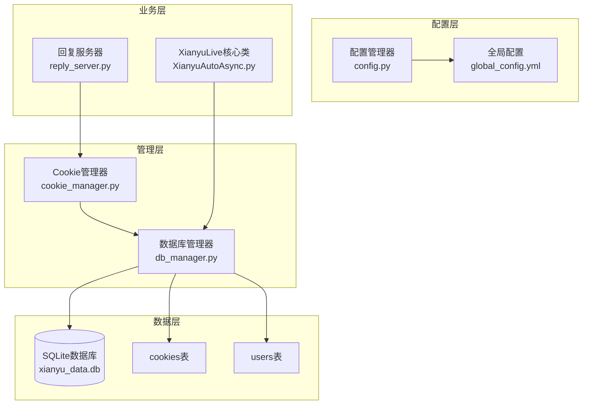
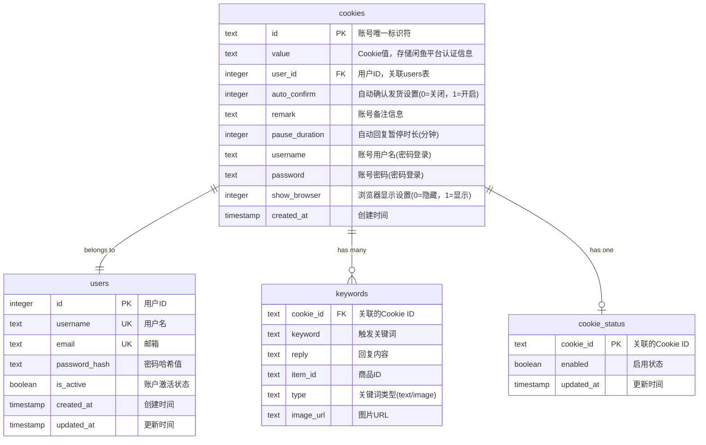
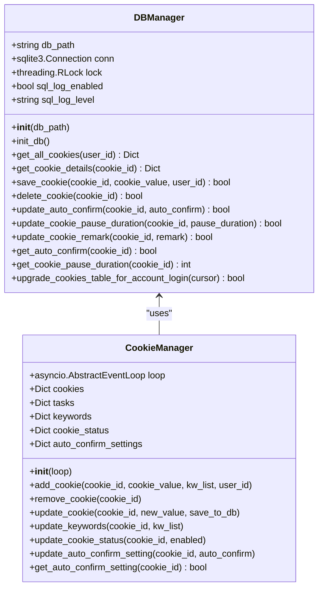
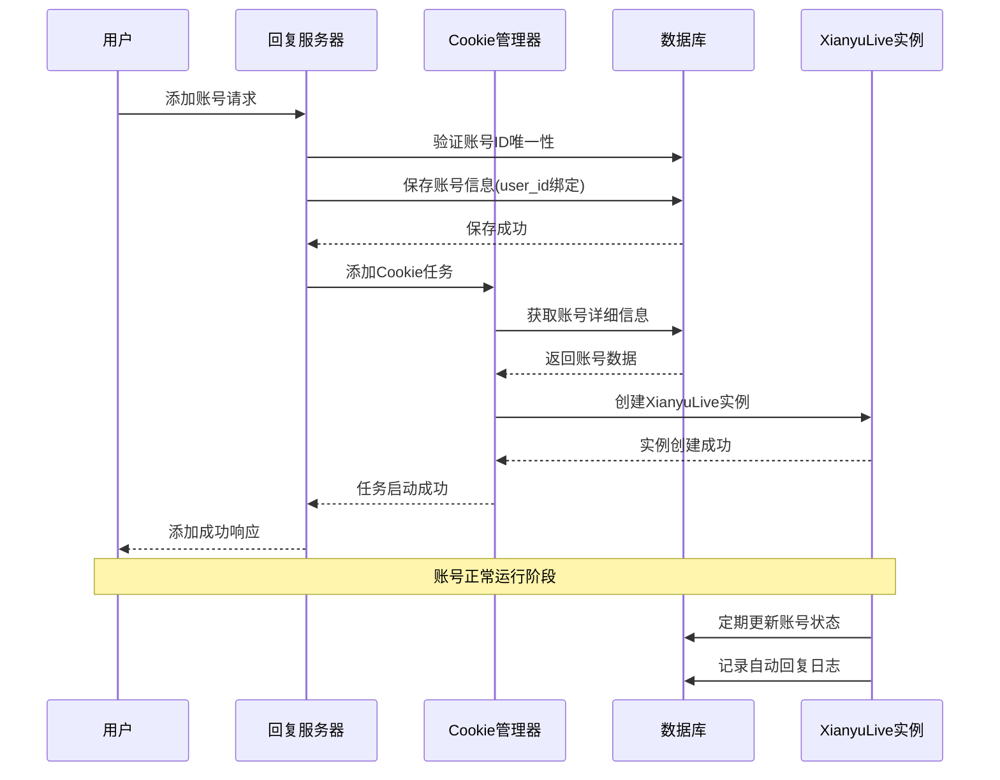
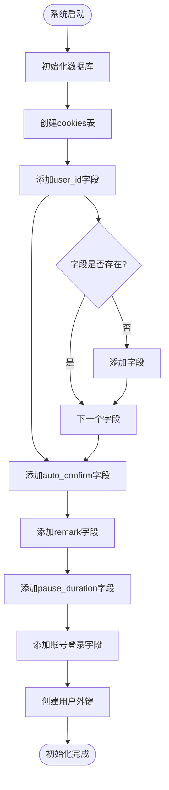
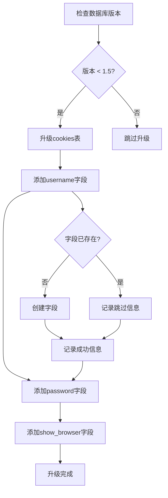
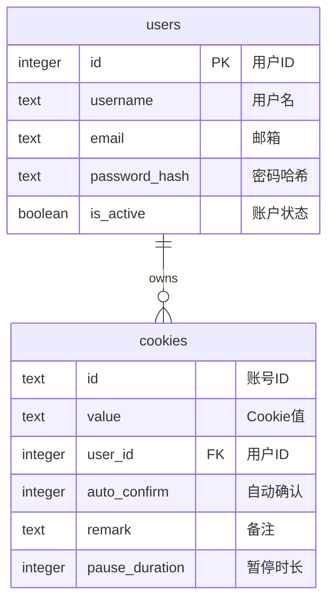
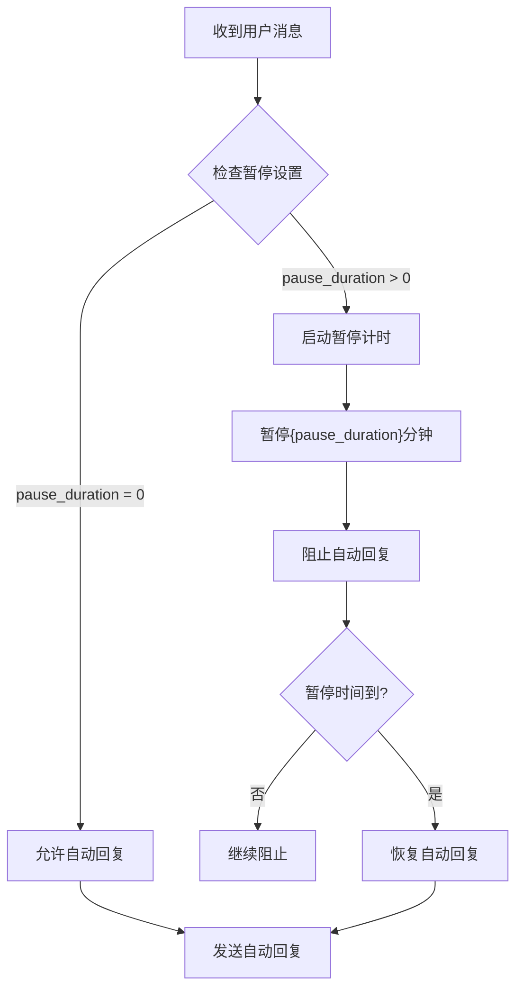
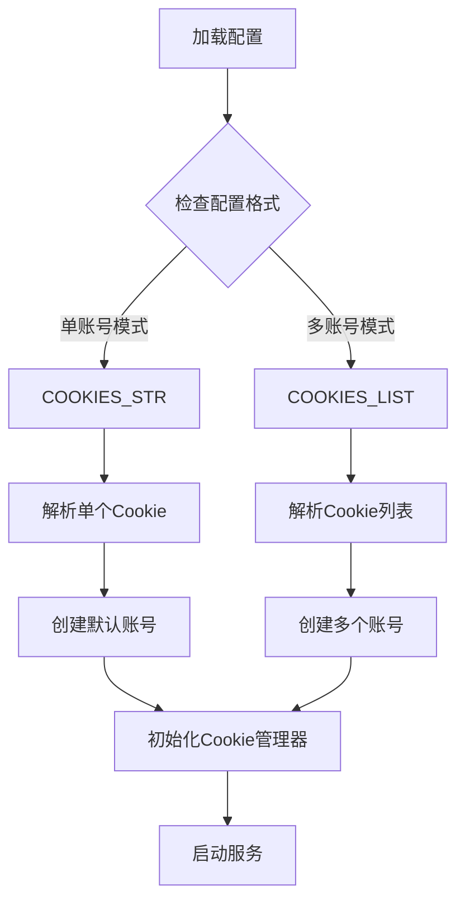
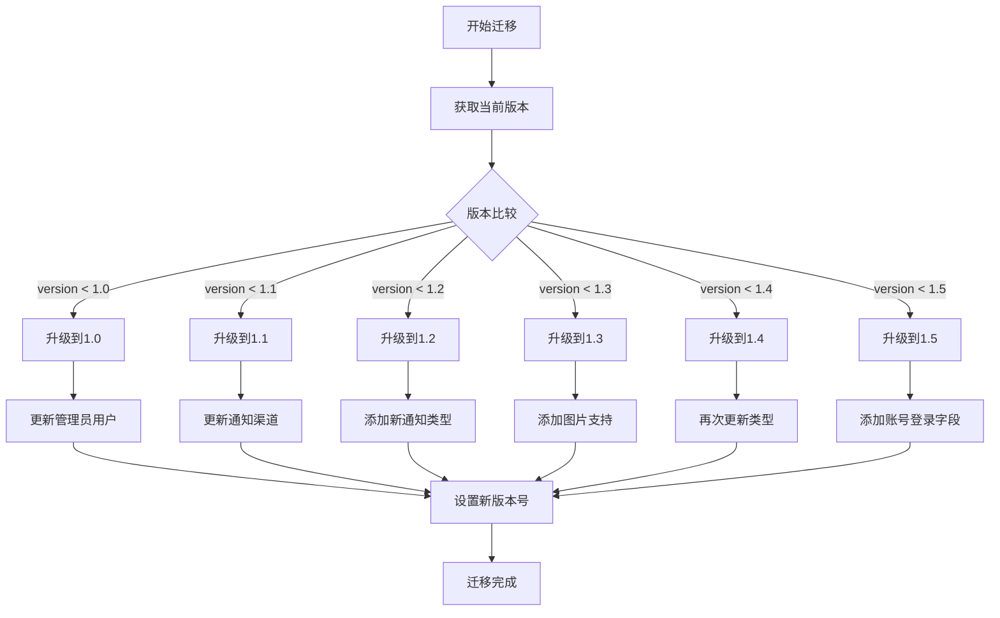

# 账号模型

<cite>
**本文档中引用的文件**
- [config.py](file://config.py)
- [db_manager.py](file://db_manager.py)
- [cookie_manager.py](file://cookie_manager.py)
- [XianyuAutoAsync.py](file://XianyuAutoAsync.py)
- [Start.py](file://Start.py)
- [reply_server.py](file://reply_server.py)
</cite>

## 目录
1. [简介](#简介)
2. [项目结构概览](#项目结构概览)
3. [cookies表设计](#cookies表设计)
4. [核心组件分析](#核心组件分析)
5. [架构概览](#架构概览)
6. [详细组件分析](#详细组件分析)
7. [配置管理](#配置管理)
8. [数据库迁移](#数据库迁移)
9. [性能考虑](#性能考虑)
10. [故障排除指南](#故障排除指南)
11. [结论](#结论)

## 简介

闲鱼自动回复系统采用多账号管理模式，通过cookies表实现对多个闲鱼账号的统一管理和监控。该系统支持单账号和多账号配置模式，具备完善的账号认证、自动确认发货、暂停控制等功能。

## 项目结构概览

系统采用模块化设计，主要包含以下核心模块：
- **配置管理模块** (`config.py`)：负责系统配置的加载和管理
- **数据库管理模块** (`db_manager.py`)：负责数据库操作和表结构管理
- **Cookie管理模块** (`cookie_manager.py`)：负责多账号Cookie的生命周期管理
- **核心业务模块** (`XianyuAutoAsync.py`)：实现闲鱼自动回复的核心逻辑

**图表来源**
- [config.py](file://config.py#L1-L126)
- [db_manager.py](file://db_manager.py#L16-L123)
- [cookie_manager.py](file://cookie_manager.py#L10-L428)

## cookies表设计

### 表结构定义

cookies表是系统的核心数据结构，用于存储闲鱼账号的相关信息和配置参数。

**图表来源**
- [db_manager.py](file://db_manager.py#L110-L123)

### 字段详解

#### 核心字段

| 字段名 | 数据类型 | 默认值 | 说明 |
|--------|----------|--------|------|
| `id` | TEXT | - | 账号唯一标识符，主键 |
| `value` | TEXT | - | Cookie值，存储闲鱼平台的认证信息，JSON格式 |
| `user_id` | INTEGER | - | 外键，关联users表，建立账号与用户的归属关系 |

#### 功能配置字段

| 字段名 | 数据类型 | 默认值 | 说明 |
|--------|----------|--------|------|
| `auto_confirm` | INTEGER | 1 | 自动确认发货设置，0表示关闭，1表示开启 |
| `pause_duration` | INTEGER | 10 | 自动回复暂停时长，单位为分钟，0表示不暂停 |
| `remark` | TEXT | '' | 账号备注信息，用于标识和分类账号 |

#### 账号登录字段

| 字段名 | 数据类型 | 默认值 | 说明 |
|--------|----------|--------|------|
| `username` | TEXT | '' | 用于密码登录的用户名 |
| `password` | TEXT | '' | 用于密码登录的密码 |
| `show_browser` | INTEGER | 0 | 登录时是否显示浏览器界面，0表示隐藏，1表示显示 |

**章节来源**
- [db_manager.py](file://db_manager.py#L110-L123)

## 核心组件分析

### DBManager类

DBManager是数据库操作的核心类，负责cookies表的创建、查询、更新和删除操作。

**图表来源**
- [db_manager.py](file://db_manager.py#L16-L50)
- [cookie_manager.py](file://cookie_manager.py#L10-L40)

### CookieManager类

CookieManager负责多账号Cookie的生命周期管理，包括添加、删除、更新和状态控制。

**章节来源**
- [db_manager.py](file://db_manager.py#L16-L5103)
- [cookie_manager.py](file://cookie_manager.py#L10-L428)

## 架构概览

系统采用分层架构设计，实现了清晰的职责分离和良好的扩展性。

**图表来源**
- [cookie_manager.py](file://cookie_manager.py#L184-L200)
- [db_manager.py](file://db_manager.py#L1155-L1192)

## 详细组件分析

### 数据库初始化

系统在首次启动时会自动创建cookies表，并添加必要的字段和索引。

**图表来源**
- [db_manager.py](file://db_manager.py#L67-L123)
- [db_manager.py](file://db_manager.py#L453-L487)

### 账号登录功能升级

系统支持从扫码登录升级到账号密码登录，通过`upgrade_cookies_table_for_account_login`方法实现表结构的动态升级。

**图表来源**
- [db_manager.py](file://db_manager.py#L917-L956)

### Cookie值存储机制

value字段存储的是经过处理的闲鱼平台Cookie数据，包含用户认证信息和设备标识。

**章节来源**
- [db_manager.py](file://db_manager.py#L1155-L1192)
- [cookie_manager.py](file://cookie_manager.py#L184-L200)

### 用户归属管理

通过user_id外键建立了cookies表与users表的关联关系，实现了多账号的归属管理。

**图表来源**
- [db_manager.py](file://db_manager.py#L73-L83)
- [db_manager.py](file://db_manager.py#L114-L122)

### 自动确认发货机制

auto_confirm字段控制账号的自动确认发货功能，影响订单处理流程。

| auto_confirm值 | 功能效果 | 影响范围 |
|----------------|----------|----------|
| 0 | 关闭自动确认 | 所有待发货订单需要手动确认 |
| 1 | 开启自动确认 | 订单自动确认，无需人工干预 |

**章节来源**
- [db_manager.py](file://db_manager.py#L1442-L1456)
- [XianyuAutoAsync.py](file://XianyuAutoAsync.py#L800-L801)

### 暂停控制机制

pause_duration字段控制账号的自动回复暂停时长，防止频繁交互导致的封号风险。

**图表来源**
- [XianyuAutoAsync.py](file://XianyuAutoAsync.py#L49-L67)
- [db_manager.py](file://db_manager.py#L1330-L1351)

### 账号标识与备注

remark字段用于账号的标识和分类，帮助用户更好地管理多个账号。

**章节来源**
- [db_manager.py](file://db_manager.py#L1305-L1316)
- [db_manager.py](file://db_manager.py#L1267-L1286)

### 调试模式支持

show_browser字段在调试模式下控制浏览器界面的显示，便于开发者进行账号登录和调试。

**章节来源**
- [db_manager.py](file://db_manager.py#L1353-L1441)

## 配置管理

### COOKIES配置

系统通过config.py中的COOKIES配置支持多种配置模式：

**图表来源**
- [config.py](file://config.py#L91-L126)

### 配置优先级

系统按照以下优先级加载配置：
1. 环境变量配置
2. global_config.yml文件配置
3. 默认配置值

**章节来源**
- [config.py](file://config.py#L1-L126)

## 数据库迁移

### 版本升级机制

系统实现了完整的数据库版本升级机制，确保数据结构的平滑演进。

**图表来源**
- [db_manager.py](file://db_manager.py#L558-L609)

### 表结构升级

每次版本升级都会执行相应的表结构变更，确保功能的完整性和数据的完整性。

**章节来源**
- [db_manager.py](file://db_manager.py#L558-L609)
- [db_manager.py](file://db_manager.py#L917-L956)

## 性能考虑

### 数据库连接管理

系统使用线程安全的数据库连接池，确保多线程环境下的数据一致性。

### 缓存策略

- Cookie信息缓存在内存中，减少数据库访问频率
- 关键字信息采用懒加载策略
- 用户设置信息进行本地缓存

### 并发控制

- 使用RLock确保数据库操作的线程安全
- 采用异步任务管理Cookie生命周期
- 实现任务锁防止重复创建相同ID的任务

## 故障排除指南

### 常见问题及解决方案

#### 1. 账号登录失败
- 检查Cookie值的有效性
- 验证网络连接状态
- 确认账号是否被限制

#### 2. 自动回复异常
- 检查pause_duration设置
- 验证关键词配置
- 确认账号状态是否启用

#### 3. 数据库连接问题
- 检查数据库文件权限
- 验证磁盘空间充足
- 确认SQLite版本兼容性

**章节来源**
- [db_manager.py](file://db_manager.py#L16-L5103)
- [cookie_manager.py](file://cookie_manager.py#L1-L428)

## 结论

闲鱼自动回复系统的账号模型设计体现了良好的软件工程实践，通过cookies表实现了完整的多账号管理体系。系统具备以下优势：

1. **灵活的配置支持**：支持单账号和多账号配置模式
2. **完善的功能特性**：包含自动确认发货、暂停控制、账号标识等功能
3. **可靠的数据库设计**：采用外键关联确保数据完整性
4. **平滑的升级机制**：支持数据库结构的渐进式升级
5. **良好的扩展性**：模块化设计便于功能扩展和维护

该设计为闲鱼自动回复业务提供了稳定可靠的技术基础，能够满足不同规模用户的需求。