# 通知模型

<cite>
**本文档引用的文件**
- [db_manager.py](file://db_manager.py)
- [config.py](file://config.py)
- [XianyuAutoAsync.py](file://XianyuAutoAsync.py)
- [slider_patch.py](file://utils/slider_patch.py)
- [global_config.yml](file://global_config.yml)
- [app.js](file://static/js/app.js)
- [index.html](file://static/index.html)
</cite>

## 目录
1. [简介](#简介)
2. [项目结构](#项目结构)
3. [核心组件](#核心组件)
4. [架构概览](#架构概览)
5. [详细组件分析](#详细组件分析)
6. [依赖关系分析](#依赖关系分析)
7. [性能考虑](#性能考虑)
8. [故障排除指南](#故障排除指南)
9. [结论](#结论)

## 简介

通知模型是闲鱼自动回复系统的核心功能模块，负责管理多种通知渠道的配置和消息推送。该系统采用数据库驱动的设计模式，支持QQ、钉钉、飞书、Bark、邮件、Webhook、微信、Telegram等多种通知渠道，为用户提供灵活的消息通知解决方案。

通知模型主要包含两个核心数据库表：`notification_channels`（通知渠道表）和`message_notifications`（消息通知配置表），通过外键关联实现了闲鱼账号与通知渠道的订阅关系管理。

## 项目结构

通知模型的实现分布在多个文件中，形成了清晰的分层架构：


**图表来源**
- [db_manager.py](file://db_manager.py#L356-L391)
- [XianyuAutoAsync.py](file://XianyuAutoAsync.py#L3797-L3989)
- [app.js](file://static/js/app.js#L2626-L2744)

## 核心组件

通知模型包含以下核心组件：

### 数据库表设计

1. **notification_channels 表**：存储通知渠道的基本信息和配置
2. **message_notifications 表**：管理账号与通知渠道的订阅关系

### 配置管理系统

1. **SMTP 配置**：支持各种邮箱服务商的邮件通知
2. **渠道类型映射**：统一不同渠道类型的命名规范
3. **动态配置解析**：运行时解析通知配置参数

### 异步通知处理器

1. **多渠道支持**：统一的异步通知发送接口
2. **错误处理机制**：完善的异常捕获和错误提示
3. **并发控制**：支持异步并发发送多个通知

**章节来源**
- [db_manager.py](file://db_manager.py#L356-L391)
- [config.py](file://config.py#L1-L126)

## 架构概览

通知模型采用分层架构设计，实现了关注点分离和高内聚低耦合的设计原则：


**图表来源**
- [db_manager.py](file://db_manager.py#L2007-L2193)
- [XianyuAutoAsync.py](file://XianyuAutoAsync.py#L3492-L4283)

## 详细组件分析

### notification_channels 表设计

`notification_channels` 表是通知模型的核心数据结构，定义了通知渠道的基本属性和约束条件：

#### 字段说明

| 字段名 | 类型 | 约束 | 说明 |
|--------|------|------|------|
| id | INTEGER | PRIMARY KEY AUTOINCREMENT | 主键标识符 |
| name | TEXT | NOT NULL | 通知渠道名称 |
| type | TEXT | NOT NULL CHECK | 通知渠道类型，支持多种类型 |
| config | TEXT | NOT NULL | JSON格式的配置参数 |
| enabled | BOOLEAN | DEFAULT TRUE | 启用状态标志 |
| created_at | TIMESTAMP | DEFAULT CURRENT_TIMESTAMP | 创建时间戳 |
| updated_at | TIMESTAMP | DEFAULT CURRENT_TIMESTAMP | 更新时间戳 |

#### 支持的通知渠道类型

系统支持以下通知渠道类型：


**图表来源**
- [db_manager.py](file://db_manager.py#L357-L366)
- [db_manager.py](file://db_manager.py#L842-L852)

#### config 字段的JSON配置结构

`config` 字段以JSON格式存储各渠道的配置参数，具体结构如下：

**QQ通知配置：**
```json
{
  "qq_number": "123456789"
}
```

**钉钉通知配置：**
```json
{
  "webhook_url": "https://oapi.dingtalk.com/robot/send?access_token=xxx",
  "secret": "your_secret_key"
}
```

**邮件通知配置：**
```json
{
  "smtp_server": "smtp.gmail.com",
  "smtp_port": 587,
  "email_user": "your-email@gmail.com",
  "email_password": "your_password_or_app_password",
  "recipient_email": "recipient@example.com",
  "smtp_use_tls": true,
  "smtp_use_ssl": false,
  "smtp_from": "通知系统"
}
```

**章节来源**
- [db_manager.py](file://db_manager.py#L356-L366)
- [app.js](file://static/js/app.js#L2626-L2744)

### message_notifications 表设计

`message_notifications` 表实现了闲鱼账号与通知渠道的订阅关系管理：

#### 外键关联设计

```mermaid
erDiagram
notification_channels {
integer id PK
text name
text type
text config
boolean enabled
timestamp created_at
timestamp updated_at
}
message_notifications {
integer id PK
text cookie_id FK
integer channel_id FK
boolean enabled
timestamp created_at
timestamp updated_at
}
cookies {
text id PK
text value
text remark
integer pause_duration
timestamp created_at
timestamp updated_at
}
notification_channels ||--o{ message_notifications : "拥有多个"
cookies ||--o{ message_notifications : "订阅多个"
message_notifications }o--|| notification_channels : "关联到"
message_notifications }o--|| cookies : "关联到"
```



**图表来源**
- [db_manager.py](file://db_manager.py#L379-L391)

#### 订阅关系管理

系统通过 `cookie_id` 和 `channel_id` 的组合唯一标识一个通知订阅关系：

1. **唯一性约束**：`UNIQUE(cookie_id, channel_id)` 确保每个账号只能订阅同一个渠道一次
2. **级联删除**：当关联的账号或通知渠道被删除时，自动清理相关订阅关系
3. **启用状态控制**：通过 `enabled` 字段灵活控制通知的开关状态

**章节来源**
- [db_manager.py](file://db_manager.py#L379-L391)

### 数据库升级机制

通知模型具备强大的数据库升级能力，支持向后兼容和功能扩展：

#### 版本升级流程


**图表来源**
- [db_manager.py](file://db_manager.py#L564-L582)
- [db_manager.py](file://db_manager.py#L727-L916)

#### 渠道类型映射规则

系统实现了智能的渠道类型映射机制，确保向后兼容性：

| 旧类型 | 新类型 | 映射策略 |
|--------|--------|----------|
| `dingtalk` | `dingtalk` | 类型标准化 |
| `ding_talk` | `dingtalk` | 类型合并 |
| `feishu` | `feishu` | 类型保留 |
| `lark` | `feishu` | 类型映射 |
| `email` | `email` | 功能保留 |
| `webhook` | `webhook` | 功能保留 |
| `wechat` | `wechat` | 功能保留 |
| `telegram` | `telegram` | 功能保留 |

**章节来源**
- [db_manager.py](file://db_manager.py#L776-L783)
- [db_manager.py](file://db_manager.py#L863-L874)

### 邮件通知实现

邮件通知是系统的重要功能之一，通过SMTP协议实现跨平台的消息传递：

#### SMTP配置管理

系统提供了完整的SMTP配置界面，支持主流邮箱服务商：


**图表来源**
- [config.py](file://config.py#L42-L43)
- [slider_patch.py](file://utils/slider_patch.py#L69-L134)

#### 邮件发送流程

邮件通知的发送过程包含以下关键步骤：

1. **配置解析**：从JSON配置中提取SMTP服务器、端口、认证信息等参数
2. **连接建立**：根据端口号选择SSL/TLS连接方式
3. **身份认证**：使用用户名和密码/授权码进行SMTP认证
4. **邮件构建**：创建MIME格式的邮件内容，支持文本和附件
5. **发送执行**：通过SMTP协议发送邮件到指定收件人

#### 错误处理机制

系统实现了完善的邮件发送错误处理：

- **认证失败处理**：提供详细的错误提示和解决方案
- **连接超时处理**：设置合理的超时时间，避免长时间等待
- **网络异常处理**：捕获网络相关的异常，提供友好的错误信息
- **附件处理**：支持图片和文件附件，自动识别MIME类型

**章节来源**
- [XianyuAutoAsync.py](file://XianyuAutoAsync.py#L3798-L3930)
- [slider_patch.py](file://utils/slider_patch.py#L108-L134)

### 异步通知处理

系统采用异步架构处理通知发送，提高并发性能和用户体验：

#### 通知发送架构


**图表来源**
- [XianyuAutoAsync.py](file://XianyuAutoAsync.py#L3492-L4283)
- [slider_patch.py](file://utils/slider_patch.py#L49-L144)

#### 渠道类型处理

系统支持多种通知渠道的统一处理：


**图表来源**
- [XianyuAutoAsync.py](file://XianyuAutoAsync.py#L3502-L4283)

**章节来源**
- [XianyuAutoAsync.py](file://XianyuAutoAsync.py#L3492-L4283)
- [slider_patch.py](file://utils/slider_patch.py#L49-L144)

## 依赖关系分析

通知模型的依赖关系体现了良好的软件工程实践：

### 内部依赖关系


**图表来源**
- [db_manager.py](file://db_manager.py#L1-L50)
- [config.py](file://config.py#L1-L126)

### 外部依赖

通知模型依赖以下外部组件：

1. **数据库系统**：SQLite作为本地数据库存储
2. **网络服务**：各通知渠道的API接口
3. **邮件服务**：SMTP服务器（如Gmail、QQ邮箱等）
4. **第三方SDK**：各通知渠道的官方SDK或API客户端

**章节来源**
- [db_manager.py](file://db_manager.py#L1-L50)
- [config.py](file://config.py#L1-L126)

## 性能考虑

通知模型在设计时充分考虑了性能优化：

### 数据库性能优化

1. **索引策略**：在 `cookie_id` 和 `channel_id` 上建立复合索引
2. **查询优化**：使用JOIN查询减少数据库访问次数
3. **事务管理**：合理使用事务保证数据一致性
4. **连接池**：复用数据库连接减少开销

### 异步处理优化

1. **并发控制**：使用异步IO处理多个通知渠道
2. **资源隔离**：不同渠道使用独立的线程池
3. **超时控制**：设置合理的超时时间避免阻塞
4. **错误恢复**：失败的渠道不影响其他渠道的发送

### 缓存策略

1. **配置缓存**：缓存通知配置减少解析开销
2. **连接复用**：复用HTTP连接减少握手开销
3. **批量处理**：支持批量发送减少网络往返

## 故障排除指南

### 常见问题及解决方案

#### 邮件通知失败

**问题症状**：
- 邮件发送失败，出现认证错误
- 连接超时或网络错误

**排查步骤**：
1. 检查SMTP服务器地址和端口配置
2. 验证邮箱用户名和密码/授权码
3. 确认邮箱服务商的安全设置
4. 检查网络连接和防火墙设置

**解决方案**：
- QQ邮箱：使用授权码而非登录密码
- Gmail：启用两步验证并生成应用专用密码
- 163邮箱：启用SMTP服务并使用授权码

#### 通知渠道配置错误

**问题症状**：
- 通知发送失败，渠道类型不匹配
- 配置参数格式错误

**排查步骤**：
1. 检查渠道类型是否在支持列表中
2. 验证配置JSON格式是否正确
3. 确认必填参数是否完整

**解决方案**：
- 使用配置界面的验证功能
- 参考配置模板正确填写参数
- 查看系统日志获取详细错误信息

#### 数据库升级失败

**问题症状**：
- 数据库版本不匹配
- 表结构升级失败

**排查步骤**：
1. 检查数据库文件权限
2. 确认SQLite版本兼容性
3. 查看升级日志详细信息

**解决方案**：
- 备份数据库文件后重试升级
- 手动执行升级脚本
- 检查磁盘空间是否充足

**章节来源**
- [XianyuAutoAsync.py](file://XianyuAutoAsync.py#L3870-L3900)
- [db_manager.py](file://db_manager.py#L727-L916)

## 结论

通知模型作为闲鱼自动回复系统的核心功能模块，展现了优秀的软件架构设计：

### 设计优势

1. **模块化设计**：清晰的分层架构便于维护和扩展
2. **数据驱动**：基于数据库的配置管理支持动态调整
3. **异步处理**：高效的并发处理提升用户体验
4. **向后兼容**：完善的升级机制保证系统稳定性
5. **多渠道支持**：丰富的通知渠道满足不同用户需求

### 技术特色

1. **统一接口**：多种通知渠道通过统一接口处理
2. **配置灵活**：JSON格式配置支持复杂参数设置
3. **错误处理**：完善的异常处理和错误提示机制
4. **性能优化**：异步并发处理和资源复用
5. **安全保障**：敏感配置加密存储和传输

### 扩展建议

1. **监控告警**：增加通知发送状态监控和告警
2. **统计分析**：提供通知发送成功率统计
3. **模板管理**：支持通知消息模板的创建和管理
4. **批量配置**：支持批量导入和导出通知配置
5. **API接口**：提供RESTful API支持第三方集成

通知模型通过其精心设计的架构和丰富的功能特性，为闲鱼自动回复系统提供了稳定可靠的消息通知解决方案，有效提升了系统的可用性和用户体验。