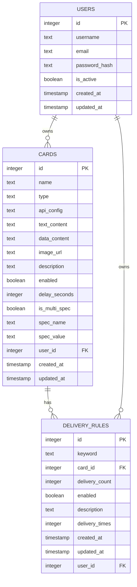
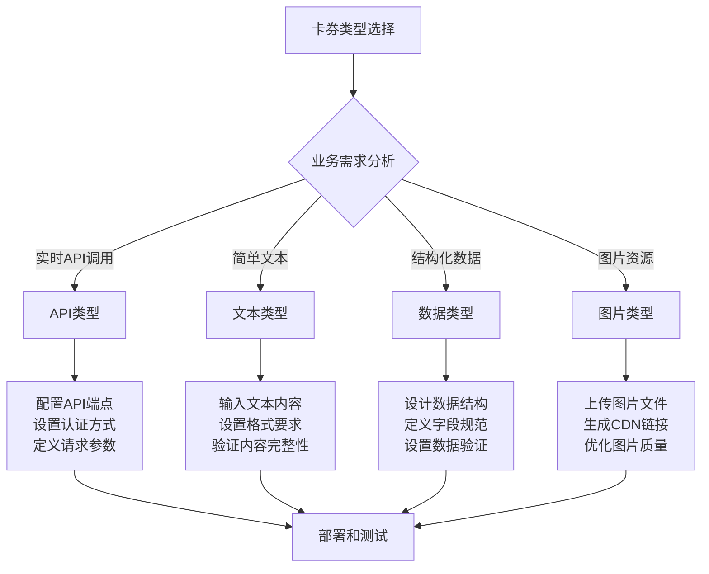
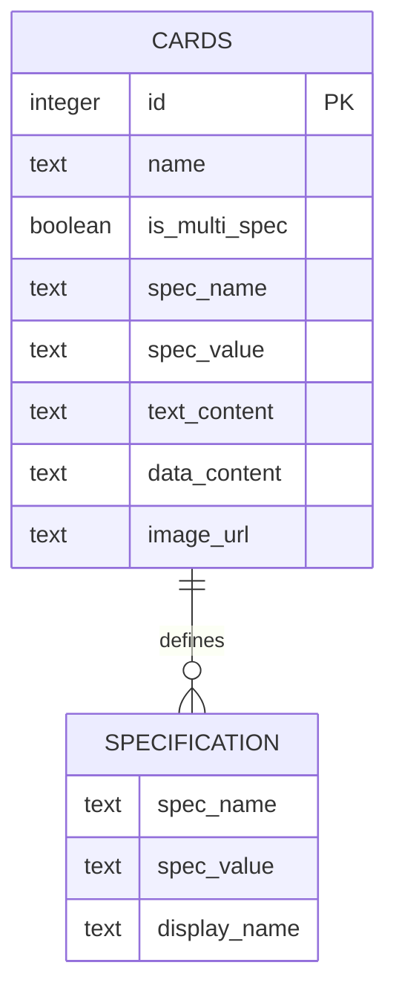
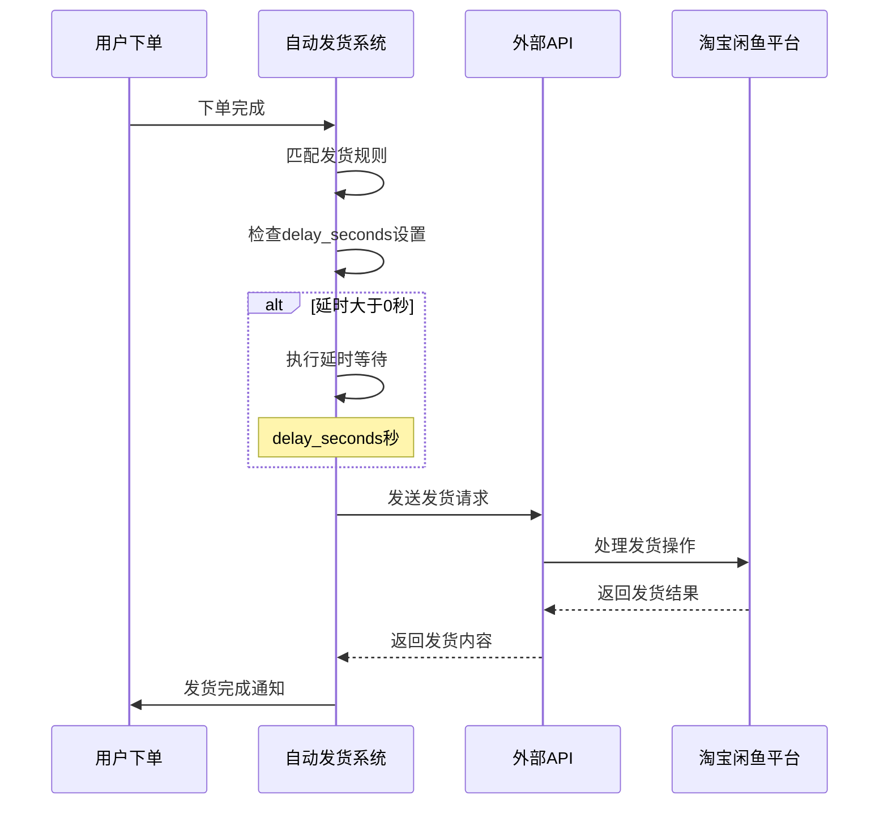
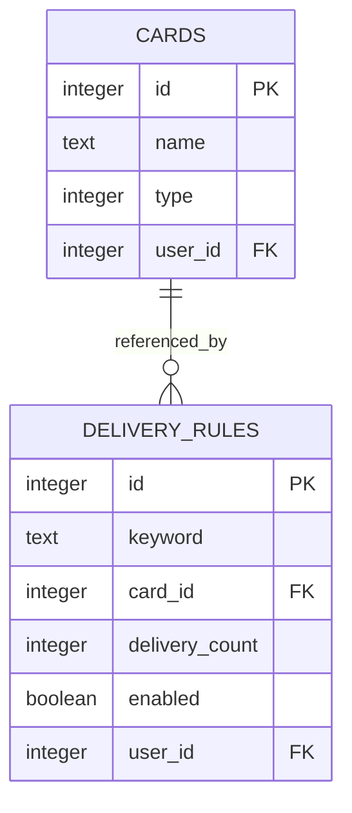
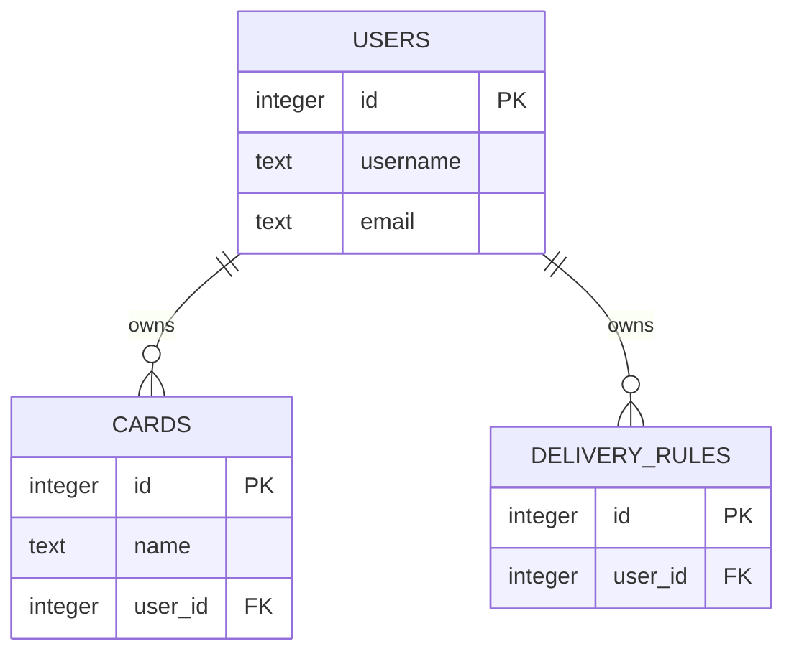

# 卡券表（cards）详细文档

<cite>
**本文档引用的文件**
- [db_manager.py](file://db_manager.py)
- [reply_server.py](file://reply_server.py)
- [XianyuAutoAsync.py](file://XianyuAutoAsync.py)
- [static/index.html](file://static/index.html)
- [static/js/app.js](file://static/js/app.js)
</cite>

## 目录
1. [简介](#简介)
2. [表结构设计](#表结构设计)
3. [核心字段详解](#核心字段详解)
4. [卡券类型分类](#卡券类型分类)
5. [API配置结构](#api配置结构)
6. [多规格支持机制](#多规格支持机制)
7. [防风控延时机制](#防风控延时机制)
8. [外键关联关系](#外键关联关系)
9. [CRUD操作接口](#crud操作接口)
10. [业务应用场景](#业务应用场景)
11. [最佳实践建议](#最佳实践建议)

## 简介

卡券表（cards）是自动发货系统的核心数据表，负责存储各种类型的卡券信息，支持多种发货方式和复杂的业务场景。该表采用SQLite数据库实现，具有良好的扩展性和用户隔离能力。

## 表结构设计



**图表来源**
- [db_manager.py](file://db_manager.py#L197-L216)
- [db_manager.py](file://db_manager.py#L295-L306)

**章节来源**
- [db_manager.py](file://db_manager.py#L197-L216)

## 核心字段详解

### 基础字段

| 字段名 | 数据类型 | 约束 | 说明 |
|--------|----------|------|------|
| `id` | INTEGER | PRIMARY KEY AUTOINCREMENT | 主键标识符，自增 |
| `name` | TEXT | NOT NULL | 卡券名称，用于识别和展示 |
| `description` | TEXT | NULLABLE | 卡券描述信息 |
| `enabled` | BOOLEAN | DEFAULT TRUE | 启用状态，控制卡券是否可用 |
| `created_at` | TIMESTAMP | DEFAULT CURRENT_TIMESTAMP | 创建时间戳 |
| `updated_at` | TIMESTAMP | DEFAULT CURRENT_TIMESTAMP | 更新时间戳 |

### 类型相关字段

| 字段名 | 数据类型 | 约束 | 用途 |
|--------|----------|------|------|
| `type` | TEXT | NOT NULL CHECK (type IN ('api', 'text', 'data', 'image')) | 卡券类型标识 |
| `api_config` | TEXT | NULLABLE | API类型卡券的配置信息（JSON格式） |
| `text_content` | TEXT | NULLABLE | 文本类型卡券的内容 |
| `data_content` | TEXT | NULLABLE | 结构化数据类型卡券的内容 |
| `image_url` | TEXT | NULLABLE | 图片类型卡券的URL地址 |

### 高级功能字段

| 字段名 | 数据类型 | 约束 | 功能说明 |
|--------|----------|------|----------|
| `delay_seconds` | INTEGER | DEFAULT 0 | 发货延时设置，用于防风控 |
| `is_multi_spec` | BOOLEAN | DEFAULT FALSE | 是否支持多规格 |
| `spec_name` | TEXT | NULLABLE | 规格名称（如套餐类型、颜色） |
| `spec_value` | TEXT | NULLABLE | 规格值（如30天、红色） |

**章节来源**
- [db_manager.py](file://db_manager.py#L197-L216)

## 卡券类型分类

系统支持四种主要的卡券类型，每种类型适用于不同的业务场景：

### API类型（api）

**业务场景**：
- 外部API调用发货
- 实时库存查询和扣减
- 第三方平台对接
- 动态内容生成

**特点**：
- 需要配置API端点和认证信息
- 支持动态参数替换
- 具备重试机制和错误处理
- 可返回结构化数据

### 文本类型（text）

**业务场景**：
- 纯文本卡密发货
- 简单的商品序列号
- 基础的兑换码
- 固定格式的内容

**特点**：
- 存储简单的文本内容
- 适合标准化的卡密格式
- 性能开销小，查询速度快

### 数据类型（data）

**业务场景**：
- 结构化数据发货
- 商品属性信息
- 用户账户信息
- 复杂的业务数据

**特点**：
- 支持JSON格式的数据存储
- 便于解析和处理复杂数据结构
- 适合需要结构化处理的场景

### 图片类型（image）

**业务场景**：
- 图片类卡券
- 二维码图片
- 电子优惠券图片
- 视觉化的商品凭证

**特点**：
- 存储图片URL地址
- 支持在线图片资源
- 适合视觉化的内容展示



**图表来源**
- [db_manager.py](file://db_manager.py#L2835-L2896)
- [static/index.html](file://static/index.html#L2528-L2803)

**章节来源**
- [db_manager.py](file://db_manager.py#L201-L201)
- [static/index.html](file://static/index.html#L2528-L2803)

## API配置结构

API类型卡券的`api_config`字段采用JSON格式存储配置信息，支持灵活的API调用配置：

### 配置项详解

| 配置项 | 数据类型 | 必填 | 说明 |
|--------|----------|------|------|
| `url` | STRING | ✓ | API服务端点地址 |
| `method` | STRING | ✓ | HTTP请求方法（GET/POST） |
| `timeout` | INTEGER | ✓ | 请求超时时间（秒） |
| `headers` | OBJECT | ✗ | 请求头配置（JSON格式） |
| `params` | OBJECT | ✗ | 请求参数（JSON格式） |
| `auth_type` | STRING | ✗ | 认证类型（basic/bearer/token） |
| `auth_token` | STRING | ✗ | 认证令牌 |

### 示例配置

```json
{
  "url": "https://api.example.com/generate-card",
  "method": "POST",
  "timeout": 10,
  "headers": {
    "Authorization": "Bearer {{access_token}}",
    "Content-Type": "application/json",
    "User-Agent": "AutoReplySystem/1.0"
  },
  "params": {
    "card_type": "{{spec_value}}",
    "quantity": 1,
    "order_id": "{{order_id}}",
    "timestamp": "{{timestamp}}"
  },
  "auth_type": "bearer",
  "auth_token": "your-api-token-here"
}
```

### 动态参数替换

系统支持在API请求中使用动态参数，这些参数会在运行时被替换为实际值：

| 参数占位符 | 替换值 | 说明 |
|------------|--------|------|
| `{{order_id}}` | 订单ID | 当前订单的唯一标识 |
| `{{item_id}}` | 商品ID | 购买的商品标识 |
| `{{buyer_id}}` | 买家ID | 购买者的用户标识 |
| `{{spec_name}}` | 规格名称 | 商品规格名称 |
| `{{spec_value}}` | 规格值 | 商品规格值 |
| `{{timestamp}}` | 时间戳 | 当前时间的时间戳 |

**章节来源**
- [XianyuAutoAsync.py](file://XianyuAutoAsync.py#L4783-L4979)
- [static/index.html](file://static/index.html#L2528-L2803)

## 多规格支持机制

多规格功能允许同一卡券名称下创建多个不同规格的卡券实例，满足复杂的业务需求：

### 多规格字段设计



**图表来源**
- [db_manager.py](file://db_manager.py#L2845-L2857)

### 多规格匹配逻辑

系统按照以下优先级匹配发货规则：

1. **完全匹配**：卡券名称 + 规格名称 + 规格值
2. **规格匹配**：卡券名称 + 规格名称
3. **兜底匹配**：仅卡券名称

### 唯一性约束

多规格卡券遵循严格的唯一性约束：
- 卡券名称 + 规格名称 + 规格值必须全局唯一
- 同一卡券名称下的规格名称不能重复
- 不同规格的卡券可以共享相同的卡券名称

### 使用场景示例

| 卡券名称 | 规格名称 | 规格值 | 业务含义 |
|----------|----------|--------|----------|
| 游戏点卡 | 套餐类型 | 30天 | 30天游戏会员 |
| 游戏点卡 | 套餐类型 | 90天 | 90天游戏会员 |
| 电子优惠券 | 面值 | 10元 | 10元购物优惠 |
| 电子优惠券 | 面值 | 50元 | 50元购物优惠 |

**章节来源**
- [db_manager.py](file://db_manager.py#L2845-L2867)
- [db_manager.py](file://db_manager.py#L3367-L3445)
- [static/index.html](file://static/index.html#L2698-L2720)

## 防风控延时机制

`delay_seconds`字段实现了智能的防风控延时机制，帮助系统规避平台的风控检测：

### 延时触发时机



**图表来源**
- [XianyuAutoAsync.py](file://XianyuAutoAsync.py#L4639-L4646)

### 延时策略

| 延时范围 | 适用场景 | 风控风险等级 |
|----------|----------|--------------|
| 0秒 | 测试环境、快速发货 | 高风险 |
| 1-3秒 | 标准发货流程 | 中风险 |
| 5-10秒 | 防风控发货 | 低风险 |
| 10秒以上 | 严格防风控 | 极低风险 |

### 动态调整机制

系统支持根据运营情况动态调整延时设置：
- 新增卡券默认延时0秒
- 支持按卡券单独设置延时
- 可通过管理界面实时调整

**章节来源**
- [XianyuAutoAsync.py](file://XianyuAutoAsync.py#L4639-L4646)
- [db_manager.py](file://db_manager.py#L208-L208)

## 外键关联关系

### 与delivery_rules表的关联



**图表来源**
- [db_manager.py](file://db_manager.py#L295-L306)

### 与users表的关联



**图表来源**
- [db_manager.py](file://db_manager.py#L215-L215)

### 关联关系说明

| 关系类型 | 表1 | 表2 | 外键字段 | 级联操作 |
|----------|-----|-----|----------|----------|
| 卡券-规则 | cards | delivery_rules | card_id → cards.id | ON DELETE CASCADE |
| 用户-卡券 | users | cards | user_id → users.id | ON DELETE CASCADE |
| 用户-规则 | users | delivery_rules | user_id → users.id | ON DELETE CASCADE |

**章节来源**
- [db_manager.py](file://db_manager.py#L295-L306)
- [db_manager.py](file://db_manager.py#L215-L215)

## CRUD操作接口

### 创建卡券（create_card）

```python
def create_card(self, name: str, card_type: str, api_config=None,
               text_content: str = None, data_content: str = None, image_url: str = None,
               description: str = None, enabled: bool = True, delay_seconds: int = 0,
               is_multi_spec: bool = False, spec_name: str = None, spec_value: str = None,
               user_id: int = None):
```

**功能特性**：
- 支持多规格卡券创建
- 自动验证唯一性约束
- JSON配置自动序列化
- 用户隔离支持

### 查询卡券（get_card_by_id/get_all_cards）

```python
def get_card_by_id(self, card_id: int, user_id: int = None):
def get_all_cards(self, user_id: int = None):
```

**查询特性**：
- 支持用户隔离查询
- 自动解析JSON配置
- 返回完整的卡券信息

### 更新卡券（update_card）

```python
def update_card(self, card_id: int, name: str = None, card_type: str = None,
               api_config=None, text_content: str = None, data_content: str = None,
               image_url: str = None, description: str = None, enabled: bool = None,
               delay_seconds: int = None, is_multi_spec: bool = None, spec_name: str = None,
               spec_value: str = None):
```

**更新特性**：
- 支持部分字段更新
- 自动处理JSON序列化
- 更新时间自动维护

### 删除卡券

系统通过级联删除实现卡券删除：
- 删除卡券时自动删除关联的发货规则
- 保证数据一致性
- 支持软删除标记

**章节来源**
- [db_manager.py](file://db_manager.py#L2835-L3115)

## 业务应用场景

### 电商自动发货

**场景描述**：
- 用户购买虚拟商品后自动发货
- 支持多种商品类型和规格
- 实现无接触式交易

**技术实现**：
- API类型卡券对接第三方平台
- 文本类型卡券处理简单卡密
- 多规格支持不同商品套餐

### 游戏充值系统

**场景描述**：
- 在线游戏充值自动发货
- 支持多种游戏和充值金额
- 实现即时到账体验

**技术实现**：
- 图片类型卡券展示充值二维码
- 数据类型卡券传递游戏账户信息
- 延时机制规避风控检测

### 优惠券发放系统

**场景描述**：
- 电商平台优惠券自动发放
- 支持满减、折扣等多种类型
- 实现精准营销投放

**技术实现**：
- 结构化数据存储优惠券信息
- 多规格支持不同面额和使用条件
- 智能匹配算法优化用户体验

### 内容订阅服务

**场景描述**：
- 数字内容订阅自动开通
- 支持不同订阅周期和权限
- 实现自动化内容分发

**技术实现**：
- API类型卡券调用内容服务
- 文本类型卡券提供访问凭据
- 多规格支持不同订阅层级

## 最佳实践建议

### 卡券命名规范

1. **清晰性原则**：使用描述性的卡券名称
   ```
   正确：游戏点卡_30天_黄金会员
   错误：卡券1、测试卡、abc
   ```

2. **一致性原则**：保持命名风格统一
   ```
   格式：业务类型_规格_附加信息
   示例：游戏点卡_90天_白金会员
   ```

3. **唯一性原则**：避免重复命名
   ```
   多规格卡券应使用完整的规格组合
   ```

### API配置最佳实践

1. **安全性**：
   - 使用HTTPS协议
   - 实施适当的认证机制
   - 定期轮换API密钥

2. **性能优化**：
   - 设置合理的超时时间
   - 实施请求限流
   - 使用连接池复用

3. **错误处理**：
   - 实施重试机制
   - 记录详细的错误日志
   - 提供降级方案

### 多规格管理建议

1. **规格设计**：
   - 合理规划规格层级
   - 避免过度细分
   - 保持规格值的语义化

2. **数据维护**：
   - 定期清理无效规格
   - 监控规格使用情况
   - 优化规格查询性能

### 防风控策略

1. **延时设置**：
   - 根据业务重要性调整延时
   - 实施随机化延时策略
   - 监控风控命中率

2. **行为模拟**：
   - 模拟正常用户行为模式
   - 避免过于规律的操作节奏
   - 实施行为特征学习

### 性能优化建议

1. **索引优化**：
   ```sql
   CREATE INDEX idx_cards_user_id ON cards(user_id);
   CREATE INDEX idx_delivery_rules_card_id ON delivery_rules(card_id);
   ```

2. **查询优化**：
   - 使用用户隔离过滤
   - 实施分页查询
   - 缓存常用查询结果

3. **存储优化**：
   - 定期清理历史数据
   - 压缩大字段内容
   - 分离频繁/不频繁访问的数据

通过合理设计和使用卡券表，可以构建高效、稳定、可扩展的自动发货系统，满足各种复杂的业务需求。