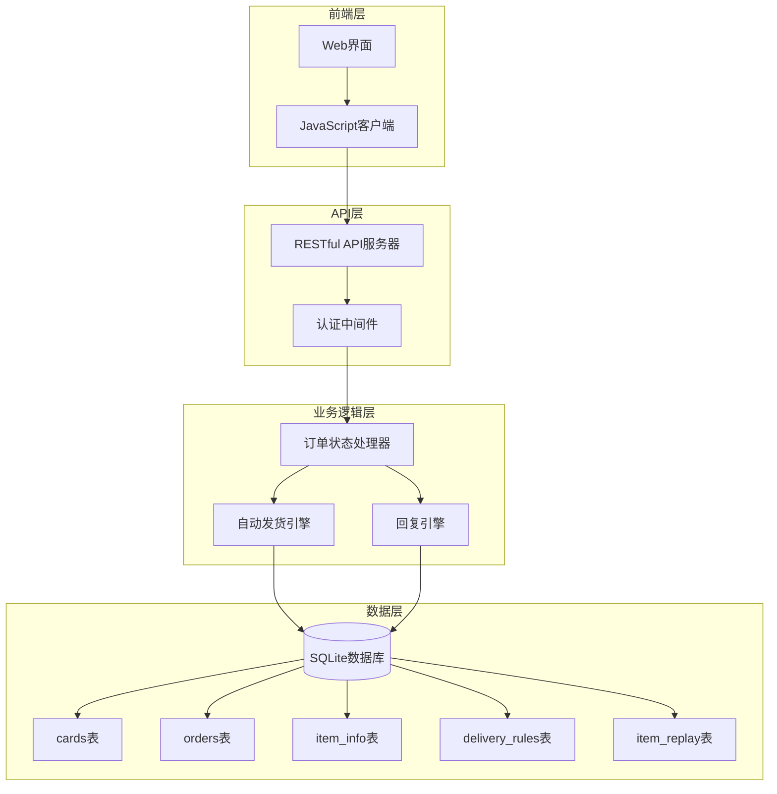
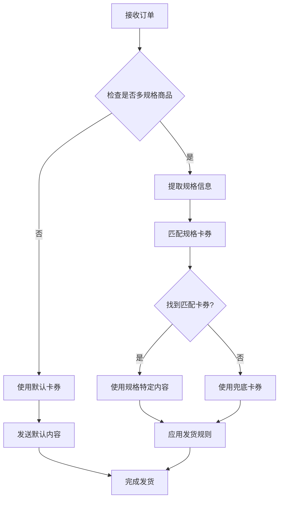
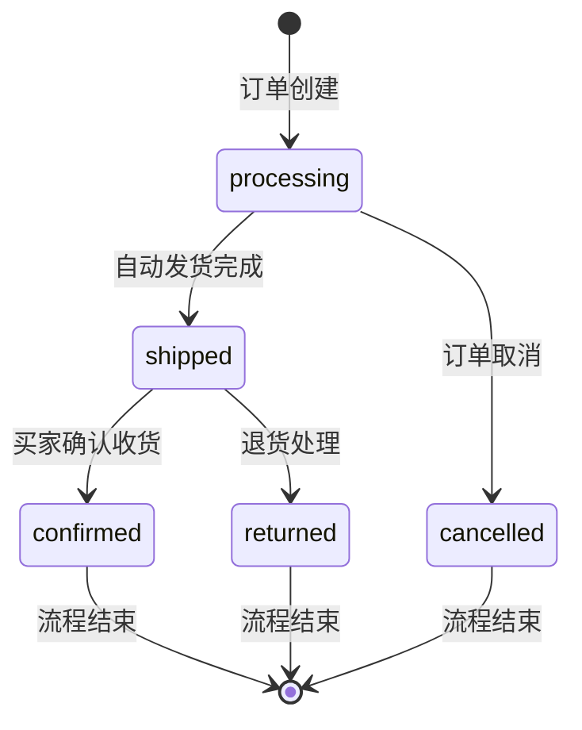
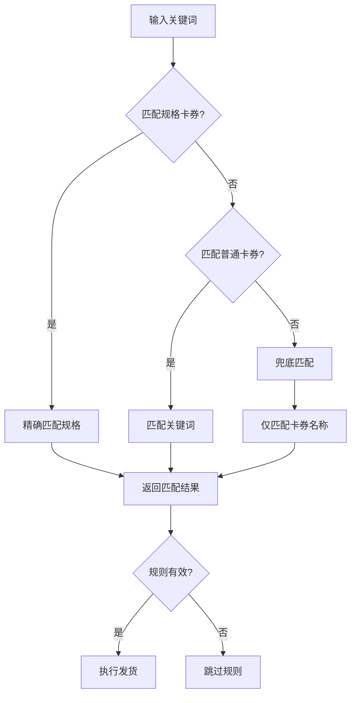
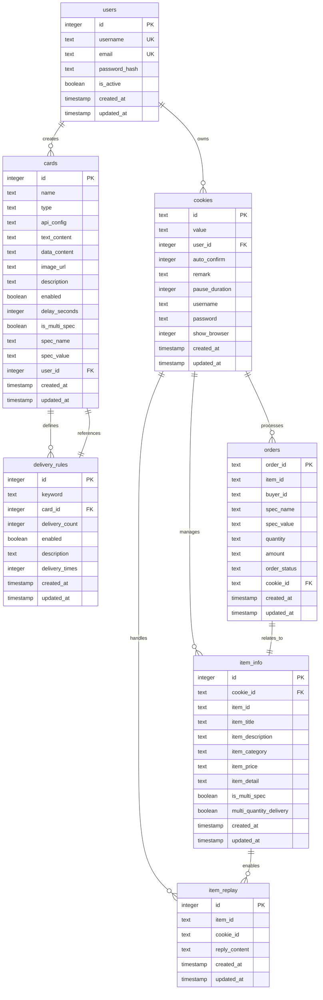
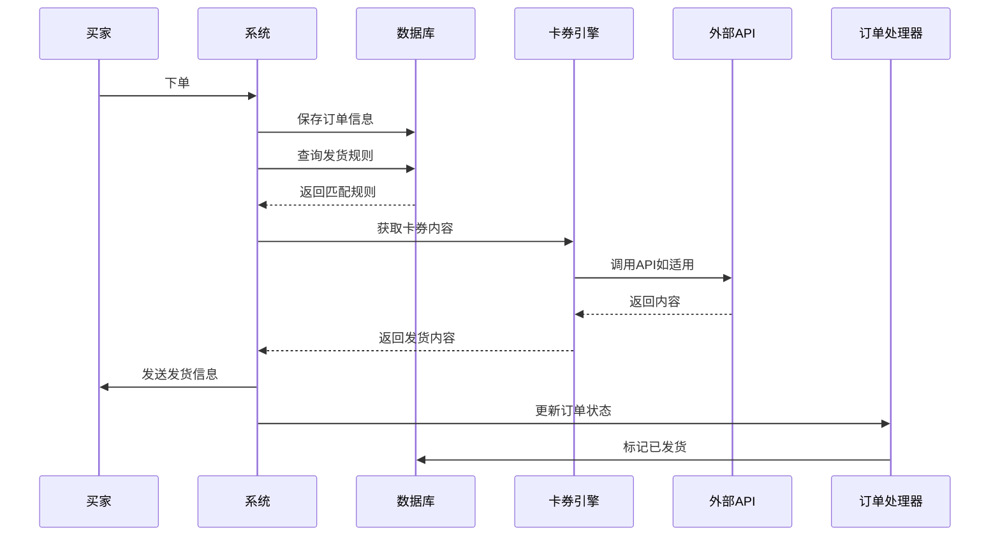
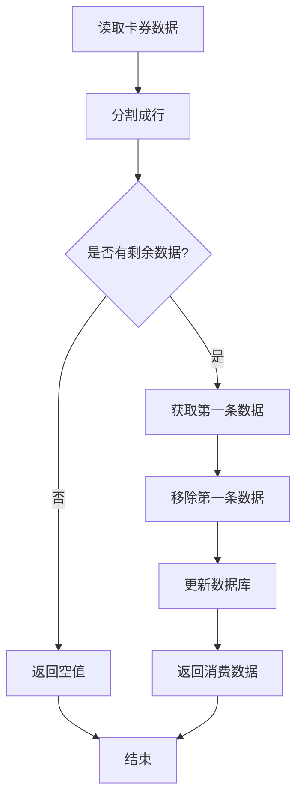
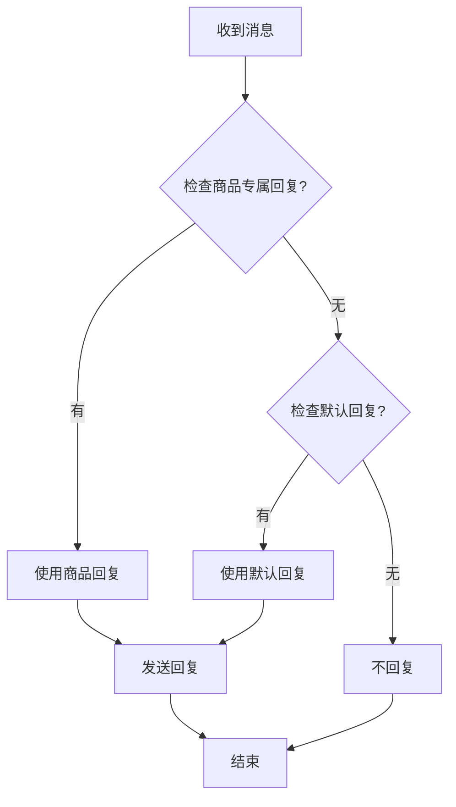
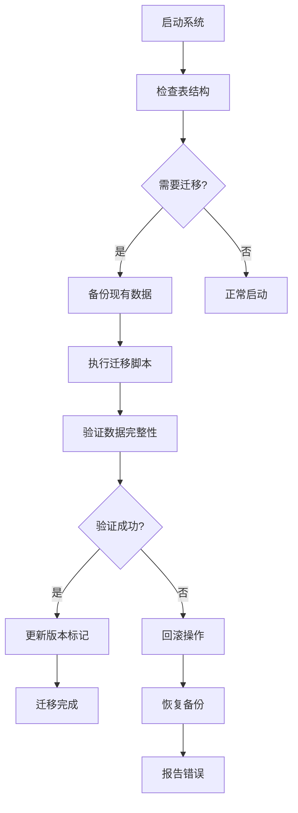
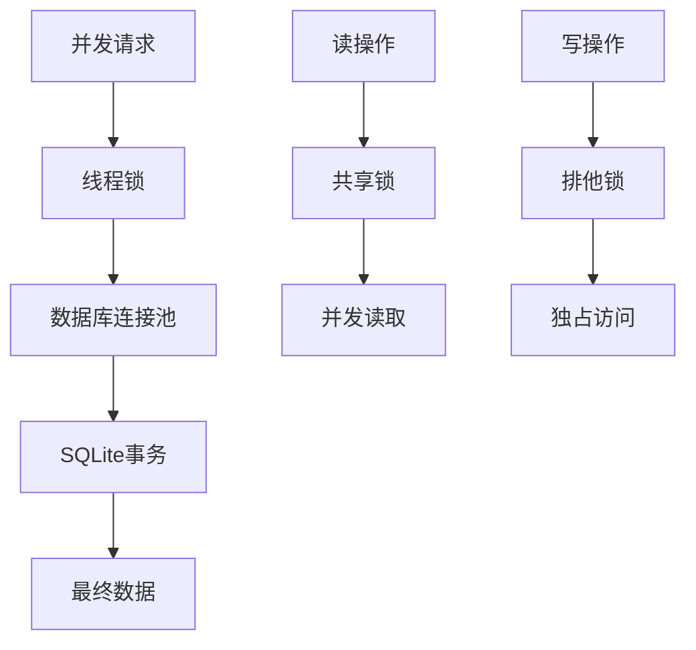

# 发货与商品表

<cite>
**本文档引用的文件**
- [db_manager.py](file://db_manager.py)
- [XianyuAutoAsync.py](file://XianyuAutoAsync.py)
- [order_status_handler.py](file://order_status_handler.py)
- [reply_server.py](file://reply_server.py)
- [static/index.html](file://static/index.html)
- [static/js/app.js](file://static/js/app.js)
</cite>

## 目录
1. [简介](#简介)
2. [项目架构概览](#项目架构概览)
3. [核心数据表分析](#核心数据表分析)
4. [表间关系与外键约束](#表间关系与外键约束)
5. [发货流程详解](#发货流程详解)
6. [商品回复机制](#商品回复机制)
7. [数据库迁移与版本控制](#数据库迁移与版本控制)
8. [性能优化策略](#性能优化策略)
9. [故障排除指南](#故障排除指南)
10. [总结](#总结)

## 简介

本文档详细分析了闲鱼自动回复系统中的发货与商品相关数据表结构，重点解析了五个核心表的设计理念和业务逻辑：`cards`（卡券表）、`orders`（订单表）、`item_info`（商品信息表）、`delivery_rules`（发货规则表）和`item_replay`（指定商品回复表）。这些表构成了系统自动发货和智能回复的核心基础设施。

系统采用SQLite数据库，通过灵活的卡券类型设计支持多种自动发货场景，包括API接口调用、固定文本回复、批量数据处理和图片内容发送等多种方式。

## 项目架构概览

系统采用模块化的数据库设计，各表之间通过外键关系建立清晰的数据关联。整体架构遵循RESTful API设计原则，前端通过JavaScript与后端API交互，实现完整的发货规则管理和商品回复功能。



**图表来源**
- [db_manager.py](file://db_manager.py#L16-L66)
- [reply_server.py](file://reply_server.py#L3778-L3807)

## 核心数据表分析

### cards表 - 卡券表

`cards`表是系统自动发货的核心组件，支持四种不同的卡券类型，每种类型对应不同的发货方式。

#### 表结构设计

| 字段名 | 数据类型 | 约束 | 说明 |
|--------|----------|------|------|
| id | INTEGER | PRIMARY KEY AUTOINCREMENT | 卡券唯一标识符 |
| name | TEXT | NOT NULL | 卡券名称，用于识别和展示 |
| type | TEXT | NOT NULL CHECK(type IN ('api', 'text', 'data', 'image')) | 卡券类型，支持API、文本、数据、图片四种类型 |
| api_config | TEXT | - | API配置信息，JSON格式存储 |
| text_content | TEXT | - | 文本内容，用于文本类型卡券 |
| data_content | TEXT | - | 批量数据内容，每行一条数据 |
| image_url | TEXT | - | 图片URL，用于图片类型卡券 |
| description | TEXT | - | 卡券描述信息 |
| enabled | BOOLEAN | DEFAULT TRUE | 是否启用该卡券 |
| delay_seconds | INTEGER | DEFAULT 0 | 发货延时秒数 |
| is_multi_spec | BOOLEAN | DEFAULT FALSE | 是否支持多规格 |
| spec_name | TEXT | - | 规格名称，配合多规格使用 |
| spec_value | TEXT | - | 规格值，配合多规格使用 |
| user_id | INTEGER | NOT NULL DEFAULT 1 | 用户ID，支持用户隔离 |
| created_at | TIMESTAMP | DEFAULT CURRENT_TIMESTAMP | 创建时间 |
| updated_at | TIMESTAMP | DEFAULT CURRENT_TIMESTAMP | 更新时间 |

#### 卡券类型详解

**1. API类型卡券**
- **用途**: 调用外部API获取动态内容
- **关键字段**: `api_config`（包含URL、请求头、参数模板等配置）
- **特点**: 支持动态参数替换，如订单ID、商品ID、买家ID等
- **应用场景**: 第三方物流查询、优惠券兑换、个性化内容生成

**2. 文本类型卡券**
- **用途**: 发送固定文本内容
- **关键字段**: `text_content`（预设的回复文本）
- **特点**: 简单高效，适合通用回复场景
- **应用场景**: 标准发货通知、常见问题解答

**3. 数据类型卡券**
- **用途**: 批量数据处理，逐条消费
- **关键字段**: `data_content`（每行一条数据）
- **特点**: 支持数据轮询，避免重复
- **应用场景**: 序列号分发、优惠码发放、激活码分配

**4. 图片类型卡券**
- **用途**: 发送图片内容
- **关键字段**: `image_url`（图片资源链接）
- **特点**: 支持静态图片展示
- **应用场景**: 商品图片、二维码、宣传海报

#### 多规格支持机制

系统通过`is_multi_spec`、`spec_name`和`spec_value`字段实现多规格商品的差异化发货：



**图表来源**
- [db_manager.py](file://db_manager.py#L3367-L3387)
- [XianyuAutoAsync.py](file://XianyuAutoAsync.py#L4717-L4727)

**节来源**
- [db_manager.py](file://db_manager.py#L196-L217)
- [db_manager.py](file://db_manager.py#L2921-L3004)

### orders表 - 订单表

`orders`表负责存储订单的基本信息，是整个发货流程的起点。

#### 表结构设计

| 字段名 | 数据类型 | 约束 | 说明 |
|--------|----------|------|------|
| order_id | TEXT | PRIMARY KEY | 订单唯一标识符 |
| item_id | TEXT | - | 商品ID |
| buyer_id | TEXT | - | 买家ID |
| spec_name | TEXT | - | 规格名称 |
| spec_value | TEXT | - | 规格值 |
| quantity | TEXT | - | 数量（字符串格式） |
| amount | TEXT | - | 金额（字符串格式） |
| order_status | TEXT | DEFAULT 'unknown' | 订单状态 |
| cookie_id | TEXT | - | 关联的账号ID |
| created_at | TIMESTAMP | DEFAULT CURRENT_TIMESTAMP | 创建时间 |
| updated_at | TIMESTAMP | DEFAULT CURRENT_TIMESTAMP | 更新时间 |

#### 订单状态管理

系统通过`order_status_handler`模块管理订单状态流转：



**图表来源**
- [order_status_handler.py](file://order_status_handler.py#L836-L872)

**节来源**
- [db_manager.py](file://db_manager.py#L220-L235)
- [XianyuAutoAsync.py](file://XianyuAutoAsync.py#L4674-L4703)

### item_info表 - 商品信息表

`item_info`表存储商品的详细信息，支持多规格和多数量发货功能。

#### 表结构设计

| 字段名 | 数据类型 | 约束 | 说明 |
|--------|----------|------|------|
| id | INTEGER | PRIMARY KEY AUTOINCREMENT | 商品信息唯一标识符 |
| cookie_id | TEXT | NOT NULL | 关联的账号ID |
| item_id | TEXT | NOT NULL | 商品ID |
| item_title | TEXT | - | 商品标题 |
| item_description | TEXT | - | 商品描述 |
| item_category | TEXT | - | 商品分类 |
| item_price | TEXT | - | 商品价格 |
| item_detail | TEXT | - | 商品详情 |
| is_multi_spec | BOOLEAN | DEFAULT FALSE | 是否多规格商品 |
| multi_quantity_delivery | BOOLEAN | DEFAULT FALSE | 是否支持多数量发货 |
| created_at | TIMESTAMP | DEFAULT CURRENT_TIMESTAMP | 创建时间 |
| updated_at | TIMESTAMP | DEFAULT CURRENT_TIMESTAMP | 更新时间 |

#### 多规格与多数量发货

**多规格标识 (`is_multi_spec`)**
- 当商品具有不同规格时设置为TRUE
- 影响发货规则匹配逻辑
- 决定是否需要规格特定的卡券

**多数量发货 (`multi_quantity_delivery`)**
- 当商品支持批量购买时设置为TRUE
- 控制发货数量的计算方式
- 影响API参数传递和内容生成

**节来源**
- [db_manager.py](file://db_manager.py#L265-L282)
- [db_manager.py](file://db_manager.py#L284-L292)

### delivery_rules表 - 发货规则表

`delivery_rules`表定义了自动发货的规则匹配逻辑，是系统智能化的核心。

#### 表结构设计

| 字段名 | 数据类型 | 约束 | 说明 |
|--------|----------|------|------|
| id | INTEGER | PRIMARY KEY AUTOINCREMENT | 规则唯一标识符 |
| keyword | TEXT | NOT NULL | 触发关键词 |
| card_id | INTEGER | NOT NULL | 关联的卡券ID |
| delivery_count | INTEGER | DEFAULT 1 | 发货数量 |
| enabled | BOOLEAN | DEFAULT TRUE | 是否启用规则 |
| description | TEXT | - | 规则描述 |
| delivery_times | INTEGER | DEFAULT 0 | 已发货次数 |
| created_at | TIMESTAMP | DEFAULT CURRENT_TIMESTAMP | 创建时间 |
| updated_at | TIMESTAMP | DEFAULT CURRENT_TIMESTAMP | 更新时间 |

#### 规则匹配算法

系统采用多层次的规则匹配策略：



**图表来源**
- [db_manager.py](file://db_manager.py#L3367-L3445)

#### 匹配优先级

1. **规格精确匹配**: 同时匹配关键词、规格名称和规格值
2. **关键词匹配**: 匹配关键词但不区分规格
3. **兜底匹配**: 仅匹配卡券名称

**节来源**
- [db_manager.py](file://db_manager.py#L294-L307)
- [db_manager.py](file://db_manager.py#L3137-L3445)

### item_replay表 - 指定商品回复表

`item_replay`表专门用于存储针对特定商品的定制化回复内容。

#### 表结构设计

| 字段名 | 数据类型 | 约束 | 说明 |
|--------|----------|------|------|
| id | INTEGER | PRIMARY KEY AUTOINCREMENT | 回复记录唯一标识符 |
| item_id | TEXT | NOT NULL | 商品ID |
| cookie_id | TEXT | NOT NULL | 关联的账号ID |
| reply_content | TEXT | NOT NULL | 回复内容 |
| created_at | TIMESTAMP | DEFAULT CURRENT_TIMESTAMP | 创建时间 |
| updated_at | TIMESTAMP | DEFAULT CURRENT_TIMESTAMP | 更新时间 |

#### 特殊用途

**商品专属回复**
- 为特定商品设置个性化的回复内容
- 支持商品特性的详细介绍
- 可包含商品参数、使用方法、注意事项等

**优先级机制**
- 系统优先检查商品专属回复
- 如无专属回复，则使用默认回复
- 支持回复内容的动态更新

**节来源**
- [db_manager.py](file://db_manager.py#L332-L341)
- [db_manager.py](file://db_manager.py#L4639-L4695)

## 表间关系与外键约束

系统通过外键关系建立清晰的数据关联，确保数据完整性和一致性。



**图表来源**
- [db_manager.py](file://db_manager.py#L110-L123)
- [db_manager.py](file://db_manager.py#L196-L217)
- [db_manager.py](file://db_manager.py#L294-L307)

### 外键约束说明

1. **用户-账号关系**: 一个用户可以拥有多个账号（cookies表）
2. **账号-订单关系**: 一个账号可以处理多个订单
3. **卡券-规则关系**: 一个卡券可以定义多个发货规则
4. **商品-回复关系**: 一个商品可以有多个回复配置

**节来源**
- [db_manager.py](file://db_manager.py#L110-L123)
- [db_manager.py](file://db_manager.py#L196-L217)
- [db_manager.py](file://db_manager.py#L294-L307)

## 发货流程详解

系统实现了完整的自动发货流程，从订单接收到内容发送的全过程。

### 发货流程架构



**图表来源**
- [XianyuAutoAsync.py](file://XianyuAutoAsync.py#L4706-L4727)
- [order_status_handler.py](file://order_status_handler.py#L836-L872)

### 卡券内容处理机制

#### API类型卡券处理

系统通过动态参数替换实现API卡券的内容生成：

```python
# 参数替换示例
formatted_content = api_template.format(
    order_id=order_id,
    item_id=item_id,
    buyer_id=buyer_id,
    spec_name=spec_name,
    spec_value=spec_value,
    quantity=quantity,
    amount=amount
)
```

#### 批量数据处理

对于数据类型卡券，系统实现了消费机制：



**图表来源**
- [db_manager.py](file://db_manager.py#L3538-L3574)

### 延时发货机制

系统支持通过`delay_seconds`字段实现延时发货：

- **延迟触发**: 在匹配到规则后等待指定秒数
- **异步处理**: 不阻塞主线程，使用异步任务队列
- **动态调整**: 支持运行时修改延时配置

**节来源**
- [XianyuAutoAsync.py](file://XianyuAutoAsync.py#L4706-L4727)
- [db_manager.py](file://db_manager.py#L3538-L3574)

## 商品回复机制

系统提供了灵活的商品回复机制，支持全局默认回复和商品专属回复的混合使用。

### 回复优先级



**图表来源**
- [XianyuAutoAsync.py](file://XianyuAutoAsync.py#L3140-L3151)

### 商品回复管理

#### 前端界面功能

系统提供了完整的商品回复管理界面：

- **批量导入**: 支持CSV格式的商品回复批量导入
- **实时编辑**: 实时编辑商品回复内容
- **筛选功能**: 按账号、商品ID等条件筛选
- **预览功能**: 实时预览回复效果

#### 数据同步机制

商品回复数据通过以下方式同步：

1. **自动同步**: 系统定期从闲鱼平台获取商品信息
2. **手动更新**: 用户可手动更新商品回复
3. **批量操作**: 支持批量删除、复制等操作

**节来源**
- [static/js/app.js](file://static/js/app.js#L6197-L6360)
- [reply_server.py](file://reply_server.py#L5045-L5085)

## 数据库迁移与版本控制

系统实现了完善的数据库迁移机制，支持表结构的动态升级和向后兼容。

### 迁移策略



**图表来源**
- [db_manager.py](file://db_manager.py#L453-L486)

### 主要迁移功能

1. **字段添加**: 动态添加新字段，如`image_url`、`multi_quantity_delivery`
2. **约束更新**: 修改表约束，如扩展卡券类型支持
3. **索引优化**: 添加性能优化索引
4. **数据转换**: 自动转换旧版数据格式

### 版本兼容性

系统通过以下机制保证版本兼容性：

- **渐进式升级**: 支持小版本间的平滑升级
- **降级支持**: 支持从新版本降级到旧版本
- **数据备份**: 迁移前自动备份重要数据

**节来源**
- [db_manager.py](file://db_manager.py#L453-L486)
- [db_manager.py](file://db_manager.py#L488-L499)

## 性能优化策略

### 数据库性能优化

#### 索引策略

系统在关键字段上建立了适当的索引：

- **主键索引**: 所有表的主键自动建立索引
- **外键索引**: 外键字段自动建立索引
- **查询频率索引**: 对频繁查询的字段建立复合索引

#### 查询优化

1. **连接优化**: 使用LEFT JOIN替代子查询
2. **字段选择**: 只查询必要的字段
3. **分页查询**: 对大数据集实施分页处理
4. **缓存机制**: 缓存频繁访问的配置数据

### 并发控制

系统采用多层并发控制机制：



**图表来源**
- [db_manager.py](file://db_manager.py#L51-L52)

### 内存管理

1. **对象池**: 复用数据库连接对象
2. **缓存策略**: 缓存热点数据
3. **垃圾回收**: 及时释放不再使用的资源

## 故障排除指南

### 常见问题诊断

#### 卡券无法匹配

**症状**: 发货规则匹配失败
**排查步骤**:
1. 检查关键词拼写
2. 验证卡券是否启用
3. 确认规则优先级
4. 检查规格匹配条件

#### API调用失败

**症状**: API类型卡券返回空内容
**排查步骤**:
1. 验证API配置正确性
2. 检查网络连接
3. 确认API响应格式
4. 查看错误日志

#### 数据库锁定

**症状**: 数据库操作超时
**排查步骤**:
1. 检查长时间运行的事务
2. 验证锁等待超时设置
3. 分析并发访问模式
4. 考虑增加连接池大小

### 性能监控

系统提供了完整的性能监控指标：

- **查询响应时间**: 监控数据库查询性能
- **并发连接数**: 监控数据库连接使用情况
- **缓存命中率**: 监控缓存效果
- **错误率统计**: 监控系统稳定性

### 日志分析

系统采用分级日志记录：

- **DEBUG**: 详细的调试信息
- **INFO**: 一般操作信息
- **WARNING**: 警告信息
- **ERROR**: 错误信息

**节来源**
- [db_manager.py](file://db_manager.py#L40-L64)

## 总结

闲鱼自动回复系统的发货与商品相关数据表设计体现了现代软件架构的最佳实践：

### 设计亮点

1. **模块化设计**: 清晰的功能分离，便于维护和扩展
2. **灵活的卡券机制**: 支持多种发货方式，适应不同业务场景
3. **智能规则匹配**: 多层次的规则匹配算法，提高准确性
4. **完善的权限控制**: 基于用户的隔离机制，保障数据安全
5. **强大的迁移能力**: 支持平滑升级，保证系统稳定性

### 技术特色

- **异步处理**: 支持高并发的自动发货处理
- **缓存优化**: 减少数据库访问，提高响应速度
- **错误恢复**: 完善的错误处理和恢复机制
- **监控告警**: 全面的系统监控和告警功能

### 应用价值

该系统为闲鱼平台提供了高效的自动化解决方案，显著提升了运营效率，降低了人工成本，同时保证了服务质量和用户体验。通过灵活的配置和强大的扩展能力，系统能够适应不断变化的业务需求，为电商平台的智能化发展提供了有力支撑。