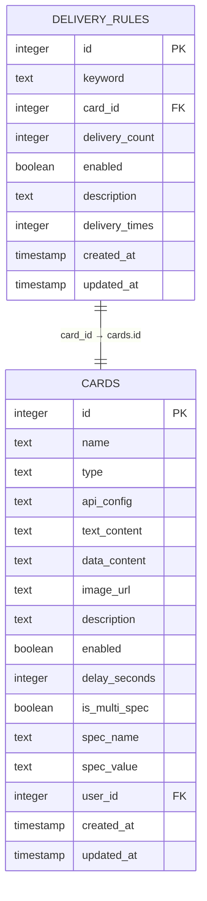
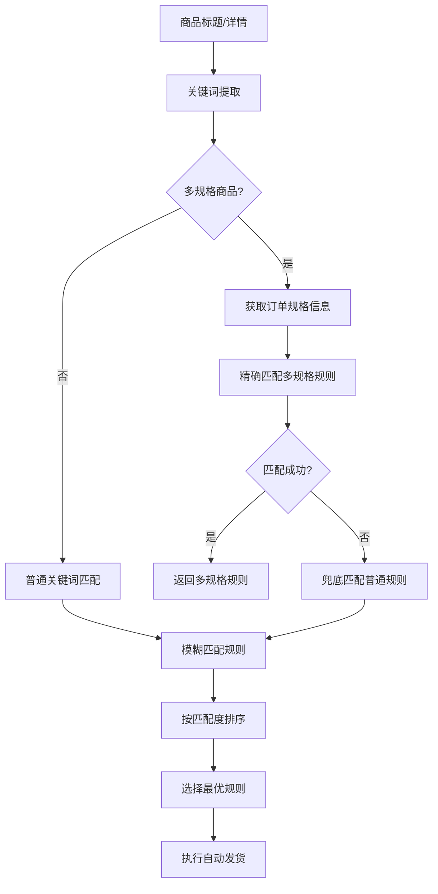
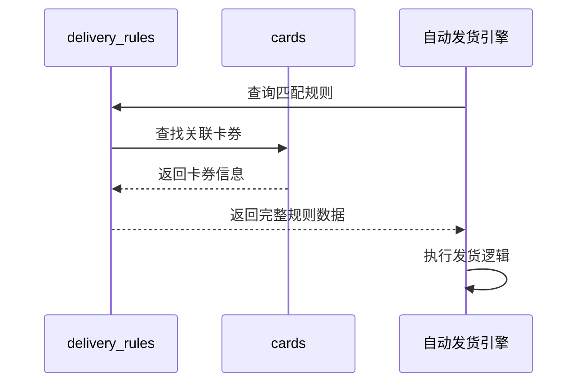
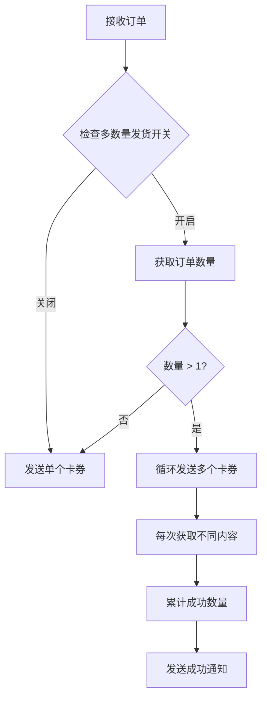

# 发货规则表（delivery_rules）详细文档

<cite>
**本文档引用的文件**
- [db_manager.py](file://db_manager.py)
- [XianyuAutoAsync.py](file://XianyuAutoAsync.py)
- [reply_server.py](file://reply_server.py)
- [static/index.html](file://static/index.html)
- [static/js/app.js](file://static/js/app.js)
</cite>

## 目录
1. [简介](#简介)
2. [表结构设计](#表结构设计)
3. [核心字段详解](#核心字段详解)
4. [匹配逻辑架构](#匹配逻辑架构)
5. [外键关联关系](#外键关联关系)
6. [批量发货机制](#批量发货机制)
7. [动态启停控制](#动态启停控制)
8. [使用统计功能](#使用统计功能)
9. [完整SQL创建语句](#完整sql创建语句)
10. [实际应用场景](#实际应用场景)
11. [最佳实践建议](#最佳实践建议)

## 简介

发货规则表（delivery_rules）是自动发货引擎的核心组件，作为整个系统的"大脑"，负责智能识别商品并触发相应的自动发货流程。该表通过关键词匹配、卡券绑定、批量处理等功能，实现了高效、精准的商品自动发货机制。

## 表结构设计



**图表来源**
- [db_manager.py](file://db_manager.py#L294-L306)
- [db_manager.py](file://db_manager.py#L197-L216)

**章节来源**
- [db_manager.py](file://db_manager.py#L294-L306)

## 核心字段详解

### keyword字段 - 关键词匹配引擎

keyword字段是发货规则的核心触发机制，采用灵活的模糊匹配策略：

#### 模糊匹配算法
- **双向匹配**：同时支持商品内容包含关键词和关键词包含在商品内容中
- **模式匹配**：使用`LIKE '%' || keyword || '%'`进行全文模糊匹配
- **智能排序**：根据匹配长度进行优先级排序，确保最相关规则优先匹配

#### 多关键词配置支持
```sql
-- 示例：支持多个关键词组合
SELECT * FROM delivery_rules 
WHERE (goods_title LIKE '%' || keyword || '%' 
       OR keyword LIKE '%' || goods_title || '%')
```

### card_id字段 - 卡券绑定核心

card_id字段建立了与cards表的一对一关联关系，实现规则与内容的精确绑定：

#### 外键约束特性
- **级联删除**：当关联的卡券被删除时，自动删除相关规则
- **完整性保证**：确保每个规则都指向有效的卡券资源
- **数据一致性**：防止出现孤立的规则记录

#### 卡券类型适配
不同类型的卡券支持不同的匹配策略：
- **文本卡券**：直接发送预设文本内容
- **数据卡券**：从批量数据中逐条消费
- **API卡券**：调用外部接口获取动态内容
- **图片卡券**：发送预设图片URL

**章节来源**
- [db_manager.py](file://db_manager.py#L3188-L3210)
- [db_manager.py](file://db_manager.py#L3361-L3445)

## 匹配逻辑架构



**图表来源**
- [XianyuAutoAsync.py](file://XianyuAutoAsync.py#L4578-L4603)
- [db_manager.py](file://db_manager.py#L3361-L3445)

### 匹配优先级策略

系统采用分层匹配策略，确保最佳的匹配效果：

#### 1. 精确匹配层
```sql
-- 多规格精确匹配
AND c.is_multi_spec = 1 
AND c.spec_name = ? 
AND c.spec_value = ?
```

#### 2. 模糊匹配层
```sql
-- 关键词模糊匹配
AND (? LIKE '%' || dr.keyword || '%' 
     OR dr.keyword LIKE '%' || ? || '%')
```

#### 3. 排序优化
```sql
-- 匹配度排序：完全匹配优先，长度较短次之
CASE
    WHEN ? LIKE '%' || dr.keyword || '%' 
    THEN LENGTH(dr.keyword)
    ELSE LENGTH(dr.keyword) / 2
END DESC
```

**章节来源**
- [db_manager.py](file://db_manager.py#L3367-L3445)

## 外键关联关系

### 与cards表的关联

delivery_rules表通过card_id字段与cards表建立外键关联，形成完整的"规则→内容"链条：



**图表来源**
- [db_manager.py](file://db_manager.py#L3144-L3161)
- [db_manager.py](file://db_manager.py#L3188-L3210)

### 用户隔离机制

系统支持多用户环境下的规则隔离：

```sql
-- 用户级别查询
SELECT * FROM delivery_rules 
WHERE user_id = ? 
ORDER BY created_at DESC
```

**章节来源**
- [db_manager.py](file://db_manager.py#L3137-L3161)
- [db_manager.py](file://db_manager.py#L3248-L3270)

## 批量发货机制

### delivery_count字段的应用

delivery_count字段在批量发货场景下发挥关键作用：

#### 单次发货 vs 批量发货
- **默认值**：1（单次发货）
- **批量场景**：支持一次购买多件商品的自动处理
- **动态计算**：根据订单数量动态调整发货数量

#### 多数量发货流程



**图表来源**
- [XianyuAutoAsync.py](file://XianyuAutoAsync.py#L1152-L1203)

#### 批量数据处理

对于数据类型的卡券，系统采用消费模式：

```python
# 数据卡券的批量处理示例
def consume_batch_data(self, card_id):
    """消费批量数据的第一条记录（线程安全）"""
    # 获取卡券的批量数据
    data_content = self.get_card_data_content(card_id)
    lines = data_content.split('\n')
    
    # 获取第一条数据并移除
    first_line = lines[0]
    remaining_lines = lines[1:]
    
    # 更新数据库
    self.update_card_data_content(card_id, '\n'.join(remaining_lines))
    return first_line
```

**章节来源**
- [db_manager.py](file://db_manager.py#L3361-L3445)
- [XianyuAutoAsync.py](file://XianyuAutoAsync.py#L1152-L1203)

## 动态启停控制

### enabled字段的开关机制

enabled字段提供了灵活的规则管理能力：

#### 规则状态管理
- **默认启用**：新创建的规则默认处于启用状态
- **动态禁用**：支持临时禁用特定规则而不删除
- **条件触发**：可根据业务需求动态调整规则状态

#### 状态查询优化
```sql
-- 只查询启用的规则
SELECT * FROM delivery_rules 
WHERE enabled = 1 
AND c.enabled = 1
```

#### 实际应用场景
- **节假日促销**：临时禁用某些促销规则
- **维护期间**：暂停所有发货规则
- **测试环境**：启用测试专用规则

**章节来源**
- [db_manager.py](file://db_manager.py#L3188-L3210)
- [db_manager.py](file://db_manager.py#L3361-L3445)

## 使用统计功能

### delivery_times字段的作用

delivery_times字段记录规则的使用频率，为运营分析提供数据支持：

#### 统计功能实现
```python
def increment_delivery_times(self, rule_id: int):
    """增加发货次数"""
    cursor.execute('''
    UPDATE delivery_rules
    SET delivery_times = delivery_times + 1, 
        updated_at = CURRENT_TIMESTAMP
    WHERE id = ?
    ''', (rule_id,))
```

#### 数据分析价值
- **热门规则识别**：找出使用频率最高的发货规则
- **效果评估**：监控规则的实际效果和转化率
- **优化建议**：基于统计数据优化规则配置

#### 统计查询示例
```sql
-- 查询最活跃的发货规则
SELECT id, keyword, delivery_times 
FROM delivery_rules 
ORDER BY delivery_times DESC 
LIMIT 10;

-- 查询规则使用统计
SELECT COUNT(*) as total_rules, 
       SUM(CASE WHEN enabled = 1 THEN 1 ELSE 0 END) as active_rules,
       SUM(delivery_times) as total_deliveries
FROM delivery_rules;
```

**章节来源**
- [db_manager.py](file://db_manager.py#L3346-L3360)

## 完整SQL创建语句

以下是完整的发货规则表创建语句，包含所有字段和约束：

```sql
CREATE TABLE IF NOT EXISTS delivery_rules (
    id INTEGER PRIMARY KEY AUTOINCREMENT,
    keyword TEXT NOT NULL,
    card_id INTEGER NOT NULL,
    delivery_count INTEGER DEFAULT 1,
    enabled BOOLEAN DEFAULT TRUE,
    description TEXT,
    delivery_times INTEGER DEFAULT 0,
    created_at TIMESTAMP DEFAULT CURRENT_TIMESTAMP,
    updated_at TIMESTAMP DEFAULT CURRENT_TIMESTAMP,
    FOREIGN KEY (card_id) REFERENCES cards(id) ON DELETE CASCADE
);

-- 添加索引以提高查询性能
CREATE INDEX IF NOT EXISTS idx_delivery_rules_card_id ON delivery_rules(card_id);
CREATE INDEX IF NOT EXISTS idx_delivery_rules_enabled ON delivery_rules(enabled);
CREATE INDEX IF NOT EXISTS idx_delivery_rules_created_at ON delivery_rules(created_at);
```

### 外键关系说明

- **card_id → cards.id**：建立与卡券表的一对一关联
- **ON DELETE CASCADE**：级联删除确保数据一致性
- **索引优化**：为card_id字段创建索引提升查询效率

**章节来源**
- [db_manager.py](file://db_manager.py#L294-L306)

## 实际应用场景

### 场景一：游戏点卡自动发货

```sql
-- 游戏点卡规则配置
INSERT INTO delivery_rules (keyword, card_id, delivery_count, enabled, description)
VALUES ('游戏点卡', 101, 1, TRUE, '自动发货游戏充值点卡');

-- 多规格游戏卡券
INSERT INTO delivery_rules (keyword, card_id, delivery_count, enabled, description)
VALUES ('英雄联盟点卡', 102, 1, TRUE, '英雄联盟充值卡自动发货');
```

### 场景二：会员卡自动激活

```sql
-- 会员卡规则配置
INSERT INTO delivery_rules (keyword, card_id, delivery_count, enabled, description)
VALUES ('VIP会员', 201, 1, TRUE, 'VIP会员资格自动激活');

-- 批量会员卡
INSERT INTO delivery_rules (keyword, card_id, delivery_count, enabled, description)
VALUES ('企业会员', 202, 10, TRUE, '企业会员批量激活');
```

### 场景三：虚拟物品自动发货

```sql
-- 虚拟物品规则配置
INSERT INTO delivery_rules (keyword, card_id, delivery_count, enabled, description)
VALUES ('皮肤兑换码', 301, 1, TRUE, '游戏皮肤自动发货');

-- 批量虚拟物品
INSERT INTO delivery_rules (keyword, card_id, delivery_count, enabled, description)
VALUES ('道具包', 302, 5, TRUE, '批量道具包发货');
```

## 最佳实践建议

### 1. 关键词设计原则
- **简洁明确**：关键词应简短且具有代表性
- **避免冲突**：不同规则的关键词应尽量避免重叠
- **分类清晰**：按商品类型设计专门的关键词

### 2. 规则组织策略
- **优先级管理**：高频使用的规则放在前面
- **定期清理**：定期审查和清理失效规则
- **测试验证**：新规则上线前充分测试

### 3. 性能优化建议
- **索引维护**：定期检查和优化索引
- **查询优化**：避免复杂的JOIN操作
- **缓存策略**：对频繁查询的结果进行缓存

### 4. 运营监控指标
- **命中率**：规则被触发的频率
- **成功率**：发货成功的比例
- **响应时间**：规则匹配的平均耗时

### 5. 安全注意事项
- **权限控制**：确保只有授权用户可以修改规则
- **审计日志**：记录所有规则变更操作
- **备份策略**：定期备份规则配置数据

通过以上详细的文档说明，发货规则表（delivery_rules）作为自动发货引擎的核心组件，不仅实现了智能化的商品识别和自动发货，还提供了灵活的配置选项和强大的扩展能力，为企业级应用提供了可靠的技术支撑。