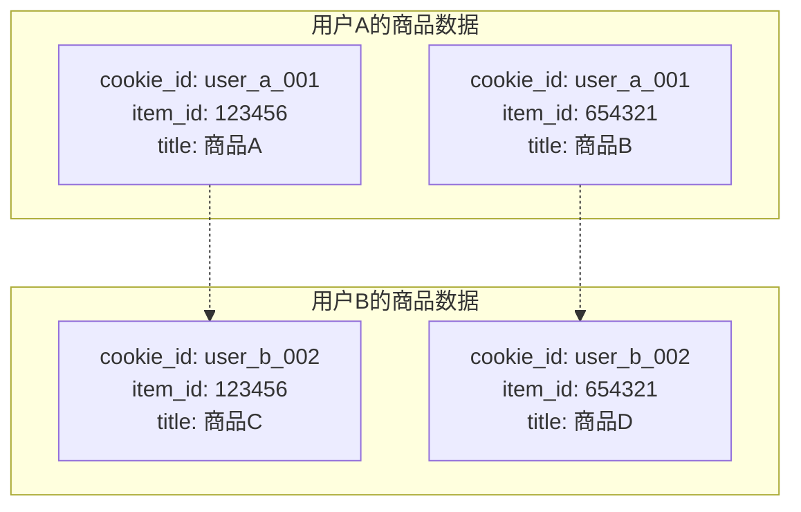
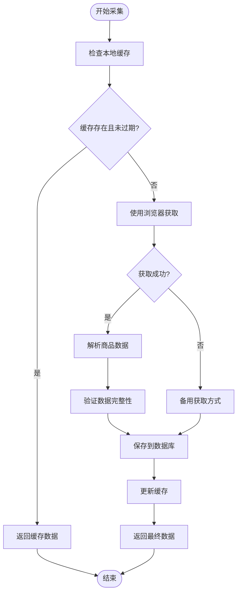
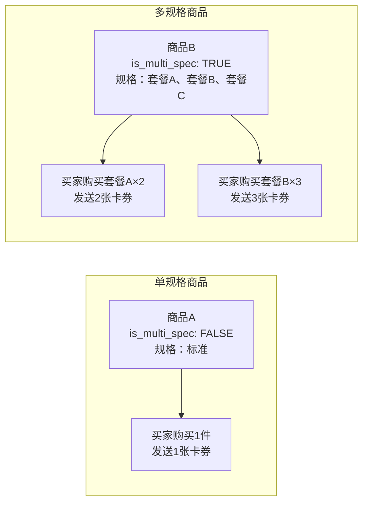
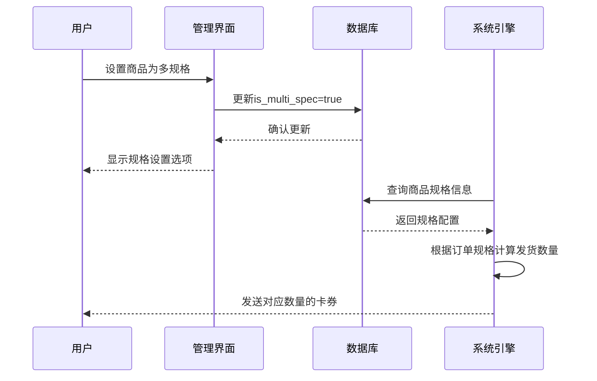
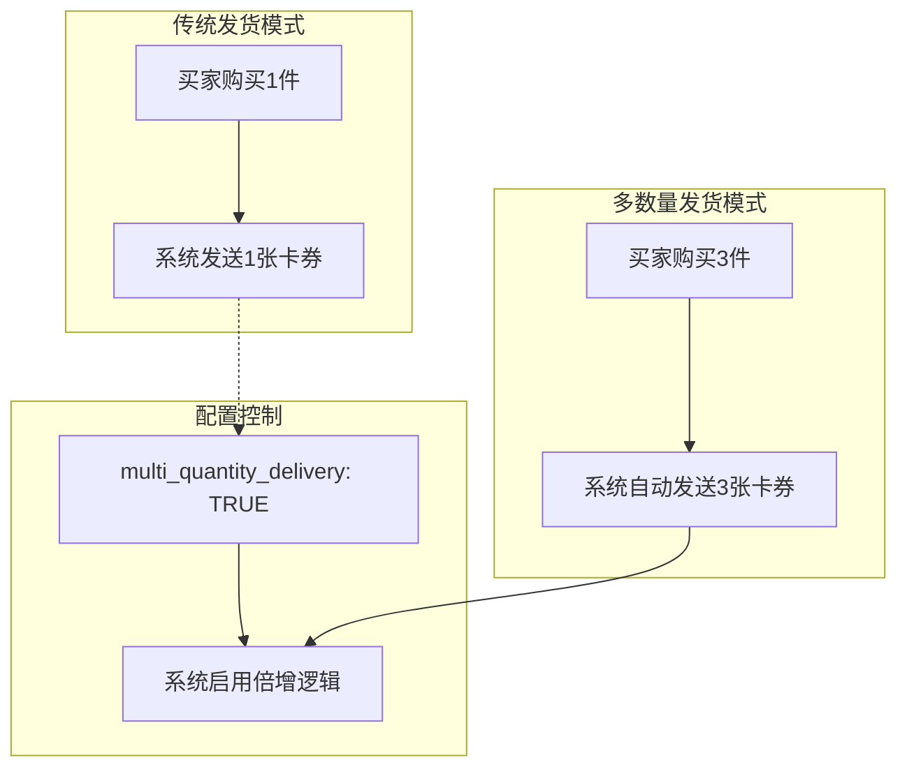
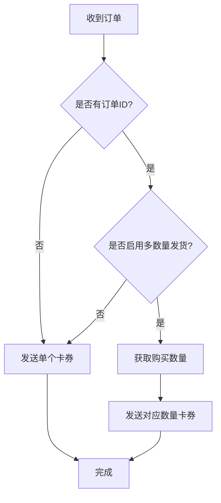
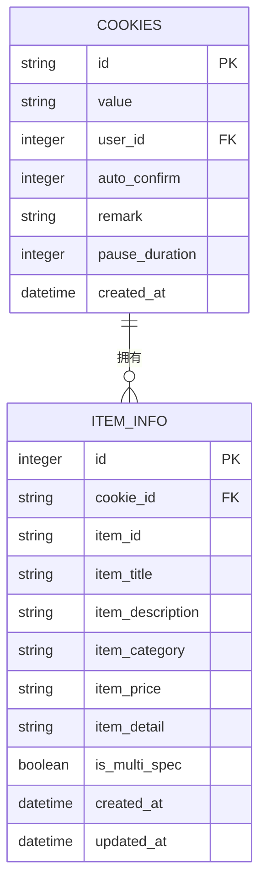
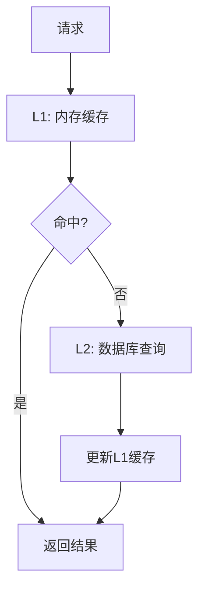

# 商品信息表（item_info）详细文档

<cite>
**本文档引用的文件**
- [db_manager.py](file://db_manager.py)
- [XianyuAutoAsync.py](file://XianyuAutoAsync.py)
- [reply_server.py](file://reply_server.py)
- [secure_confirm_decrypted.py](file://secure_confirm_decrypted.py)
- [utils/order_detail_fetcher.py](file://utils/order_detail_fetcher.py)
- [static/js/app.js](file://static/js/app.js)
- [static/index.html](file://static/index.html)
</cite>

## 目录
1. [概述](#概述)
2. [表结构设计](#表结构设计)
3. [核心字段详解](#核心字段详解)
4. [数据采集与更新机制](#数据采集与更新机制)
5. [多规格商品识别机制](#多规格商品识别机制)
6. [多数量发货功能](#多数量发货功能)
7. [数据完整性保障](#数据完整性保障)
8. [API接口与管理](#api接口与管理)
9. [性能优化策略](#性能优化策略)
10. [最佳实践建议](#最佳实践建议)

## 概述

商品信息表（item_info）是整个系统中商品管理功能的核心数据表，承担着存储和管理所有商品基本信息的重要职责。该表采用独特的设计架构，通过cookie_id与item_id的联合唯一索引确保每个账号对商品信息的独立存储，实现了严格的数据隔离和用户权限控制。

### 核心设计理念

- **用户隔离**：通过cookie_id确保不同账号的商品数据完全独立
- **数据完整性**：联合唯一索引防止重复商品记录
- **扩展性**：支持多规格商品和多数量发货等高级功能
- **并发安全**：内置锁机制确保数据一致性

## 表结构设计

### 完整DDL创建语句

```sql
CREATE TABLE IF NOT EXISTS item_info (
    id INTEGER PRIMARY KEY AUTOINCREMENT,
    cookie_id TEXT NOT NULL,
    item_id TEXT NOT NULL,
    item_title TEXT,
    item_description TEXT,
    item_category TEXT,
    item_price TEXT,
    item_detail TEXT,
    is_multi_spec BOOLEAN DEFAULT FALSE,
    created_at TIMESTAMP DEFAULT CURRENT_TIMESTAMP,
    updated_at TIMESTAMP DEFAULT CURRENT_TIMESTAMP,
    FOREIGN KEY (cookie_id) REFERENCES cookies(id) ON DELETE CASCADE,
    UNIQUE(cookie_id, item_id)
)
```

### 字段说明表

| 字段名 | 数据类型 | 是否必填 | 默认值 | 说明 |
|--------|----------|----------|--------|------|
| id | INTEGER | 是 | - | 主键，自增标识符 |
| cookie_id | TEXT | 是 | - | 关联的Cookie ID，确保用户隔离 |
| item_id | TEXT | 是 | - | 商品唯一标识符 |
| item_title | TEXT | 否 | - | 商品标题，支持中文和英文 |
| item_description | TEXT | 否 | - | 商品描述信息 |
| item_category | TEXT | 否 | - | 商品分类信息 |
| item_price | TEXT | 否 | - | 商品价格字符串 |
| item_detail | TEXT | 否 | - | 商品详细信息（JSON格式） |
| is_multi_spec | BOOLEAN | 否 | FALSE | 是否为多规格商品 |
| created_at | TIMESTAMP | 否 | CURRENT_TIMESTAMP | 记录创建时间 |
| updated_at | TIMESTAMP | 否 | CURRENT_TIMESTAMP | 记录最后更新时间 |

**节源**
- [db_manager.py](file://db_manager.py#L266-L282)

## 核心字段详解

### cookie_id与item_id联合唯一索引

#### 设计原理
联合唯一索引（cookie_id, item_id）是系统数据隔离的核心机制：



**图表源**
- [db_manager.py](file://db_manager.py#L280)

#### 数据隔离优势
1. **严格权限控制**：每个用户只能访问自己的商品数据
2. **防止数据泄露**：不同账号间的数据完全隔离
3. **简化查询逻辑**：通过单一字段即可定位用户数据

### 商品基本信息字段

#### item_title（商品标题）
- **用途**：显示在商品列表和回复中
- **长度限制**：无硬性限制，但建议不超过200字符
- **更新策略**：支持增量更新，保留原有数据

#### item_description（商品描述）
- **用途**：提供商品详细说明
- **格式要求**：支持HTML标签和纯文本
- **缓存机制**：24小时缓存策略

#### item_category（商品分类）
- **用途**：用于商品分类管理和搜索
- **数据来源**：自动抓取或手动输入
- **更新频率**：定期同步更新

#### item_price（商品价格）
- **用途**：显示在商品回复中
- **格式规范**：支持多种货币格式
- **精度控制**：保留两位小数

#### item_detail（商品详情）
- **数据格式**：JSON字符串
- **存储内容**：商品属性、规格、图片等
- **解析机制**：自动JSON解析和缓存

**节源**
- [db_manager.py](file://db_manager.py#L3578-L3658)
- [db_manager.py](file://db_manager.py#L3660-L3751)

## 数据采集与更新机制

### 自动采集流程



**图表源**
- [XianyuAutoAsync.py](file://XianyuAutoAsync.py#L2500-L2550)

### 数据更新策略

#### 1. 增量更新机制
系统采用智能更新策略，只更新发生变化的字段：

```python
# 条件更新示例（伪代码）
UPDATE item_info SET
    item_title = CASE WHEN (item_title IS NULL OR item_title = '') AND ? != '' THEN ? ELSE item_title END,
    item_description = CASE WHEN (item_description IS NULL OR item_description = '') AND ? != '' THEN ? ELSE item_description END,
    item_category = CASE WHEN (item_category IS NULL OR item_category = '') AND ? != '' THEN ? ELSE item_category END,
    item_price = CASE WHEN (item_price IS NULL OR item_price = '') AND ? != '' THEN ? ELSE item_price END,
    item_detail = CASE WHEN (item_detail IS NULL OR item_detail = '' OR TRIM(item_detail) = '') AND ? != '' THEN ? ELSE item_detail END,
    updated_at = CURRENT_TIMESTAMP
WHERE cookie_id = ? AND item_id = ?
```

#### 2. 并发安全保障
- **数据库锁**：使用SQLite的行级锁
- **事务控制**：确保操作的原子性
- **重试机制**：网络异常时自动重试

#### 3. 缓存策略
- **TTL设置**：24小时缓存有效期
- **LRU淘汰**：内存不足时自动清理
- **预热机制**：热点商品提前加载

**节源**
- [db_manager.py](file://db_manager.py#L4080-L4099)
- [XianyuAutoAsync.py](file://XianyuAutoAsync.py#L2442-L2479)

## 多规格商品识别机制

### is_multi_spec字段的作用

#### 功能定义
`is_multi_spec`字段用于标识商品是否为多规格商品，该字段在商品管理中具有决定性作用。

#### 业务场景分析



**图表源**
- [db_manager.py](file://db_manager.py#L3823-L3841)

#### 识别与管理流程



**图表源**
- [db_manager.py](file://db_manager.py#L3823-L3841)
- [static/js/app.js](file://static/js/app.js#L5351-L5375)

### 多规格商品的交互逻辑调整

#### 1. 商品列表展示
- **标记显示**：在商品列表中标记多规格商品
- **规格预览**：显示主要规格信息

#### 2. 回复内容定制
- **规格匹配**：根据买家选择的规格发送相应回复
- **动态内容**：支持规格相关的动态内容生成

#### 3. 订单处理优化
- **规格解析**：自动解析订单中的规格信息
- **数量计算**：根据规格和购买数量计算发货数量

**节源**
- [utils/order_detail_fetcher.py](file://utils/order_detail_fetcher.py#L361-L395)

## 多数量发货功能

### multi_quantity_delivery字段详解

#### 字段定义
`multi_quantity_delivery`字段控制商品是否启用"买几发几"功能，即根据买家实际购买数量自动倍增发货内容。

#### 业务含义



**图表源**
- [XianyuAutoAsync.py](file://XianyuAutoAsync.py#L1177-L1183)

#### 启用条件判断

系统在发货前会进行以下检查：

```python
# 发货逻辑伪代码
if not order_id:
    # 无订单ID，发送单个卡券
    send_single_card()
elif not multi_quantity_delivery:
    # 多数量发货未启用，发送单个卡券
    send_single_card()
else:
    # 多数量发货启用，根据购买数量发送
    send_multiple_cards(order_quantity)
```

#### 实际应用场景

1. **批量购买优惠**：买家购买多件商品时自动发送多张卡券
2. **套餐销售**：不同规格的套餐自动对应相应的卡券数量
3. **促销活动**：特定商品在促销期间自动启用多数量发货

### 系统交互逻辑调整

#### 1. 订单处理流程


**图表源**
- [XianyuAutoAsync.py](file://XianyuAutoAsync.py#L1177-L1183)

#### 2. 规则匹配机制
系统采用智能匹配算法：
- **精确匹配**：优先匹配规格信息
- **兜底匹配**：无规格时使用普通规则
- **多规则支持**：支持多个匹配规则并行处理

**节源**
- [db_manager.py](file://db_manager.py#L3842-L3883)
- [XianyuAutoAsync.py](file://XianyuAutoAsync.py#L4578-L4603)

## 数据完整性保障

### 外键关联关系

#### 与cookies表的关联
```sql
FOREIGN KEY (cookie_id) REFERENCES cookies(id) ON DELETE CASCADE
```

#### 关联关系图



**图表源**
- [db_manager.py](file://db_manager.py#L279)
- [db_manager.py](file://db_manager.py#L122)

### 数据验证机制

#### 1. 输入验证
- **格式检查**：确保商品ID格式正确
- **长度限制**：控制字段长度防止溢出
- **编码处理**：UTF-8编码保证中文字符正常存储

#### 2. 业务规则验证
- **唯一性检查**：联合唯一索引确保商品不重复
- **关联性验证**：外键约束保证数据完整性
- **状态一致性**：多规格状态与实际数据的一致性

#### 3. 异常处理
- **事务回滚**：操作失败时自动回滚
- **重试机制**：网络异常时自动重试
- **日志记录**：详细的操作日志便于排查

**节源**
- [db_manager.py](file://db_manager.py#L265-L282)

## API接口与管理

### 商品信息管理API

#### 1. 获取商品信息
```python
@app.get("/items/{cookie_id}/{item_id}")
def get_item_info(cookie_id: str, item_id: str, current_user: Dict = Depends(get_current_user)):
    """获取指定商品信息"""
    # 权限验证
    user_cookies = db_manager.get_all_cookies(current_user['user_id'])
    if cookie_id not in user_cookies:
        raise HTTPException(status_code=403, detail="无权限访问")
    
    return db_manager.get_item_info(cookie_id, item_id)
```

#### 2. 更新商品信息
```python
@app.put("/items/{cookie_id}/{item_id}")
def update_item_info(cookie_id: str, item_id: str, data: dict, current_user: Dict = Depends(get_current_user)):
    """更新商品信息"""
    # 权限验证和数据验证逻辑
    return db_manager.save_item_info(cookie_id, item_id, data)
```

#### 3. 多规格状态管理
```python
@app.put("/items/{cookie_id}/{item_id}/multi-spec")
def update_multi_spec_status(cookie_id: str, item_id: str, data: dict, current_user: Dict = Depends(get_current_user)):
    """更新多规格状态"""
    return db_manager.update_item_multi_spec_status(cookie_id, item_id, data['is_multi_spec'])
```

### 管理界面功能

#### 1. 商品列表管理
- **分页显示**：支持大数据量的商品列表
- **筛选功能**：按账号、状态、分类筛选
- **批量操作**：支持批量启用/禁用多规格

#### 2. 数据导入导出
- **批量导入**：支持Excel格式的商品信息导入
- **数据导出**：支持CSV格式的数据导出
- **格式验证**：导入前进行格式和内容验证

#### 3. 状态监控
- **实时统计**：显示各账号的商品数量统计
- **质量监控**：商品信息完整度监控
- **异常告警**：数据异常时及时告警

**节源**
- [reply_server.py](file://reply_server.py#L5018-L5085)
- [static/js/app.js](file://static/js/app.js#L5351-L5403)

## 性能优化策略

### 查询优化

#### 1. 索引策略
- **联合索引**：`(cookie_id, item_id)`确保查询效率
- **时间索引**：`(created_at, updated_at)`支持时间范围查询
- **全文索引**：对商品标题和描述建立全文搜索支持

#### 2. 查询优化技巧
```python
# 优化的查询示例
cursor.execute('''
SELECT * FROM item_info 
WHERE cookie_id = ? 
ORDER BY updated_at DESC 
LIMIT 100
''', (cookie_id,))
```

### 缓存优化

#### 1. 多层缓存架构


#### 2. 缓存策略
- **TTL管理**：24小时默认缓存时间
- **LRU淘汰**：内存不足时自动清理
- **预热机制**：热点商品提前加载

### 并发优化

#### 1. 锁机制
- **读写分离**：读操作无锁，写操作加锁
- **细粒度锁**：按商品ID进行行级锁定
- **超时控制**：防止死锁发生

#### 2. 事务管理
- **原子操作**：关键操作使用事务保证一致性
- **批量处理**：减少数据库连接次数
- **异步处理**：非关键操作异步执行

**节源**
- [db_manager.py](file://db_manager.py#L3576-L3658)

## 最佳实践建议

### 数据管理最佳实践

#### 1. 商品信息维护
- **定期清理**：定期清理无效和过期的商品信息
- **数据备份**：重要数据定期备份
- **版本控制**：敏感数据变更记录版本

#### 2. 性能监控
- **响应时间**：监控查询响应时间
- **并发量**：监控并发访问量
- **资源使用**：监控CPU和内存使用情况

#### 3. 安全防护
- **权限控制**：严格的用户权限管理
- **数据加密**：敏感数据加密存储
- **审计日志**：所有操作记录审计日志

### 开发维护建议

#### 1. 代码规范
- **函数封装**：将复杂逻辑封装成独立函数
- **错误处理**：完善的异常处理机制
- **文档注释**：详细的代码注释和文档

#### 2. 测试策略
- **单元测试**：关键功能编写单元测试
- **集成测试**：测试各模块间的集成
- **压力测试**：测试高并发场景下的性能

#### 3. 运维监控
- **健康检查**：定期检查数据库健康状况
- **性能监控**：监控系统性能指标
- **故障恢复**：建立完善的故障恢复机制

### 扩展性考虑

#### 1. 功能扩展
- **插件机制**：支持功能插件扩展
- **配置化**：通过配置文件控制功能开关
- **API开放**：提供标准化的API接口

#### 2. 性能扩展
- **水平扩展**：支持多实例部署
- **读写分离**：主从数据库架构
- **分布式缓存**：Redis等分布式缓存

#### 3. 技术升级
- **数据库升级**：支持数据库版本升级
- **架构演进**：支持架构重构和升级
- **技术栈更新**：支持新技术栈引入

通过以上详细的设计和实现，商品信息表（item_info）不仅满足了基本的商品管理需求，还具备了强大的扩展性和良好的用户体验，为整个系统的稳定运行提供了坚实的数据基础。