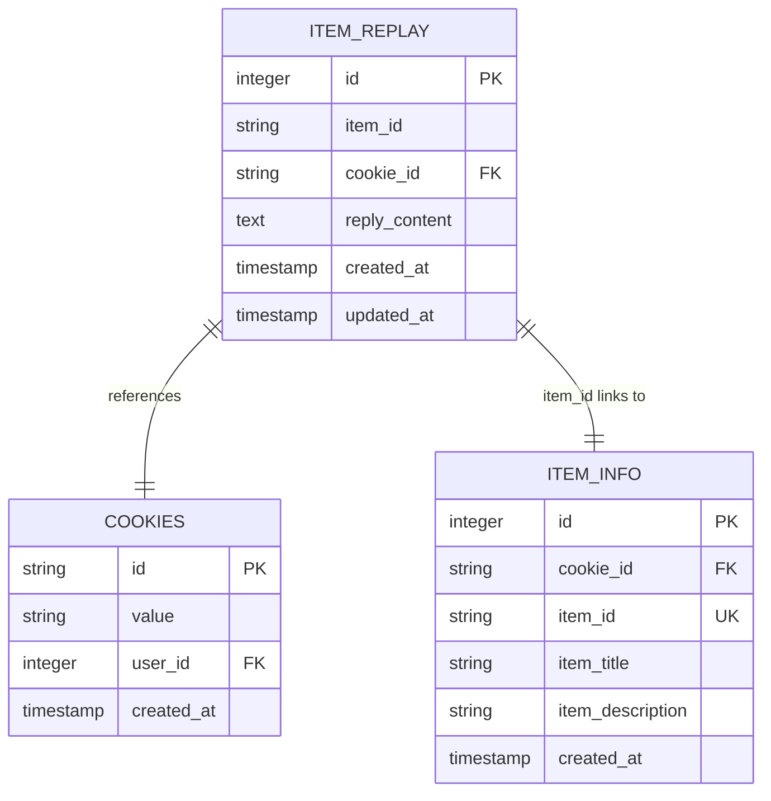
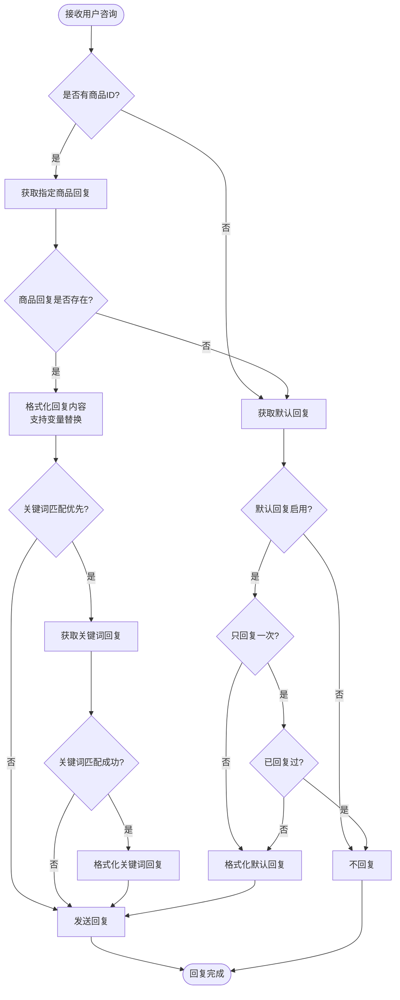
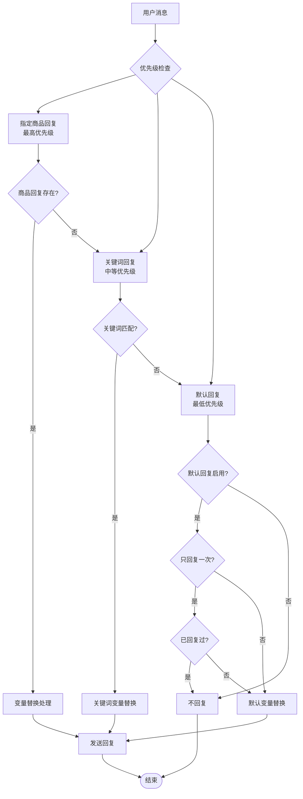
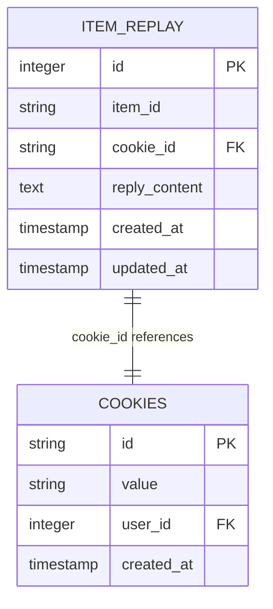
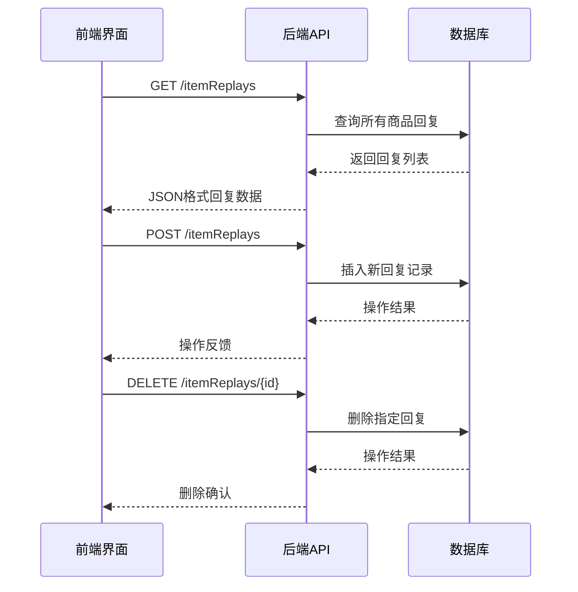

# 指定商品回复表（item_replay）

<cite>
**本文档中引用的文件**
- [db_manager.py](file://db_manager.py)
- [XianyuAutoAsync.py](file://XianyuAutoAsync.py)
- [reply_server.py](file://reply_server.py)
- [static/js/app.js](file://static/js/app.js)
- [static/index.html](file://static/index.html)
- [static/css/keywords.css](file://static/css/keywords.css)
</cite>

## 目录
1. [简介](#简介)
2. [表结构设计](#表结构设计)
3. [核心字段详解](#核心字段详解)
4. [业务流程分析](#业务流程分析)
5. [优先级关系](#优先级关系)
6. [数据完整性保障](#数据完整性保障)
7. [前端交互](#前端交互)
8. [最佳实践建议](#最佳实践建议)
9. [故障排除指南](#故障排除指南)

## 简介

指定商品回复表（item_replay）是闲鱼自动回复系统中用于实现"一品一策"精准营销策略的核心数据库表。该表通过精确绑定特定闲鱼商品ID，为每个商品定制专属的回复策略，确保重要商品能够获得最恰当的客户咨询服务响应。

### 核心价值

- **精准营销**：针对不同商品制定差异化回复策略
- **个性化服务**：根据商品特性提供定制化回答
- **效率提升**：减少通用回复的使用频率
- **用户体验优化**：为重要商品提供更专业的咨询服务

## 表结构设计

### 完整DDL创建语句

```sql
CREATE TABLE IF NOT EXISTS item_replay (
    id INTEGER PRIMARY KEY AUTOINCREMENT,
    item_id TEXT NOT NULL,
    cookie_id TEXT NOT NULL,
    reply_content TEXT NOT NULL,
    created_at TIMESTAMP DEFAULT CURRENT_TIMESTAMP,
    updated_at TIMESTAMP DEFAULT CURRENT_TIMESTAMP,
    FOREIGN KEY (cookie_id) REFERENCES cookies(id) ON DELETE CASCADE
);
```

### 结构特点



**图表来源**
- [db_manager.py](file://db_manager.py#L332-L340)
- [db_manager.py](file://db_manager.py#L128-L137)

**章节来源**
- [db_manager.py](file://db_manager.py#L332-L340)

## 核心字段详解

### item_id字段：商品标识符

#### 设计原理
`item_id`字段作为商品的唯一标识符，确保回复策略与特定闲鱼商品的精确绑定。该字段采用TEXT类型存储，支持各种格式的商品ID。

#### 关键特性
- **唯一性约束**：通过业务逻辑保证同一商品ID在同一账号下不会重复
- **灵活性**：支持多种商品ID格式，适应闲鱼平台的商品标识规范
- **可扩展性**：便于未来扩展到更多商品属性关联

#### 应用场景
- **高价值商品**：为热销商品、新品发布等制定专门回复策略
- **特殊商品**：针对限量商品、定制商品设置专属回复
- **品牌商品**：为品牌旗舰店商品提供专业服务回复

### cookie_id字段：账号关联标识

#### 设计目的
`cookie_id`字段建立与监控账号的关联关系，确保回复规则与特定闲鱼账号的绑定。

#### 技术实现
- **外键约束**：通过FOREIGN KEY约束确保数据完整性
- **级联删除**：当关联的cookie被删除时，自动清理相关回复记录
- **用户隔离**：支持多用户环境下的数据隔离

#### 安全考虑
- **权限控制**：只有对应账号才能管理和查看其商品回复
- **审计追踪**：记录创建和更新时间，便于操作审计

### reply_content字段：回复内容容器

#### 设计架构
`reply_content`字段采用TEXT类型，支持复杂的回复内容存储需求。

#### 功能特性
- **富文本支持**：支持换行、特殊字符等富文本格式
- **变量替换**：内置占位符支持动态内容生成
- **多行内容**：支持长篇幅回复内容

#### 变量替换机制

| 变量名称 | 描述 | 示例值 |
|---------|------|--------|
| `{send_user_name}` | 发送者昵称 | "张三" |
| `{send_user_id}` | 发送者ID | "123456789" |
| `{send_message}` | 用户原始消息 | "请问这个多少钱？" |
| `{item_id}` | 商品ID | "A123456789" |

#### 内容模板示例
```
尊敬的{send_user_name}您好，

感谢您对{item_id}的关注！
{send_message}

关于您的询问，我们提供以下信息：
1. 商品详情：{item_title}
2. 价格说明：{item_price}
3. 特殊优惠：{item_special_offer}

期待为您提供优质服务！
```

**章节来源**
- [db_manager.py](file://db_manager.py#L332-L340)
- [XianyuAutoAsync.py](file://XianyuAutoAsync.py#L3104-L3116)

## 业务流程分析

### 回复策略选择流程



**图表来源**
- [XianyuAutoAsync.py](file://XianyuAutoAsync.py#L3096-L3162)

### 数据访问模式

#### 查询操作
系统通过多种查询模式访问指定商品回复表：

1. **按商品ID查询**：`SELECT reply_content FROM item_replay WHERE item_id = ?`
2. **按账号查询**：`SELECT * FROM item_replay WHERE cookie_id = ?`
3. **组合查询**：`SELECT * FROM item_replay WHERE cookie_id = ? AND item_id = ?`

#### 更新操作
- **新增回复**：INSERT语句创建新的商品回复记录
- **更新回复**：UPDATE语句修改现有回复内容
- **批量删除**：DELETE语句清理多个商品回复

**章节来源**
- [XianyuAutoAsync.py](file://XianyuAutoAsync.py#L3096-L3162)
- [db_manager.py](file://db_manager.py#L4634-L4728)

## 优先级关系

### 回复策略优先级矩阵



**图表来源**
- [XianyuAutoAsync.py](file://XianyuAutoAsync.py#L3096-L3162)

### 优先级说明

#### 指定商品回复（最高优先级）
- **触发条件**：用户咨询包含特定商品ID
- **匹配方式**：精确匹配商品ID
- **优势**：针对具体商品提供最相关回复
- **应用场景**：高价值商品、新品推广、特殊活动商品

#### 关键词回复（中等优先级）
- **触发条件**：用户消息包含预设关键词
- **匹配方式**：模糊匹配关键词
- **优势**：覆盖通用咨询场景
- **应用场景**：常见问题、促销活动、服务咨询

#### 默认回复（最低优先级）
- **触发条件**：无其他匹配回复可用
- **匹配方式**：兜底回复策略
- **优势**：确保不遗漏任何咨询
- **应用场景**：系统维护、紧急情况

**章节来源**
- [XianyuAutoAsync.py](file://XianyuAutoAsync.py#L3096-L3162)

## 数据完整性保障

### 外键约束设计



**图表来源**
- [db_manager.py](file://db_manager.py#L332-L340)

### 约束机制

#### 外键约束
- **级联删除**：当cookies表中的记录被删除时，自动删除相关item_replay记录
- **引用完整性**：确保cookie_id字段引用的有效性
- **事务安全**：在数据库层面保证操作的一致性

#### 数据验证
- **非空约束**：所有关键字段都设置NOT NULL约束
- **类型约束**：使用适当的SQL数据类型
- **长度限制**：合理设置字段长度限制

### 错误处理机制

#### 异常捕获
```python
try:
    # 数据库操作
    cursor.execute(sql, params)
    self.conn.commit()
except Exception as e:
    logger.error(f"数据库操作失败: {e}")
    self.conn.rollback()
    return False
```

#### 数据一致性检查
- **重复检测**：防止同一商品ID在同账号下重复设置回复
- **关联验证**：确保cookie_id和item_id的有效性
- **完整性验证**：检查必填字段的完整性

**章节来源**
- [db_manager.py](file://db_manager.py#L332-L340)
- [db_manager.py](file://db_manager.py#L4711-L4728)

## 前端交互

### 管理界面设计

#### 商品回复管理页面
前端提供了直观的商品回复管理界面，支持以下功能：

1. **商品筛选**：按账号ID筛选商品回复
2. **回复编辑**：在线编辑回复内容
3. **实时预览**：预览变量替换后的效果
4. **批量操作**：支持批量删除和导入

#### 用户体验优化

| 功能特性 | 实现方式 | 用户价值 |
|---------|---------|---------|
| 实时验证 | 前端表单验证 | 减少错误提交 |
| 富文本编辑器 | WYSIWYG编辑器 | 提供更好的编辑体验 |
| 变量提示 | 在线帮助文档 | 方便变量使用 |
| 操作确认 | 确认对话框 | 防止误操作 |

### API接口设计

#### 核心API端点



**图表来源**
- [static/js/app.js](file://static/js/app.js#L6312-L6360)
- [reply_server.py](file://reply_server.py#L5371-L5448)

**章节来源**
- [static/js/app.js](file://static/js/app.js#L6312-L6360)
- [static/index.html](file://static/index.html#L3115-L3174)

## 最佳实践建议

### 回复内容设计原则

#### 1. 个性化定制
- **商品特色突出**：强调商品的独特卖点
- **目标用户定位**：根据不同用户群体调整语言风格
- **情感化表达**：使用积极正面的语言

#### 2. 信息准确性
- **实时更新**：及时更新商品信息和库存状态
- **价格透明**：明确标注价格和优惠信息
- **物流说明**：清晰说明配送时间和费用

#### 3. 响应时效性
- **快速响应**：确保回复的及时性
- **连续性**：保持对话的连贯性
- **跟进机制**：提供后续联系方式

### 管理策略建议

#### 1. 分层管理
- **重要商品优先**：优先为高价值商品设置回复
- **定期更新**：根据销售情况定期调整回复内容
- **效果评估**：跟踪回复效果并持续优化

#### 2. 团队协作
- **权限分离**：不同角色负责不同类型的回复
- **知识库建设**：建立统一的回复模板库
- **培训机制**：定期培训客服人员

#### 3. 数据分析
- **效果监控**：跟踪回复转化率和客户满意度
- **趋势分析**：分析不同时间段的回复效果
- **A/B测试**：对比不同回复策略的效果

### 技术优化建议

#### 1. 性能优化
- **索引优化**：为常用查询字段建立索引
- **缓存策略**：缓存常用的回复内容
- **批量操作**：支持批量导入和导出

#### 2. 安全考虑
- **输入验证**：严格验证用户输入
- **权限控制**：实施细粒度的权限管理
- **审计日志**：记录所有操作的审计信息

## 故障排除指南

### 常见问题及解决方案

#### 1. 回复不生效

**问题现象**：设置了商品回复但用户仍然收到默认回复

**排查步骤**：
1. 检查商品ID是否正确
2. 验证cookie_id是否匹配
3. 确认回复内容不为空
4. 检查系统优先级设置

**解决方案**：
```sql
-- 检查商品回复是否存在
SELECT * FROM item_replay 
WHERE item_id = 'your_item_id' AND cookie_id = 'your_cookie_id';

-- 验证回复内容
SELECT reply_content FROM item_replay 
WHERE id = specific_id;
```

#### 2. 变量替换失败

**问题现象**：回复中包含的变量未被正确替换

**排查步骤**：
1. 检查变量语法是否正确
2. 验证变量名称拼写
3. 确认上下文变量可用性

**解决方案**：
```python
# 正确的变量替换格式
formatted_reply = reply_content.format(
    send_user_name=user_name,
    send_user_id=user_id,
    send_message=message,
    item_id=item_id
)
```

#### 3. 数据库连接问题

**问题现象**：无法访问或修改商品回复数据

**排查步骤**：
1. 检查数据库文件权限
2. 验证数据库连接状态
3. 确认表结构完整性

**解决方案**：
```python
# 数据库连接检查
try:
    cursor = self.conn.cursor()
    cursor.execute("SELECT 1")
    result = cursor.fetchone()
except sqlite3.Error as e:
    logger.error(f"数据库连接失败: {e}")
```

### 性能问题诊断

#### 1. 查询性能优化
- **索引检查**：确保item_id和cookie_id字段有适当索引
- **查询优化**：避免全表扫描，使用精确查询条件
- **连接池管理**：合理管理数据库连接资源

#### 2. 内存使用优化
- **批量操作**：避免大量小查询，使用批量操作
- **缓存策略**：缓存频繁访问的数据
- **垃圾回收**：及时释放不需要的对象

### 监控和告警

#### 关键指标监控
- **回复成功率**：统计成功回复的比例
- **响应时间**：监控回复处理的平均时间
- **错误率**：跟踪各类错误的发生频率

#### 告警机制
- **异常告警**：数据库连接失败、查询超时等
- **性能告警**：响应时间超过阈值
- **业务告警**：回复成功率低于预期

**章节来源**
- [db_manager.py](file://db_manager.py#L4634-L4728)
- [XianyuAutoAsync.py](file://XianyuAutoAsync.py#L3096-L3162)

## 总结

指定商品回复表（item_replay）作为闲鱼自动回复系统的核心组件，通过精确的商品ID绑定和灵活的回复内容设计，实现了"一品一策"的精准营销目标。该表不仅支持富文本和变量替换功能，还建立了完善的优先级体系，确保重要商品能够获得最优质的客户服务体验。

通过合理的表结构设计、完善的数据完整性保障和直观的前端交互界面，该系统为电商客服自动化提供了强有力的技术支撑。随着业务的发展，该系统还可以进一步扩展，支持更多高级功能，如智能推荐、A/B测试等，为商家提供更加全面的客户服务解决方案。