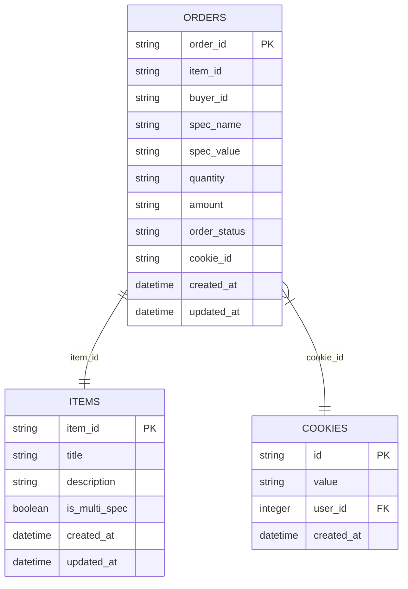
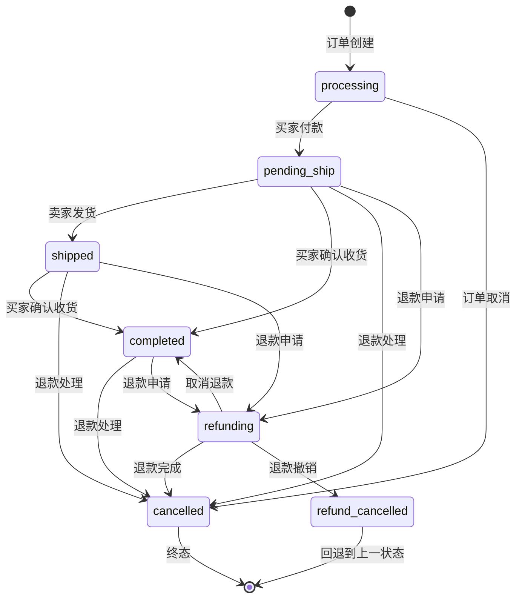
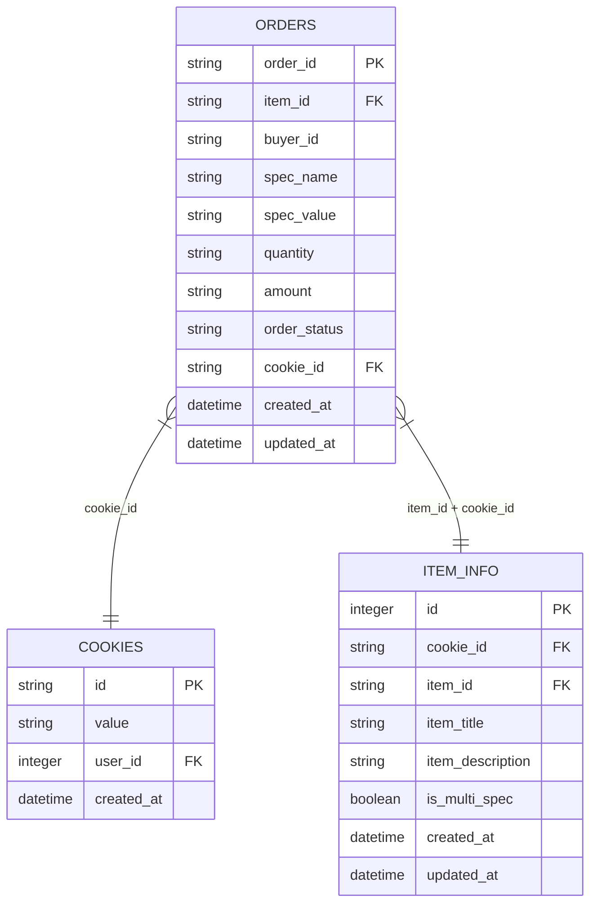
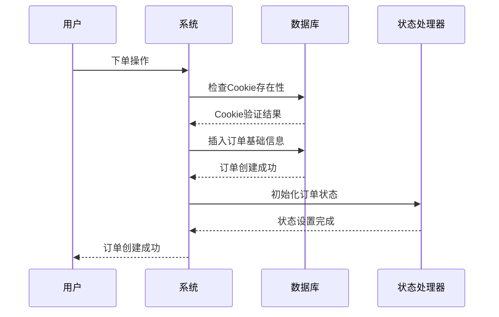

# 订单表（orders）详细文档

<cite>
**本文档引用的文件**
- [db_manager.py](file://db_manager.py)
- [order_status_handler.py](file://order_status_handler.py)
- [XianyuAutoAsync.py](file://XianyuAutoAsync.py)
- [utils/order_detail_fetcher.py](file://utils/order_detail_fetcher.py)
- [static/index.html](file://static/index.html)
- [static/js/app.js](file://static/js/app.js)
- [reply_server.py](file://reply_server.py)
</cite>

## 目录
1. [简介](#简介)
2. [表结构设计](#表结构设计)
3. [核心字段详解](#核心字段详解)
4. [状态机设计](#状态机设计)
5. [数据完整性约束](#数据完整性约束)
6. [业务流程集成](#业务流程集成)
7. [性能优化考虑](#性能优化考虑)
8. [故障排查指南](#故障排查指南)
9. [最佳实践建议](#最佳实践建议)

## 简介

订单表（orders）是闲鱼自动回复系统的核心数据存储组件，负责记录和管理所有交易订单的详细信息。该表采用SQLite数据库实现，支持完整的订单生命周期管理，包括订单创建、状态跟踪、规格信息存储和与监控账号的关联。

## 表结构设计

### DDL创建语句

```sql
CREATE TABLE IF NOT EXISTS orders (
    order_id TEXT PRIMARY KEY,                    -- 订单唯一标识符
    item_id TEXT,                                 -- 关联的商品ID
    buyer_id TEXT,                                -- 买家ID
    spec_name TEXT,                               -- 商品规格名称（如颜色、尺寸）
    spec_value TEXT,                              -- 商品规格值（如红色、XL）
    quantity TEXT,                                -- 购买数量（字符串类型）
    amount TEXT,                                  -- 订单金额（字符串类型）
    order_status TEXT DEFAULT 'unknown',          -- 订单状态
    cookie_id TEXT,                               -- 关联的监控账号ID
    created_at TIMESTAMP DEFAULT CURRENT_TIMESTAMP, -- 记录创建时间
    updated_at TIMESTAMP DEFAULT CURRENT_TIMESTAMP, -- 记录更新时间
    FOREIGN KEY (cookie_id) REFERENCES cookies(id) ON DELETE CASCADE
);
```

### 字段类型设计特点

订单表采用了独特的字段类型设计策略：

- **order_id**: 主键，使用TEXT类型确保唯一性
- **item_id**: 外键关联，使用TEXT类型便于扩展
- **buyer_id**: 文本类型，支持各种买家标识格式
- **spec_name/spec_value**: 规格信息字段，使用TEXT类型存储多规格组合
- **quantity/amount**: 金额和数量字段采用TEXT类型而非数值类型

**节源**
- [db_manager.py](file://db_manager.py#L220-L234)

## 核心字段详解

### order_id - 主键唯一性保证

`order_id`字段作为订单表的主键，具有以下特性：

- **唯一性**: 每个订单必须有唯一的order_id，确保数据完整性
- **类型**: TEXT类型，支持长字符串格式的订单编号
- **索引**: 自动建立主键索引，提供O(log n)的查询性能
- **外键约束**: 作为外键引用到cookies表，建立账户关联

### item_id - 商品关联机制

`item_id`字段建立了订单与闲鱼商品的关联关系：

- **关联方式**: 通过item_id字段与商品信息表建立一对一关联
- **数据类型**: TEXT类型，支持各种商品标识格式
- **业务用途**: 用于商品详情获取、库存管理和价格对比
- **查询优化**: 通过索引支持高效的商品信息检索

### buyer_id - 买家识别与消息关联

`buyer_id`字段在买家识别和消息处理中发挥关键作用：

- **买家标识**: 唯一标识每个下单的买家用户
- **消息关联**: 用于构建与买家的聊天记录和通知系统
- **数据分析**: 支持买家行为分析和营销策略制定
- **隐私保护**: 可以使用匿名化处理的买家ID

### spec_name & spec_value - 规格信息存储

这两个字段协同工作，支持复杂的商品规格组合：



**图表源**
- [db_manager.py](file://db_manager.py#L220-L234)

规格信息存储特点：

- **多规格支持**: 支持颜色、尺寸、材质等多种规格维度
- **组合存储**: 通过spec_name和spec_value的组合存储复杂规格
- **灵活性**: 支持单规格和多规格商品的统一处理
- **查询能力**: 支持按规格筛选和统计分析

### quantity - 字符串类型设计

`quantity`字段采用TEXT类型而非数值类型的设计考量：

- **批量购买支持**: 支持特殊格式的购买数量（如"3+2"组合购买）
- **文本格式兼容**: 兼容各种输入格式，包括带单位的数量
- **计算灵活性**: 在应用层进行数值转换和计算
- **数据一致性**: 统一使用TEXT类型便于维护

### amount - 金额存储格式

`amount`字段同样采用TEXT类型存储金额信息：

- **货币单位**: 存储人民币金额，格式为字符串
- **精度控制**: 应用层进行金额格式化和精度控制
- **国际化支持**: 便于未来扩展支持多种货币
- **计算处理**: 在业务逻辑层进行金额计算和校验

**节源**
- [db_manager.py](file://db_manager.py#L4400-L4473)

## 状态机设计

### 订单状态流转图



**图表源**
- [order_status_handler.py](file://order_status_handler.py#L29-L44)

### 状态转换规则

订单状态机遵循严格的转换规则：

| 当前状态 | 允许转换到的状态 | 说明 |
|---------|----------------|------|
| processing | pending_ship, shipped, completed, cancelled | 初始状态，可直接进入任何状态 |
| pending_ship | shipped, completed, cancelled, refunding | 已付款状态，可发货或退款 |
| shipped | completed, cancelled, refunding | 已发货状态，可确认收货或退款 |
| completed | cancelled, refunding | 已完成状态，仅能退款 |
| refunding | completed, cancelled, refund_cancelled | 退款中状态，可完成或撤销 |
| refund_cancelled | 上一状态 | 临时状态，立即回退 |
| cancelled | 无 | 终态，不可再转换 |

### 状态验证机制

系统实现了严格的状态转换验证：

- **严格验证**: 启用严格验证时，不允许不合理的状态回退
- **优先级检查**: 基于状态优先级防止意外回退
- **历史记录**: 记录状态转换历史，支持退款撤销回退
- **异常处理**: 对非法状态转换进行日志记录和警告

**节源**
- [order_status_handler.py](file://order_status_handler.py#L309-L330)

## 数据完整性约束

### 外键关联设计

订单表与多个表建立了外键关联：



**图表源**
- [db_manager.py](file://db_manager.py#L220-L234)

### 约束说明

- **cookie_id外键**: 引用cookies表的id字段，ON DELETE CASCADE
- **唯一性约束**: 通过order_id确保每条订单记录的唯一性
- **默认值**: order_status字段默认值为'unknown'
- **时间戳**: 自动维护created_at和updated_at字段

### 数据验证机制

系统实现了多层次的数据验证：

- **前端验证**: HTML表单验证和JavaScript验证
- **后端验证**: Python业务逻辑验证
- **数据库约束**: SQLite约束和触发器
- **状态验证**: 订单状态机验证

**节源**
- [db_manager.py](file://db_manager.py#L4408-L4415)

## 业务流程集成

### 订单创建流程



**图表源**
- [XianyuAutoAsync.py](file://XianyuAutoAsync.py#L4426-L4447)
- [db_manager.py](file://db_manager.py#L4400-L4473)

### 订单状态更新流程

系统通过多种方式更新订单状态：

1. **消息驱动**: 基于闲鱼系统消息自动更新
2. **手动操作**: 管理员手动更新订单状态
3. **自动发货**: 系统自动标记为已发货
4. **退款处理**: 退款申请和完成状态更新

### 与监控账号的关联

订单表通过`cookie_id`字段与监控账号建立关联：

- **账号隔离**: 每个订单明确归属特定监控账号
- **权限控制**: 基于账号进行数据访问控制
- **资源分配**: 支持多账号间的资源分配和负载均衡
- **审计追踪**: 记录每个订单的操作轨迹

**节源**
- [reply_server.py](file://reply_server.py#L1183-L1204)

## 性能优化考虑

### 查询优化策略

- **索引设计**: 主键索引和外键索引提供快速查询
- **复合查询**: 支持按cookie_id和状态组合查询
- **分页查询**: 限制查询结果数量，避免性能问题
- **缓存机制**: 内存缓存常用订单信息

### 数据库设计优化

- **字段类型**: 选择合适的数据类型平衡存储和性能
- **约束设计**: 合理使用约束确保数据完整性
- **事务管理**: 使用事务保证数据一致性
- **并发控制**: 使用锁机制防止并发冲突

### 扩展性考虑

- **水平扩展**: 支持多实例部署
- **垂直扩展**: 支持更大规模的数据存储
- **异步处理**: 支持异步状态更新
- **队列机制**: 使用待处理队列处理延迟更新

**节源**
- [db_manager.py](file://db_manager.py#L4507-L4538)

## 故障排查指南

### 常见问题诊断

#### 订单状态异常

**问题症状**: 订单状态不符合预期
**排查步骤**:
1. 检查状态转换规则
2. 验证状态历史记录
3. 查看系统消息处理日志
4. 检查待处理队列状态

#### 外键约束错误

**问题症状**: 插入订单时出现外键错误
**排查步骤**:
1. 验证cookie_id是否存在
2. 检查cookies表数据完整性
3. 确认外键约束设置
4. 检查级联删除配置

#### 性能问题

**问题症状**: 查询响应缓慢
**排查步骤**:
1. 分析查询执行计划
2. 检查索引使用情况
3. 监控数据库连接池
4. 优化查询语句

### 日志分析

系统提供了详细的日志记录：

- **SQL执行日志**: 记录所有数据库操作
- **状态变更日志**: 记录订单状态变化
- **错误日志**: 记录异常和错误信息
- **性能日志**: 记录查询性能指标

**节源**
- [order_status_handler.py](file://order_status_handler.py#L204-L307)

## 最佳实践建议

### 数据设计建议

1. **字段命名**: 使用清晰的字段命名规范
2. **数据类型**: 根据实际需求选择合适的数据类型
3. **约束设置**: 合理设置约束确保数据完整性
4. **索引策略**: 为常用查询字段建立索引

### 业务逻辑建议

1. **状态机设计**: 实现严格的订单状态机
2. **异常处理**: 完善的异常处理机制
3. **事务管理**: 正确使用事务保证数据一致性
4. **并发控制**: 实现适当的并发控制策略

### 运维管理建议

1. **监控告警**: 建立完善的监控和告警机制
2. **备份恢复**: 定期备份数据库并测试恢复流程
3. **性能优化**: 定期分析和优化数据库性能
4. **安全防护**: 实施适当的安全防护措施

### 开发调试建议

1. **单元测试**: 编写全面的单元测试
2. **集成测试**: 进行完整的集成测试
3. **性能测试**: 进行压力测试和性能测试
4. **文档维护**: 保持文档的及时更新

通过以上设计和实践，订单表能够高效、可靠地支持闲鱼自动回复系统的各项功能，为用户提供稳定的服务体验。