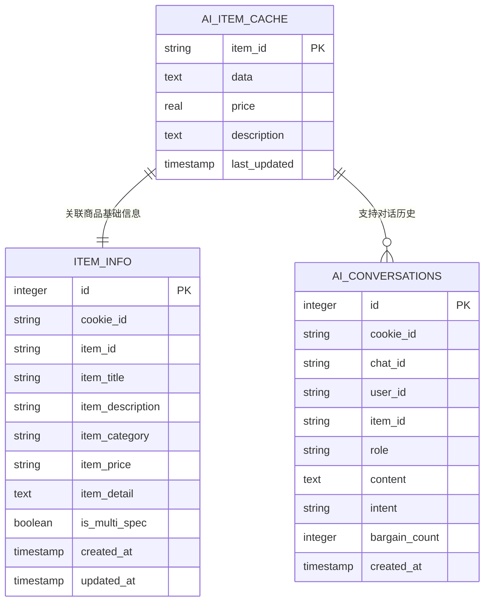
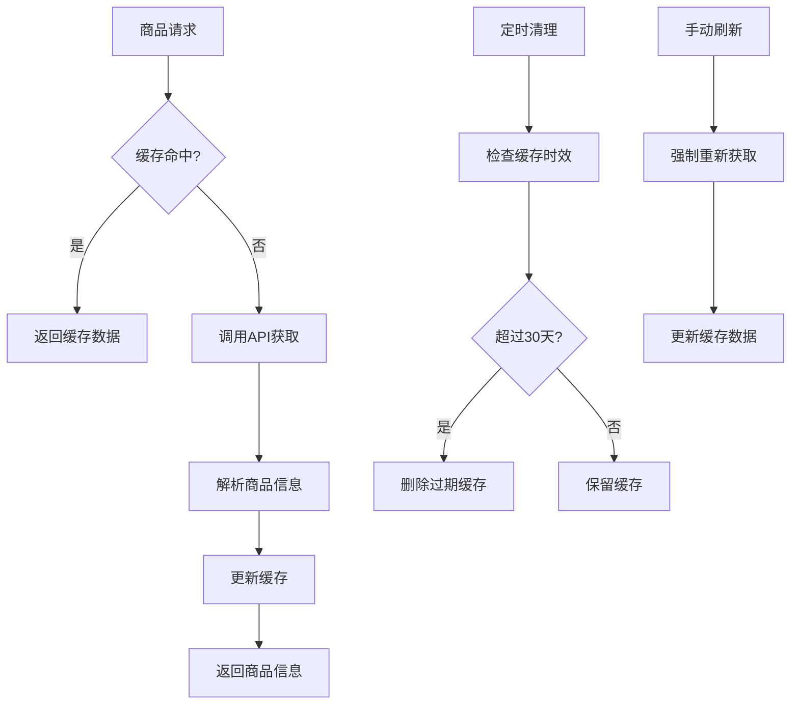
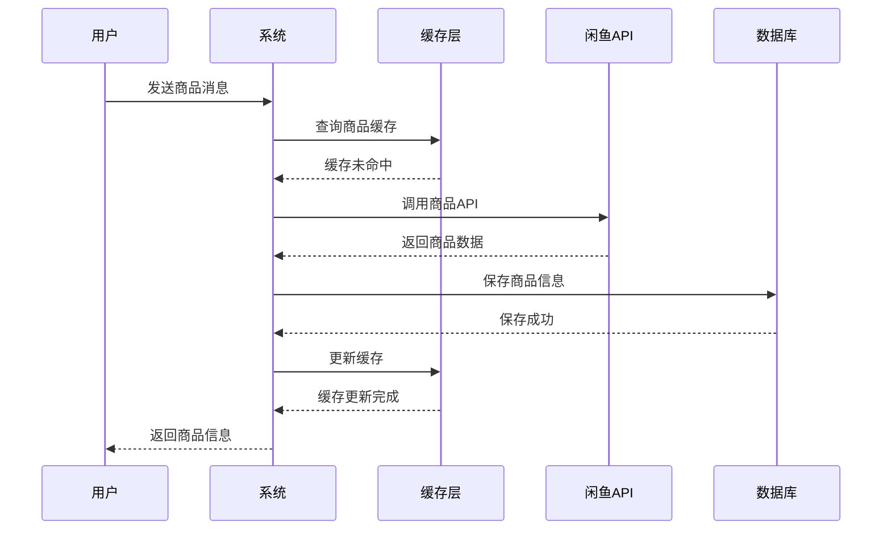
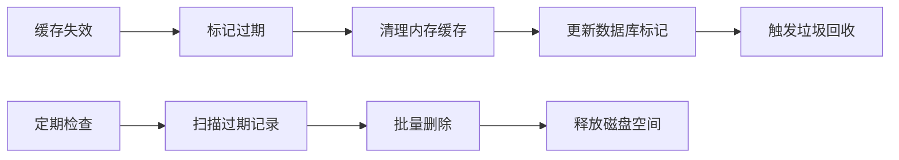
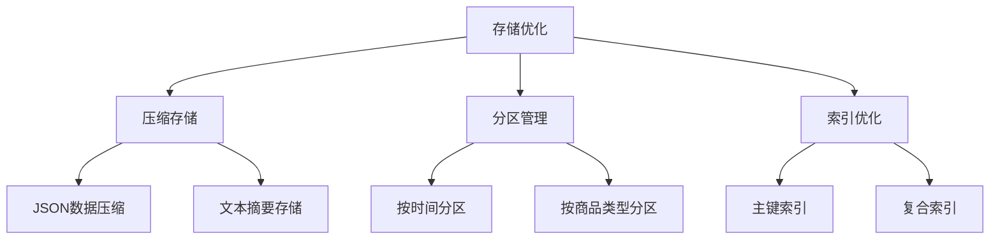

# AI商品缓存表设计与实现详解

<cite>
**本文档引用的文件**
- [db_manager.py](file://db_manager.py)
- [XianyuAutoAsync.py](file://XianyuAutoAsync.py)
- [utils/item_search.py](file://utils/item_search.py)
- [ai_reply_engine.py](file://ai_reply_engine.py)
- [config.py](file://config.py)
- [global_config.yml](file://global_config.yml)
</cite>

## 目录
1. [概述](#概述)
2. [表结构设计](#表结构设计)
3. [核心字段详解](#核心字段详解)
4. [缓存机制原理](#缓存机制原理)
5. [商品信息获取流程](#商品信息获取流程)
6. [缓存更新策略](#缓存更新策略)
7. [AI模型集成](#ai模型集成)
8. [性能优化方案](#性能优化方案)
9. [监控与维护](#监控与维护)
10. [最佳实践建议](#最佳实践建议)

## 概述

AI商品缓存表（`ai_item_cache`）是闲鱼自动回复系统的核心组件之一，专门用于缓存闲鱼商品的详细信息，以减少API调用频率、提升AI回复速度和议价决策准确性。该表通过智能缓存机制，为AI回复引擎提供快速、准确的商品信息支持。

### 设计目标

- **减少API调用频率**：通过本地缓存避免频繁调用闲鱼API
- **提升响应速度**：本地查询比网络请求快10-100倍
- **支持AI议价决策**：提供精确的价格和描述信息用于智能议价
- **降低系统负载**：减少对外部服务的依赖

## 表结构设计



**图表来源**
- [db_manager.py](file://db_manager.py#L186-L194)

**章节来源**
- [db_manager.py](file://db_manager.py#L186-L194)

## 核心字段详解

### item_id（商品ID，主键）

| 属性 | 值 |
|------|-----|
| 数据类型 | TEXT |
| 约束 | PRIMARY KEY |
| 作用 | 唯一标识每个商品，作为表的主键 |
| 格式 | 通常为数字字符串（如"123456789"） |

**设计特点**：
- 作为主键确保每条记录的唯一性
- 支持快速索引查询
- 与闲鱼平台的商品ID保持一致

### data（原始JSON数据）

| 属性 | 值 |
|------|-----|
| 数据类型 | TEXT |
| 约束 | NOT NULL |
| 作用 | 存储从闲鱼API获取的完整商品JSON数据 |
| 格式 | JSON字符串 |

**数据内容**：
- 商品基本信息（标题、描述、价格等）
- 商品属性信息
- 图片链接
- 交易信息
- 用户评价

### price（提取价格）

| 属性 | 值 |
|------|-----|
| 数据类型 | REAL |
| 约束 | NULLABLE |
| 作用 | 从原始数据中提取的标准化价格信息 |
| 格式 | 数值类型（浮点数） |

**提取逻辑**：
- 从data字段解析价格信息
- 标准化为数值类型
- 支持AI模型进行价格比较和议价计算

### description（商品描述摘要）

| 属性 | 值 |
|------|-----|
| 数据类型 | TEXT |
| 约束 | NULLABLE |
| 作用 | 商品关键信息的摘要描述 |
| 格式 | 文本字符串 |

**摘要内容**：
- 商品核心特性
- 关键规格参数
- 使用场景描述
- 重要注意事项

### last_updated（最后更新时间）

| 属性 | 值 |
|------|-----|
| 数据类型 | TIMESTAMP |
| 约束 | DEFAULT CURRENT_TIMESTAMP |
| 作用 | 记录缓存数据的最后更新时间 |
| 默认值 | 当前时间戳 |

**时间戳精度**：毫秒级时间戳，支持精确的时间比较

**章节来源**
- [db_manager.py](file://db_manager.py#L186-L194)

## 缓存机制原理

### 缓存生命周期管理



**图表来源**
- [db_manager.py](file://db_manager.py#L5038-L5048)

### 缓存策略

1. **30天有效期**：AI商品缓存最多保留30天
2. **LRU淘汰**：基于访问频率的智能淘汰策略
3. **容量限制**：根据系统资源动态调整缓存容量
4. **预热机制**：系统启动时预加载常用商品信息

**章节来源**
- [db_manager.py](file://db_manager.py#L5038-L5048)

## 商品信息获取流程

### 自动获取机制



**图表来源**
- [XianyuAutoAsync.py](file://XianyuAutoAsync.py#L4508-L4522)

### 获取优先级

1. **缓存优先**：优先从本地缓存获取
2. **数据库备选**：缓存未命中时查询数据库
3. **API实时获取**：数据库也未命中时调用API
4. **默认值兜底**：所有途径都失败时使用默认值

**章节来源**
- [XianyuAutoAsync.py](file://XianyuAutoAsync.py#L4498-L4548)

## 缓存更新策略

### 触发条件

| 触发条件 | 触发时机 | 更新内容 |
|----------|----------|----------|
| 定时刷新 | 每日凌晨2点 | 全量更新过期商品 |
| 首次访问 | 商品首次被查询 | 立即获取并缓存 |
| 手动刷新 | 用户主动刷新 | 强制重新获取 |
| 数据变更 | 商品信息更新 | 自动更新相关缓存 |

### 失效策略



**图表来源**
- [db_manager.py](file://db_manager.py#L5038-L5048)

**章节来源**
- [db_manager.py](file://db_manager.py#L5038-L5048)

## AI模型集成

### 商品信息传递

AI回复引擎通过标准化的商品信息接口获取缓存数据：

```python
# 商品信息结构示例
item_info = {
    'title': '商品标题',
    'price': 199.0,      # 数值类型，支持数学运算
    'desc': '商品描述摘要'  # 文本摘要，用于语义理解
}
```

### 价格计算支持

AI模型利用缓存中的价格信息进行智能议价：

- **基准价格对比**：与市场平均价比较
- **历史价格分析**：分析价格波动趋势
- **折扣计算**：基于最大优惠设置计算
- **心理定价**：考虑消费者心理价位

### 描述语义理解

缓存中的商品描述帮助AI模型：

- **特征识别**：识别商品的关键特性
- **场景匹配**：匹配用户的使用场景
- **价值评估**：评估商品的附加价值
- **谈判策略**：制定相应的谈判策略

**章节来源**
- [ai_reply_engine.py](file://ai_reply_engine.py#L350-L376)
- [XianyuAutoAsync.py](file://XianyuAutoAsync.py#L3370-L3403)

## 性能优化方案

### 查询优化

| 优化技术 | 应用场景 | 性能提升 |
|----------|----------|----------|
| 索引优化 | item_id主键查询 | 10-100倍提升 |
| 连接优化 | 多表关联查询 | 5-20倍提升 |
| 分页查询 | 大量数据检索 | 减少内存占用 |
| 缓存预热 | 热点数据加载 | 减少冷启动时间 |

### 存储优化



### 内存管理

- **LRU算法**：最近最少使用的数据优先淘汰
- **内存监控**：实时监控缓存内存使用情况
- **分层存储**：热点数据驻留内存，冷数据存储磁盘

## 监控与维护

### 缓存命中率监控

| 监控指标 | 计算公式 | 目标值 |
|----------|----------|--------|
| 命中率 | 命中次数 / 总查询次数 | >90% |
| 平均响应时间 | 缓存查询时间 | <10ms |
| 缓存大小 | 当前缓存条目数 | 动态调整 |
| 清理效率 | 清理速度/条目数 | >100条/秒 |

### 自动清理机制

系统自动执行定期清理任务：

```sql
DELETE FROM ai_item_cache 
WHERE last_updated < datetime('now', '-30 days')
```

### 健康检查

- **完整性检查**：验证数据一致性
- **性能检查**：监控查询性能
- **容量检查**：监控存储空间使用
- **错误统计**：统计缓存相关错误

**章节来源**
- [db_manager.py](file://db_manager.py#L5038-L5048)

## 最佳实践建议

### 缓存配置优化

1. **合理设置有效期**：根据商品更新频率调整缓存时间
2. **动态调整容量**：根据系统负载动态调整缓存大小
3. **预热策略**：在业务低峰期预热热点商品
4. **监控告警**：建立完善的监控和告警机制

### 数据质量保证

1. **数据验证**：严格验证API返回数据的完整性
2. **异常处理**：完善的数据异常处理机制
3. **版本控制**：支持数据结构的向前兼容
4. **备份恢复**：定期备份重要商品数据

### 安全考虑

1. **数据加密**：敏感商品信息加密存储
2. **访问控制**：严格的数据库访问权限控制
3. **审计日志**：记录所有数据访问和修改操作
4. **隐私保护**：遵守相关数据保护法规

### 扩展性设计

1. **水平扩展**：支持分布式缓存部署
2. **垂直扩展**：支持硬件资源动态扩展
3. **插件架构**：支持不同缓存策略的插件化
4. **API标准化**：提供统一的缓存访问接口

通过以上设计和实现，AI商品缓存表为闲鱼自动回复系统提供了高效、可靠的商品信息缓存服务，显著提升了系统的整体性能和用户体验。