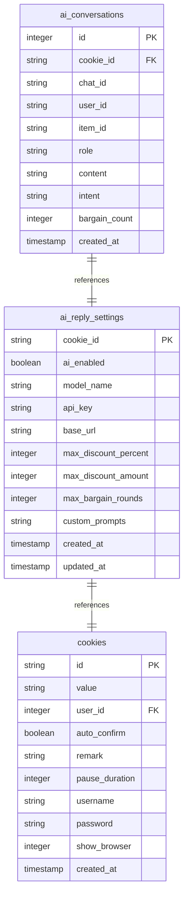
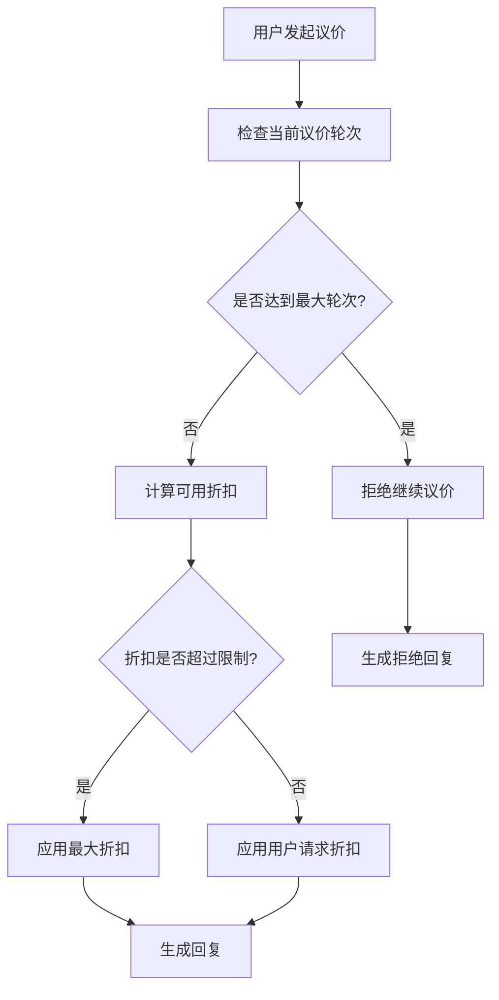
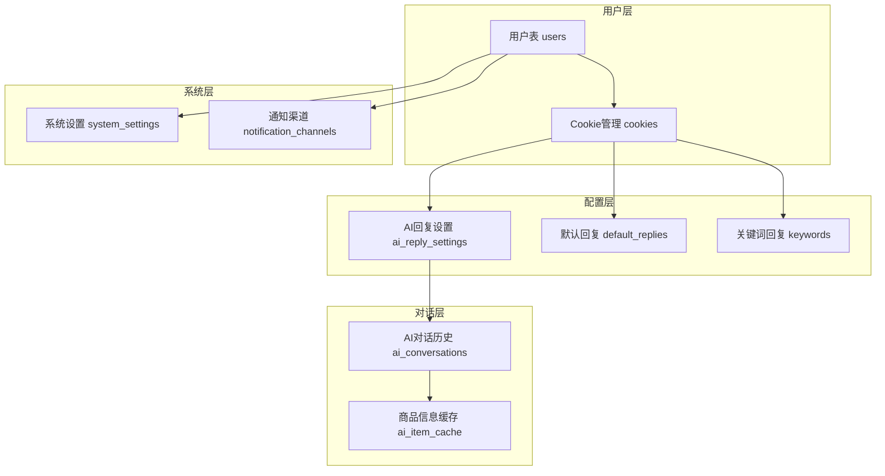
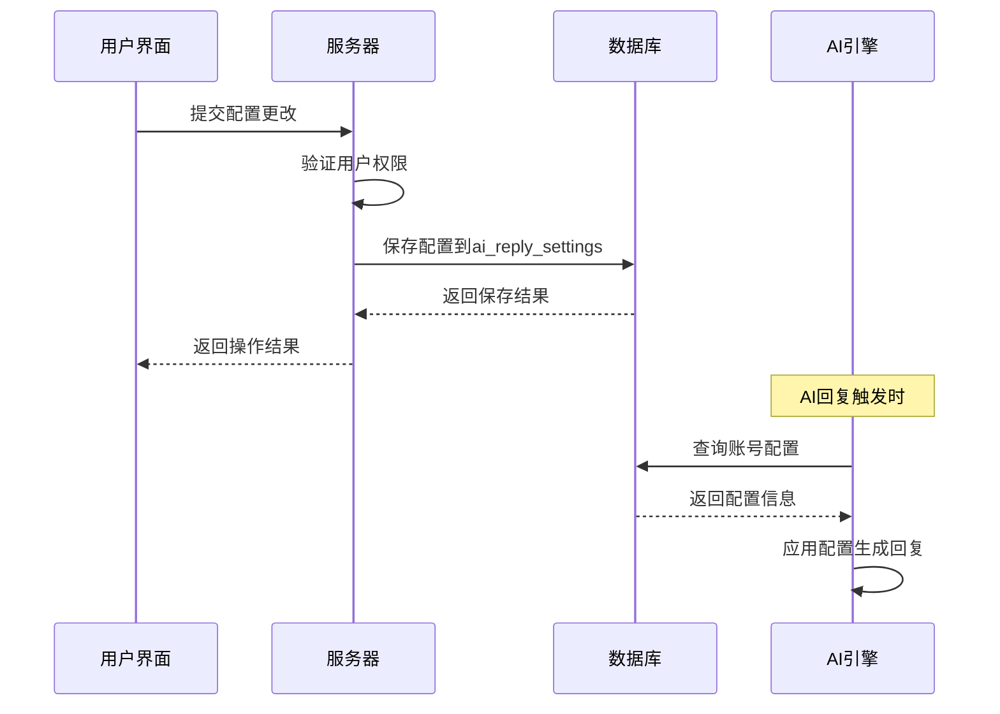
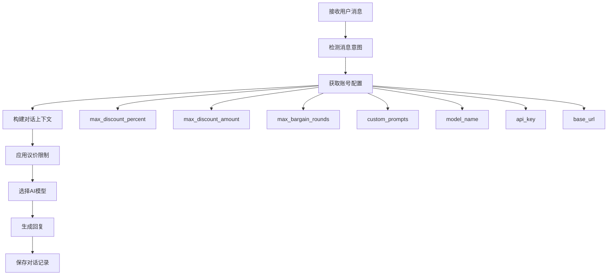
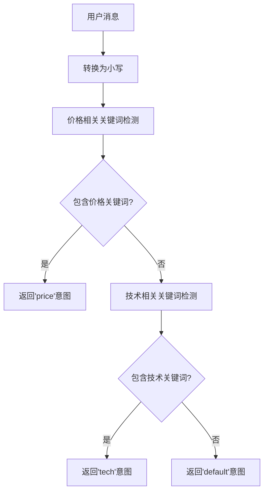
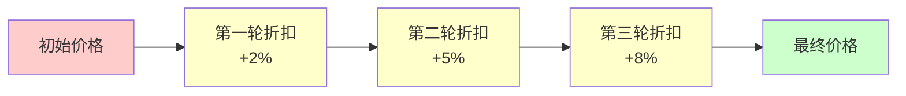
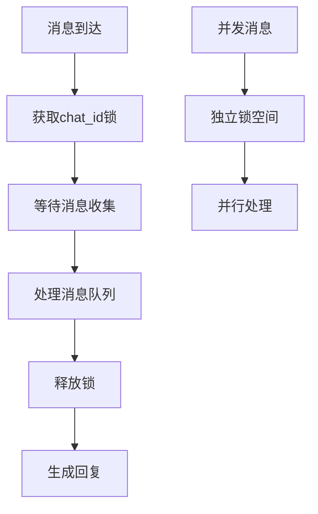
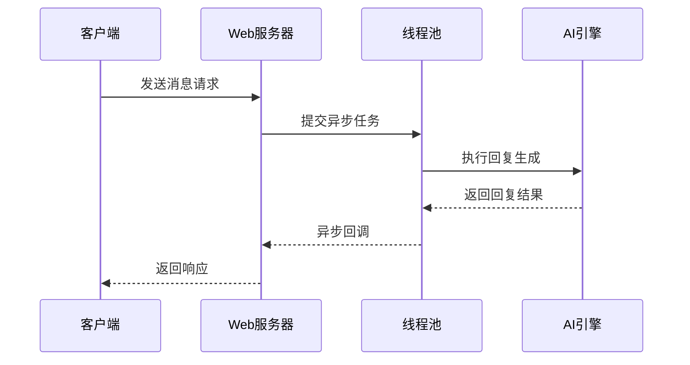
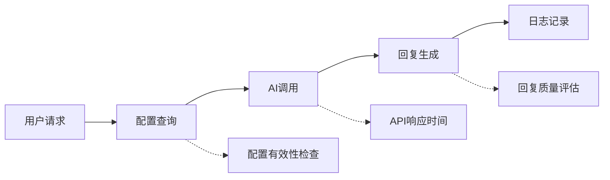

# AI回复设置表深度解析

<cite>
**本文档引用的文件**
- [db_manager.py](file://db_manager.py)
- [ai_reply_engine.py](file://ai_reply_engine.py)
- [config.py](file://config.py)
- [global_config.yml](file://global_config.yml)
- [reply_server.py](file://reply_server.py)
- [static/index.html](file://static/index.html)
- [static/js/app.js](file://static/js/app.js)
- [static/css/accounts.css](file://static/css/accounts.css)
</cite>

## 目录
1. [简介](#简介)
2. [表结构设计](#表结构设计)
3. [核心字段详解](#核心字段详解)
4. [数据库架构](#数据库架构)
5. [配置管理机制](#配置管理机制)
6. [AI对话引擎集成](#ai对话引擎集成)
7. [安全存储机制](#安全存储机制)
8. [最佳实践建议](#最佳实践建议)
9. [性能优化策略](#性能优化策略)
10. [故障排除指南](#故障排除指南)

## 简介

`ai_reply_settings`表是闲鱼自动回复系统的核心配置表，它为每个闲鱼账号提供了独立的AI回复配置能力。该表通过`cookie_id`字段作为主键和外键，实现了账号级别的配置隔离，确保不同账号可以使用不同的AI模型、API密钥和回复策略。

## 表结构设计

### 完整表结构



**图表来源**
- [db_manager.py](file://db_manager.py#L151-L166)
- [db_manager.py](file://db_manager.py#L110-L125)
- [db_manager.py](file://db_manager.py#L168-L183)

### 主键设计原理

`cookie_id`作为主键的设计体现了以下关键特性：

1. **唯一性保证**：每个闲鱼账号对应唯一的`cookie_id`
2. **外键关联**：与`cookies`表建立一对一关系
3. **级联删除**：当账号删除时，配置自动清理
4. **配置隔离**：确保不同账号的配置完全独立

**章节来源**
- [db_manager.py](file://db_manager.py#L151-L166)

## 核心字段详解

### model_name（AI模型名称）

| 属性 | 值 |
|------|-----|
| 默认值 | qwen-plus |
| 数据类型 | TEXT |
| 约束 | 非空 |
| 说明 | 指定使用的AI模型名称 |

支持的模型类型：
- **通义千问系列**：qwen-plus、qwen-max、qwen-turbo
- **自定义模型**：custom、dashscope、qwen-custom
- **第三方模型**：Gemini系列、OpenAI兼容模型

### api_key（密钥）

| 属性 | 值 |
|------|-----|
| 数据类型 | TEXT |
| 约束 | 可为空 |
| 说明 | AI服务提供商的认证密钥 |

**安全特性**：
- 不直接存储明文密钥
- 通过数据库连接进行安全传输
- 支持多种API提供商

### base_url（API端点）

| 属性 | 值 |
|------|-----|
| 默认值 | https://dashscope.aliyuncs.com/compatible-mode/v1 |
| 数据类型 | TEXT |
| 约束 | 非空 |
| 说明 | AI服务的API访问地址 |

支持的端点：
- **阿里云DashScope**：`https://dashscope.aliyuncs.com/compatible-mode/v1`
- **OpenAI兼容**：`https://api.openai.com/v1`
- **自定义端点**：支持私有化部署

### max_discount_percent（最大议价折扣百分比）

| 属性 | 值 |
|------|-----|
| 默认值 | 10 |
| 数据类型 | INTEGER |
| 范围 | 1-100 |
| 说明 | 单次议价允许的最大折扣百分比 |

议价策略算法：


**图表来源**
- [ai_reply_engine.py](file://ai_reply_engine.py#L337-L343)

### max_discount_amount（最大议价金额）

| 属性 | 值 |
|------|-----|
| 默认值 | 100 |
| 数据类型 | INTEGER |
| 说明 | 单次议价允许的最大绝对金额折扣 |

### max_bargain_rounds（最大议价轮次）

| 属性 | 值 |
|------|-----|
| 默认值 | 3 |
| 数据类型 | INTEGER |
| 说明 | 允许的最多议价轮次 |

### custom_prompts（自定义提示词）

| 属性 | 值 |
|------|-----|
| 数据类型 | TEXT |
| 格式 | JSON字符串 |
| 说明 | 自定义的系统提示词模板 |

示例格式：
```json
{
    "price": "自定义议价提示词...",
    "tech": "自定义技术问答提示词...",
    "default": "自定义通用回复提示词..."
}
```

**章节来源**
- [db_manager.py](file://db_manager.py#L155-L161)
- [ai_reply_engine.py](file://ai_reply_engine.py#L39-L60)

## 数据库架构

### 表间关系图



**图表来源**
- [db_manager.py](file://db_manager.py#L74-L183)

### 外键约束设计

所有相关表都建立了外键约束，确保数据完整性：

1. **级联删除**：当`cookies`记录删除时，相关配置自动清理
2. **数据一致性**：防止出现孤立的配置记录
3. **引用完整性**：确保配置与实际账号关联

**章节来源**
- [db_manager.py](file://db_manager.py#L110-L125)
- [db_manager.py](file://db_manager.py#L151-L166)

## 配置管理机制

### 配置保存流程



**图表来源**
- [reply_server.py](file://reply_server.py#L4304-L4339)
- [db_manager.py](file://db_manager.py#L1767-L1795)

### 配置获取机制

系统提供了多种配置获取方式：

1. **单账号查询**：`get_ai_reply_settings(cookie_id)`
2. **批量查询**：`get_all_ai_reply_settings()`
3. **实时生效**：配置变更立即生效，无需重启

**章节来源**
- [db_manager.py](file://db_manager.py#L1797-L1844)

## AI对话引擎集成

### 配置对AI行为的影响

AI回复引擎通过以下方式利用配置：



**图表来源**
- [ai_reply_engine.py](file://ai_reply_engine.py#L283-L412)

### 意图检测机制

系统采用关键词匹配的方式检测用户意图：



**图表来源**
- [ai_reply_engine.py](file://ai_reply_engine.py#L237-L274)

**章节来源**
- [ai_reply_engine.py](file://ai_reply_engine.py#L283-L412)

## 安全存储机制

### 敏感信息保护

虽然当前实现中API密钥以明文形式存储，但系统提供了多层安全保护：

1. **数据库访问控制**：严格的文件权限设置
2. **连接加密**：支持SSL/TLS连接
3. **访问审计**：记录配置访问日志
4. **权限隔离**：基于用户ID的配置隔离

### 加密建议

为了进一步提升安全性，建议实施以下加密措施：

| 加密层级 | 实现方案 | 适用场景 |
|----------|----------|----------|
| 存储加密 | AES-256 | 敏感配置字段 |
| 传输加密 | TLS 1.3 | 数据库连接 |
| 内存保护 | 内存锁定 | 运行时密钥 |
| 访问控制 | RBAC | 用户权限管理 |

**章节来源**
- [db_manager.py](file://db_manager.py#L1767-L1795)

## 最佳实践建议

### 配置优化策略

#### 1. 模型选择指南

| 场景 | 推荐模型 | 配置要点 |
|------|----------|----------|
| 高质量回复 | qwen-plus | 较高的温度值 |
| 快速响应 | qwen-turbo | 较低的温度值 |
| 特殊领域 | 自定义模型 | 丰富的领域提示词 |

#### 2. 议价策略配置



**图表来源**
- [ai_reply_engine.py](file://ai_reply_engine.py#L42-L49)

#### 3. 提示词优化

推荐的提示词结构：
- **角色定义**：明确AI的角色定位
- **语言要求**：指定回复的语言风格
- **策略指导**：提供具体的应对策略
- **约束条件**：设置行为边界

### 性能监控指标

| 指标类别 | 关键指标 | 监控方法 |
|----------|----------|----------|
| 响应时间 | 平均响应时间 | 日志分析 |
| 成功率 | AI回复成功率 | 统计报表 |
| 资源使用 | API调用频率 | 性能监控 |
| 错误率 | 失败请求比例 | 错误追踪 |

**章节来源**
- [ai_reply_engine.py](file://ai_reply_engine.py#L42-L60)

## 性能优化策略

### 缓存机制

虽然系统移除了有状态的缓存，但仍可通过以下方式优化性能：

1. **数据库连接池**：复用数据库连接
2. **查询优化**：索引优化和查询计划
3. **批量操作**：减少数据库往返次数

### 并发控制



**图表来源**
- [ai_reply_engine.py](file://ai_reply_engine.py#L276-L282)

### 异步处理

系统支持异步回复生成，提高并发处理能力：



**图表来源**
- [ai_reply_engine.py](file://ai_reply_engine.py#L422-L434)

**章节来源**
- [ai_reply_engine.py](file://ai_reply_engine.py#L276-L282)
- [ai_reply_engine.py](file://ai_reply_engine.py#L422-L434)

## 故障排除指南

### 常见问题诊断

#### 1. AI回复不工作

**排查步骤**：
1. 检查`ai_enabled`是否为`true`
2. 验证API密钥是否有效
3. 确认模型名称正确
4. 检查网络连接

#### 2. 议价功能异常

**排查重点**：
- `max_bargain_rounds`配置
- 议价次数统计准确性
- 价格计算逻辑

#### 3. 性能问题

**优化方向**：
- 数据库查询优化
- 并发连接管理
- 缓存策略调整

### 日志分析

系统提供了详细的日志记录，便于问题诊断：



**章节来源**
- [ai_reply_engine.py](file://ai_reply_engine.py#L414-L420)

### 监控和告警

建议建立以下监控指标：

| 监控项目 | 告警阈值 | 处理建议 |
|----------|----------|----------|
| API调用失败率 | >5% | 检查API密钥和配额 |
| 平均响应时间 | >5秒 | 优化模型选择和网络 |
| 配置更新频率 | 异常变化 | 检查配置管理流程 |
| 错误发生频率 | >10次/小时 | 分析错误模式 |

## 结论

`ai_reply_settings`表作为闲鱼自动回复系统的核心配置组件，通过精心设计的表结构和完善的配置管理机制，为不同账号提供了灵活且安全的AI回复能力。其基于`cookie_id`的主键设计确保了配置的唯一性和隔离性，而丰富的配置选项则满足了多样化的业务需求。

随着系统的不断发展，建议持续关注以下改进方向：
- 增强敏感信息的加密保护
- 优化配置的动态加载机制
- 完善性能监控和告警体系
- 扩展多租户支持能力

通过合理的配置管理和持续的优化改进，该系统能够为用户提供高质量、高效率的智能回复服务。