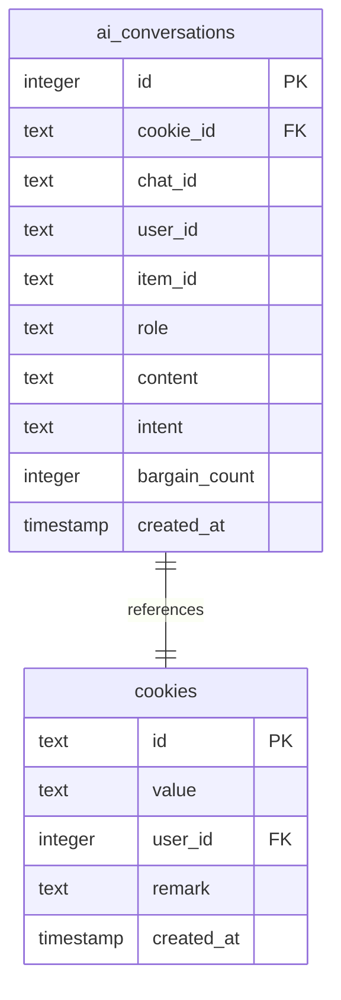
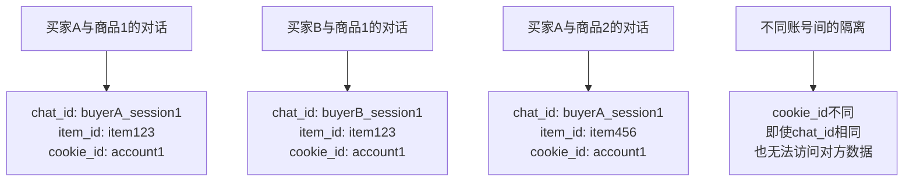
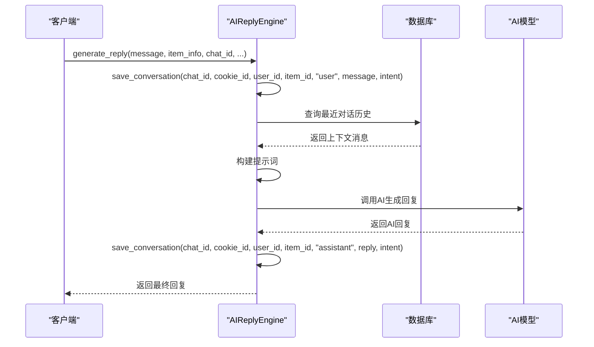
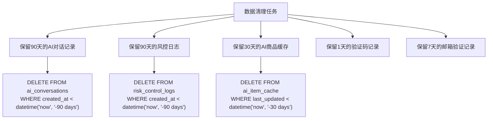
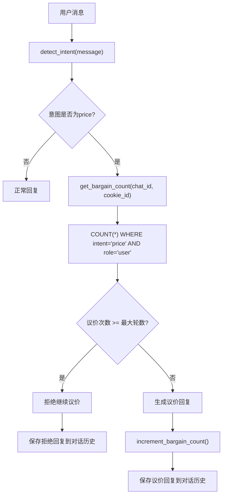

# AI对话表

<cite>
**本文档引用的文件**
- [db_manager.py](file://db_manager.py)
- [ai_reply_engine.py](file://ai_reply_engine.py)
- [XianyuAutoAsync.py](file://XianyuAutoAsync.py)
- [README.md](file://README.md)
</cite>

## 目录
1. [简介](#简介)
2. [表结构设计](#表结构设计)
3. [字段详解](#字段详解)
4. [对话隔离机制](#对话隔离机制)
5. [上下文管理逻辑](#上下文管理逻辑)
6. [数据清理策略](#数据清理策略)
7. [性能优化建议](#性能优化建议)
8. [防止重复议价机制](#防止重复议价机制)
9. [最佳实践](#最佳实践)
10. [总结](#总结)

## 简介

`ai_conversations`表是闲鱼自动回复系统中维护AI对话上下文的核心数据库表。该表通过chat_id和item_id的组合实现多买家、多商品的对话隔离，确保每个对话的独立性和上下文连续性。表结构设计充分考虑了AI回复系统的特殊需求，支持复杂的对话历史管理和议价状态跟踪。

## 表结构设计



**图表来源**
- [db_manager.py](file://db_manager.py#L169-L182)

**章节来源**
- [db_manager.py](file://db_manager.py#L169-L182)

## 字段详解

### 核心字段

| 字段名 | 类型 | 约束 | 说明 |
|--------|------|------|------|
| `id` | INTEGER | PRIMARY KEY AUTOINCREMENT | 自增主键，唯一标识每条对话记录 |
| `cookie_id` | TEXT | NOT NULL | 所属账号ID，关联到cookies表 |
| `chat_id` | TEXT | NOT NULL | 买家会话ID，用于标识具体的聊天会话 |
| `user_id` | TEXT | NOT NULL | 买家用户ID，记录对话发起者的身份 |
| `item_id` | TEXT | NOT NULL | 讨论商品ID，关联到具体商品 |

### 对话内容字段

| 字段名 | 类型 | 约束 | 说明 |
|--------|------|------|------|
| `role` | TEXT | NOT NULL | 角色标识，取值为"user"或"assistant" |
| `content` | TEXT | NOT NULL | 消息内容，存储具体的对话文本 |
| `intent` | TEXT | NULLABLE | 识别的意图，如"price"、"tech"、"default" |

### 状态管理字段

| 字段名 | 类型 | 默认值 | 说明 |
|--------|------|--------|------|
| `bargain_count` | INTEGER | 0 | 议价次数，记录该对话中的议价轮数 |
| `created_at` | TIMESTAMP | CURRENT_TIMESTAMP | 时间戳，记录消息创建时间 |

**章节来源**
- [db_manager.py](file://db_manager.py#L169-L182)
- [ai_reply_engine.py](file://ai_reply_engine.py#L454-L477)

## 对话隔离机制

### 多买家、多商品隔离原理

`ai_conversations`表通过三个关键字段的组合实现强大的对话隔离机制：



**图表来源**
- [ai_reply_engine.py](file://ai_reply_engine.py#L283-L300)

### 隔离优势

1. **数据安全**：不同买家的对话完全隔离，防止数据泄露
2. **状态独立**：每个对话可以独立维护自己的议价状态
3. **查询高效**：通过组合索引实现快速查询定位
4. **扩展性强**：支持无限数量的买家和商品组合

**章节来源**
- [ai_reply_engine.py](file://ai_reply_engine.py#L283-L300)

## 上下文管理逻辑

### 对话历史获取流程



**图表来源**
- [ai_reply_engine.py](file://ai_reply_engine.py#L283-L420)

### 上下文构建策略

系统采用以下策略构建对话上下文：

1. **时间窗口限制**：默认查询最近20条消息
2. **角色过滤**：只包含"user"和"assistant"角色的消息
3. **内容截断**：限制单条消息长度，避免超出token限制
4. **历史整合**：将对话历史格式化为"role: content"的形式

**章节来源**
- [ai_reply_engine.py](file://ai_reply_engine.py#L436-L449)

## 数据清理策略

### TTL机制实现

系统实现了完善的TTL（生存时间）机制来管理对话数据：



**图表来源**
- [db_manager.py](file://db_manager.py#L5013-L5022)

### 清理策略配置

| 表名 | 保留天数 | 清理频率 | VACUUM触发条件 |
|------|----------|----------|----------------|
| `ai_conversations` | 90天 | 每次清理 | 清理超过100条记录 |
| `risk_control_logs` | 90天 | 每次清理 | 清理超过100条记录 |
| `ai_item_cache` | 30天 | 每次清理 | 清理超过100条记录 |
| `captcha_codes` | 1天 | 每次清理 | 清理超过100条记录 |
| `email_verifications` | 7天 | 每次清理 | 清理超过100条记录 |

### 性能优化措施

1. **批量清理**：一次性删除大量记录，减少I/O操作
2. **VACUUM优化**：清理后执行VACUUM释放磁盘空间
3. **统计监控**：记录清理统计信息，便于性能分析

**章节来源**
- [db_manager.py](file://db_manager.py#L5000-L5095)

## 性能优化建议

### 索引设计建议

虽然系统已经建立了基本的约束关系，但可以考虑以下索引优化：

```sql
-- 为高频查询字段建立复合索引
CREATE INDEX idx_ai_conversations_chat_item ON ai_conversations(chat_id, item_id, created_at);
CREATE INDEX idx_ai_conversations_cookie_role ON ai_conversations(cookie_id, role, created_at);

-- 为议价查询优化索引
CREATE INDEX idx_ai_conversations_bargain ON ai_conversations(chat_id, cookie_id, intent, role);
```

### 查询优化策略

1. **分页查询**：对于大量对话历史，采用分页查询避免内存溢出
2. **时间范围限制**：使用JULIANDAY函数进行高效的时间范围查询
3. **角色过滤**：在查询时明确指定角色，减少数据扫描量

### 存储优化

1. **内容压缩**：对长文本内容进行压缩存储
2. **归档策略**：将历史数据归档到冷存储
3. **定期维护**：定期分析表统计信息，优化存储结构

**章节来源**
- [ai_reply_engine.py](file://ai_reply_engine.py#L493-L520)

## 防止重复议价机制

### 议价次数计算



**图表来源**
- [ai_reply_engine.py](file://ai_reply_engine.py#L337-L343)

### 议价状态维护

系统通过以下机制维护议价状态：

1. **计数器机制**：每次用户提出议价请求时，计数器加1
2. **轮数限制**：根据配置的最大议价轮数进行限制
3. **状态持久化**：议价状态存储在数据库中，保证重启后状态不丢失
4. **实时检查**：每次生成回复前都进行状态检查

### 防重复机制

1. **时间窗口检查**：通过时间戳确保不会处理过期消息
2. **消息去重**：通过created_at字段避免重复处理相同消息
3. **状态同步**：确保所有实例的状态一致性

**章节来源**
- [ai_reply_engine.py](file://ai_reply_engine.py#L337-L343)
- [ai_reply_engine.py](file://ai_reply_engine.py#L477-L489)

## 最佳实践

### 数据完整性保障

1. **事务管理**：在保存对话记录时使用数据库事务
2. **约束检查**：利用FOREIGN KEY约束确保数据一致性
3. **备份策略**：定期备份重要对话数据

### 安全考虑

1. **数据加密**：敏感对话内容可以考虑加密存储
2. **访问控制**：通过cookie_id实现数据访问隔离
3. **审计日志**：记录重要的数据变更操作

### 监控指标

建议监控以下关键指标：

- 对话活跃度：每日新增对话数量
- 平均对话长度：单次对话的平均消息数量
- 议价成功率：有效议价的比例
- 系统响应时间：AI回复生成的平均耗时

**章节来源**
- [ai_reply_engine.py](file://ai_reply_engine.py#L454-L477)

## 总结

`ai_conversations`表是闲鱼自动回复系统的核心组件，通过精心设计的字段结构和隔离机制，实现了高效的AI对话管理。该表不仅支持复杂的上下文理解和议价逻辑，还提供了完善的数据清理和性能优化机制。

### 核心优势

1. **强大的隔离能力**：通过chat_id、item_id、cookie_id的组合实现多维度隔离
2. **高效的上下文管理**：支持大规模对话历史的快速检索和处理
3. **完善的生命周期管理**：自动化的数据清理和存储优化
4. **可靠的议价控制**：防止重复议价和超限操作的安全机制

### 应用价值

该表的设计理念和实现方案为其他AI对话系统提供了宝贵的参考，特别是在多用户、多商品场景下的对话隔离和状态管理方面具有重要的借鉴意义。