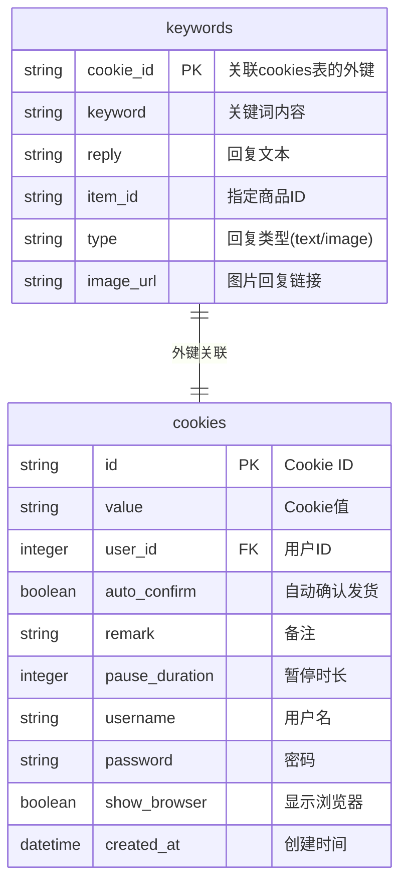
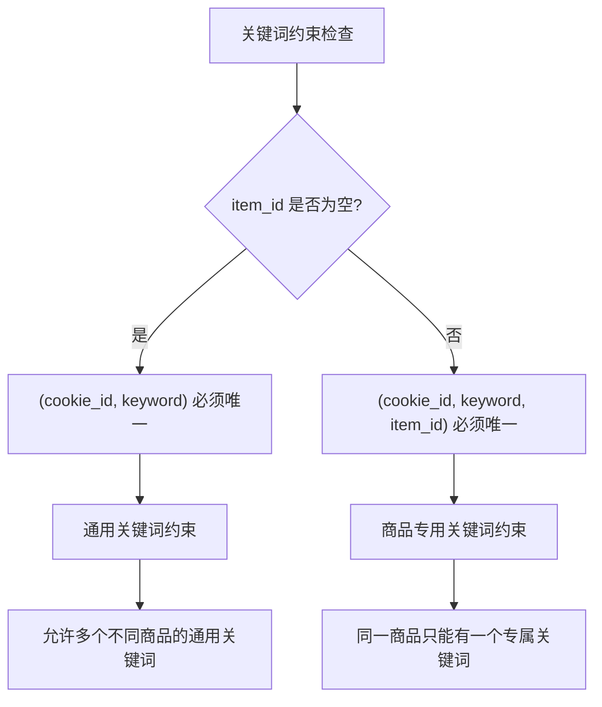
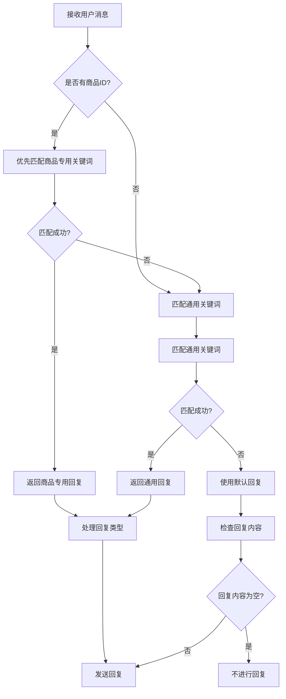
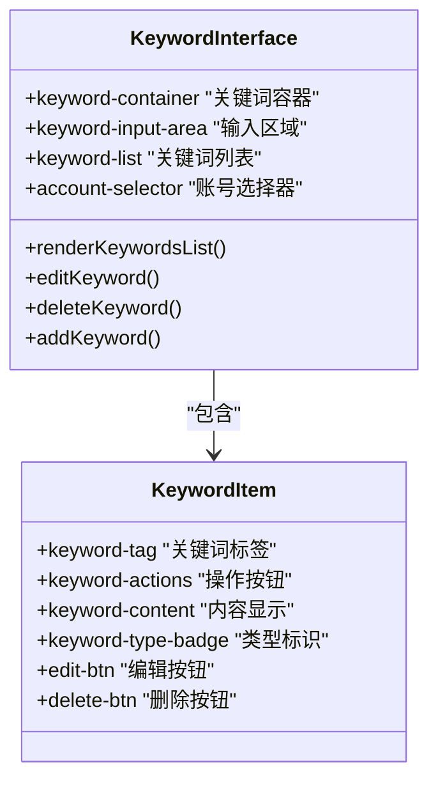
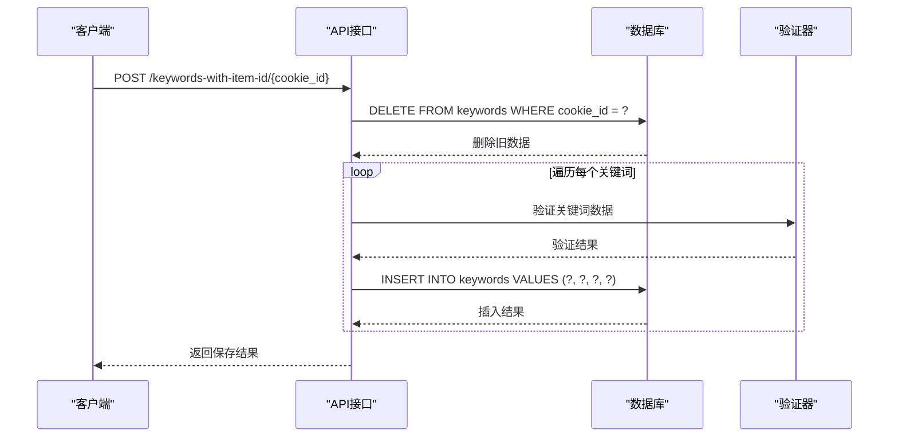
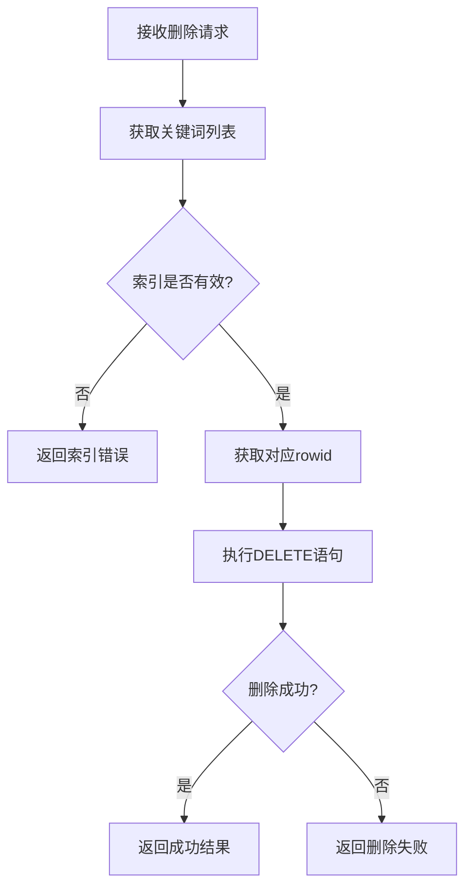
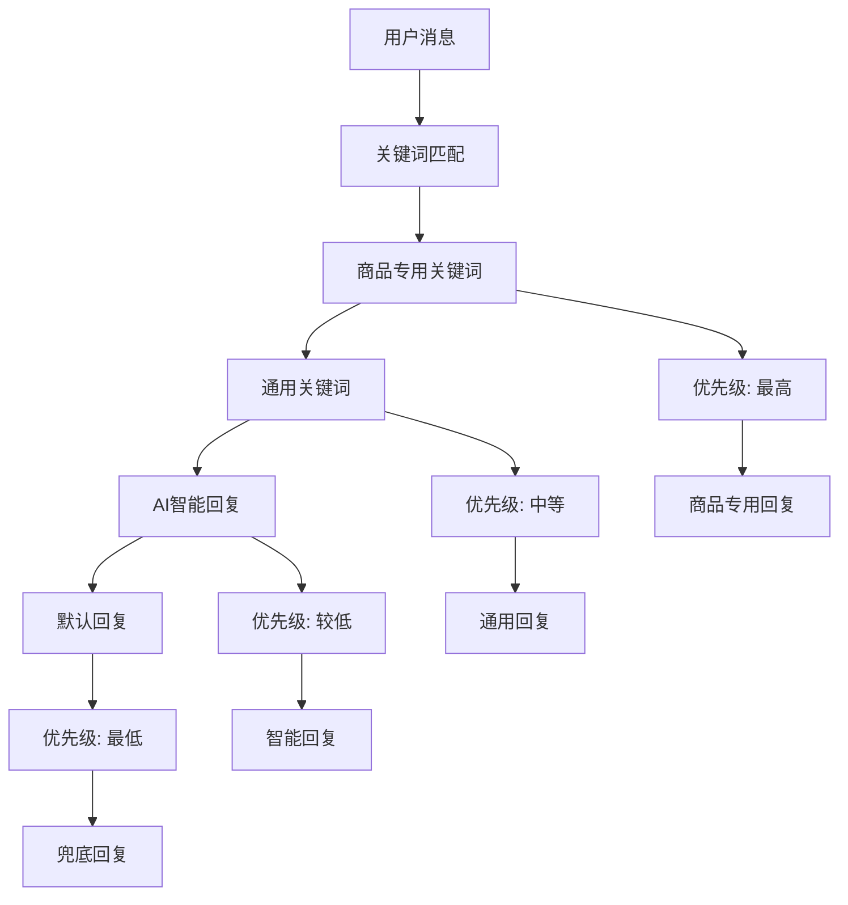
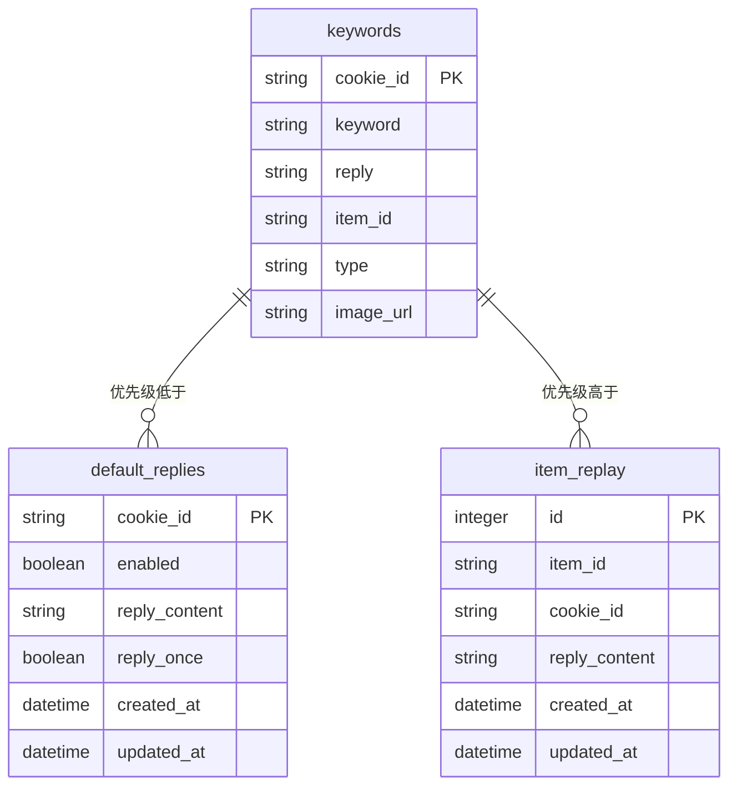
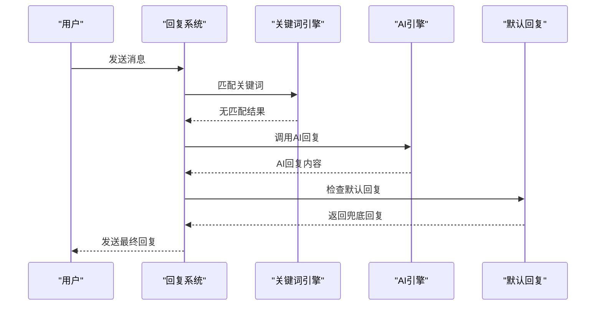

# 关键词表详细文档

<cite>
**本文档引用的文件**
- [db_manager.py](file://db_manager.py)
- [reply_server.py](file://reply_server.py)
- [XianyuAutoAsync.py](file://XianyuAutoAsync.py)
- [static/css/keywords.css](file://static/css/keywords.css)
- [static/js/app.js](file://static/js/app.js)
- [static/index.html](file://static/index.html)
- [ai_reply_engine.py](file://ai_reply_engine.py)
</cite>

## 目录
1. [简介](#简介)
2. [表结构设计](#表结构设计)
3. [核心字段详解](#核心字段详解)
4. [数据约束与索引](#数据约束与索引)
5. [关键词匹配逻辑](#关键词匹配逻辑)
6. [前端管理界面](#前端管理界面)
7. [关键方法分析](#关键方法分析)
8. [智能回复优先级策略](#智能回复优先级策略)
9. [与其他回复机制的关系](#与其他回复机制的关系)
10. [最佳实践建议](#最佳实践建议)

## 简介

关键词表（keywords）是闲鱼自动回复系统的核心组件之一，负责存储和管理用户配置的各种关键词及其对应的回复内容。该表支持多种类型的回复（文本、图片），并能够针对特定商品设置专属关键词，实现了精细化的自动回复控制。

## 表结构设计

关键词表采用简洁而高效的设计，主要包含以下核心字段：



**图表来源**
- [db_manager.py](file://db_manager.py#L128-L137)

**章节来源**
- [db_manager.py](file://db_manager.py#L128-L137)

## 核心字段详解

### cookie_id（外键）
- **类型**: TEXT
- **约束**: 主键的一部分，外键关联cookies表
- **用途**: 标识关键词所属的闲鱼账号
- **数据完整性**: 通过外键约束确保引用完整性，当删除对应cookie时自动级联删除相关关键词

### keyword（关键词内容）
- **类型**: TEXT
- **约束**: 不允许为空
- **用途**: 用户配置的触发关键词，系统根据此内容匹配用户消息
- **匹配方式**: 支持模糊匹配，不区分大小写
- **示例**: "你好", "价格", "优惠", "包邮"

### reply（回复文本）
- **类型**: TEXT
- **用途**: 当关键词匹配成功时返回的回复内容
- **变量支持**: 支持动态变量替换，如`{send_user_name}`, `{send_user_id}`, `{send_message}`
- **空内容处理**: 如果回复内容为空，系统不会进行回复

### item_id（指定商品ID）
- **类型**: TEXT
- **约束**: 可为空，但当非空时具有唯一性约束
- **用途**: 指定关键词仅对特定商品生效
- **优先级**: 与商品ID相关的关键词具有最高优先级
- **示例**: "654321", "789012"

### type（回复类型）
- **类型**: TEXT
- **默认值**: 'text'
- **取值**: 'text' 或 'image'
- **用途**: 指定回复内容的类型，决定系统如何处理该关键词

### image_url（图片回复链接）
- **类型**: TEXT
- **用途**: 当type为'image'时，存储图片的URL地址
- **验证**: 系统会验证URL的有效性和可访问性

**章节来源**
- [db_manager.py](file://db_manager.py#L128-L137)
- [XianyuAutoAsync.py](file://XianyuAutoAsync.py#L3181-L3250)

## 数据约束与索引

### 唯一性约束
系统实施了复杂的唯一性约束策略：



**图表来源**
- [db_manager.py](file://db_manager.py#L1036-L1086)

### 索引优化
- **主键索引**: cookie_id + keyword组合索引
- **商品专用索引**: cookie_id + keyword + item_id组合索引
- **查询性能**: 优化的索引结构确保快速的关键词查找

**章节来源**
- [db_manager.py](file://db_manager.py#L1036-L1086)

## 关键词匹配逻辑

### 匹配优先级顺序
系统按照严格的优先级顺序进行关键词匹配：



**图表来源**
- [XianyuAutoAsync.py](file://XianyuAutoAsync.py#L3174-L3250)

### 模糊匹配实现
关键词匹配采用不区分大小写的模糊匹配：

```python
# 匹配逻辑示例（实际代码路径）
if keyword_item_id == item_id and keyword.lower() in send_message.lower():
    # 商品专用关键词匹配成功
```

**章节来源**
- [XianyuAutoAsync.py](file://XianyuAutoAsync.py#L3181-L3250)

## 前端管理界面

### 界面设计特点
关键词管理界面采用现代化设计，提供直观的操作体验：



**图表来源**
- [static/css/keywords.css](file://static/css/keywords.css#L1-L404)
- [static/js/app.js](file://static/js/app.js#L843-L903)

### 主要功能特性
- **实时编辑**: 支持关键词的即时编辑和更新
- **类型切换**: 可以在文本和图片关键词之间切换
- **商品关联**: 能够为关键词关联特定商品
- **批量操作**: 支持批量删除和导入导出
- **响应式设计**: 适配各种屏幕尺寸

**章节来源**
- [static/css/keywords.css](file://static/css/keywords.css#L1-L404)
- [static/js/app.js](file://static/js/app.js#L673-L1069)

## 关键方法分析

### save_keywords_with_item_id 方法
该方法负责批量保存关键词，是关键词管理的核心方法：



**图表来源**
- [db_manager.py](file://db_manager.py#L1463-L1493)

### delete_keyword_by_index 方法
支持按索引删除关键词，提供精确的关键词管理：



**图表来源**
- [db_manager.py](file://db_manager.py#L1666-L1691)

### get_keywords_with_type 方法
获取包含类型信息的关键词列表，支持前端渲染：

**章节来源**
- [db_manager.py](file://db_manager.py#L1463-L1493)
- [db_manager.py](file://db_manager.py#L1666-L1691)
- [db_manager.py](file://db_manager.py#L1615-L1638)

## 智能回复优先级策略

### 回复优先级层次
系统采用分层的回复策略，确保最合适的回复被优先使用：



**图表来源**
- [XianyuAutoAsync.py](file://XianyuAutoAsync.py#L7115-L7137)

### 优先级决策逻辑
- **商品专用关键词**: 优先匹配，具有最高优先级
- **通用关键词**: 在无商品专用关键词匹配时使用
- **AI回复**: 基于上下文理解和意图识别
- **默认回复**: 作为最后的兜底方案

**章节来源**
- [XianyuAutoAsync.py](file://XianyuAutoAsync.py#L7115-L7137)

## 与其他回复机制的关系

### 与default_replies的协作
default_replies表提供全局默认回复，作为关键词匹配失败后的兜底方案：



**图表来源**
- [db_manager.py](file://db_manager.py#L311-L320)
- [db_manager.py](file://db_manager.py#L332-L341)

### 与item_replay的对比
- **keywords**: 基于关键词触发，支持模糊匹配
- **item_replay**: 基于商品ID直接匹配，触发条件更严格
- **优先级**: keywords > item_replay

### 与AI回复引擎的集成
AI回复引擎可以与关键词系统协同工作：



**图表来源**
- [ai_reply_engine.py](file://ai_reply_engine.py#L232-L261)

**章节来源**
- [db_manager.py](file://db_manager.py#L311-L341)
- [ai_reply_engine.py](file://ai_reply_engine.py#L232-L261)

## 最佳实践建议

### 关键词配置建议
1. **商品专用关键词**: 为重要商品设置专用关键词，提高转化率
2. **通用关键词**: 配置常用的咨询关键词，覆盖常见问题
3. **关键词粒度**: 避免过于宽泛的关键词，防止误触发
4. **回复内容**: 使用动态变量提升个性化体验

### 性能优化建议
1. **合理使用商品ID**: 为高价值商品设置专用关键词
2. **定期清理**: 删除不再使用的关键词，保持数据库整洁
3. **批量操作**: 利用批量导入导出功能提高效率

### 维护管理建议
1. **监控效果**: 定期检查关键词命中率和转化效果
2. **A/B测试**: 对比不同关键词的效果，持续优化
3. **备份策略**: 定期备份关键词配置，防止数据丢失

### 开发注意事项
1. **错误处理**: 完善的异常处理机制
2. **并发控制**: 使用数据库锁防止并发冲突
3. **数据验证**: 严格的输入验证和约束检查

通过以上详细分析，关键词表在闲鱼自动回复系统中扮演着至关重要的角色，不仅提供了灵活的关键词管理功能，还通过精心设计的匹配逻辑和优先级策略，实现了智能化的自动回复控制。