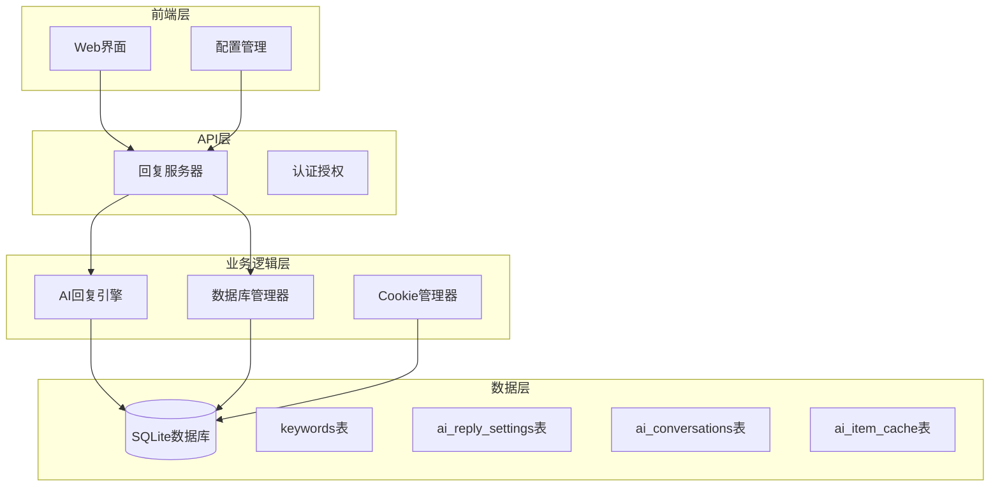
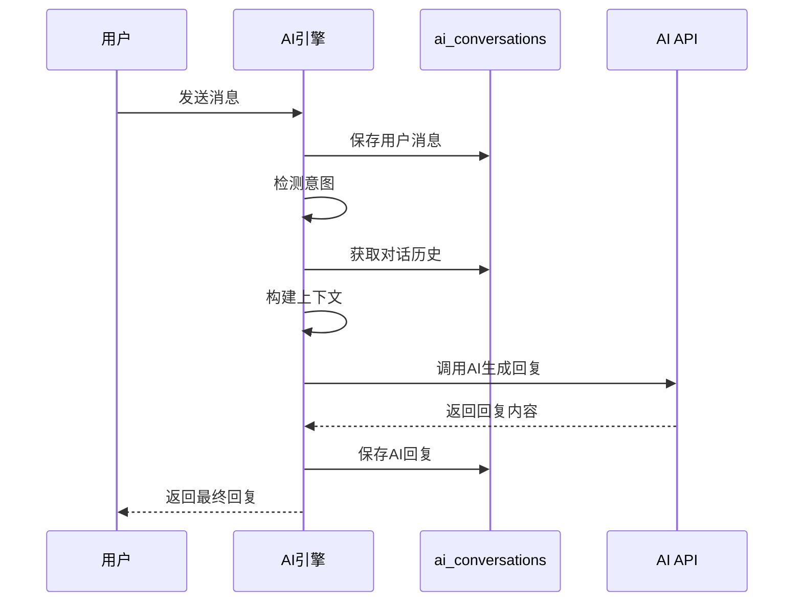
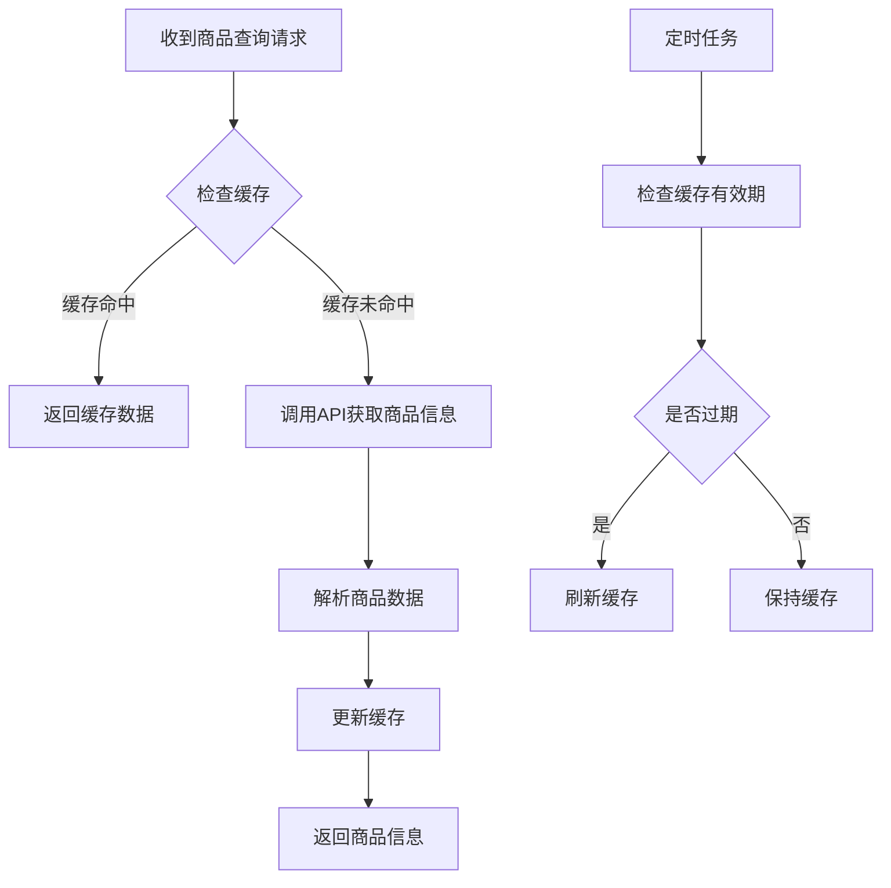
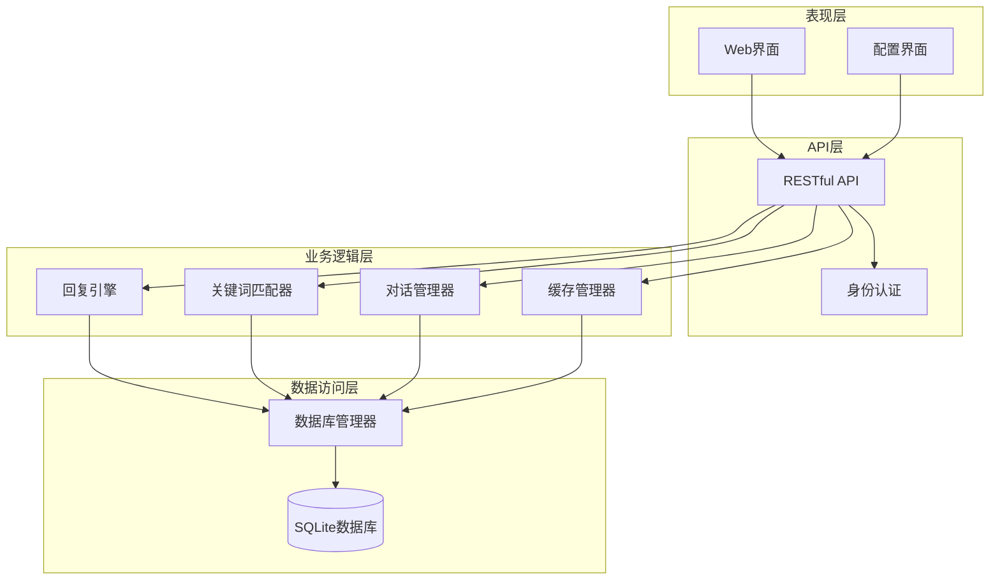
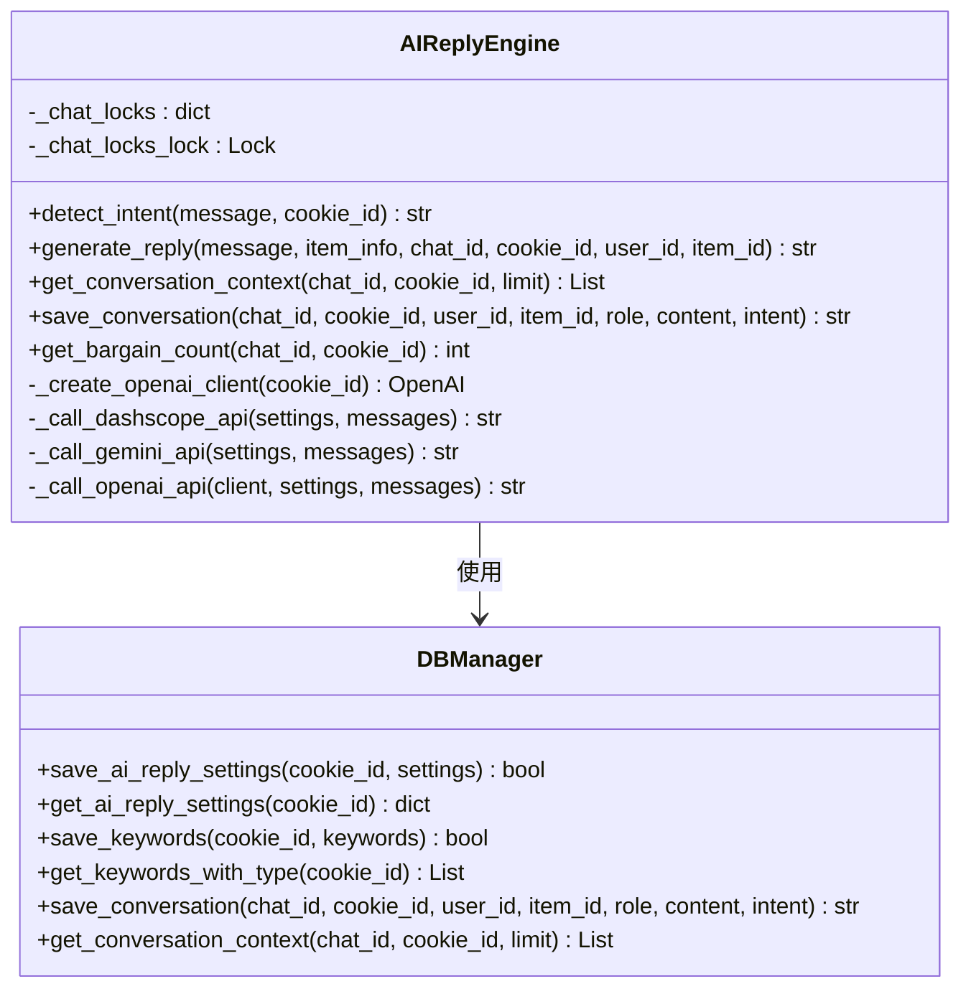
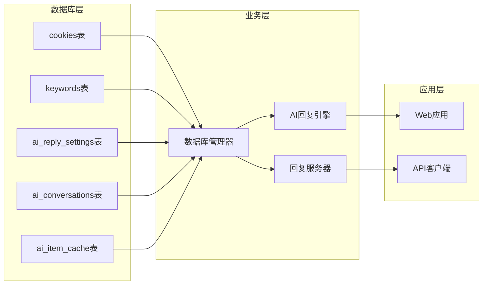

# 回复与AI表

<cite>
**本文档中引用的文件**
- [db_manager.py](file://db_manager.py)
- [ai_reply_engine.py](file://ai_reply_engine.py)
- [XianyuAutoAsync.py](file://XianyuAutoAsync.py)
- [reply_server.py](file://reply_server.py)
- [static/index.html](file://static/index.html)
- [static/js/app.js](file://static/js/app.js)
</cite>

## 目录
1. [简介](#简介)
2. [项目结构概览](#项目结构概览)
3. [核心数据表分析](#核心数据表分析)
4. [架构概览](#架构概览)
5. [详细组件分析](#详细组件分析)
6. [依赖关系分析](#依赖关系分析)
7. [性能考虑](#性能考虑)
8. [故障排除指南](#故障排除指南)
9. [结论](#结论)

## 简介

本文档详细分析了"xianyu-auto-reply"项目中与回复和AI功能相关的数据库表结构。该项目是一个基于Python的闲鱼自动回复系统，集成了AI回复引擎，支持关键词匹配、指定商品回复、AI对话管理和商品信息缓存等功能。

系统的核心围绕四个关键数据表设计：`keywords`（关键词表）、`ai_reply_settings`（AI回复设置表）、`ai_conversations`（AI对话历史表）和`ai_item_cache`（AI商品信息缓存表）。这些表协同工作，为用户提供智能化的聊天回复服务。

## 项目结构概览

该项目采用模块化架构，主要包含以下核心组件：



**图表来源**
- [db_manager.py](file://db_manager.py#L1-L50)
- [ai_reply_engine.py](file://ai_reply_engine.py#L1-L50)
- [reply_server.py](file://reply_server.py#L1-L50)

**章节来源**
- [db_manager.py](file://db_manager.py#L1-L100)
- [ai_reply_engine.py](file://ai_reply_engine.py#L1-L100)

## 核心数据表分析

### keywords表 - 关键词匹配系统

`keywords`表是系统的核心关键词匹配机制，支持通用关键词和指定商品关键词的双重匹配模式。

#### 表结构定义

```sql
CREATE TABLE IF NOT EXISTS keywords (
    cookie_id TEXT,
    keyword TEXT,
    reply TEXT,
    item_id TEXT,
    type TEXT DEFAULT 'text',
    image_url TEXT,
    FOREIGN KEY (cookie_id) REFERENCES cookies(id) ON DELETE CASCADE
)
```

#### 字段详解

| 字段名 | 数据类型 | 约束 | 说明 |
|--------|----------|------|------|
| cookie_id | TEXT | 外键约束 | 关联的Cookie标识符，建立与cookies表的一对一关系 |
| keyword | TEXT | - | 匹配的关键字，支持模糊匹配 |
| reply | TEXT | - | 匹配成功时返回的回复内容 |
| item_id | TEXT | - | 指定的商品ID，为空时表示通用关键词 |
| type | TEXT | 默认值'text' | 关键词类型，支持'text'（文本）和'image'（图片） |
| image_url | TEXT | - | 图片关键词对应的图片URL |

#### 唯一性约束机制

系统通过复合唯一索引实现智能的唯一性控制：

```sql
-- 通用关键词唯一性约束
CREATE UNIQUE INDEX idx_keywords_unique_no_item
ON keywords(cookie_id, keyword)
WHERE item_id IS NULL OR item_id = ''

-- 商品关键词唯一性约束  
CREATE UNIQUE INDEX idx_keywords_unique_with_item
ON keywords(cookie_id, keyword, item_id)
WHERE item_id IS NOT NULL AND item_id != ''
```

这种设计允许：
- 同一关键词可以同时作为通用关键词和商品关键词存在
- 防止重复的通用关键词
- 防止重复的商品关键词

**章节来源**
- [db_manager.py](file://db_manager.py#L128-L137)
- [db_manager.py](file://db_manager.py#L1035-L1085)

### ai_reply_settings表 - AI配置中心

`ai_reply_settings`表集中管理每个Cookie的AI回复配置，支持多种AI模型和个性化设置。

#### 表结构定义

```sql
CREATE TABLE IF NOT EXISTS ai_reply_settings (
    cookie_id TEXT PRIMARY KEY,
    ai_enabled BOOLEAN DEFAULT FALSE,
    model_name TEXT DEFAULT 'qwen-plus',
    api_key TEXT,
    base_url TEXT DEFAULT 'https://dashscope.aliyuncs.com/compatible-mode/v1',
    max_discount_percent INTEGER DEFAULT 10,
    max_discount_amount INTEGER DEFAULT 100,
    max_bargain_rounds INTEGER DEFAULT 3,
    custom_prompts TEXT,
    created_at TIMESTAMP DEFAULT CURRENT_TIMESTAMP,
    updated_at TIMESTAMP DEFAULT CURRENT_TIMESTAMP,
    FOREIGN KEY (cookie_id) REFERENCES cookies(id) ON DELETE CASCADE
)
```

#### 配置字段详解

| 字段名 | 数据类型 | 默认值 | 说明 |
|--------|----------|--------|------|
| ai_enabled | BOOLEAN | FALSE | 是否启用AI回复功能 |
| model_name | TEXT | 'qwen-plus' | AI模型名称，支持预设模型和自定义模型 |
| api_key | TEXT | - | AI服务API密钥 |
| base_url | TEXT | 默认阿里云DashScope地址 | AI服务API基础URL |
| max_discount_percent | INTEGER | 10 | 最大议价折扣百分比 |
| max_discount_amount | INTEGER | 100 | 最大议价折扣金额 |
| max_bargain_rounds | INTEGER | 3 | 最大议价轮数限制 |
| custom_prompts | TEXT | - | 自定义提示词（JSON格式） |

#### 支持的AI模型

系统支持多种AI服务提供商：

- **阿里云通义千问系列**：qwen-plus, qwen-turbo, qwen-max
- **OpenAI兼容接口**：gpt-3.5-turbo, gpt-4等
- **Google Gemini**：gemini-pro系列
- **自定义模型**：通过自定义base_url和model_name

**章节来源**
- [db_manager.py](file://db_manager.py#L151-L165)
- [ai_reply_engine.py](file://ai_reply_engine.py#L62-L81)

### ai_conversations表 - 对话上下文管理

`ai_conversations`表维护完整的AI对话历史，支持上下文理解和连续对话。

#### 表结构定义

```sql
CREATE TABLE IF NOT EXISTS ai_conversations (
    id INTEGER PRIMARY KEY AUTOINCREMENT,
    cookie_id TEXT NOT NULL,
    chat_id TEXT NOT NULL,
    user_id TEXT NOT NULL,
    item_id TEXT NOT NULL,
    role TEXT NOT NULL,
    content TEXT NOT NULL,
    intent TEXT,
    bargain_count INTEGER DEFAULT 0,
    created_at TIMESTAMP DEFAULT CURRENT_TIMESTAMP,
    FOREIGN KEY (cookie_id) REFERENCES cookies (id) ON DELETE CASCADE
)
```

#### 字段详解

| 字段名 | 数据类型 | 约束 | 说明 |
|--------|----------|------|------|
| id | INTEGER | 主键，自增 | 对话记录的唯一标识 |
| cookie_id | TEXT | 非空，外键 | 关联的Cookie标识符 |
| chat_id | TEXT | 非空 | 对话的唯一标识符 |
| user_id | TEXT | 非空 | 用户的唯一标识符 |
| item_id | TEXT | 非空 | 商品的唯一标识符 |
| role | TEXT | 非空 | 角色类型：'user'（用户）或'assistant'（AI） |
| content | TEXT | 非空 | 对话内容 |
| intent | TEXT | - | 意图识别结果：'price'（议价）、'tech'（技术）、'default'（默认） |
| bargain_count | INTEGER | 默认0 | 议价轮数计数 |
| created_at | TIMESTAMP | 默认当前时间 | 对话创建时间 |

#### 对话流程管理



**图表来源**
- [ai_reply_engine.py](file://ai_reply_engine.py#L283-L412)
- [db_manager.py](file://db_manager.py#L454-L473)

**章节来源**
- [db_manager.py](file://db_manager.py#L169-L182)
- [ai_reply_engine.py](file://ai_reply_engine.py#L436-L476)

### ai_item_cache表 - 商品信息缓存

`ai_item_cache`表提供高效的商品信息缓存机制，减少重复的API调用和提升响应速度。

#### 表结构定义

```sql
CREATE TABLE IF NOT EXISTS ai_item_cache (
    item_id TEXT PRIMARY KEY,
    data TEXT NOT NULL,
    price REAL,
    description TEXT,
    last_updated TIMESTAMP DEFAULT CURRENT_TIMESTAMP
)
```

#### 字段详解

| 字段名 | 数据类型 | 约束 | 说明 |
|--------|----------|------|------|
| item_id | TEXT | 主键 | 商品的唯一标识符 |
| data | TEXT | 非空 | 完整的商品原始数据（JSON格式） |
| price | REAL | - | 商品价格（数值类型） |
| description | TEXT | - | 商品描述信息 |
| last_updated | TIMESTAMP | 默认当前时间 | 数据最后更新时间 |

#### 缓存机制设计



**图表来源**
- [XianyuAutoAsync.py](file://XianyuAutoAsync.py#L3370-L3403)

**章节来源**
- [db_manager.py](file://db_manager.py#L186-L193)
- [XianyuAutoAsync.py](file://XianyuAutoAsync.py#L3370-L3403)

## 架构概览

系统采用分层架构设计，各层职责明确，数据流清晰：



**图表来源**
- [db_manager.py](file://db_manager.py#L17-L52)
- [ai_reply_engine.py](file://ai_reply_engine.py#L24-L36)

## 详细组件分析

### AI回复引擎组件

AI回复引擎是系统的核心组件，负责处理AI相关的所有逻辑。

#### 核心功能模块



**图表来源**
- [ai_reply_engine.py](file://ai_reply_engine.py#L24-L544)
- [db_manager.py](file://db_manager.py#L1766-L1844)

#### 意图检测机制

系统实现了本地关键词匹配的意图检测：

```python
# 价格相关关键词检测
price_keywords = [
    '便宜', '优惠', '刀', '降价', '包邮', '价格', '多少钱', '能少', '还能', '最低', '底价',
    '实诚价', '到100', '能到', '包个邮', '给个价', '什么价'
]

# 技术相关关键词检测
tech_keywords = ['怎么用', '参数', '坏了', '故障', '设置', '说明书', '功能', '用法', '教程', '驱动']
```

**章节来源**
- [ai_reply_engine.py](file://ai_reply_engine.py#L237-L275)

### 关键词匹配系统

关键词匹配系统支持两种匹配模式：

#### 通用关键词匹配
- 不指定商品ID
- 匹配任意商品的通用回复
- 适用于常见问题和固定回复

#### 商品特定关键词匹配
- 指定具体商品ID
- 提供针对特定商品的定制化回复
- 支持商品特性和参数的个性化描述

**章节来源**
- [db_manager.py](file://db_manager.py#L1457-L1650)

### 对话上下文管理

对话上下文管理系统维护完整的对话历史，支持：

#### 上下文窗口管理
- 最近20条消息的历史记录
- 时间窗口过滤（支持6秒和25秒窗口）
- 消息去重和排序

#### 议价轮数控制
- 基于意图的轮数统计
- 最大议价轮数限制
- 议价策略优化

**章节来源**
- [ai_reply_engine.py](file://ai_reply_engine.py#L436-L491)

### 商品信息缓存系统

商品信息缓存系统提供高效的缓存机制：

#### 缓存策略
- 基于item_id的主键缓存
- 自动更新机制
- 定期失效检查

#### 性能优化
- 减少API调用频率
- 提升响应速度
- 降低服务器负载

**章节来源**
- [db_manager.py](file://db_manager.py#L186-L193)

## 依赖关系分析

系统各组件之间存在清晰的依赖关系：



**图表来源**
- [db_manager.py](file://db_manager.py#L17-L52)
- [ai_reply_engine.py](file://ai_reply_engine.py#L24-L36)

### 外键关系

系统通过外键约束确保数据完整性：

| 外键字段 | 目标表 | 约束类型 | 说明 |
|----------|--------|----------|------|
| cookie_id | cookies.id | ON DELETE CASCADE | 删除Cookie时自动删除相关数据 |
| cookie_id | ai_reply_settings.cookie_id | ON DELETE CASCADE | 设置表与Cookie的关联 |
| cookie_id | ai_conversations.cookie_id | ON DELETE CASCADE | 对话历史与Cookie的关联 |

**章节来源**
- [db_manager.py](file://db_manager.py#L128-L193)

## 性能考虑

### 数据库性能优化

#### 索引策略
- `keywords`表：复合唯一索引支持高效查询
- `ai_conversations`表：按chat_id和cookie_id建立索引
- `ai_item_cache`表：基于item_id的主键索引

#### 查询优化
- 使用LIMIT限制返回结果数量
- 时间窗口过滤减少数据扫描
- 批量操作减少数据库往返

### 内存管理

#### 缓存策略
- AI回复引擎无状态设计
- 对话锁机制防止并发冲突
- 客户端连接池管理

#### 资源清理
- 定期清理过期对话记录
- 自动回收无用的缓存数据
- 连接池大小控制

## 故障排除指南

### 常见问题及解决方案

#### AI回复配置问题

**问题**：AI回复设置无法保存
**原因**：API密钥无效或网络连接问题
**解决**：检查API密钥有效性，验证网络连接

**问题**：AI回复生成失败
**原因**：模型不可用或请求超时
**解决**：切换备用模型，调整超时设置

#### 关键词匹配问题

**问题**：关键词匹配不准确
**原因**：关键词重复或格式错误
**解决**：检查关键词唯一性，标准化输入格式

**问题**：指定商品关键词不生效
**原因**：商品ID不匹配或缓存问题
**解决**：验证商品ID准确性，清除相关缓存

#### 对话历史问题

**问题**：对话上下文丢失
**原因**：数据库连接异常或事务回滚
**解决**：检查数据库连接状态，确保事务完整性

**问题**：议价轮数统计错误
**原因**：并发访问冲突
**解决**：使用数据库锁机制

**章节来源**
- [ai_reply_engine.py](file://ai_reply_engine.py#L414-L420)
- [db_manager.py](file://db_manager.py#L1470-L1494)

### 调试工具

系统提供了多种调试工具：

#### 数据库调试
- SQL日志记录
- 查询性能监控
- 错误信息追踪

#### AI功能调试
- 意图检测日志
- 对话历史记录
- API调用统计

#### 性能监控
- 响应时间统计
- 缓存命中率
- 并发访问监控

**章节来源**
- [db_manager.py](file://db_manager.py#L1108-L1141)
- [ai_reply_engine.py](file://ai_reply_engine.py#L290-L300)

## 结论

"xianyu-auto-reply"项目的回复与AI数据表设计体现了现代Web应用的最佳实践。通过精心设计的表结构和完善的业务逻辑，系统实现了：

### 核心优势

1. **模块化设计**：清晰的分层架构便于维护和扩展
2. **高性能缓存**：多级缓存机制显著提升响应速度
3. **数据完整性**：完善的外键约束确保数据一致性
4. **灵活配置**：支持多种AI模型和个性化设置
5. **智能匹配**：双重关键词匹配满足不同需求

### 技术特色

- **无状态设计**：支持多进程部署和水平扩展
- **智能缓存**：基于时间窗口的商品信息缓存
- **意图检测**：本地关键词匹配降低AI调用成本
- **并发控制**：对话锁机制保证数据一致性

### 应用价值

该系统为闲鱼等电商平台提供了智能化的客服解决方案，通过AI技术大幅提升用户体验，降低人工成本，是现代电商自动化的重要实践案例。