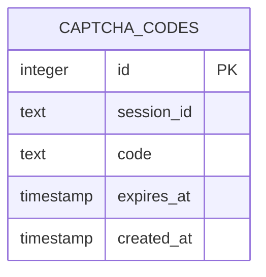
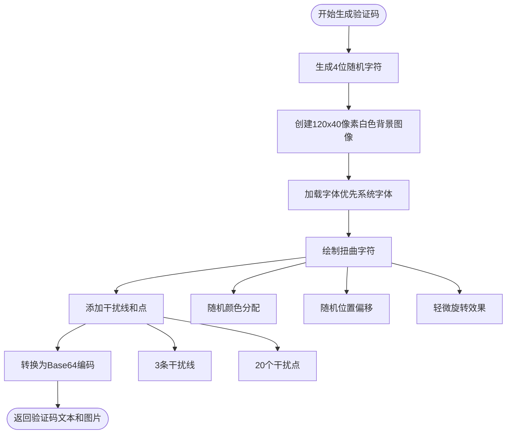
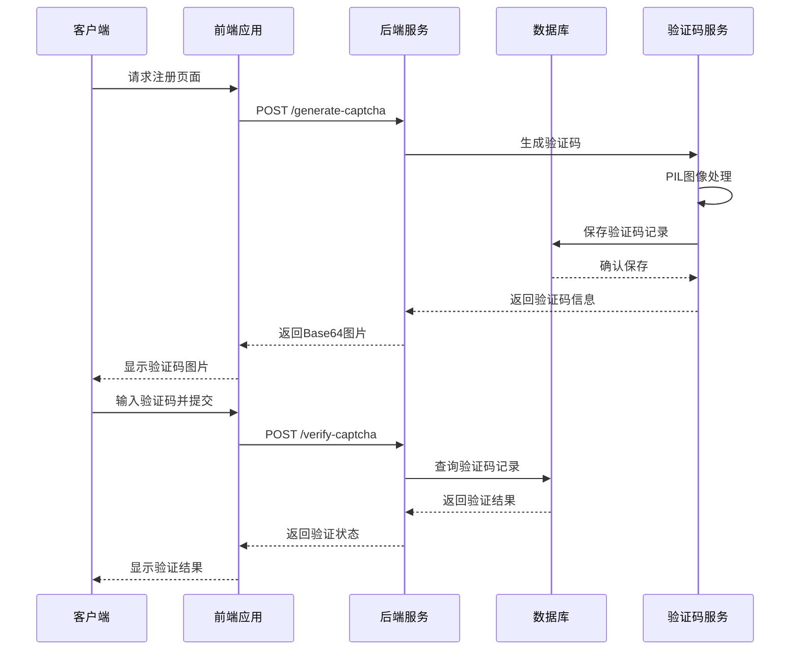
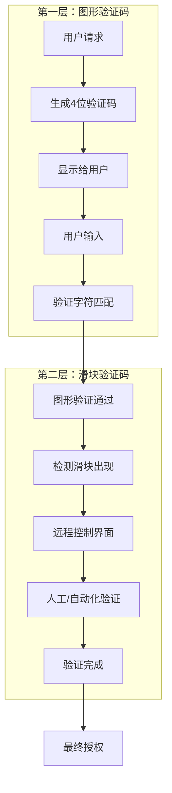

# 图形验证码表 (captcha_codes) 详细文档

<cite>
**本文档中引用的文件**
- [db_manager.py](file://db_manager.py)
- [api_captcha_remote.py](file://api_captcha_remote.py)
- [reply_server.py](file://reply_server.py)
- [utils\captcha_remote_control.py](file://utils/captcha_remote_control.py)
- [utils\slider_patch.py](file://utils/slider_patch.py)
- [static\register.html](file://static/register.html)
- [captcha_control.html](file://captcha_control.html)
</cite>

## 目录
1. [简介](#简介)
2. [表结构设计](#表结构设计)
3. [核心字段详解](#核心字段详解)
4. [验证码生成流程](#验证码生成流程)
5. [前后端接口集成](#前后端接口集成)
6. [安全防护机制](#安全防护机制)
7. [多层安全防护体系](#多层安全防护体系)
8. [性能优化策略](#性能优化策略)
9. [故障排除指南](#故障排除指南)
10. [总结](#总结)

## 简介

图形验证码表(captcha_codes)是闲鱼自动回复系统安全体系的核心组件之一，专门用于防范自动化脚本攻击和恶意注册行为。该表通过存储会话级别的验证码信息，与前端验证码接口(/api/captcha)和后端验证逻辑协同工作，构建了一套完整的防刷保护机制。

该表的设计充分考虑了安全性、性能和用户体验的平衡，在保证系统安全的同时，提供了流畅的用户交互体验。

## 表结构设计

### 数据库表定义



**图表来源**
- [db_manager.py](file://db_manager.py#L98-L106)

### 表结构特点

| 字段名 | 数据类型 | 约束条件 | 设计目的 |
|--------|----------|----------|----------|
| id | INTEGER | PRIMARY KEY AUTOINCREMENT | 唯一标识符，自动递增 |
| session_id | TEXT | NOT NULL | 会话标识，关联用户会话 |
| code | TEXT | NOT NULL | 验证码字符，存储生成的验证码 |
| expires_at | TIMESTAMP | NOT NULL | 过期时间戳，控制验证码有效期 |
| created_at | TIMESTAMP | DEFAULT CURRENT_TIMESTAMP | 创建时间，自动记录 |

**章节来源**
- [db_manager.py](file://db_manager.py#L98-L106)

## 核心字段详解

### session_id（会话标识）

**设计目的：**
- 建立验证码与用户会话的唯一关联
- 支持并发会话管理
- 实现验证码的生命周期控制

**技术实现：**
```python
# 会话ID生成示例（参考代码结构）
session_id = generate_unique_session_id()
```

**安全特性：**
- 基于UUID或随机字符串生成
- 与用户Cookie或Token绑定
- 支持分布式系统中的会话一致性

### code（验证码字符）

**设计目的：**
- 存储用户实际看到的验证码内容
- 支持大小写不敏感的验证
- 提供视觉识别的防机器人能力

**生成规则：**
- 长度：4位字符
- 字符集：大写字母(A-Z) + 数字(0-9)
- 示例：`ABCD`, `1A2B`, `XYZ9`

**技术实现：**
```python
# 验证码生成算法（参考代码结构）
chars = string.ascii_uppercase + string.digits
captcha_text = ''.join(random.choices(chars, k=4))
```

### expires_at（有效期）

**设计目的：**
- 防止验证码被长期滥用
- 限制攻击窗口期
- 支持自动清理过期数据

**时间控制策略：**
- 默认有效期：5分钟
- 时间单位：Unix时间戳
- 过期检查：基于当前时间比较

**技术实现：**
```python
# 过期时间计算（参考代码结构）
expires_at = time.time() + (expires_minutes * 60)
```

### created_at（创建时间）

**设计目的：**
- 记录验证码的生成时间
- 支持审计和追踪
- 用于排序和查询优化

**技术实现：**
- 自动填充：CURRENT_TIMESTAMP
- 精度：毫秒级
- 格式：ISO 8601标准

**章节来源**
- [db_manager.py](file://db_manager.py#L2606-L2655)

## 验证码生成流程

### PIL图像生成机制

系统采用Python Imaging Library (PIL)生成复杂的图形验证码，通过视觉混淆提高防机器人效果。



**图表来源**
- [db_manager.py](file://db_manager.py#L2540-L2604)

### 图像处理技术

**字体处理：**
- 优先使用系统字体（arial.ttf）
- 备用字体路径：C:/Windows/Fonts/arial.ttf
- 默认字体回退机制

**字符绘制：**
- 每个字符独立绘制
- 随机颜色范围：RGB(0-100, 0-100, 0-100)
- 随机位置偏移：±3像素
- 轻微倾斜效果

**干扰元素：**
- 干扰线：3条，随机起点终点
- 干扰点：20个，随机分布
- 颜色随机：RGB(100-200, 100-200, 100-200)

**Base64编码：**
- PNG格式输出
- data URI scheme
- 前缀：`data:image/png;base64,`

**章节来源**
- [db_manager.py](file://db_manager.py#L2540-L2604)

## 前后端接口集成

### API端点架构



**图表来源**
- [reply_server.py](file://reply_server.py#L707-L772)
- [api_captcha_remote.py](file://api_captcha_remote.py#L158-L319)

### 核心API接口

**验证码生成接口：**
- 端点：`POST /generate-captcha`
- 功能：生成新的图形验证码
- 参数：session_id（会话标识）
- 响应：包含Base64编码图片的JSON对象

**验证码验证接口：**
- 端点：`POST /verify-captcha`
- 功能：验证用户输入的验证码
- 参数：session_id、captcha_code
- 响应：验证成功/失败的状态信息

**远程控制接口：**
- 端点：`GET /api/captcha/control/{session_id}`
- 功能：提供滑块验证码的远程控制界面
- 特性：WebSocket实时通信、截图传输、鼠标事件处理

**章节来源**
- [reply_server.py](file://reply_server.py#L707-L772)
- [api_captcha_remote.py](file://api_captcha_remote.py#L278-L317)

## 安全防护机制

### 时间控制策略

**默认过期时间：**
- 5分钟有效期（可配置）
- Unix时间戳存储
- 自动清理机制

**过期检查逻辑：**
```python
# 过期验证算法（参考代码结构）
current_time = time.time()
if expires_at > current_time:
    # 验证码有效
else:
    # 验证码已过期
```

**安全优势：**
- 限制攻击窗口期
- 防止验证码被重复使用
- 支持动态调整有效期

### 防暴力破解机制

**验证码删除策略：**
- 验证成功后立即删除
- 防止多次尝试
- 确保每个验证码只能使用一次

**会话隔离：**
- 每个会话独立的验证码
- 防止跨会话攻击
- 支持并发用户处理

**章节来源**
- [db_manager.py](file://db_manager.py#L2629-L2655)

## 多层安全防护体系

### 与滑块验证码的协同



**图表来源**
- [utils\captcha_remote_control.py](file://utils/captcha_remote_control.py#L14-L369)
- [utils\slider_patch.py](file://utils/slider_patch.py#L166-L705)

### 安全防护层次

**第一层：基础字符验证**
- 防止简单OCR攻击
- 基础的人工智能识别难度
- 快速响应的用户体验

**第二层：视觉混淆增强**
- PIL图像处理
- 字体扭曲和颜色变化
- 干扰元素干扰
- 提高AI识别难度

**第三层：行为分析**
- 滑动轨迹分析
- 时间间隔检测
- 设备指纹识别
- 异常行为告警

**第四层：多因素认证**
- 图形验证码 + 滑块验证
- IP地址检测
- Cookie验证
- 设备绑定

### 远程控制机制

**WebSocket实时通信：**
- 实时截图传输
- 鼠标事件捕获
- 验证状态反馈
- 自动化控制支持

**人工验证支持：**
- 可视化控制界面
- 截图辅助判断
- 手动操作支持
- 进度监控功能

**章节来源**
- [utils\captcha_remote_control.py](file://utils/captcha_remote_control.py#L14-L369)

## 性能优化策略

### 数据库优化

**索引设计：**
- session_id字段建立索引
- expires_at字段支持快速过期检查
- 复合索引优化查询性能

**查询优化：**
```sql
-- 优化后的查询语句（参考代码结构）
SELECT id FROM captcha_codes 
WHERE session_id = ? AND code = ? AND expires_at > ?
ORDER BY created_at DESC LIMIT 1
```

**内存管理：**
- 使用连接池管理数据库连接
- 缓存热点验证码数据
- 定期清理过期记录

### 图像生成优化

**渲染优化：**
- 使用硬件加速字体渲染
- 优化图像压缩算法
- 减少内存占用

**缓存策略：**
- 静态资源缓存
- Base64编码预处理
- CDN分发支持

### 网络传输优化

**压缩传输：**
- Base64编码优化
- 图像质量平衡
- 传输协议优化

**并发处理：**
- 异步验证码生成
- 非阻塞验证流程
- 连接池管理

## 故障排除指南

### 常见问题诊断

**验证码生成失败：**
- 检查PIL库安装状态
- 验证字体文件可用性
- 确认临时目录权限

**数据库连接问题：**
- 检查SQLite文件权限
- 验证数据库表结构
- 确认连接池配置

**验证码验证失败：**
- 检查时间同步
- 验证会话ID正确性
- 确认验证码未过期

### 性能监控指标

**关键指标：**
- 验证码生成时间
- 数据库查询延迟
- 图像处理耗时
- 并发处理能力

**监控告警：**
- 响应时间阈值
- 错误率统计
- 资源使用监控
- 异常行为检测

### 故障恢复机制

**自动恢复：**
- 数据库连接重试
- 图像生成降级
- 缓存失效处理

**手动干预：**
- 远程控制界面
- 人工验证通道
- 系统状态监控

## 总结

图形验证码表(captcha_codes)作为闲鱼自动回复系统安全体系的核心组件，通过精心设计的表结构、完善的前后端接口和多层次的安全防护机制，为系统提供了强大的防刷保护能力。

**主要优势：**
- **安全性强**：多层防护机制，有效防范自动化攻击
- **性能优异**：优化的数据库设计和图像处理算法
- **用户体验佳**：平衡安全性和易用性的设计
- **扩展性强**：支持灵活的功能扩展和定制

**技术特色：**
- 基于PIL的复杂图像生成
- 实时的远程控制机制
- 完善的会话管理
- 灵活的过期控制策略

该系统不仅满足了当前的安全需求，还具备良好的扩展性和维护性，为未来的安全升级奠定了坚实的基础。通过持续的优化和改进，图形验证码系统将继续为闲鱼自动回复系统提供可靠的安全保障。