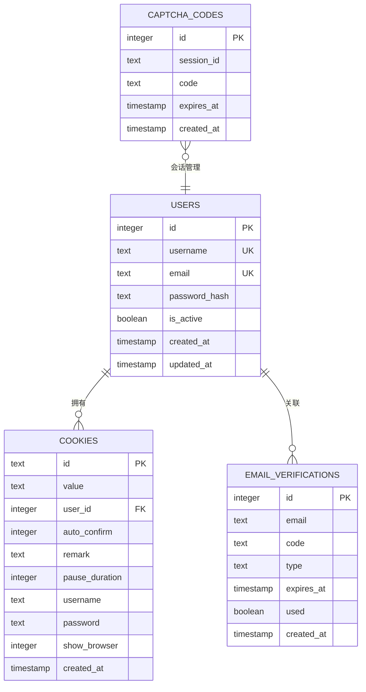
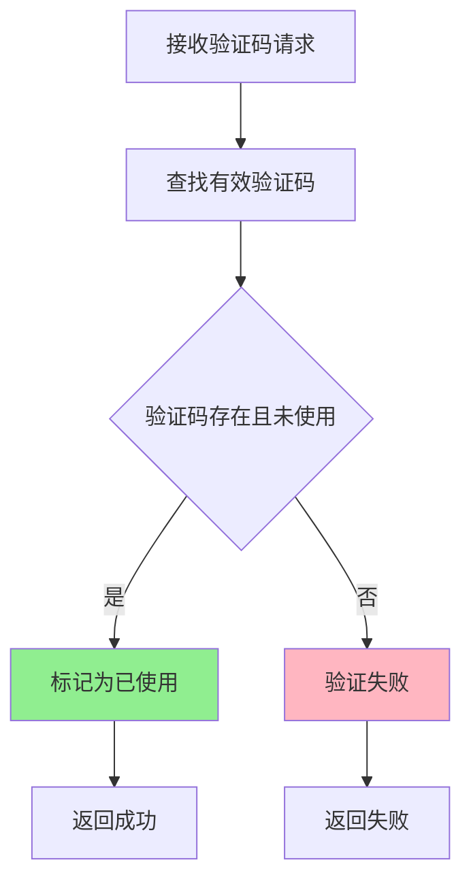
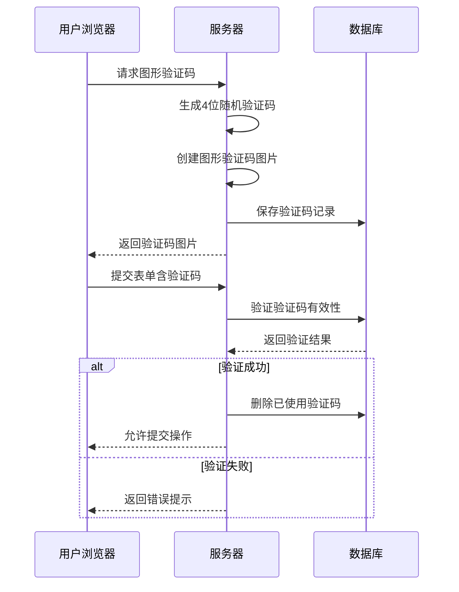
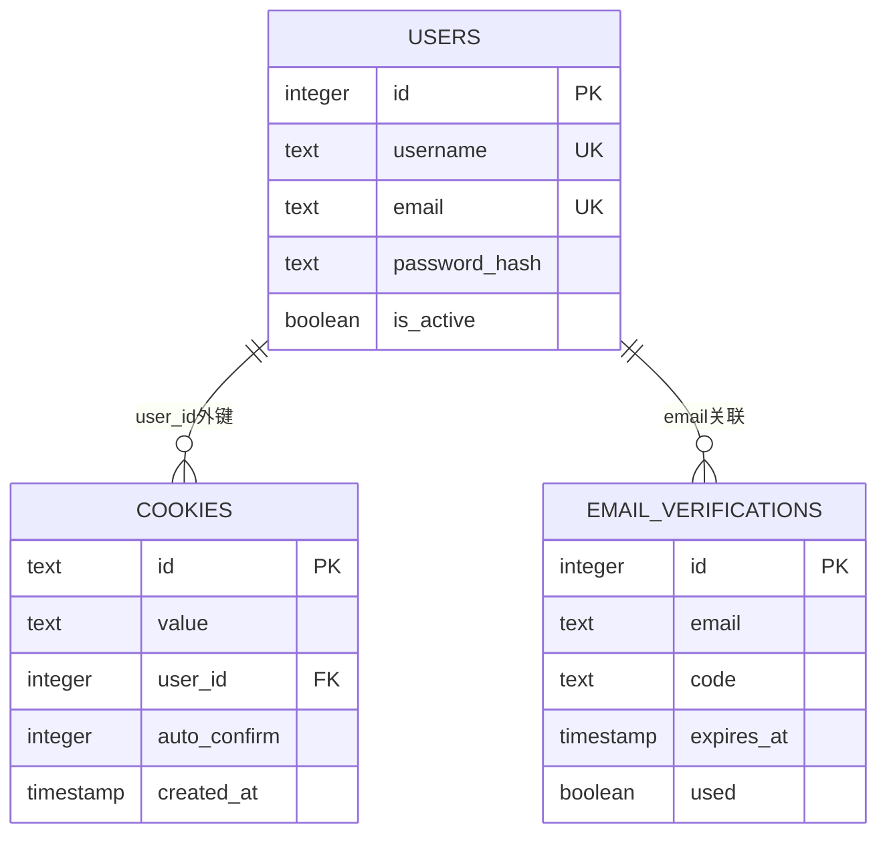
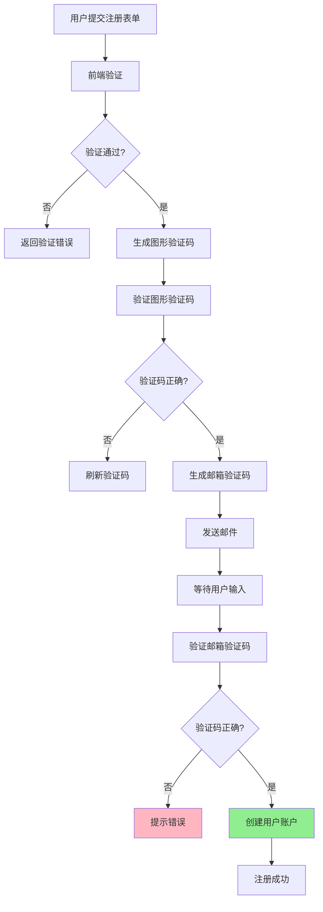
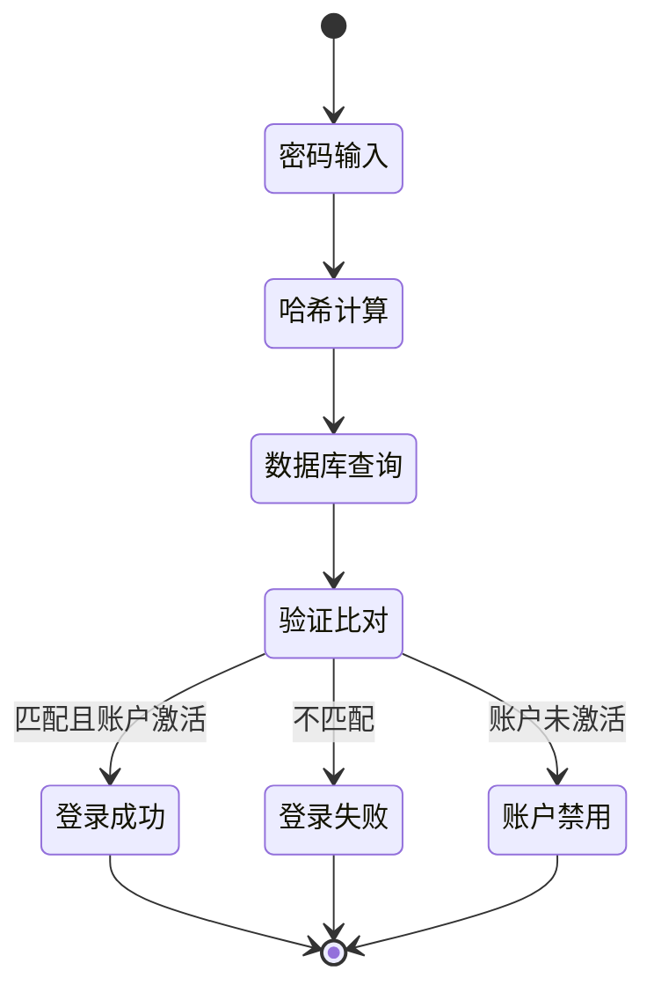

# 用户与认证表详细文档

<cite>
**本文档引用的文件**
- [db_manager.py](file://db_manager.py)
- [reply_server.py](file://reply_server.py)
- [config.py](file://config.py)
- [static/register.html](file://static/register.html)
- [static/login.html](file://static/login.html)
- [static/js/app.js](file://static/js/app.js)
</cite>

## 目录
1. [简介](#简介)
2. [数据库架构概览](#数据库架构概览)
3. [users表详细分析](#users表详细分析)
4. [email_verifications表详细分析](#email_verifications表详细分析)
5. [captcha_codes表详细分析](#captcha_codes表详细分析)
6. [表间关系与约束](#表间关系与约束)
7. [认证流程与业务逻辑](#认证流程与业务逻辑)
8. [安全性考虑](#安全性考虑)
9. [性能优化建议](#性能优化建议)
10. [故障排除指南](#故障排除指南)

## 简介

本文档详细分析了闲鱼自动回复系统中的用户与认证相关数据表结构，包括users、email_verifications和captcha_codes三个核心表的设计理念、字段定义、业务约束和相互关系。这些表构成了系统的身份认证和安全防护体系，支持多用户管理和防自动化攻击机制。

## 数据库架构概览

系统采用SQLite数据库，设计了简洁而功能完整的用户认证架构：



**图表来源**
- [db_manager.py](file://db_manager.py#L75-L123)

**节来源**
- [db_manager.py](file://db_manager.py#L67-L124)

## users表详细分析

### 表结构定义

users表是系统的核心用户数据表，采用SQLite的主键自增机制，确保每个用户的唯一性。

```sql
CREATE TABLE IF NOT EXISTS users (
    id INTEGER PRIMARY KEY AUTOINCREMENT,
    username TEXT UNIQUE NOT NULL,
    email TEXT UNIQUE NOT NULL,
    password_hash TEXT NOT NULL,
    is_active BOOLEAN DEFAULT TRUE,
    created_at TIMESTAMP DEFAULT CURRENT_TIMESTAMP,
    updated_at TIMESTAMP DEFAULT CURRENT_TIMESTAMP
)
```

### 字段详细说明

| 字段名 | 数据类型 | 约束条件 | 业务含义 | 安全考虑 |
|--------|----------|----------|----------|----------|
| id | INTEGER | PRIMARY KEY AUTOINCREMENT | 用户唯一标识符 | 自增主键，确保数据完整性 |
| username | TEXT | UNIQUE NOT NULL | 用户名 | 唯一约束，防止重复注册 |
| email | TEXT | UNIQUE NOT NULL | 邮箱地址 | 唯一约束，用于找回密码 |
| password_hash | TEXT | NOT NULL | 密码哈希值 | SHA256加密存储，不可逆 |
| is_active | BOOLEAN | DEFAULT TRUE | 账户激活状态 | 控制用户访问权限 |
| created_at | TIMESTAMP | DEFAULT CURRENT_TIMESTAMP | 创建时间 | 自动记录账户创建时间 |
| updated_at | TIMESTAMP | DEFAULT CURRENT_TIMESTAMP | 更新时间 | 自动更新账户信息变更 |

### 业务功能与约束

#### 多用户系统数据隔离
- **唯一性约束**：username和email字段的UNIQUE约束确保了不同用户的数据完全隔离
- **账户状态管理**：is_active字段支持账户的启用/禁用，便于管理员进行用户管理
- **时间戳追踪**：created_at和updated_at字段提供了完整的用户生命周期管理

#### 密码安全机制
- **哈希存储**：密码以SHA256哈希形式存储，即使数据库泄露也无法获取明文密码
- **不可逆性**：哈希算法不可逆，确保密码安全
- **定期更新**：updated_at字段支持密码修改后的状态同步

**节来源**
- [db_manager.py](file://db_manager.py#L75-L83)
- [db_manager.py](file://db_manager.py#L2426-L2448)

## email_verifications表详细分析

### 表结构定义

email_verifications表专门负责管理邮箱验证和密码重置功能，支持多种验证码类型的灵活扩展。

```sql
CREATE TABLE IF NOT EXISTS email_verifications (
    id INTEGER PRIMARY KEY AUTOINCREMENT,
    email TEXT NOT NULL,
    code TEXT NOT NULL,
    type TEXT DEFAULT 'register',
    expires_at TIMESTAMP NOT NULL,
    used BOOLEAN DEFAULT FALSE,
    created_at TIMESTAMP DEFAULT CURRENT_TIMESTAMP
)
```

### 字段详细说明

| 字段名 | 数据类型 | 约束条件 | 业务含义 | 验证场景 |
|--------|----------|----------|----------|----------|
| id | INTEGER | PRIMARY KEY AUTOINCREMENT | 验证记录唯一标识 | 数据库自增主键 |
| email | TEXT | NOT NULL | 目标邮箱地址 | 验证目标，不能为空 |
| code | TEXT | NOT NULL | 6位数字验证码 | 核心验证要素 |
| type | TEXT | DEFAULT 'register' | 验证码类型 | register/login/reset |
| expires_at | TIMESTAMP | NOT NULL | 过期时间戳 | 时间有效性控制 |
| used | BOOLEAN | DEFAULT FALSE | 使用状态标志 | 防止重复使用 |
| created_at | TIMESTAMP | DEFAULT CURRENT_TIMESTAMP | 创建时间 | 记录生成时间 |

### 验证码类型与业务场景

#### 注册场景（type='register'）
- **验证目的**：确认邮箱所有权，防止恶意注册
- **前置检查**：系统会检查邮箱是否已被注册
- **有效期**：10分钟有效，防止长时间暴露风险

#### 登录场景（type='login'）
- **验证目的**：替代传统密码验证，提高安全性
- **前置检查**：系统会验证邮箱是否已注册
- **用户体验**：避免密码记忆负担，提升易用性

#### 密码重置场景（type='reset'）
- **验证目的**：允许用户在忘记密码时重置账户
- **安全措施**：需要验证邮箱所有权
- **时效性**：严格的时间限制确保安全性

### 防重复使用机制

系统实现了严格的验证码防重复使用机制：



**图表来源**
- [db_manager.py](file://db_manager.py#L2677-L2705)

**节来源**
- [db_manager.py](file://db_manager.py#L88-L96)
- [db_manager.py](file://db_manager.py#L2657-L2705)

## captcha_codes表详细分析

### 表结构定义

captcha_codes表负责管理图形验证码系统，防止自动化攻击和机器人滥用。

```sql
CREATE TABLE IF NOT EXISTS captcha_codes (
    id INTEGER PRIMARY KEY AUTOINCREMENT,
    session_id TEXT NOT NULL,
    code TEXT NOT NULL,
    expires_at TIMESTAMP NOT NULL,
    created_at TIMESTAMP DEFAULT CURRENT_TIMESTAMP
)
```

### 字段详细说明

| 字段名 | 数据类型 | 约束条件 | 业务含义 | 安全作用 |
|--------|----------|----------|----------|----------|
| id | INTEGER | PRIMARY KEY AUTOINCREMENT | 验证码记录标识 | 数据库自增主键 |
| session_id | TEXT | NOT NULL | 会话标识符 | 关联用户会话 |
| code | TEXT | NOT NULL | 4位图形验证码 | 用户输入验证 |
| expires_at | TIMESTAMP | NOT NULL | 过期时间戳 | 时间窗口控制 |
| created_at | TIMESTAMP | DEFAULT CURRENT_TIMESTAMP | 创建时间 | 记录生成时间 |

### 图形验证码生成机制

系统实现了动态图形验证码生成功能：

#### 验证码内容特征
- **字符组成**：4位字符，包含大写字母和数字
- **视觉干扰**：添加干扰线和像素点，增加识别难度
- **颜色随机**：每个字符使用随机颜色，防止OCR识别
- **位置偏移**：字符位置轻微随机化，增强安全性

#### 验证码生命周期管理
- **有效期**：默认5分钟，短时间窗口防止暴力破解
- **会话绑定**：通过session_id与特定会话关联
- **自动清理**：过期验证码自动删除，保持数据库整洁

### 防自动化攻击策略



**图表来源**
- [db_manager.py](file://db_manager.py#L2540-L2624)

**节来源**
- [db_manager.py](file://db_manager.py#L100-L107)
- [db_manager.py](file://db_manager.py#L2606-L2624)

## 表间关系与约束

### 外键关系设计

系统通过外键约束建立了清晰的数据关系：



**图表来源**
- [db_manager.py](file://db_manager.py#L122-L123)

### 级联删除机制

- **cookies表**：当用户被删除时，其所有cookies记录自动级联删除
- **email_verifications表**：用户删除不影响历史验证记录
- **数据一致性**：确保删除操作不会产生孤立数据

### 索引优化策略

| 表名 | 索引字段 | 用途 | 性能影响 |
|------|----------|------|----------|
| users | username, email | 用户查询加速 | 查询性能提升 |
| email_verifications | email, expires_at | 验证码查询优化 | 验证效率提升 |
| captcha_codes | session_id, expires_at | 会话验证码管理 | 验证响应速度 |

**节来源**
- [db_manager.py](file://db_manager.py#L122-L123)

## 认证流程与业务逻辑

### 用户注册流程



**图表来源**
- [static/register.html](file://static/register.html#L467-L531)
- [reply_server.py](file://reply_server.py#L844-L858)

### 登录认证流程

系统支持多种登录方式，每种都有相应的安全机制：

#### 方式一：用户名密码登录
1. **密码验证**：使用SHA256哈希比对
2. **账户状态检查**：验证is_active字段
3. **Token生成**：生成JWT风格的会话Token

#### 方式二：邮箱验证码登录
1. **邮箱验证**：确认邮箱存在且已验证
2. **验证码验证**：验证6位数字验证码
3. **无密码体验**：提升用户体验

#### 方式三：图形验证码保护
- **防刷机制**：每次操作前必须通过图形验证码
- **会话绑定**：验证码与特定会话关联
- **时间限制**：5分钟有效期

### 密码管理机制



**图表来源**
- [db_manager.py](file://db_manager.py#L2502-L2510)

**节来源**
- [reply_server.py](file://reply_server.py#L578-L613)
- [static/login.html](file://static/login.html#L296-L330)

## 安全性考虑

### 密码安全

#### 哈希算法选择
- **算法**：SHA256（推荐更高级的bcrypt/scrypt）
- **加盐**：虽然当前未显式加盐，但用户名可视为隐式盐值
- **不可逆性**：确保密码泄露时无法还原原始密码

#### 密码策略
- **最小长度**：6位字符
- **字符类型**：不限制特殊字符
- **定期更新**：支持密码修改功能

### 验证码安全

#### 数字验证码特性
- **长度**：6位数字，易于用户输入
- **复杂度**：足够抵抗暴力破解
- **有效期**：10分钟，减少暴露风险

#### 图形验证码安全
- **字符集**：大小写字母+数字，增加识别难度
- **视觉干扰**：线条和像素点混淆
- **随机性**：每次生成都不同
- **时间限制**：5分钟有效期

### 会话安全管理

#### Token机制
- **生成方式**：secrets.token_urlsafe(32)
- **长度**：约43字符的安全字符串
- **过期时间**：24小时自动失效
- **存储位置**：客户端Cookie或LocalStorage

#### 会话绑定
- **用户关联**：每个会话绑定特定用户
- **并发控制**：防止同一账户多处登录
- **异常检测**：监控异常登录行为

### 防护机制

#### 防暴力破解
- **验证码保护**：每次敏感操作都需要验证码
- **频率限制**：验证码发送间隔限制
- **错误反馈**：不提供具体错误信息

#### 防重放攻击
- **一次性使用**：验证码使用后立即失效
- **时间窗口**：严格的时间限制
- **会话隔离**：不同会话独立验证

**节来源**
- [db_manager.py](file://db_manager.py#L2536-L2539)
- [reply_server.py](file://reply_server.py#L178-L181)

## 性能优化建议

### 数据库优化

#### 索引策略
- **users表**：在username和email字段上建立复合索引
- **email_verifications表**：在(email, expires_at)上建立索引
- **captcha_codes表**：在(session_id, expires_at)上建立索引

#### 查询优化
- **批量操作**：定期清理过期验证码记录
- **连接池**：使用数据库连接池减少连接开销
- **事务管理**：合理使用事务边界

### 缓存策略

#### Redis集成建议
- **验证码缓存**：将图形验证码存储在Redis中
- **会话缓存**：将用户会话信息缓存
- **限流缓存**：记录IP访问频率

#### 缓存过期策略
- **验证码**：5分钟过期时间
- **会话**：24小时过期时间
- **用户信息**：1小时过期时间

### 异步处理

#### 邮件发送优化
- **异步队列**：使用消息队列处理邮件发送
- **重试机制**：失败邮件自动重试
- **超时控制**：邮件发送超时处理

#### 验证码生成
- **预生成**：提前生成验证码图片
- **CDN加速**：验证码图片使用CDN分发
- **压缩优化**：图片压缩减少传输时间

## 故障排除指南

### 常见问题诊断

#### 用户注册失败
**症状**：注册时提示"用户名或邮箱已存在"
**原因分析**：
- 用户名已被占用
- 邮箱地址已被注册
- 数据库连接异常

**解决方案**：
1. 检查用户名唯一性
2. 验证邮箱地址可用性
3. 确认数据库服务正常

#### 验证码发送失败
**症状**：验证码邮件未收到
**原因分析**：
- SMTP配置错误
- 邮箱地址无效
- 邮件服务器限制

**解决方案**：
1. 检查SMTP服务器配置
2. 验证邮箱地址格式
3. 查看邮件发送日志

#### 登录验证失败
**症状**：输入正确的用户名密码仍无法登录
**原因分析**：
- 账户被禁用
- 密码哈希不匹配
- 数据库连接问题

**解决方案**：
1. 检查用户账户状态
2. 验证密码哈希计算
3. 确认数据库连接

### 性能问题排查

#### 数据库性能
**指标监控**：
- 查询响应时间
- 并发连接数
- 磁盘I/O使用率

**优化措施**：
- 添加适当索引
- 优化慢查询
- 调整数据库参数

#### 网络延迟
**监控项目**：
- 验证码加载时间
- 登录响应时间
- API调用延迟

**改进方案**：
- CDN加速
- 本地缓存
- 连接复用

### 日志分析

#### 关键日志位置
- **数据库操作日志**：db_manager.py中的logger输出
- **认证过程日志**：reply_server.py中的认证相关日志
- **系统运行日志**：应用级别的错误和警告

#### 日志级别配置
- **DEBUG**：详细的操作步骤
- **INFO**：关键业务事件
- **WARNING**：潜在问题警告
- **ERROR**：错误和异常

**节来源**
- [db_manager.py](file://db_manager.py#L2441-L2448)
- [reply_server.py](file://reply_server.py#L578-L613)

## 结论

闲鱼自动回复系统的用户与认证表设计体现了现代Web应用的安全性和可扩展性需求。通过users、email_verifications和captcha_codes三个核心表的协同工作，系统实现了：

### 核心优势
- **安全性**：多重验证机制和加密存储
- **易用性**：多种登录方式满足不同用户需求
- **可维护性**：清晰的表结构和约束设计
- **扩展性**：支持未来功能扩展和升级

### 改进建议
- **密码策略**：引入更强的密码复杂度要求
- **双因素认证**：考虑添加短信或TOTP认证
- **审计日志**：增加详细的用户操作审计
- **监控告警**：建立完善的系统监控体系

这套认证系统为闲鱼自动回复功能提供了坚实的安全基础，确保了用户数据的安全和系统的稳定运行。