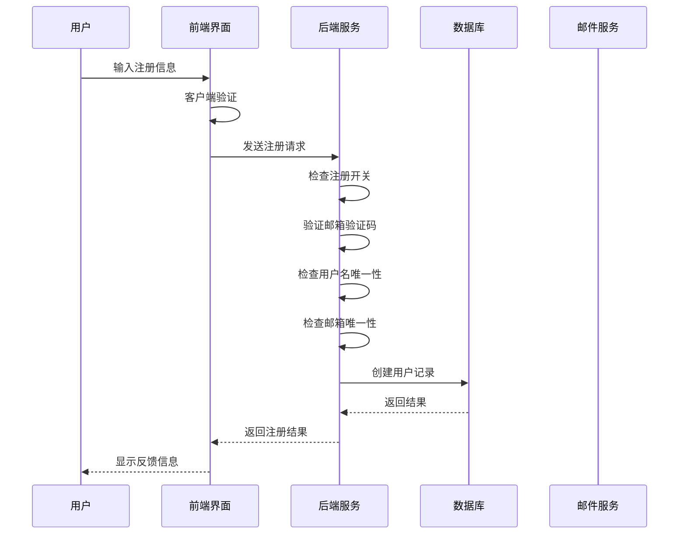
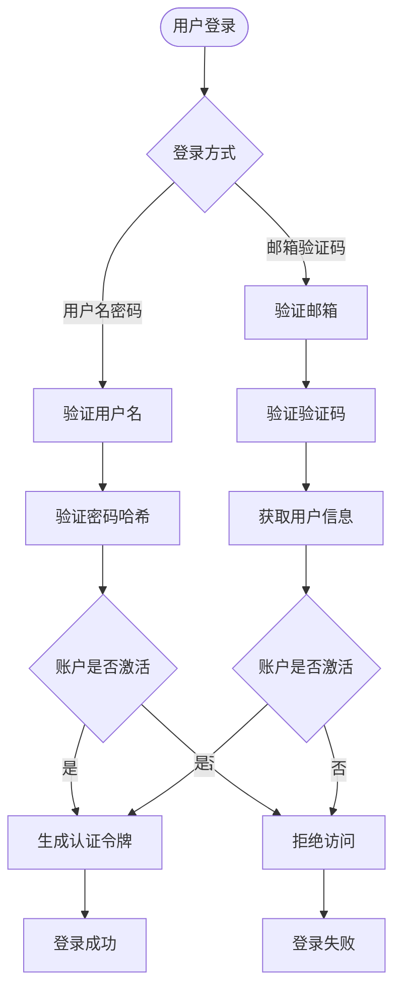

# 用户表 (users) 详细文档

<cite>
**本文档引用的文件**
- [db_manager.py](file://db_manager.py)
- [reply_server.py](file://reply_server.py)
- [config.py](file://config.py)
- [register.html](file://static/register.html)
- [login.html](file://static/login.html)
- [app.js](file://static/js/app.js)
</cite>

## 目录
1. [简介](#简介)
2. [表结构设计](#表结构设计)
3. [字段详解](#字段详解)
4. [数据完整性约束](#数据完整性约束)
5. [外键关联关系](#外键关联关系)
6. [业务逻辑实现](#业务逻辑实现)
7. [系统设置集成](#系统设置集成)
8. [安全机制](#安全机制)
9. [性能考虑](#性能考虑)
10. [故障排除指南](#故障排除指南)

## 简介

用户表(users)是整个系统的核心数据表，负责存储和管理所有用户的基本信息。该表采用SQLite数据库实现，提供了完整的用户身份验证、权限管理和审计跟踪功能。通过精心设计的字段结构和约束机制，确保了用户数据的安全性和一致性。

## 表结构设计

```mermaid
erDiagram
USERS {
integer id PK
text username UK NN
text email UK NN
text password_hash NN
boolean is_active
timestamp created_at
timestamp updated_at
}
COOKIES {
text id PK
text value
integer user_id FK
integer auto_confirm
text remark
integer pause_duration
text username
text password
integer show_browser
timestamp created_at
}
USER_SETTINGS {
integer id PK
integer user_id FK
text key
text value
text description
timestamp created_at
timestamp updated_at
}
EMAIL_VERIFICATIONS {
integer id PK
text email
text code
timestamp expires_at
boolean used
timestamp created_at
}
USERS ||--o{ COOKIES : "拥有多个"
USERS ||--o{ USER_SETTINGS : "配置多个"
USERS ||--o{ EMAIL_VERIFICATIONS : "验证多个"
```

**图表来源**
- [db_manager.py](file://db_manager.py#L73-L83)
- [db_manager.py](file://db_manager.py#L109-L123)
- [db_manager.py](file://db_manager.py#L393-L406)

**章节来源**
- [db_manager.py](file://db_manager.py#L73-L83)

## 字段详解

### 主键字段 - id
- **类型**: INTEGER PRIMARY KEY AUTOINCREMENT
- **特性**: 自动递增主键，确保每个用户的唯一标识
- **用途**: 作为数据库内部引用的主要键值，支持高效的索引查找
- **约束**: 系统自动维护，不允许手动指定或修改

### 用户名字段 - username
- **类型**: TEXT UNIQUE NOT NULL
- **长度限制**: 3-20个字符
- **字符集**: 只允许字母、数字和下划线
- **唯一性**: 全局唯一约束，防止重复注册
- **验证**: 前端和后端双重验证，确保格式正确性

### 邮箱字段 - email
- **类型**: TEXT UNIQUE NOT NULL
- **格式验证**: 标准邮箱格式验证
- **唯一性**: 全局唯一约束，确保邮箱的唯一性
- **用途**: 用于密码找回、验证码发送和系统通知

### 密码哈希字段 - password_hash
- **类型**: TEXT NOT NULL
- **算法**: SHA256哈希算法
- **安全性**: 存储不可逆的哈希值，保护用户密码安全
- **验证**: 登录时进行哈希对比验证

### 账户状态字段 - is_active
- **类型**: BOOLEAN DEFAULT TRUE
- **用途**: 控制用户账户的激活状态
- **安全控制**: 封禁状态下用户无法登录
- **审计**: 记录账户变更历史

### 时间戳字段 - created_at 和 updated_at
- **类型**: TIMESTAMP DEFAULT CURRENT_TIMESTAMP
- **自动更新**: created_at在创建时自动设置，updated_at在更新时自动更新
- **审计价值**: 提供完整的用户生命周期跟踪
- **格式**: ISO 8601标准时间格式

**章节来源**
- [db_manager.py](file://db_manager.py#L73-L83)
- [register.html](file://static/register.html#L483-L510)

## 数据完整性约束

### 唯一性约束
```sql
CREATE TABLE IF NOT EXISTS users (
    id INTEGER PRIMARY KEY AUTOINCREMENT,
    username TEXT UNIQUE NOT NULL,
    email TEXT UNIQUE NOT NULL,
    password_hash TEXT NOT NULL,
    is_active BOOLEAN DEFAULT TRUE,
    created_at TIMESTAMP DEFAULT CURRENT_TIMESTAMP,
    updated_at TIMESTAMP DEFAULT CURRENT_TIMESTAMP
)
```

### 非空约束
- **username**: 必须提供用户名
- **email**: 必须提供有效的邮箱地址
- **password_hash**: 必须提供密码哈希值

### 默认值约束
- **is_active**: 默认为TRUE（激活状态）
- **created_at**: 默认为当前时间戳
- **updated_at**: 默认为当前时间戳

**章节来源**
- [db_manager.py](file://db_manager.py#L73-L83)

## 外键关联关系

### 与 cookies 表的关联
```sql
CREATE TABLE IF NOT EXISTS cookies (
    id TEXT PRIMARY KEY,
    value TEXT NOT NULL,
    user_id INTEGER NOT NULL,
    auto_confirm INTEGER DEFAULT 1,
    remark TEXT DEFAULT '',
    pause_duration INTEGER DEFAULT 10,
    username TEXT DEFAULT '',
    password TEXT DEFAULT '',
    show_browser INTEGER DEFAULT 0,
    created_at TIMESTAMP DEFAULT CURRENT_TIMESTAMP,
    FOREIGN KEY (user_id) REFERENCES users(id) ON DELETE CASCADE
)
```

### 与 user_settings 表的关联
```sql
CREATE TABLE IF NOT EXISTS user_settings (
    id INTEGER PRIMARY KEY AUTOINCREMENT,
    user_id INTEGER NOT NULL,
    key TEXT NOT NULL,
    value TEXT NOT NULL,
    description TEXT,
    created_at TIMESTAMP DEFAULT CURRENT_TIMESTAMP,
    updated_at TIMESTAMP DEFAULT CURRENT_TIMESTAMP,
    FOREIGN KEY (user_id) REFERENCES users(id) ON DELETE CASCADE,
    UNIQUE(user_id, key)
)
```

### 级联删除机制
- **ON DELETE CASCADE**: 当用户被删除时，其相关的cookies和设置也会自动删除
- **数据一致性**: 确保用户数据的完整性和一致性

**章节来源**
- [db_manager.py](file://db_manager.py#L109-L123)
- [db_manager.py](file://db_manager.py#L393-L406)

## 业务逻辑实现

### 用户注册流程



**图表来源**
- [reply_server.py](file://reply_server.py#L844-L905)
- [register.html](file://static/register.html#L467-L541)

### 登录验证流程



**图表来源**
- [reply_server.py](file://reply_server.py#L578-L654)
- [db_manager.py](file://db_manager.py#L2502-L2510)

### 密码加密存储

系统采用SHA256算法对用户密码进行加密存储：

```python
# 密码加密实现
password_hash = hashlib.sha256(password.encode()).hexdigest()
```

**章节来源**
- [db_manager.py](file://db_manager.py#L2431)
- [db_manager.py](file://db_manager.py#L2508)

## 系统设置集成

### 注册开关功能

系统通过`registration_enabled`系统设置控制用户注册功能：

```python
# 获取注册状态
registration_enabled = db_manager.get_system_setting('registration_enabled')
if registration_enabled != 'true':
    # 注册功能已关闭
    return RegisterResponse(success=False, message="注册功能已关闭，请联系管理员")
```

### 管理员控制界面

管理员可以通过Web界面动态控制注册开关：

```javascript
// 更新注册设置
async function updateRegistrationSettings() {
    const enabled = document.getElementById('registrationEnabled').checked;
    const response = await fetch('/registration-settings', {
        method: 'PUT',
        headers: {
            'Content-Type': 'application/json',
            'Authorization': `Bearer ${authToken}`
        },
        body: JSON.stringify({ enabled: enabled })
    });
}
```

### 默认设置值

系统初始化时设置以下默认值：
- `registration_enabled`: 'true'（注册功能开启）
- `show_default_login_info`: 'true'（显示默认登录信息）

**章节来源**
- [reply_server.py](file://reply_server.py#L448-L451)
- [reply_server.py](file://reply_server.py#L848-L851)
- [db_manager.py](file://db_manager.py#L427-L438)
- [app.js](file://static/js/app.js#L8649-L8690)

## 安全机制

### 账户状态控制

`is_active`字段提供了灵活的账户管理机制：

- **正常状态**: `is_active = TRUE`，用户可以正常登录和使用系统
- **封禁状态**: `is_active = FALSE`，用户无法登录，但数据保留
- **审计追踪**: 通过created_at和updated_at字段记录状态变更时间

### 密码安全

- **单向加密**: 使用SHA256算法进行密码哈希，确保密码不可逆
- **客户端验证**: 前端进行密码强度验证，提升用户体验
- **传输安全**: HTTPS协议保护密码传输过程

### 验证码机制

系统实现了多层次的验证码验证：

1. **图形验证码**: 防止机器人注册
2. **邮箱验证码**: 确认邮箱所有权
3. **时效控制**: 验证码10分钟内有效

### 数据完整性保护

- **唯一性约束**: 防止重复的用户名和邮箱
- **非空约束**: 确保关键字段的完整性
- **级联删除**: 保证相关数据的一致性

**章节来源**
- [db_manager.py](file://db_manager.py#L2508-L2510)
- [register.html](file://static/register.html#L483-L510)

## 性能考虑

### 索引优化

虽然SQLite自动为PRIMARY KEY创建索引，但以下字段也具有查询需求：

- **username**: 用户名登录查询
- **email**: 邮箱登录查询
- **id**: 主键查询

### 并发控制

系统使用线程锁保护数据库操作：

```python
self.lock = threading.RLock()  # 使用可重入锁保护数据库操作
```

### 缓存策略

- **内存缓存**: 用户信息在内存中缓存，减少数据库查询
- **会话管理**: 使用内存中的SESSION_TOKENS存储认证信息

### 数据库迁移

系统具备数据库版本管理能力，支持：
- 新字段的自动添加
- 约束的动态更新
- 数据类型的兼容性处理

**章节来源**
- [db_manager.py](file://db_manager.py#L51-L52)
- [db_manager.py](file://db_manager.py#L558-L612)

## 故障排除指南

### 常见问题及解决方案

#### 注册功能无法使用
**症状**: 注册页面显示"注册功能已关闭"
**原因**: `registration_enabled`设置为false
**解决**: 
1. 登录管理员界面
2. 进入系统设置
3. 启用"开启用户注册"选项

#### 用户名或邮箱重复
**症状**: 注册时提示"用户名已存在"或"邮箱已被注册"
**原因**: 该用户名或邮箱已被其他用户使用
**解决**: 
1. 使用不同的用户名或邮箱
2. 检查是否已经注册过

#### 密码验证失败
**症状**: 登录时提示"用户名或密码错误"
**原因**: 
- 密码输入错误
- 账户被封禁（is_active=false）
- 账户不存在

**解决**: 
1. 确认密码输入正确
2. 联系管理员检查账户状态
3. 使用密码找回功能

#### 验证码问题
**症状**: 无法收到验证码或验证码无效
**原因**: 
- 邮箱地址错误
- 邮件服务器配置问题
- 验证码过期

**解决**: 
1. 检查邮箱地址是否正确
2. 确认邮件服务器配置
3. 重新发送验证码

### 调试信息

系统提供了详细的日志记录：

```python
logger.info(f"【{request.username}】尝试注册，邮箱: {request.email}")
logger.warning(f"【{request.username}】注册失败: 用户名已存在")
logger.error(f"【{request.username}】注册异常: {e}")
```

这些日志有助于快速定位和解决问题。

**章节来源**
- [reply_server.py](file://reply_server.py#L448-L451)
- [reply_server.py](file://reply_server.py#L869-L875)
- [reply_server.py](file://reply_server.py#L858-L866)

## 结论

用户表(users)作为系统的核心组件，通过精心设计的结构和完善的业务逻辑，提供了安全、可靠、高性能的用户管理功能。其独特的设计特点包括：

- **安全性**: 多层次的安全机制，包括密码加密、账户状态控制和验证码验证
- **灵活性**: 支持多种登录方式和动态配置
- **可扩展性**: 良好的外键关联设计，便于功能扩展
- **可维护性**: 完善的日志记录和错误处理机制

通过合理使用这些功能，系统能够为用户提供优质的用户体验，同时确保数据的安全性和系统的稳定性。