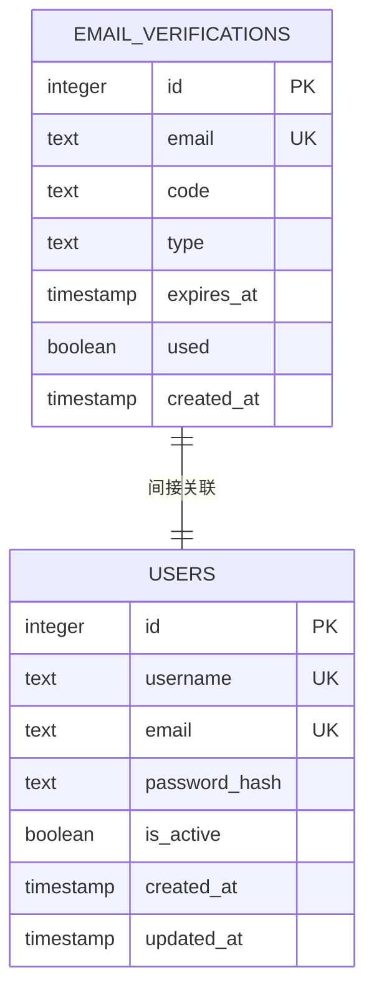
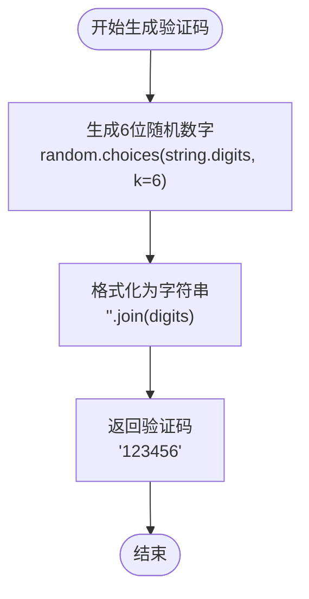
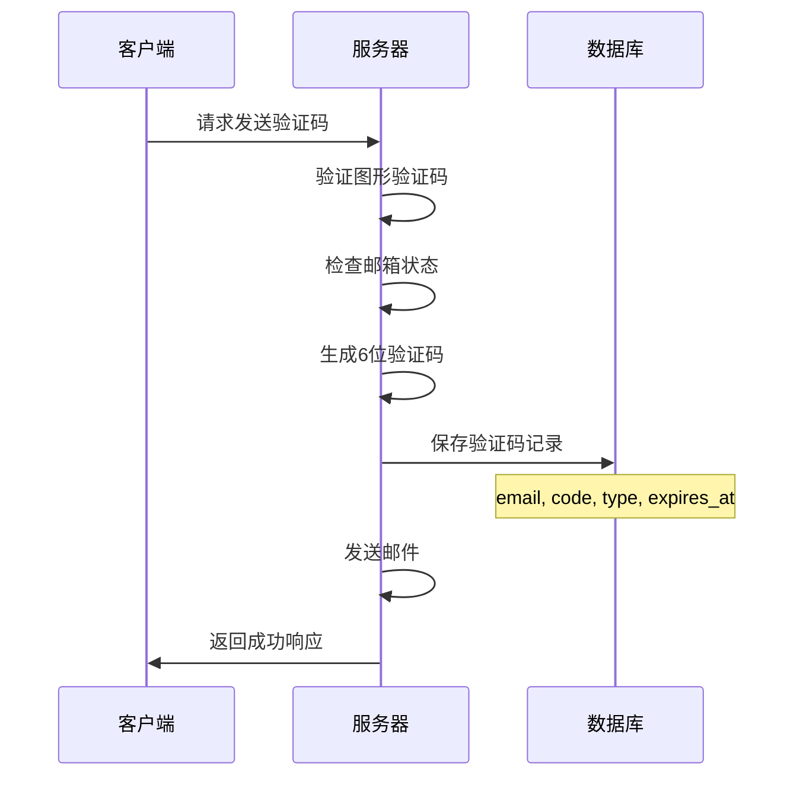
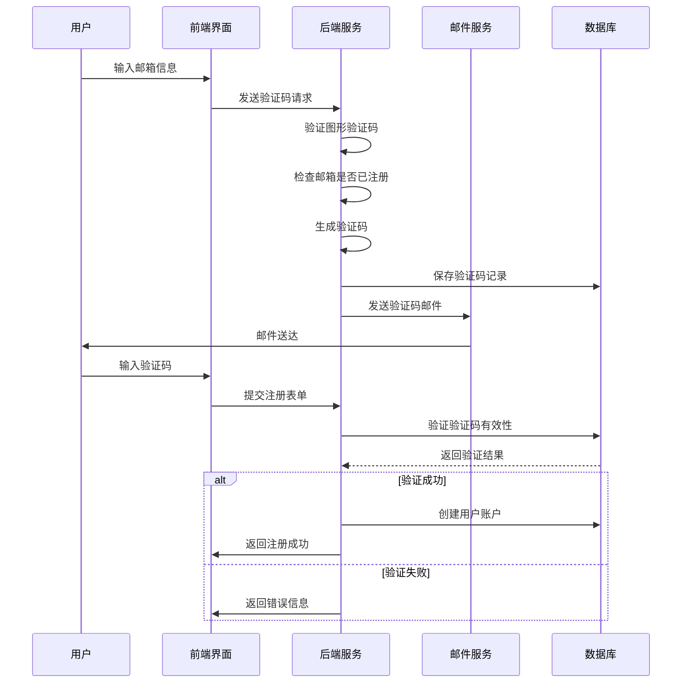
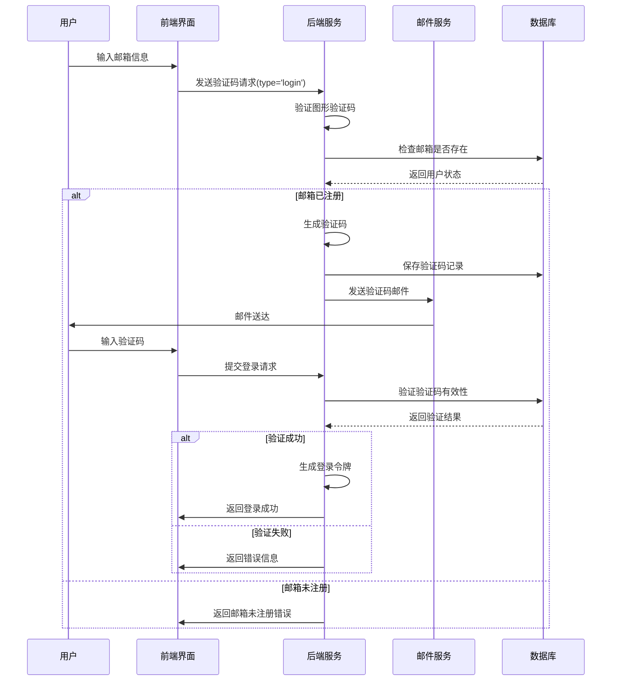
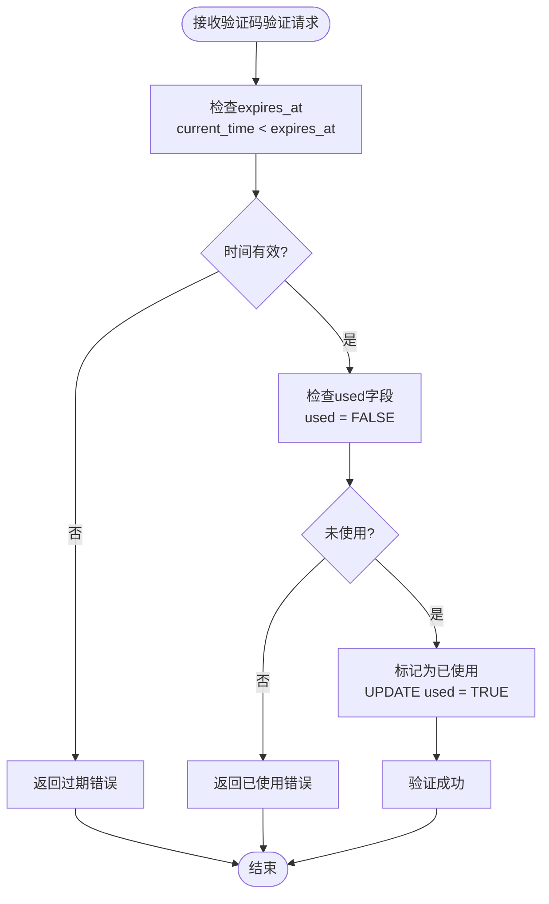
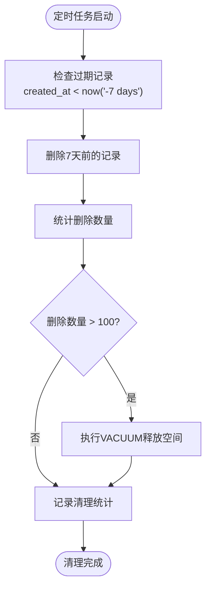
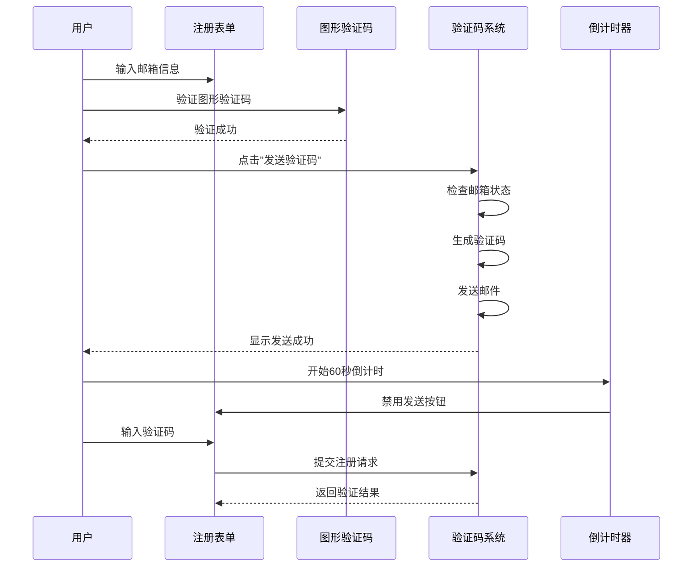
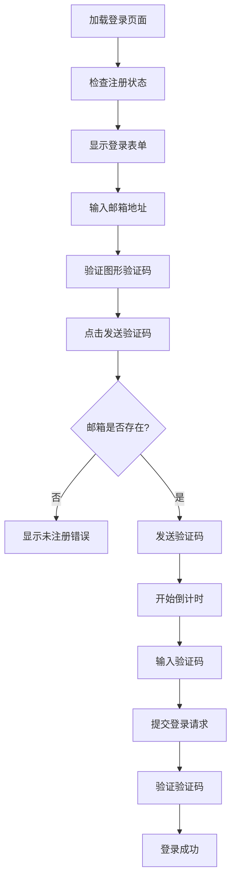

# 邮箱验证表 (email_verifications) 详细文档

<cite>
**本文档引用的文件**
- [db_manager.py](file://db_manager.py)
- [reply_server.py](file://reply_server.py)
- [register.html](file://static/register.html)
- [login.html](file://static/login.html)
- [app.js](file://static/js/app.js)
</cite>

## 目录
1. [简介](#简介)
2. [表结构设计](#表结构设计)
3. [核心字段详解](#核心字段详解)
4. [验证码生成与存储](#验证码生成与存储)
5. [验证流程分析](#验证流程分析)
6. [安全机制](#安全机制)
7. [数据库操作](#数据库操作)
8. [前端集成](#前端集成)
9. [性能优化](#性能优化)
10. [故障排除](#故障排除)

## 简介

邮箱验证表(email_verifications)是闲鱼自动回复系统中的核心安全组件，专门用于支撑用户注册和密码重置功能中的邮箱验证流程。该表通过存储临时的验证码信息，确保只有经过邮箱验证的用户才能完成注册或重置密码操作，从而有效防止恶意注册和账户安全风险。

## 表结构设计

### DDL语句示例

```sql
CREATE TABLE IF NOT EXISTS email_verifications (
    id INTEGER PRIMARY KEY AUTOINCREMENT,
    email TEXT NOT NULL,
    code TEXT NOT NULL,
    type TEXT DEFAULT 'register',
    expires_at TIMESTAMP NOT NULL,
    used BOOLEAN DEFAULT FALSE,
    created_at TIMESTAMP DEFAULT CURRENT_TIMESTAMP
);
```

### 表结构图



**图表来源**
- [db_manager.py](file://db_manager.py#L87-L96)

**节来源**
- [db_manager.py](file://db_manager.py#L87-L96)

## 核心字段详解

### email 字段
- **数据类型**: TEXT
- **约束**: NOT NULL, UNIQUE
- **业务含义**: 存储需要验证的邮箱地址
- **技术实现**: 作为主键约束的一部分，确保每个邮箱在同一时间只能有一个有效的验证码
- **安全考虑**: 邮箱格式验证在前端和后端双重检查

### code 字段  
- **数据类型**: TEXT
- **约束**: NOT NULL
- **业务含义**: 存储6位数字验证码
- **技术实现**: 通过`generate_verification_code()`方法生成，使用`random.choices(string.digits, k=6)`创建
- **安全特性**: 6位纯数字组合，提供约10^6种可能的验证码

### type 字段
- **数据类型**: TEXT
- **默认值**: 'register'
- **业务含义**: 验证码类型标识
- **取值范围**: 
  - `'register'`: 用户注册场景
  - `'login'`: 密码重置场景
- **技术实现**: 在数据库迁移中动态添加，默认值设为'register'

### expires_at 字段
- **数据类型**: TIMESTAMP
- **约束**: NOT NULL
- **业务含义**: 验证码过期时间戳
- **技术实现**: 通过`time.time() + (expires_minutes * 60)`计算，10分钟有效期
- **清理机制**: 数据库定期清理超过7天的历史记录

### used 字段
- **数据类型**: BOOLEAN
- **默认值**: FALSE
- **业务含义**: 验证码使用状态标志
- **技术实现**: 验证成功后更新为TRUE，防止重复使用
- **安全作用**: 一次性验证机制，确保验证码只能使用一次

### created_at 字段
- **数据类型**: TIMESTAMP
- **默认值**: CURRENT_TIMESTAMP
- **业务含义**: 验证码创建时间
- **用途**: 支持历史数据分析和清理策略

**节来源**
- [db_manager.py](file://db_manager.py#L87-L96)
- [db_manager.py](file://db_manager.py#L2536-L2538)

## 验证码生成与存储

### 验证码生成策略



**图表来源**
- [db_manager.py](file://db_manager.py#L2536-L2538)

### 生成方法实现

验证码生成采用简单而安全的策略：
- **算法**: 使用Python标准库`random.choices()`函数
- **字符集**: 仅使用数字字符(0-9)，共10个字符
- **长度**: 6位数字，提供1,000,000种可能组合
- **安全性**: 基于操作系统提供的随机数生成器

### 存储过程



**图表来源**
- [reply_server.py](file://reply_server.py#L776-L833)
- [db_manager.py](file://db_manager.py#L2657-L2675)

**节来源**
- [db_manager.py](file://db_manager.py#L2536-L2538)
- [db_manager.py](file://db_manager.py#L2657-L2675)

## 验证流程分析

### 注册场景验证流程



**图表来源**
- [reply_server.py](file://reply_server.py#L776-L884)
- [db_manager.py](file://db_manager.py#L2677-L2705)

### 登录场景验证流程



**图表来源**
- [reply_server.py](file://reply_server.py#L776-L833)
- [db_manager.py](file://db_manager.py#L2677-L2705)

### 验证码验证逻辑

验证过程包含多层检查机制：

1. **基础验证**: 邮箱、验证码、类型匹配
2. **时间验证**: 检查expires_at是否超时
3. **状态验证**: 确认used字段为FALSE
4. **排序验证**: 按created_at降序查找最新记录

**节来源**
- [reply_server.py](file://reply_server.py#L776-L884)
- [db_manager.py](file://db_manager.py#L2677-L2705)

## 安全机制

### 防重放攻击



**图表来源**
- [db_manager.py](file://db_manager.py#L2684-L2699)

### 多重验证机制

1. **图形验证码**: 防止自动化脚本攻击
2. **邮箱唯一性检查**: 防止重复注册
3. **验证码时效性**: 10分钟有效期
4. **一次性使用**: 验证后立即标记为已使用
5. **会话隔离**: 每个会话独立的验证码

### 防恶意注册策略

| 防护措施 | 实现方式 | 效果 |
|---------|---------|------|
| 图形验证码 | 前端JS生成4位字符验证码 | 阻止自动化注册 |
| 邮箱检查 | 注册前检查邮箱是否已存在 | 防止重复注册 |
| 验证码限制 | 每个邮箱每10分钟最多1次 | 限制频率攻击 |
| 时间窗口 | 10分钟有效期内不可重复使用 | 防止重放攻击 |
| 错误反馈 | 模糊错误信息避免信息泄露 | 防止枚举攻击 |

**节来源**
- [db_manager.py](file://db_manager.py#L2684-L2699)
- [reply_server.py](file://reply_server.py#L795-L811)

## 数据库操作

### 查询优化

```sql
-- 验证码查询优化
SELECT id FROM email_verifications
WHERE email = ? AND code = ? AND type = ? 
AND expires_at > ? AND used = FALSE
ORDER BY created_at DESC LIMIT 1
```

### 索引设计建议

虽然SQLite自动为PRIMARY KEY创建索引，但建议在以下字段上添加复合索引：

```sql
CREATE INDEX idx_email_type_used ON email_verifications(email, type, used);
CREATE INDEX idx_expires_at ON email_verifications(expires_at);
```

### 清理策略



**图表来源**
- [db_manager.py](file://db_manager.py#L5064-L5074)

**节来源**
- [db_manager.py](file://db_manager.py#L2684-L2699)
- [db_manager.py](file://db_manager.py#L5064-L5074)

## 前端集成

### 注册页面集成

前端通过JavaScript实现完整的验证码流程：



**图表来源**
- [register.html](file://static/register.html#L423-L463)
- [app.js](file://static/js/app.js#L7473-L7507)

### 登录页面集成

登录页面的验证码流程类似，但验证类型为`'login'`：



**图表来源**
- [login.html](file://static/login.html#L602-L642)

### 前端验证规则

| 验证项目 | 规则 | 错误提示 |
|---------|------|----------|
| 图形验证码 | 必须验证成功 | "请先验证图形验证码" |
| 邮箱格式 | 正则表达式验证 | "请输入有效的邮箱地址" |
| 验证码输入 | 不能为空 | "请输入验证码" |
| 倒计时控制 | 60秒冷却期 | "验证码已发送，请稍候" |

**节来源**
- [register.html](file://static/register.html#L423-L463)
- [login.html](file://static/login.html#L602-L642)

## 性能优化

### 缓存策略

虽然SQLite本身不支持传统意义上的缓存，但可以通过以下方式优化：

1. **连接池**: 使用`check_same_thread=False`支持多线程访问
2. **事务批处理**: 批量操作减少I/O开销
3. **锁机制**: 使用`with self.lock:`确保并发安全

### 内存管理

```python
# 数据库连接优化
self.conn = sqlite3.connect(self.db_path, check_same_thread=False)
self.conn.row_factory = sqlite3.Row  # 支持字典式访问
```

### 查询优化

1. **索引使用**: 在email、type、used字段上建立复合索引
2. **LIMIT优化**: 使用`LIMIT 1`只获取最新记录
3. **ORDER BY优化**: 按created_at降序排列，优先检查最新记录

### 清理优化

定期清理过期数据，避免表过大影响性能：

```python
# 每日清理超过7天的数据
cursor.execute("DELETE FROM email_verifications WHERE created_at < datetime('now', '-7 days')")
```

## 故障排除

### 常见问题及解决方案

| 问题类型 | 症状 | 可能原因 | 解决方案 |
|---------|------|---------|----------|
| 验证码发送失败 | 用户收到"发送失败"提示 | 邮件配置错误 | 检查SMTP设置 |
| 验证失败 | 用户收到"验证码错误" | 验证码过期或已使用 | 检查expires_at和used字段 |
| 注册被拒绝 | 用户无法注册 | 邮箱已存在 | 检查users表中的邮箱唯一性 |
| 性能问题 | 验证响应缓慢 | 数据库表过大 | 执行VACUUM清理碎片 |

### 调试工具

```python
# 启用SQL日志
logger.info(f"SQL日志已启用，日志级别: {self.sql_log_level}")

# 查询调试
cursor.execute('''
SELECT id, email, code, type, expires_at, used, created_at 
FROM email_verifications 
WHERE email = ? ORDER BY created_at DESC LIMIT 5
''', (email,))
```

### 监控指标

1. **验证码发送成功率**: 成功发送/总请求
2. **验证码验证成功率**: 验证成功/总验证请求
3. **平均响应时间**: 数据库查询耗时
4. **存储空间使用**: 表大小和增长趋势

**节来源**
- [db_manager.py](file://db_manager.py#L63-L64)
- [db_manager.py](file://db_manager.py#L5064-L5074)

## 结论

邮箱验证表(email_verifications)作为闲鱼自动回复系统的核心安全组件，通过精心设计的字段结构、验证流程和安全机制，为用户注册和密码重置提供了可靠的安全保障。其简洁而有效的设计不仅满足了基本的业务需求，还具备良好的扩展性和维护性，是现代Web应用中邮箱验证系统的优秀实践案例。

通过本文档的详细分析，开发者可以深入理解该表的设计理念和实现细节，为类似系统的开发提供参考和指导。