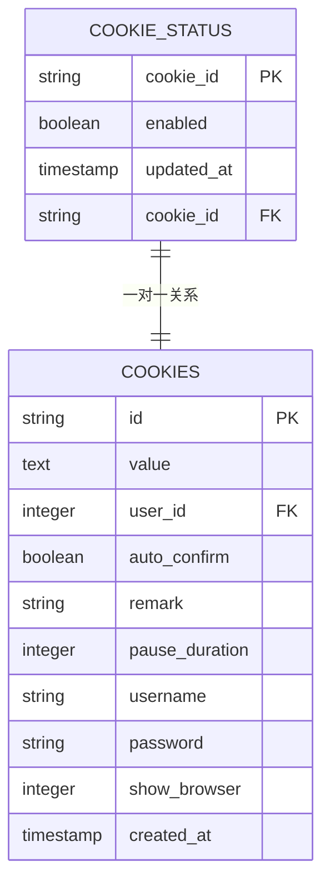
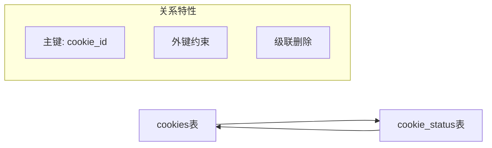
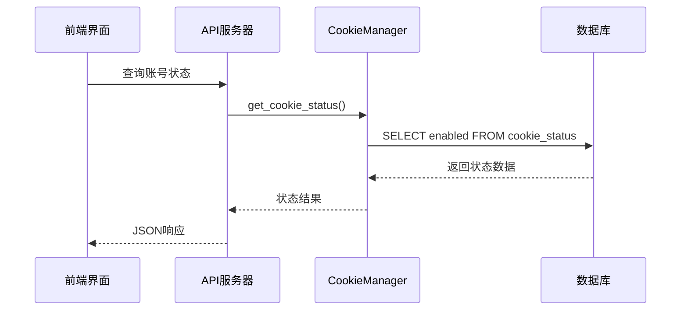
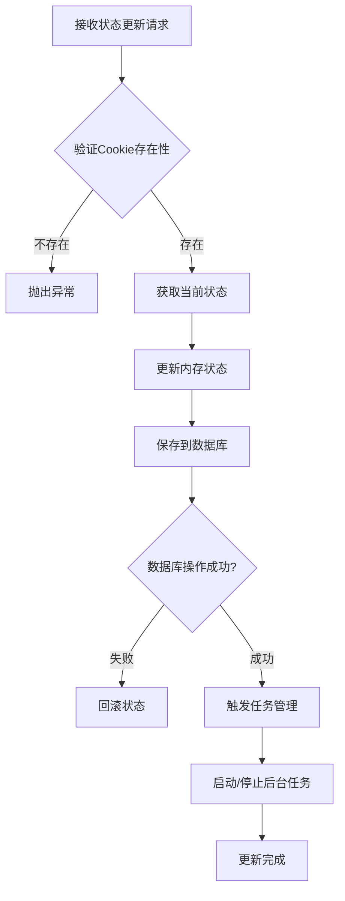
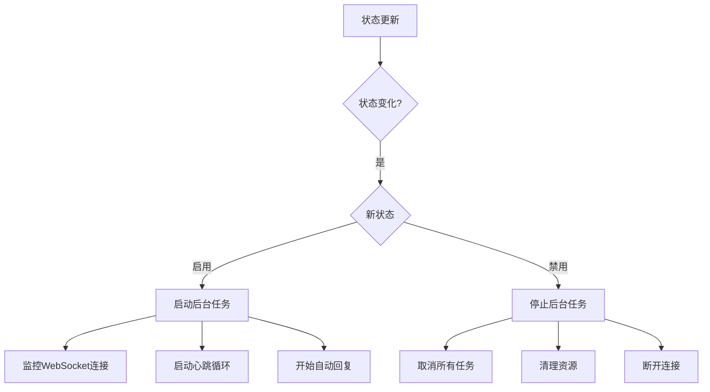
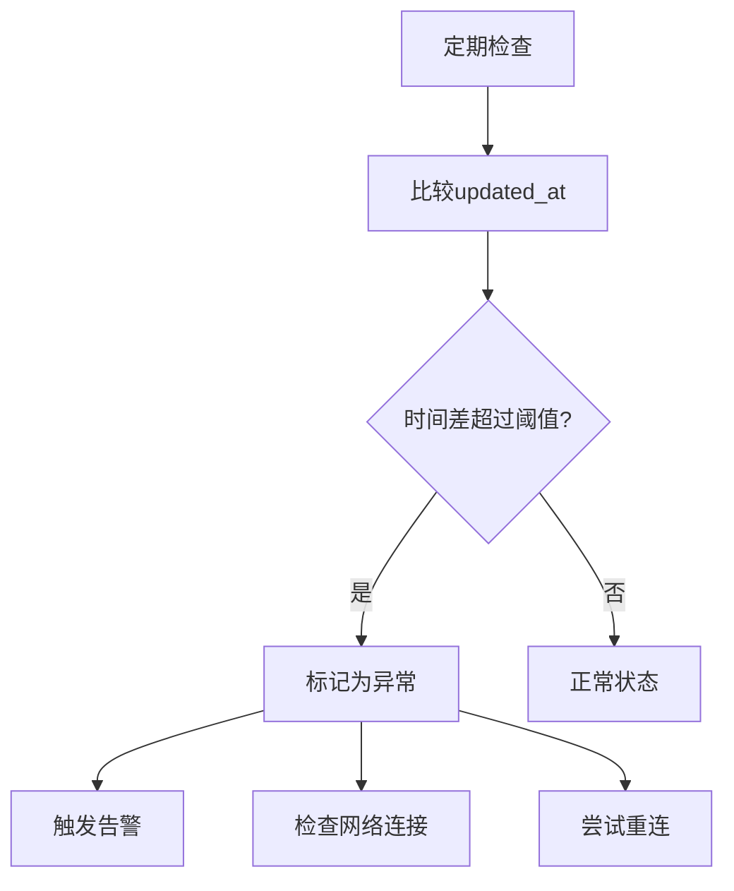

# cookie_status表详细文档

<cite>
**本文档中引用的文件**
- [db_manager.py](file://db_manager.py)
- [cookie_manager.py](file://cookie_manager.py)
- [reply_server.py](file://reply_server.py)
- [XianyuAutoAsync.py](file://XianyuAutoAsync.py)
- [static/js/app.js](file://static/js/app.js)
- [Start.py](file://Start.py)
</cite>

## 目录
1. [简介](#简介)
2. [表结构设计](#表结构设计)
3. [核心字段详解](#核心字段详解)
4. [数据库关系](#数据库关系)
5. [状态管理机制](#状态管理机制)
6. [事务性操作](#事务性操作)
7. [API接口设计](#api接口设计)
8. [前端交互](#前端交互)
9. [后台任务集成](#后台任务集成)
10. [监控与异常检测](#监控与异常检测)
11. [性能优化](#性能优化)
12. [最佳实践](#最佳实践)

## 简介

`cookie_status`表是系统实时状态管理的核心组件，专门负责跟踪每个Cookie账号的启用/禁用状态。该表通过`enabled`字段实现动态启停控制，支持无需删除账号即可暂停监控的功能，同时通过`updated_at`字段记录状态变更时间，为系统监控和异常检测提供重要依据。

## 表结构设计



**图表来源**
- [db_manager.py](file://db_manager.py#L140-L147)

**章节来源**
- [db_manager.py](file://db_manager.py#L140-L147)

## 核心字段详解

### enabled字段 - 动态启停控制

`enabled`字段是系统状态管理的核心，采用布尔类型存储账号的启用状态：

- **默认值**: `TRUE`（启用状态）
- **功能**: 控制账号是否参与自动回复和监控任务
- **动态切换**: 支持实时启用/禁用，无需删除账号
- **业务价值**: 提供灵活的运营控制能力，可在不停机情况下暂停特定账号

### updated_at字段 - 时间戳追踪

`updated_at`字段记录状态变更的时间信息：

- **数据类型**: `TIMESTAMP`
- **默认值**: `CURRENT_TIMESTAMP`
- **用途**: 
  - 监控心跳检测
  - 异常状态识别
  - 状态变更审计
  - 性能分析基准

**章节来源**
- [db_manager.py](file://db_manager.py#L142-L146)

## 数据库关系

### 与cookies表的一对一关系

`cookie_status`表与`cookies`表建立了一对一的外键关系：



**图表来源**
- [db_manager.py](file://db_manager.py#L142-L146)

这种设计确保了：
- **数据完整性**: 每个Cookie都有对应的状态记录
- **级联操作**: 删除Cookie时自动清理状态记录
- **查询效率**: 通过主键关联实现快速状态查询

**章节来源**
- [db_manager.py](file://db_manager.py#L142-L146)

## 状态管理机制

### 状态查询流程



**图表来源**
- [cookie_manager.py](file://cookie_manager.py#L303-L321)
- [db_manager.py](file://db_manager.py#L1737-L1747)

### 状态更新机制

状态更新采用事务性操作确保数据一致性：



**图表来源**
- [cookie_manager.py](file://cookie_manager.py#L303-L321)

**章节来源**
- [cookie_manager.py](file://cookie_manager.py#L303-L321)
- [db_manager.py](file://db_manager.py#L1721-L1734)

## 事务性操作

### 数据库事务保障

系统通过数据库事务确保状态更新的原子性：

```python
# 事务性状态更新示例（概念性代码）
with self.lock:
    try:
        cursor = self.conn.cursor()
        cursor.execute('''
        INSERT OR REPLACE INTO cookie_status (cookie_id, enabled, updated_at)
        VALUES (?, ?, CURRENT_TIMESTAMP)
        ''', (cookie_id, enabled))
        self.conn.commit()
    except Exception as e:
        self.conn.rollback()
        raise
```

### 锁机制保护

使用可重入锁（`threading.RLock()`）保护并发访问：

- **线程安全**: 防止多个线程同时修改同一账号状态
- **递归安全**: 允许同一线程多次获取锁
- **性能优化**: 减少不必要的锁竞争

**章节来源**
- [db_manager.py](file://db_manager.py#L51-L51)
- [db_manager.py](file://db_manager.py#L1721-L1734)

## API接口设计

### 状态更新API

系统提供了完整的RESTful API支持状态管理：

| 端点 | 方法 | 功能 | 参数 |
|------|------|------|------|
| `/cookies/{cid}/status` | PUT | 更新账号状态 | `enabled: bool` |
| `/cookies/details` | GET | 获取所有账号详情 | 无 |
| `/cookies/{cid}/details` | GET | 获取单个账号详情 | 无 |

### API响应格式

```json
{
  "msg": "status updated",
  "enabled": true,
  "timestamp": "2024-01-15T10:30:00Z"
}
```

**章节来源**
- [reply_server.py](file://reply_server.py#L2337-L2355)
- [reply_server.py](file://reply_server.py#L1153-L1179)

## 前端交互

### 实时状态切换

前端通过JavaScript实现账号状态的实时切换：

```javascript
async function toggleAccountStatus(accountId, enabled) {
    const response = await fetch(`/cookies/${accountId}/status`, {
        method: 'PUT',
        headers: {
            'Content-Type': 'application/json',
            'Authorization': `Bearer ${authToken}`
        },
        body: JSON.stringify({ enabled: enabled })
    });
}
```

### 界面反馈机制

- **视觉指示**: 状态切换时更新UI元素样式
- **状态徽章**: 显示启用/禁用状态图标
- **操作提示**: 提供清晰的操作反馈信息

**章节来源**
- [static/js/app.js](file://static/js/app.js#L1690-L1755)

## 后台任务集成

### 状态变化触发任务管理

当账号状态发生变化时，系统自动调整相关后台任务：



**图表来源**
- [cookie_manager.py](file://cookie_manager.py#L315-L321)

### 任务生命周期管理

系统维护每个账号的完整任务生命周期：

- **启动阶段**: 初始化WebSocket连接、设置定时任务
- **运行阶段**: 执行心跳检测、处理消息、自动回复
- **停止阶段**: 清理资源、断开连接、取消任务

**章节来源**
- [cookie_manager.py](file://cookie_manager.py#L315-L321)
- [XianyuAutoAsync.py](file://XianyuAutoAsync.py#L236-L277)

## 监控与异常检测

### 心跳监控机制

`updated_at`字段为系统提供了重要的监控指标：



### 异常状态识别

系统通过以下方式识别异常状态：

- **超时检测**: 检查`updated_at`与当前时间的差异
- **状态一致性**: 验证内存状态与数据库状态的一致性
- **任务健康度**: 监控相关后台任务的运行状态

**章节来源**
- [XianyuAutoAsync.py](file://XianyuAutoAsync.py#L5235-L5280)

## 性能优化

### 查询优化策略

1. **索引利用**: `cookie_id`字段作为主键，支持快速查找
2. **批量操作**: 支持批量获取所有账号状态
3. **缓存机制**: 内存中维护状态缓存，减少数据库访问

### 内存管理

```python
# 状态缓存示例（概念性代码）
class CookieManager:
    def __init__(self):
        self.cookie_status: Dict[str, bool] = {}
    
    def get_cookie_status(self, cookie_id: str) -> bool:
        # 优先从内存缓存获取
        if cookie_id in self.cookie_status:
            return self.cookie_status[cookie_id]
        # 从数据库加载
        return db_manager.get_cookie_status(cookie_id)
```

**章节来源**
- [cookie_manager.py](file://cookie_manager.py#L18-L21)

## 最佳实践

### 状态管理建议

1. **及时更新**: 状态变更后立即同步到数据库
2. **一致性检查**: 定期验证内存状态与数据库状态的一致性
3. **异常处理**: 完善的错误处理和回滚机制
4. **监控告警**: 建立状态变更的监控和告警机制

### 安全考虑

- **权限验证**: 确保只有授权用户才能修改账号状态
- **审计日志**: 记录所有状态变更操作
- **数据备份**: 定期备份状态数据以防丢失

### 运维建议

1. **定期巡检**: 检查账号状态的健康状况
2. **容量规划**: 根据账号数量规划数据库性能
3. **故障恢复**: 建立状态异常的快速恢复机制

通过`cookie_status`表的精心设计和实现，系统实现了灵活、高效、可靠的账号状态管理功能，为整个自动化回复系统的稳定运行提供了重要保障。