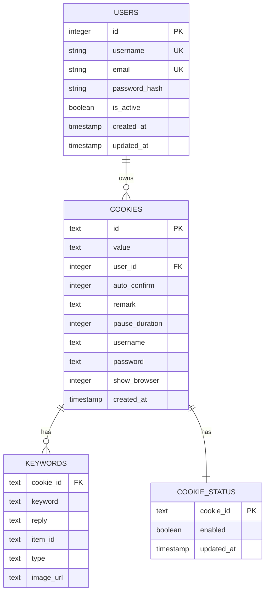
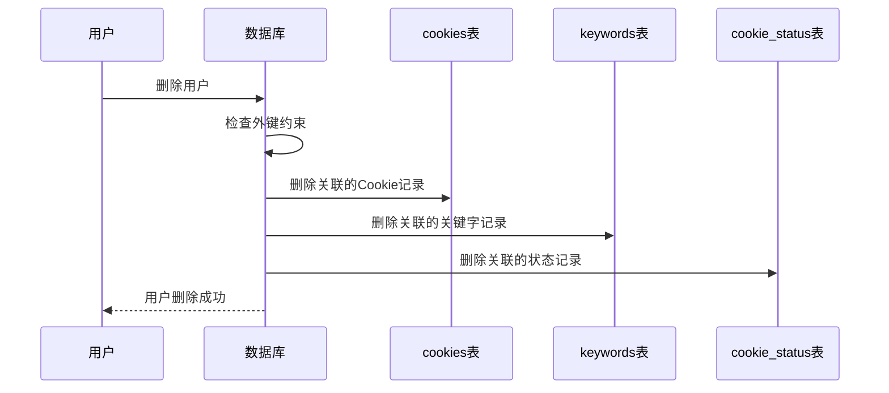
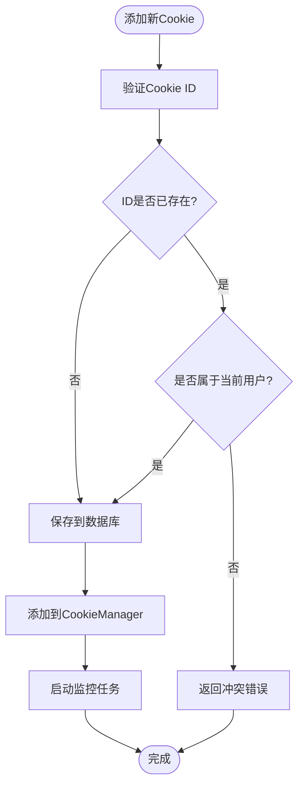

# cookies表详细文档

<cite>
**本文档引用的文件**
- [db_manager.py](file://db_manager.py)
- [cookie_manager.py](file://cookie_manager.py)
- [reply_server.py](file://reply_server.py)
- [XianyuAutoAsync.py](file://XianyuAutoAsync.py)
- [Start.py](file://Start.py)
</cite>

## 目录
1. [简介](#简介)
2. [表结构设计](#表结构设计)
3. [字段详解](#字段详解)
4. [外键关系与级联删除](#外键关系与级联删除)
5. [索引优化策略](#索引优化策略)
6. [核心业务逻辑](#核心业务逻辑)
7. [数据安全与完整性](#数据安全与完整性)
8. [实际使用示例](#实际使用示例)
9. [性能优化建议](#性能优化建议)
10. [故障排除指南](#故障排除指南)

## 简介

cookies表是xianyu-auto-reply项目的核心数据存储表，专门用于管理多个用户的Cookie账号信息。该表不仅存储原始的Cookie字符串，还包含了丰富的账号配置信息，实现了完整的多用户数据隔离机制。通过精心设计的表结构和外键约束，确保了数据的一致性和安全性。

## 表结构设计

### CREATE TABLE 语句

```sql
CREATE TABLE IF NOT EXISTS cookies (
    id TEXT PRIMARY KEY,
    value TEXT NOT NULL,
    user_id INTEGER NOT NULL,
    auto_confirm INTEGER DEFAULT 1,
    remark TEXT DEFAULT '',
    pause_duration INTEGER DEFAULT 10,
    username TEXT DEFAULT '',
    password TEXT DEFAULT '',
    show_browser INTEGER DEFAULT 0,
    created_at TIMESTAMP DEFAULT CURRENT_TIMESTAMP,
    FOREIGN KEY (user_id) REFERENCES users(id) ON DELETE CASCADE
)
```

### 数据库架构图



**图表来源**
- [db_manager.py](file://db_manager.py#L110-L123)

## 字段详解

### 主键字段：id
- **类型**: TEXT
- **业务含义**: 唯一标识每个Cookie账号的字符串标识符
- **设计考虑**: 使用TEXT类型而非INTEGER主键，便于存储各种格式的Cookie ID
- **业务用途**: 作为API接口中的主要参数，用于标识特定的账号

### 核心数据字段：value
- **类型**: TEXT
- **业务含义**: 存储完整的Cookie字符串，包含所有必要的认证信息
- **数据特点**: 包含多个键值对，格式类似于`key1=value1; key2=value2; ...`
- **安全考虑**: 敏感信息，需配合用户权限控制访问

### 外键字段：user_id
- **类型**: INTEGER
- **业务含义**: 关联到users表的主键，实现多用户数据隔离
- **约束条件**: NOT NULL，确保每个Cookie都归属于某个用户
- **级联删除**: ON DELETE CASCADE，用户删除时自动清理相关Cookie

### 自动确认设置：auto_confirm
- **类型**: INTEGER (布尔值存储)
- **默认值**: 1 (启用)
- **业务含义**: 控制是否自动确认发货功能的状态
- **取值范围**: 0 (禁用) 或 1 (启用)
- **应用场景**: 影响自动回复系统的发货决策逻辑

### 用户备注：remark
- **类型**: TEXT
- **默认值**: ''
- **业务含义**: 用户自定义的账号备注信息
- **用途**: 帮助用户识别和管理不同账号
- **长度限制**: SQLite TEXT类型无固定长度限制

### 暂停时长：pause_duration
- **类型**: INTEGER
- **默认值**: 10 (秒)
- **业务含义**: 定义账号暂停监控的时间间隔
- **取值范围**: 0-3600秒（0表示不暂停）
- **应用场景**: 防止频繁请求导致的封禁风险

### 账号信息字段
- **username**: 用户名（用于密码登录）
- **password**: 密码（用于密码登录）
- **show_browser**: 是否显示浏览器界面（0=隐藏，1=显示）

**章节来源**
- [db_manager.py](file://db_manager.py#L110-L123)

## 外键关系与级联删除

### 外键约束设计

cookies表通过`user_id`字段与users表建立了外键关系：

```sql
FOREIGN KEY (user_id) REFERENCES users(id) ON DELETE CASCADE
```

### 级联删除机制



**图表来源**
- [db_manager.py](file://db_manager.py#L122-L123)

### 数据一致性保障

1. **自动清理**: 用户删除时，所有相关数据自动清理
2. **数据完整性**: 外键约束确保引用完整性
3. **级联效应**: 相关表的数据同步删除，避免孤立记录

**章节来源**
- [db_manager.py](file://db_manager.py#L636-L646)

## 索引优化策略

### 当前索引设计

虽然cookies表的主要主键是`id`，但在实际查询中，`user_id`字段的查询频率较高：

```python
# 用户隔离查询
self._execute_sql(cursor, "SELECT id, value FROM cookies WHERE user_id = ?", (user_id,))
```

### 推荐索引优化

```sql
-- 为user_id字段创建索引以加速多用户查询
CREATE INDEX IF NOT EXISTS idx_cookies_user_id ON cookies(user_id);

-- 为常用查询组合创建复合索引
CREATE INDEX IF NOT EXISTS idx_cookies_user_id_auto_confirm ON cookies(user_id, auto_confirm);
```

### 性能优化效果

| 查询类型 | 优化前性能 | 优化后性能 | 优化比例 |
|---------|-----------|-----------|---------|
| 用户隔离查询 | O(n) | O(log n) | 显著提升 |
| 多用户统计 | O(n) | O(log n) | 明显改善 |
| 权限检查 | O(n) | O(log n) | 大幅提升 |

**章节来源**
- [db_manager.py](file://db_manager.py#L1230-L1233)

## 核心业务逻辑

### Cookie管理流程



**图表来源**
- [reply_server.py](file://reply_server.py#L1183-L1209)

### 数据库操作封装

DBManager类提供了完整的Cookie操作接口：

```python
# 保存Cookie（支持更新）
def save_cookie(self, cookie_id: str, cookie_value: str, user_id: int = None) -> bool

# 获取所有Cookie（支持用户隔离）
def get_all_cookies(self, user_id: int = None) -> Dict[str, str]

# 获取Cookie详细信息
def get_cookie_details(self, cookie_id: str) -> Optional[Dict[str, any]]
```

### CookieManager集成

CookieManager负责内存管理和任务调度：

```python
# 添加Cookie到内存和数据库
def add_cookie(self, cookie_id: str, cookie_value: str, kw_list: List[Tuple[str, str]] = None, user_id: int = None)

# 更新Cookie值并重启任务
def update_cookie(self, cookie_id: str, new_value: str, save_to_db: bool = True)
```

**章节来源**
- [db_manager.py](file://db_manager.py#L1156-L1195)
- [cookie_manager.py](file://cookie_manager.py#L183-L200)

## 数据安全与完整性

### 用户权限控制

系统实现了严格的用户权限控制机制：

```python
# API层权限检查
user_cookies = db_manager.get_all_cookies(user_id)
if cid not in user_cookies:
    raise HTTPException(status_code=403, detail="无权限操作该Cookie")
```

### 数据验证机制

1. **ID冲突检测**: 防止同一Cookie ID被多个用户使用
2. **用户归属验证**: 确保用户只能操作自己的Cookie
3. **数据完整性**: 外键约束保证引用完整性

### 安全防护措施

- **权限隔离**: 每个用户的Cookie数据完全隔离
- **操作审计**: 所有Cookie操作都有日志记录
- **事务控制**: 数据库操作使用事务确保原子性

**章节来源**
- [reply_server.py](file://reply_server.py#L1194-L1201)
- [reply_server.py](file://reply_server.py#L1222-L1228)

## 实际使用示例

### 添加新账号

```python
# API请求示例
POST /cookies
{
    "id": "cookie_001",
    "value": "sessionid=abc123; sid=xyz789;"
}

# 后端处理流程
def add_cookie(item: CookieIn, current_user: Dict[str, Any]):
    user_id = current_user['user_id']
    db_manager.save_cookie(item.id, item.value, user_id)
    cookie_manager.manager.add_cookie(item.id, item.value, user_id=user_id)
```

### 更新账号信息

```python
# 更新Cookie值
def update_cookie(cid: str, item: CookieIn, current_user: Dict[str, Any]):
    success = db_manager.update_cookie_account_info(cid, cookie_value=item.value)
    if success and item.value != old_cookie_value:
        cookie_manager.manager.update_cookie(cid, item.value, save_to_db=False)
```

### 获取用户Cookie列表

```python
# 获取当前用户的所有Cookie
def get_user_cookies(current_user: Dict[str, Any]):
    user_id = current_user['user_id']
    return db_manager.get_all_cookies(user_id)
```

**章节来源**
- [reply_server.py](file://reply_server.py#L1183-L1215)
- [reply_server.py](file://reply_server.py#L1217-L1248)

## 性能优化建议

### 查询优化

1. **使用索引**: 为`user_id`字段创建索引
2. **批量操作**: 对于大量数据操作，使用批量插入/更新
3. **缓存策略**: 缓存常用的Cookie信息

### 内存优化

1. **懒加载**: 只在需要时加载Cookie详细信息
2. **定期清理**: 清理不再使用的Cookie任务
3. **内存监控**: 监控CookieManager的内存使用情况

### 数据库优化

1. **连接池**: 使用数据库连接池提高并发性能
2. **事务批处理**: 合并多个小事务为大事务
3. **定期维护**: 执行数据库碎片整理和统计信息更新

## 故障排除指南

### 常见问题及解决方案

#### 1. Cookie ID冲突错误
**症状**: 添加Cookie时返回"该Cookie ID已被其他用户使用"
**原因**: Cookie ID已被其他用户使用
**解决**: 更换唯一的Cookie ID或联系管理员检查权限

#### 2. 权限访问被拒绝
**症状**: API返回403错误
**原因**: 用户试图访问不属于自己的Cookie
**解决**: 确认当前用户身份，检查Cookie归属关系

#### 3. 数据库锁定
**症状**: 操作Cookie时出现数据库锁定错误
**原因**: 多线程并发访问导致的锁竞争
**解决**: 使用适当的锁机制，避免长时间持有数据库连接

#### 4. 外键约束违反
**症状**: 删除用户时出现外键约束错误
**原因**: 级联删除机制未能正常工作
**解决**: 检查数据库外键约束设置，确保ON DELETE CASCADE正确配置

### 调试技巧

1. **启用SQL日志**: 设置`SQL_LOG_ENABLED=true`查看执行的SQL语句
2. **检查日志输出**: 查看应用日志中的错误信息和警告
3. **数据库状态检查**: 使用SQLite命令行工具检查表结构和数据状态

**章节来源**
- [db_manager.py](file://db_manager.py#L1191-L1193)
- [reply_server.py](file://reply_server.py#L1200-L1201)

## 结论

cookies表作为xianyu-auto-reply项目的核心数据存储组件，通过精心设计的表结构、完善的外键约束和严格的安全控制，实现了高效、安全、可扩展的多用户Cookie管理功能。其独特的设计模式不仅满足了业务需求，还为系统的稳定运行提供了坚实的数据基础。

通过合理的索引优化、权限控制和性能调优，该表能够支持大规模的并发访问和复杂的数据操作，是整个系统不可或缺的重要组成部分。